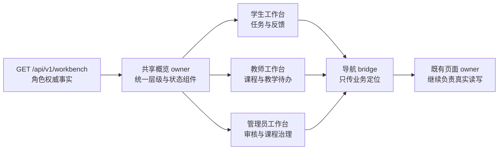

# 星序 Astra — 界面样式、移动端与无障碍

> 子文档编号：16
> 上级文档：[01-开发者手册](../01-开发者手册.md)
> 文档状态：已从原始主文档迁移，保留原有技术事实
> 最近更新：2026-08-28（V8.6.4 / UI-017）
> 更新者：主开发（单线）

集中说明 CSS 加载与断点、触控、DPR、安全区、弹窗滚动和真机验证等界面规范。

---

## V8.6.4 三角色工作台统一表达（UI-017，当前稳定实现）

学生、教师、管理员概览继续由同一个只读 owner `shared/js/role-workbench-overview.js` 渲染，由 `shared/js/role-workbench-bridge.js` 把动作转交给既有角色页面。V8.6.4 没有建立第二套业务状态，也没有让管理员进入教师写入页面。



当前统一规则：

| 层级 | 统一表现 | 不允许出现 |
| --- | --- | --- |
| 身份 | “学生/教师/管理员工作台”中文在前，英文只作辅助识别 | 只有英文的角色标题 |
| 状态 | 待完成、已提交、已批改、已退回、待审批、待发布、待审核等显式胶囊 | 依靠颜色或按钮文字猜状态 |
| 动作 | 完成作业、查看反馈、管理课程、审批申请、批改作业、审核课程 | “管理”“查看”“去完成”等缺少对象的短词 |
| 分类 | 工科试验室、代码空间、未来星系与中文学科名称 | `englab/physics` 等内部 key |
| 治理回执 | 操作、对象、执行结果、生效状态、对账编号、记录时间 | `Action`、`Resource`、`Request ID` 作为主信息 |

学生课程发现、教师课程轨道和管理员课程治理都只改变展示翻译，不改变课程码、课程成员、课程发布、状态转换和审计的原有权限。内部 ID 仍可参与查询和精确对账，但不得作为列表或详情的首要身份。

`20260828v864RoleWorkbenchHarmonyP0` 是本轮统一资源代际。前端全量通过 277 个 JavaScript 语法检查和 81 项合同；真实 Edge 覆盖三角色桌面与 `390×844`，移动端根宽均为 390px、概览可见按钮最小高度均为 44px。浏览器验收同时确认学生“已提交/已批改”、教师“待批改”和管理员“待审核”状态真实渲染。

---

## 12. CSS 设计系统

### 12.1 加载顺序（严格遵守）

```
1. tokens.css      → 设计令牌（变量定义）
2. base.css        → 全局重置 + 页面系统 + focus-visible
3. typography.css   → 排版
4. navbar.css      → 导航栏
5. page-layout.css → Hero 区域
6. module-selector.css → 模块选择器
7. [各页面 CSS]     → 页面特有样式
8. responsive.css  → 响应式（必须最后）
```

### 12.2 断点

```css
@media (max-width: 768px)  { /* 平板 */ }
@media (max-width: 480px)  { /* 手机 */ }
```

---

---

## 12.5 移动端开发规范（v4.2.1 新增）

> 任何涉及首页、实验、工具组件的代码改动都需对照本节核查。

### 12.5.1 Canvas 交互必须配套触控事件

只要 Canvas 上有 `mousedown` / `mousemove` / `click` 监听并影响渲染或状态，**必须**同步实现 `touchstart` / `touchmove` / `touchend`：

- `touchstart` 内调用 `e.preventDefault()` 阻止浏览器默认手势，并加 `{ passive: false }`
- `touchmove` 默认 `{ passive: true }`，除非要 preventDefault 才改为 false
- 通过 `e.touches[0].clientX/Y` 替代 `e.clientX/Y`
- 移动端无 hover：考虑用 **long-press（350ms）** 模拟"预览"状态（参考 [pages/biology/cell-structure.js](../../pages/biology/cell-structure.js)）

### 12.5.2 Canvas DPR 适配模板

```js
_resize() {
    const rect = this.container.getBoundingClientRect();
    const dpr = window.devicePixelRatio || 1;
    this.canvas.width = rect.width * dpr;
    this.canvas.height = rect.height * dpr;
    this.canvas.style.width = rect.width + 'px';
    this.canvas.style.height = rect.height + 'px';
    this.ctx.setTransform(dpr, 0, 0, dpr, 0, 0);
    this.W = rect.width; this.H = rect.height;
}
// 配合 ResizeObserver(this.container) 监听容器变化
```

### 12.5.3 断点必覆盖项

新增页面/组件时确保：

| 断点 | 必检 |
|------|------|
| 1024px 平板 | 多列网格转 2 列、侧边栏折叠 |
| 768px 移动 | 顶导转 icon-only、按钮 ≥ 44px、单列 |
| 640px | 弹窗 width 95vw、padding 缩小 |
| 480px 小屏 | 字号缩 1 级、padding 再压一档、`width: 96vw` |

### 12.5.4 固定定位元素的 safe-area-inset

底部固定按钮（FAB / 帮助按钮 / 通知条）在带刘海的 iPhone 上会被 home indicator 遮挡，**必须**用 `env(safe-area-inset-bottom)` 补齐：

```css
.fab {
    bottom: calc(80px + env(safe-area-inset-bottom, 0px));
}
.notif-bar {
    bottom: max(16px, env(safe-area-inset-bottom, 16px));
}
```

### 12.5.5 弹窗模态必须可滚动

任何 modal 卡片必须有 `max-height: 90vh; overflow-y: auto; -webkit-overflow-scrolling: touch;`，否则在小屏 + 长内容下会被截断且无法滚动。

### 12.5.6 触控设备专属样式

通过 `@media (hover: none) and (pointer: coarse)`：
- 卡片去除 `:hover` 上浮效果，改用 `:active`
- 卫星标签、悬浮提示等 hover-only 元素改为常显
- 顶导按钮放大到 ≥ 44px 触摸目标

### 12.5.7 真机验证局限

VS Code 集成 Playwright 模式下 `setViewportSize` 不能真实模拟移动 viewport（已实测）。移动端验证应使用：
1. Chrome DevTools 的 mobile emulation（最低门槛）
2. 真机连 USB 调试（最准确）
3. BrowserStack / 类似服务（覆盖度）

---
