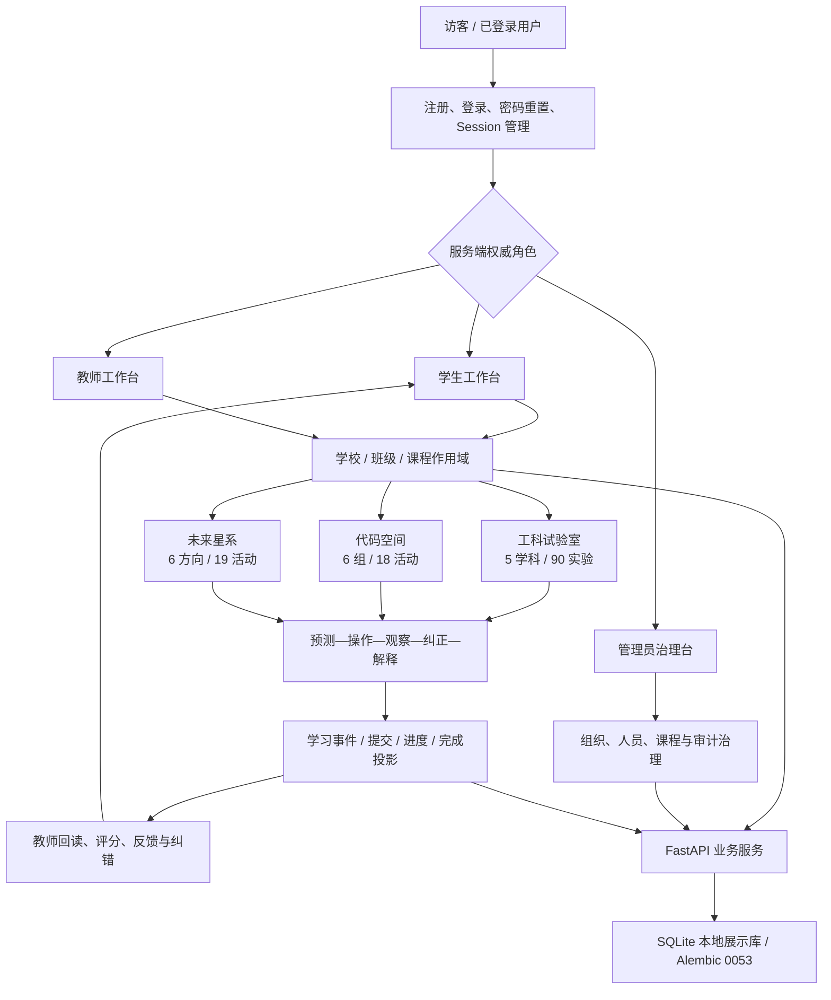
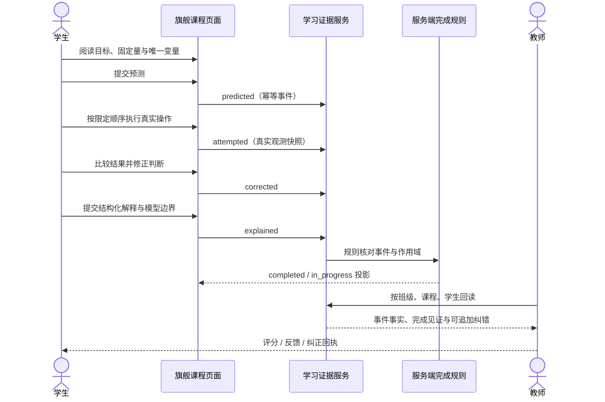

# 星序 Astra — 当前功能、业务闭环与展示边界

> 子文档编号：19
> 上级文档：[01-开发者手册](../01-开发者手册.md)
> 文档状态：已从原始主文档迁移，保留原有技术事实
> 最近更新：2026-08-25
> 更新者：DOC 组（主开发单线兼任）

集中保存 V8.0.34—V8.3.4 的集成状态、三角色业务闭环、学习空间完成层次与展示边界。

> **V8.3.4 现行覆盖说明**：当前正式目录为工科试验室 90、代码空间 18、未来星系 19，共 127 项；`#engineering` 已恢复为直接桥梁实验，`#engineering/robot-arm-ik` 是新增的独立机械臂实验。下文保留的 V8.0 Engineering/Physics 旗舰证据链属于历史实现记录，不得据此重新给现有实验增加课程壳。

---
## 19. V8.0.34 当前集成状态与维护路线

本节把当前产品结构、教学主线和暂停边界汇总为维护入口；详细任务和未来版本仍以 [`02-更新规划.md`](../02-更新规划.md) 为准。

### 19.1 运行与数据架构

```text
浏览器 SPA / 三角色工作台 / 三个学习空间
              │
              ├─ AstraPageRegistry + Router + ModuleSelector
              │          │
              │          ├─ 工科试验室 90 实验
              │          ├─ 代码空间 18 活动
              │          └─ 未来星系 19 活动
              │
              ├─ AstraApiClient（Cookie Session / no-store / scope gate）
              │          │
              │          └─ FastAPI endpoint → domain service → model
              │                                      │
              │                                      └─ SQLite 展示库 / Alembic 0053
              │
              └─ Learning Evidence runtime
                         ├─ predicted / attempted / corrected / explained
                         ├─ 幂等写入与恢复投影
                         ├─ completed 仅由服务端规则派生
                         └─ 教师按 class/course/student 回读
```

### 19.2 参赛展示主线

```text
学生工作台：当前班课 → 本节目标 → 预计产出 → 唯一下一动作 → 完成回执
                              │
                              ├─ Engineering：预测 → B → C → 判断 → D → 纠正 → 解释
                              │                 └─ Canvas / B-C-D 表 / delta / 模型边界
                              │
                              └─ Physics：预测 → e=.40 → e=.80 → 比较 → 纠正 → 解释
                                                └─ 真实 loop / 首峰 HUD / h/H 表 / 理想参照

教师工作台：当前班课 → 发布/批改下一动作 → 学生进度 → 证据事实 → 反馈与回执
```

### 19.3 当前模块完成情况

| 模块 | 当前实现 | 维护边界 |
| --- | --- | --- |
| 身份与三角色 | 学生、教师、管理员由服务端 Session 权威决定；角色资源延迟加载且不进入共享缓存 | 前端显隐不得替代后端授权 |
| 师生工作台 | 已形成当前班课、目标、预计产出、唯一动作与回执；桌面和 390 样式已接入 V832 | V834 移动回执仍待同 revision 最终浏览器复验 |
| 工程实验 | `#engineering` 保留独立桥梁桁架和 B/C/D 节点荷载观察；`#engineering/robot-arm-ik` 提供三连杆拖动、关节限位、残差、暂停和重置 | 两项都保持直接实验，不注入课程正文或 evidence；路由 owner 负责先销毁再切换 |
| 力学旗舰课 | 只改变 `e=.40/.80`，真实下降/碰撞/首峰、HUD、测量表、比较、纠正与解释 | `H/g/r/vx/damping` 固定；自由探索不推进课程证据 |
| 学习证据 | 幂等事件、离线重放、服务端完成投影、教师回读，以及 0053 双游标服务器恢复半包已进入主线 | 现有旗舰页面仍使用既有证据 owner；统一活动内核、完整 IndexedDB pending 与页面步骤级精确续学尚未接通。客户端不得写 `completed`，读/刷新不得增殖事件 |
| 本地交付 | `astra-local.ps1 + SQLite + 127.0.0.1:9001` 同源运行 | 只代表本地展示版，不代表公网生产、真实 MySQL 或真实课堂实证 |
| 管理治理 | 用户、学校、班级、课程状态、影响确认、乐观并发和审计回读已具备 | 深度分析、任意批量治理和生产运维继续后置 |

### 19.4 当前暂停与恢复顺序

1. 根工作区保持 `主开发@V8.0.36` clean；五个专业长期对接任务已归档，协作代理树仅剩 `/root`，没有后台工作组或非主 Git worktree。
2. 七个脏现场均已转为具名 stash，`u358@3734a2f` 的唯一提交仍由原分支保存；全部 66 条本地分支均保留，恢复索引见 [35-V8 版本发布历史](../03-子文档/35-V8版本发布历史.md) 的 V8.0.35—V8.0.36 记录。
3. 恢复开发时默认继续由用户与主开发单线推进；只有用户以后明确要求并行时，才按实际任务建立最小工作组和新工作树，不批量复活旧组。
4. 恢复产品推进后的第一优先级仍是 V8.0.34 产品字节或新统一 revision 的浏览器终验；之后直接进入师生可见体验、旗舰课程表现和竞赛素材，不先扩张深层后端。

---

---

## 20. V8.0.36 全局功能、业务闭环与展示边界

本节从“用户能做什么、数据怎样流转、评委能看到什么”重新盘点当前系统。它不以文件数量代替产品完成度，也不把已有后端接口自动等同于前端已经完整呈现。

### 20.1 产品与业务全景



当前仓库约有 640 个受跟踪文件、239 个受跟踪 JavaScript、266 个 Python 文件和 179 个 FastAPI 路由装饰器。这些数字说明项目有真实工程体量，但优秀作品的判断仍取决于下面的业务闭环是否能被稳定演示，而不是代码量本身。

### 20.2 三角色已经实现的业务逻辑

| 角色 / 场景 | 已实现流程 | 权威事实来源 | 当前展示边界 |
| --- | --- | --- | --- |
| 访客与身份 | 注册、登录、退出、密码重置请求/确认、查看和撤销会话；登录后再按角色加载资源 | `/api/auth/*`、`/api/users/me` 与 HttpOnly Cookie Session | 本地展示可用；不把本机账号体系包装成公网生产身份平台 |
| 学生入班 | 无班级时不能绕过入班；输入班级 ID/代码后提交加入，回读本人班级列表确认；网络结果不明时不盲目重投 | 班级、成员关系、加入请求与本人列表 | 流程真实，但首次演示仍依赖预置账号/班级，尚缺一套面向评委的一键演示脚本 |
| 学生选课与继续学习 | 选择班级后只读取该班已发布课程；选择课程后读取 exact-open 单元、作业、个人进度、积分与知识快照；焦点区显示当前班课、本节目标、预计产出、下一动作和完成回执 | 班级—课程挂接、发布计划、单元访问处置、个人进度 | 主线已经清楚；总览、学习空间与三个星系之间仍存在入口层级偏多、返回语义不完全一致的问题 |
| 学生作业 | 查看待完成/待反馈/已批改作业，提交文本答案，网络不确定时先回读再决定，不重复提交；查看得分和教师反馈 | 作业、班级 audience/policy、submission 与 grade | 能演示完整闭环；作业编辑和反馈呈现仍偏管理表单风格 |
| 教师备课与发布 | 选择学校、班级、课程，挂接课程，查看单元，创建作业，设置班级 audience/policy，编排 open/locked/hidden 发布节奏并预览确认 | 课程、单元、挂接、release plan 与乐观并发版本 | 功能丰富，但首屏信息密度偏高；“今日要教什么、下一步做什么”仍需比治理字段更突出 |
| 教师授课后处理 | 查看班级成员、学生进度、待批改作业、代码提交和学习证据；评分、反馈、追加式纠错，并在同一班课范围回读结果 | class/course/generation 作用域、submission、evidence aggregate 与 correction | 已能证明不是静态后台；仍缺少从真实证据计算的简明误区摘要与行动建议，不能用虚构统计补位 |
| 管理员治理 | 查看统计、学校、班级、用户、加入请求、课程状态、内容版本、审计、后台任务与告警；受约束地变更角色/状态、组织状态与课程治理 | 管理 API、版本/影响确认、审计记录 | 后端与治理面很深，但不是当前竞赛主线；只需保留一个清晰总览和少量可讲述操作，不再深挖生产运维 |
| 内容发布 | 建立、修改、提交、撤回、退修、发布内容草稿，查看版本差异并回滚；脚本资源另有审核边界 | content draft/page/version 与审核状态 | 服务端链路完整度高于可见创作体验；当前不投入通用 CMS 重构，只在竞赛路线中补课程内容本身 |

### 20.3 三个学习空间的真实完成层次

| 学习空间 | 已实现的可见能力 | 深度判断 | 对竞赛的使用方式 |
| --- | --- | --- | --- |
| 工科试验室 | 数学 20、物理 21、化学 18、算法 12、生物 19，共 90 个可视化实验；包含 Canvas、图表、模拟、3D 与响应式实验页 | 内容广度很强，但不同实验的模型、交互和说明深度并不完全一致；系统不再给课程划分精品或普通等级 | 作为内容规模与可扩展性背景，可按场景选择力学、双摆、色谱等少量实验深入展示 |
| 代码空间 | 程序起步、控制流程、数据与函数、算法思维、调试与测试、挑战与提交 6 组 18 活动；支持 JavaScript、Python、C、C++ 的预测、运行、轨迹、公开样例预检和正式提交接口 | 浏览器学习运行时与代码修订业务真实存在；默认隔离 runner 不可用，因此不能声称正式 OJ 判题已经完成 | 以 `control-flow.loop-boundary` 做一条 60—90 秒“预测—运行—追踪—修正”辅助展示，诚实显示正式评测边界 |
| 未来星系 | 地球与宇宙、工程、数据、信息、材料、人文 6 方向 19 活动，包含 Canvas、按需 Three.js 与新增机械臂互动 | 目录和基础互动完整；工程方向当前有直接桥梁和机械臂页面，历史 `engineering.load-path` 证据身份不等于当前页面仍运行旧课程链 | 作为跨学科内容空间，按教师授课课程选择活动；不强行给每项活动接入完整证据内核 |

### 20.4 两门旗舰课的核心闭环



- `physics.mechanics` 固定落高、重力、半径、水平速度和阻尼，只比较 `e=0.40` 与 `e=0.80`；页面必须等待真实下降、碰撞和第一次反弹峰值，再把实测 `h/H` 与理想 `e²` 对照。自由探索、乱序或未确认回执不能推进课程事实。
- `engineering.load-path` 使用固定 60 kN、15 杆教学桁架，按 B 基线、C 变量变化、观察后判断、D 镜像纠正推进；Canvas、支座反力、杆力、差值和模型边界来自同一次精确求解结果，动画不反向制造证据。
- 两课都由客户端写 `predicted/attempted/corrected/explained`，由服务端规则派生 `completed`。这条“学生不能自己宣布完成”的边界是当前最有论文价值的技术差异化之一。

### 20.5 技术层已经不是空壳，但不再是首要投入点

| 技术层 | 当前已有 | 展示期决策 |
| --- | --- | --- |
| 前端运行 | 原生 JavaScript SPA、页面注册表、Router、ModuleSelector、按角色/页面延迟加载、Service Worker、Canvas/Three.js 生命周期与响应式 | 只做能改善导航、首屏、动效、内容与录屏稳定性的窄修；不重写 React/Vue，不为“现代化”推倒现有页面 |
| 业务后端 | FastAPI endpoint → service → SQLAlchemy model，覆盖身份、组织、课程、作业、代码提交、内容、证据、积分、知识与治理 | 已足以支撑毕设和本地竞赛演示；除展示闭环确实需要外，不再新增加密、审计、后台任务或复杂治理能力 |
| 数据与迁移 | SQLite 本地展示、Alembic 单一 head `20260810_0053`，既有 MySQL DDL/条件门禁 | 展示期只保护现有迁移和数据一致性；真实 MySQL、并发压测、生产备份与发布证据后置 |
| 学习证据 | 幂等事件、服务端完成、纠错、教师聚合、0053 运行身份/双游标服务器半包、统一活动合同 | 两门旗舰继续使用已稳定链路；完整六课统一内核、IndexedDB 精确续学和复杂离线冲突暂缓，不让低可见工作吞噬赛前时间 |
| 代码执行 | 四语言浏览器学习运行时、正式提交/修订/attempt 数据合同、诚实 `runner_unavailable` | 保留公开样例与过程可视化；不在本轮自建隔离 OJ 沙箱，也不冒充判题成功 |

### 20.6 面向优秀毕设 / 多媒体竞赛的当前缺口

按“可运行功能”衡量，项目已经接近完成；按“评委在有限时间内是否能一眼理解、顺畅操作、形成记忆点”衡量，仍有明显尾差：

1. **入口与叙事仍偏复杂**：总览、身份工作区、工科目录、未来星系和独立代码空间都是真实入口，但三分钟演示没有唯一导览主线。
2. **深度分布不均**：两门旗舰课足以证明方法，其余 122 个实验/活动主要证明广度；若连续翻页，容易产生“很多页面、核心研究问题不够集中”的观感。
3. **教师价值没有被压缩成一眼可读的决策**：目前能查到真实提交和证据，却仍需评委理解表格、分页和内部状态；缺少“哪个学生卡在哪一步—依据是什么—教师下一动作是什么”的聚焦表达。
4. **竞赛交付包尚未成型**：缺统一演示账号/种子、三至五分钟脚本、关键截图、短视频、论文图表、能力边界卡和故障后的快速复位流程。
5. **当前最新视觉返修未做同版本终验**：V8.0.34 的移动回执与工程 C/D 同帧需要在同一 revision 上完成真实浏览器复验，不能继承 V8.0.26 或 V8.0.30 的旧结论。
6. **部分技术说明会抢走作品重点**：安全、审计、发布和恢复设计很深，但竞赛讲述若从这些开始，会掩盖学生交互、教学动画与教师反馈这条真正可见的主线。

现阶段应把既有后端视为稳定底座，把主要时间投入师生前端、课程内容、动画、演示数据和交付包装。未来任务、比例与人日估算见 [`02-更新规划.md`](../02-更新规划.md) 第 1.5 节。
