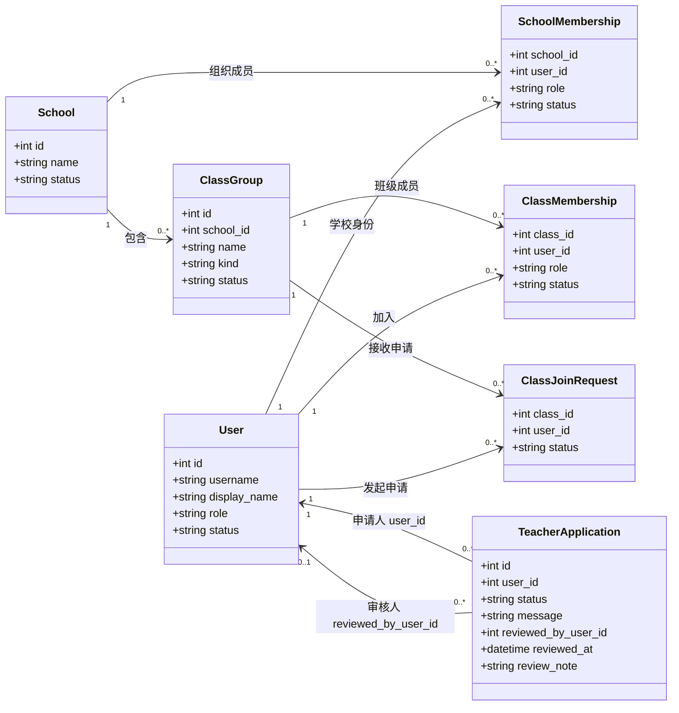
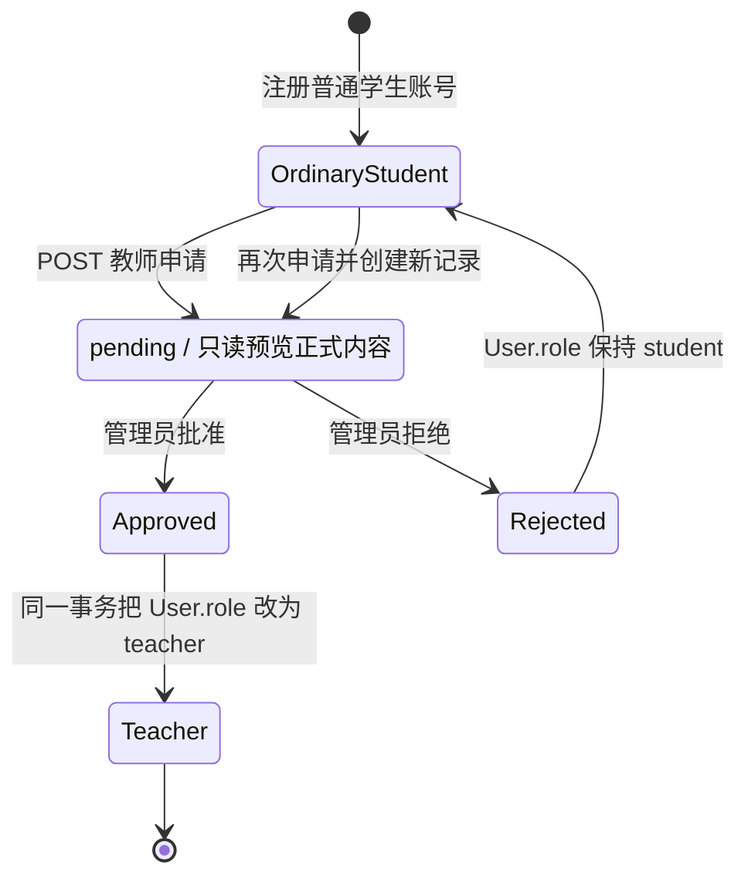
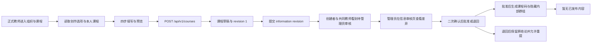
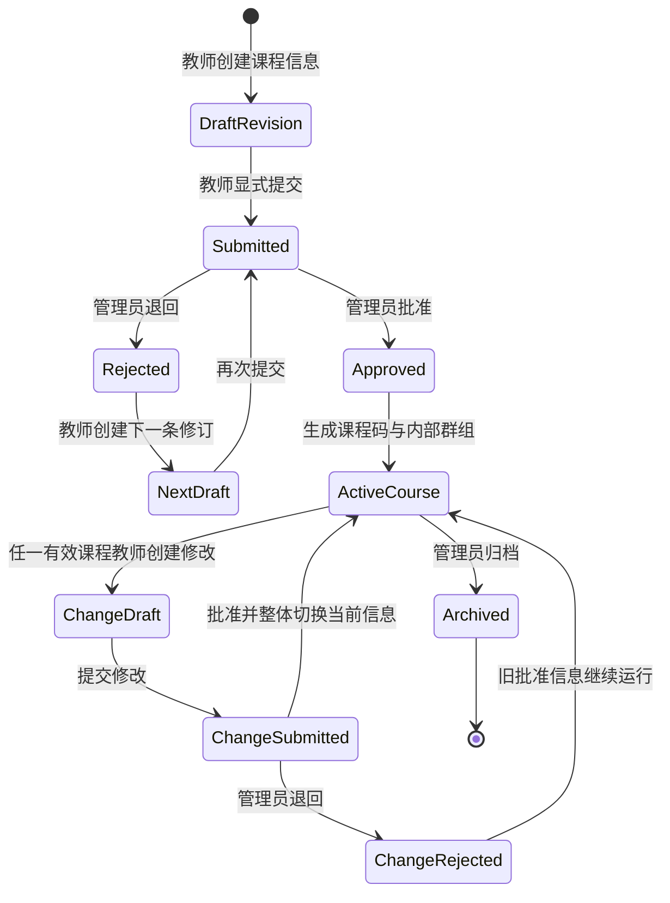
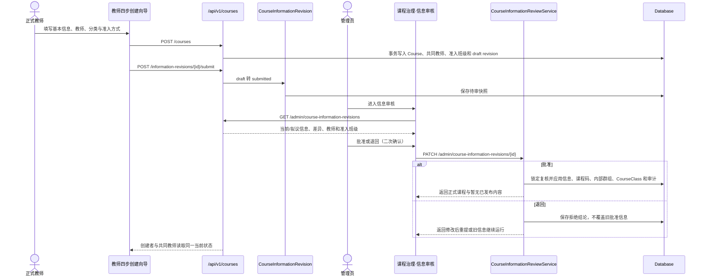
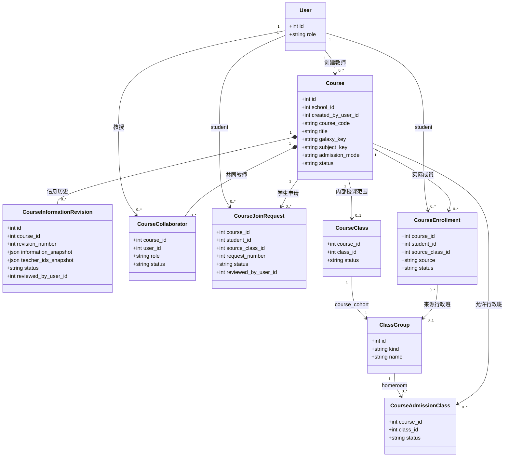
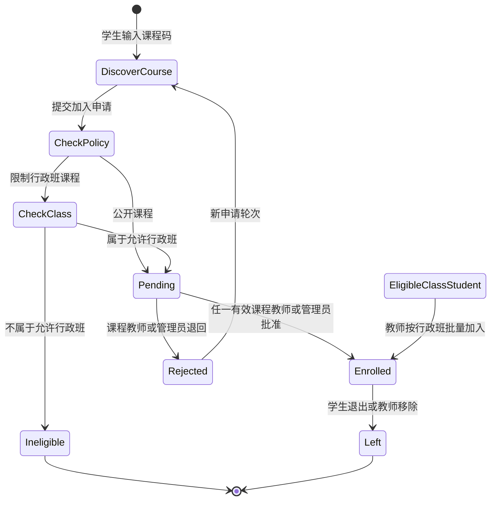
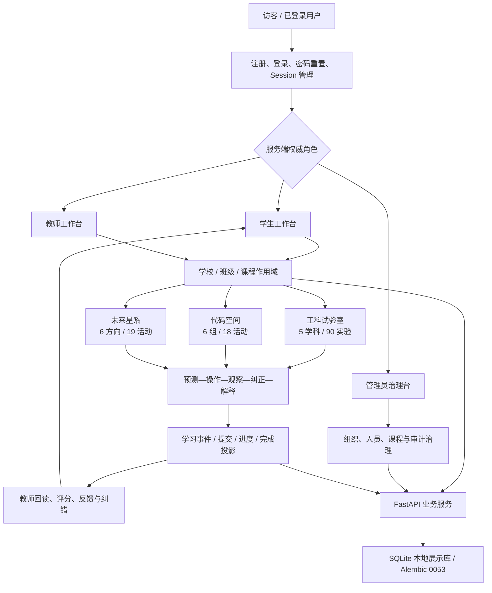
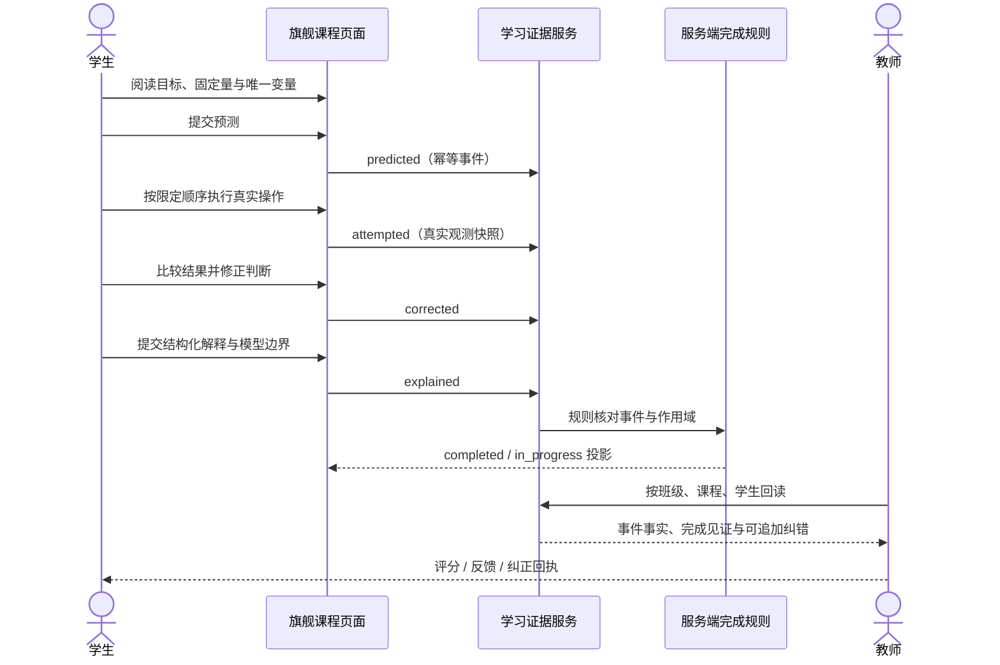

# 星序 Astra — 当前功能、业务闭环与展示边界

> 子文档编号：19
> 上级文档：[01-开发者手册](../01-开发者手册.md)
> 文档状态：已从原始主文档迁移，保留原有技术事实
> 最近更新：2026-08-25（V8.4.3 / FE-040）
> 更新者：DOC 组（主开发单线兼任）

集中保存 V8.0.34—V8.4.3 的集成状态、三角色业务闭环、学习空间完成层次与展示边界。V8.4.2 已将“教师建课—管理员审核—生成课程码”整理为可见业务旅程；V8.4.3 已完成课程码发现、学生申请、教师审批、行政班批量加入、课程名单和保留历史退出的前后端闭环。

> **V8.3.4 现行覆盖说明**：当前正式目录为工科试验室 90、代码空间 18、未来星系 19，共 127 项；`#engineering` 已恢复为直接桥梁实验，`#engineering/robot-arm-ik` 是新增的独立机械臂实验。下文保留的 V8.0 Engineering/Physics 旗舰证据链属于历史实现记录，不得据此重新给现有实验增加课程壳。

---

## V8.4.0 身份、组织与教师申请（当前稳定实现）

本节接收原规划图 `P-02` 与 `P-05`。两幅图已经依据 `87d9f60 / ARCH-010`、`eb47948 / BE-023` 和 `8a22773 / FE-037` 的真实模型、接口与页面修正，状态由“目标态”变为“当前稳定实现”。后续身份与组织维护以本节为准；[`02-更新规划.md`](../02-更新规划.md) 只保留完成结论和本节链接。

### 当前身份与组织类图（原 P-02）

- **状态**：当前稳定实现。
- **数据库基线**：Alembic `20260825_0054 → 20260825_0055`。
- **已经落地**：`TeacherApplication` 申请记录、`ClassGroup.kind` 组织类型、课程 `subject_key`、管理员审核和待审只读门。
- **当前课程组织事实**：`course_cohort` 类型、模型和约束由 V8.4.0—V8.4.1 建立；`BE-025@3fde9af` 已在首次课程信息批准事务中创建真实内部课程群组与唯一 `CourseClass`。班级页面继续只展示 `homeroom`，内部群组不冒充行政班。



`ClassGroup.kind` 只有 `homeroom / course_cohort` 两种值。现有班级创建、班级列表、组织治理和统计接口只把 `homeroom` 当作行政班，避免未来内部课程群组误入行政班页面。课程通过 `galaxy_key / subject_key / course_key` 表示“星系—学科—授课课程”分类，课程单元继续用稳定 `activity_key` 引用独立活动；目录中的历史代表项不再形成课程等级。

### 当前教师申请状态图（原 P-05）

- **状态**：当前稳定实现。
- **公开注册规则**：页面始终先创建普通学生账号；选择“申请教师身份”时再提交申请。`/api/auth/register` 的旧 API 兼容入口没有在本版本强行删除，但公开页面不再用它直接创建教师。
- **待审规则**：服务端对有待审申请的账号实行全局写入失败关闭；只允许读取、查看本人申请、退出或撤销自己的会话。前端只读预览和按钮隐藏只负责解释状态，不承担最终授权。
- **拒绝与重申**：拒绝后用户仍为学生；再次申请会新建一条申请记录，旧记录保持可追溯。



### 当前接口、页面与验收事实

| 范围 | 当前稳定实现 |
| --- | --- |
| 申请者接口 | `POST /api/v1/teacher-applications`、`GET /api/v1/teacher-applications/me` |
| 管理员接口 | `GET /api/v1/admin/teacher-applications`、`PATCH /api/v1/admin/teacher-applications/{id}` |
| 申请者页面 | 注册用途选择、申请说明、待审横幅、状态弹窗、拒绝后再次申请、审核通过后身份刷新 |
| 待审目录 | `pages/planets/planets.js` 使用 `teacher-applicant` 只读视图展示正式活动目录，不进入学生班级/课程工作台 |
| 管理页面 | 管理首页显示待审总数；身份治理页显示申请卡片、审核说明以及批准/拒绝的二次确认 |
| 服务端门禁 | 待审账号的非允许写请求统一返回 `403`，不能通过直接调用 API 绕过页面 |
| 审计 | 创建、批准和拒绝写入教师申请审计动作；重复审核返回冲突，不覆盖原结论 |
| 自动验证 | 隔离提交快照中 6 项后端专项测试通过；259 个受控 JavaScript 文件通过语法检查，70 项前端契约全部通过 |
| 浏览器自验 | 桌面与 `390×844` 已覆盖注册申请、待审只读、管理员列表与二次确认、批准后身份刷新、无横向溢出和无新增 console 错误 |

V8.4.0 完成的是“身份申请与组织语义”闭环，不等于教师已经能走完创建课程、课程审核和学生选课；这些能力继续由 `V8.4.1—V8.4.3` 实现。

---

## V8.4.1 课程关系数据底座（DATA-009 当前稳定实现）

`DATA-009@5596112` 把课程闭环所需的关系模型接入稳定 Alembic 链，`BE-024@4fa147c` 接通教师创建、共同教师可见和信息修订提交，`FE-038@b27b886` 把这条能力整理为教师可见的四步创建向导。数据库基线为唯一 head `20260825_0056`。`BE-025@3fde9af` 与 `FE-039@67a597f` 已完成管理员审核，`BE-026@19e4e5c` 与 `FE-040@81763a3` 已完成课程成员后端和师生可见操作。原规划 P-03、P-07、P-08 均已按真实实现迁入本文档。

### 当前稳定数据对象

| 对象 | 已实现字段与约束 | 当前用途 |
| --- | --- | --- |
| `Course` 扩展 | 可空 `course_code`、学年、上课时间、总课时、`admission_mode`、可空当前信息修订；课程码唯一、总课时为正、准入仅允许 `open / class_restricted` | 承接后续课程创建和审核；旧课程不要求立即产生正式课程码或信息修订 |
| `CourseInformationRevision` | 课程内递增修订号、完整信息快照、教师 ID 快照、创建/提交/审核事实；同一课程的修订号唯一 | 保存课程信息审核历史，不把教学正文放入管理员审核 |
| `CourseAdmissionClass` | 课程、行政班、有效状态；课程与行政班组合唯一 | 表达“指定班级可申请”的资格范围，不等同于课程成员 |
| `CourseJoinRequest` | 学生、来源行政班、申请轮次、说明、审核结果；同一课程/学生/轮次唯一 | 允许拒绝后保留历史并再次申请 |
| `CourseEnrollment` | 学生、来源行政班、加入来源和当前状态；课程与学生组合唯一 | 作为当前课程成员唯一真值，退出时改状态而不是删除历史 |

### BE-024 当前稳定接口与事务

| 接口 | 当前行为 |
| --- | --- |
| `GET /api/v1/courses/authoring-options?school_id=` | 返回当前学校可选的正式教师、有效行政班和两种准入方式；跨校教师和内部课程群组不会进入选项 |
| `POST /api/v1/courses` | 在一个事务中创建 `Course(status=draft)`、共同教师、准入班级和第 1 条 `CourseInformationRevision(status=draft)`；只接受正式教师 |
| `GET /api/v1/courses` | 教师只读取自己创建或作为有效 `editor` 参与的课程草稿；支持按学校筛选 |
| `GET /api/v1/courses/{course_id}` | 创建者和共同教师读取同一份课程、教师、准入班级和最新信息修订 |
| `POST /api/v1/courses/{course_id}/information-revisions/{revision_id}/submit` | 创建者或共同教师把草稿修订锁定并转为 `submitted`；重复提交返回冲突，课程本身仍为 `draft` |

创建载荷包含名称、说明、学年、上课时间、总课时、星系、学科、准入方式、共同教师和允许行政班。星系与学科只做分类：共同教师仍可通过既有课程单元接口引用其他学科的稳定 `activity_key`。创建者不能把自己重复选为共同教师，重复 ID、跨校教师、跨校班级、非行政班和无允许班级的限班课程都会被明确拒绝。

### FE-038 当前可见工作流

教师工作台“组织与课程”区域已经把旧的单页直发课程表单替换为独立、按角色加载的 `teacher-course-authoring` 模块。页面不允许教师选择 `published`，也不再要求教师填写内部 `course_key`；课程码只会在后续管理员首次批准时生成。

| 页面阶段 | 当前稳定行为 |
| --- | --- |
| 基本信息 | 填写课程名称、学年、上课时间、总课时和可选简介 |
| 共同教师 | 从同校正式教师中选择共同教师；创建者不会出现在可选列表中 |
| 分类与准入 | 选择星系、学科，以及公开申请或指定行政班；分类只负责归类和默认筛选 |
| 预览提交 | 汇总全部字段，明确提示提交后为“待管理员审核”，再创建草稿并提交信息修订 |
| 课程列表 | 创建者和共同教师看到同一条课程、同一教师名单和同一审核状态；批准前显示“审核后生成课程码” |
| 失败恢复 | 若课程草稿已创建但提交审核失败，页面保留权威草稿并提供再次提交，不重复创建课程 |



该图是教师端和管理端当前可见路径的简图；完整的当前调用顺序见下文“当前课程创建与信息审核时序图（原 P-08）”。首个不可变内容版本属于 V8.4.4，不是课程信息审批的前置条件。

### 旧数据兼容与当前边界

- 升级时，有活动 `CourseClass` 关联的旧课程回填为 `class_restricted`；没有挂班的旧课程回填为 `open`。旧课程、旧挂班和原有状态均保留。
- 旧课程的课程码、学年、时间、课时、当前信息修订保持为空，不伪造负责人没有填写或管理员没有批准的数据。
- DATA-009 迁移本身不预建 `course_cohort`；真实实例现在只由 `BE-025` 首次批准事务按课程创建，并由 `CourseClass` 形成唯一内部教学范围。
- BE-024 创建阶段仍不批准课程或生成课程码；BE-025 批准后才同步正式信息、共同教师、准入班级、课程码和内部群组。BE-026 只允许学生加入已批准且已生成内部群组的正式课程。
- 教师端已完成四步向导、同一课程列表、待审状态、失败恢复和角色资源独立加载；管理端已完成信息审核列表、当前/拟议差异、教师与准入班级、二次确认、批准/退回回执和响应式对话框。
- 课程信息批准不会生成空白 `CourseRelease` 或 `CourseClassReleaseBinding`；没有真实单元和完成规则时，读取端明确返回“暂无已发布内容”。首个不可变版本留给 V8.4.4 的教师显式发布。
- 最终隔离暂存快照通过 262 个受跟踪 JavaScript 文件语法检查和 72 项前端契约；后端课程审核/创建专项 6 项通过，Alembic 唯一 head 为 `20260825_0056`。
- 浏览器实测覆盖管理员桌面审批、退回、队列更新、首次批准回执与 `390×844` 全屏审核对话框；桌面差异区和移动页面都无横向溢出，无新增 console warning/error。数据库实测确认批准后 release、release unit 和 binding 行数仍为 0；127 项正式活动未修改。

---

## V8.4.2 课程信息审核（BE-025 / FE-039 当前稳定实现）

本节接收原规划图 `P-06` 和 `P-08`。两幅图已经按照 `BE-025@3fde9af` 与 `FE-039@67a597f` 的真实接口、事务、页面和浏览器结果从“目标态”修正为“当前稳定实现”；[`02-更新规划.md`](../02-更新规划.md) 只保留完成结论和本节链接。

### 当前课程信息审核状态图（原 P-06）

- **状态**：当前稳定实现；后端审核和管理员可见页面均已完成。
- **首次批准**：锁定 `submitted` 修订，应用批准信息并同步共同教师和准入班级，生成 8 位不可预测短课程码，创建隐藏 `course_cohort` 和唯一 `CourseClass`，再把课程设为正式运行状态。
- **退回与重提**：被拒修订保持不可覆盖；教师通过 `POST /api/v1/courses/{course_id}/information-revisions` 创建下一修订，再显式提交。
- **运行中修改**：待审或被拒的新修订不会改写当前批准信息、共同教师、准入班级、课程码或内部群组；只有管理员批准后才整体切换。
- **内容边界**：课程信息审核不审批章节、实验、检查点或作业，也不创建占位单元、占位完成规则和空 release。



### 当前接口和返回状态

| 接口 | 当前稳定行为 |
| --- | --- |
| `GET /api/v1/admin/course-information-revisions` | 管理员按状态、学校和分页读取审核队列；默认读取 `submitted`，同时得到拟议信息、当前批准信息、差异字段、拟议/当前教师和准入班级 |
| `PATCH /api/v1/admin/course-information-revisions/{revision_id}` | 管理员以 `approved / rejected` 作出一次性结论；重复审核返回 `409`，不会覆盖第一次结论 |
| `POST /api/v1/courses/{course_id}/information-revisions` | 创建者或当前有效共同教师在上一修订已批准或被拒后创建下一条完整修订；同一课程已有草稿或待审修订时返回冲突 |
| `POST /api/v1/courses/{course_id}/information-revisions/{revision_id}/submit` | 继续复用 BE-024 提交动作，把新修订从 `draft` 转为 `submitted` |
| 课程读取 | 返回 `has_published_content=false`、`content_status=not_published` 和“暂无已发布内容”；V8.4.4 接入真实 release 后再按事实更新 |

### 审核事务与验证证据

首次批准的课程信息、共同教师、准入班级、课程码、内部群组、`CourseClass`、当前修订指针和审计事实属于同一数据库事务。内部群组创建失败时，请求返回失败，课程仍保持 `draft`、课程码为空、修订仍为 `submitted`，也不会残留内部群组或 `CourseClass`。拒绝首次申请不会生成课程码；拒绝运行中修改不会影响正在运行的批准信息。

纯暂存隔离快照排除其他工作区候选后，17 项课程审核、教师建课、课程关系、课程分类、教师申请和课程状态回归全部通过，架构边界契约通过。专项测试还确认：内部群组不会进入行政班列表；若工作区候选发布表存在，审批后 `course_releases` 与 `course_class_release_bindings` 行数仍为 0。Alembic 唯一稳定 head 保持 `20260825_0056`，BE-025 没有新增迁移。

### 管理员可见审核页面

- 管理员从课程治理进入“信息审核”，系统读取待审修订和课程当前状态，没有待审项时显示明确空状态。
- 审核卡片区分“首次批准”和“运行中修改”，展示当前值、拟议值、差异字段、教师名单、准入班级和可选审核说明。
- 批准和退回都要求第二次点击确认；审核说明被修改后，上一次确认立即失效。写入进行期间，页面禁止切换视图或重复提交；结果不明时不自动重试。
- 首次批准回执显示课程码、内部教学群组和“暂无已发布内容”；退回回执明确说明旧批准信息继续运行，或者首次申请可修改后重提。
- 桌面端使用页内审核面板；`390×844` 移动端使用全屏对话框。浏览器实测中两种布局均无横向溢出，console 无新增 warning/error。

### 当前课程创建与信息审核时序图（原 P-08）

- **状态**：当前稳定实现。
- **实际提交**：`BE-024@4fa147c`、`FE-038@b27b886`、`BE-025@3fde9af`、`FE-039@67a597f`。
- **事务边界**：审批服务在一次事务中生成正式信息、课程码、隐藏内部群组、唯一内部教学范围和审计事实；失败时全部回滚。
- **发布边界**：流程不创建 `CourseRelease`、`CourseReleaseUnit` 或 `CourseClassReleaseBinding`；首次真实发布属于 V8.4.4。



### FE-039 验证证据

- 隔离 Git 暂存快照通过全量 `npm test`：262 个受跟踪 JavaScript 文件通过语法检查，72 项前端契约全部通过。
- 后端 `test_course_information_reviews.py + test_course_authoring.py` 共 6 项通过。
- 真实浏览器完成首次批准和运行中退回，验证两次点击才发送写请求；队列从 2 减为 1 再清空。
- 移动端 `390×844` 全屏对话框可完成审核，桌面和移动端的内容宽度等于可见宽度，没有横向滚动。
- 首次批准后数据库中 `course_releases=0`、`course_release_units=0`、`course_class_release_bindings=0`，符合 Q-002 方案 B。

### 当前未完成边界

- V8.4.3 已完成学生加入页面、教师审批、课程名单和行政班批量加入；这些页面只消费课程成员事实，不把行政班改成课程。
- 教师尚不能用结构化编辑器建立真实课程单元和完成规则，也不能生成首个不可变 release；这些属于 V8.4.4。
- 内部课程群组继续只作为兼容现有作业与学习证据结构的隐藏范围，不向学生、教师或管理员冒充行政班。

---

## V8.4.3 课程准入与成员后端（BE-026 当前稳定实现）

`BE-026@19e4e5c` 直接复用 DATA-009 的 `CourseJoinRequest` 和 `CourseEnrollment`，没有新增迁移，也没有把行政班重新改成课程容器。`CourseEnrollment` 仍是课程成员唯一真值；审批或批量加入后，服务端同步激活课程隐藏 `course_cohort` 中的学生成员，使既有作业和学习证据可继续按内部教学范围工作。

### 当前接口与用户边界

| 接口 | 当前稳定行为 |
| --- | --- |
| `GET /api/v1/courses/by-code/{course_code}` | 学生用不区分大小写的课程码查找已批准课程，读取教师、分类、准入方式、可用行政班、最新申请和成员状态 |
| `POST /api/v1/courses/{course_id}/join-requests` | 学生申请公开或指定班级课程；重复发送待审申请返回同一记录，被拒后以新 `request_number` 保留历史并再次申请 |
| `GET /api/v1/courses/{course_id}/join-requests` | 课程创建者、有效共同教师或管理员分页读取待审、已批准、已退回或全部申请 |
| `PATCH /api/v1/courses/{course_id}/join-requests/{request_id}` | 任一有效课程教师或管理员一次性批准/退回；指定班级课程在批准时重新检查学生是否仍属于允许班级 |
| `GET /api/v1/courses/{course_id}/enrollments` | 课程教师或管理员分页读取在读/已退出名单；来源行政班不存在时明确返回“未关联班级” |
| `POST /api/v1/courses/{course_id}/enrollments/batch` | 课程教师或管理员按行政班批量加入；对新增、已加入、曾退出和身份/成员状态异常学生返回逐项结果，不自动恢复曾被移除的学生 |
| `PATCH /api/v1/courses/{course_id}/enrollments/{enrollment_id}` | 学生退出自己的课程，或课程教师/管理员移除学生；只把 enrollment 和内部成员转为非活动，不删除申请、作业、提交或学习事实 |

### 准入、名单与内部群组规则

- 公开课程允许没有行政班的普通学生申请；名单中 `source_class_id=null` 时显示“未关联班级”。
- 指定班级课程在申请和批准两个时点都检查：行政班必须有效、属于同校、仍在课程允许范围，学生成员也必须有效。
- 教师批量加入只为当前有效学生创建成员；已在读、已退出和状态异常者均有可读逐项回执。若学生已有待审申请，批量加入会把该申请标为已批准，不留下永久待审记录。
- 课程成员转为 `active` 时，同一事务内创建或重新激活隐藏 `course_cohort` 的学生 `ClassMembership`；退出时两者都转为非活动。
- 一名学生可在多门课程拥有独立 enrollment；一门课程可同时包含多个行政班学生与无行政班学生。

### 验证与后续实现边界

- 纯 Git 暂存快照排除内容平台、公开导览和学生页候选后，架构边界契约通过；课程成员、信息审核、教师建课、关系模型和课程分类共 14 项后端测试通过，Ruff 通过。
- 专项已覆盖公开课程无班级申请、重复申请、共同教师审批、非课程教师拒绝、限班两次校验、退回后第 2 轮申请、管理员兜底、逐项批量结果、学生自行退出、教师移除、历史保留、一人多课和内部成员同步。
- BE-026 本身只交付后端；`FE-040@81763a3` 已在后续提交中把这些接口接入学生和教师工作台。
- 课程内容共享草稿、不可变发布版本和三种完成规则仍属于 V8.4.4；V8.4.3 不创建空发布版本，也不修改 127 项独立活动。

---

## V8.4.3 学生选课与教师课程名单（FE-040 当前稳定实现）

`FE-040@81763a3` 把 BE-026 的课程成员能力接入现有学生、教师工作台，没有新增模型、迁移或第二套成员关系。学生端和教师端都通过独立按角色加载模块工作；页面只调用稳定 `/api/v1/courses` 接口族，写请求结果不明时不自动重投。

### 当前学生可见旅程

| 页面动作 | 当前稳定行为 |
| --- | --- |
| 查找课程 | 学生输入 4—16 位课程码，读取课程名称、分类、教师、学年、时间、课时、准入方式和当前资格 |
| 公开申请 | 可选择关联本人有效行政班，也可以不关联；无行政班学生仍可申请公开课程 |
| 限班申请 | 只能从服务端返回的允许行政班中选择；资格在提交和教师批准时分别复核 |
| 状态回读 | 页面区分可以申请、待审核、已退回可重申和已加入；被退回后新申请保留新的申请轮次 |
| 加入回执 | 已加入时显示来源行政班或“未关联班级”，并提示从“我的学习”继续课程 |
| 退出课程 | 第一次点击只进入确认态，第二次点击才写入退出；历史 enrollment、申请、提交和学习事实继续保留 |

### 当前教师可见旅程

教师工作台“组织与课程 → 创建授课课程”下方新增“课程成员中心”，只列出已批准且已经生成课程码的本人课程。教师可以在同一页面查看课程码、准入方式、待审数量、在读数量和允许行政班，再完成以下操作：

- 按待审或全部历史筛选加入申请，查看学生账号、申请轮次、申请说明和来源行政班。
- 批准或退回都要求第二次点击确认；审核说明变化后必须重新确认。
- 按在读或全部历史查看名单，来源明确区分“学生申请”“行政班批量加入”和“未关联班级”。
- 移除学生要求第二次点击确认，只改变成员状态，不删除历史。
- 公开课程可以从全部本人行政班中选择批量来源；限班课程只显示允许行政班。
- 批量写入后分别显示新增、已在课、曾退出和不符合资格数量，不自动恢复曾退出或被移除学生。

### 当前课程业务类图（原 P-03）

- **状态**：当前稳定实现。
- **实际提交**：`DATA-009@5596112`、`BE-024@4fa147c`、`BE-025@3fde9af`、`BE-026@19e4e5c`、`FE-038@b27b886`、`FE-039@67a597f`、`FE-040@81763a3`。
- **当前事实**：课程信息审核、共同教师、准入班级、学生申请和课程成员各自保存独立历史；`CourseEnrollment` 是成员唯一真值，`CourseClass` 只连接隐藏内部教学群组。
- **兼容边界**：旧课程可以没有信息修订或内部群组；V8.4 流程首次批准的正式课程必须拥有课程码和唯一内部 `course_cohort`。



### 当前学生加入课程状态图（原 P-07）

- **状态**：当前稳定实现；后端状态、学生回执和教师操作已经一致。
- **资格规则**：公开课程允许无行政班申请；限班课程必须选择服务端返回的允许行政班，并在批准时再次检查。
- **历史规则**：拒绝后创建新的申请轮次；退出或移除只把 enrollment 与隐藏内部成员转为非活动。
- **批量规则**：教师可绕过申请阶段直接批量加入合格行政班学生，但不会自动恢复曾退出者。



### FE-040 验证证据

- 纯 Git 暂存快照通过 265 个受跟踪 JavaScript 文件语法检查和 73 项前端契约；新增 `course-enrollment-fe040-contract`，既有角色移动回执、架构边界和旧活动保护契约继续通过。
- 后端沿用 BE-026 已通过的 14 项课程成员、信息审核、教师建课、关系和分类专项，不新增迁移或接口分叉。
- 真实浏览器完成“学生课程码申请 → 教师二次确认批准 → 名单显示行政班 → 教师按行政班批量加入第二名学生 → 学生回读已加入状态”。
- 批量结果实测为“新增 1、已在课 1、曾退出 0、不符合 0”，名单分别显示“学生申请”和“行政班批量加入”。
- `390×844` 下学生选课和教师成员中心均无横向溢出；可见输入、筛选和操作按钮最小高度为 44px。首轮发现教师筛选框和移除按钮为 38px，已在同一提交中修正并复验。

### 当前未完成边界

- 当前课程成员闭环不等于课程已有教学内容；正式课程仍可能显示“暂无已发布内容”。
- 共享课程草稿、七类内容块、实验引用、显式发布、不可变版本和三种完成规则严格留给 V8.4.4。
- 本任务没有修改 127 项活动，没有接入小程序、服务器部署或竞赛材料。

---

## 19. V8.0.34 当前集成状态与维护路线

本节把当前产品结构、教学主线和暂停边界汇总为维护入口；详细任务和未来版本仍以 [`02-更新规划.md`](../02-更新规划.md) 为准。

### 19.1 运行与数据架构

```text
浏览器 SPA / 三角色工作台 / 三个学习空间
              │
              ├─ AstraPageRegistry + Router + ModuleSelector
              │          │
              │          ├─ 工科试验室 90 实验
              │          ├─ 代码空间 18 活动
              │          └─ 未来星系 19 活动
              │
              ├─ AstraApiClient（Cookie Session / no-store / scope gate）
              │          │
              │          └─ FastAPI endpoint → domain service → model
              │                                      │
              │                                      └─ SQLite 展示库 / Alembic 0053
              │
              └─ Learning Evidence runtime
                         ├─ predicted / attempted / corrected / explained
                         ├─ 幂等写入与恢复投影
                         ├─ completed 仅由服务端规则派生
                         └─ 教师按 class/course/student 回读
```

### 19.2 参赛展示主线

```text
学生工作台：当前班课 → 本节目标 → 预计产出 → 唯一下一动作 → 完成回执
                              │
                              ├─ Engineering：预测 → B → C → 判断 → D → 纠正 → 解释
                              │                 └─ Canvas / B-C-D 表 / delta / 模型边界
                              │
                              └─ Physics：预测 → e=.40 → e=.80 → 比较 → 纠正 → 解释
                                                └─ 真实 loop / 首峰 HUD / h/H 表 / 理想参照

教师工作台：当前班课 → 发布/批改下一动作 → 学生进度 → 证据事实 → 反馈与回执
```

### 19.3 当前模块完成情况

| 模块 | 当前实现 | 维护边界 |
| --- | --- | --- |
| 身份与三角色 | 学生、教师、管理员由服务端 Session 权威决定；角色资源延迟加载且不进入共享缓存 | 前端显隐不得替代后端授权 |
| 师生工作台 | 已形成当前班课、目标、预计产出、唯一动作与回执；桌面和 390 样式已接入 V832 | V834 移动回执仍待同 revision 最终浏览器复验 |
| 工程实验 | `#engineering` 保留独立桥梁桁架和 B/C/D 节点荷载观察；`#engineering/robot-arm-ik` 提供三连杆拖动、关节限位、残差、暂停和重置 | 两项都保持直接实验，不注入课程正文或 evidence；路由 owner 负责先销毁再切换 |
| 力学旗舰课 | 只改变 `e=.40/.80`，真实下降/碰撞/首峰、HUD、测量表、比较、纠正与解释 | `H/g/r/vx/damping` 固定；自由探索不推进课程证据 |
| 学习证据 | 幂等事件、离线重放、服务端完成投影、教师回读，以及 0053 双游标服务器恢复半包已进入主线 | 现有旗舰页面仍使用既有证据 owner；统一活动内核、完整 IndexedDB pending 与页面步骤级精确续学尚未接通。客户端不得写 `completed`，读/刷新不得增殖事件 |
| 本地交付 | `astra-local.ps1 + SQLite + 127.0.0.1:9001` 同源运行 | 只代表本地展示版，不代表公网生产、真实 MySQL 或真实课堂实证 |
| 管理治理 | 用户、学校、班级、课程状态、影响确认、乐观并发和审计回读已具备 | 深度分析、任意批量治理和生产运维继续后置 |

### 19.4 当前暂停与恢复顺序

1. 根工作区保持 `主开发@V8.0.36` clean；五个专业长期对接任务已归档，协作代理树仅剩 `/root`，没有后台工作组或非主 Git worktree。
2. 七个脏现场均已转为具名 stash，`u358@3734a2f` 的唯一提交仍由原分支保存；全部 66 条本地分支均保留，恢复索引见 [35-V8 版本发布历史](../03-子文档/35-V8版本发布历史.md) 的 V8.0.35—V8.0.36 记录。
3. 恢复开发时默认继续由用户与主开发单线推进；只有用户以后明确要求并行时，才按实际任务建立最小工作组和新工作树，不批量复活旧组。
4. 恢复产品推进后的第一优先级仍是 V8.0.34 产品字节或新统一 revision 的浏览器终验；之后直接进入师生可见体验、旗舰课程表现和竞赛素材，不先扩张深层后端。

---

---

## 20. V8.0.36 全局功能、业务闭环与展示边界

本节从“用户能做什么、数据怎样流转、评委能看到什么”重新盘点当前系统。它不以文件数量代替产品完成度，也不把已有后端接口自动等同于前端已经完整呈现。

### 20.1 产品与业务全景



当前仓库约有 640 个受跟踪文件、239 个受跟踪 JavaScript、266 个 Python 文件和 179 个 FastAPI 路由装饰器。这些数字说明项目有真实工程体量，但优秀作品的判断仍取决于下面的业务闭环是否能被稳定演示，而不是代码量本身。

### 20.2 三角色已经实现的业务逻辑

| 角色 / 场景 | 已实现流程 | 权威事实来源 | 当前展示边界 |
| --- | --- | --- | --- |
| 访客与身份 | 注册、登录、退出、密码重置请求/确认、查看和撤销会话；登录后再按角色加载资源 | `/api/auth/*`、`/api/users/me` 与 HttpOnly Cookie Session | 本地展示可用；不把本机账号体系包装成公网生产身份平台 |
| 学生入班 | 无班级时不能绕过入班；输入班级 ID/代码后提交加入，回读本人班级列表确认；网络结果不明时不盲目重投 | 班级、成员关系、加入请求与本人列表 | 流程真实，但首次演示仍依赖预置账号/班级，尚缺一套面向评委的一键演示脚本 |
| 学生选课与继续学习 | 选择班级后只读取该班已发布课程；选择课程后读取 exact-open 单元、作业、个人进度、积分与知识快照；焦点区显示当前班课、本节目标、预计产出、下一动作和完成回执 | 班级—课程挂接、发布计划、单元访问处置、个人进度 | 主线已经清楚；总览、学习空间与三个星系之间仍存在入口层级偏多、返回语义不完全一致的问题 |
| 学生作业 | 查看待完成/待反馈/已批改作业，提交文本答案，网络不确定时先回读再决定，不重复提交；查看得分和教师反馈 | 作业、班级 audience/policy、submission 与 grade | 能演示完整闭环；作业编辑和反馈呈现仍偏管理表单风格 |
| 教师备课与发布 | 选择学校、班级、课程，挂接课程，查看单元，创建作业，设置班级 audience/policy，编排 open/locked/hidden 发布节奏并预览确认 | 课程、单元、挂接、release plan 与乐观并发版本 | 功能丰富，但首屏信息密度偏高；“今日要教什么、下一步做什么”仍需比治理字段更突出 |
| 教师授课后处理 | 查看班级成员、学生进度、待批改作业、代码提交和学习证据；评分、反馈、追加式纠错，并在同一班课范围回读结果 | class/course/generation 作用域、submission、evidence aggregate 与 correction | 已能证明不是静态后台；仍缺少从真实证据计算的简明误区摘要与行动建议，不能用虚构统计补位 |
| 管理员治理 | 查看统计、学校、班级、用户、加入请求、课程状态、内容版本、审计、后台任务与告警；受约束地变更角色/状态、组织状态与课程治理 | 管理 API、版本/影响确认、审计记录 | 后端与治理面很深，但不是当前竞赛主线；只需保留一个清晰总览和少量可讲述操作，不再深挖生产运维 |
| 内容发布 | 建立、修改、提交、撤回、退修、发布内容草稿，查看版本差异并回滚；脚本资源另有审核边界 | content draft/page/version 与审核状态 | 服务端链路完整度高于可见创作体验；当前不投入通用 CMS 重构，只在竞赛路线中补课程内容本身 |

### 20.3 三个学习空间的真实完成层次

| 学习空间 | 已实现的可见能力 | 深度判断 | 对竞赛的使用方式 |
| --- | --- | --- | --- |
| 工科试验室 | 数学 20、物理 21、化学 18、算法 12、生物 19，共 90 个可视化实验；包含 Canvas、图表、模拟、3D 与响应式实验页 | 内容广度很强，但不同实验的模型、交互和说明深度并不完全一致；系统不再给课程划分精品或普通等级 | 作为内容规模与可扩展性背景，可按场景选择力学、双摆、色谱等少量实验深入展示 |
| 代码空间 | 程序起步、控制流程、数据与函数、算法思维、调试与测试、挑战与提交 6 组 18 活动；支持 JavaScript、Python、C、C++ 的预测、运行、轨迹、公开样例预检和正式提交接口 | 浏览器学习运行时与代码修订业务真实存在；默认隔离 runner 不可用，因此不能声称正式 OJ 判题已经完成 | 以 `control-flow.loop-boundary` 做一条 60—90 秒“预测—运行—追踪—修正”辅助展示，诚实显示正式评测边界 |
| 未来星系 | 地球与宇宙、工程、数据、信息、材料、人文 6 方向 19 活动，包含 Canvas、按需 Three.js 与新增机械臂互动 | 目录和基础互动完整；工程方向当前有直接桥梁和机械臂页面，历史 `engineering.load-path` 证据身份不等于当前页面仍运行旧课程链 | 作为跨学科内容空间，按教师授课课程选择活动；不强行给每项活动接入完整证据内核 |

### 20.4 两门旗舰课的核心闭环



- `physics.mechanics` 固定落高、重力、半径、水平速度和阻尼，只比较 `e=0.40` 与 `e=0.80`；页面必须等待真实下降、碰撞和第一次反弹峰值，再把实测 `h/H` 与理想 `e²` 对照。自由探索、乱序或未确认回执不能推进课程事实。
- `engineering.load-path` 使用固定 60 kN、15 杆教学桁架，按 B 基线、C 变量变化、观察后判断、D 镜像纠正推进；Canvas、支座反力、杆力、差值和模型边界来自同一次精确求解结果，动画不反向制造证据。
- 两课都由客户端写 `predicted/attempted/corrected/explained`，由服务端规则派生 `completed`。这条“学生不能自己宣布完成”的边界是当前最有论文价值的技术差异化之一。

### 20.5 技术层已经不是空壳，但不再是首要投入点

| 技术层 | 当前已有 | 展示期决策 |
| --- | --- | --- |
| 前端运行 | 原生 JavaScript SPA、页面注册表、Router、ModuleSelector、按角色/页面延迟加载、Service Worker、Canvas/Three.js 生命周期与响应式 | 只做能改善导航、首屏、动效、内容与录屏稳定性的窄修；不重写 React/Vue，不为“现代化”推倒现有页面 |
| 业务后端 | FastAPI endpoint → service → SQLAlchemy model，覆盖身份、组织、课程、作业、代码提交、内容、证据、积分、知识与治理 | 已足以支撑毕设和本地竞赛演示；除展示闭环确实需要外，不再新增加密、审计、后台任务或复杂治理能力 |
| 数据与迁移 | SQLite 本地展示、Alembic 单一 head `20260810_0053`，既有 MySQL DDL/条件门禁 | 展示期只保护现有迁移和数据一致性；真实 MySQL、并发压测、生产备份与发布证据后置 |
| 学习证据 | 幂等事件、服务端完成、纠错、教师聚合、0053 运行身份/双游标服务器半包、统一活动合同 | 两门旗舰继续使用已稳定链路；完整六课统一内核、IndexedDB 精确续学和复杂离线冲突暂缓，不让低可见工作吞噬赛前时间 |
| 代码执行 | 四语言浏览器学习运行时、正式提交/修订/attempt 数据合同、诚实 `runner_unavailable` | 保留公开样例与过程可视化；不在本轮自建隔离 OJ 沙箱，也不冒充判题成功 |

### 20.6 面向优秀毕设 / 多媒体竞赛的当前缺口

按“可运行功能”衡量，项目已经接近完成；按“评委在有限时间内是否能一眼理解、顺畅操作、形成记忆点”衡量，仍有明显尾差：

1. **入口与叙事仍偏复杂**：总览、身份工作区、工科目录、未来星系和独立代码空间都是真实入口，但三分钟演示没有唯一导览主线。
2. **深度分布不均**：两门旗舰课足以证明方法，其余 122 个实验/活动主要证明广度；若连续翻页，容易产生“很多页面、核心研究问题不够集中”的观感。
3. **教师价值没有被压缩成一眼可读的决策**：目前能查到真实提交和证据，却仍需评委理解表格、分页和内部状态；缺少“哪个学生卡在哪一步—依据是什么—教师下一动作是什么”的聚焦表达。
4. **竞赛交付包尚未成型**：缺统一演示账号/种子、三至五分钟脚本、关键截图、短视频、论文图表、能力边界卡和故障后的快速复位流程。
5. **当前最新视觉返修未做同版本终验**：V8.0.34 的移动回执与工程 C/D 同帧需要在同一 revision 上完成真实浏览器复验，不能继承 V8.0.26 或 V8.0.30 的旧结论。
6. **部分技术说明会抢走作品重点**：安全、审计、发布和恢复设计很深，但竞赛讲述若从这些开始，会掩盖学生交互、教学动画与教师反馈这条真正可见的主线。

现阶段应把既有后端视为稳定底座，把主要时间投入师生前端、课程内容、动画、演示数据和交付包装。未来任务、比例与人日估算见 [`02-更新规划.md`](../02-更新规划.md) 第 1.5 节。
