# 星序 Astra — 当前功能、业务闭环与展示边界

> 子文档编号：19
> 该文档隶属于[01-开发者手册](../01-开发者手册.md)，解释课程业务与当前结果回读。
> 文档状态：已从原始主文档迁移，保留原有技术事实
> 最近更新：2026-09-07（正式门户接入；普通开发提交，未新增产品发布号）
> 更新者：BE组 / ARCH组（主开发单线）

集中保存 V8.0.34—V8.6.6 的集成状态、三角色业务闭环、学习空间完成层次与展示边界。V8.4 已闭合课程业务，V8.5 把既有事实整理为四项可见展示增强，V8.6 再完成主演示清理、课程健康只读聚合、管理员健康矩阵、三角色工作台统一、阶段终验和三星系学生课程投影；上述版本均未修改实验本体。

> **V8.3.4 现行覆盖说明**：当前正式目录为工科试验室 90、代码空间 18、未来星系 19，共 127 项；`#engineering` 已恢复为直接桥梁实验，`#engineering/robot-arm-ik` 是新增的独立机械臂实验。下文保留的 V8.0 Engineering/Physics 旗舰证据链属于历史实现记录，不得据此重新给现有实验增加课程壳。

---

## 正式门户接入的服务修正（BE-042，2026-09-07）

本节是 2026-09-07 接入阶段的当前后端事实，下面按 V8 编排的章节继续承担历史实现说明。正式门户的页面范围见 [01 第 5.4 节](../01-开发者手册.md#54-qianduan-独立前端原型)，后续课程家族、跨分叉同步与候选内容审核仍以 [02](../02-更新规划.md) 的待实施任务为准。

| 本轮实现 | 权威入口与约束 |
| --- | --- |
| 本人资料修改 | `PATCH /api/users/me` 仅接收显示名称；请求层只做适配，`services/user_profile.py` 处理保存与审计，不能借此改角色 |
| 本人笔记 | `/api/users/me/notes` 提供分页读取、创建、修改、删除；所有查询限定本人，修改和删除携带 `expected_revision`，过期写入返回 409，正文保留缩进和换行 |
| 课程资料草稿修正 | `PATCH /api/v1/courses/{course_id}/information-revisions/{revision_id}` 使用整数 `edit_revision` 比较后递增；只允许 draft，不能改学校或把创建者重复列为共同教师；课程名称检查与新建/另起修订复用同一函数 |
| 教学范围目录 | `GET /api/courses/{course_id}/classes` 返回真实课程关联，复用学校和课程权限；前端不根据班名猜内部群组 ID |
| 内部群组开放计划 | `course_cohort` 由课程教师权限管理，行政班仍由任课教师权限管理；学生不能读取或修改教师开放计划管理接口 |
| 学生发布读取 | 当前和历史发布读取都遵守现行教学范围；隐藏单元不返回，锁定单元只返回可兼容阅读的提示结构，移除原正文、检查点和媒体引用；教师仍读取原始不可变快照 |
| 完成统计 | 复用 `effective_rule_binding_statement` 取当前计划下最近生效的规则绑定；仅调整开放计划不再把已完成数量清零，原事实和成绩不删除 |
| Cookie 写请求来源 | 已携带会话 Cookie 的写请求校验 Origin；只接受同源或显式配置的前端来源。无 Cookie 的旧非浏览器凭据通道继续兼容 |

数据库迁移为 `20260907_0059`：新增 `user_notes`，为 `course_information_revisions` 增加默认值为 1 的 `edit_revision`。已有资料快照、课程、名单、发布、作业及成绩不被重建。SQLite 空库升级、既有修订升级、回退至 0058 后再升级已通过；本轮本机没有执行真实 MySQL 验收。

发布读取一次批量加载内容版本，去除逐单元查询。课程总览中的完成数仍指当前发布与当前规则下的完成结果，不等于知识掌握率。学生正文保留打开时取得的发布 ID；检查点明确携带该 ID，版本冲突不会自动重投到更新版本。

验收证据：后端工作区完整回归 **711 passed / 8 skipped / 1 xfailed**；对新增资料、笔记、权限、发布读取和迁移另有定向回归。锁定提示结构的兼容调整在完整回归后补跑发布访问用例通过。实际公网、MySQL、高并发与跨版本结果认定不由这些结果代替。

## 身份与组织自授权收口（BE-043，2026-09-08）

默认注册只能创建学生账号；教师身份通过既有教师申请和学校审核取得。学校创建限定管理员。非管理员不能再通过旧 `/api/classes/{id}/join` 直接建立成员或批准自己的待审请求，必须使用加入申请与教师/管理员审批。

`Settings.allow_legacy_local_bootstrap` 默认关闭，且仅在本机开发/测试环境有效。`astra-local.ps1 -InitializeDemoData` 只在演示初始化子进程期间显式开启，启动正式服务前恢复关闭；生产环境即使误设该开关也不能绕过身份审核。旧业务测试夹具显式使用本机预置能力，默认模式另有反向验证。

注册逻辑移入 `services/users.py`，HTTP 入口只负责适配。正向验证覆盖普通注册、教师申请批准、任课申请批准和建课；反向覆盖直接教师注册、教师自建学校及学生绕过入班审核。

旧 QA-016 将“预置演示学生必须完全没有学习记录”作为要求，与当前演示初始化场景矛盾。本轮保留合成示例记录的来源校验，将该旧预期失败用例替换为“新注册学生不能继承演示用户的课程和学习历史”，不删除真实隔离回归。

## 草稿与发布状态隔离（BE-044，2026-09-08）

共享草稿中的单元关系由 `ContentDraft.active_key` 表达；单元是否仍在当前发布中不能由一次草稿删除即时决定。移除草稿单元会撤回相应活动草稿，但仍属于当前发布的单元保持可用。只有下一次发布成功，才在同一事务中归档被替换的已发布单元。草稿读取与发布取材共用同一个成员查询条件，不增加第二份手工同步的布尔状态。

已保存 `CourseUnit` 的 `activity_key` 不可重新指向另一活动；更换活动须新增单元。当前与历史发布按其原单元身份读取，应用教师现行的隐藏/锁定计划；历史恢复复用发布包里的 `source_course_unit_id`，不按标题或当前数组位置猜测目标，不删除旧成绩和学习事实。

`20260908_0060` 是派生状态修复迁移：根据最新不可变发布恢复其单元的发布状态，已有撤回草稿仍保持撤回。降回 0059 时按旧代码的草稿表示重建归档状态，重新升级恢复正确发布状态；三个过程均不删除内容版本、发布或学习事件。它没有实现课程家族或跨版本补做策略。

本轮 28 项课程平台、统计与迁移回归通过，覆盖草稿移除期间学生仍能读取并回答原检查点、新发布的单元范围、历史读取与恢复、稳定身份拒绝重赋及迁移往返。

## 1. 当前课程学习统计

本节记录 2026-09-05 的课程学习统计修正；普通开发提交见 [03 开发历史](../03-发布历史.md)。

`backend/app/services/course_learning_metrics.py` 提供两个无写入的查询构造入口：`current_course_releases()` 选择各课程最新不可变发布，`current_completed_units()` 生成去重的课程、学生、单元完成集合。`workbench.py::_student_courses` 与 `_admin_teaching_snapshot` 共用该集合，避免两种角色对同一事实采用不同分母或状态口径。

计入条件同时包括：已批准课程、active 课程成员、最新 release 中精确的单元和活动身份、发布规则及其版本、当前 plan 下最近生效的同规则绑定、active 的内部 `course_cohort` 范围、学校一致，以及 `completed / transferred` 结果。未发布草稿不影响已发布版本统计；仅正文变化且规则复用时保留完成，新规则不继承旧规则完成。

管理员课程进度为当前去重完成对数除以“在读人数 × 最新发布单元数”；全局 `completed_activities` 也按同一当前课程集合计数，不再代表不加筛选的历史投影行数。最新单元总数仍是发布总量，不是仅当前开放单元数，该百分比不表示知识掌握率。历史事实、旧规则和退课记录没有被删除。

本轮没有新增表、迁移、接口或 DTO 字段，也没有修改实验。回归入口：

```powershell
.\.venv\Scripts\python.exe -m pytest backend/tests/test_content_platform_api.py backend/tests/test_workbench.py -q
```

补充回归覆盖退课、同规则正文发布、规则换版、其他班级历史投影与 `transferred` 双端一致性。初次验证见 [39 号当时工作区记录](../03-子文档/39-跨版本综述与规划迁移附录.md#c2-未提交工作区交付记录)，实际提交见 [03 第 7 节](../03-发布历史.md#7-2026-09-05-开发提交与工作区收尾)。

替换单元回归同时发现旧发布计划占据 `position` 后，新单元默认计划复用相同位置会触发唯一约束并返回 500。BE-032 在 `course_release_plans.py::ensure_default_plans_for_course_unit` 保留旧计划，优先使用未占用的正位置，冲突时追加到该课程班级计划末尾；同一事务内尚未 flush 的计划也参与占位判断。它不改变旧计划策略、发布快照、前置关系或提交事务边界。草稿单元顺序与班级计划顺序是不同对象，不能用新草稿覆盖历史计划的位置。

## V8.6.6 三星系学生课程投影（FE-045，当前稳定实现）

### 统一身份与数据方向

教师创建课程后，`course_key` 是课程实例的随机标识，不能再作为共享学科目录键。当前稳定规则如下：

- `galaxy_key + subject_key` 决定课程对应哪个学习空间和学科。
- `activity_key` 决定课程单元对应哪个既有活动。
- `course_id` 决定学生加入哪门实际课程，并承载发布、名单、任务和学习作用域。
- 课程实例标题、教师、学年、时间和成员在工作台呈现，不覆盖冻结实验的名称、目标、画布和交互。

### 三星系接入结果

| 表现面 | 现在由后端控制 | 仍由冻结前端控制 |
| --- | --- | --- |
| 工科试验室 | 学生可见学科、开放活动、活动数量、锁定/隐藏、真实课程 ID 和进入权限 | 实验标题、学习提示、参数、画布、动画、求解器与实验内布局 |
| 代码空间 | 学生可见课程、部分学科开放、发布单元、中文锁定状态和真实课程作用域 | 课程活动的交互内容与本地活动映射 |
| 未来星系 | 学生可见方向、部分方向开放、发布单元、卡片状态和真实课程作用域 | 未来活动的场景、交互与本地活动映射 |
| 学生/教师/管理员工作台 | 课程实例名称、教师、学年、时间、名单、发布、作业、结果和治理状态 | 仅保留必要的页面布局与业务中文转换 |

### 行政班与直接选课边界

中央学生目录同时读取当前行政班课程和学生直接可见课程，并按学科合并；同一学科存在两种来源时，以当前行政班课程为本次学习上下文。没有行政班的直接课程仍可显示已发布内容和深链，但正式作业、提交与学习证据必须有明确班级权威，不在前端伪造归属。多行政班没有显式选择时继续停止进入，避免把证据写到错误班级。

### 可见修复

- 首页进度分母、学科画廊计数和实验卡片统一来自同一份后端课程投影。
- 学生只开放一项物理实验时显示 `0/1`，而不是静态全集 `0/21`。
- 开放卡片使用 `activity_key` 找到冻结实验，再以真实 `course_id` 校验发布与学习范围。
- 代码空间和未来星系不再要求六门课程同时齐全，缺少的学科直接隐藏。
- 后端内部锁定码不再直接暴露给学生，前端只显示明确中文原因。

详细路由、缓存和生命周期规则见 [12 号子文档](12-前端SPA路由与生命周期.md#v866-三星系学生课程投影fe-045当前稳定实现)。

---

## V8.6.5 阶段终验（QA-034，当前稳定实现）

V8.6 的四项可见改进已经在同一全新演示数据库和同一自动化基线上完成组合验收。空库可迁移到 `20260825_0058`，正式 API-only 初始化可重复生成 6 名用户、14 门目录课程、42 个单元、两门发布课程、三种完成预设以及已提交/已批改样例；二次初始化不会增加业务对象或发布序号。

前端全量为 277 个 JavaScript 文件和 81 项合同通过，后端全量为 697 passed、8 skipped、1 xfailed 且无失败。三角色分别通过 1365×900 与 390×844：无根级横向溢出，主要概览按钮至少 44px，登录后的控制台、页面异常、失败请求和 HTTP 错误均为 0。管理员健康动作还真实进入同一课程的原治理记录，证明卡片不是静态陈列。

本版本只完成测试、文档迁移和阶段状态收口，不新增功能，也不修改课程真值、角色权限或 127 项活动。命令、已知 warning 与诚实边界见 [18 号测试子文档](18-测试调试维护与发布规则.md#v865-阶段终验qa-034当前稳定基线)。

---

## V8.6.4 三角色工作台统一表达（UI-017，当前稳定实现）

共享工作台现在统一采用“身份—唯一下一步—数量—业务分区—状态—动作—同步回执”的信息顺序。学生任务显式显示待完成、已提交、已批改或已退回；教师队列显示待审批、待发布或待批改；管理员队列显示待审核和组织状态。所有动作都采用“动词 + 对象”，并继续通过原 bridge 进入既有学生、教师或管理员 owner。

三条直达路径同步完成产品化翻译：

1. 学生课程发现显示中文星系和学科，不显示原始 key。
2. 教师课程轨道显示教学范围是否同步，不显示 `galaxy_key/course_key`。
3. 管理员课程治理以课程名称、中文分类和业务状态作为主身份；内部课程群组只显示是否建立，审计字段采用中文，对账编号只出现在结果证据中。

本版本只改变共享组件、文案映射、卡片状态和触达尺寸，不改变接口、数据库、课程状态机、角色权限或 127 项活动。详细结构图、界面规则和双视口证据见 [16 号子文档](16-界面样式移动端与无障碍.md#v864-三角色工作台统一表达ui-017当前稳定实现)。

---

## V8.6.3 课程健康矩阵（FE-044，当前稳定实现）

管理员教学运行驾驶舱不再根据完成百分比在浏览器中猜测课程状态，而是直接读取 `V8.6.2` 返回的 `health`。星系列表和五类状态都可以即时筛选近期课程，每张卡固定呈现课程、中文状态、原因、至少两项数值事实、课程完成信号和教师责任动作。

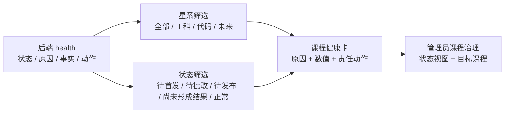

管理员点击“定位处理”后，桥接层统一打开原课程治理的状态视图并选中同一 `course_id`；窄屏继续复用既有课程治理检查器。管理员不会被伪装成教师，也不会越权进入教师草稿、发布或批改写入页：卡片明确说明应由授课教师执行的责任动作，管理员只负责发现与定位。

五种状态分别使用稳定色调，筛选结果明确显示“当前 / 总数”，无结果时使用真实空态。共享 owner 在桌面与手机复用同一数据和路由；`390×844` 实测根宽、正文宽均为 390，健康动作高度 44px，筛选和课程定位通过。专项合同锁定健康 DTO 校验、五态样式、双维筛选、安全路由和缓存代际；前端全量为 276 个 JavaScript 与 80 项合同通过。当前共享资源代际为 `20260828v863CourseHealthMatrixP0`。

---

## V8.6.2 可解释课程健康聚合（BE-030，当前稳定实现）

管理员 `GET /api/v1/workbench` 的 `teaching_snapshot.course_pulse[*].health` 现在直接根据现有事实计算，不保存“健康分”、不新增表，也不预测学生能力或教师质量。

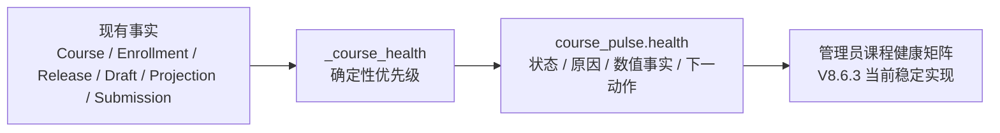

| 判定顺序 | 状态 | 解释事实 | 返回动作 |
| ---: | --- | --- | --- |
| 1 | 待首发 | 发布版本、在读学生 | 进入课程内容中心 |
| 2 | 待批改 | 待批改提交、完成信号 | 进入批改队列 |
| 3 | 待发布 | 当前草稿代次、已发布草稿代次 | 进入发布预演 |
| 4 | 尚未形成结果 | 在读学生、完成信号 | 进入课程学情 |
| 5 | 运行正常 | 在读学生、当前版本、完成信号 | 查看课程详情 |

优先级只用于一门课程同时出现多个事实时选择最直接的当前动作。每条 `health` 都至少包含两项非负数值事实、中文原因和带 `course_id` 的工作台动作；DTO 内部状态名供前端稳定映射，不直接作为用户文案。演示数据库的真实读取已经得到“待批改”和“待首发”等结果，专项测试覆盖五种组合及 API 响应模型。

---

## V8.6.1 演示技术残留清理（UI-016，当前稳定实现）

本版本只改变用户可见转换、演示数据表达和发布差异解释，不改变课程、release、提交、学习证据或角色权限的权威来源。

| 清理范围 | 当前稳定表现 | 保留的技术边界 |
| --- | --- | --- |
| 账号、错误与空态 | 页面显示中文角色、账号状态和可执行说明；内部恢复码继续只供逻辑分支与测试使用 | 不吞掉故障，不把内部 code 当成用户标题 |
| 演示作业与反馈 | 三门演示课程使用中文任务、结构化作答摘要和中文批改意见；旧演示库可由正式 API 幂等升级 | 不直接改库，不写死用户凭据，不伪造学习结果 |
| 用户与发布身份 | 管理、名单、发布历史优先显示姓名、用户名或“共同授课教师”等业务称呼 | 数据主键仍在内部请求中使用，但不进入主演示文本 |
| 发布影响预演 | “内容调整”和“完成规则”分别计数并说明；仅规则变化不会再伪装为正文修改 | 继续复用共享草稿与不可变 release，不建立第二套差异真值 |
| 资源一致性 | 主入口、三角色资源、服务工作线程和合同测试统一到 `20260828v861PresentationCleanupP3` | 旧缓存由既有代际机制自然淘汰 |

专项自动化覆盖中文演示数据、旧库兼容升级、可见技术残留禁入、完成规则独立比较和资源代际；学生与教师真实页面已经验证账号区、结构化作答、批改反馈和发布预演。`QA-034` 已进一步把本轮全部模块放到同一桌面/移动矩阵中终验。

---

## V8.5.0—V8.5.4 管理平台展示增强（当前稳定实现）

V8.5 没有另建“展示专用数据”，而是把 V8.4 已有课程、选课、发布、作业和学习事实转换为四种可讲解界面。当前统一资源代际为 `20260828v854ManagementShowcaseP0`，实现提交为 `DEV-003@e057550`、`DEV-004@5e76419`、`DEV-005@d9b302d`，验收代际提交为 `QA-033@3c28562`。

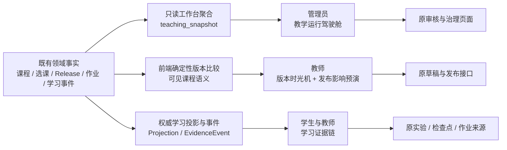

### 四个可见模块

| 模块 | 复用的真实数据 | 当前用户可见结果 | 明确边界 |
| --- | --- | --- | --- |
| 教学管理驾驶舱 | `GET /api/v1/workbench`、课程、成员、release、完成投影、待批改提交 | 管理员看到教学总量、星系分布、近期课程脉搏和直接处理入口 | 新增 `teaching_snapshot` 只读 DTO，不新增表、写接口或治理状态 |
| 课程版本时光机 | `CourseRelease` 与 `CourseReleaseUnit` | 教师选择任一不可变版本，查看相对上一版的新增、修改、删除和稳定单元 | 历史版本不可编辑；差异只比较学生可见课程语义，不把内部 id、slug、状态或空字段误报为内容变化 |
| 发布影响预演 | 当前共享草稿、当前 release、active `CourseEnrollment` | 发布前看到受影响学生、下一版本号和单元增删改；内容一致时明确禁用重复发布 | 预演是确定性只读计算，不预测学习效果，也不改变原发布事务 |
| 学习证据链 | `LearningActivityProjection`、`LearningEvidenceEvent`、检查点和作业事实 | 学生与教师按“操作—规则—结果—来源”理解完成为何成立；教师可按来源活动定位完整事件链 | 普通浏览不等于完成；来源仍回到原实验、检查点或作业，不复制第二套进度真值 |

### QA-033 验收收据

- 后端完整测试运行至 100% 且无失败，仅保留既有 skip/xfail 与两条 SQLite datetime 弃用警告。
- 275 个受跟踪 JavaScript 文件通过语法检查，78 项前端合同全部通过。
- 管理员、教师和学生真实页面均覆盖默认桌面与 `390×844`；四个新增模块没有根级横向溢出。
- 发布预演的真实页面复验确认：只存在内部元数据差异时显示“与当前发布版一致”，增删改均为 0，重复发布按钮禁用。
- 本周期没有新增 Alembic 迁移，没有修改 127 项活动，没有开发小程序、服务器部署、竞赛材料或生产级安全加固。

### V8.5 已知展示边界的后续处理

以下问题曾是 V8.5 的可见维护边界；前三项已由 `UI-016` 收束，剩余回归范围继续只认 [2 号文档当前任务](../02-更新规划.md#3-当前任务状态)：

- 学生总览不再显示 `recovery_route_unavailable` 等内部 code；内部状态仍保留在逻辑和专项回归中。
- 本地演示数据已改为中文业务内容，原始 JSON 与“用户 #数字”不再进入主演示路径；旧库通过正式 API 兼容升级。
- 发布影响预演已把正文内容调整与完成规则变化分开计数、标记和解释。
- V8.5 专项合同已经锁定结构、样式和关键函数；丰富驾驶舱组合、教师证据筛选和学生来源回跳仍主要依靠真实浏览器验收，行为级自动化可以继续加强。

---

## V8.4.6 完整课程闭环与验收收口（当前稳定实现）

`DATA-010` 使用正式 API 从空数据库建立可重复演示数据：普通学生、无行政班学生、待审教师、两名共同教师、管理员、一个行政班、公开课程、限班课程、被退回后重提的课程信息、两个不可变发布版本、三种完成结果、待批改与已批改作业。初始化连续重放不会复制课程、申请、成员或发布历史。

当前可见业务链已经闭合：

```text
学生账号申请教师 → 管理员审核 → 教师创建课程 → 管理员退回并再次审核
→ 教师获得课程码与隐藏课程群组 → 有班级 / 无班级学生加入
→ 多教师编辑共享草稿并发布新版本 → 学生刷新读取当前版本
→ 学生完成实验、检查点和作业 → 教师批改与查看逐项进度
→ 学生回读分数、反馈和完成结果 → 管理员查看审核、组织与审计事实
```

### 课程成员与教师作用域的最终校正

| 场景 | 当前稳定规则 | 用户可见结果 |
| --- | --- | --- |
| 学生没有行政班，但拥有有效课程成员关系 | 以 `CourseEnrollment` 为课程访问真值；学习和作业范围落在隐藏 `course_cohort` | 不再弹出强制加入行政班遮罩，可直接看到课程、当前发布、作业、进度和反馈；名单显示“未关联行政班” |
| 教师查看行政班课程 | 继续要求该行政班的有效教师或管理员作用域 | 原行政班权限不被课程闭环放宽 |
| 正式教师申请进入学校与行政班 | active 教师可向已知行政班提交 teacher 角色加入申请；只有班级教师或管理员批准时才原子建立学校 teacher 与班级 teacher 关系 | 待审核教师和普通学生不能用该入口提前取得教师权限；这是 Q-004 方案 A 的当前落地 |
| 课程教师查看课程直属名单 | 以课程创建者或有效 `CourseCollaborator` 作用域读取隐藏群组 | 从教师首屏可直接进入提交队列、评分表、学习概况和逐单元证据 |
| 教师批改课程直属作业 | 复用原作业、提交与评分 owner，只补充课程 id、隐藏群组 id 和提交 id | 不建立第二套批改状态；评分后学生原页面回读同一条 `Submission` |
| 新发布版本生效 | 所有 active 课程成员读取隐藏群组最新 binding | 学生下次读取自动获得新版本；旧 release、学习事实和批改历史仍可追溯 |

对应收口提交包括：`85a6427` 解除课程学习对行政班的错误依赖，`78b98a0` 接通教师首屏到课程直属批改，`b968dff`、`35c3ec5`、`7e18ab5` 和 `11b47b6` 让课程教师按同一作用域读取作业、策略、聚合证据与逐项进度，`9fb73f8` 将课程批改适配器从教师主 owner 中独立出来并维持架构上限，`c3be367` 修复机械臂独立路由被全局实验选择器样式隐藏的问题。以上修改只补齐批准规划中的课程闭环和 `SHOW-04` 验收，不改动既有实验交互。

### QA-032 当前验收边界

- 三角色真实浏览器已覆盖首次进入、主要下一动作、详情跳转、刷新直达、无行政班学生、课程直属名单、管理员教师审核和空/非空状态；console warning/error 为 0。
- 机械能旧实验保持原页面和控件；机械臂覆盖正式 hash、可达/限位/越界预设、暂停、重置、离开重进、桌面与 `390×844`，没有重新加入课程说明壳。
- 自动化最终口径以本版本完整后端测试和干净 Git 提交态的 `npm test` 为准；主工作区中与本目标无关的用户候选不纳入发布证明，也未被本任务修改。
- 本结论只证明本地同源 Web 作品闭环，不代表微信小程序、公网服务器、正式 MySQL、隔离 OJ、真实课堂实证、竞赛申报材料或生产级安全加固已经完成。

---

## V8.4.0 身份、组织与教师申请（当前稳定实现）

本节接收原规划图 `P-02` 与 `P-05`。两幅图已经依据 `87d9f60 / ARCH-010`、`eb47948 / BE-023` 和 `8a22773 / FE-037` 的真实模型、接口与页面修正，状态由“目标态”变为“当前稳定实现”。后续身份与组织维护以本节为准；[`02-更新规划.md`](../02-更新规划.md) 只保留完成结论和本节链接。

### 当前身份与组织类图（原 P-02）

- **状态**：当前稳定实现。
- **数据库基线**：Alembic `20260825_0054 → 20260825_0055`。
- **已经落地**：`TeacherApplication` 申请记录、`ClassGroup.kind` 组织类型、课程 `subject_key`、管理员审核和待审只读门。
- **当前课程组织事实**：`course_cohort` 类型、模型和约束由 V8.4.0—V8.4.1 建立；`BE-025@3fde9af` 已在首次课程信息批准事务中创建真实内部课程群组与唯一 `CourseClass`。班级页面继续只展示 `homeroom`，内部群组不冒充行政班。

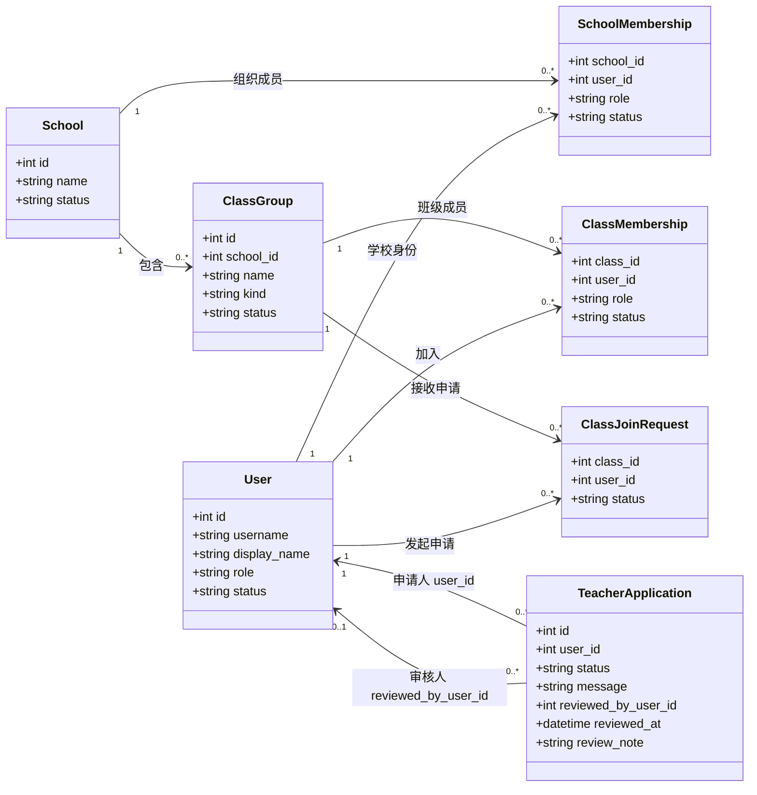

`ClassGroup.kind` 只有 `homeroom / course_cohort` 两种值。现有班级创建、班级列表、组织治理和统计接口只把 `homeroom` 当作行政班，避免未来内部课程群组误入行政班页面。课程通过 `galaxy_key / subject_key / course_key` 表示“星系—学科—授课课程”分类，课程单元继续用稳定 `activity_key` 引用独立活动；目录中的历史代表项不再形成课程等级。

### 当前教师申请状态图（原 P-05）

- **状态**：当前稳定实现。
- **公开注册规则**：页面始终先创建普通学生账号；选择“申请教师身份”时再提交申请。`/api/auth/register` 的旧 API 兼容入口没有在本版本强行删除，但公开页面不再用它直接创建教师。
- **待审规则**：服务端对有待审申请的账号实行全局写入失败关闭；只允许读取、查看本人申请、退出或撤销自己的会话。前端只读预览和按钮隐藏只负责解释状态，不承担最终授权。
- **拒绝与重申**：拒绝后用户仍为学生；再次申请会新建一条申请记录，旧记录保持可追溯。

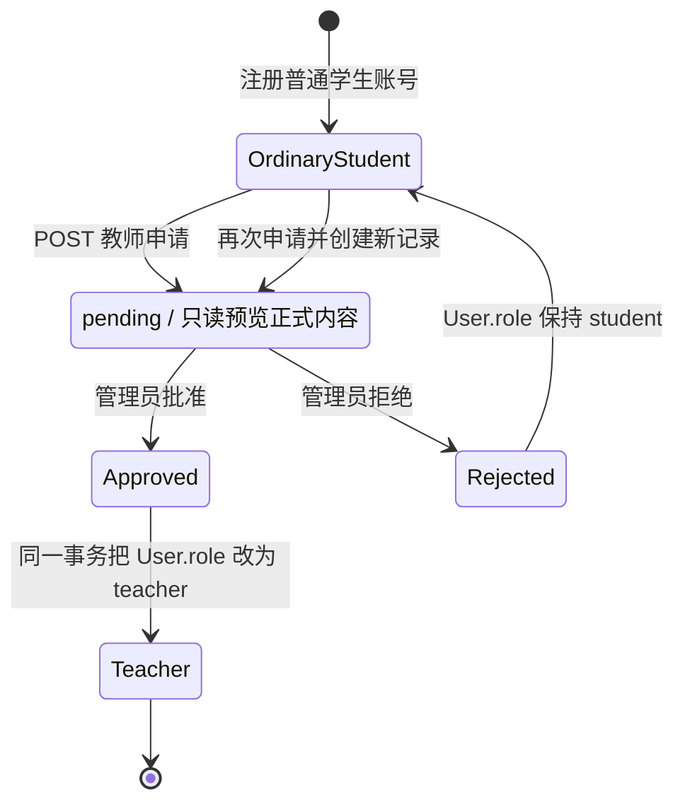

### 当前接口、页面与验收事实

| 范围 | 当前稳定实现 |
| --- | --- |
| 申请者接口 | `POST /api/v1/teacher-applications`、`GET /api/v1/teacher-applications/me` |
| 管理员接口 | `GET /api/v1/admin/teacher-applications`、`PATCH /api/v1/admin/teacher-applications/{id}` |
| 申请者页面 | 注册用途选择、申请说明、待审横幅、状态弹窗、拒绝后再次申请、审核通过后身份刷新 |
| 待审目录 | `pages/planets/planets.js` 使用 `teacher-applicant` 只读视图展示正式活动目录，不进入学生班级/课程工作台 |
| 管理页面 | 管理首页显示待审总数；身份治理页显示申请卡片、审核说明以及批准/拒绝的二次确认 |
| 服务端门禁 | 待审账号的非允许写请求统一返回 `403`，不能通过直接调用 API 绕过页面 |
| 审计 | 创建、批准和拒绝写入教师申请审计动作；重复审核返回冲突，不覆盖原结论 |
| 自动验证 | 隔离提交快照中 6 项后端专项测试通过；259 个受控 JavaScript 文件通过语法检查，70 项前端契约全部通过 |
| 浏览器自验 | 桌面与 `390×844` 已覆盖注册申请、待审只读、管理员列表与二次确认、批准后身份刷新、无横向溢出和无新增 console 错误 |

V8.4.0 完成的是“身份申请与组织语义”闭环，不等于教师已经能走完创建课程、课程审核和学生选课；这些能力继续由 `V8.4.1—V8.4.3` 实现。

---

## V8.4.1 课程关系数据底座（DATA-009 当前稳定实现）

`DATA-009@5596112` 把课程闭环所需的关系模型接入稳定 Alembic 链，`BE-024@4fa147c` 接通教师创建、共同教师可见和信息修订提交，`FE-038@b27b886` 把这条能力整理为教师可见的四步创建向导。数据库基线为唯一 head `20260825_0056`。`BE-025@3fde9af` 与 `FE-039@67a597f` 已完成管理员审核，`BE-026@19e4e5c` 与 `FE-040@81763a3` 已完成课程成员后端和师生可见操作。原规划 P-03、P-07、P-08 均已按真实实现迁入本文档。

### 当前稳定数据对象

| 对象 | 已实现字段与约束 | 当前用途 |
| --- | --- | --- |
| `Course` 扩展 | 可空 `course_code`、学年、上课时间、总课时、`admission_mode`、可空当前信息修订；课程码唯一、总课时为正、准入仅允许 `open / class_restricted` | 承接后续课程创建和审核；旧课程不要求立即产生正式课程码或信息修订 |
| `CourseInformationRevision` | 课程内递增修订号、完整信息快照、教师 ID 快照、创建/提交/审核事实；同一课程的修订号唯一 | 保存课程信息审核历史，不把教学正文放入管理员审核 |
| `CourseAdmissionClass` | 课程、行政班、有效状态；课程与行政班组合唯一 | 表达“指定班级可申请”的资格范围，不等同于课程成员 |
| `CourseJoinRequest` | 学生、来源行政班、申请轮次、说明、审核结果；同一课程/学生/轮次唯一 | 允许拒绝后保留历史并再次申请 |
| `CourseEnrollment` | 学生、来源行政班、加入来源和当前状态；课程与学生组合唯一 | 作为当前课程成员唯一真值，退出时改状态而不是删除历史 |

### BE-024 当前稳定接口与事务

| 接口 | 当前行为 |
| --- | --- |
| `GET /api/v1/courses/authoring-options?school_id=` | 返回当前学校可选的正式教师、有效行政班和两种准入方式；跨校教师和内部课程群组不会进入选项 |
| `POST /api/v1/courses` | 在一个事务中创建 `Course(status=draft)`、共同教师、准入班级和第 1 条 `CourseInformationRevision(status=draft)`；只接受正式教师 |
| `GET /api/v1/courses` | 教师只读取自己创建或作为有效 `editor` 参与的课程草稿；支持按学校筛选 |
| `GET /api/v1/courses/{course_id}` | 创建者和共同教师读取同一份课程、教师、准入班级和最新信息修订 |
| `POST /api/v1/courses/{course_id}/information-revisions/{revision_id}/submit` | 创建者或共同教师把草稿修订锁定并转为 `submitted`；重复提交返回冲突，课程本身仍为 `draft` |

创建载荷包含名称、说明、学年、上课时间、总课时、星系、学科、准入方式、共同教师和允许行政班。星系与学科只做分类：共同教师仍可通过既有课程单元接口引用其他学科的稳定 `activity_key`。创建者不能把自己重复选为共同教师，重复 ID、跨校教师、跨校班级、非行政班和无允许班级的限班课程都会被明确拒绝。

### FE-038 当前可见工作流

教师工作台“组织与课程”区域已经把旧的单页直发课程表单替换为独立、按角色加载的 `teacher-course-authoring` 模块。页面不允许教师选择 `published`，也不再要求教师填写内部 `course_key`；课程码只会在后续管理员首次批准时生成。

| 页面阶段 | 当前稳定行为 |
| --- | --- |
| 基本信息 | 填写课程名称、学年、上课时间、总课时和可选简介 |
| 共同教师 | 从同校正式教师中选择共同教师；创建者不会出现在可选列表中 |
| 分类与准入 | 选择星系、学科，以及公开申请或指定行政班；分类只负责归类和默认筛选 |
| 预览提交 | 汇总全部字段，明确提示提交后为“待管理员审核”，再创建草稿并提交信息修订 |
| 课程列表 | 创建者和共同教师看到同一条课程、同一教师名单和同一审核状态；批准前显示“审核后生成课程码” |
| 失败恢复 | 若课程草稿已创建但提交审核失败，页面保留权威草稿并提供再次提交，不重复创建课程 |

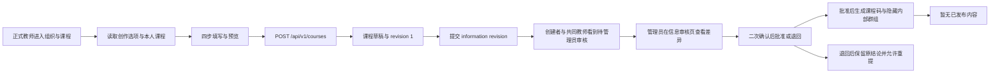

该图是教师端和管理端当前可见路径的简图；完整的当前调用顺序见下文“当前课程创建与信息审核时序图（原 P-08）”。首个不可变内容版本属于 V8.4.4，不是课程信息审批的前置条件。

### 旧数据兼容与当前边界

- 升级时，有活动 `CourseClass` 关联的旧课程回填为 `class_restricted`；没有挂班的旧课程回填为 `open`。旧课程、旧挂班和原有状态均保留。
- 旧课程的课程码、学年、时间、课时、当前信息修订保持为空，不伪造负责人没有填写或管理员没有批准的数据。
- DATA-009 迁移本身不预建 `course_cohort`；真实实例现在只由 `BE-025` 首次批准事务按课程创建，并由 `CourseClass` 形成唯一内部教学范围。
- BE-024 创建阶段仍不批准课程或生成课程码；BE-025 批准后才同步正式信息、共同教师、准入班级、课程码和内部群组。BE-026 只允许学生加入已批准且已生成内部群组的正式课程。
- 教师端已完成四步向导、同一课程列表、待审状态、失败恢复和角色资源独立加载；管理端已完成信息审核列表、当前/拟议差异、教师与准入班级、二次确认、批准/退回回执和响应式对话框。
- 课程信息批准不会生成空白 `CourseRelease` 或 `CourseClassReleaseBinding`；没有真实单元和完成规则时，读取端明确返回“暂无已发布内容”。首个不可变版本留给 V8.4.4 的教师显式发布。
- 最终隔离暂存快照通过 262 个受跟踪 JavaScript 文件语法检查和 72 项前端契约；后端课程审核/创建专项 6 项通过，Alembic 唯一 head 为 `20260825_0056`。
- 浏览器实测覆盖管理员桌面审批、退回、队列更新、首次批准回执与 `390×844` 全屏审核对话框；桌面差异区和移动页面都无横向溢出，无新增 console warning/error。数据库实测确认批准后 release、release unit 和 binding 行数仍为 0；127 项正式活动未修改。

---

## V8.4.2 课程信息审核（BE-025 / FE-039 当前稳定实现）

本节接收原规划图 `P-06` 和 `P-08`。两幅图已经按照 `BE-025@3fde9af` 与 `FE-039@67a597f` 的真实接口、事务、页面和浏览器结果从“目标态”修正为“当前稳定实现”；[`02-更新规划.md`](../02-更新规划.md) 只保留完成结论和本节链接。

### 当前课程信息审核状态图（原 P-06）

- **状态**：当前稳定实现；后端审核和管理员可见页面均已完成。
- **首次批准**：锁定 `submitted` 修订，应用批准信息并同步共同教师和准入班级，生成 8 位不可预测短课程码，创建隐藏 `course_cohort` 和唯一 `CourseClass`，再把课程设为正式运行状态。
- **退回与重提**：被拒修订保持不可覆盖；教师通过 `POST /api/v1/courses/{course_id}/information-revisions` 创建下一修订，再显式提交。
- **运行中修改**：待审或被拒的新修订不会改写当前批准信息、共同教师、准入班级、课程码或内部群组；只有管理员批准后才整体切换。
- **内容边界**：课程信息审核不审批章节、实验、检查点或作业，也不创建占位单元、占位完成规则和空 release。

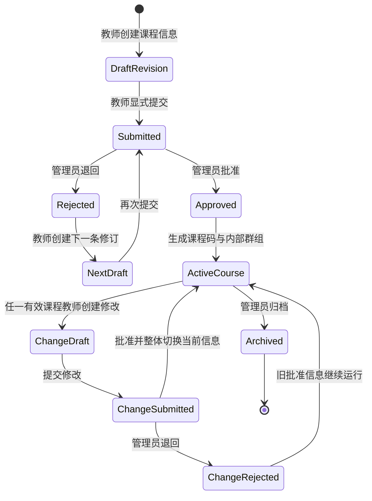

### 当前接口和返回状态

| 接口 | 当前稳定行为 |
| --- | --- |
| `GET /api/v1/admin/course-information-revisions` | 管理员按状态、学校和分页读取审核队列；默认读取 `submitted`，同时得到拟议信息、当前批准信息、差异字段、拟议/当前教师和准入班级 |
| `PATCH /api/v1/admin/course-information-revisions/{revision_id}` | 管理员以 `approved / rejected` 作出一次性结论；重复审核返回 `409`，不会覆盖第一次结论 |
| `POST /api/v1/courses/{course_id}/information-revisions` | 创建者或当前有效共同教师在上一修订已批准或被拒后创建下一条完整修订；同一课程已有草稿或待审修订时返回冲突 |
| `POST /api/v1/courses/{course_id}/information-revisions/{revision_id}/submit` | 继续复用 BE-024 提交动作，把新修订从 `draft` 转为 `submitted` |
| 课程读取 | 返回 `has_published_content=false`、`content_status=not_published` 和“暂无已发布内容”；V8.4.4 接入真实 release 后再按事实更新 |

### 审核事务与验证证据

首次批准的课程信息、共同教师、准入班级、课程码、内部群组、`CourseClass`、当前修订指针和审计事实属于同一数据库事务。内部群组创建失败时，请求返回失败，课程仍保持 `draft`、课程码为空、修订仍为 `submitted`，也不会残留内部群组或 `CourseClass`。拒绝首次申请不会生成课程码；拒绝运行中修改不会影响正在运行的批准信息。

纯暂存隔离快照排除其他工作区候选后，17 项课程审核、教师建课、课程关系、课程分类、教师申请和课程状态回归全部通过，架构边界契约通过。专项测试还确认：内部群组不会进入行政班列表；若工作区候选发布表存在，审批后 `course_releases` 与 `course_class_release_bindings` 行数仍为 0。Alembic 唯一稳定 head 保持 `20260825_0056`，BE-025 没有新增迁移。

### 管理员可见审核页面

- 管理员从课程治理进入“信息审核”，系统读取待审修订和课程当前状态，没有待审项时显示明确空状态。
- 审核卡片区分“首次批准”和“运行中修改”，展示当前值、拟议值、差异字段、教师名单、准入班级和可选审核说明。
- 批准和退回都要求第二次点击确认；审核说明被修改后，上一次确认立即失效。写入进行期间，页面禁止切换视图或重复提交；结果不明时不自动重试。
- 首次批准回执显示课程码、内部教学群组和“暂无已发布内容”；退回回执明确说明旧批准信息继续运行，或者首次申请可修改后重提。
- 桌面端使用页内审核面板；`390×844` 移动端使用全屏对话框。浏览器实测中两种布局均无横向溢出，console 无新增 warning/error。

### 当前课程创建与信息审核时序图（原 P-08）

- **状态**：当前稳定实现。
- **实际提交**：`BE-024@4fa147c`、`FE-038@b27b886`、`BE-025@3fde9af`、`FE-039@67a597f`。
- **事务边界**：审批服务在一次事务中生成正式信息、课程码、隐藏内部群组、唯一内部教学范围和审计事实；失败时全部回滚。
- **发布边界**：流程不创建 `CourseRelease`、`CourseReleaseUnit` 或 `CourseClassReleaseBinding`；首次真实发布属于 V8.4.4。

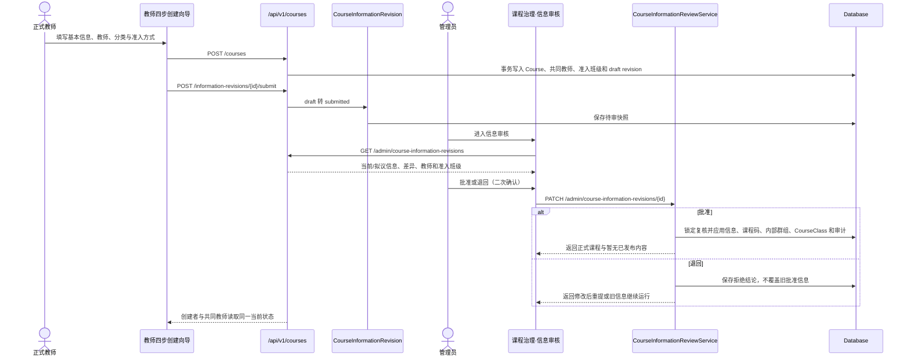

### FE-039 验证证据

- 隔离 Git 暂存快照通过全量 `npm test`：262 个受跟踪 JavaScript 文件通过语法检查，72 项前端契约全部通过。
- 后端 `test_course_information_reviews.py + test_course_authoring.py` 共 6 项通过。
- 真实浏览器完成首次批准和运行中退回，验证两次点击才发送写请求；队列从 2 减为 1 再清空。
- 移动端 `390×844` 全屏对话框可完成审核，桌面和移动端的内容宽度等于可见宽度，没有横向滚动。
- 首次批准后数据库中 `course_releases=0`、`course_release_units=0`、`course_class_release_bindings=0`，符合 Q-002 方案 B。

### 当前未完成边界

- V8.4.3 已完成学生加入页面、教师审批、课程名单和行政班批量加入；这些页面只消费课程成员事实，不把行政班改成课程。
- 教师尚不能用结构化编辑器建立真实课程单元和完成规则，也不能生成首个不可变 release；这些属于 V8.4.4。
- 内部课程群组继续只作为兼容现有作业与学习证据结构的隐藏范围，不向学生、教师或管理员冒充行政班。

---

## V8.4.3 课程准入与成员后端（BE-026 当前稳定实现）

`BE-026@19e4e5c` 直接复用 DATA-009 的 `CourseJoinRequest` 和 `CourseEnrollment`，没有新增迁移，也没有把行政班重新改成课程容器。`CourseEnrollment` 仍是课程成员唯一真值；审批或批量加入后，服务端同步激活课程隐藏 `course_cohort` 中的学生成员，使既有作业和学习证据可继续按内部教学范围工作。

### 当前接口与用户边界

| 接口 | 当前稳定行为 |
| --- | --- |
| `GET /api/v1/courses/by-code/{course_code}` | 学生用不区分大小写的课程码查找已批准课程，读取教师、分类、准入方式、可用行政班、最新申请和成员状态 |
| `POST /api/v1/courses/{course_id}/join-requests` | 学生申请公开或指定班级课程；重复发送待审申请返回同一记录，被拒后以新 `request_number` 保留历史并再次申请 |
| `GET /api/v1/courses/{course_id}/join-requests` | 课程创建者、有效共同教师或管理员分页读取待审、已批准、已退回或全部申请 |
| `PATCH /api/v1/courses/{course_id}/join-requests/{request_id}` | 任一有效课程教师或管理员一次性批准/退回；指定班级课程在批准时重新检查学生是否仍属于允许班级 |
| `GET /api/v1/courses/{course_id}/enrollments` | 课程教师或管理员分页读取在读/已退出名单；来源行政班不存在时明确返回“未关联班级” |
| `POST /api/v1/courses/{course_id}/enrollments/batch` | 课程教师或管理员按行政班批量加入；对新增、已加入、曾退出和身份/成员状态异常学生返回逐项结果，不自动恢复曾被移除的学生 |
| `PATCH /api/v1/courses/{course_id}/enrollments/{enrollment_id}` | 学生退出自己的课程，或课程教师/管理员移除学生；只把 enrollment 和内部成员转为非活动，不删除申请、作业、提交或学习事实 |

### 准入、名单与内部群组规则

- 公开课程允许没有行政班的普通学生申请；名单中 `source_class_id=null` 时显示“未关联班级”。
- 指定班级课程在申请和批准两个时点都检查：行政班必须有效、属于同校、仍在课程允许范围，学生成员也必须有效。
- 教师批量加入只为当前有效学生创建成员；已在读、已退出和状态异常者均有可读逐项回执。若学生已有待审申请，批量加入会把该申请标为已批准，不留下永久待审记录。
- 课程成员转为 `active` 时，同一事务内创建或重新激活隐藏 `course_cohort` 的学生 `ClassMembership`；退出时两者都转为非活动。
- 一名学生可在多门课程拥有独立 enrollment；一门课程可同时包含多个行政班学生与无行政班学生。

### 验证与后续实现边界

- 纯 Git 暂存快照排除内容平台、公开导览和学生页候选后，架构边界契约通过；课程成员、信息审核、教师建课、关系模型和课程分类共 14 项后端测试通过，Ruff 通过。
- 专项已覆盖公开课程无班级申请、重复申请、共同教师审批、非课程教师拒绝、限班两次校验、退回后第 2 轮申请、管理员兜底、逐项批量结果、学生自行退出、教师移除、历史保留、一人多课和内部成员同步。
- BE-026 本身只交付后端；`FE-040@81763a3` 已在后续提交中把这些接口接入学生和教师工作台。
- 课程内容共享草稿、不可变发布版本和三种完成规则仍属于 V8.4.4；V8.4.3 不创建空发布版本，也不修改 127 项独立活动。

---

## V8.4.3 学生选课与教师课程名单（FE-040 当前稳定实现）

`FE-040@81763a3` 把 BE-026 的课程成员能力接入现有学生、教师工作台，没有新增模型、迁移或第二套成员关系。学生端和教师端都通过独立按角色加载模块工作；页面只调用稳定 `/api/v1/courses` 接口族，写请求结果不明时不自动重投。

### 当前学生可见旅程

| 页面动作 | 当前稳定行为 |
| --- | --- |
| 查找课程 | 学生输入 4—16 位课程码，读取课程名称、分类、教师、学年、时间、课时、准入方式和当前资格 |
| 公开申请 | 可选择关联本人有效行政班，也可以不关联；无行政班学生仍可申请公开课程 |
| 限班申请 | 只能从服务端返回的允许行政班中选择；资格在提交和教师批准时分别复核 |
| 状态回读 | 页面区分可以申请、待审核、已退回可重申和已加入；被退回后新申请保留新的申请轮次 |
| 加入回执 | 已加入时显示来源行政班或“未关联班级”，并提示从“我的学习”继续课程 |
| 退出课程 | 第一次点击只进入确认态，第二次点击才写入退出；历史 enrollment、申请、提交和学习事实继续保留 |

### 当前教师可见旅程

教师工作台“组织与课程 → 创建授课课程”下方新增“课程成员中心”，只列出已批准且已经生成课程码的本人课程。教师可以在同一页面查看课程码、准入方式、待审数量、在读数量和允许行政班，再完成以下操作：

- 按待审或全部历史筛选加入申请，查看学生账号、申请轮次、申请说明和来源行政班。
- 批准或退回都要求第二次点击确认；审核说明变化后必须重新确认。
- 按在读或全部历史查看名单，来源明确区分“学生申请”“行政班批量加入”和“未关联班级”。
- 移除学生要求第二次点击确认，只改变成员状态，不删除历史。
- 公开课程可以从全部本人行政班中选择批量来源；限班课程只显示允许行政班。
- 批量写入后分别显示新增、已在课、曾退出和不符合资格数量，不自动恢复曾退出或被移除学生。

### 当前课程业务类图（原 P-03）

- **状态**：当前稳定实现。
- **实际提交**：`DATA-009@5596112`、`BE-024@4fa147c`、`BE-025@3fde9af`、`BE-026@19e4e5c`、`FE-038@b27b886`、`FE-039@67a597f`、`FE-040@81763a3`。
- **当前事实**：课程信息审核、共同教师、准入班级、学生申请和课程成员各自保存独立历史；`CourseEnrollment` 是成员唯一真值，`CourseClass` 只连接隐藏内部教学群组。
- **兼容边界**：旧课程可以没有信息修订或内部群组；V8.4 流程首次批准的正式课程必须拥有课程码和唯一内部 `course_cohort`。

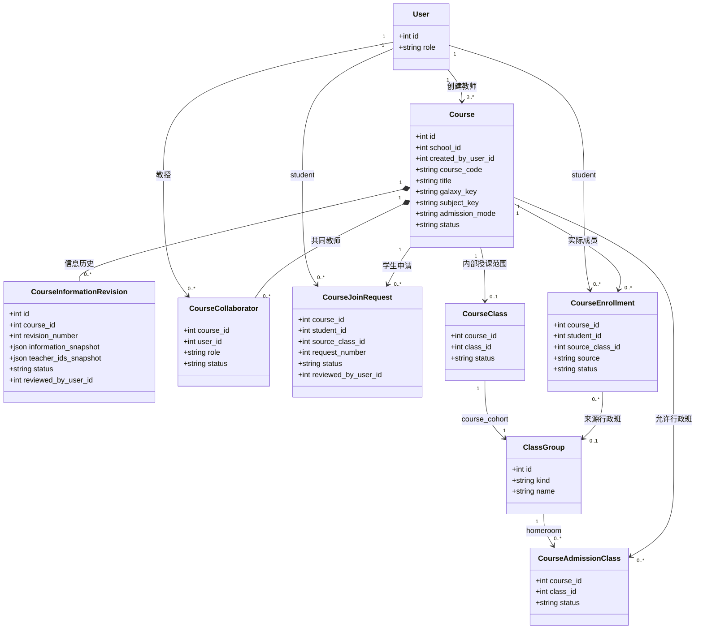

### 当前学生加入课程状态图（原 P-07）

- **状态**：当前稳定实现；后端状态、学生回执和教师操作已经一致。
- **资格规则**：公开课程允许无行政班申请；限班课程必须选择服务端返回的允许行政班，并在批准时再次检查。
- **历史规则**：拒绝后创建新的申请轮次；退出或移除只把 enrollment 与隐藏内部成员转为非活动。
- **批量规则**：教师可绕过申请阶段直接批量加入合格行政班学生，但不会自动恢复曾退出者。

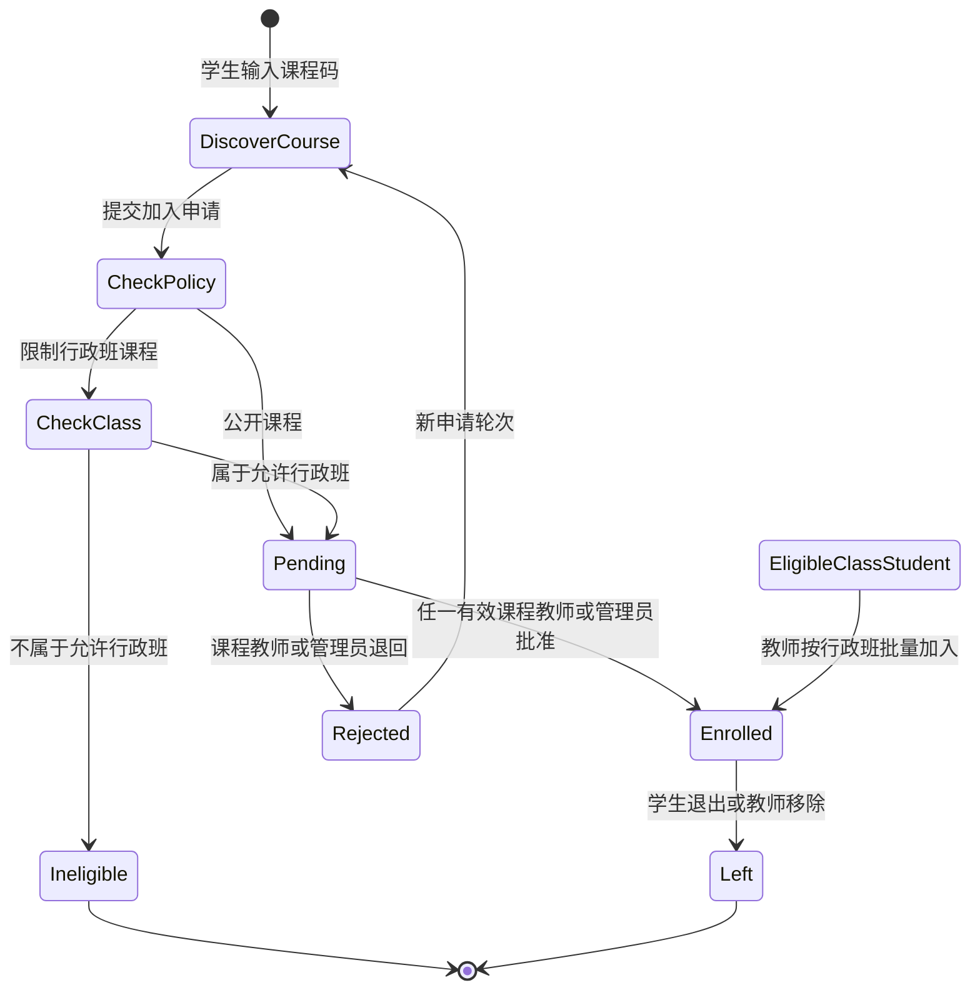

### FE-040 验证证据

- 纯 Git 暂存快照通过 265 个受跟踪 JavaScript 文件语法检查和 73 项前端契约；新增 `course-enrollment-fe040-contract`，既有角色移动回执、架构边界和旧活动保护契约继续通过。
- 后端沿用 BE-026 已通过的 14 项课程成员、信息审核、教师建课、关系和分类专项，不新增迁移或接口分叉。
- 真实浏览器完成“学生课程码申请 → 教师二次确认批准 → 名单显示行政班 → 教师按行政班批量加入第二名学生 → 学生回读已加入状态”。
- 批量结果实测为“新增 1、已在课 1、曾退出 0、不符合 0”，名单分别显示“学生申请”和“行政班批量加入”。
- `390×844` 下学生选课和教师成员中心均无横向溢出；可见输入、筛选和操作按钮最小高度为 44px。首轮发现教师筛选框和移除按钮为 38px，已在同一提交中修正并复验。

### 当前未完成边界

- 当前课程成员闭环不等于课程已有教学内容；正式课程仍可能显示“暂无已发布内容”。
- BE-027、FE-041 与 BE-028 已依次提供共享草稿、七类内容 schema、实验引用、可见结构化编辑、显式发布、不可变版本和三种完成预设。
- 本任务没有修改 127 项活动，没有接入小程序、服务器部署或竞赛材料。

---

## V8.4.4 多教师共享草稿与不可变发布（BE-027 当前稳定实现）

`BE-027@5a2d5f1` 把原内容平台候选中与新版课程闭环一致的部分接到稳定 Alembic 主线，并删除冲突的旧迁移候选。当前每门已批准课程拥有一个整数草稿修订号；课程创建者、有效共同教师和管理员通过同一组接口读取或替换同一份结构化草稿，不再各自保存互相分叉的教师私有副本。

### 当前接口与并发边界

| 接口 | 当前稳定行为 |
| --- | --- |
| `GET /api/v1/courses/{course_id}/draft` | 课程创建者、有效共同教师或管理员读取按位置排序的共享单元、七类内容块和当前整数 `revision` |
| `PATCH /api/v1/courses/{course_id}/draft` | 携带 `expected_revision` 原子替换整门课程草稿；可新增、修改、删除和重新排序单元，旧修订返回 `409 / course_draft_revision_conflict` |
| `GET /api/v1/courses/{course_id}/releases` | 课程教师或管理员读取全部不可变发布历史；活动引用、页面版本和顺序均按发布时事实返回 |
| `POST /api/v1/courses/{course_id}/releases` | 教师显式发布当前修订；同一事务生成 release、每单元精确页面版本、内部群组 binding 和下一草稿修订 |
| `GET /api/v1/courses/{course_id}/releases/current` | 有效课程成员下次读取时得到内部课程群组的最新 binding；教师和管理员读取时保留完整检查点内容 |
| `GET /api/v1/courses/{course_id}/releases/{release_id}` | 在同一课程权限范围内回读指定旧版本；学生读取时移除标准选项、数值答案、容差和可接受答案 |

草稿保存和发布都先锁定课程并校验 `expected_revision`。单元重排先在同一事务中释放旧位置槽位，再写入新顺序；任一校验、页面版本、release unit、binding 或审计写入失败都会整体回滚。完全相同的草稿不能重复发布，因此不会生成空的新版本或半条 binding 历史。

### 当前内容发布类图（原 P-04）

- **状态**：当前稳定实现。
- **BE-027 当时数据库基线**：Alembic `20260825_0057`；当前稳定 head 已由 BE-028 接续为 `20260825_0058`。
- **实际提交**：`BE-027@5a2d5f1`。
- **当前事实**：`Course.content_draft_revision` 是整门课程共享草稿的并发代际；每个有效 `CourseUnit` 只有一条 active `ContentDraft`；每次发布为每个单元生成新的 `ContentPageVersion`，再由不可变 `CourseReleaseUnit` 固定顺序和引用。
- **兼容边界**：binding 只指向课程隐藏 `course_cohort` 对应的 `CourseClass`，不绑定行政班；BE-028 上线前形成的旧 release 可继续保留 `not_configured` 历史快照且不产生完成结果，新 release 则必须为每个有效单元配置完成预设。

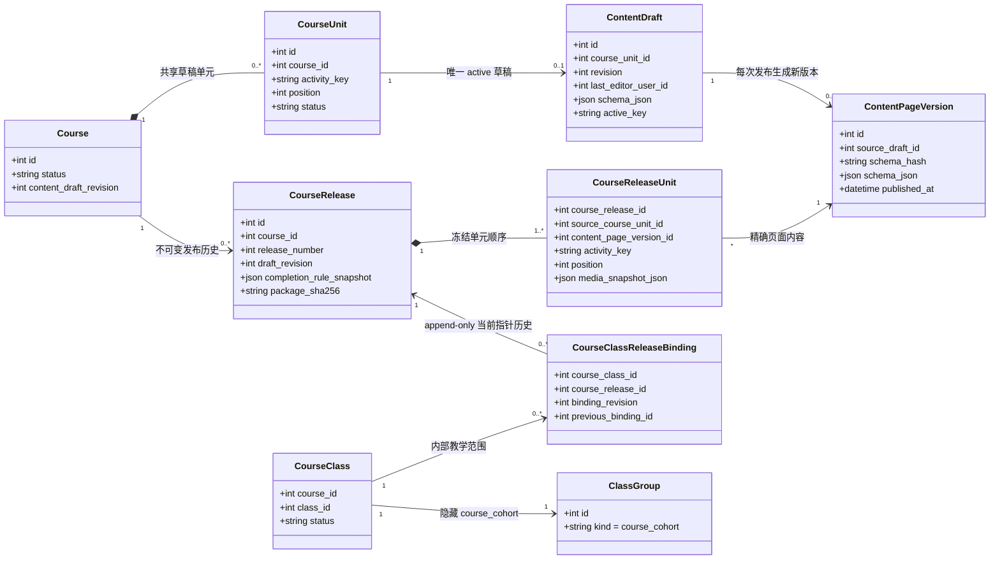

### 当前多教师发布时序图（原 P-09）

- **状态**：当前稳定全栈实现。
- **实际提交**：`BE-027@5a2d5f1`、`FE-041@54fe180`。
- **协作语义**：创建者和有效共同教师从课程内容中心读取同一 `content_draft_revision`；旧修订触发可见冲突面板，教师必须明确采用服务器草稿或以最新代际保留本地内容，系统不会静默覆盖或自动重试写入。
- **发布语义**：教师先预览，再经过两步显式确认；发布、页面版本、release units、内部群组 binding、审计和草稿滚动到下一修订处于同一事务，发布历史在页面中只读。
- **学生语义**：所有 active `CourseEnrollment` 在下一次读取时沿最新 binding 取得同一个当前版本；旧 release、binding、页面版本和学习历史继续可追溯。

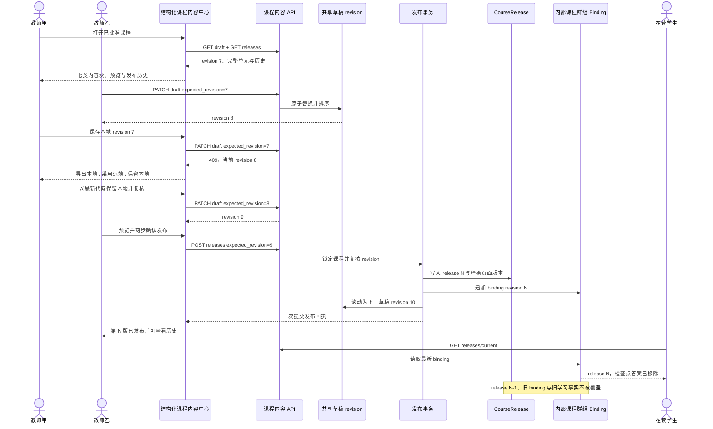

### BE-027 验证证据与未完成边界

- `backend/tests` 全量测试通过；共享草稿、发布 API、存储和七类内容 schema 的 25 项专项通过，课程创建、信息审核、成员和发布相关组合回归 34 项通过。
- Alembic `20260825_0057` 完成升级、回滚和再次升级，稳定链保持单一 head；发布表只新增 `CourseRelease`、`CourseReleaseUnit` 和 `CourseClassReleaseBinding` 三类不可变事实。
- 纯暂存隔离快照通过 265 个受跟踪 JavaScript 文件语法检查和 73 项前端契约；架构边界在不包含用户其他工作区改动的快照中通过。
- 学生答案脱敏、相同内容拒绝重复发布、旧修订冲突、两单元原子换序、失败事务无残留、旧 release 与旧 binding 回读均有自动化覆盖。
- 本任务没有修改 127 项独立活动，也没有实现自由拖拽、任意 HTML/脚本、管理员逐内容审核、小程序、服务器部署或竞赛材料。
- FE-041 与 BE-028 已在后续提交中完成；本段只记录 BE-027 当时允许 `not_configured` 历史快照的兼容边界，当前新发布已经要求每个有效单元配置完成预设。

---

## V8.4.4 结构化课程编辑器（FE-041 当前稳定实现）

`FE-041@54fe180` 在既有教师工作台“组织与课程”中增加课程内容中心。模块只接管已批准且已有课程码的教师课程，不改变课程信息审核、课程成员和 127 项活动本体；它通过 `teacher-course-authoring` 延迟加载独立的 `teacher-course-content` owner，避免继续扩大冻结的教师主 owner，也避免为课程发布建立第二套客户端真值。

### 当前可见能力与代码边界

| 能力 | 当前稳定实现 | 主要 owner |
| --- | --- | --- |
| 课程范围 | 只显示当前教师参与、状态为 `published` 且已有课程码的课程；课程状态和第 N 版来自真实 release 列表 | `pages/teacher/teacher-course-content.js` |
| 单元与活动 | 从统一活动目录读取精确 127 个 `activity_key`，每个课程单元引用一项正式活动；后端 allowlist 同步为 124 项保护活动和双摆、色谱、机械臂三项冻结新增 | `shared/js/learning-activity-catalog.js`、`backend/app/schemas/official_activity_keys.py` |
| 内容结构 | 支持 `hero`、`learning-task`、`rich-text`、`media`、`official-simulation`、`checkpoint`、`sources` 七类结构化内容块及单元/内容块顺序调整 | `pages/teacher/teacher-course-content.js`、`backend/app/schemas/content_v2.py` |
| 草稿保存 | 保存完整共享草稿并携带 `expected_revision`；只修改已有文本也会立即启用保存按钮，刷新后从服务器恢复 | `/api/v1/courses/{course_id}/draft` |
| 冲突处置 | `409 / course_draft_revision_conflict` 后同时保留本地副本与远端草稿，提供导出本地、采用服务器、以最新代际保留本地三种显式选择；不会自动覆盖或自动重投 | 课程内容中心冲突面板 |
| 预览与发布 | 草稿预览呈现七类内容；发布需要“准备发布 → 确认发布下一版”两步操作，成功后重新读取草稿和发布列表 | `/api/v1/courses/{course_id}/releases` |
| 历史回读 | 按 release number、发布时间、单元数和 package hash 显示不可变历史，并以发布时内容只读预览 | 课程内容中心“发布历史”视图 |

编辑器不是自由网页设计器。Markdown 会拒绝原始 HTML、注释和危险链接；媒体只引用平台注册素材键；活动块必须引用当前单元的正式 `activity_key`；页面没有 `contenteditable`、拖拽式布局、iframe、任意 JavaScript 或远程脚本入口。课程中的活动卡只负责引用和返回，独立实验的 DOM、动画、参数、求解器和说明文本均未被修改。

### 当前教师课程内容流程

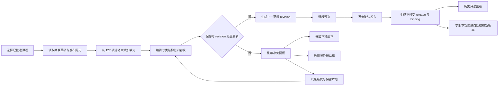

### 页面交互与验收事实

- 教师课程工作流占据完整网格行，关闭的相邻操作卡不再覆盖编辑器按钮命中区；工作台刷新和保存重绘后，“组织与课程”保持教师当前展开状态。
- 发布状态由已经读取的 release 历史派生；首发成功后立即显示“已发布 · 第 1 版”，不会继续使用父级课程快照中的旧“暂无已发布内容”。
- 真实浏览器建立一门已批准课程，引用 `engineering.robot-arm-ik`，补齐七类内容块，验证危险 `<script>` Markdown 被前端拒绝，保存 revision、预览、发布第 1 版、刷新持久化和不可变历史均可见。
- 并发验收用第二个教师请求把服务器草稿从 revision 2 推进到 3；原页面保存得到 `409`，本地内容没有丢失。选择“以最新代际保留本地”后，页面先复核再显式保存为 revision 4，证明系统没有静默合并。
- 桌面 `1440×900` 与手机 `390×844` 均无根级或课程内容容器横向溢出；移动端课程内容区域所有可见按钮至少 44px。刷新直达、发布历史和折叠区保持均已复验，浏览器 console warning/error 为 0。
- 干净 Git 暂存快照通过 267 个受跟踪 JavaScript 文件语法检查和 74 项前端契约；`backend/tests` 全量完成且无失败，课程内容 schema、发布、建课、审核和成员的 33 项定向回归通过。
- 本任务本身没有新增数据库迁移，没有改动 127 项活动，也没有接入自由拖拽、管理员逐内容审批、小程序、服务器部署或竞赛材料；其后的 `BE-028@c9fb4dc` 已在同一编辑器中补充紧凑的完成方式配置。

---

## V8.4.4 三种课程完成预设（BE-028 当前稳定实现）

`BE-028@c9fb4dc` 落实项目负责人对 Q-003 选择的方案 A。教师仍在原课程内容中心编辑同一份共享草稿，只为每个课程单元选择一种直白的完成方式；客户端不能写“已完成”，发布、运行时、检查点判分、作业批改和学习投影继续以服务端事实为准。稳定 Alembic head 为 `20260825_0058`。

### 当前教师配置与发布边界

| 教师选择 | 草稿中保存 | 发布门禁 | 学生怎样完成 |
| --- | --- | --- | --- |
| 完成实验操作 | `preset=experiment_operation` | 单元必须包含与 `activity_key` 一致的 `official-simulation` | 正式 `LearningActivityRuntime` 下首次受理的 learner `attempted` 事实满足规则；普通无 runtime 事件不能完成 |
| 通过检查点 | `preset=checkpoint_passed` 与明确 `checkpointKey` | 目标必须是当前单元内容中的 inline 检查点 | 学生提交结构化答案，服务端使用当前不可变 release 判分；首次正确时形成受信完成事实 |
| 提交并完成批改 | `preset=assignment_reviewed` 与明确 `assignmentId` | 目标必须是当前单元下仍有效的作业 | 课程教师把指定提交批改为 `graded` 或 `returned`，并给出分数或反馈时形成受信完成事实 |

草稿允许暂时未选完成方式，便于教师分步备课；显式发布会逐单元验证配置和目标。发布事务生成或复用规范化 `LearningCompletionRule`，同步 `LearningRuleActivation` 和隐藏课程群组的 `LearningRuleClassBinding`，再写内容版本、release 与 release binding；任一步失败都整体回滚。完成配置不变时复用规则，配置变化时追加新版本，旧 release、规则、尝试、提交和学习事实不被覆盖。

### 当前学习完成流程图（原 P-10）

- **状态**：当前稳定实现。
- **实际提交与迁移**：`BE-028@c9fb4dc`，Alembic `20260825_0058_course_completion_presets`。
- **权威结果**：三条路径最终都写入既有 `LearningEvidenceEvent`，并由 `LearningActivityProjection` 汇总为学生与教师读取的课程单元状态；没有第二套课程进度表。
- **历史边界**：检查点尝试为 append-only；发布版本、规则坐标、目标和判分内容精确对应。旧 release 请求、重复 attempt id 携带不同内容、超过次数、错误目标和越权批改均被拒绝。

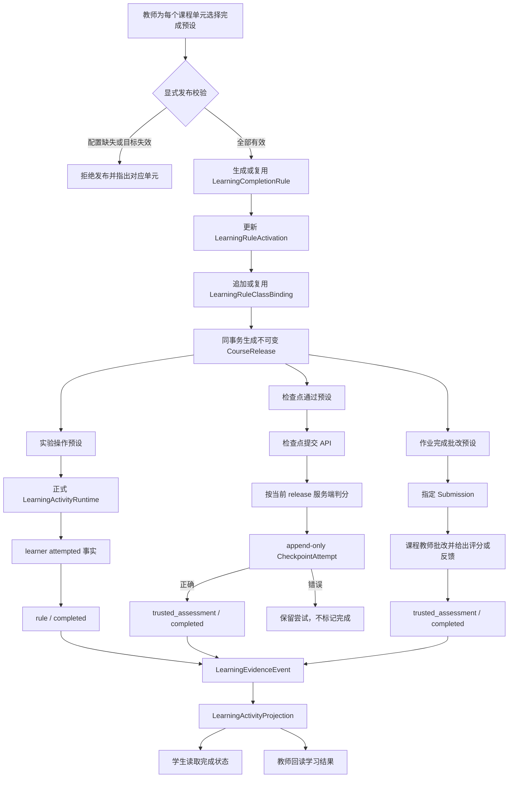

### 当前模型、接口和事务事实

| 范围 | 当前稳定实现 |
| --- | --- |
| 草稿 schema | `CourseUnitRefV2.completion` 使用 `CourseUnitCompletionV1` 保存 preset 和条件目标；教师页面只增加完成方式与目标选择，不重做七类内容编辑器 |
| 规则与绑定 | `LearningCompletionRule` 定义不可变；同定义按哈希复用，不同定义递增版本；`LearningRuleActivation` 指向课程当前规则，`LearningRuleClassBinding` 把规则绑定到隐藏 `course_cohort` |
| 检查点事实 | `CheckpointAttempt` 保存稳定 `client_attempt_id`、请求哈希、release/page/rule 坐标、次数、脱敏回答摘要和服务端判分结果；模型拒绝 update/delete |
| 检查点接口 | `POST /api/v1/courses/{course_id}/units/{unit_id}/checkpoints/{checkpoint_key}/attempts`；响应只返回本次是否正确、次数、是否完成和是否为幂等重放，不返回标准答案 |
| 作业批改 | 既有批改事务允许课程创建者和有效共同教师处理隐藏课程群组提交；符合当前规则时在同一事务追加第一次受信完成事实，失败时批改和完成事实一并回滚 |
| 投影重建 | `LearningActivityProjection` 同时识别正式 runtime 见证和两类 `trusted_assessment` 完成事实；删除投影后可以只依靠 append-only 事实重建 |

### 验证证据与诚实边界

- 后端全量测试到 100% 且无失败；新增覆盖三种预设、规则复用与换版、旧 release、答案脱敏、检查点错误/正确/重放/冲突/超限、投影重建、共同教师批改、重复批改和事务回滚。
- 267 个受跟踪 JavaScript 文件语法检查通过；BE-028 直接相关的课程编辑、课程 authoring、样式分层、角色资源裁剪和缓存代际契约通过。
- 真实浏览器用临时已批准课程验证三种选择、条件目标、草稿保存、检查点规则首发、发布历史和规则编号；移动 `390×844` 无根级横向溢出，异步重绘后的单元操作图标已恢复，console warning/error 为 0。
- 全部 127 项活动本体保持不变。本任务没有增加第四种完成预设，没有支持 question-set 服务端判分，也没有开发自由拖拽、管理员逐内容审核、小程序、服务器部署或竞赛材料。

---

## V8.4.5 三角色工作台聚合读取（BE-029 当前稳定实现）

`BE-029@3dc21bb` 新增 `GET /api/v1/workbench`。接口依据服务端当前用户角色返回 `StudentWorkbenchDTO`、`TeacherWorkbenchDTO` 或 `AdminWorkbenchDTO`，前端不传角色，也不能通过参数越权切换工作台。它只聚合既有课程、成员、发布、作业、学习投影、教师申请、课程修订和组织状态，不新增工作台表，不复制业务状态，不承接任何写入。

| 角色 | 首屏聚合顺序 | 当前唯一下一动作规则 |
| --- | --- | --- |
| 学生 | 我的课程、最近作业、继续学习、提交/反馈数量、行政班身份 | 未完成作业优先，其次继续上次学习、打开课程；没有课程时提示加入课程 |
| 教师 | 我的授课课程、待审批学生、未发布草稿、待批改提交 | 待审批学生优先，其次继续备课、批改作业、管理课程；没有课程时提示创建课程 |
| 管理员 | 待审教师申请、待审课程信息、学校/班级提醒、基础查询总数 | 教师申请优先，其次课程信息审核、组织提醒；没有待办时进入治理总览 |

### 当前接口与读取边界

- `limit` 默认 6、范围 1—20，`offset` 不得为负；每个列表返回 `total / limit / offset / next_offset`。工作台只提供首屏预览窗口，后续完整分页和写操作继续进入既有领域页面与接口。
- 教师课程、学生申请、草稿和待批改数据同时要求有效课程关系与 active 学校教师身份；学校成员失效后，相关课程不会继续出现在教师聚合中。
- 学生课程以 active `CourseEnrollment` 为真值；课程作业再对账隐藏 `course_cohort`、有效成员、开放单元计划、作业 audience/policy 和本人 `Submission`，行政班只作为身份辅助。
- 每个区块独立读取。单一区块失败时返回空的同形分页结果和 `section_errors`，其他健康区块及可用下一动作仍然返回；不会因为一个统计查询失败把整个工作台变成错误页。
- 三种响应都带 `generated_at` 与结构化 `primary_action`，只描述下一动作类型和相关课程/单元/作业/申请 id；FE-042 依据这些标识路由到既有领域页面，实际写入继续调用原领域接口。

### FE-042 可见首页与主要业务跳转（当前稳定实现）

`FE-042@506f4ea` 在学生、教师和管理员原有页面中各增加一个首屏摘要宿主，三者共用 `AstraRoleWorkbenchOverview` 读取与渲染 owner 和 `AstraRoleWorkbenchBridge` 路由桥。首屏固定只读取一次 `GET /api/v1/workbench?limit=6&offset=0`；它不保存课程、审批、草稿、作业或学习结果的第二份状态，也不承接写入。

| 角色 | 可见首屏顺序 | 主要跳转 |
| --- | --- | --- |
| 学生 | 我的课程、最近任务、继续上次学习、提交与反馈、课程入口 | 进入现有课程/作业面板，或聚焦课程码加入入口 |
| 教师 | 我的授课课程、待审批学生、未发布草稿、待批改作业 | 进入既有建课向导、课程成员、内容中心、旧课程范围或批改页 |
| 管理员 | 教师身份申请、课程信息审核、学校与班级提醒、基础总数 | 进入既有教师审核、课程治理、组织治理或总览 |

- 每个角色首屏只有一个“当前唯一下一步”，并保留同级次要入口；聚合分区失败时显示对应区块错误和重试，不用旧数据伪装成功。
- 首次进入在服务端确认角色后挂载；刷新前先清空聚合数据；退出页面、身份失效或切换角色时销毁 owner、终止在途请求并隐藏旧首屏。
- 桥只派发已有 DOM 入口：相同下拉值不会重复触发 `change`。教师管理聚合课程时优先进入 V8.4 内容中心；旧课程未进入内容中心时退回原教师课程范围，不制造不存在的内容草稿。
- 共享样式使用容器查询保护角色页面的真实可用宽度，桌面保持摘要与队列层次，`390×844` 下指标为 2×2、队列单列；所有按钮最小高度 44px，并尊重 `prefers-reduced-motion`。

### 当前三角色工作台数据流（原 P-11）

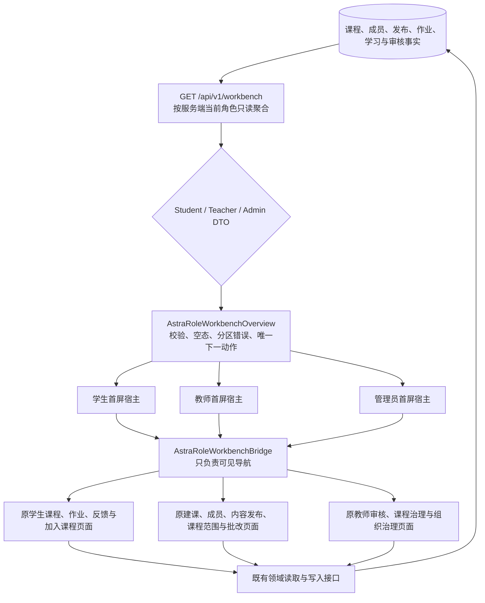

这张图是 `BE-029 + FE-042` 的当前稳定实现：聚合层只帮助用户决定“下一步去哪”，领域 owner 和领域接口继续决定“数据如何读写”。`shared/js/page-registry.js` 只向对应角色加载共享首屏资源；匿名用户和其他角色不会获得三角色工作台资源。

### 验证证据与当前边界

- 5 项专项覆盖未登录、三种角色分派、空状态、1/20 边界、负 offset、两页课程/作业、教师有效/失效学校作用域、管理员双审核队列、组织提醒、聚合总数和单区块故障降级。
- 课程创建、课程信息审核、课程成员定向回归通过；完整后端测试集到 100% 且无失败，仅保留仓库既有 skip/xfail 与两条 SQLite datetime 弃用警告。
- FE-042 专项、角色资源裁剪、教师样式层、课程创建/审核/成员/内容定向合同和 JavaScript 语法门禁通过；真实浏览器覆盖学生、教师、管理员首次进入、唯一主动作、主要跳转、桌面与 `390×844`，无可见横向溢出，console warning/error 为 0。
- 教师聚合课程跳入旧课程范围后，固定 10 秒窗口只有两轮学情读取，与既有 4 秒权威回读轮询一致；首屏桥没有形成重复 `change` 或额外请求循环。
- 本版本没有数据库迁移、写接口、缓存表、后台任务或新安全层，也没有修改 127 项活动、已有实验页面、课程完成规则或用户原有未提交文件。
- 原 P-11 已按真实页面、共享 owner、路由桥和领域写入边界迁入本节；[2 号文档迁移账本](../02-更新规划.md#8-已完成内容迁移账本)只登记权威位置，不再保存第二份详图。

---

## 19. V8.0.34 当前集成状态与维护路线

本节把当前产品结构、教学主线和暂停边界汇总为维护入口；详细任务和未来版本仍以 [`02-更新规划.md`](../02-更新规划.md) 为准。

### 19.1 运行与数据架构

```text
浏览器 SPA / 三角色工作台 / 三个学习空间
              │
              ├─ AstraPageRegistry + Router + ModuleSelector
              │          │
              │          ├─ 工科试验室 90 实验
              │          ├─ 代码空间 18 活动
              │          └─ 未来星系 19 活动
              │
              ├─ AstraApiClient（Cookie Session / no-store / scope gate）
              │          │
              │          └─ FastAPI endpoint → domain service → model
              │                                      │
              │                                      └─ SQLite 展示库 / Alembic 0053
              │
              └─ Learning Evidence runtime
                         ├─ predicted / attempted / corrected / explained
                         ├─ 幂等写入与恢复投影
                         ├─ completed 仅由服务端规则派生
                         └─ 教师按 class/course/student 回读
```

### 19.2 参赛展示主线

```text
学生工作台：当前班课 → 本节目标 → 预计产出 → 唯一下一动作 → 完成回执
                              │
                              ├─ Engineering：预测 → B → C → 判断 → D → 纠正 → 解释
                              │                 └─ Canvas / B-C-D 表 / delta / 模型边界
                              │
                              └─ Physics：预测 → e=.40 → e=.80 → 比较 → 纠正 → 解释
                                                └─ 真实 loop / 首峰 HUD / h/H 表 / 理想参照

教师工作台：当前班课 → 发布/批改下一动作 → 学生进度 → 证据事实 → 反馈与回执
```

### 19.3 当前模块完成情况

| 模块 | 当前实现 | 维护边界 |
| --- | --- | --- |
| 身份与三角色 | 学生、教师、管理员由服务端 Session 权威决定；角色资源延迟加载且不进入共享缓存 | 前端显隐不得替代后端授权 |
| 师生工作台 | 已形成当前班课、目标、预计产出、唯一动作与回执；桌面和 390 样式已接入 V832 | V834 移动回执仍待同 revision 最终浏览器复验 |
| 工程实验 | `#engineering` 保留独立桥梁桁架和 B/C/D 节点荷载观察；`#engineering/robot-arm-ik` 提供三连杆拖动、关节限位、残差、暂停和重置 | 两项都保持直接实验，不注入课程正文或 evidence；路由 owner 负责先销毁再切换 |
| 力学旗舰课 | 只改变 `e=.40/.80`，真实下降/碰撞/首峰、HUD、测量表、比较、纠正与解释 | `H/g/r/vx/damping` 固定；自由探索不推进课程证据 |
| 学习证据 | 幂等事件、离线重放、服务端完成投影、教师回读，以及 0053 双游标服务器恢复半包已进入主线 | 现有旗舰页面仍使用既有证据 owner；统一活动内核、完整 IndexedDB pending 与页面步骤级精确续学尚未接通。客户端不得写 `completed`，读/刷新不得增殖事件 |
| 本地交付 | `astra-local.ps1 + SQLite + 127.0.0.1:9001` 同源运行 | 只代表本地展示版，不代表公网生产、真实 MySQL 或真实课堂实证 |
| 管理治理 | 用户、学校、班级、课程状态、影响确认、乐观并发和审计回读已具备 | 深度分析、任意批量治理和生产运维继续后置 |

### 19.4 当前暂停与恢复顺序

1. 根工作区保持 `主开发@V8.0.36` clean；五个专业长期对接任务已归档，协作代理树仅剩 `/root`，没有后台工作组或非主 Git worktree。
2. 七个脏现场均已转为具名 stash，`u358@3734a2f` 的唯一提交仍由原分支保存；全部 66 条本地分支均保留，恢复索引见 [35-V8 版本发布历史](../03-子文档/35-V8版本发布历史.md) 的 V8.0.35—V8.0.36 记录。
3. 恢复开发时默认继续由用户与主开发单线推进；只有用户以后明确要求并行时，才按实际任务建立最小工作组和新工作树，不批量复活旧组。
4. 恢复产品推进后的第一优先级仍是 V8.0.34 产品字节或新统一 revision 的浏览器终验；之后直接进入师生可见体验、旗舰课程表现和竞赛素材，不先扩张深层后端。

---

---

## 20. V8.0.36 全局功能、业务闭环与展示边界

本节从“用户能做什么、数据怎样流转、评委能看到什么”重新盘点当前系统。它不以文件数量代替产品完成度，也不把已有后端接口自动等同于前端已经完整呈现。

### 20.1 产品与业务全景

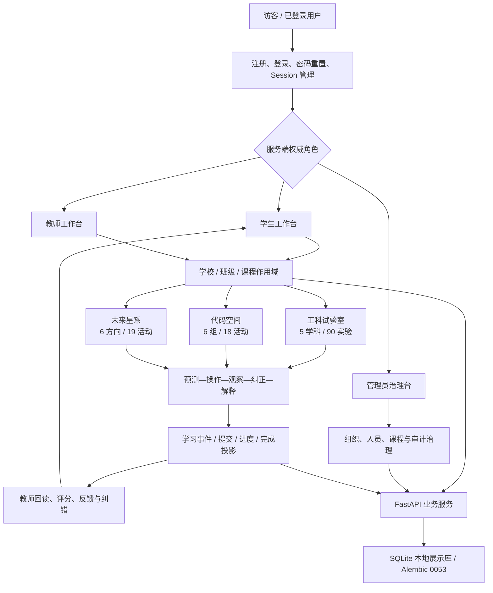

当前仓库约有 640 个受跟踪文件、239 个受跟踪 JavaScript、266 个 Python 文件和 179 个 FastAPI 路由装饰器。这些数字说明项目有真实工程体量，但优秀作品的判断仍取决于下面的业务闭环是否能被稳定演示，而不是代码量本身。

### 20.2 三角色已经实现的业务逻辑

| 角色 / 场景 | 已实现流程 | 权威事实来源 | 当前展示边界 |
| --- | --- | --- | --- |
| 访客与身份 | 注册、登录、退出、密码重置请求/确认、查看和撤销会话；登录后再按角色加载资源 | `/api/auth/*`、`/api/users/me` 与 HttpOnly Cookie Session | 本地展示可用；不把本机账号体系包装成公网生产身份平台 |
| 学生入班 | 无班级时不能绕过入班；输入班级 ID/代码后提交加入，回读本人班级列表确认；网络结果不明时不盲目重投 | 班级、成员关系、加入请求与本人列表 | 流程真实，但首次演示仍依赖预置账号/班级，尚缺一套面向评委的一键演示脚本 |
| 学生选课与继续学习 | 选择班级后只读取该班已发布课程；选择课程后读取 exact-open 单元、作业、个人进度、积分与知识快照；焦点区显示当前班课、本节目标、预计产出、下一动作和完成回执 | 班级—课程挂接、发布计划、单元访问处置、个人进度 | 主线已经清楚；总览、学习空间与三个星系之间仍存在入口层级偏多、返回语义不完全一致的问题 |
| 学生作业 | 查看待完成/待反馈/已批改作业，提交文本答案，网络不确定时先回读再决定，不重复提交；查看得分和教师反馈 | 作业、班级 audience/policy、submission 与 grade | 能演示完整闭环；作业编辑和反馈呈现仍偏管理表单风格 |
| 教师备课与发布 | 选择学校、班级、课程，挂接课程，查看单元，创建作业，设置班级 audience/policy，编排 open/locked/hidden 发布节奏并预览确认 | 课程、单元、挂接、release plan 与乐观并发版本 | 功能丰富，但首屏信息密度偏高；“今日要教什么、下一步做什么”仍需比治理字段更突出 |
| 教师授课后处理 | 查看班级成员、学生进度、待批改作业、代码提交和学习证据；评分、反馈、追加式纠错，并在同一班课范围回读结果 | class/course/generation 作用域、submission、evidence aggregate 与 correction | 已能证明不是静态后台；仍缺少从真实证据计算的简明误区摘要与行动建议，不能用虚构统计补位 |
| 管理员治理 | 查看统计、学校、班级、用户、加入请求、课程状态、内容版本、审计、后台任务与告警；受约束地变更角色/状态、组织状态与课程治理 | 管理 API、版本/影响确认、审计记录 | 后端与治理面很深，但不是当前竞赛主线；只需保留一个清晰总览和少量可讲述操作，不再深挖生产运维 |
| 内容发布 | 建立、修改、提交、撤回、退修、发布内容草稿，查看版本差异并回滚；脚本资源另有审核边界 | content draft/page/version 与审核状态 | 服务端链路完整度高于可见创作体验；当前不投入通用 CMS 重构，只在竞赛路线中补课程内容本身 |

### 20.3 三个学习空间的真实完成层次

| 学习空间 | 已实现的可见能力 | 深度判断 | 对竞赛的使用方式 |
| --- | --- | --- | --- |
| 工科试验室 | 数学 20、物理 21、化学 18、算法 12、生物 19，共 90 个可视化实验；包含 Canvas、图表、模拟、3D 与响应式实验页 | 内容广度很强，但不同实验的模型、交互和说明深度并不完全一致；系统不再给课程划分精品或普通等级 | 作为内容规模与可扩展性背景，可按场景选择力学、双摆、色谱等少量实验深入展示 |
| 代码空间 | 程序起步、控制流程、数据与函数、算法思维、调试与测试、挑战与提交 6 组 18 活动；支持 JavaScript、Python、C、C++ 的预测、运行、轨迹、公开样例预检和正式提交接口 | 浏览器学习运行时与代码修订业务真实存在；默认隔离 runner 不可用，因此不能声称正式 OJ 判题已经完成 | 以 `control-flow.loop-boundary` 做一条 60—90 秒“预测—运行—追踪—修正”辅助展示，诚实显示正式评测边界 |
| 未来星系 | 地球与宇宙、工程、数据、信息、材料、人文 6 方向 19 活动，包含 Canvas、按需 Three.js 与新增机械臂互动 | 目录和基础互动完整；工程方向当前有直接桥梁和机械臂页面，历史 `engineering.load-path` 证据身份不等于当前页面仍运行旧课程链 | 作为跨学科内容空间，按教师授课课程选择活动；不强行给每项活动接入完整证据内核 |

### 20.4 两门旗舰课的核心闭环

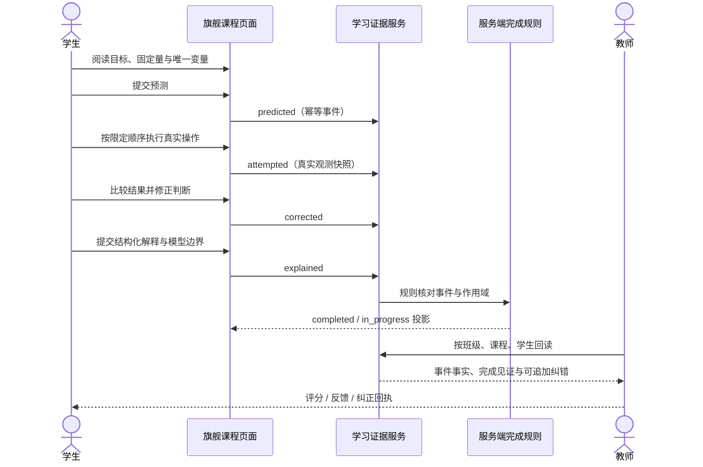

- `physics.mechanics` 固定落高、重力、半径、水平速度和阻尼，只比较 `e=0.40` 与 `e=0.80`；页面必须等待真实下降、碰撞和第一次反弹峰值，再把实测 `h/H` 与理想 `e²` 对照。自由探索、乱序或未确认回执不能推进课程事实。
- `engineering.load-path` 使用固定 60 kN、15 杆教学桁架，按 B 基线、C 变量变化、观察后判断、D 镜像纠正推进；Canvas、支座反力、杆力、差值和模型边界来自同一次精确求解结果，动画不反向制造证据。
- 两课都由客户端写 `predicted/attempted/corrected/explained`，由服务端规则派生 `completed`。这条“学生不能自己宣布完成”的边界是当前最有论文价值的技术差异化之一。

### 20.5 技术层已经不是空壳，但不再是首要投入点

| 技术层 | 当前已有 | 展示期决策 |
| --- | --- | --- |
| 前端运行 | 原生 JavaScript SPA、页面注册表、Router、ModuleSelector、按角色/页面延迟加载、Service Worker、Canvas/Three.js 生命周期与响应式 | 只做能改善导航、首屏、动效、内容与录屏稳定性的窄修；不重写 React/Vue，不为“现代化”推倒现有页面 |
| 业务后端 | FastAPI endpoint → service → SQLAlchemy model，覆盖身份、组织、课程、作业、代码提交、内容、证据、积分、知识与治理 | 已足以支撑毕设和本地竞赛演示；除展示闭环确实需要外，不再新增加密、审计、后台任务或复杂治理能力 |
| 数据与迁移 | SQLite 本地展示、Alembic 单一 head `20260810_0053`，既有 MySQL DDL/条件门禁 | 展示期只保护现有迁移和数据一致性；真实 MySQL、并发压测、生产备份与发布证据后置 |
| 学习证据 | 幂等事件、服务端完成、纠错、教师聚合、0053 运行身份/双游标服务器半包、统一活动合同 | 两门旗舰继续使用已稳定链路；完整六课统一内核、IndexedDB 精确续学和复杂离线冲突暂缓，不让低可见工作吞噬赛前时间 |
| 代码执行 | 四语言浏览器学习运行时、正式提交/修订/attempt 数据合同、诚实 `runner_unavailable` | 保留公开样例与过程可视化；不在本轮自建隔离 OJ 沙箱，也不冒充判题成功 |

### 20.6 面向优秀毕设 / 多媒体竞赛的当前缺口

按“可运行功能”衡量，项目已经接近完成；按“评委在有限时间内是否能一眼理解、顺畅操作、形成记忆点”衡量，仍有明显尾差：

1. **入口与叙事仍偏复杂**：总览、身份工作区、工科目录、未来星系和独立代码空间都是真实入口，但三分钟演示没有唯一导览主线。
2. **深度分布不均**：两门旗舰课足以证明方法，其余 122 个实验/活动主要证明广度；若连续翻页，容易产生“很多页面、核心研究问题不够集中”的观感。
3. **教师价值没有被压缩成一眼可读的决策**：目前能查到真实提交和证据，却仍需评委理解表格、分页和内部状态；缺少“哪个学生卡在哪一步—依据是什么—教师下一动作是什么”的聚焦表达。
4. **竞赛交付包尚未成型**：缺统一演示账号/种子、三至五分钟脚本、关键截图、短视频、论文图表、能力边界卡和故障后的快速复位流程。
5. **当前最新视觉返修未做同版本终验**：V8.0.34 的移动回执与工程 C/D 同帧需要在同一 revision 上完成真实浏览器复验，不能继承 V8.0.26 或 V8.0.30 的旧结论。
6. **部分技术说明会抢走作品重点**：安全、审计、发布和恢复设计很深，但竞赛讲述若从这些开始，会掩盖学生交互、教学动画与教师反馈这条真正可见的主线。

现阶段应把既有后端视为稳定底座，把主要时间投入师生前端、课程内容、动画、演示数据和交付包装。未来任务、比例与人日估算见 [`02-更新规划.md`](../02-更新规划.md) 第 1.5 节。
