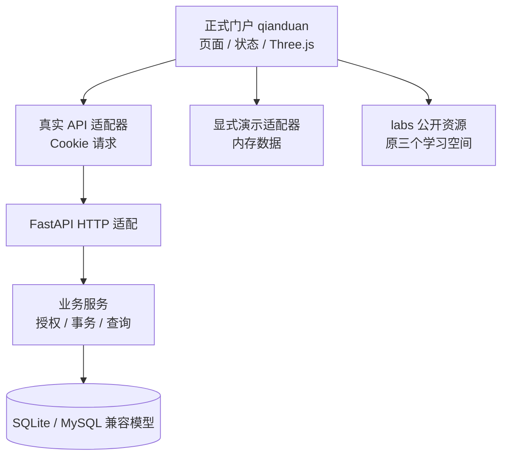
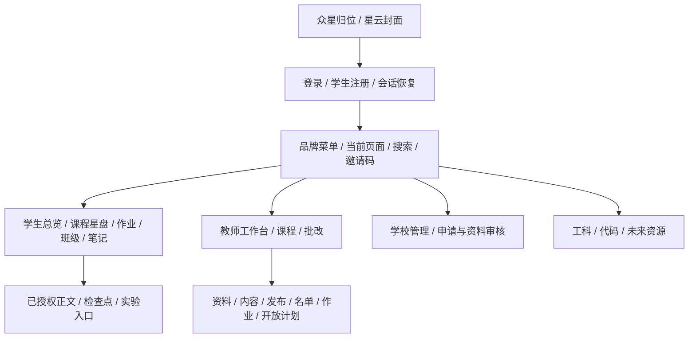
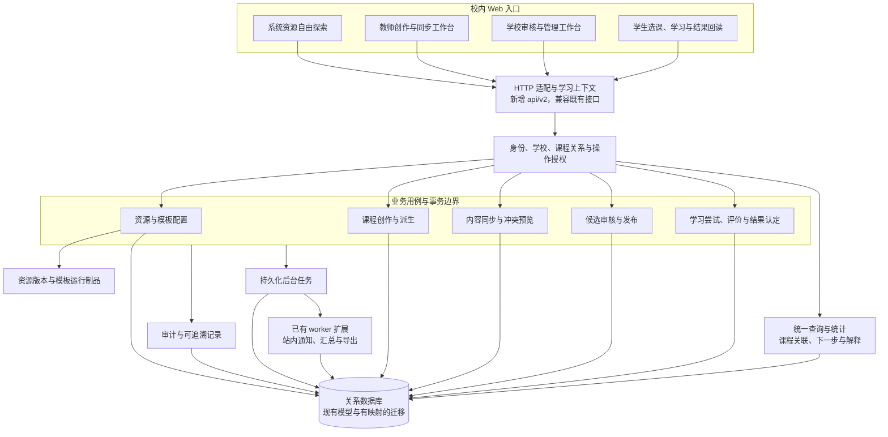
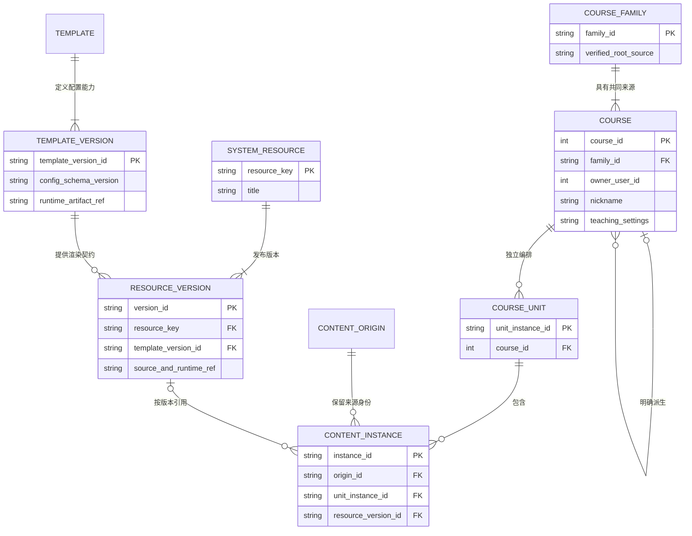
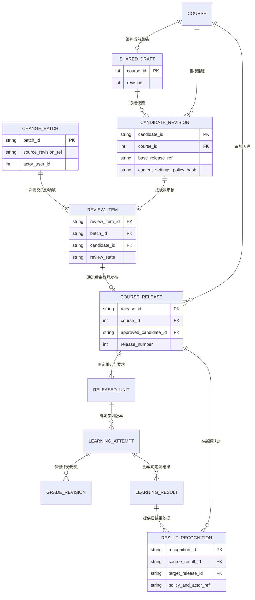
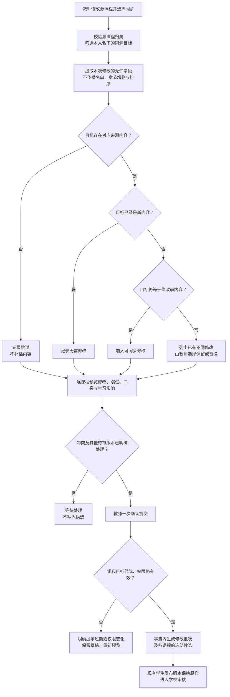
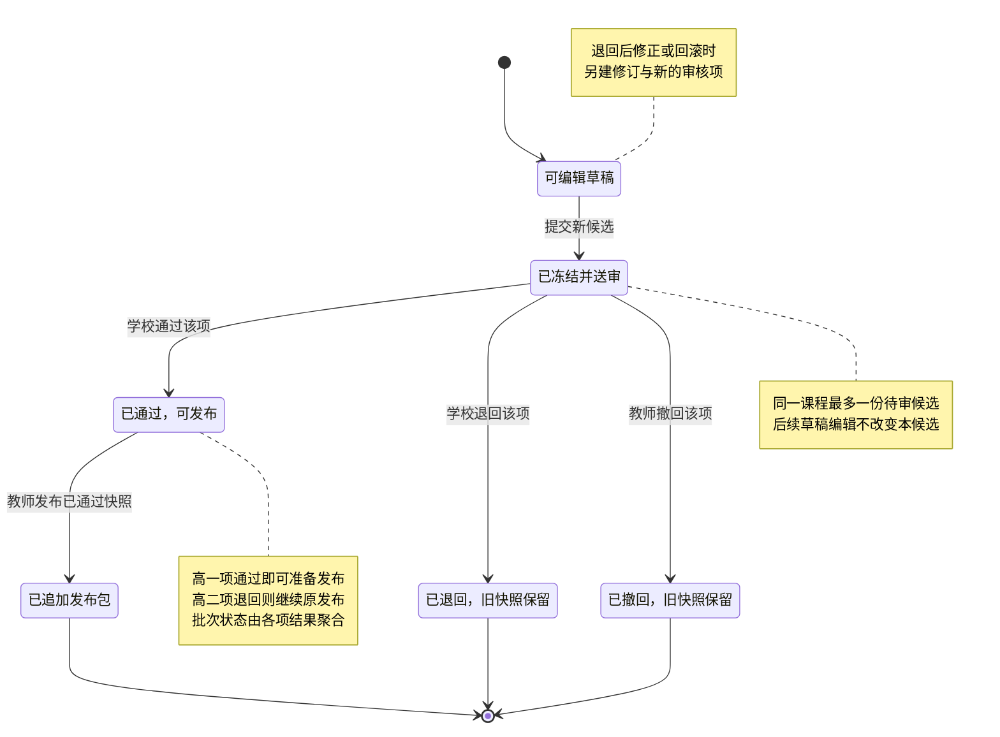
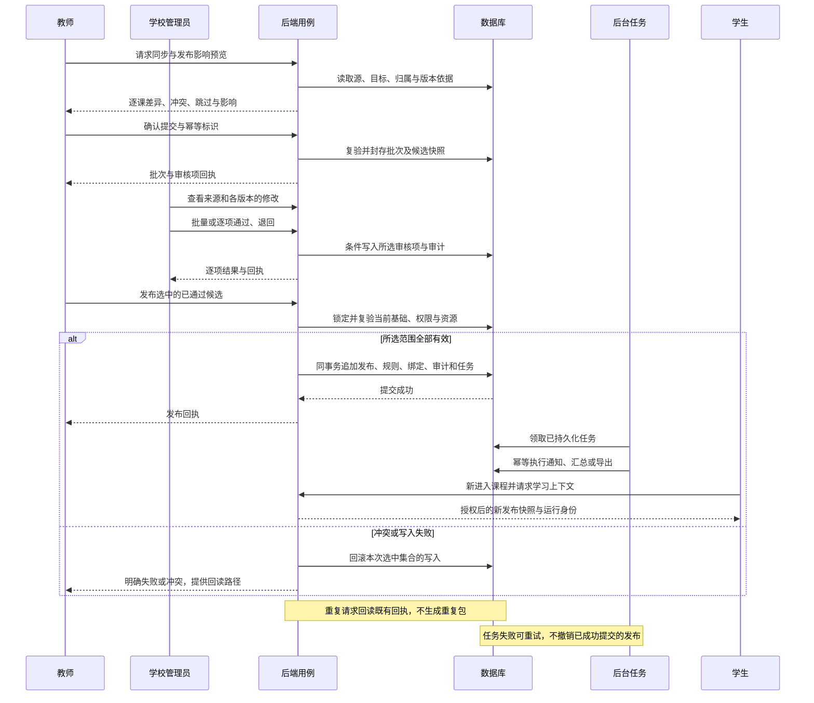
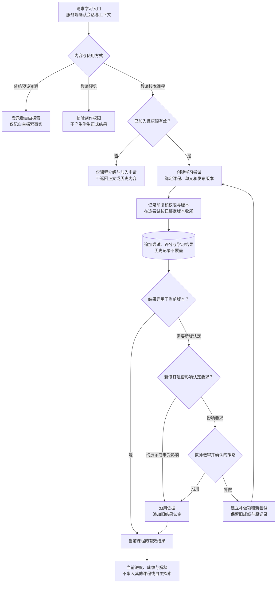

# 星序 Astra — 开发者手册

> **文档梗概**：说明正式门户、三个学习空间和教学后端的当前实现、数据边界、维护入口；第 13 章保留已确认但待实现的目标架构。
>
> **具体规划法则**：代码和验证决定当前事实；业务规则、任务和进度只在 [02](02-更新规划.md) 维护，提交及历史验收只在 [03](03-发布历史.md) 维护。类型和接口字段链接权威代码，不再复制多份字段表。
>
> **当前基线**：业务代码沿用 2026-09-08 收口；正式前端为 `qianduan/`，FastAPI 为业务权威。2026-09-16 已进入持续开发：资源版本与课程谱系存储基础、资源目录与模板预览已交付，剩余流程按 02 推进。
>
> **最后一次更新时间**：2026-09-16
>
> **更新者**：主开发组

## 目录

1. [产品与角色](#1-先用五分钟理解项目)
2. [系统架构](#2-系统全局架构)
3. [角色、作用域与班级](#3-角色作用域与班级业务)
4. [学习空间与课程资源](#4-三个学习空间与课程内容)
5. [页面与前端实现](#5-前端页面路由与可见交互)
6. [后端与数据一致性](#6-后端能力与数据闭环)
7. [关键业务旅程](#7-关键业务旅程)
8. [代码定位](#8-仓库入口与开发顺序)
9. [启动与验证](#9-启动与最小验证)
10. [当前完成边界](#10-当前完成边界)
11. [新增内容与空间](#11-扩展接口与维护边界)
12. [文档职责](#12-其他权威文档)
13. [目标架构与七组设计图](#13-目标架构与设计待实现)

## 1. 先用五分钟理解项目

星序将交互学习资源与教学管理结合。当前优先服务单校 Web、本机毕业设计和竞赛展示；微信小程序、跨校平台和公网业务运营没有纳入已完成能力。

| 对象 | 当前职责 |
| --- | --- |
| 学生 | 加入课程、阅读已授权发布、打开实验、提交作业和检查点、查看反馈、保存个人笔记 |
| 教师 | 申请身份、创建课程、编排共享草稿、显式发布、管理成员、设置开放计划、批改 |
| 管理员 | 审核教师和课程资料、管理组织和账号；审计及后台任务有独立后端接口 |
| 系统资源 | 工科 90、代码 18、未来 19，共 127 个活动身份；数量不等于独立高质量课程数量 |
| 授课课程 | 教师组织的教学实例，拥有自己的成员、单元、发布和成绩；不能与资源目录混为一谈 |

## 2. 系统全局架构

### 2.1 运行时上下文

源码在 `main`；`qianduan` 分支只保存编译后的 Pages 演示制品。两种构建共用页面和数据接口约定，实际数据源明确分开：

| 模式 | 产物与入口 | 权威数据 |
| --- | --- | --- |
| 本机完整版本 | `qianduan/dist`；`astra-local.ps1` 在 9001 同源提供门户与 API | Cookie 会话、FastAPI、SQLite |
| 静态演示 | `qianduan/dist-demo`；[GitHub Pages](https://falling-feather.github.io/Astra/) | 明确标识的三角色内存样例，刷新重置 |
| 保留实验 | 构建时复制公开资源至 `labs/` | 数值求解和交互仍在原实验源码中；自由探索不自动计课程成绩 |

### 2.2 分层结构

下图是当前实现。部署方式不改变 FastAPI 对权限、发布和学习结果的决定权。



数据服务入口是 [api-gateway.ts](../qianduan/src/services/api-gateway.ts)、[school-api.ts](../qianduan/src/services/school-api.ts) 和 [http-client.ts](../qianduan/src/services/http-client.ts)。网络失败不会自动切换为演示成功；页面不把凭据或学习正文存入普通浏览器存储，不缓存业务 API。

### 2.3 静态服务与业务服务的边界

正式门户使用 TypeScript、Vite、原生 DOM、Three.js；原实验保留 JavaScript、Canvas、DOM 或 Three.js。后端使用 FastAPI、SQLAlchemy 与 Alembic。准确依赖版本由 lockfile 和配置决定。

Node/C++ 静态服务保留兼容及构建验证用途，不承担教学业务。当前本机入口 [local_preview.py](../backend/app/local_preview.py) 挂载构建后的门户及经过限制的公开目录，不能用仓库根目录作为任意静态文件根。

## 3. 角色、作用域与班级业务

### 3.1 身份与课程权限

默认注册只能创建学生。教师身份经申请审核；学校由管理员创建。课程创建者、共同教师、课程成员和行政班成员是不同关系，不能仅凭全局角色读写任意课程。

服务端入口见 [auth.py](../backend/app/api/endpoints/auth.py)、[teacher_applications.py](../backend/app/services/teacher_applications.py)、[access_control.py](../backend/app/services/access_control.py) 与 [course_authoring.py](../backend/app/services/course_authoring.py)。Cookie 写请求限制为同源或显式允许的前端来源；页面隐藏不能替代授权。

### 3.2 班级与教学范围

行政班 `homeroom` 表达学校组织；`course_cohort` 是课程内部教学范围。前端通过 [课程班级目录](../backend/app/services/course_class_directory.py) 取得真实关系，不从班名猜 ID。

课程支持校内申请加入和指定班级准入；普通学生不能经旧式直接入班接口自行建立或批准关系。内部教学范围的开放计划由课程教师管理，行政班仍遵守对应教师权限。

### 3.3 当前与目标的区别

当前已有教师申请、课程资料审核、共享草稿、发布和选课。课程家族、内容同步、学校对候选内容快照的逐门/批量审核、换版补做仍是第 13 章及 02 的目标，不能把“资料审核通过”写成“每次正文修改均已审核”。

## 4. 三个学习空间与课程内容

| 空间 | 当前目录 | 实现入口 |
| --- | --- | --- |
| 工科实验室 | 数学 20、物理 21、化学 18、算法 12、生物 19 | [config.js](../shared/js/config.js)、[experiment-registry.js](../shared/js/experiment-registry.js)、`pages/` |
| 代码空间 | 6 组、18 个活动；预测、运行、追踪与修正 | [课程清单](../codevis/shared/js/course-manifest.js)、[运行说明](../codevis/README.md) |
| 未来星系 | 6 个方向、19 个活动身份 | [frontier-manifest.js](../pages/frontier/frontier-manifest.js)、`pages/frontier/` |
| 统一投影 | 空间、学科与活动稳定身份 | [learning-activity-catalog.js](../shared/js/learning-activity-catalog.js)、[catalog.mjs](../qianduan/scripts/catalog.mjs) |

内容成熟度不完全一致；部分活动身份共用模型。数学扩展、学习路径与共同质量标准见 [02 第 2.12—2.14 节](02-更新规划.md#212-实验端课程拓展与统一改进计划)，不能只用目录数量推断教学质量。

力学和桥梁当前是直接实验，不能恢复已撤换的课程叙事层。科学计算与画面渲染分开，3D 动效不能替代物理或数学结果。双摆、色谱和机械臂的公式、假设、误差、样例和来源保留在 [15 号实验指南](01-子文档/15-学科实验与内容开发指南.md)。

## 5. 前端页面、路由与可见交互

### 5.1 页面层次



门户使用 `#/overview`、`#/courses`、`#/course/{id}` 等路由；实验内部保留原 Router/PageRegistry 深链。两者不能共用一份可被页面任意改写的教学状态。

### 5.2 已经可见的交互能力

| 页面 | 实际行为 |
| --- | --- |
| 开屏与登录 | 程序化三维星云、鼠标跟随和拖拽；真实账号会话与独立演示视角 |
| 学生总览 | 最多三项任务、课程表、日历；课程星盘主要显示两门，过渡时最多三门 |
| 教师课程 | 资料与共同教师、准入条件、送审、内容编排、版本查看/比较/恢复、成员、作业和开放计划 |
| 学生学习 | 授权正文、锁定提示、携带发布 ID 的检查点、作业提交、退回与教师反馈 |
| 个人资料与笔记 | 本人资料；笔记分页、保存、删除、导出和修订冲突 |
| 学校管理 | 教师申请、课程资料审核、账号停用/恢复、基本学校和班级管理 |

### 5.3 生命周期与资源边界

页面和实验都有成对的进入、退出生命周期。监听器、观察器、定时器、请求和 GPU 资源随所属页面释放；迟到响应不能覆盖新页面或新课程状态。未保存草稿在离页前提示，写入结果不明时不盲目自动重发。

图形层限像素密度、支持减少动态效果和基本画面降级。星盘切换、后台节流与容器尺寸变化不能影响业务身份。原实验的 owner 和清理契约仍由原注册表管理，不能因为新门户使用 iframe 就略过内部销毁。

<a id="54-qianduan-独立前端原型"></a>
### 5.4 正式门户的实现与数据适配

| 代码 | 职责 |
| --- | --- |
| [main.ts](../qianduan/src/main.ts) | 开屏、会话、路由、导航、个人笔记协调 |
| [contracts.ts](../qianduan/src/portal/contracts.ts) | 教学 DTO 与服务约定 |
| [workspace.ts](../qianduan/src/portal/workspace.ts)、[views.ts](../qianduan/src/portal/views.ts) | 角色业务页面控制与渲染 |
| [unit-editor.ts](../qianduan/src/portal/unit-editor.ts) | 草稿派生，保留未编辑的复杂内容 |
| [services](../qianduan/src/services/) | 真实请求、课程展示转换与显式内存演示 |
| [domain](../qianduan/src/domain/)、[render](../qianduan/src/render/) | 日期、轮盘状态、星云与渲染资源 |
| [markdown.ts](../qianduan/src/ui/markdown.ts) | 允许列表 Markdown 渲染，不接收任意 HTML 或脚本协议 |
| [构建与发布脚本](../qianduan/scripts/) | 目录导出、公开资源打包、制品校验与独立索引发布 |

新编辑器目前提供基础文字、活动引用和两选一检查点；已有复杂题型、媒体和来源块保留，完整素材服务及复杂块编辑仍待实施。早期未进入资料审核的资源课程保留数据与兼容 API，不自动补造审核、家族或发布记录。

## 6. 后端能力与数据闭环

### 6.1 API 领域

权威接口注册位于 [router.py](../backend/app/api/router.py)，DTO 在 [schemas](../backend/app/schemas/)，数据库模型在 [models](../backend/app/models/)。当前基础教学保留 `/api` 与 `/api/v1`；`/api/v2` 已提供资源与模板预览，其余治理流程继续实施。

| 领域 | 实现与维护入口 |
| --- | --- |
| 会话、用户、本人笔记 | `auth_sessions.py`、`users.py`、`user_profile.py`、[user_notes.py](../backend/app/services/user_notes.py) |
| 身份、组织和课程准入 | `teacher_applications.py`、`course_authoring.py`、`course_information_reviews.py`、`course_enrollments.py` |
| 草稿与不可变发布 | [content_platform.py](../backend/app/services/content_platform.py)、[content_platform schema](../backend/app/schemas/content_platform.py) |
| 单元开放与完成统计 | [course_release_plans.py](../backend/app/services/course_release_plans.py)、[course_learning_metrics.py](../backend/app/services/course_learning_metrics.py) |
| 作业与评分 | [submissions.py](../backend/app/api/endpoints/submissions.py)、`assignment_policies.py` |
| 学习事实与运行 | [learning_evidence.py](../backend/app/services/learning_evidence.py)、[learning_activity_runtime.py](../backend/app/services/learning_activity_runtime.py)、`course_completion.py` |
| 管理、任务与审计 | [admin.py](../backend/app/api/endpoints/admin.py)、[background_tasks.py](../backend/app/services/background_tasks.py)、`audit.py` |
| 代码学习 | [code_judge.py](../backend/app/services/code_judge.py)；浏览器预检不等于正式隔离判题 |

上表未带目录的服务文件均位于 `backend/app/services/`。字段与状态码以代码及自动 OpenAPI 为准，文档只解释跨模块语义。

### 6.2 学习事实、结果与版本

检查点尝试、作业批改与实验操作是不同的完成依据。页面提交操作事实，服务端按规则决定完成；浏览次数、停留时间和装饰动画不等于掌握。

学生打开正文时绑定发布 ID，发生冲突不能悄悄把尝试投到新版。已发布内容和历史版本读取仍受当前成员关系及开放计划约束：隐藏单元不返回，锁定单元只返回提示，不包含原题目、答案或媒体正文。

运行上下文固定课程、单元、用户、运行和发布身份。学习者命令序号与服务端事实序号是两种游标：服务端派生事件会增加事实序号，但不占用下一次学习者命令序号。幂等重放保持原事实位置，不能把两种序号合成一个计数器。

恢复必须校验运行身份、快照和配套事实元数据；缺失、漂移或无法确认的批量待发送记录应要求重新核验，不把未经确认的浏览器数据当成服务器结果。活动适配器采用准备/返回、运行时成功后再提交的边界，不能宣称这个约定能回滚任意外部副作用。相关运行、恢复、并发绑定与失败分支由机器契约和行为测试维护；结构校验本身不证明学生操作的真实性。

原 evidence client、队列和 runtime 仍有兼容职责：`app-session → loader → queue/client → catalog/activity` 的资源代际须一致。ARCH-004 的运行身份与恢复字段见 [机器契约](../tools/architecture/v76-module-boundaries.json) 和相应回归；并非所有新门户页面都已接入精确离线续学，不能把兼容能力宣传成全平台支持。

### 6.3 数据一致性与已修复边界

- 共享草稿与个人笔记使用整数修订条件；过期写入拒绝，不能采用最后保存覆盖。
- 草稿移除单元只改变草稿成员关系，不提前撤销当前发布。发布成功后才在同一事务中切换学生可见范围。
- 已保存单元的 `activity_key` 不可重新指向另一活动；历史恢复使用 `source_course_unit_id`，不按标题或下标猜测。
- 发布包保留内容与规则快照，成绩、尝试和审计不因修订被删除。
- 开放计划变更后使用最近有效的规则绑定统计完成，不把已有完成数清零。
- 已新增本人笔记及资料编辑修订迁移 `0059`；`0060` 修复旧的发布单元派生状态。迁移不删除原学习事件。

实体表与外键以模型为准；当前唯一迁移 head 是 `20260916_0061`。0061 增加资源版本、独立课程家族、单元来源、修订/修改批次/候选/审核项和幂等发布回执表；旧课程逐门建立独立根，旧发布的候选引用保持空，不补造审核。此处仅为存储基础，新 /api/v2 业务及页面尚在后续批次。旧事件/进度与 evidence/runtime/projection 并存仍是技术债，后续应迁移到统一语义，而非建立另一份完成真值。

## 7. 关键业务旅程

### 7.1 学生学习旅程

登录 → 申请或按条件加入课程 → 读取已授权发布 → 学习、回答或提交 → 服务端评价 → 回读分数、反馈和完成。系统资源自由探索与授课记录分开；无教学范围时不伪造班级归属。

### 7.2 教师教学旅程

教师身份审核 → 填报课程资料与准入条件 → 学校审核资料 → 编排共享草稿 → 显式发布 → 安排单元开放和作业 → 处理加入申请及批改。历史版本可比较、预览和恢复为新草稿；跨课程同步与候选正文审核尚未接入。

### 7.3 管理员治理旅程

审核身份和课程资料，维护账号及组织状态。批改分数不因管理员具有较高角色就成为任意代写行为；所有写操作仍按具体资源权限执行。

### 7.4 当前验证范围

2026-09-08 已完成真实建课、审核发布、学生提交、教师批改、重启后回读成绩、笔记与检查点完成回读。具体证据、测试计数和部署提交只在 [03 本阶段记录](03-发布历史.md#8-2026-09-07-正式门户接入与前后端封装) 保存；它们不是后续任一修改的自动验收结果。

## 8. 仓库入口与开发顺序

| 目录 | 维护对象 |
| --- | --- |
| `qianduan/` | 唯一正式门户，真实/演示适配与部署制品 |
| `pages/`、`shared/`、`index.html` | 保留实验、公共资源入口与兼容角色代码 |
| `codevis/` | 代码空间与固定版本浏览器运行时 |
| `backend/app/` | HTTP 适配、业务服务、模型、配置与数据库访问 |
| `backend/alembic/` | 结构及派生状态迁移 |
| `backend/tests/`、`qianduan/tests/`、`tools/tests/` | 对应业务、门户和原实验合同 |
| `tools/templates/`、`tools/quality/` | 新实验模板与注册、模型、素材、保护检查 |
| `server/` | 兼容静态服务、C++ 构建及制品清单 |
| `doc/` | 当前必要文档；旧报告和冻结规划从 Git 追溯 |

新功能先定位 02 的任务及相关 DTO、服务和页面；修改权威实现，补最近的行为回归。不要把旧角色页面发展成第二个正式门户。大型控制器按业务职责逐步拆分，避免用全面换框架代替具体改进。

## 9. 启动与最小验证

### 9.1 推荐启动

在仓库根目录执行：

```powershell
powershell -ExecutionPolicy Bypass -File .\astra-local.ps1
```

成功后从 `http://127.0.0.1:9001/` 访问真实版本。数据目录、管理员引导、依赖约束、演示构建与 Pages 发布统一见 [04 部署指南](04-部署指南.md)，避免在多个手册重复配置细节。

### 9.2 按改动选择验证

| 改动 | 最接近的验证 |
| --- | --- |
| 后端业务、权限或数据库 | `.venv/Scripts/python.exe -m pytest backend`，先定向，再按影响扩大 |
| 正式门户 | `npm --prefix qianduan test`、`run build`、`run verify:package`；流程变更补浏览器操作 |
| 原实验、目录或生命周期 | 受影响 `tools/tests/*`、实验保护检查；阶段收口再运行 `npm test` |
| 演示打包 | `build:demo`、`verify:demo` 与目标子路径真实打开 |
| 文档 | 文件、目录、相对链接、锚点、图文语义及 `git diff --check`；触及工具引用时补关联合同 |

构建运行环境先核对 [04 环境约束](04-部署指南.md#1-运行方式与环境)。MySQL 专项与 SQLite 不能互相替代；实际负载、真实课堂、生产恢复和正式 OJ 各有独立验证范围。

## 10. 当前完成边界

当前可展示正式星云门户、三角色基础教学流程、127 项资源目录、本机持久化记录与静态演示。学校管理新页面只覆盖必要审核和组织操作，不覆盖所有旧运维面板。

尚未完成课程家族、跨分叉同步、候选内容批审、补做与旧结果认定、完整媒体/复杂块编辑、统一跨课程学习路径。公网业务后端、真实课堂效果、正式隔离执行与完整移动端精调未作为已完成能力。

资源数量不是课程质量结论；前三类学习空间仍存在模型与解释差异。具体改进按 02，不再把历史“精品课优先”“所有实验冻结”“固定行数即架构质量”当成当前产品规则。

## 11. 扩展接口与维护边界

新增主题与新增学习空间是不同工作。`Course.galaxy_key`、`subject_key` 可容纳新分类，但正式导航、教师选项、活动路由、打包目录和官方活动白名单仍有三空间配置。

| 扩展位置 | 当前权威代码 |
| --- | --- |
| 门户入口与页面视图 | [models.ts](../qianduan/src/domain/models.ts)、[shell.ts](../qianduan/src/ui/shell.ts)、[main.ts](../qianduan/src/main.ts) |
| 活动身份、标题和入口 | [共享目录](../shared/js/learning-activity-catalog.js)、[目录导出](../qianduan/scripts/catalog.mjs) |
| 教师可引用活动 | [views.ts](../qianduan/src/portal/views.ts)、[官方活动白名单](../backend/app/schemas/official_activity_keys.py) |
| 公开资源打包 | [package-resources.mjs](../qianduan/scripts/package-resources.mjs) |
| 原实验模型与注册 | [15 号指南](01-子文档/15-学科实验与内容开发指南.md) |
| 旧模块边界门禁 | [机器契约](../tools/architecture/v76-module-boundaries.json)、[边界合同](../tools/tests/architecture-boundary-contract.cjs) |

空间元数据已集中至 [learning-spaces.v1.json](../backend/app/catalogue/learning-spaces.v1.json)，正式导航与教师分类由它生成。新增纯前端 bundle 使用独立空间 key、space: 路由、extensions/<key>/public 制品及 astra-activities.json 目录，构建与后端安装均检查身份、入口和路径范围。已有三个空间仍保留原运行器；新空间的正式学习记录仍需按声明能力接入，不因能打开页面就自动计分。适用学段、难度与先修关系也不能都塞进星系名称。

机器契约中的旧任务号、候选处置和路径白名单是兼容追溯信息，当前改动范围由用户授权、02 与有效行为回归决定。文档精简不删除运行时保护检查或科学模型依据。

### 11.1 资源目录与模板预览

`/api/v2/spaces` 和 `/api/v2/resources` 提供登录后的有界目录；管理员通过 `POST /api/v2/resources/install-system` 一次载入 127 个原活动描述和 2 个模板。安装不覆盖既有 v1 资源版本，重复执行不重复建版本；教师没有修改系统原件的入口。

函数模板采用有长度/深度/数值界限的算术语法，支持声明参数及受限函数，无动态代码执行。数据模板支持有限行列的柱状/折线图。服务器校验和浏览器预览使用共同样例验证语义，定义域外采样明确留空。预览本身不生成学习记录或分数。

`#/resources` 提供筛选、分页、参数和数据预览。课程内资源引用、素材文件管理仍在本批次后续，不把独立预览等同于完整编课。旧活动运行器标记兼容模式，不宣称冻结了全部历史运行字节。

新 v2 DTO 由 [export_portal_contracts.py](../backend/scripts/export_portal_contracts.py) 从 OpenAPI 的 v2 依赖生成至 `qianduan/src/portal/api-v2.generated.ts`；`--check` 检查漂移。对应目录、模板配置、预览服务和前端均使用这份协议来源。

## 12. 其他权威文档

| 文档 | 何时阅读 |
| --- | --- |
| [00 项目总纲](00-项目总纲.md) | 确认定位与文档入口 |
| [02 更新规划](02-更新规划.md) | 核对完整目标、任务依赖和验收 |
| [03 发布历史](03-发布历史.md) | 核对实际提交、验证与历史恢复方式 |
| [04 部署指南](04-部署指南.md) | 运行、构建、数据目录和发布 |
| [05 UI 规范](05-UI规范模板.md) | 修改正式门户和实验视觉 |
| [15 实验指南](01-子文档/15-学科实验与内容开发指南.md) | 新实验接线、科学模型与数值复核 |

## 13. 目标架构与设计（待实现）

本章按项目负责人要求展开完整目标架构与七组设计图。资源目录/模板预览与部分存储模型已落实，现状见前文，其余仍按 02 待实施任务推进。第 1—12 章及其实现子文档继续描述可核实的当前系统；本章出现的新模型、流程与 `/api/v2` 不表示已经上线。业务规则、正式任务和验收条件只在 [02 完整实施方案](02-更新规划.md#2-完整实施方案) 与 [当前任务状态](02-更新规划.md#3-当前任务状态) 维护。

| 对照项 | 当前实现起点 | 本轮目标 |
| --- | --- | --- |
| 内容与课程 | 活动目录、课程单元、共享草稿和不可变发布 | 增加系统资源/模板版本、课程家族、教学分叉和稳定内容来源 |
| 审核 | 课程信息审核与教师内容发布分离 | 学校审核冻结的课程候选及其影响，支持逐项与批量批复 |
| 同步 | 页面有版本差异和影响预演 | 后端按本人名下同源内容产生跨课程同步计划与修改批次 |
| 学习 | 旧事件与证据、运行和投影并存 | 明确学习上下文、尝试/评分历史和新版对旧结果的认定 |
| 客户端 | `/api`、`/api/v1` 与现有页面 | 增加 `/api/v2`，兼容读取与统一发布检查 |

### 13.1 系统分层与模块职责

第一组图描述校内目标系统的职责方向。图中的箭头表示目标调用或数据连接，不是已完成状态。



- **职责**：HTTP 层只做请求/响应适配；业务用例拥有事务；查询不产生第二套完成真值；后台任务处理已持久化的后续工作。
- **数据来源**：现有认证、学校、课程、发布、证据与任务模型，加上经过迁移的新版本/谱系关系；前端不自行声明身份或“已审核”。
- **关键约束**：单校使用；系统资源和校本课程具有不同访问边界；业务写入与审计、任务入队保持一致；外部投递不因新站内任务而开启。
- **迁移位置**：`backend/app/api/` 保留适配，`backend/app/services/` 按领域整理，`backend/app/models/` 与 `backend/alembic/` 维护真实映射；原生 Web 页面继续经现有注册和生命周期接入。详见 [02 第 2.9—2.11 节](02-更新规划.md#29-目标接口与兼容方式)。

### 13.2 系统资源、模板与课程分叉关系

第二组图区分系统原件、模板、来源和使用实例。实体及字段是目标概念关系，不是本次新增的数据库表。



**高一版与高二版**是同一家族中的两个课程对象，有不同课程 ID、昵称、设置、名单和发布历史；**高一版修订 1、修订 2**属于同一课程的内部修订。两者不能共用一个“版本号”字段或依靠学科名区分。

- **职责**：资源版本保存原件与运行依据，模板定义允许修改的能力，分叉保存教学安排，实例表示某处具体使用。
- **数据来源**：受控的资源取用与派生操作；来源身份由服务端建立。纯文字块不要求引用运行资源，但仍有自己的实例与来源身份。
- **关键约束**：同一资源可以出现多次，实例和学习结果独立；取用不复制学生记录；相同标题、模板或学科不自动产生同源关系。
- **迁移位置**：以现有 `Course`、`CourseUnit`、内容块和活动目录建立映射；保留旧键作为兼容依据，不猜测旧课程家族。配置和字段定义由 [02 第 2.1—2.3 节](02-更新规划.md#21-术语身份与模型边界) 控制。

### 13.3 草稿、候选、审核项与发布数据关系

第三组图展开版本管理的保存对象：可变草稿、不可变候选、独立审核结论、发布结果和学习来源分别保存。



- **职责**：一个修改批次有多个审核项，每项对应一门课程的候选。审核不直接改变学生发布指针；发布只消费已通过的候选。
- **数据来源**：候选固定内容、配置、资源版本和补做策略；学习尝试绑定实际读取的发布版本；结果认定引用既有事实，不修改原事实。
- **关键约束**：审核后的草稿修改不能进入既有候选；补做和再次评分生成新记录；回滚也生成新修订。该图不把已有 `transferred` 状态重新定义为版本继承。
- **迁移位置**：在现有 `ContentDraft`、`CourseRelease`、证据投影和提交批改模型上增量建立关系，清楚记录哪些沿用、哪些新增及哪些需要历史兼容。完整规则见 [02 第 2.5—2.7 节](02-更新规划.md#25-学校审核批量操作与逐门结果)。

### 13.4 跨分叉同步与冲突判定

第四组图展示“只同步本人名下已有公共内容”的具体判断。修改预览由后端计算，预览本身不改变目标课程。



- **职责**：匹配来源、比较本次改动前值/新值/目标值、输出可理解的预览；只有确认且复验成功后才提交。
- **数据来源**：源草稿代际、目标草稿/发布基础、服务端来源映射、课程归属及当前学生事实。
- **关键约束**：高二版没有三角内容就跳过；有复数内容才比较；改名和重排不改变匹配；他人课程和无关同名课程不进入可修改目标。
- **迁移位置**：现有版本差异能力可以复用纯比较逻辑，跨分叉预览和提交由新的领域服务负责，前端不自行提交任意目标补丁。任务与案例见 [02 第 2.4 节](02-更新规划.md#24-公共内容同步与冲突处理)。

### 13.5 审核项与发布状态

第五组图以一门课程的候选为单位表示状态。管理员的“批量通过”是对选中审核项执行相同动作，不能把批次做成所有课程必须同一结论的总开关。



- **职责**：每项保存候选、审核人、意见与结论，批次提供来源和影响范围视图。
- **数据来源**：明确冻结的候选 ID 与摘要，不从教师当前可变草稿反推“学校审过什么”。
- **关键约束**：退回、撤回与发布后的历史均保留；再次送审是新对象。批量请求内选中操作有事务结果，各课程仍可在不同请求中独立审核和发布。
- **迁移位置**：目标审核扩展到实际课程内容、配置与结果策略，区别于当前仅审核课程资料的实现。详见 [02 第 2.5—2.6 节](02-更新规划.md#25-学校审核批量操作与逐门结果)。

### 13.6 教师提交、学校审核与发布时序

第六组图把审核与实际发布分开，并说明后台任务何时能够执行。当前未增加这些接口或任务类型。



- **职责**：教师提交和发布、学校审核、后端事务与任务执行各自明确，不由页面直接拼接发布数据库状态。
- **数据来源**：已通过候选、当前发布基础、版本化资源、角色与课程关系；通知及汇总从已提交事件产生。
- **关键约束**：实际发布必须等于审核通过的快照；选中集合失败时不留下半套发布结果；旧发布接口也要经过同一检查。
- **迁移位置**：现有内容发布、审计、任务入队和 worker 能力经领域用例接线，前端消费统一回执。接口与后台任务要求见 [02 第 2.9—2.10 节](02-更新规划.md#29-目标接口与兼容方式)。

### 13.7 学生访问、版本绑定与结果认定

第七组图区分系统探索、教师预览和正式教学，并展开版本更新后的结果去向。



- **职责**：服务端确认学习身份与准入，尝试固定运行版本，评价和认定给出可追溯依据；当前状态从有效事实派生。
- **数据来源**：课程成员、发布包、具体单元、尝试与评分历史，以及教师确定并送审的补做/沿用策略。
- **关键约束**：校本课程未加入只能看介绍；课程更新不抹去历史；补做新建尝试；仅其他单元变化不能使本单元无故失效；撤权后停止写入。
- **迁移位置**：现有学习证据、恢复与投影通过新上下文和结果认定映射逐步接入。不能创建虚假班级承载系统探索，也不能把旧成绩批量复制到新分叉。规则和测试矩阵见 [02 第 2.7—2.8 节](02-更新规划.md#27-学习上下文成绩留档与补做)、[第 5 节验收](02-更新规划.md#5-验收与性能目标)。

本章七组图是当前目标设计的图示原件。实现改变时先核对代码，再更新当前实现章节；尚未落地部分继续标为待实现。正式任务与状态不在本章重复维护。
