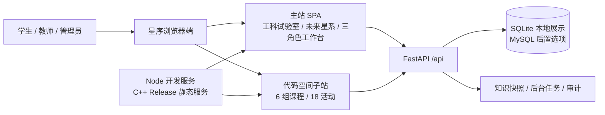
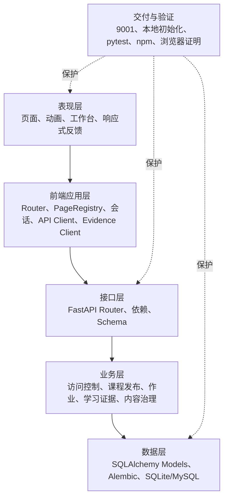
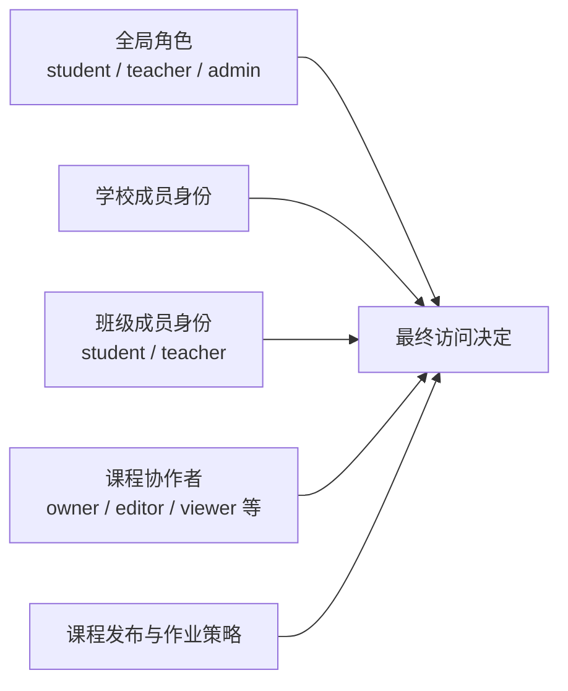
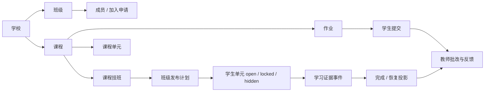
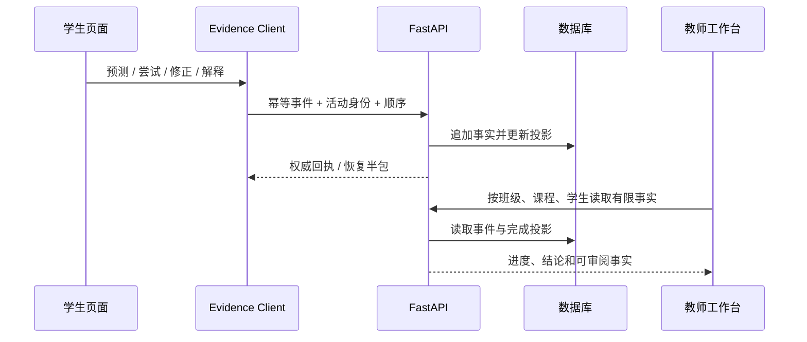

# 星序 Astra — 开发者手册

> **文档梗概**：面向第一次接触项目的开发者，说明星序当前已经实现什么、核心业务怎样流动、主要代码在哪里、怎样启动与验证，并把接口、生命周期、样式和维护细节分流到 11—19 号子文档。
>
> **权威边界**：本文描述当前实现；未来任务只认 [`02-更新规划.md`](02-更新规划.md)，已发生版本只认 [`03-发布历史.md`](03-发布历史.md) 与 Git。
>
> **当前基线**：实验还原为 `主开发@6c3fd93 / V8.1.6`，扩展门禁基线为 `主开发@0744205 / V8.2.1`；V8.1.0—V8.1.5 仍是未提交工作区候选。V8.2.2 `EXT-03` 已把工科试验室、代码空间和未来星系共 124 项既有活动固化为只读变更告警基线，没有注册新页面，也没有修改任何既有实验；下一项为 `EXT-04` 新实验视觉基础件。
>
> **最近更新**：2026-08-24
>
> **更新者**：DOC 组（主开发单线兼任）

---

## 目录

1. [先用五分钟理解项目](#1-先用五分钟理解项目)
2. [系统全局架构](#2-系统全局架构)
3. [角色、作用域与班级业务](#3-角色作用域与班级业务)
4. [三个学习空间与课程内容](#4-三个学习空间与课程内容)
5. [前端页面、路由与可见交互](#5-前端页面路由与可见交互)
6. [后端能力与数据闭环](#6-后端能力与数据闭环)
7. [关键业务旅程](#7-关键业务旅程)
8. [仓库入口与开发顺序](#8-仓库入口与开发顺序)
9. [启动与最小验证](#9-启动与最小验证)
10. [当前完成边界](#10-当前完成边界)
11. [11—19 号详细技术文档](#11-1119-号详细技术文档)
12. [其他权威文档](#12-其他权威文档)

---

## 1. 先用五分钟理解项目

星序 Astra 是一个面向学生、教师和管理员的多星系互动教学平台。它不是只有实验卡片的静态网站，也不是准备直接替代成熟教务平台的生产系统。当前作品最有价值的组合是：

1. 用登录前公开导览在一个首屏中说明项目价值、三大学习空间、代表入口和教学业务闭环；
2. 用大量可操作实验以及力学、桥梁等代表画面表现教学内容；
3. 用学校、班级、课程、作业和发布计划组织真实教学关系；
4. 用学习证据、完成投影和教师回读承载已明确接入的活动结果，不把所有普通实验操作伪装成权威完成；
5. 用学生、教师、管理员三种工作台把同一业务数据呈现为不同任务；
6. 用本机 9001 同源入口形成适合毕业设计和多媒体竞赛现场演示的完整作品。

### 1.1 产品规模

| 一级学习空间 | 当前内容 | 主要价值 | 当前深度判断 |
| --- | --- | --- | --- |
| 工科试验室 | 数学、物理、化学、算法、生物共 88 个交互实验 | 内容广度、Canvas/Web 动画、学科探索 | 广度完整，单课教学闭环不完全一致 |
| 代码空间 | 6 组课程、18 个“预测—运行—追踪—修正”活动 | 代码执行过程与错误理解 | 课程结构成立，正式隔离判题器未接入 |
| 未来星系 | 6 个跨学科方向、18 个目录活动身份 | 跨学科叙事、课程目录和新型互动 | 多数方向使用动态活动运行时；工程方向当前回到一个独立桥梁实验，三条历史 slug 不等于三个独立实现 |

### 1.2 三类用户

| 用户 | 最主要的问题 | 当前系统提供的回答 |
| --- | --- | --- |
| 学生 | 我属于哪个班、该学什么、做到哪里、下一步是什么？ | 入班、班级课程、单元访问、继续学习、作业提交、积分与学习证据 |
| 教师 | 我教哪些班、课程是否发布、谁需要帮助、学习结果是什么？ | 班课编排、发布计划、作业、提交批改、学生进度和有限课程事实 |
| 管理员 | 学校、班级、账号和课程是否正常，哪里需要治理？ | 组织治理、用户与角色、加入申请、课程状态、内容版本、审计和运行概览 |

### 1.3 一句话技术栈

- 主站：Vanilla JavaScript 单页应用，`index.html + shared/ + pages/`。
- 代码空间：`codevis/` 独立前端子站与浏览器学习运行时。
- 业务后端：Python 3.12+、FastAPI、SQLAlchemy、Alembic。
- 本地数据：SQLite；MySQL 是后置发布选项，不是当前竞赛完成条件。
- 静态交付：Node 开发白名单服务和可选 C++ Release 静态服务。
- 会话：浏览器产品使用 HttpOnly Cookie；后端也能解析互斥的 Bearer Session，但前端不持久化 Bearer Token。

接口、技术栈版本和目录细节见 [11-系统架构与代码目录](01-子文档/11-系统架构与代码目录.md)、[13-后端 API、权限与数据架构](01-子文档/13-后端API权限与数据架构.md)。

---

## 2. 系统全局架构

### 2.1 运行时上下文



当前正式展示入口是 `astra-local.ps1` 启动的 `http://127.0.0.1:9001/`。它把浏览器资源和 `/api/*` 放在同一来源，减少现场演示中的跨域、端口和会话问题。

### 2.2 分层结构



对毕业设计而言，星序已经具备“表现层—应用层—接口层—业务层—数据层—验证层”的完整技术叙述。当前问题不是有没有层，而是部分层的职责过重、可见呈现没有充分利用后端能力。该问题及优先修正路线见 [`02-更新规划.md`](02-更新规划.md)。

### 2.3 静态服务与业务服务的边界

- `server/` 只负责公开审核后的浏览器文件和内部存活探针。
- 认证、班级、课程、作业、学习证据、内容和治理全部位于 `backend/`。
- 不把业务 API 重新塞回 C++ 静态服务。
- Service Worker 不缓存业务 API；业务响应保持 `no-store`。
- 本地展示环境不等于公网生产环境，不能把 9001 PASS 写成 TLS、正式 MySQL 或大规模并发已经完成。

---

## 3. 角色、作用域与班级业务

### 3.1 三个全局角色不是简单的“三级上下级”

`student / teacher / admin` 是三个全局角色，但真实授权还叠加学校、班级、课程和作业策略。管理员通常拥有更宽的治理能力，教师拥有教学域能力，学生拥有学习域能力；这并不意味着每个接口都只靠角色大小比较。



因此，前端隐藏按钮只是体验裁剪；后端仍会依据用户状态、全局角色和精确作用域做最终判断。作用域兼容、锁顺序和授权服务细节见 [13-后端 API、权限与数据架构](01-子文档/13-后端API权限与数据架构.md)。

### 3.2 班级业务主链



已经实现的核心逻辑包括：

- 学生申请加入班级，管理员或有权教师审核；也保留受控的直接加入路径。
- 同一学生可属于多个班级，课程目录按当前班级作用域读取。
- 课程可挂接多个班级，单元按班级发布计划形成 `open / locked / hidden`。
- 作业可按班级设置策略，学生提交后教师批改，积分进入账本。
- 学习事件和学习证据可形成学生进度、完成投影、恢复投影与教师有限事实。
- 管理员可治理学校、班级、用户、加入申请、课程状态、内容版本及相关审计。

### 3.3 当前管理层的真实优缺点

优点是业务对象、作用域和数据闭环已经存在，不是演示数据拼成的空壳；缺点是前端常把后端实体列表直接搬成表格或卡片，教师“下一教学动作”和管理员“为什么需要处理”表达不够强。后续优先增加面向页面的聚合视图和决策叙事，不优先重写权限内核。

---

## 4. 三个学习空间与课程内容

### 4.1 工科试验室

工科试验室包含 88 个交互实验：数学 20、物理 20、化学 17、算法 12、生物 19。不同实验使用 DOM、Canvas、Web Worker 或按需 Three.js 表现函数、运动、反应、算法和生命过程。

`physics.mechanics` 当前是受保护的直接力学模拟：学生进入后立即调整重力、弹性、摩擦和球体半径，通过画布拖拽发射小球，并使用清空、暂停和放大等原有控制。旧版固定 `e=0.40/0.80`、预测—修正—解释和实验内学习证据工作流已经退出当前页面；班级或课程平台可以在实验外链接它，但不得重新接管其 DOM 和操作节奏。

### 4.2 代码空间

代码空间位于 `codevis/`，由 6 组课程和 18 个活动组成，强调“预测—运行—追踪—修正”。JavaScript、Python、C、C++ 浏览器学习运行时用于过程可视化；正式隔离 OJ provider 当前未配置，默认适配器会诚实记录 `runner_unavailable`，不会把不可运行伪报为通过。

### 4.3 未来星系

未来星系目录仍保留地球与宇宙、工程应用、数据科学、信息技术、材料微观和人文可视化 6 个方向及历史 18 个活动身份。工程方向是当前例外：`#engineering` 不再由 Future 课程运行时动态替换，而由静态页面和 `bridge-truss.js` 独立持有桥梁桁架实验；学生可直接调整荷载并选择 B/C/D 节点观察支座反力和杆力。历史 `engineering.load-path` 身份仍可供目录或后端映射使用，但当前页面不再执行 B→C→判断→D 的课程证据链；`member-choice`、`safety-check` 也不能宣传为三个已独立实现的工程实验。

### 4.4 当前深度分布

```text
作品级直接实验：physics.mechanics、#engineering 桥梁桁架
可讲课程闭环：代码空间一条现有主路径 + 平台中的班级/作业/回读业务
结构化活动目录：未来星系与代码空间的现有活动身份
广度内容：工科试验室其余实验
```

这不是说其余内容没有实现，而是说“目录中有身份”“页面可操作”和“可在三分钟内讲清价值”是三种不同完成度。未来规划优先新增少量独立精品实验，再改善实验外目录和师生发现路径；不再把 124 个既有活动批量迁入统一课程状态机。

完整模块说明和新增实验方法见 [15-学科实验与内容开发指南](01-子文档/15-学科实验与内容开发指南.md)，现状与展示边界见 [19-当前功能、业务闭环与展示边界](01-子文档/19-当前功能业务闭环与展示边界.md)。

### 4.5 新增实验模板

V8.2 起，新实验先从 `tools/templates/new-experiment/` 复制独立骨架，再接入目录、DOM 和 `AstraExperimentRegistry`。模板包含候选 manifest、首屏操作区、单 owner 生命周期、实验私有 CSS 和模型说明，不在生产注册表中自动出现，也不要求任何旧实验迁移。`tools/tests/new-experiment-template-contract.cjs` 会把模板渲染成探针身份，检查 JSON、JavaScript、DOM、CSS 命名空间、初始化/销毁和模型说明字段；详细复制、占位符、接线与回退步骤见 15 号子文档第 11.1 节。

### 4.6 既有活动变更告警

`node tools/quality/check-protected-activity-changes.cjs` 会从三个现有权威来源重新投影当前活动：五学科 `CONFIG.experiments + AstraExperimentRegistry` 形成 88 项工科实验，Code Space course manifest 形成 18 项课程，Future manifest 与学习 owner 配置形成 18 项未来活动；投影还要与统一 `AstraLearningActivityCatalog` 做身份一一对应检查。工具随后把当前 key、路由、标题、owner、初始化/清理入口及活动实际消费的脚本、样式或 DOM 片段哈希，与 `tools/quality/baselines/protected-activities-v822.json` 比较。

普通新增活动不在旧基线中，因此只计为 addition 并被忽略；删除旧活动、改变身份或改变受保护资源会按学习空间、活动 key 和精确文件失败关闭。知识性纠错或阻断修复只有在项目负责人批准后，才允许把该次差异产生的 64 位 issue signature、任务号、批准人、日期和理由写入 `tools/quality/protected-activity-exceptions.json`；例外只绑定这一组 before/after 指纹，不能泛化成长期放行，也不能通过重写基线逃避告警。完整使用步骤见 15 号子文档，发布门禁见 18 号子文档。

---

## 5. 前端页面、路由与可见交互

### 5.1 页面层次


主站的 hash 路由由共享 Router 和 PageRegistry 管理。页面、实验和动态 owner 必须遵守注册、初始化、离页销毁和资源释放；具体顺序见 [12-前端 SPA、路由与页面生命周期](01-子文档/12-前端SPA路由与生命周期.md)。

### 5.2 已经可见的交互能力

- 登录前公开导览；目录数量读取权威活动清单，空间和课程入口在未认证时统一落到真实账号入口。
- 登录/注册/重置、会话恢复和角色资源裁剪。
- 学生无班级时阻断个人页，并通过不可跳过的入班流程建立权威班级关系。
- 学生工作台的班级/课程上下文、继续学习、作业和学习状态。
- 教师工作台的班课上下文、课程编排、作业、学生进度和学习事实。
- 管理员治理台的组织、用户、加入申请、课程、内容和审计入口。
- 三个学习空间的目录、实验深链、加载/错误/锁定状态和移动端交互。
- 力学模拟与桥梁桁架等代表实验的直接参数操作、动画/Canvas 反馈和重复进入。

### 5.3 当前最需要警惕的前端结构

`pages/teacher/teacher.js`、`pages/admin/admin.js`、`pages/student/student-workbench.js` 和多个共享 evidence owner 已达到一千至数千行。现阶段不宜为了形式美观全面改框架，但新增功能应优先抽离“数据适配、状态派生、渲染片段”，避免继续把 API 请求、状态机、模板和事件处理堆在同一个 owner 中。`pages/physics/physics.js` 已恢复为较小的直接模拟 owner；`frontier-learning.js` 和发布上下文必须继续排除 `engineering`，防止动态课程壳再次覆盖静态桥梁页面。

界面、触控、响应式与无障碍细节见 [16-界面样式、移动端与无障碍](01-子文档/16-界面样式移动端与无障碍.md)，页面定位见 [`08-前端页面实现索引.md`](08-前端页面实现索引.md)。

---

## 6. 后端能力与数据闭环

### 6.1 API 领域

FastAPI 在既有约 179 个路由操作之外，工作区候选新增 14 个 `/api/v1` 内容平台路由，主要分为：

| 领域 | 已实现能力 |
| --- | --- |
| 健康与会话 | 健康检查、注册、登录、退出、会话撤销、密码重置 |
| 用户与组织 | 用户、学校、学校成员、班级、班级成员、加入申请 |
| 课程与单元 | 课程、协作者、挂班、单元、班级发布计划、课程状态 |
| 作业与提交 | 作业策略、学生提交、教师批改、积分账本 |
| 学习数据 | 旧学习事件/进度、权威学习证据、活动运行时、完成与恢复投影 |
| 内容治理 | 内容页、草稿、版本、发布、回滚、脚本资产策略与扫描 |
| V8.1 内容平台 | 学习空间、整课草稿与单元、媒体、不可变发布包、班级固定版本、单元进度和检查点尝试 |
| 管理治理 | 统计、组织、课程、告警、后台任务、审计、知识快照 |
| 代码学习 | 题目、版本、提交和诚实降级的判题适配边界 |

接口路径、DTO、状态码和权限细节统一移至 [13-后端 API、权限与数据架构](01-子文档/13-后端API权限与数据架构.md) 和 [14-课程、学习证据与业务接口](01-子文档/14-课程学习证据与业务接口.md)。

### 6.2 学习证据主链



完成状态只由服务端规则派生，页面不能自行宣布完成。V8.0.12 已实现学习者/服务端双游标、运行身份和权威恢复服务包；但所有产品页尚未统一消费完整活动内核与 IndexedDB pending，因此不能宣传为“全平台任意页面精确续学”。

### 6.3 后端当前不是空壳，但存在结构债务

- `learning_evidence.py`、`learning_activity_runtime.py`、`knowledge.py`、课程和班级 endpoint 等 owner 较大。
- 旧 `learning_events / progress` 与新 evidence/runtime/projection 并存，领域真值对新开发者不够直观。
- `/api` 尚未提供面向双端演进的显式版本命名空间。
- 部分前端需要组合多个原子接口才能得到一个工作台画面，容易出现加载跳变和重复适配。
- 内容协议已有结构化 section，但脚本路径、iframe 和 DOM owner 仍带明显 Web 端假设。

当前竞赛路线只修复直接影响展示的聚合读取、语义冲突和前端适配，不做全量微服务化、框架迁移或大规模数据库重写。

---

## 7. 关键业务旅程

### 7.1 学生学习旅程

1. 登录并由服务端确认学生身份。
2. 无班级时完成入班；有多个班级时选择当前作用域。
3. 从学生工作台进入当前课程或继续学习。
4. 后端按班级发布计划返回可见单元。
5. 学生从外层入口进入实验并直接操作；既有力学与桥梁页面不强制经过课程步骤。
6. 只有明确接入且经批准的活动才提交幂等学习事件，由服务端派生完成投影；普通既有实验不因“打开或拖动”自动生成权威完成。
7. 学生返回工作台查看课程、作业或已接入活动的权威状态；教师只读取服务端能够证明的事实。

### 7.2 教师教学旅程

1. 登录并选择学校、班级、课程上下文。
2. 创建或维护课程、单元和挂班关系。
3. 设置班级发布计划和作业策略。
4. 查看学生提交、完成状态和课程有限事实。
5. 批改提交、给出反馈并观察班级进度。

### 7.3 管理员治理旅程

1. 登录后进入全局治理台。
2. 查看学校—班级—课程—用户关系与异常摘要。
3. 处理加入申请、用户角色和组织状态。
4. 管理课程发布、内容版本、后台任务、告警和审计。
5. 对关键写操作保留原因、冲突和可追溯记录。

### 7.4 竞赛演示旅程

当前可以分别展示“代表实验直接操作”和“学生—教师—管理员业务平台”，但尚未把二者强行缝成一条实验内课程链。新版规划建议在实验外完成“教师选择/关联实验 → 学生直达操作 → 返回任务或提交 → 教师回读”的竞赛主线；具体入口、状态语义和演示脚本须经新版 02 审阅后再实现。

---

## 8. 仓库入口与开发顺序

### 8.1 顶层目录

```text
.
├── index.html              主站 SPA 外壳
├── pages/                  页面、学科、实验和三角色工作台
├── shared/                 路由、会话、API、证据客户端和设计系统
├── codevis/                代码空间独立子站
├── backend/                FastAPI、模型、迁移、脚本和 pytest
├── server/                 Node 开发静态服务和 C++ Release 静态服务
├── tools/                  前端合同、浏览器证明、质量工具和新增实验模板
├── UI/                     共享界面资源
├── doc/                    主文档与编号子文档
└── .github/workflows/      持续集成门禁
```

完整目录职责见 [11-系统架构与代码目录](01-子文档/11-系统架构与代码目录.md)。

### 8.2 新开发者推荐阅读/操作顺序

1. 阅读本文，确认产品、角色、业务和边界。
2. 阅读 [`02-更新规划.md`](02-更新规划.md)，只领取一个小版本任务。
3. 用 [`08-前端页面实现索引.md`](08-前端页面实现索引.md) 或 11—19 号子文档定位 owner。
4. 执行 9001 启动并复现当前页面，不在未复现前重写逻辑。
5. 新增实验从 `tools/templates/new-experiment/` 开始；既有实验默认冻结，不把它迁入模板。
6. 在生产接线前运行 `tools/quality/check-new-experiment-registration.cjs --manifest <manifest>`，先消除身份、owner、资源和 cleanup 冲突。
7. 优先复用 Router、PageRegistry、API Client、access control 和 evidence client。
8. 只修改任务允许范围，补最接近风险的测试。
9. 验证后把结果写入 03 对应大版本子文档，不把完成历史留在 02。

---

## 9. 启动与最小验证

### 9.1 推荐启动

从仓库根目录运行：

```powershell
powershell -ExecutionPolicy Bypass -File .\astra-local.ps1
```

访问：

```text
http://127.0.0.1:9001/
```

全新数据目录需要首个管理员时：

```powershell
powershell -ExecutionPolicy Bypass -File .\astra-local.ps1 -BootstrapAdmin
```

脚本会准备受控 Python 环境、执行 Alembic、初始化本地数据并同源启动主站和 API。完整参数、仓库外虚拟环境、拆分启动与部署边界见 [17-环境启动、构建与部署](01-子文档/17-环境启动构建与部署.md) 和 [`04-部署指南.md`](04-部署指南.md)。

### 9.2 最小质量门禁

```powershell
python -m pytest backend
node tools/tests/new-experiment-template-contract.cjs
node tools/quality/check-new-experiment-registration.cjs
npm test
git diff --check
```

界面任务还必须至少检查桌面和 390×844 两个视口、键盘焦点、页面溢出、遮罩、错误/加载状态与 console。测试和维护细节见 [18-测试、调试、维护与发布规则](01-子文档/18-测试调试维护与发布规则.md)。

---

## 10. 当前完成边界

### 10.1 已经可以诚实展示

- 三个学习空间和 124 个实验/活动的内容规模。
- 登录前导览中的项目价值、教学闭环和真实 `88/18/18` 目录；重点入口只作为作品发现，不代表实验内部采用课程壳。
- 学生、教师、管理员登录后的差异化资源和工作台。
- 学校、班级、课程、发布、作业、提交、批改和积分主链。
- `physics.mechanics` 与 `#engineering` 桥梁桁架的直接控制、Canvas 反馈和桌面/移动操作。
- 已有学习证据、教师回读和班级业务能力，但不能把它们宣传为当前力学/桥梁实验内部仍在执行的课程证据链。
- 本机 SQLite、Alembic、9001 同源启动和大规模自动化回归。
- 内容版本、审计、后台任务和知识快照等后端工程能力。

### 10.2 不能越级宣传

- 不是成熟平台同等规模的完整教务产品。
- 不是已经过真实课堂实证的教学效果系统。
- 不是正式公网、正式 MySQL、高并发和全监控生产服务。
- 不是 124 项活动都具有代表力学/桥梁实验同等画面深度或代码空间主路径同等课程闭环。
- 不是已经接通正式隔离 OJ、AI 助教或微信小程序。
- 不是所有页面都已接通完整离线队列和步骤级精确恢复。

### 10.3 当前开发判断

**V8.0.34 资源与终验边界**：V832 接入移动回执，V833 接入 Engineering 同帧布局，V834 以 `20260813v834ShowcaseLayoutP0` 统一资源代际；`app-session → loader → queue/client → catalog/activity` 保持同代传播，ARCH-004 边界不变，QA-023 仍待同 revision 复验。

**V8.1.0—V8.1.5 工作区候选**：已建立内容平台分层合同、七类内容块、八张新表与 0054 迁移、14 个 `/api/v1` 接口和登录前公开导览。导览使用 `20260823v815PublicGuideP1`，复用既有 Cookie Session 账号入口，不改变登录后的角色资源和 Router；自动化及同源桌面/移动验收已通过，但在 D-001 处理前不得写成已提交或已发布版本。

**V8.1.6 纠偏边界**：学生工作台中的能量课程旅程、星图额外课程入口、配套演示种子、图稿和专属合同已撤销；`physics.mechanics` 恢复直接参数/画布模拟，`#engineering` 恢复静态桥梁实验并从 Future runtime/publication context 的管理页面集合中移除。全局静态资源缓存提升为 `20260824v816ExperimentRestoreP2`，用于强制浏览器丢弃被否决页面和中间恢复字节。内容平台底座暂时隔离保留，但不得把既有实验包进统一课程正文，也不得在实验首屏暴露内容块、发布包或内部版本信息。

**还原验证结果**：V8.1.6 独立提交快照中 239 个受跟踪 JavaScript 文件通过语法检查，60/60 前端合同通过；外部 Edge/Chrome 已实测桌面与 390×844 的力学、桥梁代表旅程，参数与节点交互有效、根级横向溢出为 0、课程壳命中为 0、console warning/error 为 0。该结论只覆盖两项代表实验，不冒充 124 项逐页视觉验收。

**既有实验保护规则**：当前 124 项实验/活动的路由、首屏、布局、视觉、交互、动画、参数、求解器和返回关系默认冻结。新增内容采用新 key、新路由和新 owner；知识性纠错必须先记录证据、影响范围和拟改文件，经项目负责人批准后才能实施。平台只在实验外提供发现、班级组织、任务布置和结果回读。

**V8.2.0 `EXT-01`**：`tools/templates/new-experiment/` 提供 manifest、HTML、单 owner 运行时、实验私有样式和模型说明五份模板；模板探针验证 key/route/owner 一致性、JavaScript 可解析、首屏控件、AbortController、ResizeObserver、rAF、reduced-motion、CSS 三重命名空间以及 destroy 资源释放。模板没有写入 `CONFIG.experiments`、`AstraExperimentRegistry` 或 `index.html`，因此不会生成空壳入口。该独立提交快照为 240 个受跟踪 JavaScript 文件与 61/61 前端合同；工作区中 V8.1 待裁决候选的额外合同不计入这一发布口径。

**V8.2.1 `EXT-02`**：`tools/quality/check-new-experiment-registration.cjs` 只读加载五学科 88 项 `CONFIG.experiments` 与 `AstraExperimentRegistry` 基线，验证新增 manifest 的 schema、subject、key、activity key、route、同学科标题、owner、init hook、脚本、样式、版本参数和 destroy。资源必须位于新实验自己的目录；脚本会在隔离 VM 中加载 owner 并对 destroy 做空状态 smoke。检查前后三份生产注册文件哈希不变。该独立提交快照为 242 个受跟踪 JavaScript 文件与 62/62 前端合同；代码空间和未来星系使用不同注册来源，完整 124 项只读清单留给 `EXT-03`，本版本不扩大声明。

**V8.2.2 `EXT-03`**：`tools/quality/check-protected-activity-changes.cjs` 不迁移三套既有架构，而是从各自权威 manifest、registry 和 owner 配置生成统一保护投影，并由统一学习活动目录反向核对，冻结 `88 + 18 + 18 = 124` 项旧活动。基线记录元数据、运行入口与实际消费资源的确定性 SHA-256；普通新增不报警，旧活动缺失或差异会输出学习空间、活动身份、文件和一次性签名。空例外文件是默认状态，只有精确批准记录才能抑制完全相同的一项差异。V8.2.1 已证明原 242 个受跟踪脚本；本版本新增的 2 个 CJS 文件分别通过 `node --check`，同一独立 Git 暂存快照的 63 项前端合同经分段验收全部通过。该版本不加载任何生产运行时代码、不增加可见实验，也不包含 V8.1 待裁决候选。

业务骨架与技术证据已经足以支撑优秀毕业设计，短板集中在“评委能否迅速看懂”“师生平台是否像作品而非后台表格”“新增精品实验是否形成可观察成果”“演示包是否稳定可复现”。全局问题、冻结边界、版本路线和剩余工作量见 [`02-更新规划.md`](02-更新规划.md)。

---

## 11. 11—19 号详细技术文档

本轮把原 01 中的详细实现迁入以下子文档。主手册负责回答“项目是什么、怎样运转、从哪里开始”，子文档负责回答“具体怎么实现”。

| 编号 | 子文档 | 从原 01 迁入的内容 | 适合什么时候读 |
| --- | --- | --- | --- |
| 11 | [系统架构与代码目录](01-子文档/11-系统架构与代码目录.md) | 原第 2、3 章 | 需要理解技术栈、服务关系和目录职责时 |
| 12 | [前端 SPA、路由与页面生命周期](01-子文档/12-前端SPA路由与生命周期.md) | 原第 4、7、8、9、10、17 章 | 修改主站页面、路由、首页、加载或新增星系时 |
| 13 | [后端 API、权限与数据架构](01-子文档/13-后端API权限与数据架构.md) | 原第 5 章 | 修改接口、认证、权限、模型和后端服务时 |
| 14 | [课程、学习证据与业务接口](01-子文档/14-课程学习证据与业务接口.md) | 原第 18 章 | 修改课程治理、学习证据、恢复和教师事实时 |
| 15 | [学科实验与内容开发指南](01-子文档/15-学科实验与内容开发指南.md) | 原第 6、11 章 | 增加或调整实验和课程内容时 |
| 16 | [界面样式、移动端与无障碍](01-子文档/16-界面样式移动端与无障碍.md) | 原第 12、12.5 章 | 修改 CSS、Canvas、触控和响应式时 |
| 17 | [环境启动、构建与部署](01-子文档/17-环境启动构建与部署.md) | 原第 13 章 | 启动、构建或准备部署时 |
| 18 | [测试、调试、维护与发布规则](01-子文档/18-测试调试维护与发布规则.md) | 原第 14、15、16 章 | 调试、维护、验收和提交前检查时 |
| 19 | [当前功能、业务闭环与展示边界](01-子文档/19-当前功能业务闭环与展示边界.md) | 原第 19、20 章 | 对照 V8 当前集成状态、竞赛能力和缺口时 |

迁移前原 01 的 SHA-256 为 `36c6cb6f2cfeae30553f00b3740c150a4ad9e6beac2f70c1d208d136a9659076`。原第 2—20 章已按上表保留；第 0—1 章的产品概览由本文重写吸收，没有以“减负”为名丢弃实现事实。

---

## 12. 其他权威文档

| 文档 | 职责 |
| --- | --- |
| [`00-项目总纲.md`](00-项目总纲.md) | 项目定位、系统边界和文档控制面 |
| [`02-更新规划.md`](02-更新规划.md) | 当前问题、V8.1—V8.6 路线、任务与优先级 |
| [`03-发布历史.md`](03-发布历史.md) | 当前版本索引与 V4—V8 历史分卷 |
| [`04-部署指南.md`](04-部署指南.md) | 环境、迁移、服务、代理、回滚与运维 |
| [`05-UI规范模板.md`](05-UI规范模板.md) | UI、Canvas、响应式和无障碍规范 |
| [`06-实验体验与信度审查报告-20260606.md`](06-实验体验与信度审查报告-20260606.md) | 既有实验体验和教学事实审查 |
| [`07-后端优化与设计.md`](07-后端优化与设计.md) | 后端长期设计依据，不承担当前任务状态 |
| [`08-前端页面实现索引.md`](08-前端页面实现索引.md) | 页面、路由、模块和文件定位 |
| [`09-后端阶段收束小版本开发安排.md`](09-后端阶段收束小版本开发安排.md) | 后端历史阶段与退出门禁，当前优先级服从 02 |
