# 星序 Astra — 开发者手册

> **文档梗概**：第 1—12 章及实现子文档说明当前功能、代码和维护方式；第 13 章按用户要求展开明确标为待实现的目标架构与七组设计图。现状、设计和历史不混写。
>
> **权威边界**：本文维护当前实现与目标架构图原件；业务规则、任务及实施状态只认 [`02-更新规划.md`](02-更新规划.md)，真实发布及独立归档见 [`03-发布历史.md`](03-发布历史.md)。目标图不表示模型和接口已经存在。
>
> **具体规划法则**：以当前代码描述实现，区分工作区变更与已提交基线；设计建议不写成已上线能力，历史验证不替代本轮验证。
>
> **当前基线**：已提交代码包含 `V8.6.6 / FE-045` 及 BE-031、BE-032 后续修正（`26bdf20`），包含 V8.4 通用课程闭环、V8.5 展示增强与 V8.6 课程运营增强；三星系学生目录统一读取后端课程、发布单元与开放范围，共 `90 / 18 / 19 = 127` 个正式活动身份。2026-09-05 普通开发提交单列记录，实验体验与后端架构可按当前任务重构，小程序暂不设计。
>
> **当前任务入口**：FE-050—FE-052 的 [qianduan 独立前端原型](#54-qianduan-独立前端原型) 在工作区实现，尚未提交或接入后端；状态见 [02 当前任务](02-更新规划.md#3-当前任务状态)。原有后台产品研发任务仍待实施。已提交后端修正见 [19 号说明](01-子文档/19-当前功能业务闭环与展示边界.md#1-当前课程学习统计)，原交付与验证保留于 [03 归档](03-发布历史.md#6-规划替换与工作区交付归档)。
>
> **最后一次更新时间**：2026-09-06
>
> **更新者**：主开发组

---

## 目录

1. [先用五分钟理解项目](#1-先用五分钟理解项目)
2. [系统全局架构](#2-系统全局架构)
3. [角色、作用域与班级业务](#3-角色作用域与班级业务)
4. [三个学习空间与课程内容](#4-三个学习空间与课程内容)
5. [前端页面、路由与可见交互](#5-前端页面路由与可见交互)
6. [后端能力与数据闭环](#6-后端能力与数据闭环)
7. [关键业务旅程](#7-关键业务旅程)
8. [仓库入口与开发顺序](#8-仓库入口与开发顺序)
9. [启动与最小验证](#9-启动与最小验证)
10. [当前完成边界](#10-当前完成边界)
11. [11—19 号详细技术文档](#11-1119-号详细技术文档)
12. [其他权威文档](#12-其他权威文档)
13. [目标架构与设计（待实现）](#13-目标架构与设计待实现)

---

## 1. 先用五分钟理解项目

星序 Astra 是一个面向学生、教师和管理员的多星系互动教学平台。它不是只有实验卡片的静态网站，也不是准备直接替代成熟教务平台的生产系统。当前作品最有价值的组合是：

1. 用登录前公开导览在一个首屏中说明项目价值、三大学习空间、代表入口和教学业务闭环；
2. 用大量可操作实验以及力学、桥梁等代表画面表现教学内容；
3. 用学校、班级、课程、作业和发布计划组织真实教学关系；
4. 用学习证据、完成投影和教师回读承载已明确接入的活动结果，不把所有普通实验操作伪装成权威完成；
5. 用学生、教师、管理员三种工作台把同一业务数据呈现为不同任务；
6. 用本机 9001 同源入口形成适合毕业设计和多媒体竞赛现场演示的完整作品。

### 1.1 产品规模

| 一级学习空间 | 当前内容 | 主要价值 | 当前深度判断 |
| --- | --- | --- | --- |
| 工科试验室 | 数学 20、物理 21、化学 18、算法 12、生物 19，共 90 个交互实验 | 内容广度、Canvas/Web 动画、学科探索 | 广度完整，单课教学闭环不完全一致 |
| 代码空间 | 6 组课程、18 个“预测—运行—追踪—修正”活动 | 代码执行过程与错误理解 | 课程结构成立，正式隔离判题器未接入 |
| 未来星系 | 6 个跨学科方向、19 个目录活动身份 | 跨学科叙事、课程目录和新型互动 | 多数方向使用动态活动运行时；工程方向保留独立桥梁实验，并新增独立机械臂实验，三条历史 slug 仍不等于三个独立实现 |

### 1.2 三类用户

| 用户 | 最主要的问题 | 当前系统提供的回答 |
| --- | --- | --- |
| 学生 | 我属于哪个班、该学什么、做到哪里、下一步是什么？ | 入班、班级课程、单元访问、继续学习、作业提交、积分与学习证据 |
| 教师 | 我教哪些班、课程是否发布、谁需要帮助、学习结果是什么？ | 班课编排、发布计划、作业、提交批改、学生进度和有限课程事实 |
| 管理员 | 学校、班级、账号和课程是否正常，哪里需要治理？ | 教学运行驾驶舱、组织治理、用户与角色、加入申请、课程状态、内容版本、审计和运行概览 |

### 1.3 一句话技术栈

- 主站：Vanilla JavaScript 单页应用，`index.html + shared/ + pages/`。
- 代码空间：`codevis/` 独立前端子站与浏览器学习运行时。
- 业务后端：Python 3.12+、FastAPI、SQLAlchemy、Alembic。
- 本地数据：SQLite；MySQL 是后置发布选项，不是当前竞赛完成条件。
- 静态交付：Node 开发白名单服务和可选 C++ Release 静态服务。
- 会话：浏览器产品使用 HttpOnly Cookie；后端也能解析互斥的 Bearer Session，但前端不持久化 Bearer Token。

接口、技术栈版本和目录细节见 [11-系统架构与代码目录](01-子文档/11-系统架构与代码目录.md)、[13-后端 API、权限与数据架构](01-子文档/13-后端API权限与数据架构.md)。

---

## 2. 系统全局架构

### 2.1 运行时上下文

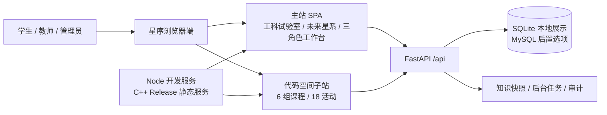

当前正式展示入口是 `astra-local.ps1` 启动的 `http://127.0.0.1:9001/`。它把浏览器资源和 `/api/*` 放在同一来源，减少现场演示中的跨域、端口和会话问题。

### 2.2 分层结构

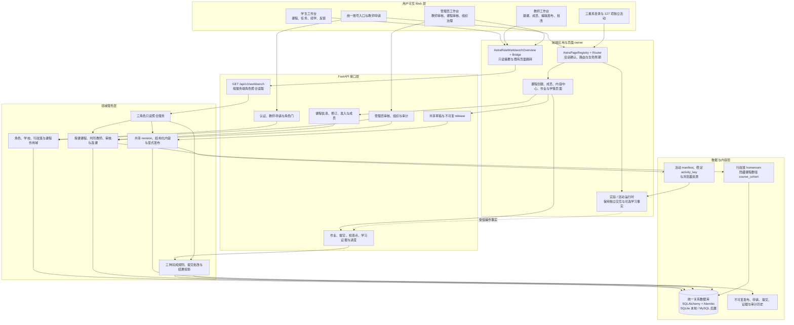

这张图是 `V8.4.6 / DOC-004` 对原 P-01 的稳定实现校正，也是当前系统分层的唯一权威图。工作台聚合层只回答“当前最重要的下一步是什么”，课程、审核、发布、作业和学习结果仍由原领域服务决定；无行政班学生通过 `CourseEnrollment + course_cohort` 进入课程，行政班继续只表达组织身份和准入条件。对象关系、状态机和时序细节见 [19-当前功能、业务闭环与展示边界](01-子文档/19-当前功能业务闭环与展示边界.md)。目标版本和长期方向仍见 [`02-更新规划.md`](02-更新规划.md)。

### 2.3 静态服务与业务服务的边界

- `server/` 只负责公开审核后的浏览器文件和内部存活探针。
- 认证、班级、课程、作业、学习证据、内容和治理全部位于 `backend/`。
- 不把业务 API 重新塞回 C++ 静态服务。
- Service Worker 不缓存业务 API；业务响应保持 `no-store`。
- 本地展示环境不等于公网生产环境，不能把 9001 PASS 写成 TLS、正式 MySQL 或大规模并发已经完成。

---

## 3. 角色、作用域与班级业务

### 3.1 三个全局角色不是简单的“三级上下级”

`student / teacher / admin` 是三个全局角色，但真实授权还叠加学校、班级、课程和作业策略。管理员通常拥有更宽的治理能力，教师拥有教学域能力，学生拥有学习域能力；这并不意味着每个接口都只靠角色大小比较。

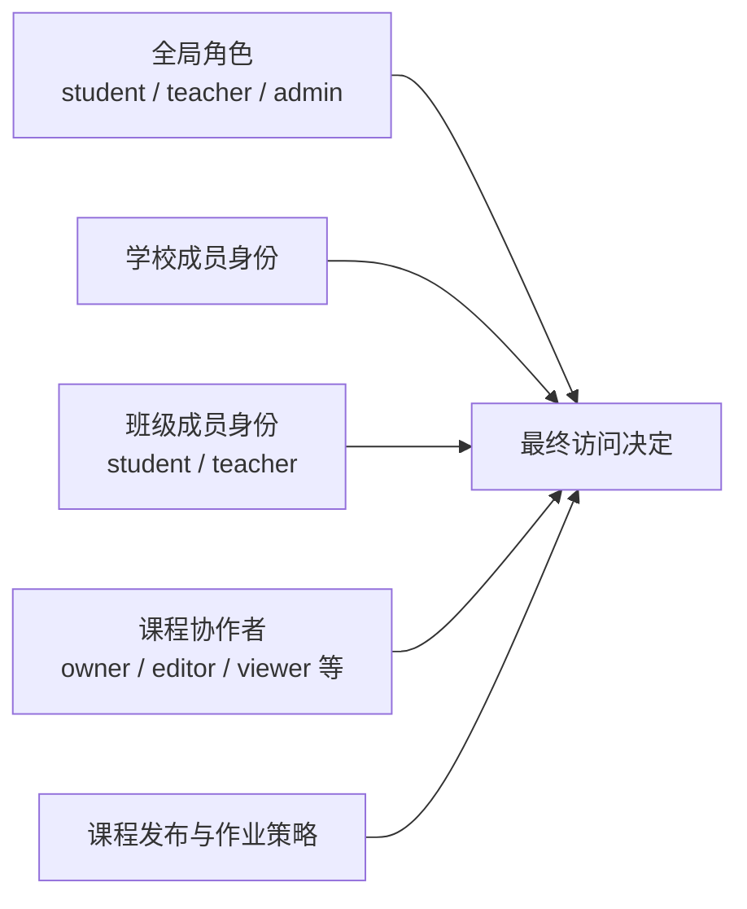

因此，前端隐藏按钮只是体验裁剪；后端仍会依据用户状态、全局角色和精确作用域做最终判断。作用域兼容、锁顺序和授权服务细节见 [13-后端 API、权限与数据架构](01-子文档/13-后端API权限与数据架构.md)。

### 3.2 教师身份申请与组织语义

V8.4.0 后，公开页面不再把“注册账号”和“成为正式教师”合并成一步。申请者先得到普通学生账号，再提交教师申请；待审期间只能预览正式活动目录，服务端会拒绝加入班级、加入课程、写入进度等非允许写请求。管理员在身份治理页查看申请说明并批准或拒绝；批准会在同一事务内把用户角色提升为教师，拒绝则保留学生角色并允许以后新建申请。

组织层同时用 `ClassGroup.kind` 区分 `homeroom` 行政班与课程内部使用的 `course_cohort`。当前班级页面、治理列表和统计只展示行政班；`BE-025@3fde9af` 已在首次课程信息批准事务中创建隐藏 `course_cohort` 与唯一 `CourseClass`，并同步批准信息、共同教师、准入班级和独立短课程码。任何中间失败都会整体回滚，不会留下“已有课程码但没有内部群组”的半成品。当前审核状态和可见创建—审批时序见 [19-当前功能、业务闭环与展示边界](01-子文档/19-当前功能业务闭环与展示边界.md#当前课程创建与信息审核时序图原-p-08)。

教师工作台的“创建授课课程”现在按基本信息、共同教师、分类与准入、预览提交四步完成。教师只能创建草稿并提交管理员审核；页面不会让教师填写内部课程键、课程码或直接选择发布状态。创建后，同校共同教师会看到同一条待审记录。管理员在课程治理页查看当前/拟议差异、教师与准入班级，经二次确认批准或退回；运行中修订被退回时，旧批准信息继续运行。当前接口、页面、时序和验证事实见 [19 号子文档：课程创建与信息审核](01-子文档/19-当前功能业务闭环与展示边界.md#当前课程创建与信息审核时序图原-p-08)。

学生工作台现已提供独立“加入授课课程”区域：输入课程码后先读取准入资格、教师和课程摘要，再提交申请并回读待审、退回、已加入和退出状态。教师工作台现已提供“课程成员中心”：可以二次确认批准或退回申请、查看学生来源行政班、二次确认移除，并按行政班批量加入且读取逐项结果。`CourseEnrollment` 仍是课程成员唯一真值，隐藏 `course_cohort` 只兼容既有作业和学习证据范围。当前类图、状态图、接口和双视口验证见 [19 号子文档：V8.4.3 学生选课与教师课程名单](01-子文档/19-当前功能业务闭环与展示边界.md#v843-学生选课与教师课程名单fe-040-当前稳定实现)。

课程内容后端以 `Course.content_draft_revision` 表示整门课程共享草稿代际，并为每个有效单元保留唯一 active `ContentDraft`。任一有效课程教师可原子保存完整草稿或显式发布；发布会冻结精确页面版本、单元顺序、活动引用、媒体摘要和完成规则快照，并为隐藏 `course_cohort` 追加不可变 binding。`FE-041@54fe180` 已在教师工作台接入结构化课程内容中心：只列出已批准课程，支持七类内容块、精确 127 项活动引用、课程预览、两步发布、不可变历史和三种显式冲突处置，不接受自由拖拽、任意 HTML、iframe 或脚本。`BE-028@c9fb4dc` 已接通实验操作、指定检查点和指定作业批改三种完成预设；客户端不能直接写完成状态。学生必须是 active 课程成员，读取当前或历史版本时不会得到检查点标准答案。当前 P-04、P-09、P-10、接口、页面和验收事实见 [19 号子文档：V8.4.4 课程内容编辑与发布](01-子文档/19-当前功能业务闭环与展示边界.md#v844-结构化课程编辑器fe-041-当前稳定实现)。

V8.5 把上述真实业务事实转换为更适合展示和讲解的页面：管理员驾驶舱聚合教学总量、星系分布与课程脉搏；教师版本时光机比较不可变 release；发布影响预演在写入前计算受影响学生和可见内容差异；师生证据链解释“操作—规则—结果—来源”。这些模块不建立第二套课程、进度或发布状态，当前实现图、字段来源与验收边界见 [19 号子文档：V8.5 管理平台展示增强](01-子文档/19-当前功能业务闭环与展示边界.md#v850v854-管理平台展示增强当前稳定实现)。

V8.6.4 统一了三角色工作台的身份标题、显式状态、动作词、空态、错误和同步回执，并把学生课程发现、教师课程轨道、管理员课程治理中的内部 key、编号和英文审计字段降为不可见的内部对账信息。共享概览仍只读，所有写入继续由原角色 owner 和权限边界负责；结构图、移动端规则与验证见 [16 号子文档：三角色工作台统一表达](01-子文档/16-界面样式移动端与无障碍.md#v864-三角色工作台统一表达ui-017当前稳定实现)。

### 3.3 班级业务主链

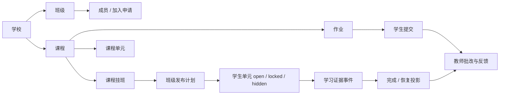

已经实现的核心逻辑包括：

- 学生申请加入班级，管理员或有权教师审核；也保留受控的直接加入路径。
- 同一学生可属于多个班级，课程目录按当前班级作用域读取。
- 课程可挂接多个班级，单元按班级发布计划形成 `open / locked / hidden`。
- 作业可按班级设置策略，学生提交后教师批改，积分进入账本。
- 学习事件和学习证据可形成学生进度、完成投影、恢复投影与教师有限事实。
- 管理员可治理学校、班级、用户、加入申请、课程状态、内容版本及相关审计。

### 3.4 当前管理层的真实优缺点

优点是业务对象、作用域和数据闭环已经存在，不是演示数据拼成的空壳；V8.5 又把管理员全局态势、课程版本变化、发布影响和学习结果来源转成了直接可见的叙事。仍有一部分旧治理页保留表格式表达，但当前核心演示路径已经不依赖阅读原始后端实体；后续若继续优化，应从 2 号文档能力池重新立项，而不是重写权限内核。

---

## 4. 三个学习空间与课程内容

### 4.1 工科试验室

工科试验室包含 90 个交互实验：数学 20、物理 21、化学 18、算法 12、生物 19。不同实验使用 DOM、Canvas、Web Worker 或按需 Three.js 表现函数、运动、反应、算法和生命过程。

`physics.mechanics` 当前是受保护的直接力学模拟：学生进入后立即调整重力、弹性、摩擦和球体半径，通过画布拖拽发射小球，并使用清空、暂停和放大等原有控制。旧版固定 `e=0.40/0.80`、预测—修正—解释和实验内学习证据工作流已经退出当前页面；班级或课程平台可以在实验外链接它，但不得重新接管其 DOM 和操作节奏。

### 4.2 代码空间

代码空间位于 `codevis/`，由 6 组课程和 18 个活动组成，强调“预测—运行—追踪—修正”。JavaScript、Python、C、C++ 浏览器学习运行时用于过程可视化；正式隔离 OJ provider 当前未配置，默认适配器会诚实记录 `runner_unavailable`，不会把不可运行伪报为通过。

### 4.3 未来星系

未来星系目录保留地球与宇宙、工程应用、数据科学、信息技术、材料微观和人文可视化 6 个方向，共 19 个活动身份。工程方向由 `EngineeringPage` 统一管理两个独立页面：`#engineering` 继续显示原桥梁桁架，学生可调整荷载并选择 B/C/D 节点观察支座反力和杆力；`#engineering/robot-arm-ik` 显示三连杆机械臂，支持拖动目标、关节限位、三种目标预设、暂停和重置。两页分别由 `bridge-truss.js` 与 `robot-arm-ik/index.js` 持有本体，路由切换会先销毁当前 owner。历史 `engineering.load-path/member-choice/safety-check` 仍可供目录或后端映射使用，但不能宣传为三个当前独立实验，也不恢复 B→C→判断→D 的课程证据链。

### 4.4 当前深度分布

```text
直接实验交互：physics.mechanics、桥梁桁架、双摆、色谱、机械臂等
课程闭环：教师建课与发布、学生选课与学习、作业批改与结果回读
活动目录：工科试验室、代码空间、未来星系统一提供稳定 activity_key
内容深度：不同活动采用不同模型和交互，但不设置精品或普通等级
```

“目录中有身份”“页面可操作”“形成学习结果”和“能在短时间讲清价值”是四种不同属性，不构成课程等级。V8.3.4 后停止继续增加实验，平台只在实验外组织课程、名单、发布、作业和结果回读；不把 124 个受保护旧活动批量迁入统一课程状态机。

完整模块说明和新增实验方法见 [15-学科实验与内容开发指南](01-子文档/15-学科实验与内容开发指南.md)，现状与展示边界见 [19-当前功能、业务闭环与展示边界](01-子文档/19-当前功能业务闭环与展示边界.md)。

### 4.5 新增实验模板

V8.2 起，新实验先从 `tools/templates/new-experiment/` 复制独立骨架，再接入目录、DOM 和 `AstraExperimentRegistry`。模板包含候选 manifest、版本化 module、首屏操作区、单 owner 生命周期、实验私有 CSS、模型说明和预览记录，不在生产注册表中自动出现，也不要求任何旧实验迁移。模板合同会把它渲染成探针身份，检查 JSON、JavaScript、DOM、CSS 命名空间、初始化/销毁、模型和预览入口；隔离浏览器旅程在正式接线前另验真实操作与释放。生产注册完成后删除只用于候选阶段的 `manifest.json`，避免已经上线的实验再次被发现器识别成“待注册候选”；可读 `module.html`、模型记录、预览来源和发布历史继续保留。详细复制、占位符、接线、候选清单退役与回退步骤见 15 号子文档第 11.1 节。

### 4.6 既有活动变更告警

`node tools/quality/check-protected-activity-changes.cjs` 会从三个现有权威来源重新投影当前活动：五学科 `CONFIG.experiments + AstraExperimentRegistry` 当前形成 90 项工科实验，Code Space course manifest 形成 18 项课程，Future manifest 与学习 owner 配置形成 19 项未来活动；投影还要与统一 `AstraLearningActivityCatalog` 做身份一一对应检查。V8.2.2 的只读保护基线仍精确冻结当时的 `88 + 18 + 18 = 124` 项旧活动，V8.3.1 双摆、V8.3.2 色谱和 V8.3.4 机械臂作为三个合法 addition 单独计数，不能借新增活动重写保护基线。工具随后把旧活动 key、路由、标题、owner、初始化/清理入口及实际消费的脚本、样式或 DOM 片段哈希，与 `tools/quality/baselines/protected-activities-v822.json` 比较。

普通新增活动不在旧基线中，因此只计为 addition 并被忽略；删除旧活动、改变身份或改变受保护资源会按学习空间、活动 key 和精确文件失败关闭。知识性纠错或阻断修复只有在项目负责人批准后，才允许把该次差异产生的 64 位 issue signature、任务号、批准人、日期和理由写入 `tools/quality/protected-activity-exceptions.json`；例外只绑定这一组 before/after 指纹，不能泛化成长期放行，也不能通过重写基线逃避告警。完整使用步骤见 15 号子文档，发布门禁见 18 号子文档。

### 4.7 新实验视觉基础件

V8.2.3 在同一复制模板中增加一套轻量视觉基础件：实验舞台内显示运行状态、当前可观察量和两项图例，控制区只保留一个带单位的主参数、播放/暂停、重置和一句短状态反馈。桌面采用舞台与控制区并列，平板收窄双栏，760px 以下改为单列并用原生 `<details>` 抽屉组织控制；所有可点击控件至少 44px，键盘焦点可见。`running`、`paused`、`reduced-motion` 三种状态由同一 owner 输出，减少动态效果时停止连续帧，但参数输入仍会渲染静态结果。

这套基础件只服务今后新增的独立实验，不加载进生产页面，不给既有实验套壳。首屏只允许模型标签、可观察数值和一句操作反馈；学习目标、课程说明和长篇原理继续留在实验外或模型文档。样式仍由 page、module 和实验 namespace 三重限定；Canvas 尺寸读取父容器 `clientWidth/clientHeight`，舞台使用有界 `clamp()` 高度，避免 ResizeObserver 把边框尺寸反写到画布后形成递增反馈。机器合同、复制参数和浏览器验收口径见 15、18 号子文档，视觉规范见 [`05-UI规范模板.md`](05-UI规范模板.md)。

### 4.8 新实验模型说明与注册门禁

V8.2.4 把原先一组提示性项目符号改为 11 节模型记录：现象与结论边界、变量/单位/精度、核心公式或算法不变量、适用条件/假设/限制、数值方法、画面映射、典型值与边界值、误差预算、实现对应关系、参考依据和发布前复核。`model-notes.example.md` 提供完整的匀速运动校核样例，`model-document.contract.json` 冻结表格列、最少行数、引用和复核要求；模型锚点固定由 `model-<experiment-id>` 生成，不再让开发者另填一份可能失配的锚点。

`check-new-experiment-model-document.cjs` 会按 manifest 中的本地 Markdown 路径提取精确锚点，核对实验身份、标题、复核状态、日期、变量角色、SI 单位、公式块、三类边界、两组验证样例、误差与引用，并拒绝待填写项、未勾选复核项和课程化章节。新增注册检查已经调用同一验证器，所以科学记录缺失或仍为草稿的候选不能通过接线门禁。工具只读取新候选 manifest 与文档，不扫描、迁移或重写既有实验；完整填写和检查步骤见 15 号子文档。

### 4.9 新实验预览素材流程

V8.2.5 要求每个新增实验在自己的目录内提供 `preview.webp` 与 `preview.json`。静态封面固定为 1600×900 WebP、1—120 KiB、非动画；替代文本必须描述可观察的模型结果，不能只写“图片/封面/截图”。来源记录绑定实验身份、路由、舞台选择器、1600×900 捕获视口、责任人、日期、权利状态、来源代码文件、实际字节和 SHA-256，并明确画面展示交互结果、不是纯装饰、没有复用旧活动素材、没有把标题烘焙进图片。短循环是可选能力；无论是否提供，`prefers-reduced-motion` 的权威降级始终是静态 poster。

`check-new-experiment-preview.cjs --inspect <preview.webp>` 会直接输出尺寸、字节、SHA-256、是否动画、帧数和时长，便于填写记录；`--manifest` 则在候选阶段核对 manifest、记录和文件三者。检查器纯 Node 解析 RIFF WebP，不依赖本机图像库，并已接入新增注册门禁。所有资源路径必须留在新实验目录，`content.old_activity_source` 必须为 `false`；因此这套流程不会借制作封面之名截图或搬运 124 项旧活动。双摆、色谱与机械臂均已按此流程交付真实生产素材：三张 poster 都是 1600×900，字节数依次为 52,396、35,790、27,740；来源、替代文本与 SHA-256 均写入各自目录的 `preview.json`。

### 4.10 新实验隔离浏览器验收

V8.2.6 为新候选 manifest 增加版本化 `module.html` 入口，并提供 `browser-journey.contract.json` 与 `check-new-experiment-journey.cjs`。运行器直接读取候选自己的 module、CSS、JS，在 `127.0.0.1` 临时页面内挂载，不要求先改 `CONFIG.experiments`、`AstraExperimentRegistry` 或 `index.html`。同一候选依次接受 1440×900 桌面、390×844 手机和 1440×900 减少动态效果三组真实 Chromium/Edge 验收。

每组流程都会检查进入和首次 Canvas 绘制、主参数变更、暂停/继续或静态停帧、重置、根级横向溢出、离页销毁、再次挂载、console warning/error、pageerror 与资源请求失败。手机另验原生控制抽屉关闭/展开和 44px 触达区；离页时保存旧 AbortSignal，确认 owner 引用归零、rAF 归零、ResizeObserver 归零并移除模块。临时服务器只开放候选自己的目录，因此同目录纹理、模型或动态模块可加载，越界资源不能借验收页暴露。结果写入 JSON 报告和三张截图，报告还可用 `--validate-report` 独立复核。该流程只验新增候选；124 项既有活动继续只走保护性 smoke，不会借浏览器测试重新挂载或改造旧页面。

### 4.11 新实验开发态调试面板

V8.2.7 在同一隔离浏览器运行器上增加 `--debug` 显式开关。不开启时，验收页不会请求 `new-experiment-debug-panel.js`，不会建立调试全局对象、DOM、采样定时器或网络请求；模板 owner 只提供无轮询、只读的 `debugSnapshot()`，用于按需读取运行状态、模型变量、最近模拟步长和当前资源句柄，不把开发工具写进实验首屏。

开启后，隔离服务器才会通过专用开发路由加载 Shadow DOM 面板，每 250ms 展示运行状态、模型变量、模拟步长、帧率、活跃 rAF、ResizeObserver、控制作用域和 Canvas bitmap/CSS 尺寸。桌面使用右侧浮动检查器，手机使用有界底部面板和内部滚动，关闭按钮不小于 44px；减少动态效果环境必须显示 0 fps 与 0 步长。候选离开、重新进入和最终离开都会核对面板节点及定时器释放。该脚本没有被 `index.html`、Service Worker、配置或实验注册表引用，生产与竞赛画面不会出现。完整命令和字段约定见 15、18 号子文档。

### 4.12 首项新增生产实验：双摆混沌

V8.3.1 在 `#physics/double-pendulum-chaos` 交付首项新增展示实验。页面同屏绘制两组只相差第二杆初角的等长、等质量平面双摆，以青色和洋红尾迹、末端分离、相空间和能量相对漂移形成可直接观察的混沌初值敏感性。控制区只保留初始角差、阻尼、时间倍率、三种姿态、暂停和重置；拖动任一末端摆球可以从当前姿态重新释放。页面没有课程目标、预测表单、章节说明或长篇原理，旧的通用物理课程指南也通过新目录项的 `guide: false` 单项关闭，其他实验仍维持原行为。

数值层采用 240Hz 固定步长四阶 Runge–Kutta；无阻尼默认样例在 10 秒模型时间的末端分离约为 1.656m、相对能量漂移约为 0.000184%。`DoublePendulumChaos.debugSnapshot()` 只读暴露参数、模型时间、误差、步长和资源数量；进入时 rAF、ResizeObserver 和控制作用域各为 1，离开后全部归零。生产壳保留一行压缩镜像，权威可读结构仍在 `pages/physics/double-pendulum-chaos/module.html`，从而不突破冻结 `index.html` 的 3758 行架构上限。模型边界、公式、样例和引用见 15 号子文档的 `model-double-pendulum-chaos` 记录。

### 4.13 第二项新增生产实验：色谱分离

V8.3.2 在 `#chemistry/chromatography-separation` 交付第二项新增展示实验。页面左侧同步绘制溶剂前沿与 A/B/C 三条色带，右侧同时保留完整预测峰和扫描线之前的已检测曲线；用户可改变保留因子差与流量，切换峰重叠、均衡和高分离三种状态，暂停、重新进样，或直接拖动检测扫描线定位时刻。首屏没有真实药品、仪器处方、课程目标、实验步骤或长篇解释，化学通用课程指南也只对这一新增目录项以 `guide: false` 关闭。

模型采用 `t_M=V_M/F`、`t_R=t_M(1+k)`、`v_i/u=1/(1+k_i)` 和固定 `N=900` 的对称高斯峰。默认 `p=50 / F=1.4 mL·min⁻¹` 时，三峰保留时间为 `11.43 / 15.89 / 20.36 min`，最小分离度为 `1.8473`；峰重叠预设的最小分离度为 `0.9494`。流量只缩放时间轴，保留差决定峰间距，画面颜色、线宽和色带尺寸不承担真实定量含义。`ChromatographySeparation.debugSnapshot()` 公开只读模型与资源快照；生产离页后 rAF、ResizeObserver、控制作用域和 Canvas 均归零，重入恢复为单实例。可读结构位于 `pages/chemistry/chromatography-separation/module.html`，生产壳仍只保留一行镜像，`index.html` 为 3756 行且低于 3758 行上限；完整模型与 IUPAC/NIST 依据见 15 号子文档的 `model-chromatography-separation` 记录。

---

## 5. 前端页面、路由与可见交互

### 5.1 页面层次

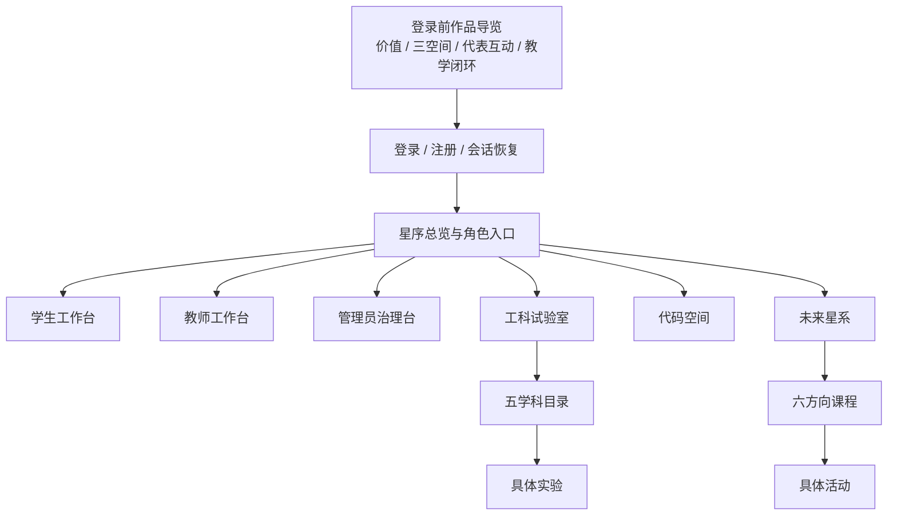

主站的 hash 路由由共享 Router 和 PageRegistry 管理。页面、实验和动态 owner 必须遵守注册、初始化、离页销毁和资源释放；具体顺序见 [12-前端 SPA、路由与页面生命周期](01-子文档/12-前端SPA路由与生命周期.md)。

### 5.2 已经可见的交互能力

- 登录前公开导览；目录数量读取权威活动清单，空间和课程入口在未认证时统一落到真实账号入口。
- 登录/注册/重置、会话恢复和角色资源裁剪。
- 学生可通过课程码申请公开课程，行政班用于组织与限定准入；当前兼容范围详见第 3.2、7.1 节，不再把旧的强制入班要求作为统一主路径。
- 学生工作台的班级/课程上下文、继续学习、作业和学习状态。
- 教师工作台的班课上下文、课程编排、作业、学生进度和学习事实。
- 管理员治理台的组织、用户、加入申请、课程、内容和审计入口。
- 三个学习空间的目录、实验深链、加载/错误/锁定状态和移动端交互。
- 力学模拟与桥梁桁架等代表实验的直接参数操作、动画/Canvas 反馈和重复进入。

### 5.3 当前最需要警惕的前端结构

`pages/teacher/teacher.js`、`pages/admin/admin.js`、`pages/student/student-workbench.js` 和多个共享 evidence owner 已达到一千至数千行。现阶段不宜为了形式美观全面改框架，但新增功能应优先抽离“数据适配、状态派生、渲染片段”，避免继续把 API 请求、状态机、模板和事件处理堆在同一个 owner 中。`pages/physics/physics.js` 已恢复为较小的直接模拟 owner；`frontier-learning.js` 和发布上下文必须继续排除 `engineering`，防止动态课程壳再次覆盖静态桥梁页面。

界面、触控、响应式与无障碍细节见 [16-界面样式、移动端与无障碍](01-子文档/16-界面样式移动端与无障碍.md)，页面定位见 [`08-前端页面实现索引.md`](08-前端页面实现索引.md)。

---

### 5.4 qianduan 独立前端原型

2026-09-06，FE-050 在 [`qianduan/`](../qianduan/) 建立独立的 Three.js + TypeScript + Vite 前端原型，FE-051 重做星云与导航，FE-052 按 UI-019 确认方案实现透视多轨课程轮盘。该目录尚未接入 FastAPI，也未替换原主站；其登录会话、课程、教师和任务均为演示数据。当前工作区交付未提交、未新增产品发布号，任务原件见 [02 当前任务](02-更新规划.md#3-当前任务状态)。

从仓库根目录启动：

```powershell
cd qianduan
npm ci
npm run dev -- --port 5173 --strictPort
```

默认仅监听本机 `127.0.0.1`。打开 `http://127.0.0.1:5173/`，首次页面会话播放众星归位，随后进入极简星空封面；点击探索后按演示会话进入登录或总览。登录可填写任意昵称与至少四个字符的演示密码，也可使用访客入口；密码不发送、不存储，`sessionStorage` 中的演示标记不构成真实身份授权。

| 当前界面 | 已有交互与范围 |
| --- | --- |
| 开屏与封面 | 程序生成的三维云气与恒星，逐视线体积积分；相机入场、鼠标环绕与拖拽观察；三种星云形态自动轮播，也可用底部三条线切换；保持指定品牌文案，移除球体 |
| 登录 | 左侧共用实时体积星云，右侧半透明表单；错误提示、密码显隐、访客进入与演示会话恢复 |
| 总览与导航 | 品牌/空间菜单、当前页简称、课程搜索、邀请码；透明侧栏默认约 17%，可收缩至 70px；上方最多三条任务，下方左课表、右日历，原有日程与任务交互保留 |
| 课程 | 左向多轨、近疏远密的统一三维透视；一轨一课，稳定显示两门、过渡最多三门，支持内外拨动和首尾循环；桌面每条轨道由 23,000 个星点及 6,500 个局部星系点组成，最多维护三条活动轨道；云气、轨迹、标记同步移动，停稳后更新左侧说明 |
| 搜索与邀请码 | 按课程名、学科、教师查询演示课程并定位；`ASTRA26` 预览演示班级，明确不产生实际加入关系 |
| 班级、笔记与账号 | 示例班级入口；页面内笔记编辑/导出；昵称修改、减少动态效果、重播开屏与退出 |
| 管理、工科实验室、代码空间、未来星系 | 已建立独立导航位置和可返回的占位页，等待后续具体页面指引 |

| 文件或模块 | 职责 |
| --- | --- |
| `qianduan/src/main.ts` | 页面阶段、导航、交互协调和视图生命周期 |
| `qianduan/src/domain/models.ts`、`calendar.ts` | 会话/课程/任务模型、数据服务边界与日期计算 |
| `qianduan/src/domain/course-wheel.ts` | 独立循环状态、最多三个可见槽位、拖拽吸附、取消与落位提交；不随课程数量创建同等数量的视图 |
| `qianduan/src/services/demo-gateway.ts` | 演示数据与演示会话；以后通过实现 `LearningGateway` 接入真实服务并映射 DTO |
| `qianduan/src/ui/` | 原生 DOM 视图、图标与课程信息展示；输入文字转义 |
| `qianduan/src/render/space-renderer.ts` | 共用 WebGL2 画布、相机和手势、轮播、暂停和资源生命周期 |
| `qianduan/src/render/volume-pass.ts`、`volume-shaders.ts` | 数值生成 64³ 噪声格点；每条视线对三维云气积分，计算透射和近似光照；降低体积通道分辨率后与清晰星点合成 |
| `qianduan/src/render/course-orbit-view.ts` | 手势/键盘/滚轮、可见标签生命周期、静态降级与课程落位回调；导航计时使用实际经过时间，避免后台绘制节流拖慢落位 |
| `qianduan/src/render/course-orbit-scene.ts`、`orbit-math.ts`、`orbit-shaders.ts` | 共同轨道坐标、倾斜空间、透视相机、恒星带、局部星系和 48 步轨道体积积分；标记与气尘使用同一投影 |
| `qianduan/src/render/galaxy-model.ts` | 种子与局部星系旋臂的视觉参数；原全幅课程星系场景已由多轨场景替换 |
| `qianduan/vite.config.ts` | 页面、Three.js 核心与 WebGL 渲染模块分别打包缓存 |

渲染器限像素密度、隐藏页面时暂停、支持减少动态效果；离开课程视图释放该视图的几何、材质与离屏缓冲，再进入时重建。共用噪声数据和封面资源归画布生命周期管理。使用一个共用画布，图形不参与课程成绩或账号权限判断。资源清理方法可对照 [Three.js 官方说明](https://threejs.org/manual/en/cleanup.html)。`?debug=1` 显示开发性能读数和可检查的相机位置；`?graphics=basic` 使用静态可操作降级。当前没有实现 WebGPU 后端或通用体素引擎。

当前课程构图采用 [UI-019 合并方案](image/ui019-multi-orbit-approved.png) 和[换层过程](image/ui019-orbit-sequence.png)，并加入用户确认的倾斜透视。此前 [FE-051 课程概念](image/fe051-courses-concept.png) 及 FE-050 的[封面](image/fe050-entry-concept.png)、[总览](image/fe050-overview-concept.png)、[课程](image/fe050-courses-concept.png) 保留设计背景。运行时不加载星云/星系 PNG；参考图仅用于构图和配色。三维噪声格点由随机种子生成，合成纹理为每帧计算的离屏结果，二者均不是星空照片。

恒星盘、气尘旋臂和中央隆起的组织参照 [NASA 对星系类型的介绍](https://science.nasa.gov/universe/galaxies/types/)。当前是可观察的三维视觉模型，不计算引力或真实天体轨道；课程标签所在的曲线是界面导航，不能解释成星系沿同一条天体轨道运动。用户要求桌面优先，手机端不进入本轮精调。

验证命令为 `npm test` 与 `npm run build`。首轮记录见 [39 号 C.6](03-子文档/39-跨版本综述与规划迁移附录.md#c6-fe-050-独立前端原型工作区记录)，体积星云记录见 [C.7](03-子文档/39-跨版本综述与规划迁移附录.md#c7-fe-051-实时三维星云与导航重构)，透视多轨轮盘记录见 [C.9](03-子文档/39-跨版本综述与规划迁移附录.md#c9-fe-052-透视多轨课程轮盘实现)。

## 6. 后端能力与数据闭环

### 6.1 API 领域

FastAPI 同时保留兼容 `/api` 与课程闭环 `/api/v1`，按以下领域提供正式能力：

| 领域 | 已实现能力 |
| --- | --- |
| 健康与会话 | 健康检查、注册、登录、退出、会话撤销、密码重置 |
| 用户与组织 | 用户、学校、学校成员、班级、班级成员、加入申请 |
| 课程与单元 | 课程、协作者、挂班、单元、班级发布计划、课程状态 |
| 作业与提交 | 作业策略、学生提交、教师批改、积分账本 |
| 学习数据 | 旧学习事件/进度、权威学习证据、活动运行时、完成与恢复投影 |
| 内容治理 | 内容页、草稿、版本、发布、回滚、脚本资产策略与扫描 |
| 通用课程闭环 | 教师申请、课程信息修订与审核、课程准入与成员、共享草稿、不可变发布、检查点尝试和三角色聚合读取 |
| 管理治理 | 统计、组织、课程、告警、后台任务、审计、知识快照 |
| 代码学习 | 题目、版本、提交和诚实降级的判题适配边界 |

接口路径、DTO、状态码和权限细节统一移至 [13-后端 API、权限与数据架构](01-子文档/13-后端API权限与数据架构.md) 和 [14-课程、学习证据与业务接口](01-子文档/14-课程学习证据与业务接口.md)。

### 6.2 学习证据主链

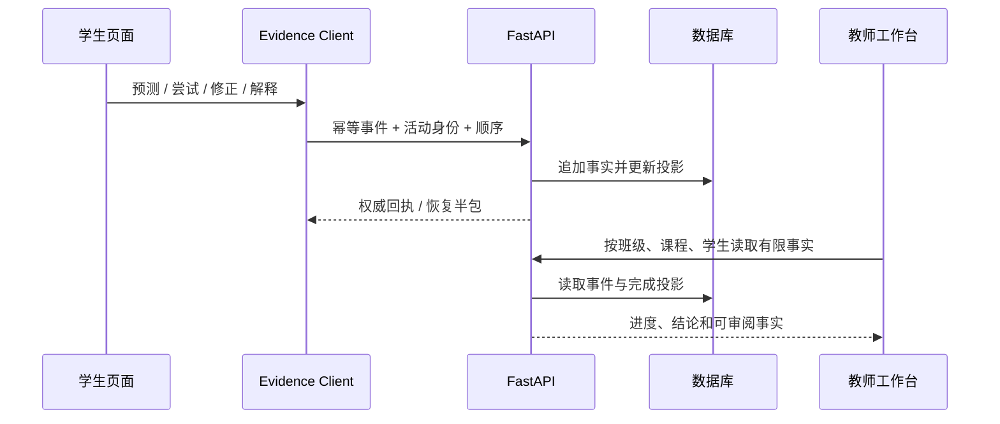

完成状态只由服务端规则派生，页面不能自行宣布完成。V8.0.12 已实现学习者/服务端双游标、运行身份和权威恢复服务包；但所有产品页尚未统一消费完整活动内核与 IndexedDB pending，因此不能宣传为“全平台任意页面精确续学”。

### 6.3 后端当前不是空壳，但存在结构债务

- `learning_evidence.py`、`learning_activity_runtime.py`、`knowledge.py`、课程和班级 endpoint 等 owner 较大。
- 旧 `learning_events / progress` 与新 evidence/runtime/projection 并存，领域真值对新开发者不够直观。
- 兼容 `/api` 与新版 `/api/v1` 并存，新客户端需要明确选择稳定 DTO，不能从页面模板反推字段。
- 三角色首屏已有聚合读取，但详情页仍分散在多个大型 owner；继续扩展时应增加只读投影与独立适配器，不再扩大主文件。
- 内容协议已有结构化 section，但脚本路径、iframe 和 DOM owner 仍带明显 Web 端假设。

当前竞赛路线只修复直接影响展示的聚合读取、语义冲突和前端适配，不做全量微服务化、框架迁移或大规模数据库重写。

---

## 7. 关键业务旅程

### 7.1 学生学习旅程

1. 登录并由服务端确认学生身份。
2. 可以先加入行政班，也可以凭课程码申请公开课程；授课课程成员关系不再依赖行政班。
3. 从学生工作台进入待学课程、继续学习或作业。
4. 后端按 `CourseEnrollment` 与当前不可变 release 返回可见单元。
5. 学生从外层入口进入实验并直接操作；既有力学与桥梁页面不强制经过课程步骤。
6. 只有明确接入且经批准的活动才提交幂等学习事件，由服务端派生完成投影；普通既有实验不因“打开或拖动”自动生成权威完成。
7. 学生返回工作台查看课程、作业或已接入活动的权威状态；教师只读取服务端能够证明的事实。

### 7.2 教师教学旅程

1. 申请教师身份并在管理员批准后进入教师工作台。
2. 创建授课课程、选择共同教师、分类和准入方式，提交管理员审核。
3. 审核通过后维护课程名单、共享草稿、结构化单元与完成预设，并显式发布不可变版本。
4. 查看课程学生的提交、检查点、完成状态和学习证据。
5. 批改提交、给出反馈并观察课程进度。

### 7.3 管理员治理旅程

1. 登录后进入全局治理台。
2. 查看学校、行政班、授课课程、用户和待处理事项。
3. 审核教师申请与课程信息，并在必要时兜底处理课程成员申请。
4. 治理组织、课程状态、后台任务、告警和审计；不逐条审批教师课程正文。
5. 对关键写操作保留原因、冲突和可追溯记录。

### 7.4 竞赛演示旅程

当前可以完整展示“登录前理解作品 → 管理员查看教学态势 → 教师创建并迭代课程 → 发布前查看影响 → 学生进入独立实验或完成任务 → 教师批改 → 师生沿证据链回读结果”。实验仍保持直接操作，课程只在外层引用稳定 `activity_key`；管理驾驶舱、版本演进和证据解释已经是可点击的稳定模块，不再只是候选规划。

---

## 8. 仓库入口与开发顺序

### 8.1 顶层目录

```text
.
├── index.html              主站 SPA 外壳
├── pages/                  页面、学科、实验和三角色工作台
├── shared/                 路由、会话、API、证据客户端和设计系统
├── codevis/                代码空间独立子站
├── backend/                FastAPI、模型、迁移、脚本和 pytest
├── server/                 Node 开发静态服务和 C++ Release 静态服务
├── tools/                  前端合同、浏览器证明、质量工具和新增实验模板
├── UI/                     共享界面资源
├── doc/                    主文档与编号子文档
└── .github/workflows/      持续集成门禁
```

完整目录职责见 [11-系统架构与代码目录](01-子文档/11-系统架构与代码目录.md)。

### 8.2 新开发者推荐阅读/操作顺序

1. 阅读本文，确认产品、角色、业务和边界。
2. 阅读 [`02-更新规划.md`](02-更新规划.md)，只领取一个小版本任务。
3. 用 [`08-前端页面实现索引.md`](08-前端页面实现索引.md) 或 11—19 号子文档定位 owner。
4. 执行 9001 启动并复现当前页面，不在未复现前重写逻辑。
5. 新增实验从 `tools/templates/new-experiment/` 开始；既有实验默认冻结，不把它迁入模板。
6. 在生产接线前运行 `tools/quality/check-new-experiment-registration.cjs --manifest <manifest>`，先消除身份、owner、资源和 cleanup 冲突。
7. 优先复用 Router、PageRegistry、API Client、access control 和 evidence client。
8. 只修改任务允许范围，补最接近风险的测试。
9. 验证后把结果写入 03 对应大版本子文档，不把完成历史留在 02。

---

## 9. 启动与最小验证

### 9.1 推荐启动

从仓库根目录运行：

```powershell
powershell -ExecutionPolicy Bypass -File .\astra-local.ps1
```

访问：

```text
http://127.0.0.1:9001/
```

全新数据目录需要首个管理员时：

```powershell
powershell -ExecutionPolicy Bypass -File .\astra-local.ps1 -BootstrapAdmin
```

脚本会准备受控 Python 环境、执行 Alembic、初始化本地数据并同源启动主站和 API。完整参数、仓库外虚拟环境、拆分启动与部署边界见 [17-环境启动、构建与部署](01-子文档/17-环境启动构建与部署.md) 和 [`04-部署指南.md`](04-部署指南.md)。

### 9.2 最小质量门禁

```powershell
python -m pytest backend
node tools/tests/new-experiment-template-contract.cjs
node tools/quality/check-new-experiment-model-document.cjs --manifest pages/<subject>/<experiment-id>/manifest.json
node tools/quality/check-new-experiment-preview.cjs --manifest pages/<subject>/<experiment-id>/manifest.json
node tools/quality/check-new-experiment-registration.cjs
npm test
git diff --check
```

界面任务还必须至少检查桌面和 390×844 两个视口、键盘焦点、页面溢出、遮罩、错误/加载状态与 console。测试和维护细节见 [18-测试、调试、维护与发布规则](01-子文档/18-测试调试维护与发布规则.md)。

---

## 10. 当前完成边界

### 10.1 已经可以诚实展示

- 三个学习空间和 127 个实验/活动的内容规模。
- 登录前导览中的项目价值、教学闭环和真实 `90/18/19` 目录；两种代表性互动只用于快速理解，不构成课程等级。
- 学生、教师、管理员登录后的差异化资源和工作台。
- 学校、班级、课程、发布、作业、提交、批改和积分主链。
- `physics.mechanics` 与 `#engineering` 桥梁桁架的直接控制、Canvas 反馈和桌面/移动操作。
- 已有学习证据、教师回读和班级业务能力，但不能把它们宣传为当前力学/桥梁实验内部仍在执行的课程证据链。
- 本机 SQLite、Alembic、9001 同源启动和大规模自动化回归。
- 内容版本、审计、后台任务和知识快照等后端工程能力。

### 10.2 不能越级宣传

- 不是成熟平台同等规模的完整教务产品。
- 不是已经过真实课堂实证的教学效果系统。
- 不是正式公网、正式 MySQL、高并发和全监控生产服务。
- 不是 127 项活动都具有相同画面深度或代码空间主路径同等课程闭环。
- 不是已经接通正式隔离 OJ、AI 助教或微信小程序。
- 不是所有页面都已接通完整离线队列和步骤级精确恢复。

### 10.3 当前开发判断

**2026-09-05 适用期说明**：本节下方保留 V8 各阶段的实现与当时边界；其中“默认禁止修改全部实验”“等待旧 QA”等要求只说明历史阶段。当前目标架构见 [第 13 章](#13-目标架构与设计待实现)，业务规则和实施状态见 02；71 号仅保留首轮审查背景。

**V8.6.6 当前稳定控制点**：学生目录以 `galaxy_key + subject_key + activity_key` 对齐共享活动，以真实 `course_id` 对齐选课、发布与学习作用域。工科试验室、代码空间和未来星系均允许只开放部分学科；行政班课程优先覆盖同学科直接选课，直接选课仍可浏览已发布内容，但没有明确班级作用域时不伪造作业与学习证据归属。完整前端边界见 [12 号子文档](01-子文档/12-前端SPA路由与生命周期.md#v866-三星系学生课程投影fe-045当前稳定实现)，业务解释见 [19 号子文档](01-子文档/19-当前功能业务闭环与展示边界.md#v866-三星系学生课程投影fe-045当前稳定实现)。本版本没有修改 127 项实验本体。

**当前稳定控制点**：`V8.5.4@3c28562`。`DEV-003@e057550` 建立教学管理驾驶舱，`DEV-004@5e76419` 交付课程版本时光机与发布影响预演，`DEV-005@d9b302d` 建立师生学习证据链；`QA-033@3c28562` 对齐 `20260828v854ManagementShowcaseP0` 资源代际。V8.4.6 课程闭环、`UI-015@bace1b4` 登录前导览和 `90 / 18 / 19` 权威活动目录均保持兼容。

**V8.0.34 资源与终验边界**：V832 接入移动回执，V833 接入 Engineering 同帧布局，V834 以 `20260813v834ShowcaseLayoutP0` 统一资源代际；`app-session → loader → queue/client → catalog/activity` 保持同代传播，ARCH-004 边界不变，QA-023 仍待同 revision 复验。

**V8.1.0—V8.1.5 候选处置**：旧内容平台模型、迁移和接口已经由 BE-027 按 V8.4 课程边界取舍，不再作为并行实现；其中登录前公开导览与现有会话、活动目录和实验保护规则相容，已由 `UI-015@bace1b4` 独立整合。下文涉及 V8.1 内容平台的旧候选数字只保留历史语境，不代表当前架构。

**V8.1.6 纠偏边界**：学生工作台中的能量课程旅程、星图额外课程入口、配套演示种子、图稿和专属合同已撤销；`physics.mechanics` 恢复直接参数/画布模拟，`#engineering` 恢复静态桥梁实验并从 Future runtime/publication context 的管理页面集合中移除。全局静态资源缓存提升为 `20260824v816ExperimentRestoreP2`，用于强制浏览器丢弃被否决页面和中间恢复字节。内容平台底座暂时隔离保留，但不得把既有实验包进统一课程正文，也不得在实验首屏暴露内容块、发布包或内部版本信息。

**还原验证结果**：V8.1.6 独立提交快照中 239 个受跟踪 JavaScript 文件通过语法检查，60/60 前端合同通过；外部 Edge/Chrome 已实测桌面与 390×844 的力学、桥梁代表旅程，参数与节点交互有效、根级横向溢出为 0、课程壳命中为 0、console warning/error 为 0。该结论只覆盖两项代表实验，不冒充 124 项逐页视觉验收。

**既有实验保护规则**：V8.2.2 建立的 124 项旧活动保护基线保持不变；V8.3 新增的双摆、色谱和机械臂也从正式交付后进入冻结范围。当前 127 项活动的路由、首屏、布局、视觉、交互、动画、参数、求解器和返回关系默认禁止修改；知识性纠错必须先记录证据、影响范围和拟改文件，经项目负责人批准后才能实施。平台只在实验外提供发现、班级组织、任务布置和结果回读。

**V8.2.0 `EXT-01`**：`tools/templates/new-experiment/` 提供 manifest、HTML、单 owner 运行时、实验私有样式和模型说明五份模板；模板探针验证 key/route/owner 一致性、JavaScript 可解析、首屏控件、AbortController、ResizeObserver、rAF、reduced-motion、CSS 三重命名空间以及 destroy 资源释放。模板没有写入 `CONFIG.experiments`、`AstraExperimentRegistry` 或 `index.html`，因此不会生成空壳入口。该独立提交快照为 240 个受跟踪 JavaScript 文件与 61/61 前端合同；工作区中 V8.1 待裁决候选的额外合同不计入这一发布口径。

**V8.2.1 `EXT-02`**：`tools/quality/check-new-experiment-registration.cjs` 只读加载五学科 88 项 `CONFIG.experiments` 与 `AstraExperimentRegistry` 基线，验证新增 manifest 的 schema、subject、key、activity key、route、同学科标题、owner、init hook、脚本、样式、版本参数和 destroy。资源必须位于新实验自己的目录；脚本会在隔离 VM 中加载 owner 并对 destroy 做空状态 smoke。检查前后三份生产注册文件哈希不变。该独立提交快照为 242 个受跟踪 JavaScript 文件与 62/62 前端合同；代码空间和未来星系使用不同注册来源，完整 124 项只读清单留给 `EXT-03`，本版本不扩大声明。

**V8.2.2 `EXT-03`**：`tools/quality/check-protected-activity-changes.cjs` 不迁移三套既有架构，而是从各自权威 manifest、registry 和 owner 配置生成统一保护投影，并由统一学习活动目录反向核对，冻结 `88 + 18 + 18 = 124` 项旧活动。基线记录元数据、运行入口与实际消费资源的确定性 SHA-256；普通新增不报警，旧活动缺失或差异会输出学习空间、活动身份、文件和一次性签名。空例外文件是默认状态，只有精确批准记录才能抑制完全相同的一项差异。V8.2.1 已证明原 242 个受跟踪脚本；本版本新增的 2 个 CJS 文件分别通过 `node --check`，同一独立 Git 暂存快照的 63 项前端合同经分段验收全部通过。该版本不加载任何生产运行时代码、不增加可见实验，也不包含 V8.1 待裁决候选。

**V8.2.3 `EXT-04`**：新实验模板新增状态、读数、图例、主参数、播放/暂停/重置、短提示和移动控制抽屉，并用 `visual-primitives.contract.json` 冻结“仅新增实验、三重样式作用域、三种运行状态、桌面/平板/手机视口、44px 触达区和短文本”边界。模板专项合同验证 DOM、CSS、运行状态、减少动态效果和清理；真实外部 Edge/Chrome 又完成 1440×900、834×1112、390×844 与 reduced-motion 操作验收。初次桌面验收发现 Canvas 把父级 border-box 高度反写后形成 ResizeObserver 递增反馈，现已改为有界舞台高度和父容器 client box 测量，复测舞台 522px、Canvas 520px 且持续稳定。V8.2.2 的 63 项独立基线不重复冒充本轮全跑；本轮确认暂存快照含 64 项受跟踪合同，并执行 3 项受影响/新增合同、旧活动保护检查和 FE024 缓存合同，全部通过。该版本仍不产生生产入口，不触碰 124 项既有活动。

**V8.2.4 `EXT-05`**：新模型记录以显式 `model-<id>` 锚点绑定 manifest，必须完成 11 节、7 张结构表、至少一个公式/算法关系、典型值和边界值两组样例、两条结构化且被正文使用的参考依据，以及 5 项发布复核。独立检查器覆盖缺锚点、身份/标题错配、草稿状态、未填单位/公式/限制/样例/引用和课程章节；注册门禁复用它，缺科学说明的候选不能通过。纯 Git 暂存快照在临时仓库生成本地 `HEAD` 后，通过 247 个受跟踪 JavaScript/MJS/CJS 语法检查、65/65 前端合同与 124 项保护 CLI；首次无 `HEAD` 的临时快照只在 QA-016 修订解析处停止，不属于项目失败。本版本仍不写生产目录、路由、缓存或任一既有实验。

**V8.2.5 `EXT-06`**：新 manifest 增加 preview 记录、版本化 poster、替代文本、可选 motion 和静止降级；`preview-record.json.tpl` 与 `preview-assets.contract.json` 冻结 1600×900 WebP、120 KiB、来源/权利/代码文件、实际哈希、内容边界和 `poster` 降级。检查器可独立 inspect WebP，也能从 manifest 验证候选目录并被注册门禁复用；专项负例覆盖身份、替代文本、来源文件、旧活动复用、元数据/哈希、预算和“静态文件冒充动图”。纯暂存快照通过 249 个脚本、66/66 前端合同和 124 项保护。本版本没有生产卡片、真实新封面或短循环；测试只把现有 1600×900 WebP 临时复制到系统临时目录验证二进制解析，未把它登记为新实验素材。

**V8.2.6 `EXT-07`**：新增实验 manifest 现在显式登记版本化 `module.html`，注册检查会把模块片段与脚本、样式一并限制在候选目录。浏览器运行器用隔离本机页面执行桌面、390×844 手机和 reduced-motion 三套完整旅程，覆盖首次绘制、72 参数操作、暂停/继续或静态停帧、50 重置、离开释放、重新进入后 64 参数操作、抽屉、44px、溢出、console 与 pageerror，并留下 JSON 和截图。专项报告在系统 Edge 151 上三组全部通过；纯 Git 暂存快照通过 251 个脚本、67/67 前端合同和 124 项保护。本版本没有生产注册、可见新实验或旧页面浏览器巡检，`test-screenshots/` 证据仍为本机忽略产物。

**V8.2.7 `EXT-08`**：新增实验模板 owner 增加只读 `debugSnapshot()`；独立开发脚本与 `debug-panel.contract.json` 冻结默认关闭、250ms 采样、六个可见分区、桌面/手机布局、减少动态效果和清理边界。隔离运行器只有收到 `--debug` 才提供并请求调试脚本，普通模式三组均证明 0 请求、0 全局对象、0 面板节点；开启模式三组均证明参数 72 可回读、普通环境存在正步长/正帧率、reduced-motion 为 0、手机面板有界且关闭按钮达到 44px、离开与重入后定时器和 DOM 可释放。本地证据位于 Git 忽略的 `test-screenshots/new-experiment/v827-ext08-selftest/`；纯 Git 暂存快照通过 253 个脚本、68/68 前端合同和 124 项保护。本版本不进入生产注册、缓存或竞赛画面，也不触碰既有实验。

**V8.3.1 `SHOW-02`**：`physics.double-pendulum-chaos` 已按候选隔离验收、生产接线、真实 hash 进入、实验 A→B 销毁、导航复开、刷新直达和 390×844 移动端顺序交付。生产目录从 88 项增加到 89 项，跨三星系当前投影为 125 项；V8.2.2 的 124 项旧基线保持不变并报告 1 个合法 addition。双摆 owner 的离页快照为 `animation_frames=0 / resize_observers=0 / control_scopes=0`，重新进入各恢复为 1；移动端根级横向溢出为 0，五个主要按钮高度为 44—46px，生产刷新没有 console warning/error。候选 manifest 在生产注册后按生命周期退役，正式代码、可读 module、模型记录、1600×900 poster 和来源记录继续保留。该版本没有修改任何旧实验源码、布局、动画、参数或求解器；下一任务为 `SHOW-03` 色谱分离。

**V8.3.2 `SHOW-03`**：`chemistry.chromatography-separation` 已完成候选普通/调试双态三视口旅程和正式生产接线。参数 72 得到 `Δk=0.79`，流量 `2.0 mL/min` 得到 `t_M=5.0 min`，峰重叠预设得到 `min R_s=0.9494`；暂停/恢复、扫描线拖动、重置、色谱→双摆→色谱、刷新直达和 390×844 均通过。离页资源为 `0/0/0`，重入为 `1/1/1`；手机根宽 358px、舞台宽 334px、文档宽 `390=390`，主要触达区为 44—46.6px，主开发生产自验的 console、pageerror、请求失败和 HTTP error 均为 0。生产目录现为 90 项，跨三星系投影为 126 项，124 项旧基线不变并报告 2 个合法 addition。下一任务为 `SHOW-04` 机械臂逆运动学。

**V8.3.4 `SHOW-04`**：`engineering.robot-arm-ik` 已由独立 `EngineeringPage` 接入正式目录和 `#engineering/robot-arm-ik`；默认 `#engineering`、原桥梁 DOM 与 `bridge-truss.js` 保持不变。机械臂支持目标拖动、关节范围、可达/受限/越界三预设、暂停继续和重置，首屏不含课程目标、章节说明或证据表单。桌面 1440×900 与手机 390×844 的路由往返、刷新直达、拖动、抽屉、44px 触达、无横向溢出和 console 门禁均通过；全量测试为 255 个已跟踪 JavaScript 文件语法通过、71 项前端合同通过，旧 124 项保护基线不变并报告 3 个合法 addition。当前正式目录为 `90 / 18 / 19 = 127`，其他新实验从本版本起冻结。

**V8.4.4 `BE-027 + FE-041`**：`20260825_0057` 把共享草稿和不可变发布接到稳定迁移主线，`FE-041@54fe180` 再把稳定接口接入教师可见课程内容中心。`GET/PATCH draft` 与 `GET/POST releases` 支持共同教师共享整数 revision、冲突拒绝、显式发布、当前/历史版本读取和学生答案脱敏；前端支持章节/单元、七类内容块、127 项正式活动引用、安全预览、两步发布、历史查看，以及“导出本地—采用远端—显式保留本地”的冲突选择。干净暂存快照通过 267 个 JavaScript 语法检查和 74 项前端契约，后端全量测试无失败，真实浏览器覆盖桌面、`390×844`、刷新、发布和 revision 冲突。当前实现图与页面事实见 [19 号子文档的 V8.4.4 章节](01-子文档/19-当前功能业务闭环与展示边界.md#v844-结构化课程编辑器fe-041-当前稳定实现)；下一任务严格为 `BE-028`，当前实现没有修改 127 项活动。

业务骨架、课程闭环与技术证据已经足以支撑优秀毕业设计；V8.5 又完成了管理态势、版本演进、发布影响和学习证据四个可见加分点。V8.6 已完成主演示清理、课程健康解释、管理员健康矩阵、三角色工作台统一和阶段终验；终验范围、结果与已知提醒见 [18 号测试子文档](01-子文档/18-测试调试维护与发布规则.md#v865-阶段终验qa-034当前稳定基线)。活动教学语义、知识星图、小程序、部署与竞赛材料继续位于长期冻结表，未经负责人确认不得启动。

---

## 11. 11—19 号详细技术文档

本轮把原 01 中的详细实现迁入以下子文档。主手册负责回答“项目是什么、怎样运转、从哪里开始”，子文档负责回答“具体怎么实现”。

| 编号 | 子文档 | 从原 01 迁入的内容 | 适合什么时候读 |
| --- | --- | --- | --- |
| 11 | [系统架构与代码目录](01-子文档/11-系统架构与代码目录.md) | 原第 2、3 章 | 需要理解技术栈、服务关系和目录职责时 |
| 12 | [前端 SPA、路由与页面生命周期](01-子文档/12-前端SPA路由与生命周期.md) | 原第 4、7、8、9、10、17 章 | 修改主站页面、路由、首页、加载或新增星系时 |
| 13 | [后端 API、权限与数据架构](01-子文档/13-后端API权限与数据架构.md) | 原第 5 章 | 修改接口、认证、权限、模型和后端服务时 |
| 14 | [课程、学习证据与业务接口](01-子文档/14-课程学习证据与业务接口.md) | 原第 18 章 | 修改课程治理、学习证据、恢复和教师事实时 |
| 15 | [学科实验与内容开发指南](01-子文档/15-学科实验与内容开发指南.md) | 原第 6、11 章 | 增加或调整实验和课程内容时 |
| 16 | [界面样式、移动端与无障碍](01-子文档/16-界面样式移动端与无障碍.md) | 原第 12、12.5 章 | 修改 CSS、Canvas、触控和响应式时 |
| 17 | [环境启动、构建与部署](01-子文档/17-环境启动构建与部署.md) | 原第 13 章 | 启动、构建或准备部署时 |
| 18 | [测试、调试、维护与发布规则](01-子文档/18-测试调试维护与发布规则.md) | 原第 14、15、16 章 | 调试、维护、验收和提交前检查时 |
| 19 | [当前功能、业务闭环与展示边界](01-子文档/19-当前功能业务闭环与展示边界.md) | 原第 19、20 章 | 对照 V8 当前集成状态、竞赛能力和缺口时 |

迁移前原 01 的 SHA-256 为 `36c6cb6f2cfeae30553f00b3740c150a4ad9e6beac2f70c1d208d136a9659076`。原第 2—20 章已按上表保留；第 0—1 章的产品概览由本文重写吸收，没有以“减负”为名丢弃实现事实。

---

## 12. 其他权威文档

| 文档 | 职责 |
| --- | --- |
| [`00-项目总纲.md`](00-项目总纲.md) | 项目定位、系统边界和文档控制面 |
| [`02-更新规划.md`](02-更新规划.md) | 当前校内课程方案、业务规则、任务、实施依赖与验收 |
| [`03-发布历史.md`](03-发布历史.md) | 当前版本索引与 V4—V8 历史分卷 |
| [`04-部署指南.md`](04-部署指南.md) | 环境、迁移、服务、代理、回滚与运维 |
| [`05-UI规范模板.md`](05-UI规范模板.md) | UI、Canvas、响应式和无障碍规范 |
| [`06-实验体验与信度审查报告-20260606.md`](06-实验体验与信度审查报告-20260606.md) | 既有实验体验和教学事实审查 |
| [`07-后端优化与设计.md`](07-后端优化与设计.md) | 后端长期设计依据，不承担当前任务状态 |
| [`08-前端页面实现索引.md`](08-前端页面实现索引.md) | 页面、路由、模块和文件定位 |
| [`09-后端阶段收束小版本开发安排.md`](09-后端阶段收束小版本开发安排.md) | 后端历史阶段与退出门禁，当前优先级服从 02 |

---

## 13. 目标架构与设计（待实现）

本章按项目负责人要求展开目标架构与七组设计图，**全部是待实现设计**。第 1—12 章及其实现子文档继续描述可核实的当前系统；本章出现的新模型、流程与 `/api/v2` 不表示已经上线。业务规则、正式任务和验收条件只在 [02 完整实施方案](02-更新规划.md#2-完整实施方案) 与 [当前任务状态](02-更新规划.md#3-当前任务状态) 维护。

| 对照项 | 当前实现起点 | 本轮目标 |
| --- | --- | --- |
| 内容与课程 | 活动目录、课程单元、共享草稿和不可变发布 | 增加系统资源/模板版本、课程家族、教学分叉和稳定内容来源 |
| 审核 | 课程信息审核与教师内容发布分离 | 学校审核冻结的课程候选及其影响，支持逐项与批量批复 |
| 同步 | 页面有版本差异和影响预演 | 后端按本人名下同源内容产生跨课程同步计划与修改批次 |
| 学习 | 旧事件与证据、运行和投影并存 | 明确学习上下文、尝试/评分历史和新版对旧结果的认定 |
| 客户端 | `/api`、`/api/v1` 与现有页面 | 增加 `/api/v2`，兼容读取与统一发布检查 |

### 13.1 系统分层与模块职责

第一组图描述校内目标系统的职责方向。图中的箭头表示目标调用或数据连接，不是已完成状态。

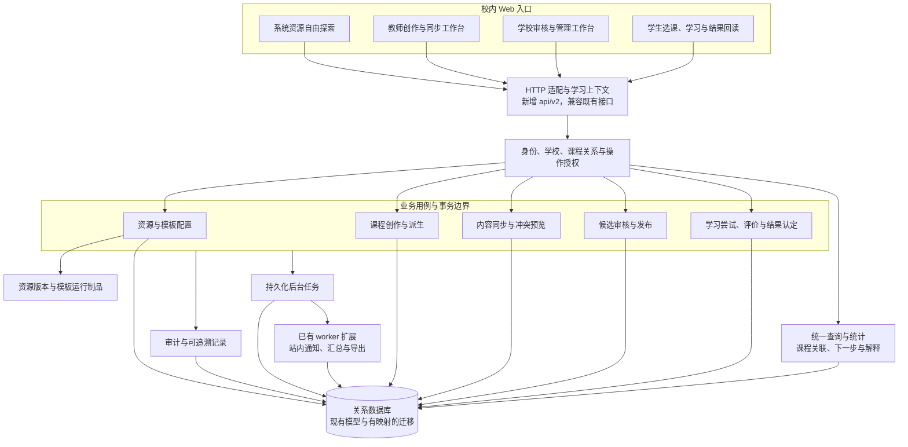

- **职责**：HTTP 层只做请求/响应适配；业务用例拥有事务；查询不产生第二套完成真值；后台任务处理已持久化的后续工作。
- **数据来源**：现有认证、学校、课程、发布、证据与任务模型，加上经过迁移的新版本/谱系关系；前端不自行声明身份或“已审核”。
- **关键约束**：单校使用；系统资源和校本课程具有不同访问边界；业务写入与审计、任务入队保持一致；外部投递不因新站内任务而开启。
- **迁移位置**：`backend/app/api/` 保留适配，`backend/app/services/` 按领域整理，`backend/app/models/` 与 `backend/alembic/` 维护真实映射；原生 Web 页面继续经现有注册和生命周期接入。详见 [02 第 2.9—2.11 节](02-更新规划.md#29-目标接口与兼容方式)。

### 13.2 系统资源、模板与课程分叉关系

第二组图区分系统原件、模板、来源和使用实例。实体及字段是目标概念关系，不是本次新增的数据库表。

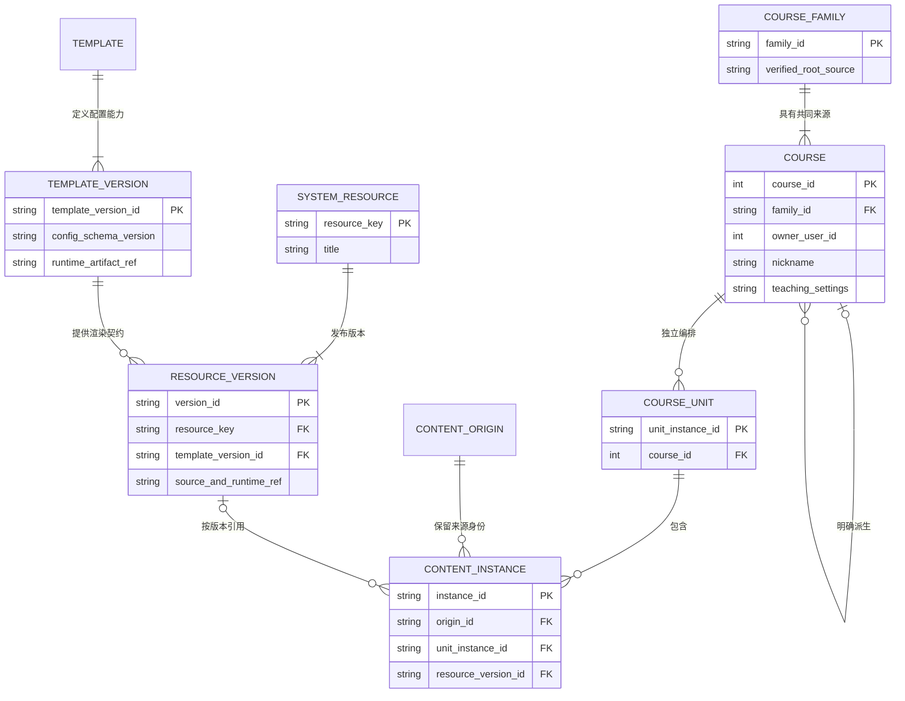

**高一版与高二版**是同一家族中的两个课程对象，有不同课程 ID、昵称、设置、名单和发布历史；**高一版修订 1、修订 2**属于同一课程的内部修订。两者不能共用一个“版本号”字段或依靠学科名区分。

- **职责**：资源版本保存原件与运行依据，模板定义允许修改的能力，分叉保存教学安排，实例表示某处具体使用。
- **数据来源**：受控的资源取用与派生操作；来源身份由服务端建立。纯文字块不要求引用运行资源，但仍有自己的实例与来源身份。
- **关键约束**：同一资源可以出现多次，实例和学习结果独立；取用不复制学生记录；相同标题、模板或学科不自动产生同源关系。
- **迁移位置**：以现有 `Course`、`CourseUnit`、内容块和活动目录建立映射；保留旧键作为兼容依据，不猜测旧课程家族。配置和字段定义由 [02 第 2.1—2.3 节](02-更新规划.md#21-术语身份与模型边界) 控制。

### 13.3 草稿、候选、审核项与发布数据关系

第三组图展开版本管理的保存对象：可变草稿、不可变候选、独立审核结论、发布结果和学习来源分别保存。

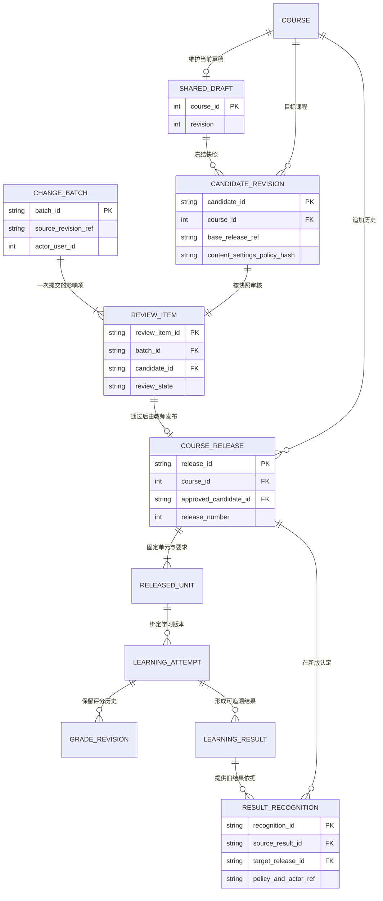

- **职责**：一个修改批次有多个审核项，每项对应一门课程的候选。审核不直接改变学生发布指针；发布只消费已通过的候选。
- **数据来源**：候选固定内容、配置、资源版本和补做策略；学习尝试绑定实际读取的发布版本；结果认定引用既有事实，不修改原事实。
- **关键约束**：审核后的草稿修改不能进入既有候选；补做和再次评分生成新记录；回滚也生成新修订。该图不把已有 `transferred` 状态重新定义为版本继承。
- **迁移位置**：在现有 `ContentDraft`、`CourseRelease`、证据投影和提交批改模型上增量建立关系，清楚记录哪些沿用、哪些新增及哪些需要历史兼容。完整规则见 [02 第 2.5—2.7 节](02-更新规划.md#25-学校审核批量操作与逐门结果)。

### 13.4 跨分叉同步与冲突判定

第四组图展示“只同步本人名下已有公共内容”的具体判断。修改预览由后端计算，预览本身不改变目标课程。

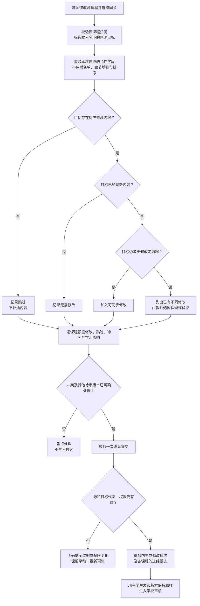

- **职责**：匹配来源、比较本次改动前值/新值/目标值、输出可理解的预览；只有确认且复验成功后才提交。
- **数据来源**：源草稿代际、目标草稿/发布基础、服务端来源映射、课程归属及当前学生事实。
- **关键约束**：高二版没有三角内容就跳过；有复数内容才比较；改名和重排不改变匹配；他人课程和无关同名课程不进入可修改目标。
- **迁移位置**：现有版本差异能力可以复用纯比较逻辑，跨分叉预览和提交由新的领域服务负责，前端不自行提交任意目标补丁。任务与案例见 [02 第 2.4 节](02-更新规划.md#24-公共内容同步与冲突处理)。

### 13.5 审核项与发布状态

第五组图以一门课程的候选为单位表示状态。管理员的“批量通过”是对选中审核项执行相同动作，不能把批次做成所有课程必须同一结论的总开关。

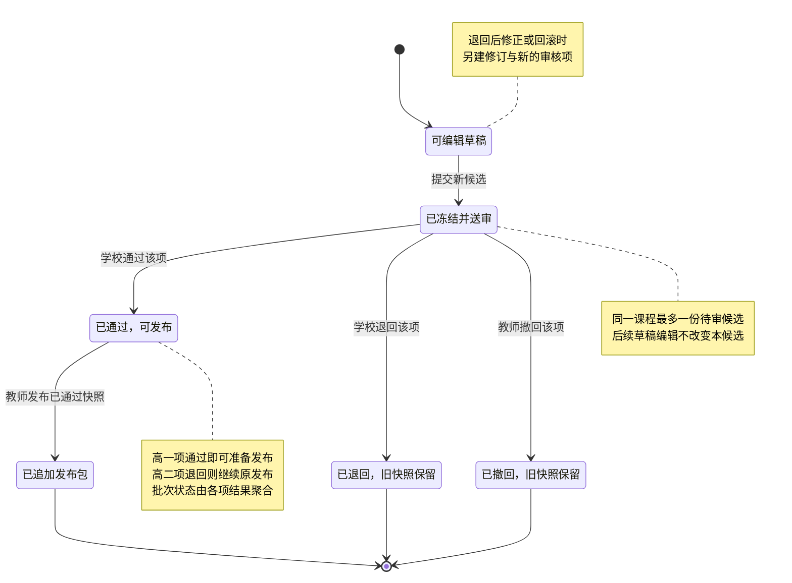

- **职责**：每项保存候选、审核人、意见与结论，批次提供来源和影响范围视图。
- **数据来源**：明确冻结的候选 ID 与摘要，不从教师当前可变草稿反推“学校审过什么”。
- **关键约束**：退回、撤回与发布后的历史均保留；再次送审是新对象。批量请求内选中操作有事务结果，各课程仍可在不同请求中独立审核和发布。
- **迁移位置**：目标审核扩展到实际课程内容、配置与结果策略，区别于当前仅审核课程资料的实现。详见 [02 第 2.5—2.6 节](02-更新规划.md#25-学校审核批量操作与逐门结果)。

### 13.6 教师提交、学校审核与发布时序

第六组图把审核与实际发布分开，并说明后台任务何时能够执行。当前未增加这些接口或任务类型。

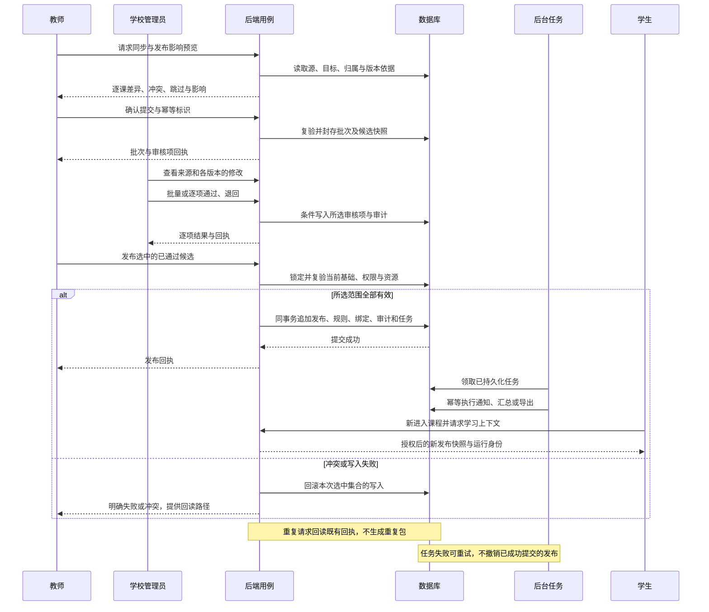

- **职责**：教师提交和发布、学校审核、后端事务与任务执行各自明确，不由页面直接拼接发布数据库状态。
- **数据来源**：已通过候选、当前发布基础、版本化资源、角色与课程关系；通知及汇总从已提交事件产生。
- **关键约束**：实际发布必须等于审核通过的快照；选中集合失败时不留下半套发布结果；旧发布接口也要经过同一检查。
- **迁移位置**：现有内容发布、审计、任务入队和 worker 能力经领域用例接线，前端消费统一回执。接口与后台任务要求见 [02 第 2.9—2.10 节](02-更新规划.md#29-目标接口与兼容方式)。

### 13.7 学生访问、版本绑定与结果认定

第七组图区分系统探索、教师预览和正式教学，并展开版本更新后的结果去向。

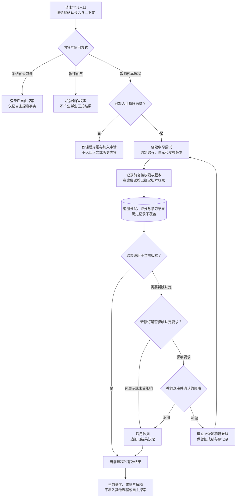

- **职责**：服务端确认学习身份与准入，尝试固定运行版本，评价和认定给出可追溯依据；当前状态从有效事实派生。
- **数据来源**：课程成员、发布包、具体单元、尝试与评分历史，以及教师确定并送审的补做/沿用策略。
- **关键约束**：校本课程未加入只能看介绍；课程更新不抹去历史；补做新建尝试；仅其他单元变化不能使本单元无故失效；撤权后停止写入。
- **迁移位置**：现有学习证据、恢复与投影通过新上下文和结果认定映射逐步接入。不能创建虚假班级承载系统探索，也不能把旧成绩批量复制到新分叉。规则和测试矩阵见 [02 第 2.7—2.8 节](02-更新规划.md#27-学习上下文成绩留档与补做)、[第 5 节验收](02-更新规划.md#5-验收与性能目标)。

本章七组图是当前目标设计的图示原件。实现改变时先核对代码，再更新当前实现章节；尚未落地部分继续标为待实现。正式任务与状态不在本章重复维护。
