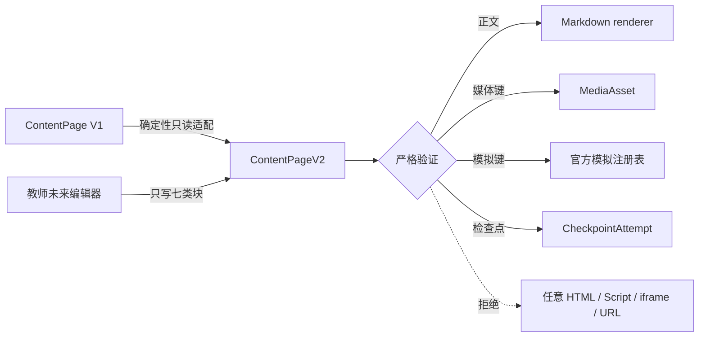

# 星序 Astra — V7.5 课程体验与教师编排设计（含 V8.1 内容块补充契约）

> 本文是 02 系列的 V7.5 历史设计子文档，负责保存当时的产品结构、课程交互、教师编排和验收边界；当前任务、版本和责任只在 [`02-更新规划.md`](../02-更新规划.md) 维护。
>
> **2026-08-25 现行覆盖规则**：本文保存历史设计，不再授权把既有实验迁入课程外壳、在实验前插入课程旅程或重写旧实验交互。当前 126 项正式活动默认冻结，机械臂收尾后形成 127 项冻结目录；现行产品层级和通用授课课程边界见父规划[第 2 节](../02-更新规划.md#2-新的产品层级与通用课程概念)。与该边界冲突时以父规划为准。
>
> **内容性质**：本文维护用户已确认并落地的 V7.5 产品契约；当前实现入口见 [`01-开发者手册.md`](../01-开发者手册.md)，逐版本完成与独立验收证据见 [`03-发布历史.md`](../03-发布历史.md)。当前课程编辑与发布计划见父规划[第 9 节](../02-更新规划.md#9-v844-课程编辑发布与学习闭环)，不得把历史目标改写为 V7.5 已完成事实。
>
> **最后一次更新时间**：2026-08-25　**更新者**：主开发

---

## 目录

1. [统一产品层级](#1-统一产品层级)
2. [代码空间课程体验](#2-代码空间课程体验)
3. [未来星系课程体验](#3-未来星系课程体验)
4. [通用课程与教师编排](#4-通用课程与教师编排)
5. [代码提交与 OJ 边界](#5-代码提交与-oj-边界)
6. [视觉、页脚与性能规则](#6-视觉页脚与性能规则)
7. [交付与验收](#7-交付与验收)
8. [V8.1 课程内容块补充契约](#8-v81-课程内容块补充契约)
9. [V8.4 通用授课课程覆盖契约](#9-v84-通用授课课程覆盖契约)

---

## 1. 统一产品层级

V7.5 不改变已经冻结的顶层关系：

```text
认证入口
└── 星序总览
    ├── 工科试验室
    ├── 代码空间
    ├── 未来星系
    └── 星序角色工作区
        ├── 学生学习工作区
        ├── 教师教学工作台
        └── 管理员全局治理台
```

每个学习单元统一使用“课程目录 → 子课程页面 → 互动活动 → 学习事件/提交 → 进度反馈”的主路径。课程目录负责发现和顺序，子课程页面只承载一个明确学习目标；不得把所有课程、实验、来源说明和管理信息铺在同一长页。

课程页面必须优先回答“学什么、做什么、观察什么、怎样判断”，不得展示对学生完成当前学习没有帮助的实现栈、沙箱名称、内部依赖、缓存策略或调试说明。技术实现仍在开发者文档记录。

## 2. 代码空间课程体验

### 2.1 目录与课程模块

代码空间总览规划为一条可扫描学习路线，首批内容至少覆盖：

| 课程群 | 子课程示例 | 主要互动 | 可观察结果 |
| --- | --- | --- | --- |
| 程序起步 | 变量、表达式、输入输出 | 改值预测、逐步执行 | 能解释值如何变化 |
| 控制流程 | 条件、循环、边界 | 分支路径点亮、循环时间轴 | 能发现遗漏分支和越界 |
| 数据与函数 | 数组、对象、函数调用 | 调用栈、作用域和数据流 | 能追踪参数与返回值 |
| 算法思维 | 排序、搜索、递归、图 | 可视化步骤、对比输入 | 能比较正确性与复杂度趋势 |
| 调试与测试 | 断点、断言、反例 | 失败用例定位、最小修复 | 能从现象定位原因 |
| 挑战与提交 | 多语言练习、综合任务 | 浏览器预检、正式提交、反馈 | 能形成可追踪学习记录 |

每个子课程采用同一可复用结构：

1. 用一个问题或可操纵现象进入概念，不先堆定义。
2. 学生修改代码或输入，立即看到执行轨迹、状态或图形反馈。
3. 提供预测—运行—解释—修正的循环，错误结果同样可观察。
4. 使用公开样例完成浏览器预检，再决定是否正式提交。
5. 记录完成、尝试、提交和反馈，不把本地运行结果伪装为权威判题。

### 2.2 页面结构

- 桌面端保持课程目录、学习舞台和运行/反馈区的清晰主次；移动端按目录—编辑—运行—反馈顺序串行，不压缩成不可读的多栏。
- 编辑器、控制台、轨迹和可视化区域按当前任务出现，不建立无意义仪表盘或装饰卡片墙。
- `JavaScript 由……执行`、`Python 由……执行`、`C/C++ 由……执行` 等实现说明从学生页面移除；运行器不可用时只显示面向操作的状态和恢复建议。

### 2.3 V7.5.4 已实现契约

- `/codevis/#catalog` 成为默认学习入口，6 个课程群各包含 3 个稳定活动；`#lesson?activity=...` 只解释当前目标，`#challenge?activity=...` 固定执行预测、运行、追踪、修正和公开预检，并可在刷新后恢复所选活动。旧 `#trace` 仅作兼容工具，不再承担课程主路径。
- `CvCourseManifest` 使用 `code-space`、稳定 `course_key/activity_key` 和四语言 canonical 标识。`CvCourseStateAdapter` 消费 BE-004 的 `GET /api/courses/{course_id}/units?class_id=...`，权威响应中缺失活动按 hidden，失败或不合法响应按 unavailable；V7.5.7 的 `CvStudentContext` 已从 Cookie Session、本人班级和课程建立明确内存映射，单班级自动选定，多班级歧义失败关闭。
- 浏览器运行只用于可观察学习反馈，不会把公开样例结果写成 accepted。V7.5.7 的 `CvSubmissionAdapter` 已按稳定活动解析权威题目并提交源码，幂等冲突、课程撤回和 runner 不可用显示真实状态；JS/Python/C/C++ 学习运行时均为固定本地资产，C/C++ 在独立 Worker 中运行，主线程 4.2 秒终止无响应执行。
- 代码空间页脚采用工科试验室的三段信息骨架、列对齐和移动折叠顺序，但保持代码空间品牌与文案；学生可见页面不出现解释器、依赖或沙箱实现说明。

## 3. 未来星系课程体验

### 3.1 目录与子课程

未来星系总览只承担课程发现和方向关系，不继续把六个方向的全部内容纵向堆叠。首批目录保持六个方向，并为每个方向建立可独立路由和生命周期的子课程入口：

| 方向 | 首批子课程 | 互动重点 |
| --- | --- | --- |
| 地球与宇宙 | 昼夜与季节、轨道与尺度 | 可控天体模型、观察角度与时间轴 |
| 工程与系统 | 受力、结构、反馈控制 | 参数改变、约束和失效模式 |
| 数据科学与 AI | 特征、拟合、分类与偏差 | 数据拖拽、训练过程和误差比较 |
| 信息技术 | 请求链路、分层与编码 | 数据包路径、协议状态和故障注入 |
| 材料科学 | 晶胞、晶粒与性能 | 结构旋转、尺度切换和趋势判断 |
| 人文与未来 | 城市、技术伦理与情景选择 | 因果关系、权衡与多结局回看 |

### 3.2 Three.js、Canvas 与生成素材

- Three.js 只用于空间关系、尺度、旋转、视角或结构变化确实能帮助理解的课程；2D 数据、时间序列和路径优先使用 Canvas/SVG/DOM。
- 动态画面必须响应学生输入并反馈学习状态，不用持续旋转的几何体冒充课程内容。
- 重要非图标视觉可以使用 Image Gen 生成并存入项目；真实按钮、文本、表单和数据仍保持代码原生。
- 每个 WebGL 活动必须提供无 WebGL、低性能与 `prefers-reduced-motion` 降级，降级后仍能完成课程目标。
- 每个子课程离开时必须释放 animation frame、事件、ResizeObserver、Three.js geometry/material/texture/renderer 和异步资源。

### 3.3 V7.5.5 已实现契约

- `#frontier` 只承担六方向课程发现；地球与宇宙、工程、数据、信息、材料、人文各有 3 个稳定活动，共 18 个单目标子课。课程 hash 使用可读 `route_slug`，稳定 `activity_key` 只用于清单、BE-004 映射和后续学习事件，不作为前端授权来源。
- `FrontierCourseManifest` 使用 `future-galaxy` 与 6 个稳定 `course_key`。same-origin adapter 对 BE-004 响应失败关闭：权威响应缺失的已知活动为 hidden，未知活动或不合法响应令目录 unavailable；只有完全没有配置 adapter 的本地静态预览使用明确的 default-open。
- 六方向各保留一个按需 Canvas owner，把参数变化、观察证据和判断反馈连成可完成互动；首屏和目录不再预热这些 owner。生成的观测站 WebP 只作课程语境主视觉，不包含真实按钮或文本。
- “轨道与尺度”是唯一 Three.js 代表课：学生可改变轨道位置、观察方位和简化模式，太阳点光源与地球受光边界服务昼夜判断。`three@0.185.1` 以本地 ESM/core、MIT 许可证、npm integrity 和 SHA-256 清单锁定，不经 CDN 加载。
- `prefers-reduced-motion`、低性能选择或 WebGL 失败时改用 Canvas，仍保留调参、观察和提交判断。路由离开会中止异步导入、移除临时 canvas、取消 RAF、断开 Observer/事件并释放 Canvas bitmap 与全部 Three 资源。
- 未来星系课程页脚与代码空间一样沿用工科试验室的品牌列、课程/关于列、版权行和移动折叠顺序；学生可见正文不解释 Three.js、渲染器或降级实现。

### 3.4 V7.5.7 学生发布上下文

- `shared/js/frontier-publication-context.js` 在 Router 前监听权威 Session，按本人 active 班级和 `future-galaxy` 课程建立 `class_id/course_ids`，并为目录、学生工作台和直达子课配置同一 `FrontierCourseManifest` adapter；上下文只保存在内存。
- 单班级可自动选定；多班级无显式上下文、课程映射不完整、401、畸形响应或网络异常均失败关闭。新会话 generation 会中止旧请求，认证丢失会清空映射和旧课程状态。
- hidden 活动在直达路径只返回不含标题、稳定键和历史数据的通用不可用页；locked 显示“教师按班级学习节奏开放”的可解释状态但不挂载互动 owner；open 才允许 Canvas/Three 学习链。

### 3.5 V7.5.8 运行时与科学模型收束

- `frontier-learning.js` 不再由根 HTML 对所有角色静态加载，只在未来目录或子课路由经 page registry/Router 加载；非未来页面不会解析 Canvas/Three 课程运行时。
- 总览页使用内容自适应高度和纵向滚动，装饰层仍在局部边界裁剪；精确 390×844 能完整访问六条课程航线且根宽不溢出。
- “轨道与尺度”的太阳和点光源位于椭圆焦点，Canvas 降级使用相同关系；信息技术网络 Canvas 限制设备像素比，并在减少动效时停止持续 RAF，离页移除媒体查询监听。

## 4. 通用课程与教师编排

### 4.1 统一逻辑对象

后端已在 `BE-004/V7.5.3` 审计并扩展现有 `Course`、`CourseUnit`、`Assignment`、`Submission` 和 `LearningEvent`，没有复制三星系专用表。通用语义如下：

| 逻辑对象 | 职责 | 权威边界 |
| --- | --- | --- |
| 课程 | 归属星系、组织和课程目录 | 学生只能读取已分配且当前可见课程 |
| 课程分块 | 排序一组子课程或活动 | 教师可分块发布、隐藏或安排开放时间 |
| 学习活动 | 连接页面/实验/挑战与稳定活动标识 | 前端路由不是权限来源 |
| 班级发布计划 | 针对班级覆盖默认课程节奏 | 需要版本冲突、审计和权威回读 |
| 学习事件 | 记录开始、尝试、完成和反馈 | 隐藏资源历史不得泄漏给学生统计 |
| 进度聚合 | 按学生、班级、课程和分块汇总 | 原始事件为依据，聚合可重建 |

### 4.2 V7.5.3 已实现契约

- `Course.galaxy_key/course_key` 与 `CourseUnit.activity_key` 是前后端连接三星系课程、页面和互动活动的稳定键；课程键在学校+星系内唯一，活动键在课程内唯一。历史课程由 0048 确定性回填为 `englab/legacy-course-{id}` 和 `legacy-unit-{id}`。
- `CourseUnitClassPlan` 以课程挂班关系为范围保存分块排序、`hidden/locked/open`、`open_at` 和可选前置分块；`CourseClass.plan_version` 是批量更新的乐观并发令牌。PATCH 只修改请求中出现的字段，409 表示版本冲突，无变化成功返回但不递增版本。
- 有效状态按“显式隐藏/课程与单元发布状态 → 组织状态 → 手动锁定 → 计划时间 → 前置完成 → 开放”求值。学生看不到 `hidden` 分块的标题、活动键和历史统计；`locked` 分块可见稳定原因但不能写学习事件或提交；`open` 才允许进入学习写路径。
- 学生多班级同时关联同一课程时必须显式选择 `class_id`，禁止猜测班级节奏。读取路径不会自行补建缺失计划；仅挂班或创建单元的写路径建立默认开放记录，计划缺失时失败关闭。
- 教师/管理员接口为 `GET/PATCH /api/courses/{course_id}/classes/{class_id}/release-plan`；学生课程目录为 `GET /api/courses/{course_id}/units?class_id=...`；教师进度矩阵为 `GET /api/progress/courses/{course_id}/classes/{class_id}/students?limit=...&offset=...`。进度矩阵按学生输出开始、完成、提交、评分和最近活动；隐藏分块保留教师所需的结构位置，但学生历史数值归零。
- 0048 已完成 SQLite 0047→0048→0047→0048 往返、MySQL DDL 编译和条件式 schema 门禁；当前没有隔离 MySQL 运行证据，不得外推为目标数据库通过。

### 4.3 教师工作台

教师端在星序内增加统一课程编排视图，而不是为每个星系复制后台：

1. 先选择星系、班级和课程，显示当前课程结构与发布状态。
2. 可对一个或多个课程分块执行启用、隐藏、立即开放或计划开放；危险批量操作必须预览范围并权威回读。
3. 学情视图按学生显示已开放分块的开始、完成、提交、评分和最近活动，并能进入单个学生/课程明细。
4. 工科试验室与未来星系按课程分块控制实验/子课程；代码空间还显示语言、代码提交、判题、反馈和版本。
5. 管理员仍进入唯一全局治理页；教师课程编排不获得用户、审计或任意数据库治理权。

### 4.4 V7.5.7 已实现契约

- `#teacher` 的 `TEACHER_VIEWS` 为 `overview/curriculum/structure/assignments/grading`。`curriculum` 使用显式星系、班级、课程 scope，先读取 release plan，再读取分页学生进度；不为三个星系复制后台。
- 每个分块可编辑排序、`hidden/locked/open`、开放时间和前置关系。PATCH 必须携带 `expected_version`，写请求不自动重试；409 后立即以权威计划重建编辑状态，由教师重新确认。
- 代码空间 scope 另读取数据库分页的提交摘要；源码只由独立授权端点按需获取并作为转义文本展示，判题尝试和 `runner_unavailable` 与后端状态保持一致。工科试验室和未来星系不显示无意义的代码站。
- 教师视图使用线性发布计划、进度矩阵和双栏代码审阅布局；移动端按 scope、计划、进度、提交顺序单列，根页面不产生横向溢出。管理员仍可进入该教师能力页，但全局用户/组织/审计治理只留在唯一 `#admin`。

### 4.5 V7.5.8 服务端分页消费

- 学生进度和代码提交分别维护分页 offset，并消费响应中的 `limit/offset/next_offset/total`；上一页/下一页会重新请求权威 API，不再把首个固定大页误当完整集合。
- 完成度与提交过滤明确标注“本页”口径；切换星系、班级、课程或执行全量刷新会归零分页，代码翻页时清除上一页源码/判题详情，避免跨 scope 陈旧显示。

### 4.6 V7.5.9 触达与键盘契约

- 课程主操作在精确 390×844 下必须提供不小于 44×44px 的真实可点击/可聚焦区域；滑杆可保持细轨道视觉，但原生 `input[type=range]` 的命中高度不得缩成轨道高度。radio/checkbox 可使用定制外观，原生控件仍须覆盖完整标签行。
- 教师五分区使用单一 tablist 与 tabpanel：仅当前 tab 的 `tabindex=0`，其余为 `-1`；ArrowLeft/Right 和 ArrowUp/Down 循环移动并选中，Home/End 到首尾，`aria-selected`、焦点及 `aria-labelledby` 同步。
- 44px 是核心交互门槛，不要求把纯文本页脚链接或装饰图标强行改成卡片；移动品牌、身份菜单和主导航如果承担跳转或操作，同样按交互控件处理。

### 4.7 Review 分页与教师样式契约

- 教师工作台的成员、作业提交、学习事件和判题尝试读取必须使用 `/page` 接口并维护各自 `offset/next_offset`；scope、刷新或翻页会清除上一页源码和判题详情。deprecated 数组只兼容 200 项，收到 `legacy_list_limit_exceeded` 后切换服务端提供的分页 URL。
- 原 `teacher.css` 已拆为 `teacher-foundation.css`、`teacher-workbench.css`、`teacher-curriculum.css`，必须按该顺序通过角色注册表按需加载；旧单体路径不再发布。拆分保持原级联语义，不改变五分区信息架构。

## 5. 代码提交与 OJ 边界

`PM-002/V7.5.2` 已批准代码提交与判题进入 V7.5，AI 助教不在当前批准范围。领域契约保持 provider-neutral；任何真实外部 runner 默认关闭并须另行配置与验收。判题分为两个层次：

- **浏览器预检**：复用现有多语言运行时运行公开样例，提供即时学习反馈；结果不具备权威性。
- **权威判题**：保存题目版本、源码、语言、提交者、班级/课程、判题状态、用例摘要、资源统计和反馈。执行必须通过隔离 runner adapter，禁止 API 进程直接 `eval`、shell 或宿主文件系统执行学生源码。

首版 runner 至少约束语言 allowlist、CPU/墙钟时间、内存、输出、进程数、网络和文件系统；不可用、超时、编译失败、运行错误、部分通过和全部通过必须是不同状态。若当前工作区无法提供可靠隔离，仍应先交付可用的提交、排队、教师查看和“runner 不可用”闭环，不得用客户端结果伪造服务端通过。

适配器可参考 [Judge0 官方 Submissions API](https://docs.judge0.com/products/judge0/http_api/submissions/) 的异步提交/状态轮询语义，但领域模型、幂等键、授权、审计和失败状态不得绑定单一 provider；本周期不要求启用任何外部服务。

### 5.1 V7.5.6 已实现契约

- Alembic 0049 建立 `CodeProblem`、`CodeProblemVersion`、`CodeSubmission`、`CodeJudgeAttempt`。题目一对一绑定课程单元及稳定 activity；每个版本不可变保存题面、私有测试规格、语言白名单、资源策略和规格 SHA-256；每次提交冻结题目与资源策略快照。
- 教师/管理员在课程编辑权限内建题和追加版本；学生通过 course/activity/class 稳定范围发现题目，只能在 BE-004 effective state=open 时提交。hidden 或课程/单元撤回发布后，题目、提交列表和明细对学生失败关闭；locked 只允许读取本人既有历史，不允许新提交。班级教师与管理员仍可在授权范围读取历史源码。
- canonical 语言为 JavaScript、Python、C、C++；题目版本限制源码、输入、预期输出、CPU、墙钟、内存、结果输出和进程数量，并固定 `network_enabled=false/filesystem_mode=none`。学生+题目版本+班级构成幂等范围：同内容重放恢复同一提交，不同内容返回 409。
- 状态区分 queued、runner_unavailable、running、accepted、wrong_answer/partial、compile/runtime/time/memory/output limit、internal_error 与 cancelled。判题尝试使用原子 claim、owner/token/expiry 租约、过期重排和 guarded 终态写回，避免重复 worker 同时完成同一尝试。
- 默认 `DisabledCodeRunnerAdapter` 没有 execute/dispatch/provider 方法，只报告 unavailable；API 服务与端点不导入 evaluator、subprocess、shell、动态求值或 outbound HTTP client。当前提交会诚实保存为 `runner_unavailable`，真实 runner 仍须在 API 进程外另行配置、隔离和验收。
- 学生、班级教师和管理员的提交查询在数据库层分页；响应摘要不返回源码，源码只由单独授权端点返回。审计记录题目/版本/提交范围、语言、哈希和状态，不记录学生源码、stdin 或私有测试正文。

### 5.2 Review 并发与恢复加固

- 学习事件、普通作业提交和代码提交在同一数据库事务中锁定并复核课程挂班、发布计划和活动状态，教师把分块从 open 改为 locked/hidden 后，尚未提交的学生写入不得穿透旧检查结果。
- 同一作业存在多个 eligible class 时，学生提交历史必须显式传 `class_id`；省略返回 422，不猜测第一个班级。
- Alembic 0050 为 `code_judge_attempts(status, lease_expires_at, id)` 增加复合索引；过期 running 租约按过期时间与 ID 排序，每批最多恢复 100 项。该索引和批次只改善积压恢复，不启用真实 runner，也不改变 `runner_unavailable` 语义。

## 6. 视觉、页脚与性能规则

### 6.1 视觉与内容

- 代码空间和未来星系分别建立清晰但同属星序的视觉语言；避免默认大圆角矩形阵列、重复说明块和无信息量装饰。
- 完整页面在编码前生成桌面和移动概念；概念必须覆盖总览、课程目录、子课程/互动状态和页脚，而不是只有首屏 hero。
- 图标遵循现有线性语言；非图标主视觉可用生成素材、Canvas 或 Three.js，但不得妨碍文字、焦点和触控。

### 6.2 统一页脚

代码空间和未来星系课程页脚沿用工科试验室的结构：品牌/定位、课程与支持入口、版本/版权或必要状态位使用一致的列关系、对齐、间距、字阶和移动折叠顺序。文案可以按星系替换，但禁止出现不同主题、不同对齐或内部实现说明。

### 6.3 性能与降级

- 首屏只加载当前路由所需脚本、样式和高优先级素材；Three.js 与大型运行时延迟到明确课程入口。
- 生成图片使用稳定尺寸、现代格式和可回退资源；不得提交未使用的大图或临时概念截图。
- 页面切换必须清理 Canvas/WebGL/worker/observer/listener/timer；Service Worker 不缓存角色私有资源、API 或学生代码。
- 9001 继续是本机验收唯一端口，代码空间、未来星系、教师端与 `/api` 必须同源可达。
- V7.5.8 将两张未来背景从 3,762,137 字节 PNG 收束为总计 136,676 字节 WebP（约减少 96.4%），并移出全局 APP_SHELL；本机预览显式返回 `image/webp`。当前 review 将主壳、注册表、Router、main、Service Worker 与教师三层资源推进为 `20260719v75ReviewTeacherLayersP0`；代码空间入口仍为 `759r1`，避免样式分层与旧单体 CSS 跨代混用。

## 7. 交付与验收

每个写入组先在隔离 worktree 完成概念、实现、范围测试和结构化交付，再由主开发发放唯一小版本并集成。QA-010 从冻结提交独立验证以下结果：

1. 三个学习单元与星序角色工作区层级不回退。
2. 代码空间和未来星系均可从课程目录进入子课程并完成至少一条真实互动链。
3. 教师可按班级控制课程分块节奏并查看学生进度；学生不能读取隐藏/未开放资源。
4. 代码提交、判题状态和教师查看可追踪，runner 失败不会伪造成功或泄漏宿主资源。
5. 两个星系页脚与工科试验室结构一致，说明性实现文案已移除。
6. 桌面和精确 390×844 的页面身份、内容、焦点、触控、console/pageerror、错误层和根溢出通过。
7. 无 WebGL、减少动效、runner 不可用、空课程、无提交和接口冲突均有可完成的降级状态。
8. 前后端全量、依赖锁、文档/项目对接、Git 范围和 9001 重复启动/停止门禁通过。

QA-010 已完成 V7.5 终验；review `re1`—`re15` 随后完成增量审查，并由 QA-011 对 `e8768949f7787fa7cba43d0e92c7b8804c12f631` 独立终验 PASS，P0—P3 均为 0。最终文档已同步，代码空间、未来星系、课程平台和 QA 长期组均已归档，三个登记 Git worktree 已注销；真实 MySQL、隔离 runner、staging 与公网 R6 仍按既定边界后置。

## 8. V8.1 课程内容块补充契约

本节是 `CONTENT-010 / V8.1.2` 对 V7.5 课程体验的增量约束，不改写上述历史事实。实现位于 `backend/app/schemas/content_v2.py`，只增加 V2 schema、验证器和确定性 V1 读取适配器；不建表、不增加接口、不替换现有 V1 发布或渲染链。

### 8.1 七类受约束内容块

| 内容块 | 面向学生的职责 | 必要身份或内容 | 明确拒绝 |
| --- | --- | --- | --- |
| `hero` | 说明本页主题与学习语境 | `blockId`、标题、摘要 | 任意扩展字段 |
| `learning-task` | 说明要完成的任务、步骤和学习结果 | 提示、结果、步骤、概念 | 空提示、无界数组 |
| `rich-text` | 承载权威课程正文 | canonical Markdown | raw HTML、危险 URL scheme、派生 HTML 回写 |
| `media` | 引用已登记的图、音视频或文档 | `assetKey`、媒体类型；图片和图示必须有替代文本 | 任意远程 URL、内联二进制、无替代文本的图像 |
| `official-simulation` | 挂接平台认可的互动实验 | `simulationKey`、操作说明 | 未登记模拟、`scriptPath`、iframe 或脚本配置 |
| `checkpoint` | 表达内嵌检查题或兼容旧题组引用 | `checkpointKey`、题面、答案合同或 `questionSetKey` | 无答案、答案不属于选项、模式混用 |
| `sources` | 说明课程引用和用途 | 稳定 `sourceId`、标签、HTTP(S) 地址 | 重复身份、危险协议和含凭据 URL |

`ContentPageV2` 的所有对象均使用 `extra=forbid`。因此，调用方不能借 `props`、`html`、`scriptPath`、`scriptSandbox` 或临时字段扩张执行能力。单页仍维持 256 KiB、10,000 节点、16 层嵌套和有界数组/字符串预算；块、检查点和来源身份在页内大小写不敏感唯一。



上图中的 `MediaAsset` 与 `CheckpointAttempt` 仍由后续 `DATA-008/BE-022` 建立持久化和接口；本版本只冻结页面怎样表达它们，不能把尚未落地的对象写成已发布能力。

### 8.2 检查点的两个合法模式

- `inline` 用于 V2 原生形成性检查。单选必须恰有一个正确选项，多选必须至少有一个且全部指向已声明选项，数值题必须提供答案并可给非负容差，简答题必须提供至少一个可接受答案。
- `question-set` 只服务旧 V1 `assessment` 的兼容读取。它只保存 `questionSetKey`，不得同时携带内嵌选项、答案、数值容差或简答答案。

本 schema 保存的是教师创作与不可变发布包所需的完整内容合同。未来学生公开 DTO 必须由 service 剥离正确答案，不能把本 schema 直接原样返回给学生；该接口分离由 `BE-022` 落实。

### 8.3 V1 确定性读取适配

旧 `ContentPage` 与五类 section 继续原样可读，不原地改写历史 `ContentPageVersion`。`adapt_content_page_v1` 按以下规则产生 V2 视图：

1. `hero` 和 `learning-task` 保留稳定 section ID、标题、摘要及已知教学列表；
2. `experimentId` 组合为 `{subject}.{experimentId}`，且必须命中官方模拟白名单；旧 `props` 中的脚本路径、沙箱、initializer 和任意配置全部丢弃；
3. `assessment` 转为只读 `question-set` 检查点，不伪造题目答案；
4. `source-list` 使用页面顶层来源生成 `sources`，缺少稳定来源 ID 时按原顺序生成确定性 legacy ID；
5. 相同 V1 输入必须产生字节语义一致的 V2 JSON；未登记模拟或危险来源失败关闭。

V8.1.2 的初始官方模拟白名单只包含当前唯一后端发布样例 `physics.energy-conservation`。其余 123 个官方活动不在本任务中手工复制；V8.2.0 `TOOLS-003` 建立官方课程清单编译器后，由唯一清单扩展模拟键，避免长期维护前后端两份漂移名单。

### 8.4 验证与后续边界

- `backend/tests/test_content_schema_v2.py` 为七类块各提供正向覆盖和负向样例，并验证未知块、脚本字段、raw HTML、危险来源、重复身份、未登记模拟和错误检查点失败。
- 同一测试验证机械能守恒 V1 页面两次适配结果一致，且序列化结果不包含 `scriptPath`、`scriptSandbox` 或旧脚本地址。
- `CONTENT-010` 完成后，`DATA-008` 才能按 [`24-V7.6全栈模块边界契约.md`](24-V7.6全栈模块边界契约.md) 建表；任何数据库字段、公开 endpoint 或页面渲染变更均不属于本任务。

## 9. V8.4 通用授课课程覆盖契约

本节只补充 V8.4 的目标边界，不改写第 1—8 节保存的历史事实。任务、版本和状态仍以父规划为唯一原件。

### 9.1 课程不是内容等级

工科试验室、代码空间和未来星系共同提供活动目录。教师建立的 `Course` 是一次真实授课实例，不是把目录中的某个活动改名为课程，也不再区分精品课、代表课和普通课。

课程的 `galaxy_key` 与 `subject_key` 只用于默认筛选。教师可以从全部正式活动中引用稳定 `activity_key`，但不能修改或包裹原实验页面。

### 9.2 课程信息与知识内容

课程信息由管理员审核，包含名称、共同教师、学年、时间、课时、分类和准入方式。章节、七类内容块、实验选择、顺序、检查点、作业和完成规则属于知识内容，由课程教师共同维护，不经过管理员逐项审批。

已经通过审核的课程信息继续生效；后续修改通过新的 `CourseInformationRevision` 申请。共享内容草稿由 `Course`、`CourseUnit` 与 `ContentDraft` 共同组成，发布后生成新的不可变 `CourseRelease`。

### 9.3 结构化编辑器

V8.4 编辑器继续复用第 8 节的七类受约束内容块，只提供章节、顺序、活动选择、预览、保存和发布。它不提供自由网页拖拽、任意 HTML、JavaScript、iframe、脚本地址或实验 DOM 注入。

任何有效 `CourseCollaborator` 都能编辑同一共享草稿并显式发布。并发保存必须比较草稿 revision；旧 revision 返回冲突，不静默覆盖其他教师的修改。

### 9.4 当前迁移边界

目标类图、发布时序和完成预设只在父规划 P-03、P-04、P-09、P-10 维护。对应模块通过验收后，修正后的当前态图迁入 1 号文档；本文继续保留历史契约和必要补充，不复制任务状态。
