# 星序 Astra — V7.6—V8.4 全栈模块边界与内容平台契约

> 该文档隶属于[02-更新规划.md](../02-更新规划.md)，负责 `ARCH-001` 的前后端模块职责、`ARCH-003` 的 LearningActivity 冻结/遗留候选处置、`ARCH-004` 的统一活动内核、`ARCH-005` 的双游标与不可变 snapshot sidecar、`ARCH-009` 的 V8.1 内容平台分层合同，以及 V8.4 通用课程的兼容修正；正式任务状态、版本和认领仍只在父文档维护。
>
> **内容性质**：本文描述 V7.6 架构契约和已建立的仓库门禁。当前稳定实现见 [`01-开发者手册.md`](../01-开发者手册.md)，后端现状见 [`07-后端优化与设计.md`](../07-后端优化与设计.md)，提交事实见 [`03-发布历史.md`](../03-发布历史.md)。
>
> **2026-08-25 现行覆盖规则**：`ARCH-009` 只保留为内容与发布的后端候选，不授权迁移、重排或包裹当前 126 项正式活动。V8.4 使用隐藏课程群组兼容既有 class scope，行政班不再承担课程成员真值；课程发布后自动成为课程成员当前版本。与此冲突的班级固定版本目标停止执行，以父规划为准。
>
> **最后一次更新时间**：2026-08-25　**更新者**：主开发

---

## 目录

1. [架构结论](#1-架构结论)
2. [依赖方向](#2-依赖方向)
3. [后端模块边界](#3-后端模块边界)
4. [前端模块边界](#4-前端模块边界)
5. [稳定接口](#5-稳定接口)
6. [遗留冻结面](#6-遗留冻结面)
7. [自动门禁](#7-自动门禁)
8. [迁移与协作](#8-迁移与协作)
9. [验收与维护](#9-验收与维护)
10. [ARCH-003 冻结基线](#10-arch-003-冻结基线)
11. [现状架构](#11-现状架构)
12. [目标模块架构与迁移分层](#12-目标模块架构与迁移分层)
13. [LearningActivity 最小契约](#13-learningactivity-最小契约)
14. [跨组端口与第一波禁区](#14-跨组端口与第一波禁区)
15. [遗留候选处置矩阵](#15-遗留候选处置矩阵)
16. [V8 机器门禁与验收](#16-v8-机器门禁与验收)
17. [ARCH-004 统一活动内核与恢复契约](#17-arch-004-统一活动内核与恢复契约)
18. [ARCH-005 双游标与不可变 snapshot sidecar 合同](#18-arch-005-双游标与不可变-snapshot-sidecar-合同)
19. [ARCH-009 V8.1 内容、发布与班级实例分层](#19-arch-009-v81-内容发布与班级实例分层)
20. [ARCH-010 V8.4 通用课程与动态发布修正](#20-arch-010-v84-通用课程与动态发布修正)

---

## 1. 架构结论

V7.6 不以一次性重写前后端为目标。ARCH-001 先建立“新功能必须进入明确责任模块、跨域只能通过稳定接口、遗留巨型文件只减不增”的硬边界，再让 BE-006 和 FE-012 在该边界内实现权威学习证据。

冻结原则：

1. HTTP 路由只处理请求/响应、身份依赖和错误映射；领域规则进入服务层。
2. 持久化模型不依赖 schema、service 或 API；schema 不依赖 model、service 或 API。
3. 跨领域调用只通过服务接口或不可变 DTO，不从一个 endpoint 导入另一个 endpoint 的业务实现。
4. 页面 owner 不直接实现学习证据写入、重试、离线队列或完成算法；三星系通过共享客户端消费同一服务端合同。
5. Router、主入口、角色巨型脚本和旧学习事件文件进入冻结面；新逻辑建立新模块，迁移后删除旧逻辑。
6. 产品能力名称和可用状态只有一个注册表；页面不能独立发明“已可用”声明。
7. 架构例外必须由主开发修改机器可读边界清单并说明迁移原因，工作组不得为通过测试自行扩大 allowlist。

## 2. 依赖方向

### 2.1 总体方向

```text
浏览器页面 owner
    ↓
共享领域客户端 / 产品能力注册表
    ↓
AstraApiClient
    ↓
FastAPI endpoint（HTTP 适配）
    ↓
领域 service / policy / projection
    ↓
SQLAlchemy model / database
```

反向依赖一律禁止。数据库模型不知道 HTTP，领域服务不知道页面，页面不知道表结构。

### 2.2 领域关系

```text
身份会话 ──> 组织范围 ──> 课程与发布
                         ├──> 学习证据 ──> 进度/续学投影
                         ├──> 作业与普通提交 ──┐
                         └──> 代码提交/判题 ───┴──> 学习证据事实引用

内容创作 ──> 版本化课程/完成规则
治理模块 ──> 各领域的只读摘要与受约束命令
```

学习证据可以引用提交或判题事实，但不得复制判题状态机；提交/判题可以通知学习证据服务，但不得直接写学习事件表。

## 3. 后端模块边界

### 3.1 技术分层

| 层 | 允许职责 | 禁止职责 |
| --- | --- | --- |
| `app/api/endpoints/` | 参数、身份依赖、调用服务、HTTP 状态和 response model | SQL 查询、完成规则、幂等算法、跨域聚合 |
| `app/schemas/` | 请求/响应 DTO、字段校验和稳定枚举 | ORM、数据库查询、服务调用 |
| `app/services/` | 领域规则、权限策略、事务、幂等、投影和跨域服务接口 | 导入 endpoint、构造前端文案 |
| `app/models/` | 表、索引、唯一约束和持久化关系 | 导入 API/schema/service、业务流程 |
| `app/api/router.py` | 导入 router 并登记 prefix/tag | 任何领域逻辑 |
| `app/main.py` | 应用工厂、中间件和进程生命周期 | 课程、学习、提交或治理业务 |

### 3.2 BE-006 新模块

后端组必须优先建立以下独立边界；可以按实际模型拆成更细文件，但不得回填进旧巨型文件：

| 建议位置 | 唯一职责 |
| --- | --- |
| `backend/app/models/learning_evidence.py` | 完成规则版本、学习事件、幂等键、纠正关系、历史访问权益和投影游标 |
| `backend/app/schemas/learning_evidence.py` | 事件批次、确认、规则、活动状态、续学和教师纠正 DTO |
| `backend/app/services/learning_evidence.py` | 写入验证、权限、幂等、乱序、规则绑定和追加式纠正 |
| `backend/app/services/learning_evidence_projection.py` | 学生活动状态、上次位置、教师聚合和重建 |
| `backend/app/api/endpoints/learning_evidence.py` | 新合同 HTTP 适配，不直接导入 ORM model |
| `backend/tests/test_learning_evidence*.py` | 幂等、乱序、重放、发布状态、角色、纠正、恢复和投影一致性 |

旧 `/api/learning-events`、`progress.py` 和课程矩阵在 V7.6 内作为兼容读取保留，不继续扩展为新合同。新投影稳定后再把兼容端点改为调用新服务；任何双写必须有失败原子性和移除日期，禁止长期存在两套完成算法。

## 4. 前端模块边界

### 4.1 技术分层

| 层 | 允许职责 | 禁止职责 |
| --- | --- | --- |
| `AstraApplicationSession` | Cookie 会话、当前用户、角色资源门禁 | 学习完成和课程推荐 |
| `AstraPageRegistry` / Router | 页面身份、资源、enter/leave 和导航 | 业务 API、课程状态和离线队列 |
| 页面 owner | 渲染、交互、焦点和生命周期 | 直接决定权威完成、复制网络/重试算法 |
| `AstraLearningEvidenceClient` | 唯一学习证据 API、批次确认、状态回读 | 页面布局和课程专属动画 |
| `AstraLearningEvidenceQueue` | IndexedDB 队列、重试、租约、对账和清理 | 使用 localStorage 保存敏感学习事实 |
| `AstraRoleHomeClient` | 按角色聚合首页任务、作用域问题、续学和工作区行动 | 静默选择第一班级/课程、运维队列或页面布局 |
| `AstraProductCapabilities` | 能力名称、角色、四态、规范路由和声明边界 | 权限判断或动态业务聚合 |
| `AstraApiClient` | Cookie 同源请求、超时/取消、错误归一和未知结果 | 学习领域规则 |

### 4.2 三星系适配

工科试验室、代码空间和未来星系只把用户动作转换为稳定的领域命令：

```text
activity_key + rule_version + event_type + evidence + occurred_at + client_event_id
```

页面不得提交 `completed=true` 让服务端照单全收。服务端根据规则和既有事件派生完成状态；客户端只展示确认后的投影与本地待同步差异。

每个页面 owner 离开时必须取消观察器、请求和渲染循环，但未同步队列属于账号级共享模块，不能随页面销毁而丢失。

`AstraRoleHomeClient` 只能聚合身份/作用域、角色任务和 `AstraLearningEvidenceClient` 返回的续学投影；它不能另建进度状态机、直连学习证据 API 或把第一个班级/课程静默当成当前作用域。未同步提示组件是无状态展示层，同步、重试、租约和对账仍分别归 evidence client/queue。

## 5. 稳定接口

### 5.1 产品能力

[`shared/js/product-capabilities.js`](../../shared/js/product-capabilities.js) 提供不可变 `AstraProductCapabilities`：

- `all()`：返回能力快照；
- `get(key)`：按稳定键读取；
- `forRole(role)`：读取角色可见能力；
- `canPresentAsPrimary(key)`：只有 `available` 且存在规范路由时为真。

该注册表只表述产品能力，不替代后端权限。FE-012 接入页面前必须由能力合同和真实 API 状态共同决定文案；`partial/planned/unavailable` 不能被主行动按钮包装成可用。

### 5.2 学习证据服务端最小语义

ARCH-001 只冻结跨层语义，不替 BE-006 决定最终 URL 或数据库列名：

1. 客户端提供稳定 `client_event_id`、活动键、规则版本、发生时间和事件载荷。
2. 服务端返回每项 `accepted/duplicate/rejected/conflict` 结果及权威事件 ID。
3. 同一用户/设备重放相同 `client_event_id` 必须返回同一事实，不新增计数。
4. 旧规则、未来时间、隐藏/锁定/归档资源、跨角色/跨班级和不合法状态转换必须显式拒绝。
5. 活动状态和上次位置由服务端投影回读；离线客户端不得自行合并成权威完成。
6. 教师纠正是新的追加式事实，保留原事件和操作者/原因；禁止 UPDATE/DELETE 擦除学习历史。
7. 学习者事件使用 `started/predicted/attempted/corrected/explained`；实验“操作”编码为 `attempted.evidence`，不再创建含义重叠的 `operated` 事件。`completed/transferred` 只能由规则服务或受信评测产生。学习者的“修正了答案”与教师行政纠错是两个模型，禁止共用一个含糊事件。
8. 规则版本由课程 owner、具备 `assessment_editor` 权限的协作者或管理员创建；激活必须经过 course edit scope、当前版本 CAS 和审计。班级发布计划固定所用规则版本，已激活版本不可原地修改。
9. `transferred` 只表示学生完成了与原情境不同的教学迁移任务，不能用于数据库迁移或兼容授权。历史 `complete` 不自动升级为新规则下的完成；如需避免升级后重新锁住已访问内容，只能在独立兼容表追加 `legacy_access_entitlement`，记录 subject、class、prerequisite unit、旧事件来源、迁移 revision 和创建时间。该权益只影响访问/先修门禁，不进入学习证据、完成率、教师掌握判断或 `transferred` 统计；界面至多表述“按旧记录保留访问”。
10. 资源后来 hidden/locked/archived 时，新的事件仍拒绝；同一已认证 subject 对自己已成功事件的精确幂等重放只返回最小回执，不返回标题、内容或其他资源元数据，不新增写入。账号、subject 或 actor 不匹配仍拒绝。

### 5.3 离线与投影时限

`AstraLearningEvidenceQueue` 是唯一获准的短期浏览器持久化例外，但它不是权威账本：

1. 只能使用 IndexedDB；禁止 localStorage、sessionStorage、Service Worker Background Sync 或公共 CacheStorage。
2. 以 origin + 当前账号的不可逆命名空间隔离，退出、401、账号/角色变化时立即清除；最长保留 7 天、256 个事件或 1 MiB，任一上限先到即停止新增并提示联网。
3. 只保存重放所需的稳定键、规则版本、事件类型、时间、规范化的有界结构化证据和请求哈希；结构化 `explained` 证据可排队，自由文本解释必须联网。禁止保存姓名、账号、Cookie/token、成绩、教师评语、源码、完整答案或页面快照。
4. UI 必须区分“本地待同步、同步中、已确认、需人工处理”；模糊失败先按 `client_event_id` 对账，不能盲目生成新键。
5. 服务端同一事务提交事件与活动投影，提交后读必须立即可见；在线教师页面在本机验收环境中最多 5 秒显示权威变化。该 5 秒是 QA-014 的产品可见性门禁，不替代数据库一致性断言。

具体 schema、迁移和状态机由后端组在 BE-006 交付说明中冻结，前端只消费该合同。

## 6. 遗留冻结面

[`tools/architecture/v76-module-boundaries.json`](../../tools/architecture/v76-module-boundaries.json) 固定 V7.6 起点。以下文件进入只减不增门禁：

- `index.html`、`shared/js/main.js`、`shared/js/router.js`；
- 学生、教师和管理员巨型脚本；
- `backend/app/main.py`；
- 旧课程模型/schema、学习事件、进度、知识、课程和发布计划巨型文件。

行数门禁不是“行数越少架构越好”的替代品，而是阻止工作组把新跨域逻辑继续塞回遗留文件。需要修改兼容接线时，应先抽取等量或更多旧职责，或由主开发审查并更新架构决策。

现有 endpoint 直接导入 ORM model、service 反向导入 endpoint、endpoint 之间互相导入和多处资源版本常量被登记为遗留例外。门禁冻结其精确集合：

- 允许逐步删除；
- 禁止增加新文件、新 import block 或新版本表；
- 任何例外变化必须由主开发更新清单并写入 03，不能由实现组静默放宽。

## 7. 自动门禁

[`tools/tests/architecture-boundary-contract.cjs`](../../tools/tests/architecture-boundary-contract.cjs) 自动验证：

1. 遗留巨型文件不超过冻结行数。
2. 新 endpoint 不通过绝对、子模块或相对导入直接依赖 ORM model；既有 endpoint/model import block 不静默扩大。
3. model/schema/service 不通过绝对或相对导入反向依赖 API，endpoint 不导入 peer endpoint；既有跨层例外不增加。
4. `.js/.mjs/.cjs` 中的学习证据 API 字面量只允许出现在共享 learning-evidence client。
5. `AstraRoleHomeClient`、`AstraLearningEvidenceClient`、`AstraLearningEvidenceQueue` 和 `AstraProductCapabilities` 各有唯一全局 owner；直接赋值、逻辑赋值、属性描述符、`Object.assign` 与 `Reflect` 注册均视为定义。
6. `LearningProgress.markVisited` 不增加调用者。
7. 不新增资源版本常量表。
8. 产品能力注册表的完整键/状态集合必须与机器清单精确一致，证据来源和禁止声明完整且不可变；“账号级上次学习位置”在 BE-006/FE-012 交付前固定为 `planned`。
9. 正向扫描器带有仓库内无副作用反例，能识别绝对/相对 endpoint→ORM、service→API、endpoint→peer endpoint、`.js/.mjs/.cjs` 页面直连学习证据 API、直接/间接重复全局 owner 和新增版本表。

该门禁由 `npm test` 自动发现执行。BE/FE 提交前必须在自己的 worktree 运行；测试失败时应移动职责或报告架构冲突，不得删除断言、扩大 allowlist 或把文件改名规避扫描。

## 8. 迁移与协作

### 8.1 V7.6 顺序

1. 主开发提交 ARCH-001 边界和门禁。
2. 主开发把精确 revision 同步到后端、前端和 QA 工作组。
3. 后端组基于新模块完成 BE-006；只在新服务合同通过后冻结 URL/schema。
4. 前端组在后端冻结后实现共享客户端、队列、星序首页和三星系适配。
5. 主开发逐组集成，解决跨组冲突；实现组不得互相合并。
6. QA 在精确集成 revision 上只读验收。

### 8.2 非重叠责任

| 工作 | 唯一主责 | 其他组 |
| --- | --- | --- |
| 产品能力与入口口径 | 主开发/PM | FE 消费，QA 对账 |
| 架构清单与 allowlist | 主开发/ARCH | BE/FE 只能报告冲突 |
| 服务端事件、规则、投影与迁移 | 后端组/BE-006 | FE 不实现替代算法 |
| 客户端、队列、首页与三星系接入 | 前端组/FE-012 | BE 不修改页面 |
| 最终证据与缺陷分级 | QA/QA-014 | 失败退回唯一原组 |

## 9. 验收与维护

ARCH-001 的首片在以下条件满足时可以完成：

1. 本文、机器可读边界清单、能力注册表和自动合同相互一致。
2. `npm test` 能拒绝新增 endpoint→model、底层→API、页面直连学习证据 API、重复全局 owner、访问进度新调用者、资源版本表和冻结文件增长。
3. 现有前端合同、文档和项目对接门禁继续通过。
4. 后端/前端工作组分别确认其 BE-006/FE-012 方案可以落在登记边界中；有冲突时先由主开发修订架构，不让工作组各自绕过。
5. QA-014 把架构反例注入纳入最终矩阵。

维护规则：

- 新领域先在 02 建立任务，再由 ARCH 登记 owner、依赖和门禁。
- 删除遗留例外时同步收紧清单；禁止保留已经不需要的 allowlist。
- 如果路径移动，必须同次更新本文、机器清单、测试、01/07/08 和引用。
- ARCH-001 只关闭边界首片；V7.9 的 FE-016、BE-010 和 TOOLS-001 继续负责完成全量拆分、legacy 清零和依赖工具化。

## 10. ARCH-003 冻结基线

本节是 `ARCH-003` / `V8.0.0` 的专业契约，不改变 02 中的任务状态。盘点基线固定为 `aec0587f643190e2c435ff88945d4f9066dd5316`（V7.9.73），ARCH 分支为 `codex/astra-v8-arch`。本轮只允许修改本文、`tools/architecture/v76-module-boundaries.json` 和 `tools/tests/architecture-boundary-contract.cjs`；没有产品代码、共享 01/02/03 文档、服务状态或遗留工作树写入。

候选快照使用“已跟踪工作区内容哈希 + 未跟踪内容哈希 + index entry 哈希”的规范化串计算 SHA-256；`c003` 因物理目录已不存在，只对 ref 与 worktree registry block 做 Git 元数据快照。计数顺序统一为“tracked modified / staged / untracked”。这些指纹既是处置证据，也是结束时前后只读对账基准。

| 候选 | HEAD | 前置计数 | 前置指纹 |
| --- | --- | ---: | --- |
| `f017` | `4ea1643cc6142056bacee404a20d9cbdbebfc0cb` | 36 / 0 / 22 | `573e10f04afdb386882480d887f5ea6c400669231eeaa787fd1b6817831722f6` |
| `f017a` | `948b692c7da9a34df4463c01de50b0b2fc1f989b` | 4 / 0 / 6 | `a60a6c736ea22c5b6f4b794cf483eb052596e806f4eb5adc4ca2771d2f8fe3e1` |
| `f017b` | `948b692c7da9a34df4463c01de50b0b2fc1f989b` | 4 / 0 / 6 | `665ded01efd81168bf60f2a6bab1f64dec2f0f4b860c8059598810ebc3645a7a` |
| `f017c` | `948b692c7da9a34df4463c01de50b0b2fc1f989b` | 4 / 0 / 6 | `ad3e966fe7d15052d0c2d2417faafc897893402a1aa7b4e2f841ade3dbc30900` |
| `fr89` | `197bada80e5b5468d135ae6011052a580639c41a` | 7 / 0 / 0 | `4c8ff4e80148a7f91b91f5f270ae92e7ca9d637f39210821f5d6c6bf9bdc370d` |
| `ux64` | `12aeef96fae358eecc123a6a6d9f2285cb1cd5ff` | 4 / 0 / 1 | `d8a544d4c38806c5ee292d0b9a8344e84e9c713448de43f9999d7c9f95f86650` |
| `u358` | `3734a2fade97e68c9783bf40575a3c149962505a` | 0 / 0 / 0 | `dc3bc99d45360d48c4f8bb3f2f0ea2dc11fbca68a7a5f13476fd35a6d9e59bcd` |
| `c003` | `0ce127a5cc9bccbc09731e51a65d8f5834e41c92` | metadata only | `001caca145beb5e204794a8b3f126ad8ce932ec2dde16e50398d0d08a49350da` |

## 11. 现状架构

下图只画基线中真实存在的模块与调用方向。实线是稳定调用，虚线是尚未统一的 Future 旁路；括号中的方法是当前公开面，不是 V8 目标接口。

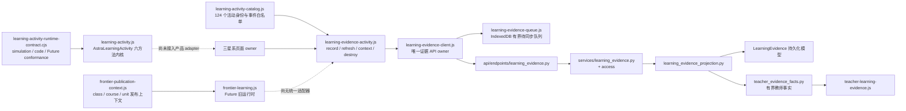

现状可以支撑“权威证据部分可用”，但还不能称为统一活动平台：

1. `shared/js/learning-activity-catalog.js` 已统一活动身份和五种学习者事件；`shared/js/learning-activity.js` 现提供统一 runtime factory，但尚未接入产品页面，Future 的其余课程仍主要是目录记录。
2. `shared/js/learning-evidence-activity.js` 已处理规则、恢复、离线队列、身份清理和销毁，但公开的是 `record/refresh/context/destroy`，不是统一 LearningActivity 六方法端口。
3. `shared/js/learning-evidence-client.js` 是学习证据 API 的唯一前端 owner；页面 owner 不得绕过它。`shared/js/learning-evidence-queue.js` 只是短期重放设施，不是成绩或完成度账本。
4. 后端 `backend/app/api/endpoints/learning_evidence.py` 只做 HTTP 适配，规则与写入落在 service，恢复和状态落在 projection；`backend/app/services/teacher_evidence_facts.py` 只投影有界事实，课程特定事实仍是 partial。
5. 运行态和服务端投影是两个正交维度。页面“正在交互”不能推出服务端“已完成”，浏览器反馈也不能替代发布权限、规则版本或教师事实。

## 12. 目标模块架构与迁移分层

`shared/js/learning-activity.js` 是机器清单登记的唯一 `AstraLearningActivity` owner。ARCH-004 已实现只编排注入端口的内核；本片不把它接入页面，也不实现课程 adapter、发布、恢复、评价或完成业务真相。目标依赖如下：

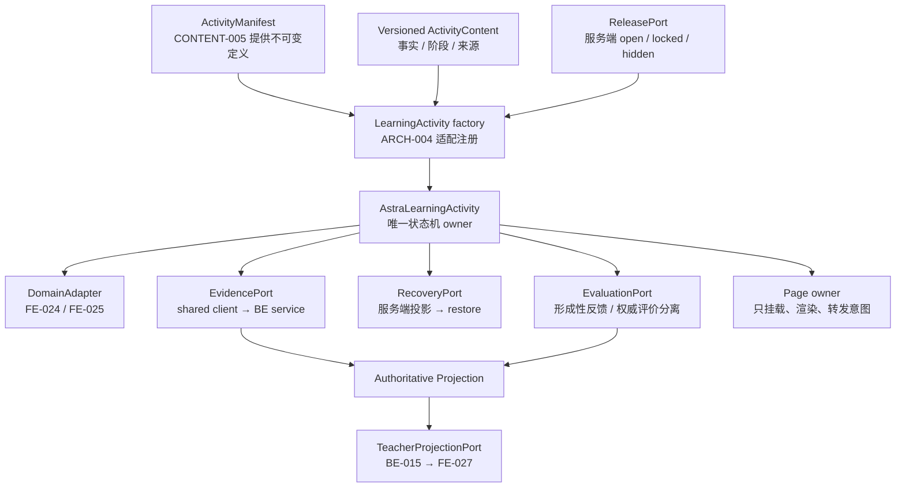

迁移不是把 f017 整树搬进当前根线，而是按可验收层逐层替换：

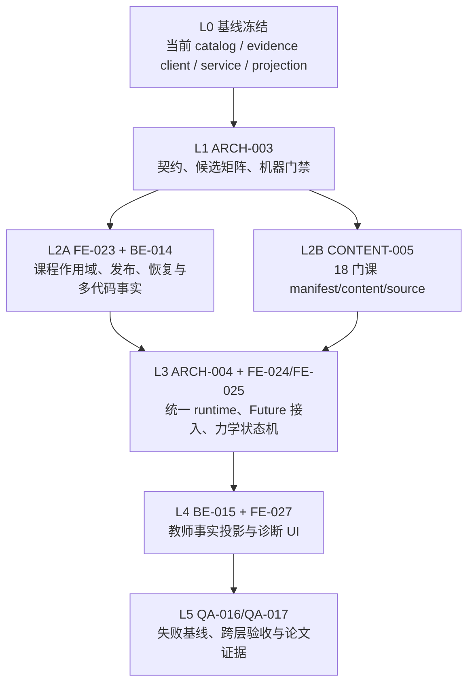

每一层只消费上一层已冻结的端口。L2 不得提前造 runtime，L3 不得伪造发布/完成事实，L4 不得在 UI 重新评分，L5 不得通过放宽 allowlist 让失败变绿。

## 13. LearningActivity 最小契约

### 13.1 Manifest 与身份

统一 manifest 的 schema 标识为 `astra-learning-activity-v1`。稳定身份必须包含 `galaxy_key`、`course_key`、`activity_key`、`manifest_version`、`content_version`、`event_schema_version`；任何恢复、证据、评价和教师投影都用这组稳定键，不用标题、DOM id 或 URL 文案做主键。

每条 manifest 至少有九个段：`identity`、`route`、`owner_adapter`、`content`、`release`、`assessment`、`evidence`、`resources`、`sources`。其含义如下：

| 段 | 最小内容 | 不得承载 |
| --- | --- | --- |
| `identity` | 六个稳定身份/版本字段 | 用户、班级或运行时对象 |
| `route` | 唯一 canonical route 与显式 legacy alias | 通过路由推断开放状态 |
| `owner_adapter` | 已登记 adapter id 与能力声明 | 任意脚本路径执行或全局注册 |
| `content` | 版本化内容引用、阶段顺序和语言 | API、token、完成状态 |
| `release` | 必需的 class/course/unit 上下文声明 | open/locked/hidden 的本地默认值 |
| `assessment` | rubric id/version、可信评价方式 | “答对一次即完成”之类页面算法 |
| `evidence` | 允许事件、字段预算、schema version | `completed`/`transferred` 的客户端写入 |
| `resources` | CSS/JS/媒体引用、预算与完整性元数据 | 新的散落 cache-version 常量 |
| `sources` | 来源 id、标题、URL、访问日期和用途 | 无出处事实或把来源文本当运行逻辑 |

### 13.2 Runtime 方法

统一对象只暴露六个生命周期方法，端口名精确为 `restore`、`predict`、`observe`、`assess`、`emitEvidence`、`dispose`；adapter 可以有内部方法，但不能扩张跨层端口。

| 方法 | 输入/输出 | 权威边界 |
| --- | --- | --- |
| `restore(context, signal)` | 读取发布、恢复和规则，返回可恢复快照 | 无明确 class/course/unit 或非 open 时进入 `blocked`，不得挂载可交互 owner |
| `predict(input)` | 规范化学习者预测，返回本地域观察 | 只能形成 `predicted` 候选事实，不判定完成 |
| `observe(action)` | adapter 把操作变为有界观察 | 不携带 DOM、源码、token、完整答案或页面快照 |
| `assess(observation)` | 返回版本化形成性反馈/可信评价结果 | 客户端反馈不直接产生权威完成投影 |
| `emitEvidence(event)` | 经共享客户端写入或排队，返回 receipt/pending | 只允许五种学习者事件，必须有稳定键和 `client_event_id` |
| `dispose(reason)` | 幂等取消请求、租约、订阅、计时器与 DOM 引用 | 调用后所有迟到响应失效，不得复活旧账号状态 |

### 13.3 运行态与投影态

运行态固定为 `created`、`restoring`、`ready`、`interacting`、`assessing`、`blocked`、`disposed`：

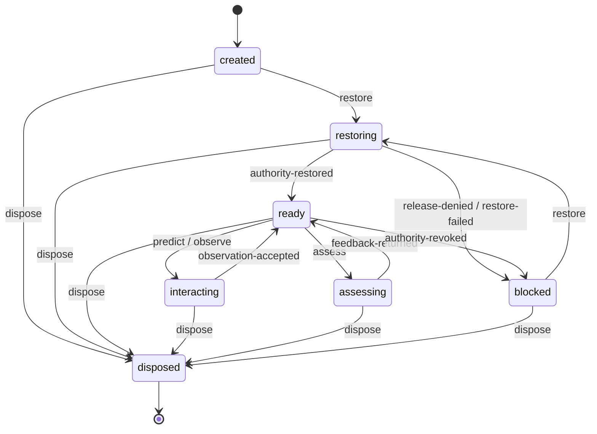

服务端投影态另行固定为 `not_started`、`in_progress`、`completed`、`transferred`。前端只能提交 `started`、`predicted`、`attempted`、`corrected`、`explained`；`completed` 和 `transferred` 只能由服务端按规则版本派生。两套状态不得合并成一个枚举，也不得用运行态迁移替代证据规则。

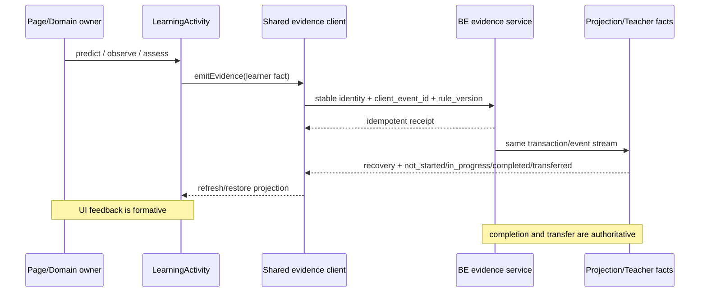

## 14. 跨组端口与第一波禁区

### 14.1 七个最小端口

| 端口 | 生产者 → 消费者 | 最小合同 | 禁止越界 |
| --- | --- | --- | --- |
| `manifest` | CONTENT-005 → FE | 不可变身份、route、adapter、内容/评价/证据声明、资源预算、来源 | CONTENT 不联网、不注册 runtime、不声明开放或完成 |
| `state-machine` | ARCH schema → FE runtime → page owner | 单一 `AstraLearningActivity` owner 与六方法 | FE 不复制 owner，不自造权威状态 |
| `evidence` | page intent → runtime → shared client → BE | 稳定键、规则版本、有界结构化事实、幂等 receipt | page/content 不直连 API；学习者不发派生事件 |
| `recovery` | BE projection → shared client → `restore` | 明确作用域、上次位置、规则版本、投影、重放身份 | 不用 localStorage/route 推断进度，不跨账号重放 |
| `evaluation` | domain adapter → 形成性反馈；可信结果 → BE | rubric version、有界 observation、可解释 feedback/result | 本地反馈不等于完成，BE 不信任客户端完成布尔值 |
| `release` | BE release service → publication context → factory | `class_id`、`course_id`、`unit_id` 与 open/locked/hidden | manifest、URL 和 fallback 都不能把活动打开 |
| `teacher-projection` | BE-015 → FE-027 | 显式班级/课程范围、`generated_at`、来源事件键、有界事实 | 教师 UI 不重评分 raw evidence，不声称“已掌握” |

职责落点：ARCH 只维护 schema、依赖方向、迁移决策与门禁；FE 只维护浏览器 runtime、adapter、共享客户端消费和无障碍 UI；BE 只维护发布、校验、恢复、权威评价与教师事实；CONTENT 只维护 manifest、版本化教学内容、rubric 引用与来源；QA 只维护反例、失败基线和跨层验收证据。任何组都不得通过实现别组端口、改写共享事实或放宽 allowlist 来“临时打通”。

### 14.2 第一波禁区

在 ARCH/FE/BE/CONTENT 第一波建立新端口期间，下列遗留面只减不增，除非 02 新任务明确授权并由 ARCH 同步更新门禁：

- 壳层：`index.html`、`shared/js/main.js`、`shared/js/router.js`、`shared/js/page-registry.js`、`sw.js`；
- 角色巨型 owner：`pages/student/student.js`、`pages/teacher/teacher.js`、`pages/admin/admin.js`；
- 遗留事实入口：`backend/app/api/endpoints/learning_events.py`、`backend/app/api/endpoints/progress.py`、`backend/app/api/endpoints/knowledge.py`、`backend/app/api/endpoints/courses.py`、`backend/app/services/course_release_plans.py`；
- 所有候选工作树：`f017`、`f017a`、`f017b`、`f017c`、`fr89`、`ux64`、`u358`、`c003`。

新的统一 owner 只能是 `shared/js/learning-activity.js`；`AstraLearningActivity` 已在该文件定义且只能定义一次。页面、内容模块、测试 fixture 以外的替身、动态 `Object.assign`/`Reflect` 注册都视为越界。

## 15. 遗留候选处置矩阵

处置词只有四个：**直接吸收**表示已有 blob 可原样进入且不破坏契约；**重新实现**表示需求/行为有效，但必须基于当前根线和新端口重写；**仅保留参考**表示只保留交互、内容或测试思路，不携带实现；**不可用**表示不得复制、cherry-pick 或作为新基线。ARCH-003 不实际吸收、移动或清理任何候选；表中“直接吸收”只描述 c003 已经发生且由 blob identity 证明的根线事实。

| 候选 | 关键路径 | 处置 | 证据 | 风险 | 后续 owner |
| --- | --- | --- | --- | --- | --- |
| `f017` | `pages/frontier/frontier-manifest.js`、`shared/js/frontier-route.js`、`shared/js/frontier-course-loader.js`、`shared/js/frontier-publication-context.js` | 重新实现 | canonical route、exact-open publication、schema 校验有价值；owner 端口却只有 snapshot/destroy，证据 controller 与 owner 并列挂载 | 未提交，落后根线 22 commits；58 个候选路径中 18 个与根线后续改动重叠 | ARCH-004 + FE-024 + CONTENT-005 |
| `f017` | `pages/frontier/content/**` 18 个未跟踪课程模块 | 重新实现 | 阶段、来源和教学叙事可作为输入 | 未提交、重复 wrapper、未受冻结 manifest 管理，原样复制会把内容与 runtime 再次耦合 | CONTENT-005 + FE-024 |
| `f017` | 六方向 owner/CSS | 仅保留参考 | 有视觉/交互原型，但只有 engineering/load-path 与 humanities/claim-review 暴露 domain evidence | 无最终浏览器验收，无统一生命周期 adapter | FE-024 + FE-025 |
| `f017` | `index.html`、`shared/js/main.js`、`shared/js/router.js`、`shared/js/page-registry.js`、`shared/js/frontier-learning.js`、`shared/css/frontier.css`、`sw.js` | 不可用 | 大范围共享壳补丁建立在旧根线 | 直接吸收会回退当前壳、缓存和学生流，且违反第一波禁区 | PM/ARCH；第一波无人实现 |
| `f017` | `doc/**`、`tools/tests/**` | 仅保留参考 | 记录了路由、lane 与契约意图 | 原断言冻结的是候选形状，不是统一 runtime | QA-016 + QA-017 |
| `f017a` | cosmos/engineering 的 owner、CSS 与 6 个 content blobs | 仅保留参考 | 10/10 blobs 与 f017 对应文件逐字节相同，无独有材料 | 重复候选且继承 f017 全部验收缺口 | CONTENT-005 + FE-024 |
| `f017b` | data/information 的 owner、CSS 与 6 个 content blobs | 仅保留参考 | 10/10 blobs 与 f017 对应文件逐字节相同，无独有材料 | 重复候选且继承 f017 全部验收缺口 | CONTENT-005 + FE-024 |
| `f017c` | materials/humanities 的 owner、CSS 与 6 个 content blobs | 仅保留参考 | 10/10 blobs 与 f017 对应文件逐字节相同，无独有材料 | 重复候选且继承 f017 全部验收缺口 | CONTENT-005 + FE-024 |
| `fr89` | `shared/js/teacher-learning-evidence.js` 与教师合同 | 重新实现 | 删除自主 4 秒轮询，加入需求合并、dialog/focus 释放，方向正确 | 7 个 dirty 路径、落后 29 commits；独立复核未闭环 | BE-015 → FE-027 → QA-016/017 |
| `fr89` | `shared/js/product-capabilities.js`、`doc/**` | 仅保留参考 | 文字记录按需刷新意图 | 未完成候选不得改写能力控制面或稳定文档 | PM/ARCH |
| `ux64` | `shared/js/role-home-client.js`、`tools/tests/role-home-accessibility-contract.cjs` | 重新实现 | focus intent 与 replacement-node 策略可复用为设计 | 已知 P2 覆盖 detached/private DOM，以及 student/destroy/generation/primary-action 盲区 | FE-026 + QA-016 |
| `ux64` | `doc/**` | 仅保留参考 | 保存焦点连续性意图 | 不能先于稳定实现写成已完成事实 | FE-026 |
| `u358` | `index.html`、`pages/admin/admin.js`、`shared/js/main.js`、`shared/js/page-registry.js`、`sw.js` | 不可用 | clean commit 只刷新旧 admin/cache generation；当前根线已有更晚的 student/catalog/cache generations | cherry-pick 可直接观察到对新根线的回退，且当时未完成运行态验收 | PM/REL；仅在 QA-016 重现当前缺陷后另派任务 |
| `u358` | `tools/tests/**`、`doc/**` | 仅保留参考 | generation 一致性断言仍可转写为回归用例 | 字面版本号已经过时 | QA-016 |
| `c003` | `doc/02-子文档/25-V7.7未来星系18课程内容与路由冻结矩阵.md` | 直接吸收（已完成） | c003 与当前根线 blob 均为 `7d471691174134e985d7e8d6d9fda52bf9f720bb` | commit 非祖先，必须以 blob identity 而不是 ancestry 解释语义集成 | CONTENT-005 消费已集成来源校准 |
| `c003` | Git worktree registry entry | 不可用 | 物理目录缺失，登记为 prunable | 清理有破坏性且不在 ARCH-003 授权内 | PM/REL 后续安全清理 |

因此，没有任何遗留实现候选可直接 cherry-pick。f017 系列只提供 Future 设计输入，fr89/ux64 只提供行为与反例，u358 只提供过期回归思路；c003 的唯一文档 blob 已在根线，不需要再次操作。

## 16. V8 机器门禁与验收

`tools/architecture/v76-module-boundaries.json` 的 schema 升级为 `astra-architecture-boundaries-v2`，并把本节合同机器化。`tools/tests/architecture-boundary-contract.cjs` 在原有端点依赖、唯一 owner、证据 API、遗留行数和资源版本门禁之外，新增以下断言：

1. `ARCH-003`、`V8.0.0`、基线、允许路径、处置词、本文和 JSON 相互一致；八个候选的 HEAD、计数、指纹、逐路径 evidence/risk/owner 完整，且只有 c003 可以标记为 `direct_absorb`。
2. manifest 九段、六个 runtime 方法、七个运行态、四个投影态、七个端口和五组职责禁区必须完整；预留 `AstraLearningActivity` 仍遵守单一 owner 扫描。
3. catalog、共享客户端和后端 schema 的五种学习者事件、两种服务端派生事件、四种投影态必须精确一致；任何前端 `emitEvidence('completed')`、`record('transferred')` 或等价字面 payload 都被拒绝。
4. `pages/frontier/content/**` 脚本不得发网络请求、持有 local/session storage 进度或注册 runtime global；内置反例保证扫描器本身有效。
5. 第一波禁区同时进入遗留行数上限，禁止新逻辑继续塞回共享壳、角色巨型 owner 和旧事实入口。

候选指纹写入仓库只是可移植的审计记录，机器合同不会跨出当前 worktree 读取遗留目录；ARCH 在提交前用与第 10 节相同的只读算法再次计算，并逐项证明前后相同。验收顺序固定为：专项 architecture contract → 完整 `npm test` → 文档兼容/对接校验 → `git diff --check` → 候选前后指纹 → 仅允许路径 diff → 精确标题提交 → 当前工作树 clean。任何一步失败都应回到责任端口修复，不删除断言或放宽处置。

## 17. ARCH-004 统一活动内核与恢复契约

> 本节保留 `V8.0.9` 建立内核时的基线设计与可执行证据；其中单一 `sequence` 恢复算法和裸 command EvidencePort 已由第 18 节 `ARCH-005` / `V8.0.11` 定向替代。六方法、七状态、五端口、Authority/Release 边界、manual latch、取消和 provenance 约束仍继续生效。

### 17.1 交付边界与真实落点

`ARCH-004` / `V8.0.9` 以 `f925f658442352cdc93f81768f1d7fb93553b863` 为精确父线，只建立可执行架构内核和消费合同。唯一产品 owner 是 `shared/js/learning-activity.js` 中的 `AstraLearningActivity`；`tools/tests/learning-activity-runtime-contract.cjs` 提供动态 conformance，机器清单和本文件共同解释边界。

本片明确不做四件事：

1. 不接线 `index.html`、Router、page registry、Service Worker 或六门课程页面。
2. 不替换 `shared/js/learning-evidence-activity.js`、client、queue、catalog 和现有 Future/Mechanics owner。
3. 不新增后端字段、迁移、数据库表、完成规则、教师投影或产品 adapter。
4. 不把现有 `/me/recovery` 的 projection/cursor 响应包装成精确 run 恢复。

因此，当前真实结构是“内核存在、产品尚未消费”。下图把组件 owner、五个注入端口和未来页面适配面放在同一依赖图中；虚线不是已完成接线：

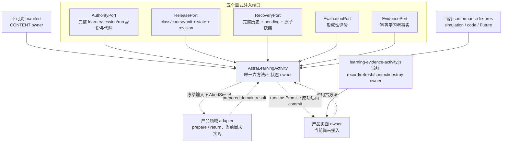

- **当前能证明**：缺少任一端口或 adapter 方法会在 factory 阶段失败关闭；内核不直接拥有 DOM、网络、存储、发布、完成或教师投影；三类实线 fixture 确实调用同一内核。
- **当前不能证明**：虚线上的六课页面、产品 adapter、真实 Authority/Release/Recovery/Evaluation/Evidence 实现均未接入；图不证明 Browser、真实网络或课程业务完成。
- **后续接入点**：FE 提供 prepare/return adapter 并在 runtime Promise 成功后提交页面效果；BE 分别履行五端口中属于服务端的权威面；QA 用真实跨层 probe 替换 fixture，但不得复制产品规则。

### 17.2 唯一 owner、不可变 manifest 与最小公开面

内核继续使用 `astra-learning-activity-v1`。全局对象只负责暴露冻结常量和 factory；factory 返回的 runtime 对象精确只有 `restore`、`predict`、`observe`、`assess`、`emitEvidence`、`dispose` 六个生命周期方法。七个运行态和四个投影态继续采用第 13.3 节枚举，不新增“看似方便”的别名状态。

manifest 仍必须包含第 13.1 节九段。内核在创建时复制并深冻结 JSON 数据；缺段、schema 不兼容、release scope 不完整、事件白名单包含服务端事件或 adapter id 不一致均立即失败关闭。identity token/version、canonical route、owner adapter id、state schema version 与 assessment 的 rubric id/version 必须逐字等于规范化值；rubric 缺失也在 factory 阶段拒绝。`manifest-whitespace-fail-closed` 动态夹具逐字段证明首尾空白不会留下只能到 restore/assess 才失败的 runtime。内核只调用注入 adapter 的 `restore/predict/observe/dispose` 四个必需方法；它们是测试/后续 FE 的领域适配面，不是新的跨层公开端口，也不会扩展 runtime 的六方法公开面。

内核禁止直接依赖 DOM、HTTP、IndexedDB/localStorage、`AstraLearningEvidenceClient`、`AstraLearningEvidenceQueue` 或课程页面。它只调用显式注入的 `authority`、`release`、`recovery`、`evaluation`、`evidence` 五个 port；任一缺失均不创建 runtime。

六方法和七个 runtime state 的可执行关系如下；图只画内核状态，不把服务端四个 projection state 混入客户端状态机：

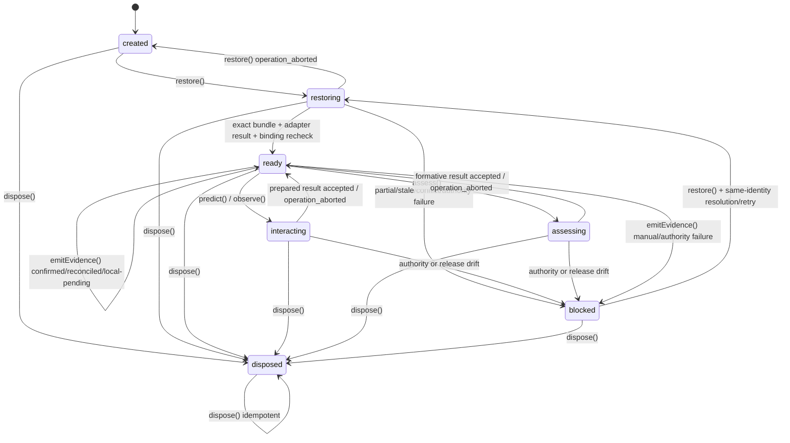

- **当前能证明**：动态合同执行正常与非法迁移、busy 围栏、caller abort 后安全重试、`dispose` 幂等和所有晚响应丢弃；公开面仍精确为六方法。
- **当前不能证明**：状态图不代表任一课程页面已经把按钮/DOM/Canvas 状态收敛到 runtime，也不代表四个服务端 projection state 可由客户端推进。
- **后续接入点**：FE 页面只能消费成功 Promise 后的冻结返回值；BE 继续独占 `completed` / `transferred`；QA 应同时观察 runtime state 与页面可见状态，检查两者没有双 owner。

adapter 的原子性边界固定为 `runtime-state-only`。`restore`、`predict`、`observe` 的 adapter 会在最终 binding 复核前执行，因此 adapter 必须只 prepare/return domain state，不能先写 DOM、Canvas、storage 或外部 owner；页面仅在 runtime Promise 成功后 commit。确需启动长期副作用时，adapter 必须监听注入的 AbortSignal，并由 `dispose` 对称清理。合同中的 `adapter-side-effect-after-abort` 反例故意让 adapter 忽略 signal 并在取消后写外部数组：内核能拒绝 Promise、保持可重试且丢弃晚返回，却不能回滚该数组，防止把纯函数 fixture 外推成产品原子性。

### 17.3 身份所有权与 ReleasePort 收口

可精确恢复的完整运行身份固定为：

| 维度 | 字段 | owner |
| --- | --- | --- |
| 发布作用域 | `class_id`、`course_id`、`course_unit_id`、`activity_key` | release/authority/recovery 共同对账 |
| 可核验主体 | `subject_identity`，kind 只能为 learner 或 session | AuthorityPort；不会进入可序列化 evidence command |
| 运行组合 | `run_id`、`group_id` | AuthorityPort + RecoveryPort |
| 内容/事件版本 | `manifest_version`、`content_version`、`event_schema_version`、`rule_version` | manifest/rule binding + RecoveryPort |
| 页面代际 | `generation` | AuthorityPort + RecoveryPort |

manifest 的 `release.scope_fields` 必须唯一且精确包含 `class_id`、`course_id`、`course_unit_id`，只允许额外声明可选 `activity_key`；重复字段以及 `subject_identity`、`run_id` 等越权字段在 create 阶段拒绝。ReleasePort 的权威面故意更窄：输入可带活动键作定位，但响应只必须回显 class/course/unit scope、`state` 和发布 `revision`；`activity_key` 是可选的额外 scope 校验。ReleasePort 不得被要求伪造或背书 `subject_identity`、`run_id`、`group_id`、manifest/content/event/rule 版本或 `generation`。完整 learner/session/run 身份分别由 AuthorityPort 和 RecoveryPort 负责。合同同时执行“最小 release 回显通过”和“班/课/单元漂移失败关闭”。

每次 restore、交互、评价和证据写入前后都重新核对 authority 与 release revision。revision 或 scope 在异步操作期间变化时进入 `blocked`；内核不调用 adapter 的后续结果，也不把旧响应写回 ready。

前后两轮漂移门禁不能删除，但同一轮的 `authority.verify` 与 `release.resolve` 是独立 owner，必须由 `Promise.all` 并发启动，而不是四次串行查询。每个 port promise 必须在自己的 chain 内立即执行 `authorityResult` / `releaseResult` 语义校验；resolved denial、malformed result 或 rejected error 都必须立即让聚合失败、取消同轮 peer，并保留原业务错误码，不能等待另一端 resolve，后置轮仍保留。动态 deferred fixture 证明两端在任一 gate 释放前均已启动，也分别证明 `{authorized:false}` 配永久 pending Release、`{state:'locked'}` 配永久 pending Authority，以及 throwing rejection 配等待 peer 时，外层均在有界时间进入 blocked、peer signal 已 aborted；测试最后显式释放 deferred，避免悬挂或未处理 rejection。该合同只证明调度并发与语义 fail-fast；若端口映射为真实 API，一次 lifecycle 仍可能产生前后两波网络读取，缓存命中、网络时延和 p95 均为 **NOT-RUN**，必须由后续 QA/PERF 在真实接线后测量。

### 17.4 原子恢复与确定性合并

恢复 envelope 的 schema 固定为 `astra-learning-activity-recovery-v1`。只有同时满足以下条件才能从 `restoring` 进入 `ready`：

1. envelope 声明完整、原子、非陈旧，并把 snapshot id/captured time 绑定到当前 authority revision 和 release revision。
2. bundle、server history、offline pending set、domain snapshot 和每条事实的完整运行身份逐字段相同。
3. server 声明 complete history，事件序号从 1 连续、`client_event_id` 唯一；offline 声明 complete pending set。
4. offline 与 server 的同 ID 网络重放只有全部事实逐字段一致时才能折叠；异载荷、重号、重叠序号或缺口进入 `blocked` / manual-intervention。
5. domain snapshot 的 state schema 与 manifest 一致，`applied_through_sequence` 精确等于 server history 长度；adapter 只在全部校验通过后接收冻结输入。
6. `completed` / `transferred` projection 必须有同身份、同 `rule_version` 的服务端派生事件和去重来源学习者事件 witness；每个 source sequence 必须严格早于 derived sequence。课程要求哪些事件类型仍由 BE rule owner 决定，内核只守通用因果方向；离散 attempted/corrected/explained 不得由客户端拼成完整组合。

当前后端 `StudentLearningRecoveryRead` 只有 subject/class/course、rule、resume cursor 和 activity projection，没有 `run_id`、`group_id`、`generation`、完整有序历史或原子 domain snapshot。直接把该 DTO 交给内核会稳定返回 `blocked`；这是本片可证明的 safe fallback，不是后端能力失败，也不声称已实现跨刷新精确续学。

恢复调用顺序必须保持“先绑定、后取 bundle、adapter 只产出 prepared state、再绑定、最后提交内核状态”；下图同时标出 adapter 位于最终复核之前这一限制：

```mermaid
sequenceDiagram
    participant Page as 页面 owner
    participant Kernel as AstraLearningActivity
    participant Authority as AuthorityPort
    participant Release as ReleasePort
    participant Recovery as RecoveryPort
    participant Adapter as Domain Adapter
    Page->>Kernel: restore(context, AbortSignal)
    par first binding round: independent owners start concurrently
        Kernel->>Authority: verify(full runtime identity)
        Authority-->>Kernel: exact identity + authority revision
    and
        Kernel->>Release: resolve(class/course/unit/activity)
        Release-->>Kernel: scope + state + release revision
    end
    Kernel->>Recovery: load(full identity, recovery schema)
    Recovery-->>Kernel: history + pending + atomic snapshot
    Kernel->>Kernel: validate identity/order/completion witness + deterministic merge
    alt partial/stale/conflict/unproven
        Kernel-->>Page: blocked/manual-intervention
    else bundle structurally exact
        Kernel->>Adapter: restore(frozen prepared input, signal)
        Adapter-->>Kernel: prepared domain state
        Note over Adapter,Kernel: adapter 已执行；外部副作用无法由内核回滚
        par final binding round: independent owners start concurrently
            Kernel->>Authority: verify(same identity + revision again)
            Authority-->>Kernel: exact identity + authority revision
        and
            Kernel->>Release: resolve(same scope + revision again)
            Release-->>Kernel: scope + state + release revision
        end
        alt binding drift / abort / dispose
            Kernel-->>Page: reject or blocked; discard adapter result
        else binding still exact
            Kernel->>Kernel: atomically commit recovery/domain state and ready
            Kernel-->>Page: fulfilled frozen ready result
        end
    end
```

- **当前能证明**：对 runtime 内部而言，bundle 校验、合并、domain result、reservation 和 `ready` 一次提交；任一身份/revision 漂移或 late result 都不会部分落入内核；同一 binding round 的 Authority/Release 并发启动且任一失败会取消 peer、失败关闭。
- **当前不能证明**：内核无法回滚一个在最终复核前自行改写 DOM/Canvas/storage、且忽略 AbortSignal 的 adapter；“原子恢复”不能无条件外推到页面外部状态，也不能外推为当前后端具备 exact bundle；并发调度也不等于真实网络 p95、缓存或服务端并发性能已验证。
- **后续接入点**：BE 的 Authority/Release/Recovery 分别返回各自拥有的身份、发布 scope 和原子 bundle；FE adapter 返回 prepared state、页面成功后 commit；QA 注入最终复核时的 authority/release 漂移，并分别断言内核状态与外部效果；QA/PERF 在真实端口接线后测量两波读取的 p95。

### 17.5 manual-intervention latch

恢复冲突形成的 manual latch 同时冻结 block id、原因和触发时的完整运行身份。latch 只允许两种显式动作：

- `apply-atomic-snapshot`：同一身份下应用重新核验的完整原子快照；
- `verified-safe-restart`：同一身份下且服务端 projection 为 not_started、合并事实为零时安全重开。

瞬时 authority denied、release locked/hidden、调用者取消或再次恢复失败都不能清除既有 latch。跨账号、班级、课程、单元、活动、run/group、版本或代际提交相同 block id 仍被拒绝；只有同一身份的有效 resolution 成功，或 `dispose`，才能释放 latch。

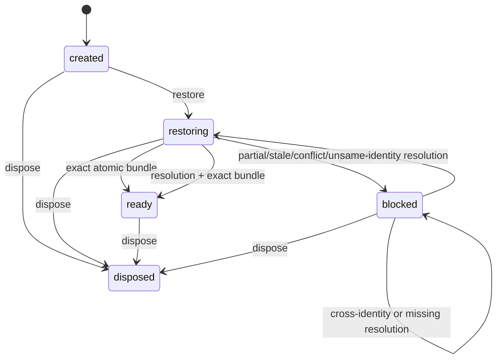

### 17.6 取消、晚响应与证据顺序

caller AbortSignal 与 runtime dispose 使用不同结论：

- 调用者取消返回 `operation_aborted`。restore 回到调用前的 created/blocked；predict/observe/assess 回到 ready；evidence 保留同 ID/同 sequence 的未知写入围栏。底层 port/adapter 即使完全忽略 signal，外层 Promise 也通过取消 race 立即收束，迟到结果只有已附着的吞吐回调，不再落状态。
- runtime `dispose` 返回 `activity_disposed`，立即推进 epoch、取消当前 operation、清除当前身份/快照/预留表；底层迟到恢复、评价或 receipt 不能复活旧 runtime。

学习者写入 envelope 固定为 `astra-learning-activity-event-v1`。可写事件仍只有 `started`、`predicted`、`attempted`、`corrected`、`explained`；`completed` / `transferred` 在调用 EvidencePort 前即拒绝。runtime 独占 run/group/sequence/version/generation，调用方不得覆盖；可序列化 command 不含 subject id，AuthorityPort 元数据与业务 evidence 分离。

模糊写入失败后只允许复用原 `client_event_id`、原 sequence 和原事实重试；新 ID 在未知结果对账前失败关闭。confirmed/reconciled/local-pending receipt 必须逐项回显 event type、ID、run、group 和 sequence；矛盾 receipt 进入 manual-intervention。local-pending 只表示可重放本地事实，不推进服务端 projection 或客户端完成。

### 17.7 三类 conformance fixture

`tools/tests/learning-activity-runtime-contract.cjs` 的 simulation、code、Future 三类 adapter 都只存在于测试：

| fixture | 证明内容 | 不证明内容 |
| --- | --- | --- |
| simulation | 同一内核可承载实验快照和形成性观察 | Physics 页面已经迁移或服务端已保存实验 run |
| code | 同一内核可承载代码类预测/观察形状 | OJ、submission/revision 或源码存储 |
| Future | 同一内核可承载 Future 阶段状态 | 18 门 Future 均已接线或 Browser 旅程通过 |

fixture 不注册产品 global、不修改 catalog/页面，也不成为第四类业务 owner。

### 17.8 QA-021 raw evidence provenance envelope

通用 envelope schema 固定为 `astra-raw-evidence-provenance-v1`。raw record 必须有唯一 source id、captured time、JSON payload，并标明 `request`、`response`、`state`、`dom` 之一。每个 canonical fact 必须以非空 source-id 集合引用实际 raw record；独立 verifier 只接收 raw records，不接收报告声称的 canonical facts，再重新计算并逐 fact 对账。

参考重算器只位于 runtime contract，不进入 `AstraLearningActivity` 产品 API。动态合同覆盖：

1. 单改一层 canonical fact，失败；
2. 成套修改全部 canonical facts、但 raw 不变，失败；
3. 引用不存在的 raw source，失败；
4. 同时协调修改 raw 与全部派生事实可能重新自洽通过。

因此该 envelope 的保证级别明确为 `consistency-only`，不宣称防篡改。第四种情况必须由仓库外签名、独立抓包、浏览器/服务日志隔离来源或其他 source-authenticity verifier 处理；QA-021 不能把“可重算”写成“来源独立”。

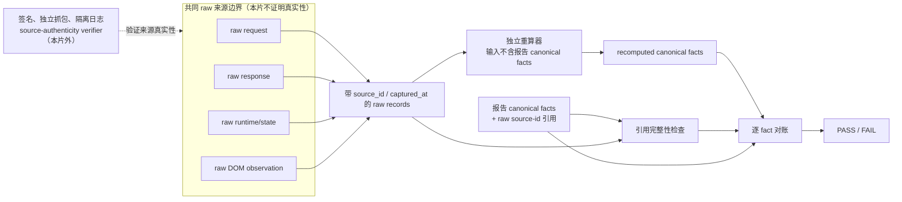

- **当前能证明**：每个 claim 引用存在的 raw source；重算器不读取被审报告的 canonical 值；单层、整套 facts 与 raw 不一致都会失败。
- **当前不能证明**：raw request/response/state/DOM 仍可能来自同一协调篡改源；自洽 PASS 不是防篡改、真实 Browser 或独立来源证明。
- **后续接入点**：FE/BE 暴露可绑定的原始观察标识，QA-021 负责独立重算与对账，QA/部署侧另接签名、隔离日志或独立抓包验证器；本片不改写 QA-016 历史 evidence。

### 17.9 能证明与不能证明

| 本片能证明 | 本片不能证明 |
| --- | --- |
| 单一 global owner、六方法、七 runtime state、四 projection state 和五/二事件边界一致 | 六门代表课或 124 个 catalog 活动已经使用新内核 |
| manifest/ports 缺失失败关闭，ReleasePort 不越权背书 run 身份 | 当前后端能够提供 exact run/group/generation 历史 |
| 身份漂移、部分/陈旧/冲突/乱序/缺 witness 恢复进入 blocked | 真实跨设备、真实 socket、浏览器刷新或离线网络旅程 |
| manual latch 跨瞬时失败保持且不能跨身份解锁 | 人工处理 UI、服务端 resolution 存储或运营流程已经实现 |
| caller abort / dispose / late response 不污染 runtime；反例明确暴露 adapter 外部副作用不可回滚 | 任意第三方 adapter 都遵守 prepare/commit、监听 signal 或正确实现课程业务 |
| raw/canonical 单层与成套不一致可由参考 verifier 捕获 | raw 来源真实性、防协调篡改或 QA-016 历史报告已被修改 |

### 17.10 机器门禁、体积与后续拆分

`tools/architecture/v76-module-boundaries.json` 保留 ARCH-003 的全部 owner、禁区、资源 ceiling 和遗留例外，另给 `shared/js/learning-activity.js` 设置 980 行硬 ceiling，并把 adapter 的 `runtime-state-only`、prepare/commit、AbortSignal/`dispose` 责任写入机器清单。内核当前只保留三类内部职责：JSON/身份/恢复结构校验、六方法状态与取消调度、证据顺序/receipt 围栏；QA provenance 参考 evaluator 已留在测试合同，课程 adapter、网络、存储、发布与完成规则均不得继续塞入该 owner。

如果后续产品接线需要 adapter registry、共享 request lifecycle、来源真实性 verifier 或复杂 run replay builder，应由 ARCH-005/后续明确任务建立独立模块，再由内核消费；不得通过提高 ceiling、增加第七个生命周期方法或把 FE/BE 业务规则内联进本文件解决。ARCH-004 的专项验收固定为：runtime contract → architecture contract → `npm test` → 文档兼容/对接校验 → `git diff --check` → 五文件 allowlist 与 clean。

## 18. ARCH-005 双游标与不可变 snapshot sidecar 合同

### 18.1 变更目的、精确基线与边界

`ARCH-005` / `V8.0.11` 以 `b8691e4b8069427b7cec202a7cb6505e02eec896` 为唯一父线，修复 V8.0.9 两个不能靠后端手写序号或 FE 临时补字段掩盖的 P1：

1. `run.sequence` 原本只随学习者 command 增长；若服务端派生 `completed` 也占用同一序号，learner 2 触发 derived 3 后，真实内核下一条 learner 3 必然冲突。
2. event command 不含 domain snapshot；若 EvidencePort 在发送前或重试时重新读取可变 DOM/Canvas，同一 `client_event_id` 的 payload 会漂移，无法满足幂等对账。

本片仍不接线页面、主壳、现有 learning evidence client/queue、IndexedDB 或后端。`AstraLearningActivity` 继续是唯一六方法/七状态 owner；新增 `shared/js/learning-activity-recovery.js` 只提供纯恢复与 sidecar 结构校验，不拥有页面、网络、存储、完成规则或 runtime 生命周期。未来加载顺序必须是 `shared/js/learning-activity-recovery.js` 后接 `shared/js/learning-activity.js`，缺 helper 时 owner 立即失败关闭；公开 runtime 仍精确只有原六方法。

允许路径精确为本节文档、两个 runtime 文件、两个既有合同、一个独立恢复合同和机器清单。共享 `01/02/03`、课程页、backend、cache owner 与历史 evidence 均不在本片范围。

### 18.2 双游标不变量

两个序号空间的 owner 和用途固定如下：

| 字段 | owner | 增长条件 | 禁止用途 |
| --- | --- | --- | --- |
| command `run.sequence` | `AstraLearningActivity` | 每个新的 learner `client_event_id` 预留一次；它就是 `learner_sequence` | 服务端派生事件不得占号；不得从 server cursor 反推下一 learner |
| receipt `learner_sequence` | BE 回显，runtime 对账 | 不增长，只逐字回显 command `run.sequence` | 不得回显 derived 的位置 |
| ledger `server_sequence` | BE ledger | 每个持久化 learner 或 server-derived 事件各占一个连续位置 | 不得作为 learner command 的下一序号 |
| receipt `server_last_sequence` | BE ledger | 表示本次 receipt 时服务器已知的 ledger 尾部 | 不得覆盖 learner reservation；不得倒退到 runtime 已知 cursor 之前 |

服务端派生事件必须显式使用 `learner_sequence: null`。`confirmed` / `reconciled` receipt 必须同时给出 `learner_sequence`、该 learner 事实的 `server_sequence` 和当时的 `server_last_sequence`，且 last 不小于该事实位置；`local-pending` / `manual-intervention` 不得伪造服务器 cursor，也不得锁存或推进 runtime 的 server cursor。

每个 learner reservation 还必须保存“是否已有权威 server 位置”。从 recovery server history 读到的已确认 sidecar 立即锁存原 `server_sequence`；offline pending 与本轮新建 sidecar 保持未确认。未确认 reservation 首次收到权威 receipt 时，其 `server_sequence` 必须严格大于调用前 runtime 已知的 `server_last_sequence`；确认成功后锁存该位置。后续同 `client_event_id` 的幂等重放只能回显同一位置，回显更大或更小位置均进入 `evidence_receipt_mismatch` / manual-intervention。这样恢复 last=3 后的新 learner 3 只能落在 server 4 以后，不能复用 server 2；网络未知后的原 sidecar 首次 `reconciled` 仍按“未确认首次确认”处理。

这不代表多条 `local-pending` 被后台批量接受后可以无条件逐条自动恢复。如果端口只回显聚合 `server_last_sequence`，却不能证明每条 pending reservation 的实际 server 位置与确认顺序，则先回调的一条可能把 runtime cursor 推到批次尾，后续较早位置将按旧位置复用被拒绝并进入 manual-intervention。该结果是安全失败关闭；精确恢复必须重新加载完整 recovery-v2 server history，不能靠聚合 last 猜测或在本片扩展协议。

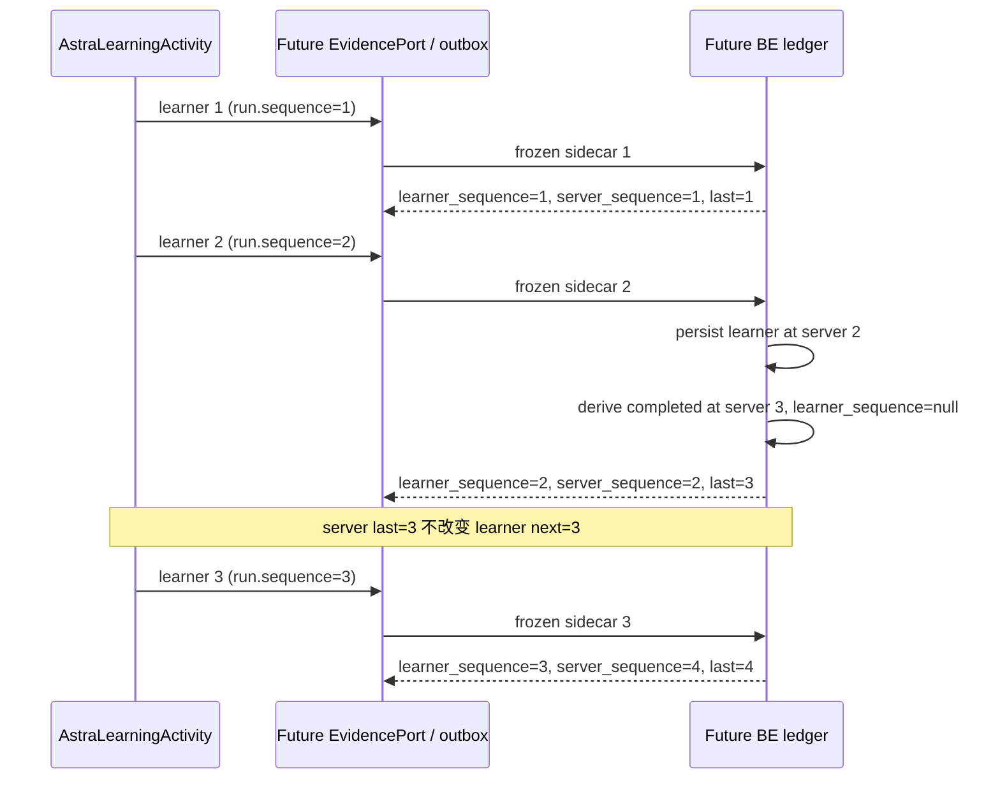

动态用例名称固定为 `learner 1/2 → server-derived server 3 → next learner 3`。它直接运行真实 JS runtime，不用手写 learner 4 绕过冲突。第二组用例把 learner 1/2/3 与中间 derived 放入同一恢复 ledger，证明 learner 序号为 1/2/3、server 序号为 1/2/3/4。禁止把两类游标重新合并成一个序号算法，也禁止仅靠 receipt 增加一个 last cursor 后继续沿用旧 merge。

### 18.3 recovery v2 的分层校验

恢复 envelope 升级为 `astra-learning-activity-recovery-v2`；`astra-learning-activity-recovery-v1` 和 projection-only DTO 均立即返回 `recovery_schema_incompatible`，不能做宽松升级。v2 只在以下分层全部成立时进入 `ready`：

1. bundle 仍为完整、原子、非陈旧，并绑定完整 runtime identity、authority revision 与 release revision；bundle、freshness、server、offline 和存在时的 manual_resolution 都是 exact-key 对象，未知字段返回 `recovery_schema_incompatible`，不得以“当前会丢弃”为理由宽松接收。
2. `server.events` 按 `server_sequence` 从 1 连续；其中 learner 记录另按 `learner_sequence` 从 1 连续并携带服务端实际接受的完整 sidecar，derived 的 learner cursor 为 null。
3. `offline.sidecars` 是完整 pending set，只按 learner cursor 在已确认 learner 尾部继续。与 server 同 ID 的网络重放只有整份 sidecar 逐字段一致时折叠；其他重号、缺口或异载荷进入 manual-intervention。
4. canonical domain snapshot 使用 `applied_through_learner_sequence`；server snapshot 必须逐字段等于最后一个已确认 learner sidecar 的 snapshot，最终 domain snapshot 再取最后一个已验证 pending sidecar，否则取 server snapshot。它不绑定 derived server 位置。
5. projection 使用 `applied_through_server_sequence` 并等于完整 server history 尾部；completion witness 的 derived 与 sources 也按 `server_sequence` 证明严格因果顺序。
6. adapter 收到 `server_events` 与 `offline_sidecars` 两个冻结集合，不再收到被混成一个序号空间的 `events`。

v2 外层允许字段固定如下；问号表示整个字段可缺省，不表示值可为 `undefined`：

| 对象 | 精确允许字段 |
| --- | --- |
| bundle | `schema_version`、`complete`、`atomic`、`stale`、`snapshot_id`、`captured_at`、`identity`、`freshness`、`server`、`offline`、`manual_resolution?` |
| freshness | `status`、`authority_revision`、`release_revision` |
| server | `identity`、`complete_history`、`event_count`、`events`、`projection`、`snapshot` |
| offline | `identity`、`complete_pending_set`、`sidecar_count`、`sidecars` |
| manual_resolution | `identity`、`status`、`block_id`、`action`、`resolution_id` |
| identity（所有出现位置） | `class_id`、`course_id`、`course_unit_id`、`activity_key`、`subject_identity`、`run_id`、`group_id`、`manifest_version`、`content_version`、`event_schema_version`、`rule_version`、`generation` |
| subject_identity | `kind`、`id` |

`bundle.identity`、server/offline identity、server snapshot identity、每条 server event identity、completion witness identity 与存在时的 manual resolution identity 都先经过合法性检查，再要求 raw identity 与规范 identity 的 canonical 结果完全相等。未知字段、token 前后空白或额外 subject 字段返回 `recovery_schema_incompatible`；形状已经精确但班课、活动、账号、run 或代际等已知字段值与 runtime 漂移，仍返回 `recovery_identity_mismatch`。禁止通过 normalization 静默丢弃不可信恢复输入。

恢复来源不会获得敏感/权威字段豁免。递归黑名单仍只由 `shared/js/learning-activity.js` 的 `EVIDENCE_FORBIDDEN` 唯一拥有；runtime 在 `RecoveryContract.create` 时注入纯 `evidencePolicy`，helper 不复制第二份字段表。server learner sidecar、offline sidecar 的 `command.evidence` / `snapshot.data`，以及 server canonical snapshot 的 `data` 都执行同一策略；命中 `completed`、`subject_user_id`、`token`、`projection_state`、`access_token` 等字段时返回 `recovery_sensitive_data_forbidden`，进入 manual-intervention，并在 `adapter.restore` 前阻断。恢复流程本身不调用 EvidencePort，污染值也不得以“来自 server/IndexedDB”为理由进入 adapter。

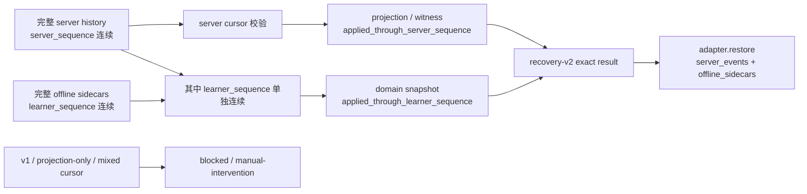

- **当前能证明**：纯 helper 分别拒绝 server gap、learner gap、projection cursor 漂移、snapshot cursor 漂移、异载荷 replay、witness 逆因果、v2 任一冻结层及全部 identity 容器的未知/非规范字段和恢复 sidecar/snapshot 敏感字段；derived 插入 server ledger 不影响下一 learner reservation，fresh receipt 不能占用旧 server 位置，已确认同 ID 只能复用锁存位置；无法逐条证明位置的批量 pending reconciliation 安全进入 manual。
- **当前不能证明**：合同没有让当前 BE 自动具备 v2 DTO、双游标表约束或真实事务；也没有证明多设备同时写、网络重排和数据库锁语义。
- **后续接入点**：BE 持久化独立 server cursor 并回显三项 receipt；FE EvidencePort 只传完整 sidecar；QA 用真实 JS→HTTP→DB 旅程复现本节 1/2/3/4 序列，不得继续手工构造 learner 4。

### 18.4 EvidencePort 不可变 sidecar

EvidencePort 输入升级为 `astra-learning-activity-evidence-sidecar-v1`，顶层精确只有冻结的 `command` 与 `snapshot`：

```text
sidecar
├── command                         # astra-learning-activity-event-v1
│   └── run.sequence                # learner-only
└── snapshot
    ├── state_schema_version
    ├── applied_through_learner_sequence
    └── data                        # post-event canonical domain state
```

runtime 在首次 `emitEvidence` 调用内把 command 与 post-event snapshot 组成一个深冻结 sidecar；同一 `client_event_id` 的所有内存重试直接复用该冻结对象。snapshot sidecar 缺失、字段漂移或 cursor 漂移均失败关闭，不能再调用 EvidencePort，也不能重采 mutable DOM/Canvas 来“修好”payload。`completed` / `transferred` 仍在形成 sidecar 前由客户端拒绝。

未来产品 EvidencePort 必须在任何网络 I/O 前，用同一 IndexedDB 事务原子持久化完整 sidecar；未知写、刷新和离线重放都必须逐字读取这份记录。缺记录、损坏、command/snapshot/schema/cursor 任一漂移时进入 blocked/manual-intervention；不得只保存 command，再在重试时补拍 snapshot。本片没有实现 IndexedDB、outbox 或页面 serializer，机器合同只冻结 port 输入和纯校验。

snapshot 采集时点与 ARCH-004 的 adapter 原子性不矛盾，正确顺序是：

1. 页面调用 `predict` / `observe` / `assess`，adapter 只 prepare/return。
2. 页面只在 runtime Promise 成功后提交 prepared domain state；失败或 binding drift 不提交 DOM/Canvas。
3. 页面从已提交的 canonical domain owner 序列化 post-event snapshot，再调用 `emitEvidence`。
4. EvidencePort 先原子写 sidecar outbox，再尝试网络；这个持久化是 EvidencePort 的耐久职责，不是 adapter 偷跑页面副作用。

如果产品只能在 EvidencePort 成功后才得到 snapshot，或只能从非 canonical DOM 临时拼装，则不满足本合同，必须 STOP-SCOPE；不得把 pre-event snapshot 冒充 post-event snapshot。

### 18.5 当前证据、限制与机器预算

`tools/tests/learning-activity-runtime-contract.cjs` 继续覆盖六方法状态、binding、取消、late response 和三类 conformance fixture；恢复专项已移入 `tools/tests/learning-activity-recovery-contract.cjs`，避免继续扩大原 1359 行单文件。机器预算收紧为：

| 文件 | 硬 ceiling | 职责 |
| --- | ---: | --- |
| `shared/js/learning-activity.js` | 900 行 | manifest、六方法状态/取消、binding、learner reservation 与 receipt 围栏 |
| `shared/js/learning-activity-recovery.js` | 480 行 | 纯 sidecar/recovery-v2 结构、双游标、snapshot/projection/witness 校验 |
| `tools/tests/learning-activity-runtime-contract.cjs` | 1300 行 | 内核运行时与通用 adapter 合同 |
| `tools/tests/learning-activity-recovery-contract.cjs` | 620 行 | 双游标、旧 schema、sidecar 与恢复负向矩阵 |

本片能证明 JS runtime 的冻结对象重试、分层恢复和失败关闭；不能证明未来 IndexedDB 事务真的原子、BE schema/transaction 已接入、页面 serializer 是 canonical，或真实网络性能。页面、真实 IndexedDB、Browser 与后端联调均为 **NOT-RUN**，不得在论文或验收报告中改写成通过。

机器门禁同时保持 ARCH-003 的全部单 owner、禁止依赖、服务端权威和遗留 ceiling，不新增课程/后端例外。专项验收固定为：recovery contract → runtime contract → architecture contract → `npm test` → 文档兼容/项目对接校验 → `git diff --check` → 七文件 allowlist、精确父/标题和 clean。

## 19. ARCH-009 V8.1 内容、发布与班级实例分层

> **历史候选说明（2026-08-28）**：本节保存 V8.1 阶段的原始设计推演，不再是当前实现合同。原机器 JSON 与动态合同已在 `BE-027` 取舍时退役，不能据此恢复第二套内容平台。当前稳定课程草稿、发布、课程成员和学习结果边界以 [`01-子文档/19-当前功能业务闭环与展示边界.md`](../01-子文档/19-当前功能业务闭环与展示边界.md#v844-多教师共享草稿与不可变发布be-027-当前稳定实现) 为准。

### 19.1 结论与现有缺口

V8.1 不推翻已经可用的 `Course`、`CourseClass`、`CourseUnit`、发布计划、作业、提交和学习证据。新架构只补齐当前无法由这些对象准确表达的六件事：学习空间、整课不可变发布包、班级固定课程版本、通用媒体、检查点尝试和单元级进度投影。

当前代码的真实边界是：

1. `Course` 与 `CourseUnit` 是学校范围内的可编辑课程结构，不能同时充当学生正在学习的不可变版本；
2. `ContentPageVersion` 已能冻结单页 JSON，但没有冻结整门课的单元顺序、页面版本、媒体、检查点和规则组合；
3. `CourseClass` 已是课程挂班实例，`plan_version` 只表示班级发布计划的并发版本，不能被重新解释为内容版本；
4. `LearningActivityProjection` 与 `LearningResumeProjection` 已保存权威证据投影，但没有区分学生是在课程发布包的哪个版本下完成；
5. `ContentScriptAsset` 只负责脚本沙箱的受审远程资产缓存，`ContentScriptAsset` 不得冒充通用媒体库；
6. V1 内容页只有五类 section，能够支持现有能量守恒试点，但不足以承担富文本、一般媒体和结构化检查点编辑。

因此，V8.1 的课程版本唯一真值固定为 `CourseRelease`；班级当前使用版本固定为该 `CourseClass` 下最高 `binding_revision` 的 `ClassCourseReleaseBinding`。课程草稿、单页版本、课程发布包、班级发布计划和学习进度各有不同 owner，不得相互借字段或复制状态。

原机器可读文件 `tools/architecture/v81-content-platform.json` 与动态合同 `tools/tests/content-platform-architecture-contract.cjs` 已随冲突候选退役并删除。后续模型、迁移、接口和页面只遵循 V8.4 稳定课程闭环，不得把本节历史对象重新写入 Alembic 或 endpoint，形成第二套关系。

### 19.2 目标对象与依赖方向

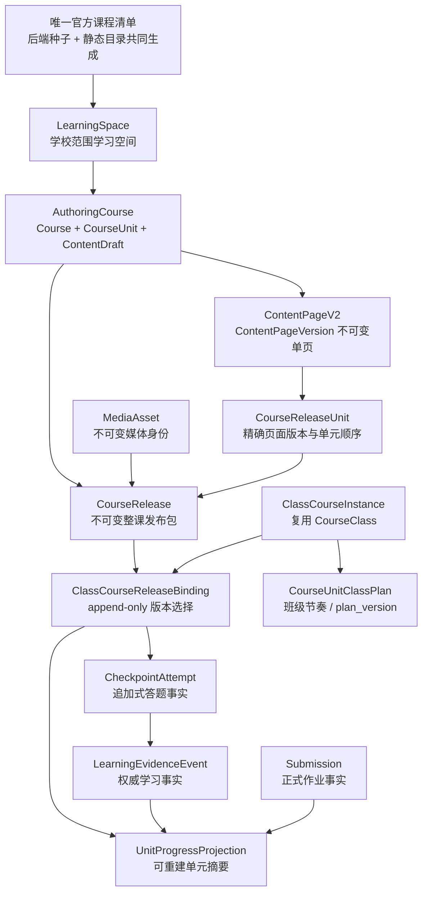

依赖方向固定为：

```text
官方 manifest / 教师草稿
    ↓
ContentPageVersion + Course/CourseUnit 可编辑结构
    ↓ 发布
CourseRelease + CourseReleaseUnit 不可变包
    ↓ 挂班或切版
CourseClass + 最新 ClassCourseReleaseBinding
    ↓ 学习
CheckpointAttempt / LearningEvidenceEvent / Submission 权威事实
    ↓ 投影
UnitProgressProjection / 教师回读 / 学生续学
```

任何学生读取都必须从班级 binding 定位 release，再从 release unit 定位页面与检查点；禁止从可编辑 `CourseUnit.content_slug` 直接跳到最新内容页。任何教师编辑都只修改草稿和 authoring aggregate；已被班级选择的 release 不可原地变化。

### 19.3 十个逻辑对象的存储映射

| 逻辑对象 | 当前可复用实现 | V8.1 存储落点 | 唯一职责与迁移动作 |
| --- | --- | --- | --- |
| `LearningSpace` | `Course.school_id + galaxy_key` | 新表 `learning_spaces` | 以学校和稳定 `space_key` 组织官方安装空间或教师主题星系；按现有 course 的 distinct 组合回填 |
| `AuthoringCourse` | `Course`、`CourseCollaborator`、`CourseUnit`、`Assignment` | 继续复用原表 | 只承担可编辑课程结构，不再承担学生所用版本 |
| `ContentPageV2` | `ContentPageRecord`、`ContentDraft`、`ContentPageVersion` | 继续写 `content_page_versions.schema_json` | 新写入带 V2 schema 标识；已发布 page version 不可变 |
| `CourseRelease` | 现有课程状态、页面版本、完成规则可提供输入 | 新表 `course_releases` | 冻结整门课程结构、package hash、发布者、来源和规则身份 |
| `CourseReleaseUnit` | `CourseUnit.activity_key/content_slug` | 新表 `course_release_units` | 冻结 unit key、顺序、精确 page version、检查点和来源单元 lineage |
| `ClassCourseInstance` | `CourseClass`、`CourseUnitClassPlan`、`AssignmentClassPolicy` | 继续复用 `course_classes` | 表示“一门学校课程在一个班中的教学实例”；`plan_version` 只表示班级发布计划 |
| `ClassCourseReleaseBinding` | `CourseClass` 与 `LearningRuleClassBinding` 提供 scope | 新表 `course_class_release_bindings` | 每次选择或切换 release 追加一条 revision；当前版本只取最高 `binding_revision` |
| `MediaAsset` | `ContentScriptAsset` 仅可提供脚本缓存反例 | 新表 `media_assets`，关联表 `course_release_media_assets` | 保存一般图片、音视频或受审外部引用的不可变摘要和存储身份 |
| `CheckpointAttempt` | `Submission` 与 `LearningEvidenceEvent` 提供相邻领域 | 新表 `checkpoint_attempts` | 保存有界答案、评价和重试事实；正式作业仍归 `Submission`，学习时间线仍归 evidence |
| `UnitProgressProjection` | `LearningActivityProjection`、`LearningResumeProjection`、`Submission` | 新表 `unit_progress_projections` | 按 subject + class binding + release unit 汇总；随权威事实重建，禁止客户端直接修改 |

#### 19.3.1 LearningSpace 不是第四套授权系统

`LearningSpace` 固定为学校范围聚合：官方 manifest 安装到某校后形成 `source_kind=official` 的空间；教师新建主题星系形成 `source_kind=school` 的空间。两者都继续受 `SchoolMembership`、课程 owner/collaborator 和 class scope 约束。空间只组织课程和展示元数据，不直接授予班级、课程编辑或学习权限。

回填时按 `Course.school_id + Course.galaxy_key` 建立空间，并在 `Course` 增加 `learning_space_id`。兼容期继续回显原 `galaxy_key`，但 V2 写入必须先解析 `LearningSpace`；待全部代码改用 relation 后，`galaxy_key` 只作为兼容标识，不再成为新的关系 owner。

#### 19.3.2 CourseRelease 与 ContentPageVersion 的关系

`ContentPageVersion` 冻结“一页写了什么”，`CourseRelease` 冻结“这门课以怎样的顺序使用哪些页、模拟、检查点、媒体和规则”。发布包不得复制一份可独立修改的 page JSON；`CourseReleaseUnit` 必须引用精确 `content_page_version_id`，同时在 package JSON 中保存可对账的 schema hash。

发布包形成后只允许：

1. 创建下一 release；
2. 将班级切换到既有 release；
3. 以既有 release 为来源建立新草稿；
4. 标记 release 不再推荐给新班级。

禁止 UPDATE 已发布 package、页面引用、checkpoint 定义、media digest 或 completion rule。所谓“回滚”是为班级追加一个指向旧 release 的新 binding revision，不是修改或删除历史。

#### 19.3.3 CourseClass 与班级版本历史

`CourseClass` 继续是 `ClassCourseInstance`，唯一范围仍为 `course_id + class_id`。现有 `plan_version` 只表示 release plan 的 CAS 令牌；现有 `LearningRuleClassBinding.plan_version` 继续把规则绑定到同一计划版本。两者都不得保存 `CourseRelease.id`。

新表 `course_class_release_bindings` 使用：

- `course_class_id`：指向班级课程实例；
- `course_release_id`：本 revision 使用的不可变发布包；
- `binding_revision`：在一个 `course_class_id` 内从 1 单调递增；
- `bound_by_user_id/bound_at/reason`：审计字段；
- 唯一约束：`course_class_id + binding_revision`。

不增加 `is_current` 与可修改 current pointer。当前 binding 只由最高 `binding_revision` 得出，避免“指针说 A、历史最后一条说 B”两套真值。并发切版由锁定 `CourseClass` 后比较 expected binding revision 解决。

### 19.4 版本唯一真值矩阵

| 问题 | 唯一真值 | 明确不是 |
| --- | --- | --- |
| 教师正在编辑什么 | `ContentDraft` 与 `Course/CourseUnit` authoring rows | `ContentPageRecord.current_version_id`、班级 binding |
| 某一页发布了什么 | `ContentPageVersion.id + schema_hash` | mutable draft、静态文件修改时间 |
| 某门课发布了什么 | `CourseRelease.id + package_sha256` | `Course.status`、页面 latest version、`plan_version` |
| 某班现在学哪个版本 | 该 `CourseClass` 最高 `binding_revision` | `Course.current_release_id`、前端缓存、URL 参数 |
| 某班哪些单元何时开放 | `CourseClass.plan_version + CourseUnitClassPlan` | CourseRelease 的 immutable 顺序、页面本地状态 |
| 某班使用哪条完成规则 | 对应计划 revision 的 `LearningRuleClassBinding` | ContentPage 中的客户端布尔值 |
| 学生做过什么 | `LearningEvidenceEvent`、`CheckpointAttempt`、`Submission` | `UnitProgressProjection`、localStorage、动画状态 |
| 学生单元摘要 | 可由上述事实重建的 `UnitProgressProjection` | 第二套完成事件表 |

切换 CourseRelease 后，旧 binding 下的 attempt、evidence 与 progress 继续保留。新 release unit 若声明 lineage 对应旧 release unit，投影服务可以显示历史来源，但不得把旧 completion 自动写成新 release completion。是否保留访问权继续使用现有 `LegacyAccessEntitlement` 语义；它只影响访问，不冒充完成。

### 19.5 学习和切版时序

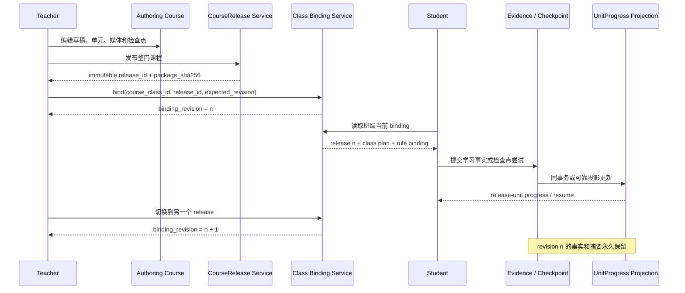

学生写入必须携带 `class_course_release_binding_id` 与 `course_release_unit_id`。服务端再次确认两者属于同一 `CourseClass`，且该 binding 是否仍允许新写；刷新恢复必须返回原 binding 范围，不能把旧尝试静默迁入最新版本。

检查点结果的 owner 分开：

- `CheckpointAttempt` 保存学生答案、checkpoint 版本、形成性评价、可信评分来源和重试关系；
- `LearningEvidenceEvent` 保存它在学习时间线中产生的 `attempted/corrected/explained` 等事实；
- `UnitProgressProjection` 只消费两者和正式作业，不复制完整答案或重写规则。

### 19.6 ContentPage V1 → V2 与接口兼容

ContentPage V1 → V2 使用确定性读取适配，不原地改写历史 `ContentPageVersion`：

| V1 section | V2 block | 适配规则 |
| --- | --- | --- |
| `hero` | `hero` | 保留稳定 id、标题、摘要和展示属性 |
| `learning-task` | `learning-task` | 保留目标、概念和任务提示 |
| `experiment` | `official-simulation` | 只接受平台注册的 simulation key；忽略任意 script 扩张能力 |
| `assessment` | `checkpoint` | 把既有 question set 引用转换为只读 checkpoint 引用 |
| `source-list` | `sources` | 保留来源 id、标题、URL 和用途 |

V2 新增 `rich-text` 与 `media`。富文本以 Markdown 为 canonical source，渲染 HTML 只是派生结果；媒体只能引用 `MediaAsset`。V2 仍禁止任意 HTML、任意 JavaScript、远程 iframe 和未登记 simulation。详细 schema 与正反样例交给 `CONTENT-010 / V8.1.2`，本节只冻结 owner 和兼容方向。

接口边界固定如下：

| 接口面 | V8.1 职责 |
| --- | --- |
| 旧 `/api` | 保持现有课程、release plan、内容页、作业和证据响应；V2 数据存在时通过 adapter 产生旧 DTO |
| 新 `/api/v1` | 唯一允许创建或读取 V2 learning space、course release、class binding、media、checkpoint attempt 和 unit progress 的接口面 |
| 静态展示包 | 只读取 canonical manifest 生成的目录和批准 release/page/media，不模拟登录、班级或学习数据 |

禁止旧 endpoint 与新 endpoint 各自实现一套发布、切版或进度算法。新领域规则进入 service；旧 endpoint 只调用 service 并转换 DTO。等价读取合同稳定后才能逐步迁移前端调用方。

### 19.7 DATA-008 迁移顺序与回退边界

`DATA-008` 必须按以下顺序实施，不能一次建完表后再猜回填：

1. 建立 `learning_spaces`，按 distinct school/galaxy 回填，并给 `Course` 建立 relation；
2. 建立 `media_assets`，但不迁移 `ContentScriptAsset`；现有普通静态文件只在 canonical manifest 明确登记后进入媒体表；
3. 以现有 published Course、CourseUnit、ContentPageVersion 和 active completion rule 生成初始 `CourseRelease/CourseReleaseUnit`；缺少精确 page version 或规则时失败关闭并登记，不伪造 release；
4. 为每个 active `CourseClass` 建立 revision 1 binding；若其 course 没有可用 release，则保持无 binding 并让 V2 读取明确返回未迁移状态；
5. 建立 checkpoint attempt 和 unit progress 表，从权威 evidence/submission 回填 projection；不把旧 `LearningEvent.complete` 无条件升级为 V2 completion；
6. 增加 V2 service 读取并与旧接口对账；只有对账通过后才开放 V2 写入；
7. SQLite 空库、现有库、升级—降级—升级和 MySQL offline DDL 全部通过后，才允许 `BE-022` 接入。

降级只删除 V8.1 新 projection、binding、release、media 和 space 结构，不删除或改写 V1 content、Course、CourseUnit、CourseClass、作业、提交或学习证据。若迁移已经产生 V2 写入事实，生产语义降级必须先导出和确认；Alembic 技术 downgrade 通过不等于可以丢弃真实用户数据。

### 19.8 ARCH-009 验收与后续写入边界

ARCH-009 完成条件：

1. 十个逻辑对象均有当前映射、目标存储、身份、mutability 和 truth owner；
2. `CourseRelease`、班级最高 binding revision、release plan、规则绑定和进度投影不存在职责重叠；
3. V1 → V2、旧 `/api` → `/api/v1` 和 canonical manifest → 后端/静态双输出方向明确；
4. 历史候选曾由 `content-platform-architecture-contract.cjs` 核对机器合同、本文和当时模型基线；该合同现已退役，不能作为当前门禁；
5. 完整 `npm test` 继续通过，现有内容、发布计划、课程访问和学习证据合同不退化。

后续任务边界：

- `CONTENT-010` 只能定义 V2 schema、V1 adapter 和验证器，不创建数据库表；
- `DATA-008` 只能按本节映射建表、约束和回填，不改页面；
- `BE-022` 只能通过 service 实现 `/api/v1` 与旧 adapter，不在 endpoint 复制算法；
- `DEV-002` 必须用真实 release/binding/attempt/progress 证明纵向样例，不能用 fixture 或静态 JSON 冒充数据库闭环。

### 19.9 DATA-008 落地对照

`20260823_0054` 已按 19.7 的顺序实现八张新表及 `Course.learning_space_id` 兼容关系，模型 owner 为 `backend/app/models/content_platform.py`。实现没有改动页面、旧 endpoint 或现有发布计划算法。

| 19.7 要求 | 0054 实现结果 |
| --- | --- |
| school/galaxy 学习空间 | 所有既有 Course 均确定性回填；同校同 key 唯一 |
| 普通媒体独立于脚本资产 | `media_assets` 与 release-media 关联已建；不读取 `content_script_assets` |
| 完整课程才生成初始发布包 | page current version、active rule 或发布单元任一不完整时，整课不生成 release |
| active 班级 revision 1 | 只为已有 release 的 active CourseClass 建 binding；不修改 `plan_version` |
| 权威事实回填进度 | 只消费 evidence/submission；legacy `LearningEvent.complete` 不进入完成判断 |
| 技术往返与方言 | 空库、既有库、0053→0054→0053→0054、MySQL 模型 DDL 和动态唯一 head 均有自动测试 |

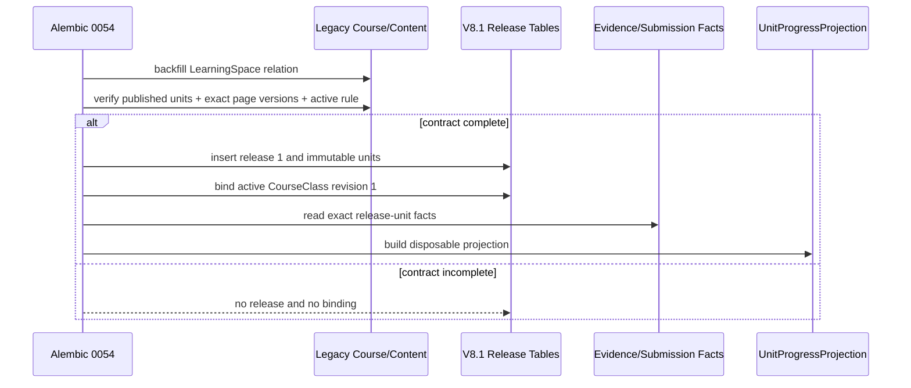

过渡期把 `Course.learning_space_id` 保持为 nullable 数据库字段，是为了不让尚未改造的旧 `/api` 课程创建路径在 DATA-008 阶段回退；迁移结束时所有既有课程均保证非空。`BE-022` 必须让 V2 写入显式解析 LearningSpace，并让 V2 读取把 NULL 表述为“未迁移”，不得静默猜测 `englab`。

### 19.10 BE-022 服务与接口落地对照

`BE-022 / V8.1.4` 已把 `/api/v1` 实现为 endpoint → service → model 三层。`backend/app/api/endpoints/content_platform.py` 只解析 HTTP DTO 和翻译领域错误；`backend/app/services/content_platform.py` 独占权限组合、事务锁、发布包冻结、学生答案脱敏、检查点幂等和进度投影重建；八张表仍由 `app.models.content_platform` 持有。旧 `/api` 没有复制一套新算法，也没有被强制重定向到未稳定的 DTO。

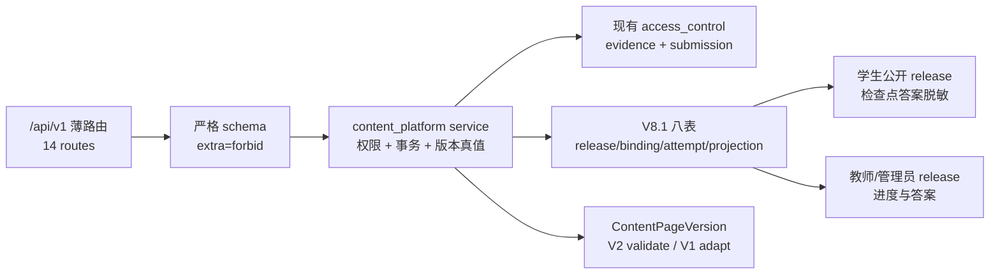

| 冻结要求 | 实现结果 |
| --- | --- |
| `CourseRelease` 是整课版本唯一真值 | 发布服务引用精确 page version、active completion rule 和媒体 hash；package 未变化拒绝重复 release |
| 班级最高 binding revision 是选版真值 | POST 必须携带 `expected_revision`；只追加新行，旧 binding 不被修改 |
| 学生不从可编辑 CourseUnit 读“最新内容” | 学生先定位当前 binding，再定位 release unit 和冻结 page version |
| V1 历史不原地改写 | release 读取时确定性适配为 V2；历史 schema JSON 与旧 endpoint 均不写回 |
| 检查点不成为第二完成真值 | attempt 只追加 attempted evidence；完成仍以 completed/transferred 权威 evidence 为准 |
| GET 不制造事实 | 空单元返回 not-started 视图，首个正式 attempt/evidence/submission 到来后才建立 projection |
| 角色与范围隔离 | 教师 authoring、管理员全局治理、学生本人/本班读取和跨校跨班拒绝均有 API 合同 |

当前接口面包含学习空间 2 个、课程草稿/单元 4 个、媒体 2 个、课程发布 2 个、班级 binding/release/progress 3 个、检查点 1 个，共 14 个路由。V1 内容兼容发生在 release service 的读取边界；在没有旧前端消费 V2 authoring 事实之前，旧 endpoint 保持原实现是当前最小兼容策略。后续若旧 endpoint 需要读取 V2 数据，只允许调用同一 service 并转换旧 DTO，不允许自行查询 release/binding 表。

自动化证据：`test_content_platform_api.py` 4 项覆盖完整角色与纵向合同；与 V2 schema 和 0054 migration 合同合计 25 项；完整 `npm test` 为 239 JS、61/61 合同。浏览器可见旅程、管理员审批界面和刷新恢复仍属于 `DEV-002 / QA-031`，本节不把 API fixture 冒充最终竞赛演示证据。

## 20. ARCH-010 V8.4 通用课程与动态发布修正

本节是父规划 `ARCH-010` 的目标边界。第 19 节继续保存 V8.1 候选怎样形成，但其中“行政班课程实例固定 release”的产品解释不再作为 V8.4 目标。

### 20.1 当前候选与 V8.4 目标

| 范围 | 当前候选 | V8.4 目标 |
| --- | --- | --- |
| 行政班 | `CourseClass` 同时承担课程运行范围 | 只表示 `ClassGroup(kind=homeroom)` 的学生身份和准入条件 |
| 课程成员 | 依赖班级成员 | 新增 `CourseEnrollment`，允许无行政班学生 |
| 证据 class scope | 使用真实行政班 | 每门正式课程建立隐藏 `course_cohort`，现有证据和作业复用该 scope |
| 课程发布 | 教师发布 release 后由班级选择版本 | 发布后给隐藏课程群组追加 binding，所有课程成员读取最新版本 |
| 管理审核 | 候选包含内容审批动作 | 只审批 `CourseInformationRevision`，不审批知识内容 |
| 教师协作 | 已有 `CourseCollaborator` | 所有有效共同教师编辑一个共享草稿并能显式发布 |

### 20.2 新关系的职责

- `TeacherApplication` 只决定普通账户是否提升为教师，不代替 `User.role`。
- `CourseInformationRevision` 保存课程信息审批快照，不保存章节正文。
- `CourseAdmissionClass` 保存指定班级课程允许哪些行政班申请。
- `CourseJoinRequest` 保存学生申请和教师处理事实。
- `CourseEnrollment` 保存学生实际课程成员关系，并可记录来源行政班。
- `ClassGroup(kind=course_cohort)` 是兼容内部范围，不进入行政班列表、班级申请或用户可见名称。

这些对象的目标类图只在父规划 P-02、P-03 维护；本节不复制第二份 UML 权威原件。

### 20.3 发布真值修正

`CourseRelease` 继续保持不可变，`CourseClassReleaseBinding` 继续只追加 revision。变化只在绑定对象和产品语义：

1. 每个正式课程只有一个隐藏课程群组和对应 `CourseClass`。
2. 首次课程信息批准时，从当前共享草稿建立初始 release 和 binding revision 1。
3. 任一共同教师后续发布时，建立 release N 并追加 binding revision N。
4. 学生读取课程时按 enrollment 找到课程，再读取隐藏群组最高 binding revision。
5. 旧行政班不再分别选择课程版本；旧 release 和旧学习事实仍永久保留。

这能继续复用候选 append-only binding、检查点和进度投影，同时避免让教师面对“同一门课程不同班级卡在不同版本”的复杂管理。

### 20.4 信息审核与内容发布分离

管理员批准 `CourseInformationRevision` 时负责课程码、已批准信息、共同教师、内部群组和首次 release 的一致事务。课程运行后，信息修订被拒绝不影响旧信息。

教师发布知识内容时不调用管理员内容审批接口。`ContentPageVersion` 和 `CourseRelease` 的 schema 验证、答案脱敏、媒体摘要和不可变规则继续生效；“不需要管理员批准”不等于允许任意脚本或绕过验证。

### 20.5 接口与兼容

新业务使用父规划冻结的 `/api/v1/teacher-applications`、课程信息修订、课程申请、课程成员、草稿和 release 接口族。旧 `/api/auth/register`、`/api/courses`、班级、作业和证据接口保持兼容，逐步改为调用同一 service，不复制领域算法。

`20260823_0054` 和 `BE-022` 当前仍是工作区候选。后续实现必须先按本节复核模型与 service，再决定保留、扩展或替换具体候选代码；不得因为文档写出目标对象就宣称迁移已经完成。
