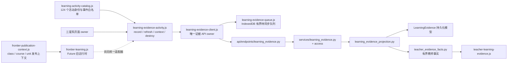
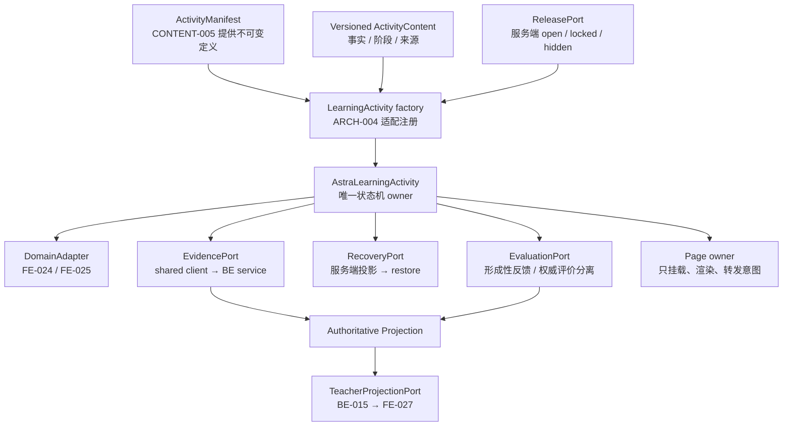
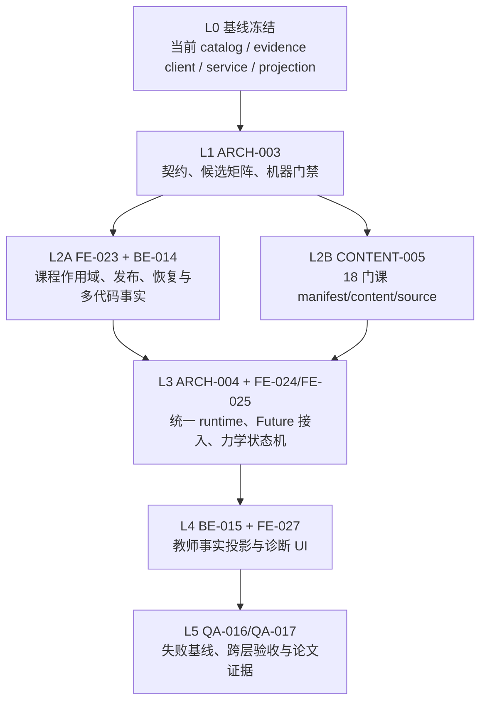
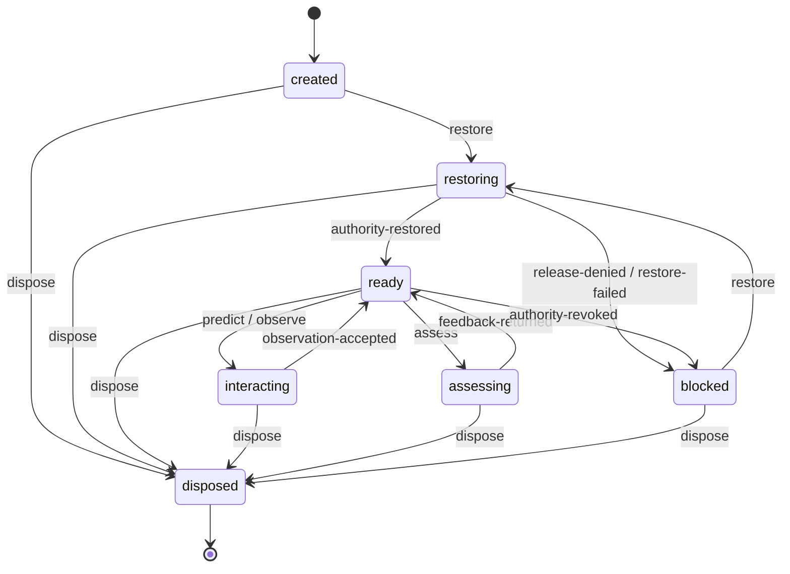
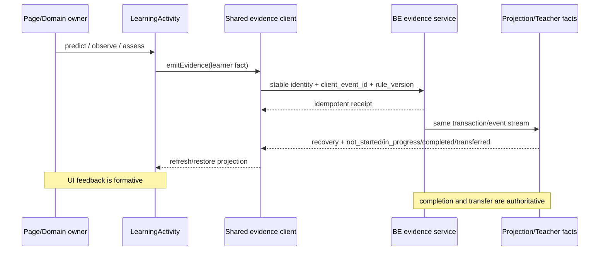

# 星序 Astra — V7.6—V8.0 全栈模块边界与 LearningActivity 契约

> 该文档隶属于[02-项目规划.md](../02-项目规划.md)，负责 `ARCH-001` 的前后端模块职责与 `ARCH-003` 的 LearningActivity 契约、遗留候选处置、自动门禁和迁移顺序；正式任务状态、版本和认领仍只在父文档维护。
>
> **内容性质**：本文描述 V7.6 架构契约和已建立的仓库门禁。当前稳定实现见 [`01-开发者文档.md`](../01-开发者文档.md)，后端现状见 [`07-后端优化与设计.md`](../07-后端优化与设计.md)，提交事实见 [`03-开发历史.md`](../03-开发历史.md)。
>
> **最后一次更新时间**：2026-08-09　**更新者**：ARCH组

---

## 目录

1. [架构结论](#1-架构结论)
2. [依赖方向](#2-依赖方向)
3. [后端模块边界](#3-后端模块边界)
4. [前端模块边界](#4-前端模块边界)
5. [稳定接口](#5-稳定接口)
6. [遗留冻结面](#6-遗留冻结面)
7. [自动门禁](#7-自动门禁)
8. [迁移与协作](#8-迁移与协作)
9. [验收与维护](#9-验收与维护)
10. [ARCH-003 冻结基线](#10-arch-003-冻结基线)
11. [现状架构](#11-现状架构)
12. [目标模块架构与迁移分层](#12-目标模块架构与迁移分层)
13. [LearningActivity 最小契约](#13-learningactivity-最小契约)
14. [跨组端口与第一波禁区](#14-跨组端口与第一波禁区)
15. [遗留候选处置矩阵](#15-遗留候选处置矩阵)
16. [V8 机器门禁与验收](#16-v8-机器门禁与验收)

---

## 1. 架构结论

V7.6 不以一次性重写前后端为目标。ARCH-001 先建立“新功能必须进入明确责任模块、跨域只能通过稳定接口、遗留巨型文件只减不增”的硬边界，再让 BE-006 和 FE-012 在该边界内实现权威学习证据。

冻结原则：

1. HTTP 路由只处理请求/响应、身份依赖和错误映射；领域规则进入服务层。
2. 持久化模型不依赖 schema、service 或 API；schema 不依赖 model、service 或 API。
3. 跨领域调用只通过服务接口或不可变 DTO，不从一个 endpoint 导入另一个 endpoint 的业务实现。
4. 页面 owner 不直接实现学习证据写入、重试、离线队列或完成算法；三星系通过共享客户端消费同一服务端合同。
5. Router、主入口、角色巨型脚本和旧学习事件文件进入冻结面；新逻辑建立新模块，迁移后删除旧逻辑。
6. 产品能力名称和可用状态只有一个注册表；页面不能独立发明“已可用”声明。
7. 架构例外必须由主开发修改机器可读边界清单并说明迁移原因，工作组不得为通过测试自行扩大 allowlist。

## 2. 依赖方向

### 2.1 总体方向

```text
浏览器页面 owner
    ↓
共享领域客户端 / 产品能力注册表
    ↓
AstraApiClient
    ↓
FastAPI endpoint（HTTP 适配）
    ↓
领域 service / policy / projection
    ↓
SQLAlchemy model / database
```

反向依赖一律禁止。数据库模型不知道 HTTP，领域服务不知道页面，页面不知道表结构。

### 2.2 领域关系

```text
身份会话 ──> 组织范围 ──> 课程与发布
                         ├──> 学习证据 ──> 进度/续学投影
                         ├──> 作业与普通提交 ──┐
                         └──> 代码提交/判题 ───┴──> 学习证据事实引用

内容创作 ──> 版本化课程/完成规则
治理模块 ──> 各领域的只读摘要与受约束命令
```

学习证据可以引用提交或判题事实，但不得复制判题状态机；提交/判题可以通知学习证据服务，但不得直接写学习事件表。

## 3. 后端模块边界

### 3.1 技术分层

| 层 | 允许职责 | 禁止职责 |
| --- | --- | --- |
| `app/api/endpoints/` | 参数、身份依赖、调用服务、HTTP 状态和 response model | SQL 查询、完成规则、幂等算法、跨域聚合 |
| `app/schemas/` | 请求/响应 DTO、字段校验和稳定枚举 | ORM、数据库查询、服务调用 |
| `app/services/` | 领域规则、权限策略、事务、幂等、投影和跨域服务接口 | 导入 endpoint、构造前端文案 |
| `app/models/` | 表、索引、唯一约束和持久化关系 | 导入 API/schema/service、业务流程 |
| `app/api/router.py` | 导入 router 并登记 prefix/tag | 任何领域逻辑 |
| `app/main.py` | 应用工厂、中间件和进程生命周期 | 课程、学习、提交或治理业务 |

### 3.2 BE-006 新模块

后端组必须优先建立以下独立边界；可以按实际模型拆成更细文件，但不得回填进旧巨型文件：

| 建议位置 | 唯一职责 |
| --- | --- |
| `backend/app/models/learning_evidence.py` | 完成规则版本、学习事件、幂等键、纠正关系、历史访问权益和投影游标 |
| `backend/app/schemas/learning_evidence.py` | 事件批次、确认、规则、活动状态、续学和教师纠正 DTO |
| `backend/app/services/learning_evidence.py` | 写入验证、权限、幂等、乱序、规则绑定和追加式纠正 |
| `backend/app/services/learning_evidence_projection.py` | 学生活动状态、上次位置、教师聚合和重建 |
| `backend/app/api/endpoints/learning_evidence.py` | 新合同 HTTP 适配，不直接导入 ORM model |
| `backend/tests/test_learning_evidence*.py` | 幂等、乱序、重放、发布状态、角色、纠正、恢复和投影一致性 |

旧 `/api/learning-events`、`progress.py` 和课程矩阵在 V7.6 内作为兼容读取保留，不继续扩展为新合同。新投影稳定后再把兼容端点改为调用新服务；任何双写必须有失败原子性和移除日期，禁止长期存在两套完成算法。

## 4. 前端模块边界

### 4.1 技术分层

| 层 | 允许职责 | 禁止职责 |
| --- | --- | --- |
| `AstraApplicationSession` | Cookie 会话、当前用户、角色资源门禁 | 学习完成和课程推荐 |
| `AstraPageRegistry` / Router | 页面身份、资源、enter/leave 和导航 | 业务 API、课程状态和离线队列 |
| 页面 owner | 渲染、交互、焦点和生命周期 | 直接决定权威完成、复制网络/重试算法 |
| `AstraLearningEvidenceClient` | 唯一学习证据 API、批次确认、状态回读 | 页面布局和课程专属动画 |
| `AstraLearningEvidenceQueue` | IndexedDB 队列、重试、租约、对账和清理 | 使用 localStorage 保存敏感学习事实 |
| `AstraRoleHomeClient` | 按角色聚合首页任务、作用域问题、续学和工作区行动 | 静默选择第一班级/课程、运维队列或页面布局 |
| `AstraProductCapabilities` | 能力名称、角色、四态、规范路由和声明边界 | 权限判断或动态业务聚合 |
| `AstraApiClient` | Cookie 同源请求、超时/取消、错误归一和未知结果 | 学习领域规则 |

### 4.2 三星系适配

工科试验室、代码空间和未来星系只把用户动作转换为稳定的领域命令：

```text
activity_key + rule_version + event_type + evidence + occurred_at + client_event_id
```

页面不得提交 `completed=true` 让服务端照单全收。服务端根据规则和既有事件派生完成状态；客户端只展示确认后的投影与本地待同步差异。

每个页面 owner 离开时必须取消观察器、请求和渲染循环，但未同步队列属于账号级共享模块，不能随页面销毁而丢失。

`AstraRoleHomeClient` 只能聚合身份/作用域、角色任务和 `AstraLearningEvidenceClient` 返回的续学投影；它不能另建进度状态机、直连学习证据 API 或把第一个班级/课程静默当成当前作用域。未同步提示组件是无状态展示层，同步、重试、租约和对账仍分别归 evidence client/queue。

## 5. 稳定接口

### 5.1 产品能力

[`shared/js/product-capabilities.js`](../../shared/js/product-capabilities.js) 提供不可变 `AstraProductCapabilities`：

- `all()`：返回能力快照；
- `get(key)`：按稳定键读取；
- `forRole(role)`：读取角色可见能力；
- `canPresentAsPrimary(key)`：只有 `available` 且存在规范路由时为真。

该注册表只表述产品能力，不替代后端权限。FE-012 接入页面前必须由能力合同和真实 API 状态共同决定文案；`partial/planned/unavailable` 不能被主行动按钮包装成可用。

### 5.2 学习证据服务端最小语义

ARCH-001 只冻结跨层语义，不替 BE-006 决定最终 URL 或数据库列名：

1. 客户端提供稳定 `client_event_id`、活动键、规则版本、发生时间和事件载荷。
2. 服务端返回每项 `accepted/duplicate/rejected/conflict` 结果及权威事件 ID。
3. 同一用户/设备重放相同 `client_event_id` 必须返回同一事实，不新增计数。
4. 旧规则、未来时间、隐藏/锁定/归档资源、跨角色/跨班级和不合法状态转换必须显式拒绝。
5. 活动状态和上次位置由服务端投影回读；离线客户端不得自行合并成权威完成。
6. 教师纠正是新的追加式事实，保留原事件和操作者/原因；禁止 UPDATE/DELETE 擦除学习历史。
7. 学习者事件使用 `started/predicted/attempted/corrected/explained`；实验“操作”编码为 `attempted.evidence`，不再创建含义重叠的 `operated` 事件。`completed/transferred` 只能由规则服务或受信评测产生。学习者的“修正了答案”与教师行政纠错是两个模型，禁止共用一个含糊事件。
8. 规则版本由课程 owner、具备 `assessment_editor` 权限的协作者或管理员创建；激活必须经过 course edit scope、当前版本 CAS 和审计。班级发布计划固定所用规则版本，已激活版本不可原地修改。
9. `transferred` 只表示学生完成了与原情境不同的教学迁移任务，不能用于数据库迁移或兼容授权。历史 `complete` 不自动升级为新规则下的完成；如需避免升级后重新锁住已访问内容，只能在独立兼容表追加 `legacy_access_entitlement`，记录 subject、class、prerequisite unit、旧事件来源、迁移 revision 和创建时间。该权益只影响访问/先修门禁，不进入学习证据、完成率、教师掌握判断或 `transferred` 统计；界面至多表述“按旧记录保留访问”。
10. 资源后来 hidden/locked/archived 时，新的事件仍拒绝；同一已认证 subject 对自己已成功事件的精确幂等重放只返回最小回执，不返回标题、内容或其他资源元数据，不新增写入。账号、subject 或 actor 不匹配仍拒绝。

### 5.3 离线与投影时限

`AstraLearningEvidenceQueue` 是唯一获准的短期浏览器持久化例外，但它不是权威账本：

1. 只能使用 IndexedDB；禁止 localStorage、sessionStorage、Service Worker Background Sync 或公共 CacheStorage。
2. 以 origin + 当前账号的不可逆命名空间隔离，退出、401、账号/角色变化时立即清除；最长保留 7 天、256 个事件或 1 MiB，任一上限先到即停止新增并提示联网。
3. 只保存重放所需的稳定键、规则版本、事件类型、时间、规范化的有界结构化证据和请求哈希；结构化 `explained` 证据可排队，自由文本解释必须联网。禁止保存姓名、账号、Cookie/token、成绩、教师评语、源码、完整答案或页面快照。
4. UI 必须区分“本地待同步、同步中、已确认、需人工处理”；模糊失败先按 `client_event_id` 对账，不能盲目生成新键。
5. 服务端同一事务提交事件与活动投影，提交后读必须立即可见；在线教师页面在本机验收环境中最多 5 秒显示权威变化。该 5 秒是 QA-014 的产品可见性门禁，不替代数据库一致性断言。

具体 schema、迁移和状态机由后端组在 BE-006 交付说明中冻结，前端只消费该合同。

## 6. 遗留冻结面

[`tools/architecture/v76-module-boundaries.json`](../../tools/architecture/v76-module-boundaries.json) 固定 V7.6 起点。以下文件进入只减不增门禁：

- `index.html`、`shared/js/main.js`、`shared/js/router.js`；
- 学生、教师和管理员巨型脚本；
- `backend/app/main.py`；
- 旧课程模型/schema、学习事件、进度、知识、课程和发布计划巨型文件。

行数门禁不是“行数越少架构越好”的替代品，而是阻止工作组把新跨域逻辑继续塞回遗留文件。需要修改兼容接线时，应先抽取等量或更多旧职责，或由主开发审查并更新架构决策。

现有 endpoint 直接导入 ORM model、service 反向导入 endpoint、endpoint 之间互相导入和多处资源版本常量被登记为遗留例外。门禁冻结其精确集合：

- 允许逐步删除；
- 禁止增加新文件、新 import block 或新版本表；
- 任何例外变化必须由主开发更新清单并写入 03，不能由实现组静默放宽。

## 7. 自动门禁

[`tools/tests/architecture-boundary-contract.cjs`](../../tools/tests/architecture-boundary-contract.cjs) 自动验证：

1. 遗留巨型文件不超过冻结行数。
2. 新 endpoint 不通过绝对、子模块或相对导入直接依赖 ORM model；既有 endpoint/model import block 不静默扩大。
3. model/schema/service 不通过绝对或相对导入反向依赖 API，endpoint 不导入 peer endpoint；既有跨层例外不增加。
4. `.js/.mjs/.cjs` 中的学习证据 API 字面量只允许出现在共享 learning-evidence client。
5. `AstraRoleHomeClient`、`AstraLearningEvidenceClient`、`AstraLearningEvidenceQueue` 和 `AstraProductCapabilities` 各有唯一全局 owner；直接赋值、逻辑赋值、属性描述符、`Object.assign` 与 `Reflect` 注册均视为定义。
6. `LearningProgress.markVisited` 不增加调用者。
7. 不新增资源版本常量表。
8. 产品能力注册表的完整键/状态集合必须与机器清单精确一致，证据来源和禁止声明完整且不可变；“账号级上次学习位置”在 BE-006/FE-012 交付前固定为 `planned`。
9. 正向扫描器带有仓库内无副作用反例，能识别绝对/相对 endpoint→ORM、service→API、endpoint→peer endpoint、`.js/.mjs/.cjs` 页面直连学习证据 API、直接/间接重复全局 owner 和新增版本表。

该门禁由 `npm test` 自动发现执行。BE/FE 提交前必须在自己的 worktree 运行；测试失败时应移动职责或报告架构冲突，不得删除断言、扩大 allowlist 或把文件改名规避扫描。

## 8. 迁移与协作

### 8.1 V7.6 顺序

1. 主开发提交 ARCH-001 边界和门禁。
2. 主开发把精确 revision 同步到后端、前端和 QA 工作组。
3. 后端组基于新模块完成 BE-006；只在新服务合同通过后冻结 URL/schema。
4. 前端组在后端冻结后实现共享客户端、队列、星序首页和三星系适配。
5. 主开发逐组集成，解决跨组冲突；实现组不得互相合并。
6. QA 在精确集成 revision 上只读验收。

### 8.2 非重叠责任

| 工作 | 唯一主责 | 其他组 |
| --- | --- | --- |
| 产品能力与入口口径 | 主开发/PM | FE 消费，QA 对账 |
| 架构清单与 allowlist | 主开发/ARCH | BE/FE 只能报告冲突 |
| 服务端事件、规则、投影与迁移 | 后端组/BE-006 | FE 不实现替代算法 |
| 客户端、队列、首页与三星系接入 | 前端组/FE-012 | BE 不修改页面 |
| 最终证据与缺陷分级 | QA/QA-014 | 失败退回唯一原组 |

## 9. 验收与维护

ARCH-001 的首片在以下条件满足时可以完成：

1. 本文、机器可读边界清单、能力注册表和自动合同相互一致。
2. `npm test` 能拒绝新增 endpoint→model、底层→API、页面直连学习证据 API、重复全局 owner、访问进度新调用者、资源版本表和冻结文件增长。
3. 现有前端合同、文档和项目对接门禁继续通过。
4. 后端/前端工作组分别确认其 BE-006/FE-012 方案可以落在登记边界中；有冲突时先由主开发修订架构，不让工作组各自绕过。
5. QA-014 把架构反例注入纳入最终矩阵。

维护规则：

- 新领域先在 02 建立任务，再由 ARCH 登记 owner、依赖和门禁。
- 删除遗留例外时同步收紧清单；禁止保留已经不需要的 allowlist。
- 如果路径移动，必须同次更新本文、机器清单、测试、01/07/08 和引用。
- ARCH-001 只关闭边界首片；V7.9 的 FE-016、BE-010 和 TOOLS-001 继续负责完成全量拆分、legacy 清零和依赖工具化。

## 10. ARCH-003 冻结基线

本节是 `ARCH-003` / `V8.0.0` 的专业契约，不改变 02 中的任务状态。盘点基线固定为 `aec0587f643190e2c435ff88945d4f9066dd5316`（V7.9.73），ARCH 分支为 `codex/astra-v8-arch`。本轮只允许修改本文、`tools/architecture/v76-module-boundaries.json` 和 `tools/tests/architecture-boundary-contract.cjs`；没有产品代码、共享 01/02/03 文档、服务状态或遗留工作树写入。

候选快照使用“已跟踪工作区内容哈希 + 未跟踪内容哈希 + index entry 哈希”的规范化串计算 SHA-256；`c003` 因物理目录已不存在，只对 ref 与 worktree registry block 做 Git 元数据快照。计数顺序统一为“tracked modified / staged / untracked”。这些指纹既是处置证据，也是结束时前后只读对账基准。

| 候选 | HEAD | 前置计数 | 前置指纹 |
| --- | --- | ---: | --- |
| `f017` | `4ea1643cc6142056bacee404a20d9cbdbebfc0cb` | 36 / 0 / 22 | `573e10f04afdb386882480d887f5ea6c400669231eeaa787fd1b6817831722f6` |
| `f017a` | `948b692c7da9a34df4463c01de50b0b2fc1f989b` | 4 / 0 / 6 | `a60a6c736ea22c5b6f4b794cf483eb052596e806f4eb5adc4ca2771d2f8fe3e1` |
| `f017b` | `948b692c7da9a34df4463c01de50b0b2fc1f989b` | 4 / 0 / 6 | `665ded01efd81168bf60f2a6bab1f64dec2f0f4b860c8059598810ebc3645a7a` |
| `f017c` | `948b692c7da9a34df4463c01de50b0b2fc1f989b` | 4 / 0 / 6 | `ad3e966fe7d15052d0c2d2417faafc897893402a1aa7b4e2f841ade3dbc30900` |
| `fr89` | `197bada80e5b5468d135ae6011052a580639c41a` | 7 / 0 / 0 | `4c8ff4e80148a7f91b91f5f270ae92e7ca9d637f39210821f5d6c6bf9bdc370d` |
| `ux64` | `12aeef96fae358eecc123a6a6d9f2285cb1cd5ff` | 4 / 0 / 1 | `d8a544d4c38806c5ee292d0b9a8344e84e9c713448de43f9999d7c9f95f86650` |
| `u358` | `3734a2fade97e68c9783bf40575a3c149962505a` | 0 / 0 / 0 | `dc3bc99d45360d48c4f8bb3f2f0ea2dc11fbca68a7a5f13476fd35a6d9e59bcd` |
| `c003` | `0ce127a5cc9bccbc09731e51a65d8f5834e41c92` | metadata only | `001caca145beb5e204794a8b3f126ad8ce932ec2dde16e50398d0d08a49350da` |

## 11. 现状架构

下图只画基线中真实存在的模块与调用方向。实线是稳定调用，虚线是尚未统一的 Future 旁路；括号中的方法是当前公开面，不是 V8 目标接口。



现状可以支撑“权威证据部分可用”，但还不能称为统一活动平台：

1. `shared/js/learning-activity-catalog.js` 已统一活动身份和五种学习者事件，却没有统一 runtime factory；Future 的 18 门课程仍主要是目录记录。
2. `shared/js/learning-evidence-activity.js` 已处理规则、恢复、离线队列、身份清理和销毁，但公开的是 `record/refresh/context/destroy`，不是统一 LearningActivity 六方法端口。
3. `shared/js/learning-evidence-client.js` 是学习证据 API 的唯一前端 owner；页面 owner 不得绕过它。`shared/js/learning-evidence-queue.js` 只是短期重放设施，不是成绩或完成度账本。
4. 后端 `backend/app/api/endpoints/learning_evidence.py` 只做 HTTP 适配，规则与写入落在 service，恢复和状态落在 projection；`backend/app/services/teacher_evidence_facts.py` 只投影有界事实，课程特定事实仍是 partial。
5. 运行态和服务端投影是两个正交维度。页面“正在交互”不能推出服务端“已完成”，浏览器反馈也不能替代发布权限、规则版本或教师事实。

## 12. 目标模块架构与迁移分层

`shared/js/learning-activity.js` 是机器清单预留的唯一 `AstraLearningActivity` owner，基线中尚不存在；它必须由后续 `ARCH-004`/FE 任务实现，ARCH-003 不创建产品代码。目标依赖如下：



迁移不是把 f017 整树搬进当前根线，而是按可验收层逐层替换：



每一层只消费上一层已冻结的端口。L2 不得提前造 runtime，L3 不得伪造发布/完成事实，L4 不得在 UI 重新评分，L5 不得通过放宽 allowlist 让失败变绿。

## 13. LearningActivity 最小契约

### 13.1 Manifest 与身份

统一 manifest 的 schema 标识为 `astra-learning-activity-v1`。稳定身份必须包含 `galaxy_key`、`course_key`、`activity_key`、`manifest_version`、`content_version`、`event_schema_version`；任何恢复、证据、评价和教师投影都用这组稳定键，不用标题、DOM id 或 URL 文案做主键。

每条 manifest 至少有九个段：`identity`、`route`、`owner_adapter`、`content`、`release`、`assessment`、`evidence`、`resources`、`sources`。其含义如下：

| 段 | 最小内容 | 不得承载 |
| --- | --- | --- |
| `identity` | 六个稳定身份/版本字段 | 用户、班级或运行时对象 |
| `route` | 唯一 canonical route 与显式 legacy alias | 通过路由推断开放状态 |
| `owner_adapter` | 已登记 adapter id 与能力声明 | 任意脚本路径执行或全局注册 |
| `content` | 版本化内容引用、阶段顺序和语言 | API、token、完成状态 |
| `release` | 必需的 class/course/unit 上下文声明 | open/locked/hidden 的本地默认值 |
| `assessment` | rubric id/version、可信评价方式 | “答对一次即完成”之类页面算法 |
| `evidence` | 允许事件、字段预算、schema version | `completed`/`transferred` 的客户端写入 |
| `resources` | CSS/JS/媒体引用、预算与完整性元数据 | 新的散落 cache-version 常量 |
| `sources` | 来源 id、标题、URL、访问日期和用途 | 无出处事实或把来源文本当运行逻辑 |

### 13.2 Runtime 方法

统一对象只暴露六个生命周期方法，端口名精确为 `restore`、`predict`、`observe`、`assess`、`emitEvidence`、`dispose`；adapter 可以有内部方法，但不能扩张跨层端口。

| 方法 | 输入/输出 | 权威边界 |
| --- | --- | --- |
| `restore(context, signal)` | 读取发布、恢复和规则，返回可恢复快照 | 无明确 class/course/unit 或非 open 时进入 `blocked`，不得挂载可交互 owner |
| `predict(input)` | 规范化学习者预测，返回本地域观察 | 只能形成 `predicted` 候选事实，不判定完成 |
| `observe(action)` | adapter 把操作变为有界观察 | 不携带 DOM、源码、token、完整答案或页面快照 |
| `assess(observation)` | 返回版本化形成性反馈/可信评价结果 | 客户端反馈不直接产生权威完成投影 |
| `emitEvidence(event)` | 经共享客户端写入或排队，返回 receipt/pending | 只允许五种学习者事件，必须有稳定键和 `client_event_id` |
| `dispose(reason)` | 幂等取消请求、租约、订阅、计时器与 DOM 引用 | 调用后所有迟到响应失效，不得复活旧账号状态 |

### 13.3 运行态与投影态

运行态固定为 `created`、`restoring`、`ready`、`interacting`、`assessing`、`blocked`、`disposed`：



服务端投影态另行固定为 `not_started`、`in_progress`、`completed`、`transferred`。前端只能提交 `started`、`predicted`、`attempted`、`corrected`、`explained`；`completed` 和 `transferred` 只能由服务端按规则版本派生。两套状态不得合并成一个枚举，也不得用运行态迁移替代证据规则。



## 14. 跨组端口与第一波禁区

### 14.1 七个最小端口

| 端口 | 生产者 → 消费者 | 最小合同 | 禁止越界 |
| --- | --- | --- | --- |
| `manifest` | CONTENT-005 → FE | 不可变身份、route、adapter、内容/评价/证据声明、资源预算、来源 | CONTENT 不联网、不注册 runtime、不声明开放或完成 |
| `state-machine` | ARCH schema → FE runtime → page owner | 单一 `AstraLearningActivity` owner 与六方法 | FE 不复制 owner，不自造权威状态 |
| `evidence` | page intent → runtime → shared client → BE | 稳定键、规则版本、有界结构化事实、幂等 receipt | page/content 不直连 API；学习者不发派生事件 |
| `recovery` | BE projection → shared client → `restore` | 明确作用域、上次位置、规则版本、投影、重放身份 | 不用 localStorage/route 推断进度，不跨账号重放 |
| `evaluation` | domain adapter → 形成性反馈；可信结果 → BE | rubric version、有界 observation、可解释 feedback/result | 本地反馈不等于完成，BE 不信任客户端完成布尔值 |
| `release` | BE release service → publication context → factory | `class_id`、`course_id`、`unit_id` 与 open/locked/hidden | manifest、URL 和 fallback 都不能把活动打开 |
| `teacher-projection` | BE-015 → FE-027 | 显式班级/课程范围、`generated_at`、来源事件键、有界事实 | 教师 UI 不重评分 raw evidence，不声称“已掌握” |

职责落点：ARCH 只维护 schema、依赖方向、迁移决策与门禁；FE 只维护浏览器 runtime、adapter、共享客户端消费和无障碍 UI；BE 只维护发布、校验、恢复、权威评价与教师事实；CONTENT 只维护 manifest、版本化教学内容、rubric 引用与来源；QA 只维护反例、失败基线和跨层验收证据。任何组都不得通过实现别组端口、改写共享事实或放宽 allowlist 来“临时打通”。

### 14.2 第一波禁区

在 ARCH/FE/BE/CONTENT 第一波建立新端口期间，下列遗留面只减不增，除非 02 新任务明确授权并由 ARCH 同步更新门禁：

- 壳层：`index.html`、`shared/js/main.js`、`shared/js/router.js`、`shared/js/page-registry.js`、`sw.js`；
- 角色巨型 owner：`pages/student/student.js`、`pages/teacher/teacher.js`、`pages/admin/admin.js`；
- 遗留事实入口：`backend/app/api/endpoints/learning_events.py`、`backend/app/api/endpoints/progress.py`、`backend/app/api/endpoints/knowledge.py`、`backend/app/api/endpoints/courses.py`、`backend/app/services/course_release_plans.py`；
- 所有候选工作树：`f017`、`f017a`、`f017b`、`f017c`、`fr89`、`ux64`、`u358`、`c003`。

新的统一 owner 只能是预留路径 `shared/js/learning-activity.js`。机器门禁允许该文件尚不存在；一旦实现，`AstraLearningActivity` 只能在该文件定义一次。页面、内容模块、测试 fixture 以外的替身、动态 `Object.assign`/`Reflect` 注册都视为越界。

## 15. 遗留候选处置矩阵

处置词只有四个：**直接吸收**表示已有 blob 可原样进入且不破坏契约；**重新实现**表示需求/行为有效，但必须基于当前根线和新端口重写；**仅保留参考**表示只保留交互、内容或测试思路，不携带实现；**不可用**表示不得复制、cherry-pick 或作为新基线。ARCH-003 不实际吸收、移动或清理任何候选；表中“直接吸收”只描述 c003 已经发生且由 blob identity 证明的根线事实。

| 候选 | 关键路径 | 处置 | 证据 | 风险 | 后续 owner |
| --- | --- | --- | --- | --- | --- |
| `f017` | `pages/frontier/frontier-manifest.js`、`shared/js/frontier-route.js`、`shared/js/frontier-course-loader.js`、`shared/js/frontier-publication-context.js` | 重新实现 | canonical route、exact-open publication、schema 校验有价值；owner 端口却只有 snapshot/destroy，证据 controller 与 owner 并列挂载 | 未提交，落后根线 22 commits；58 个候选路径中 18 个与根线后续改动重叠 | ARCH-004 + FE-024 + CONTENT-005 |
| `f017` | `pages/frontier/content/**` 18 个未跟踪课程模块 | 重新实现 | 阶段、来源和教学叙事可作为输入 | 未提交、重复 wrapper、未受冻结 manifest 管理，原样复制会把内容与 runtime 再次耦合 | CONTENT-005 + FE-024 |
| `f017` | 六方向 owner/CSS | 仅保留参考 | 有视觉/交互原型，但只有 engineering/load-path 与 humanities/claim-review 暴露 domain evidence | 无最终浏览器验收，无统一生命周期 adapter | FE-024 + FE-025 |
| `f017` | `index.html`、`shared/js/main.js`、`shared/js/router.js`、`shared/js/page-registry.js`、`shared/js/frontier-learning.js`、`shared/css/frontier.css`、`sw.js` | 不可用 | 大范围共享壳补丁建立在旧根线 | 直接吸收会回退当前壳、缓存和学生流，且违反第一波禁区 | PM/ARCH；第一波无人实现 |
| `f017` | `doc/**`、`tools/tests/**` | 仅保留参考 | 记录了路由、lane 与契约意图 | 原断言冻结的是候选形状，不是统一 runtime | QA-016 + QA-017 |
| `f017a` | cosmos/engineering 的 owner、CSS 与 6 个 content blobs | 仅保留参考 | 10/10 blobs 与 f017 对应文件逐字节相同，无独有材料 | 重复候选且继承 f017 全部验收缺口 | CONTENT-005 + FE-024 |
| `f017b` | data/information 的 owner、CSS 与 6 个 content blobs | 仅保留参考 | 10/10 blobs 与 f017 对应文件逐字节相同，无独有材料 | 重复候选且继承 f017 全部验收缺口 | CONTENT-005 + FE-024 |
| `f017c` | materials/humanities 的 owner、CSS 与 6 个 content blobs | 仅保留参考 | 10/10 blobs 与 f017 对应文件逐字节相同，无独有材料 | 重复候选且继承 f017 全部验收缺口 | CONTENT-005 + FE-024 |
| `fr89` | `shared/js/teacher-learning-evidence.js` 与教师合同 | 重新实现 | 删除自主 4 秒轮询，加入需求合并、dialog/focus 释放，方向正确 | 7 个 dirty 路径、落后 29 commits；独立复核未闭环 | BE-015 → FE-027 → QA-016/017 |
| `fr89` | `shared/js/product-capabilities.js`、`doc/**` | 仅保留参考 | 文字记录按需刷新意图 | 未完成候选不得改写能力控制面或稳定文档 | PM/ARCH |
| `ux64` | `shared/js/role-home-client.js`、`tools/tests/role-home-accessibility-contract.cjs` | 重新实现 | focus intent 与 replacement-node 策略可复用为设计 | 已知 P2 覆盖 detached/private DOM，以及 student/destroy/generation/primary-action 盲区 | FE-026 + QA-016 |
| `ux64` | `doc/**` | 仅保留参考 | 保存焦点连续性意图 | 不能先于稳定实现写成已完成事实 | FE-026 |
| `u358` | `index.html`、`pages/admin/admin.js`、`shared/js/main.js`、`shared/js/page-registry.js`、`sw.js` | 不可用 | clean commit 只刷新旧 admin/cache generation；当前根线已有更晚的 student/catalog/cache generations | cherry-pick 可直接观察到对新根线的回退，且当时未完成运行态验收 | PM/REL；仅在 QA-016 重现当前缺陷后另派任务 |
| `u358` | `tools/tests/**`、`doc/**` | 仅保留参考 | generation 一致性断言仍可转写为回归用例 | 字面版本号已经过时 | QA-016 |
| `c003` | `doc/02-子文档/25-V7.7未来星系18课程内容与路由冻结矩阵.md` | 直接吸收（已完成） | c003 与当前根线 blob 均为 `7d471691174134e985d7e8d6d9fda52bf9f720bb` | commit 非祖先，必须以 blob identity 而不是 ancestry 解释语义集成 | CONTENT-005 消费已集成来源校准 |
| `c003` | Git worktree registry entry | 不可用 | 物理目录缺失，登记为 prunable | 清理有破坏性且不在 ARCH-003 授权内 | PM/REL 后续安全清理 |

因此，没有任何遗留实现候选可直接 cherry-pick。f017 系列只提供 Future 设计输入，fr89/ux64 只提供行为与反例，u358 只提供过期回归思路；c003 的唯一文档 blob 已在根线，不需要再次操作。

## 16. V8 机器门禁与验收

`tools/architecture/v76-module-boundaries.json` 的 schema 升级为 `astra-architecture-boundaries-v2`，并把本节合同机器化。`tools/tests/architecture-boundary-contract.cjs` 在原有端点依赖、唯一 owner、证据 API、遗留行数和资源版本门禁之外，新增以下断言：

1. `ARCH-003`、`V8.0.0`、基线、允许路径、处置词、本文和 JSON 相互一致；八个候选的 HEAD、计数、指纹、逐路径 evidence/risk/owner 完整，且只有 c003 可以标记为 `direct_absorb`。
2. manifest 九段、六个 runtime 方法、七个运行态、四个投影态、七个端口和五组职责禁区必须完整；预留 `AstraLearningActivity` 仍遵守单一 owner 扫描。
3. catalog、共享客户端和后端 schema 的五种学习者事件、两种服务端派生事件、四种投影态必须精确一致；任何前端 `emitEvidence('completed')`、`record('transferred')` 或等价字面 payload 都被拒绝。
4. `pages/frontier/content/**` 脚本不得发网络请求、持有 local/session storage 进度或注册 runtime global；内置反例保证扫描器本身有效。
5. 第一波禁区同时进入遗留行数上限，禁止新逻辑继续塞回共享壳、角色巨型 owner 和旧事实入口。

候选指纹写入仓库只是可移植的审计记录，机器合同不会跨出当前 worktree 读取遗留目录；ARCH 在提交前用与第 10 节相同的只读算法再次计算，并逐项证明前后相同。验收顺序固定为：专项 architecture contract → 完整 `npm test` → 文档兼容/对接校验 → `git diff --check` → 候选前后指纹 → 仅允许路径 diff → 精确标题提交 → 当前工作树 clean。任何一步失败都应回到责任端口修复，不删除断言或放宽处置。
