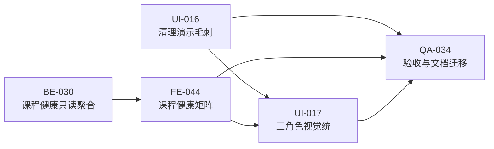
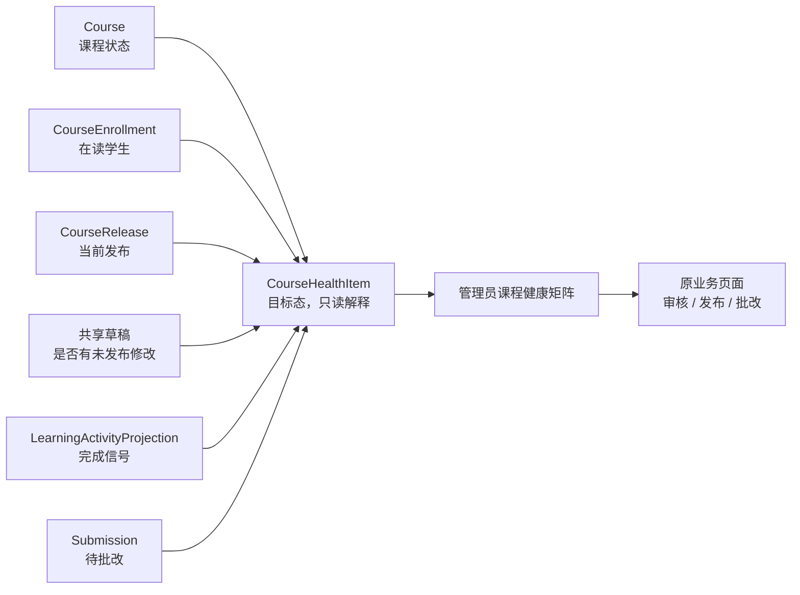
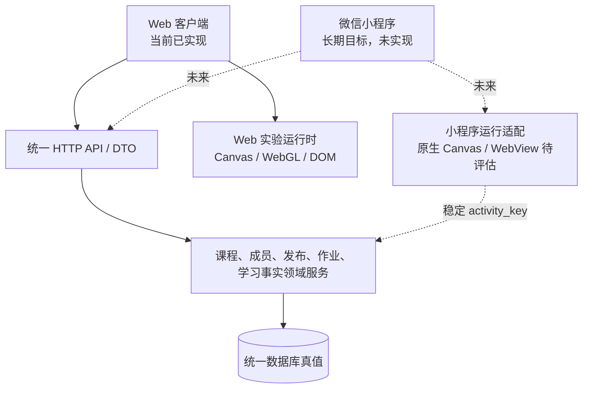

# 星序 Astra — 更新规划

> **执行稿｜V8.5 已完成并迁出；V8.6 阶段性收口已经启动**
>
> **文档梗概**：本文只保存尚未完成的设计、当前版本路线、正式任务原件、验收门禁、已确认边界和长期冻结方向。当前稳定实现以 [`01-开发者手册.md`](01-开发者手册.md) 为准，已经发生的版本与提交以 [`03-发布历史.md`](03-发布历史.md) 为准。
>
> **具体规划法则**：
>
> 1. 已完成周期不得长期堆在本文；稳定实现迁入 1 号文档，版本结果迁入 3 号文档后，本文只保留一行基线和权威链接。
> 2. 正式目录中的 127 项活动继续冻结。平台可以发现、引用、编排和回读实验，但不得为了课程说明或管理展示改写实验本体。
> 3. 下一轮仍优先处理可直接观看、操作和讲解的管理平台效果，不以生产级安全、极限性能、服务器部署或大规模重构占用主要时间。
> 4. 项目负责人已于 2026-08-28 启动本轮任务；当前正式中版本为 `V8.6`，总范围只包含 `UI-016`、`BE-030`、`FE-044`、`UI-017` 和 `QA-034`。
>
> **当前产品代码基线**：`3c28562 / V8.5.4`。V8.4 通用课程闭环和 V8.5 教学管理驾驶舱、课程版本时光机、发布影响预演、师生学习证据链均已完成；文档收束提交 `b26b707` 不改变产品代码基线。
>
> **当前规划周期**：`V8.6 / 课程运营表现增强`，状态为开发中；总上限 20 个有效开发小时，作为当前阶段的阶段性开发收口。
>
> **最后一次更新时间**：2026-08-28
>
> **更新者**：主开发（单线）

---

## 0. 全局总览与硬规则

### 0.1 当前结论

V8.3—V8.5 已经完成的设计、代码、页面、测试和提交不再由本文展开：

- 当前系统架构、接口、页面、数据关系和维护限制见 [1 号开发者手册](01-开发者手册.md) 与 [19 号当前业务闭环](01-子文档/19-当前功能业务闭环与展示边界.md)。
- V8.3—V8.5 的阶段结果见 [3 号发布历史](03-发布历史.md#4-v8-当前阶段摘要)。
- 每次独立提交、裁决和验收事实见 [35 号 V8 版本发布历史](03-子文档/35-V8版本发布历史.md)。
- 原 P-01—P-11 已按真实实现迁入 1 号文档；本文只继续保留尚未实施的双端边界图 P-12。

当前作品已经能够完整演示：

`教师申请 → 管理员批准 → 教师建课 → 管理员审核 → 学生加入 → 教师发布 → 学生学习与提交 → 教师批改 → 学习结果回读 → 管理员查看教学运行`

### 0.2 下一轮一句话目标

把现有管理平台中仍然暴露的技术残留清理掉，并增加一套能够解释“课程为什么需要关注、应该去哪里处理”的课程健康视图，让评委不阅读接口或原始数据也能看懂平台正在发生什么。

### 0.3 不可突破的开发边界

1. 不修改 127 项活动的页面结构、交互、动画、参数、求解器和实验内说明。
2. 不新增正式角色，不把行政班重新改成课程容器，不改变课程成员、发布版本和学习结果的权威来源。
3. 不建立第二套课程健康状态表；健康提示只根据现有课程、成员、release、草稿、完成投影和待批改事实确定性计算。
4. 不开发自由拖拽编辑器、微信小程序、服务器部署、竞赛材料、AI 诊断或生产级安全专项。
5. 不用“AI 判断”“学习效果预测”包装确定性统计；每条提示必须同时显示原因、事实和下一动作。
6. 用户可见页面必须优先使用中文可理解名称，不直接暴露内部状态码、数据库主键、原始 JSON 或本地演示占位文本。

### 0.4 本次文档整理任务

- [x] `DOC-005`｜状态：已完成｜目标版本：`V8.6`｜模块：01/02/03 权威文档｜任务：迁出 V8.3—V8.5 已完成规划并建立下一轮执行稿｜主责：主开发（单线）｜协作：无｜前置：V8.5.4 已完成｜关联文档：本文、[开发者手册](01-开发者手册.md)、[发布历史](03-发布历史.md)｜关联版本：`V8.6.0`｜验证：职责映射、188 个相对文件链接、103 个章节锚点和 `git diff --check` 通过，2 号文档不再保存已完成任务流水，1/3 号文档保留实现与历史事实

---

## 目录

0. [全局总览与硬规则](#0-全局总览与硬规则)
1. [当前基线与下一轮缺口](#1-当前基线与下一轮缺口)
2. [V8.6 当前版本路线](#2-v86-当前版本路线)
3. [下一轮正式任务原件](#3-下一轮正式任务原件)
4. [目标结构与数据边界](#4-目标结构与数据边界)
5. [工作量、验收与停止规则](#5-工作量验收与停止规则)
6. [已确认启动边界](#6-已确认启动边界)
7. [长期方向与暂缓任务](#7-长期方向与暂缓任务)
8. [已完成内容迁移账本](#8-已完成内容迁移账本)

---

## 1. 当前基线与下一轮缺口

### 1.1 当前稳定能力

| 范围 | 当前真实能力 | 权威说明 |
| --- | --- | --- |
| 学习内容 | 工科试验室 90 项、代码空间 18 项、未来星系 19 项，共 127 项正式活动 | [学科实验与内容开发指南](01-子文档/15-学科实验与内容开发指南.md) |
| 身份与组织 | 学生、教师、管理员，教师申请审核，学校、行政班和内部课程群组 | [当前身份、组织与教师申请](01-子文档/19-当前功能业务闭环与展示边界.md#v840-身份组织与教师申请当前稳定实现) |
| 通用课程 | 一师多课、一课多师、建课审核、课程码、公开/限班准入、课程名单 | [课程关系与成员闭环](01-子文档/19-当前功能业务闭环与展示边界.md#v841-课程关系数据底座data-009-当前稳定实现) |
| 内容发布 | 共享草稿、七类内容块、127 项活动引用、不可变 release、版本历史 | [课程编辑与发布](01-子文档/19-当前功能业务闭环与展示边界.md#v844-结构化课程编辑器fe-041-当前稳定实现) |
| 学习结果 | 实验操作、指定检查点、指定作业批改三种完成规则和统一投影 | [三种课程完成预设](01-子文档/19-当前功能业务闭环与展示边界.md#v844-三种课程完成预设be-028-当前稳定实现) |
| 三角色工作台 | 学生、教师、管理员聚合首屏、唯一下一动作和原业务页面跳转 | [三角色工作台](01-子文档/19-当前功能业务闭环与展示边界.md#v845-三角色工作台聚合读取be-029-当前稳定实现) |
| V8.5 展示增强 | 教学管理驾驶舱、版本时光机、发布影响预演和师生证据链 | [V8.5 当前稳定实现](01-子文档/19-当前功能业务闭环与展示边界.md#v850v854-管理平台展示增强当前稳定实现) |

### 1.2 本轮审查发现的可见问题

| 优先级 | 当前问题 | 用户可见影响 | 下一轮处理 |
| --- | --- | --- | --- |
| T0 | 学生总览仍可能直接显示 `recovery_route_unavailable` 等内部状态码 | 页面像调试工具，不像完成作品 | `UI-016` |
| T0 | 演示数据仍包含英文占位反馈、原始 JSON 和“用户 #4”式技术身份 | 评委需要自行解释技术数据 | `UI-016` |
| T0 | 发布影响预演把完成方式变化归入“调整单元”，没有单独解释规则变化 | 教师能看到有变化，但不能一眼判断变化性质 | `UI-016` |
| T0 | 管理员能看到教学总量，但缺少“为什么需要关注”和“现在应该做什么”的课程级解释 | 驾驶舱有数据，判断力仍然不足 | `BE-030 + FE-044` |
| T1 | 三角色页面已经可用，但状态卡、回执、空态和层级语言仍有历史差异 | 页面不像同一套完整产品 | `UI-017` |
| T1 | V8.5 专项自动化对丰富驾驶舱组合、证据筛选和来源跳转的行为覆盖不足 | 人工验收成立，但后续回归保护偏弱 | `QA-034` |

### 1.3 当前完成度基线

本轮规划以最近一次完整复审的 `89 / 100` 作为起点。该分数表示作品已经达到较高完成度，但仍有直接可见的演示毛刺、解释不足和视觉不统一；它不是论文实证结论，也不用于宣称真实教学效果。

### 1.4 当前修改授权矩阵

| 修改范围 | 本轮权限 | 说明 |
| --- | --- | --- |
| 既有实验本体 | 禁止 | 只有确认的知识性错误才能另行立项 |
| 管理员、教师、学生工作台 | 允许 | 只处理本轮任务涉及的展示、提示和跳转 |
| `GET /api/v1/workbench` 只读聚合 | 允许扩展 | 不新增业务真值，不改变原写接口 |
| 演示初始化数据 | 允许清理 | 保持正式 API-only、幂等和无凭据边界 |
| 数据库模型与迁移 | 默认禁止 | 本轮目标可以由现有事实完成 |
| 小程序、部署、竞赛材料 | 禁止启动 | 继续保留在长期冻结项 |

---

## 2. V8.6 当前版本路线

### 2.1 当前中版本

| 项目 | 当前方案 |
| --- | --- |
| 正式版本 | `V8.6`，项目负责人已于 2026-08-28 启动 |
| 周期名称 | 课程运营表现增强 |
| 时间上限 | 20 个有效开发小时 |
| 开发方式 | 主开发单线，不创建额外工作树或长期工作组 |
| 主要对象 | 管理员驾驶舱、教师课程发布、学生/教师/管理员共享状态表达 |
| 明确不做 | 新实验、小程序、部署、AI、生产级安全、全站重构 |

### 2.2 当前阶段顺序

| 阶段 | 任务 | 最简单目标 | 可见结果 | 建议时间 |
| --- | --- | --- | --- | ---: |
| A | `UI-016` | 清理演示中的技术残留 | 页面只显示用户能理解的中文状态、姓名和内容变化 | 3h |
| B | `BE-030` | 生成可解释课程健康提示 | 每门近期课程返回明确原因、事实和下一动作 | 5h |
| C | `FE-044` | 展示课程健康矩阵 | 管理员可从星系和课程视角发现问题并直接进入处理页面 | 5h |
| D | `UI-017` | 统一三角色管理界面 | 三种工作台使用一致的信息层级、状态和回执表达 | 4h |
| E | `QA-034` | 完成全链路收口 | 演示数据、自动化、桌面/移动页面和文档全部一致 | 3h |

### 2.3 版本依赖

状态：目标态，正在实现。只有对应任务通过验收后，目标结构才允许迁入 1 号文档。

---

## 3. 下一轮正式任务原件

以下任务已经获得 `V8.6` 启动指令，由主开发单线负责。只有当前正在执行的任务标记为“进行中”，后续任务保持“已认领”并严格等待前置任务完成。

### 3.1 UI-016：清理演示中的技术残留

- [ ] `UI-016`｜状态：进行中｜目标版本：`V8.6`｜模块：三角色可见文案与发布预演｜任务：清理比赛演示中用户不应该看到的技术残留｜主责：主开发（单线）｜协作：无｜前置：`DOC-005`｜关联文档：[当前 V8.5 展示边界](01-子文档/19-当前功能业务闭环与展示边界.md#v850v854-管理平台展示增强当前稳定实现)｜关联版本：待提交｜验证：内部状态码、原始 JSON、英文演示占位和裸用户 ID 不再进入主演示路径，发布预演单独说明完成规则变化

目标解释：只调整展示转换、演示数据文案和现有发布差异说明，不修改课程、release、提交和学习证据的数据结构。

### 3.2 BE-030：生成可解释课程健康提示

- [ ] `BE-030`｜状态：已认领｜目标版本：`V8.6`｜模块：管理员工作台只读聚合｜任务：根据现有课程事实生成可以解释的课程健康提示｜主责：主开发（单线）｜协作：无｜前置：`UI-016`｜关联文档：[工作台聚合当前实现](01-子文档/19-当前功能业务闭环与展示边界.md#v845-三角色工作台聚合读取be-029-当前稳定实现)｜关联版本：暂无｜验证：无首发、有学生但无完成信号、存在待批改、存在未发布修改等状态均返回原因、事实数值和原业务处理入口

目标解释：优先扩展现有 `teaching_snapshot`。健康提示是确定性只读 DTO，不新建表、不缓存第二套状态、不预测学生能力，也不替代教师判断。

### 3.3 FE-044：展示课程健康矩阵

- [ ] `FE-044`｜状态：已认领｜目标版本：`V8.6`｜模块：管理员教学运行驾驶舱｜任务：让管理员按星系和课程看懂哪些课程需要关注｜主责：主开发（单线）｜协作：无｜前置：`BE-030`｜关联文档：[V8.5 教学管理驾驶舱](01-子文档/19-当前功能业务闭环与展示边界.md#v850v854-管理平台展示增强当前稳定实现)｜关联版本：暂无｜验证：健康、待首发、待批改、未形成完成结果和有未发布修改均有不同但一致的视觉状态，每项都能跳回原审核、发布或批改页面

目标解释：不再增加一组孤立统计卡，而是在现有课程脉搏上增加“原因—证据—动作”层，并保持桌面和移动端可讲解。

### 3.4 UI-017：统一三角色管理界面

- [ ] `UI-017`｜状态：已认领｜目标版本：`V8.6`｜模块：学生、教师、管理员工作台｜任务：统一三类用户页面的信息层级和状态表达｜主责：主开发（单线）｜协作：无｜前置：`UI-016`、`FE-044`｜关联文档：[界面、移动端与无障碍](01-子文档/16-界面样式移动端与无障碍.md)｜关联版本：暂无｜验证：三角色共用相同的主动作、状态、空态、错误、回执和卡片语言，既有业务入口与权限不变，390×844 无横向溢出

目标解释：只统一共享设计令牌和管理平台组件，不重做实验页面、不迁移前端框架、不追求全站像素级重构。

### 3.5 QA-034：完成下一轮收口

- [ ] `QA-034`｜状态：已认领｜目标版本：`V8.6`｜模块：演示数据、自动化和真实页面｜任务：验证下一轮所有展示能力可以稳定重复演示｜主责：主开发（单线）｜协作：无｜前置：`UI-016`、`BE-030`、`FE-044`、`UI-017`｜关联文档：[测试调试维护与发布规则](01-子文档/18-测试调试维护与发布规则.md)｜关联版本：暂无｜验证：丰富驾驶舱组合、健康原因、页面跳转、发布规则变化、证据筛选和来源回跳均有自动化或真实浏览器证据，后端全量、前端全量、桌面和 390×844 通过

目标解释：验收完成后，把稳定结构和操作说明迁入 1 号文档，把实际提交和阶段结果写入 3 号文档，再从本文删除本周期已完成任务。

---

## 4. 目标结构与数据边界

### 4.1 课程健康数据流

- **状态**：目标态，尚未实现。
- **对应任务**：`BE-030 / FE-044`。
- **复用对象**：现有 `Course`、`CourseEnrollment`、`CourseRelease`、共享草稿、`LearningActivityProjection`、`Submission` 和 `GET /api/v1/workbench`。
- **新增对象**：只读 DTO `CourseHealthItem` 或语义等价结构；不新增数据库模型。
- **迁移条件**：后台组合测试、管理员真实页面和双视口验收通过后，修正为真实字段并迁入 1 号文档。

### 4.2 第一版健康规则

| 条件 | 可见标签 | 必须显示的事实 | 下一动作 |
| --- | --- | --- | --- |
| 课程尚无 release | 待首发 | 当前发布数为 0 | 进入课程内容中心 |
| 有 active 学生且完成信号为 0 | 尚未形成结果 | 在读人数、完成信号数 | 进入课程学情 |
| 待批改提交大于 0 | 待批改 | 待批改数量 | 进入批改队列 |
| 共享草稿存在未发布修改 | 待发布 | 草稿 revision、当前 release | 进入发布预演 |
| 上述条件均不成立 | 运行正常 | 当前学生、版本和完成信号 | 查看课程详情 |

这些规则只解释已存在的事实，不设置“好教师”“差课程”“学习能力不足”等评价标签。

### 4.3 展示转换边界

| 原始事实 | 页面允许显示 | 页面禁止直接显示 |
| --- | --- | --- |
| 内部错误码 | 中文状态和恢复动作 | `recovery_route_unavailable` 等代码 |
| 用户 ID | 显示名、账号或“未知用户”降级 | “用户 #4”作为主要身份 |
| 提交正文 JSON | 经过类型适配的字段和自然语言摘要 | 未格式化对象源码 |
| 发布差异 | 新增、调整、移除、完成规则变化 | 只有无法解释的哈希和内部 revision |
| 演示种子 | 中文、真实产品语境的样例 | `Synthetic ...` 等测试占位文案 |

---

## 5. 工作量、验收与停止规则

### 5.1 建议工作量

| 范围 | 建议时间 | 难度 |
| --- | ---: | --- |
| 演示毛刺清理 | 3h | 低—中 |
| 课程健康后端聚合 | 5h | 中 |
| 课程健康矩阵 | 5h | 中 |
| 三角色视觉统一 | 4h | 中 |
| 回归、浏览器与文档迁移 | 3h | 中 |
| **合计** | **20h** | **中** |

20 小时是本轮正式上限。若项目负责人调整范围，必须先修改本节和正式任务，再继续开发。

### 5.2 每项任务完成定义

1. 页面使用真实 API 或当前正式领域事实，不以硬编码数字冒充结果。
2. 正常、空状态、加载、失败和重复操作均有可理解回执。
3. 桌面与 `390×844` 均无根级横向溢出，主要按钮至少 44px。
4. 浏览器控制台没有新增 warning/error，页面没有不可关闭遮罩。
5. 相关后端测试、JavaScript 语法和前端合同通过。
6. 旧活动保护检查继续通过，127 项实验本体没有被修改。
7. 稳定实现迁入 1 号文档，真实 Git 提交写入 3 号文档。

### 5.3 时间不足时的降级顺序

1. 取消额外动画和装饰性图表。
2. 取消次要筛选和非核心统计。
3. 缩小三角色视觉统一范围，只保留工作台首屏与本轮新增区域。
4. 保留四种核心健康原因，不增加复杂阈值或综合评分。

不得取消：内部状态清理、健康原因解释、原业务跳转、真实数据、双视口验收和文档迁移。

### 5.4 必须暂停并汇报的情况

1. 需要修改既有实验知识、交互或求解器。
2. 需要新增数据库表、正式角色或第二套课程状态。
3. 需要改变课程成员、发布版本或学习结果的权威来源。
4. 需要使用模型推断学生能力、教师质量或课程效果。
5. 现有用户修改与本轮文件发生无法安全兼容的重叠。

---

## 6. 已确认启动边界

| 编号 | 确认内容 | 确认结果 | 确认依据 |
| --- | --- | --- | --- |
| `Q-005` | 下一轮正式版本号、20 小时上限和五项任务范围 | 使用 `V8.6`，总上限 20h，按 `UI-016 → BE-030 → FE-044 → UI-017 → QA-034` 推进 | 项目负责人 2026-08-28 阶段收口启动指令 |

本轮若出现需要修改实验本体、增加数据库真值、改变课程权威来源或扩大五项任务范围的情况，必须按第 5.4 节暂停并汇报。

---

## 7. 长期方向与暂缓任务

以下内容不是本轮任务，不占用 `V8.6` 周期：

| 编号 | 方向 | 状态 | 暂缓原因 | 恢复条件 |
| --- | --- | --- | --- | --- |
| L1 | 活动教学语义卡 | 暂缓 | 需要为活动统一整理概念、变量、时长和易错点 | 课程健康周期完成后重新立项 |
| L2 | 知识星图编排器 | 暂缓 | 依赖稳定教学语义和先修关系 | L1 完成后 |
| L3 | Web 与微信小程序双端协同 | 暂缓 | 当前没有小程序立项 | 项目负责人启动双端专项时 |
| L4 | 小程序原生实验运行时 | 暂缓 | 需要评估 Canvas、WebGL、WebView 和分包 | L3 形成客户端边界后 |
| L5 | 中央服务器与正式数据库 | 暂缓 | 当前不准备服务器发布 | 正式部署立项时 |
| L6 | 新实验和第二批内容扩充 | 暂缓 | 现有 127 项内容已经足够丰富 | 项目负责人解除实验冻结时 |
| L7 | 竞赛申报、视频和答辩材料 | 暂缓 | 当前只开发作品本体 | 明确具体赛事后 |
| L8 | O2O 翻译、多语言、AI 助手和在线判题集群 | 暂缓 | 均需要独立产品、资源或数据边界 | 分别立项时 |
| L9 | 真实课堂实证 | 暂缓 | 需要学校、班级、周期和评价口径 | 教学实证专项立项时 |
| L10 | 企业级安全、性能和运维 | 暂缓 | 当前不做公网生产部署 | 部署立项时 |
| L11 | 全量前端框架迁移 | 暂缓 | 当前 SPA 没有阻断主线 | 出现明确维护证据时 |

### 7.1 P-12 Web 与小程序长期边界

- **状态**：长期目标态，尚未实现。
- **复用边界**：身份、权限、课程、成员、发布、作业和学习事实只保留一份服务端真值。
- **禁止事项**：小程序不得复制审核、准入、发布、完成规则或独立数据库。
- **启动条件**：项目负责人单独立项并确认客户端范围后，才拆分正式接口与适配任务。

---

## 8. 已完成内容迁移账本

| 已完成内容 | 本文处理 | 当前实现权威位置 | 历史权威位置 |
| --- | --- | --- | --- |
| V8.3.3 规划 UML | 删除详细完成流水 | 已落地部分见 1 号手册与 19 号子文档 | [35 号 V8 历史](03-子文档/35-V8版本发布历史.md) |
| V8.3.4 机械臂与实验冻结 | 删除任务和退出条件 | [学科实验指南](01-子文档/15-学科实验与内容开发指南.md) | [3 号历史 V8.3.4](03-发布历史.md#418-v834交付机械臂逆运动学并冻结实验扩充) |
| V8.4.0—V8.4.3 身份、建课、审核和选课 | 删除版本章节、任务和完成事实 | [19 号业务闭环](01-子文档/19-当前功能业务闭环与展示边界.md) | [3 号 V8 阶段摘要](03-发布历史.md#4-v8-当前阶段摘要) |
| V8.4.4 编辑、发布和三种完成规则 | 删除版本章节、任务和完成事实 | [19 号 V8.4.4 当前实现](01-子文档/19-当前功能业务闭环与展示边界.md#v844-多教师共享草稿与不可变发布be-027-当前稳定实现) | [35 号 V8 历史](03-子文档/35-V8版本发布历史.md) |
| V8.4.5—V8.4.6 三角色工作台、演示数据和验收 | 删除版本章节、工作量和退出条件 | [19 号 V8.4.5—V8.4.6](01-子文档/19-当前功能业务闭环与展示边界.md#v846-完整课程闭环与验收收口当前稳定实现) | [3 号历史](03-发布历史.md#428-v845完成三角色工作台聚合读取be-029) |
| V8.5.0—V8.5.4 四项展示增强 | 删除正式任务原件和已完成能力池 | [19 号 V8.5 当前实现](01-子文档/19-当前功能业务闭环与展示边界.md#v850v854-管理平台展示增强当前稳定实现) | [3 号历史 V8.5](03-发布历史.md#433-v850建立教学管理驾驶舱dev-003) |
| P-01—P-11 当前实现图 | 本文不再保留副本 | [1 号系统分层图](01-开发者手册.md#22-分层结构)、[19 号对象与流程图](01-子文档/19-当前功能业务闭环与展示边界.md) | 对应提交见 35 号历史 |
| P-13 已完成版本依赖 | 删除规划图 | 不适用 | 3 号与 35 号版本顺序 |
| Q-001—Q-004 已完成裁决 | 从待裁决表移除 | 当前规则见 19 号子文档 | 裁决与落地见 35 号历史 |

### 8.1 子规划兼容边界

`21—29` 号子规划继续作为 V7.5—V7.9 的历史设计和冻结契约保留，不再承担下一轮任务状态。若其历史方案与当前实现冲突，以 1 号文档为准；若其内容描述未来方向，以本文正式任务和长期冻结表为准。

### 8.2 周期完成后的固定迁移流程

1. 对照真实模型、接口、页面和测试修正目标图或数据表。
2. 将稳定实现、路径、操作和维护限制写入 1 号文档或 11—19 号子文档。
3. 将实际 Git 提交和阶段结果写入 3 号文档或 35 号历史分卷。
4. 从本文删除已完成任务原件、详细验收流水和已实现目标图，只保留新的当前基线与链接。
5. 运行文档结构、相对链接、目录锚点和 `git diff --check` 校验。
