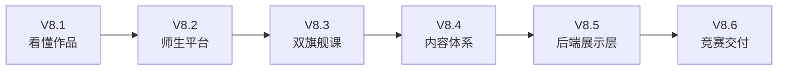
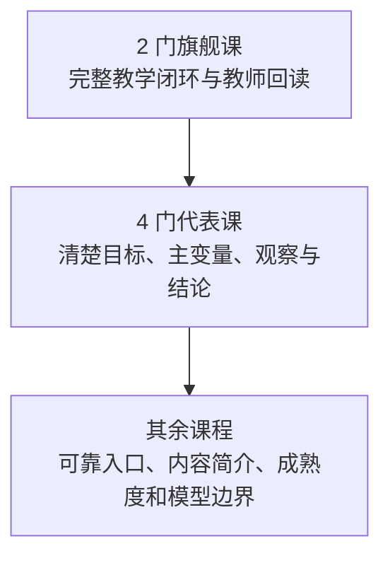
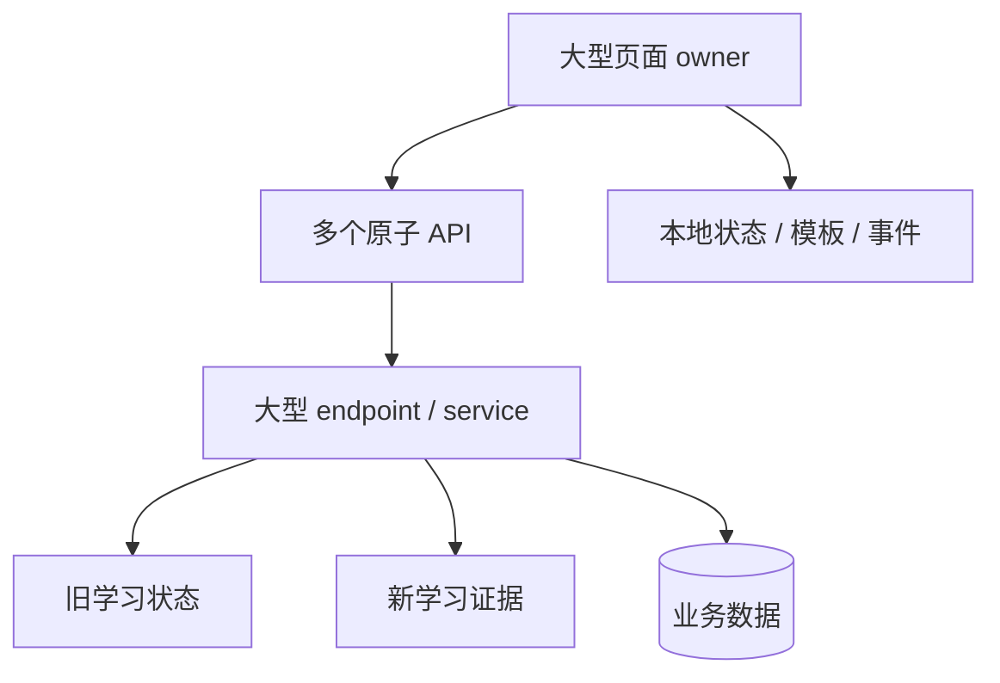
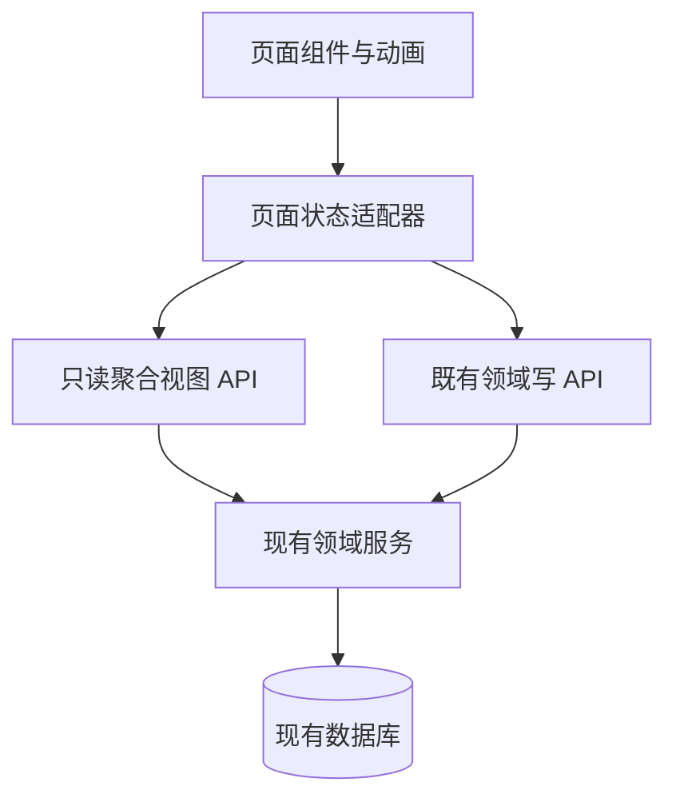

# 星序 Astra — 更新规划

> **文档梗概**：这是当前唯一的开发规划控制面。本文先给出全局审查结论，再按 V8.1—V8.6 六个中版本拆分方向，并在每个中版本下用小版本和 T0/T1/T2 安排单一、直白、可验收的任务。
>
> **阅读规则**：每个任务的“任务目标”只说一件事；技术原因、实现边界和专业名词统一放在“目标解释”中。开发者先看目标，再决定是否需要读解释。
>
> **历史规则**：本文不保存已完成提交和旧调度过程。V4—V8 发布历史见 [`03-发布历史.md`](03-发布历史.md)；重写前 02 的完整快照保存在 [39-跨版本综述与规划迁移附录](03-子文档/39-跨版本综述与规划迁移附录.md)。
>
> **当前控制点**：`V8.0.37 / DOC-002` 文档重组；产品运行字节仍以 V8.0.34 未验候选为准。
>
> **最近更新**：2026-08-22
>
> **更新者**：DOC 组（主开发单线兼任）

---

## 目录

1. [规划规则与完成判断](#1-规划规则与完成判断)
2. [当前项目的全方位审查](#2-当前项目的全方位审查)
3. [需要保留和修正的架构](#3-需要保留和修正的架构)
4. [V8.1：让评委快速看懂作品](#4-v81让评委快速看懂作品)
5. [V8.2：让师生管理平台像完整产品](#5-v82让师生管理平台像完整产品)
6. [V8.3：把两门旗舰课做成作品核心](#6-v83把两门旗舰课做成作品核心)
7. [V8.4：让课程体系有广度也有层次](#7-v84让课程体系有广度也有层次)
8. [V8.5：让后端更好地服务前端展示](#8-v85让后端更好地服务前端展示)
9. [V8.6：完成竞赛包装和最终验收](#9-v86完成竞赛包装和最终验收)
10. [工作量、顺序与停止规则](#10-工作量顺序与停止规则)
11. [长期方向：记录但暂不启动](#11-长期方向记录但暂不启动)

---

## 1. 规划规则与完成判断

### 1.1 当前作品定位

星序当前面向优秀毕业设计、多媒体类竞赛和教学工具类赛事。评价重点依次是：

1. 评委是否能在短时间内看懂作品解决什么问题；
2. 学生和教师能否完成一条有教学意义的互动旅程；
3. 画面、动画、反馈和信息层级是否具有作品感；
4. 业务数据是否真实连通，而不是按钮背后的静态假数据；
5. 技术架构是否足以解释设计，而不是为了复杂而复杂。

当前不把公网部署、额外加密、极限性能、真实 MySQL、大规模并发和企业级运维当作参赛主线。已有能力不删除，但后续投入必须先回答：“评委、学生或教师能直接看到什么改善？”

### 1.2 T0、T1、T2 的含义

| 优先级 | 直白含义 | 处理规则 |
| --- | --- | --- |
| T0 | 不做就讲不清或演不通 | 当前中版本必须完成，优先保护演示主链 |
| T1 | 做完后明显更像优秀作品 | T0 稳定后完成，不允许反过来拖住 T0 |
| T2 | 有价值但可以后置的精修 | 时间不足时允许顺延，不影响中版本发布 |

### 1.3 任务卡写法

每个小版本只对应一个主要任务。任务卡必须包含：

- **任务目标**：一句普通开发者能直接理解的话；
- **目标解释**：为什么做、技术上改到哪里、什么不要动；
- **任务编号与状态**：用于 Git 和文档对账；
- **模块**：允许写入的主要范围；
- **主责与协作**：默认由主开发单线完成，用户明确恢复协作后才分组；
- **前置**：必须先满足的条件；
- **验证**：能观察、能复现、能判定的完成标准。

### 1.4 当前完成度

| 维度 | 当前判断 | 说明 |
| --- | ---: | --- |
| 后端业务骨架 | 90% | 学校、班级、课程、作业、提交、证据、内容与治理已形成完整领域 |
| 关键业务闭环 | 86% | 学生→旗舰课→服务端完成→教师回读成立；最新候选仍缺同版本终验 |
| 师生可见体验 | 78% | 工作台可用，但视觉决策层次、下一步和跨角色叙事仍弱 |
| 课程内容与动画 | 72% | 两门旗舰课较深，其余内容的教学叙事和成熟度不均 |
| 竞赛包装与交付 | 55% | 缺统一三分钟脚本、稳定素材包、答辩图和最终浏览器证据 |
| 面向竞赛的全局完成度 | **80%—82%** | 已经不是空壳；剩余工作主要是把技术能力转成评委能看见的作品能力 |

这里的百分比只用于规划，不是论文实证数据，也不能替代真实用户研究。

### 1.5 六个中版本总览

| 中版本 | 核心结果 | T0 工作量估计 | 全量工作量估计 | 难度 |
| --- | --- | ---: | ---: | --- |
| V8.1 | 一条不用解释系统结构也能走通的演示主线 | 3—4 人日 | 4—6 人日 | 中 |
| V8.2 | 学生、教师、管理员页面形成清晰的任务和反馈 | 5—7 人日 | 7—10 人日 | 中高 |
| V8.3 | Physics 与 Engineering 两课达到作品核心层次 | 6—8 人日 | 8—12 人日 | 中高 |
| V8.4 | 代表课程补面，全部内容有清楚的成熟度和入口 | 4—6 人日 | 6—9 人日 | 中 |
| V8.5 | 后端提供更适合页面的聚合视图，减少前端拼接 | 3—5 人日 | 5—8 人日 | 中高 |
| V8.6 | 演示数据、脚本、图文视频和浏览器证据完整 | 4—6 人日 | 5—8 人日 | 中 |

只做 T0 约需 25—36 人日；完成 T0+T1+主要 T2 约需 35—53 人日。该估计按主开发单线、已有代码不大重构计算，不包含真实课堂试点、微信小程序或生产部署。

---

## 2. 当前项目的全方位审查

### 2.1 总结：技术已经够深，作品表达仍然落后

星序最大的误判风险不是“后端太简单”，而是评委看到的页面没有把真实技术深度讲出来。项目已经有约 179 个 API 路由操作、三角色、学校/班级/课程、作业、学习证据、内容版本和审计等能力；但用户进入页面后，仍可能只看到大量卡片、表格、状态标签和分散入口。

毫不留情地说：当前作品的“能做什么”强于“为什么值得做”，“后台事实”强于“前台叙事”，“功能数量”强于“代表功能的完成质感”。继续增加低可见接口会放大这种失衡。

### 2.2 前端内容深度问题

| 问题 | 直接表现 | 为什么影响竞赛 | 修正方向 |
| --- | --- | --- | --- |
| 缺唯一演示主线 | 登录后可进入多个星系、工作台和治理页，但下一步不唯一 | 评委需要开发者口头解释才能理解价值 | V8.1 建立三分钟主线和上下文提示 |
| 工作台像控制面板 | 教师和管理员页面有很多表格、过滤器和状态 | 看得到功能，却看不到教学决策 | V8.2 改成“当前情况—需要处理—处理结果” |
| 页面层级过多 | 星序、星系、学科、课程、活动、工作台之间跳转语义不完全统一 | 用户容易迷路，不知道如何返回或继续 | 统一面包屑、主动作和返回语义 |
| 空态/加载态不一致 | 不同 owner 各自输出提示、busy 和错误 | 作品显得由多批功能拼接 | 建立统一状态组件和可见反馈 |
| 移动端只做到可用 | 首屏回执和同帧布局已有修复，但复杂页面仍偏拥挤 | 竞赛常现场缩放、录屏或用平板演示 | V8.2/V8.3 对主路径做双视口设计 |
| 动画价值不均 | 一部分动画解释过程，一部分只是背景或装饰 | 动效数量不能代替教学含义 | 只保留能表达变量、过程、比较和反馈的动画 |

### 2.3 课程内容问题

当前共有 124 个实验/活动，但真正形成“目标—预测—操作—观察—反馈—修正—解释—教师回读”的主要是 `physics.mechanics` 和 `engineering.load-path`。这两门课证明了项目不是空壳，也反过来暴露了其余内容的层次差距。

主要问题是：

1. 课程目标、唯一变量、固定条件和最终产出没有统一出现在首屏；
2. 观察值与结论之间有时需要学生自己猜，缺少“看哪里、为什么”的引导；
3. 部分实验有丰富控件，却没有明确告诉学生哪一次操作构成有效学习；
4. 结果反馈常停留在数值或颜色，模型边界和错误原因不足；
5. 课程成熟度没有公开区分，评委容易把展示型活动误认为全部都具有权威证据闭环。

正确做法不是同时重写 124 个活动，而是形成“2 门旗舰 + 4 门代表 + 其余目录化展示”的金字塔。

### 2.4 学生端问题

学生端已经解决“未入班不得进入个人页”“多班级按当前班级隔离课程”等关键业务，但可见体验仍有四个问题：

- 学生需要在工作台、星系目录和课程页之间自己建立联系；
- “继续学习”有数据，但尚未成为页面绝对主角；
- 作业、课程、进度和积分容易同时争夺注意力；
- 完成回执的教学含义不足，学生看到完成却未必知道学会了什么。

V8.2 的重点是减少选择，把“当前课程、唯一下一步、最近反馈”固定为首屏主线。

### 2.5 教师端问题

教师端拥有真实班级、课程、作业、提交和有限学习事实，但“学习通式”的管理复杂度还没有转化成优秀的教学决策体验：

- 页面告诉教师有多少数据，却不总是告诉教师先处理谁；
- 课程编排、发布计划、作业和证据分散在多个区域；
- 学生事实比较偏技术回读，缺少“误区—建议—下一动作”的有限表达；
- 一次操作后的影响范围和成功回执不够醒目；
- 教师页面 2882 行 owner 表明数据、模板、事件和状态已高度耦合，继续堆功能会加剧风险。

V8.2 不重写教师业务，而是把已有事实整理成“班级概况—待办—学生差异—课程动作—结果回执”。

### 2.6 管理员端问题

管理员端已经比普通毕设更完整：用户、学校、班级、加入申请、课程、内容、审计、任务、告警和治理入口均存在。但它更像工程后台，不像竞赛叙事中的“平台全景”：

- 概览页缺少一眼可懂的组织关系和异常因果；
- 次级治理能力很多，容易压住最值得展示的学校—班级—课程主链；
- 原子表格支持筛选和写入，却缺少任务化说明；
- 管理页面 2346 行主 owner 加上多个次级 owner，维护和状态一致性风险较高。

管理员不是下一阶段主角。V8.2 只把全景和关键动作做清楚，不继续扩展低频后台能力。

### 2.7 后端业务逻辑问题

后端的优点是领域足够完整，缺点是“完整”开始变成“重叠”。主要集中在五层：

#### 第一层：角色和作用域容易被误解

全局角色、学校成员、班级成员、课程协作者和作业策略共同决定权限。这是合理设计，但文档和前端常把它说成简单三级管理，导致开发者可能在错误层判断权限。

**修正**：保留现有 access control，统一前端/文档用语；不新增第二套角色等级。

#### 第二层：旧学习状态和新学习证据并存

`learning_events / progress` 与 `learning_evidence / runtime / projections` 同时存在。旧路径仍有兼容价值，新路径承担权威完成和恢复，但边界对新增页面不够清晰。

**修正**：V8.5 先建立“页面读取哪一种真值”的适配层和契约，不立即删除旧表或大迁移。

#### 第三层：接口偏原子，页面需要自行拼装

课程、班级、作业、进度和证据接口各自完整，但一个工作台首屏可能需要多个请求、多个 owner 和重复排序，容易产生 loading 跳变、竞态和空态不一致。

**修正**：只为学生首页、教师决策页和管理员全景增加三个只读聚合视图；底层写接口保持原样。

#### 第四层：内容协议仍偏 Web

结构化内容已有 `hero / learning-task / experiment / assessment / source-list` 等区段，但实验脚本路径、iframe、DOM owner 和 Canvas/WebGL 假设仍然明显。直接复用到微信小程序会遇到运行时差异。

**修正**：当前只补“跨端能力标签”和 API 版本边界；完整小程序适配列入长期方向。

#### 第五层：单文件 owner 过重

`learning_evidence.py` 约 1958 行，`knowledge.py` 约 1484 行，多个管理 endpoint 和 runtime 服务超过一千行。它们不是不能工作，而是局部改动的认知成本和回归范围越来越大。

**修正**：只在新任务触碰时按“读取查询、命令写入、DTO 适配”抽离，不为追求漂亮目录开展全量重构。

### 2.8 整体层级架构问题

当前架构的真实形态更接近：

短期目标不是换成新框架，而是增加薄的“面向页面视图层”：

这样既能改善前端效果，也为 Web + 微信小程序双端读取留下接口边界，同时避免当前阶段的大重构。

### 2.9 测试、文档和交付问题

- 后端合同和回归规模很强，但“测试多”不能替代最新产品候选的真实浏览器画面。
- V8.0.34 的移动回执和 Engineering 同帧布局仍缺同版本最终浏览器复验。
- 旧文档曾把计划、历史、团队控制和实现细节混在三份主文档中；V8.0.37 已分层，但未来提交必须持续维护。
- 缺面向答辩的系统图、业务图、录屏脚本、讲解词、三角色数据预置和失败时的替代画面。

---

## 3. 需要保留和修正的架构

### 3.1 必须保留

1. Vanilla SPA、共享 Router/PageRegistry 和按需课程 owner；当前不换 React/Vue。
2. FastAPI + SQLAlchemy + Alembic 的业务主干。
3. HttpOnly Cookie 浏览器会话、服务端权限和精确作用域。
4. 学校—班级—课程—单元—作业—提交主链。
5. 权威学习证据、服务端完成投影和教师回读。
6. SQLite 本地演示、9001 同源入口和已有质量门禁。
7. 两门旗舰课的求解器、状态机、课程事实和证据 owner。

### 3.2 允许渐进修正

1. 大型页面 owner 内的数据适配和模板片段。
2. 学生、教师、管理员首屏的读取聚合方式。
3. 页面层统一 loading/error/empty/success 状态。
4. 目录、面包屑、继续学习和角色主动作。
5. 代表课程的内容结构、动画节奏和反馈表达。
6. 新接口的 `/api/v1` 兼容设计和跨端 DTO。

### 3.3 当前禁止主动扩大

1. 全仓前端框架迁移。
2. 后端微服务拆分。
3. 全量删除旧学习事件和大规模数据库改表。
4. 为所有 124 个活动同时建立复杂证据状态机。
5. 真实 MySQL、TLS、服务编排、极限压测和额外加密精修。
6. 正式 OJ、AI 助手和微信小程序实现。

除非这些项目直接阻断可见演示，否则一律留在长期方向。

---

## 4. V8.1：让评委快速看懂作品

**中版本目标**：进入系统后，不依赖开发者解释，也能知道作品是什么、当前身份是谁、下一步做什么，以及如何从学生操作走到教师回读。

**退出条件**：桌面与 390×844 均能在三次主动作内从角色入口进入指定旗舰课；返回时保留上下文；所有主路径页面有一致的 loading、empty、error 和 success 表达。

### V8.1.0｜T0｜确定三分钟演示主线

- **任务目标**：让评委在三分钟内看懂作品。
- **目标解释**：冻结“学生进入课程—完成旗舰活动—教师查看结果—管理员查看全景”的演示顺序、讲解节点和备用路径；不修改业务数据。
- **任务编号与状态**：`PM-026`｜待启动
- **模块**：演示信息架构、入口文案、演示脚本草案
- **主责与协作**：主开发｜无；用户明确恢复协作后再分配
- **前置**：V8.0.37 文档重组完成
- **验证**：一张流程图、一份不超过三分钟的步骤清单，每一步都有精确页面和预期画面

### V8.1.1｜T0｜统一登录后的第一步

- **任务目标**：让每个角色登录后立即看到唯一下一步。
- **目标解释**：根据学生、教师、管理员身份突出一个主动作；次级入口降级，不重写 Router 和会话系统。
- **任务编号与状态**：`UX-004`｜待启动
- **模块**：`pages/planets`、角色入口、会话落点
- **主责与协作**：主开发｜无
- **前置**：PM-026
- **验证**：三角色首次登录均只有一个视觉主动作，键盘首个有效焦点与视觉主动作一致

### V8.1.2｜T0｜补齐演示路径的返回导航

- **任务目标**：让用户随时知道自己在哪里、怎样返回。
- **目标解释**：给主路径增加统一的星序/星系/课程层级提示、返回目标和上下文保留；不新增第二套路由状态。
- **任务编号与状态**：`FE-037`｜待启动
- **模块**：共享导航、主路径页面、hash 深链
- **主责与协作**：主开发｜无
- **前置**：UX-004
- **验证**：从工作台到两门旗舰课再返回，班级/课程上下文不丢失，不出现循环跳转

### V8.1.3｜T1｜统一三个学习空间的入口说明

- **任务目标**：让用户一眼分清三个学习空间。
- **目标解释**：统一工科试验室、代码空间和未来星系的定位、内容数量、推荐对象、代表活动和成熟度说明。
- **任务编号与状态**：`UI-008`｜待启动
- **模块**：星序总览、三个学习空间入口卡
- **主责与协作**：主开发｜无
- **前置**：PM-026
- **验证**：每个入口首屏同时回答“学什么、怎么学、推荐看什么”，文案不越级宣传

### V8.1.4｜T1｜统一页面状态反馈

- **任务目标**：让加载、空数据、错误和成功看起来属于同一个产品。
- **目标解释**：建立共享视觉语义和最小组件，优先接入主路径；不一次性替换所有旧页面。
- **任务编号与状态**：`FE-038`｜待启动
- **模块**：共享状态组件、学生/教师/旗舰课主路径
- **主责与协作**：主开发｜无
- **前置**：FE-037
- **验证**：断网、空班级、无课程、保存成功和服务错误均有清楚、可聚焦、可恢复的反馈

### V8.1.5｜T2｜验证三分钟演示路线

- **任务目标**：证明演示主线在两种屏幕上都能走完。
- **目标解释**：建立桌面与 390×844 的脚本化浏览器 smoke，记录耗时、关键截图、console 和失败回退。
- **任务编号与状态**：`QA-024`｜待启动
- **模块**：浏览器证明、主路径截图
- **主责与协作**：主开发自验；独立 QA 只有用户明确恢复工作组后才成立
- **前置**：V8.1.0—V8.1.4
- **验证**：两视口主线通过，应用 console error/warn 为 0，截图与 revision 对应

---

## 5. V8.2：让师生管理平台像完整产品

**中版本目标**：把已有班级和课程业务变成清楚的学生学习首页、教师教学决策页和管理员平台全景，而不是继续增加后台表格。

**退出条件**：三个角色首屏都能回答“当前情况、唯一下一步、刚才操作的结果”；学生与教师围绕同一班级/课程数据对账。

### V8.2.0｜T0｜突出学生的继续学习

- **任务目标**：让学生打开工作台就知道下一节学什么。
- **目标解释**：把当前班级、当前课程、继续学习、最近反馈放到首屏主线；作业、积分和目录退到次级区域。
- **任务编号与状态**：`UX-005`｜待启动
- **模块**：`pages/student/student-workbench.js` 及相关样式
- **主责与协作**：主开发｜无
- **前置**：V8.1
- **验证**：有学习记录、无记录、多班级和无可用课程四种状态均给出唯一下一步

### V8.2.1｜T0｜突出教师的下一教学动作

- **任务目标**：让教师先看到最需要处理的事情。
- **目标解释**：把待批改、未发布、学生卡点和最近证据归为有限优先队列；不制造 AI 建议或未经证据支持的诊断。
- **任务编号与状态**：`UX-006`｜待启动
- **模块**：`pages/teacher/teacher.js`、教师摘要适配
- **主责与协作**：主开发｜无
- **前置**：V8.1；已有教师事实接口保持权威
- **验证**：教师首屏最多显示一个主动作和三个有来源的次级提醒，点击后进入精确班级/课程

### V8.2.2｜T1｜整理教师课程编排界面

- **任务目标**：让教师清楚课程怎样发布给班级。
- **目标解释**：将课程、挂班、单元、发布计划和作业用阶段关系呈现，降低原子表单堆叠感；底层写 API 不改。
- **任务编号与状态**：`UI-009`｜待启动
- **模块**：教师课程编排、发布计划、作业区域
- **主责与协作**：主开发｜无
- **前置**：UX-006
- **验证**：新教师能按界面顺序完成“选课程—挂班—开放单元—布置作业”，每步有结果回执

### V8.2.3｜T1｜重做管理员全景首屏

- **任务目标**：让管理员一眼看懂平台的学校、班级和课程关系。
- **目标解释**：首屏只保留组织关系、关键数量、待处理加入申请和异常课程；审计、任务、告警等低频能力移入次级入口。
- **任务编号与状态**：`UI-010`｜待启动
- **模块**：`pages/admin` 概览与导航
- **主责与协作**：主开发｜无
- **前置**：V8.1 状态组件
- **验证**：首屏不滚动即可说明平台规模、当前异常和主治理动作，次级能力仍可到达

### V8.2.4｜T1｜增加班级业务关系图

- **任务目标**：把班级中的人、课和学习结果画清楚。
- **目标解释**：用只读关系图展示学校→班级→教师/学生→课程→作业/证据，不提供图上直接改数据库能力。
- **任务编号与状态**：`FE-039`｜待启动
- **模块**：教师/管理员共享关系可视化
- **主责与协作**：主开发｜无
- **前置**：UI-009、UI-010
- **验证**：关系图数据与列表精确对账，空班级和多课程不溢出，节点可键盘到达

### V8.2.5｜T1｜准备可重复的三角色数据

- **任务目标**：让每次演示都出现同样清楚的班级故事。
- **目标解释**：扩展本地初始化器，固定一个学生、一个教师、一个管理员、一条待办、一门完成课和一门未完成课；不创建虚假生产数据。
- **任务编号与状态**：`DATA-006`｜待启动
- **模块**：本地演示初始化、非秘密账号说明、数据对账
- **主责与协作**：主开发｜无
- **前置**：V8.2 页面数据需求冻结
- **验证**：全新目录初始化两次得到等价故事，所有页面数字可由数据库/API 对账

### V8.2.6｜T2｜验证三角色协同

- **任务目标**：证明学生操作能在教师和管理员页面正确出现。
- **目标解释**：用同一数据目录完成学生学习、教师回读和管理员全景检查；不把主开发自验写成独立 QA。
- **任务编号与状态**：`QA-025`｜待启动
- **模块**：三角色浏览器证明与数据账本
- **主责与协作**：主开发自验｜无
- **前置**：V8.2.0—V8.2.5
- **验证**：页面、API 和只读数据库三层数量及身份一致，两视口无阻断缺陷

---

## 6. V8.3：把两门旗舰课做成作品核心

**中版本目标**：让 `physics.mechanics` 和 `engineering.load-path` 不只是“有动画”，而是能用画面清楚解释变量、过程、比较、错误和结论。

**退出条件**：两课均具有课程目标、固定条件、唯一变量、预测、分阶段操作、观察焦点、比较动画、反馈、模型边界、结课解释和教师回读；桌面、390×844、键盘和 reduced-motion 均可完成。

### V8.3.0｜T0｜讲清力学课的学习问题

- **任务目标**：让学生知道力学实验要比较什么。
- **目标解释**：重写首屏任务、变量/固定量、观察提示和最终产出；保留 `e=0.40→0.80`、固定高度和权威证据规则。
- **任务编号与状态**：`CONTENT-006`｜待启动
- **模块**：`physics.mechanics` 教学文案与信息层级
- **主责与协作**：主开发｜无
- **前置**：现有课程事实合同
- **验证**：不操作控件也能说出唯一变量、三项观察和最终解释要求

### V8.3.1｜T0｜强化力学比较动画

- **任务目标**：让两次反弹的差异一眼可见。
- **目标解释**：突出轨迹、首峰、`h/H`、`e²` 对照和阶段切换；不改求解器、积分器、状态机或证据事件顺序。
- **任务编号与状态**：`FE-040`｜待启动
- **模块**：`pages/physics/physics.js`、课程动画与读数
- **主责与协作**：主开发｜无
- **前置**：CONTENT-006
- **验证**：普通动画和 reduced-motion 都能区分两次试验，数值与现有权威快照一致

### V8.3.2｜T1｜补强力学反馈和结课画面

- **任务目标**：让学生看懂哪里判断错了、最后学会了什么。
- **目标解释**：把误区、证据、修正理由和结课结论放在同一反馈结构中，不输出未经规则支持的自动评分。
- **任务编号与状态**：`UI-011`｜待启动
- **模块**：力学反馈、解释提交、完成回执
- **主责与协作**：主开发｜无
- **前置**：FE-040
- **验证**：错误预测和正确预测都有有区别的反馈，完成后能复述证据而非只看到“100%”

### V8.3.3｜T0｜讲清工程课的受力问题

- **任务目标**：让学生知道 B、C、D 三次试验为什么要比较。
- **目标解释**：强化固定 60 kN、15 杆模型、唯一改变的荷载节点、支座反力和关键杆件观察；保留既有 solver 和课程门禁。
- **任务编号与状态**：`CONTENT-007`｜待启动
- **模块**：`engineering.load-path` 教学内容与步骤提示
- **主责与协作**：主开发｜无
- **前置**：现有 B/C/D 快照与事实合同
- **验证**：学生在第一次求解前能说出固定条件、唯一变量和要观察的杆件

### V8.3.4｜T0｜强化工程受力路径动画

- **任务目标**：让载荷怎样传递在画面上直接显现。
- **目标解释**：强化荷载进入、支座响应、拉压变化、B/C/D 对比和关键数值聚焦；不修改平衡求解和安全校核逻辑。
- **任务编号与状态**：`FE-041`｜待启动
- **模块**：`pages/engineering/bridge-truss.js`、相关样式
- **主责与协作**：主开发｜无
- **前置**：CONTENT-007
- **验证**：桌面同一画面可看到桁架、关键读数和比较结论；移动端按顺序滚动不丢上下文

### V8.3.5｜T1｜统一两课的结课和教师回读

- **任务目标**：让学生结果和教师看到的结果相互对应。
- **目标解释**：统一完成回执、关键证据摘要和“教师将看到什么”的有限说明；不暴露原始敏感证据或伪造诊断。
- **任务编号与状态**：`UI-012`｜待启动
- **模块**：两课完成回执、教师有限事实展示
- **主责与协作**：主开发｜无
- **前置**：UI-011、FE-041
- **验证**：学生结课摘要与教师回读字段逐项对账，未知事实诚实降级

### V8.3.6｜T2｜验证双旗舰课完整旅程

- **任务目标**：证明两门课从首次进入到教师回读都能稳定完成。
- **目标解释**：覆盖冷启动、刷新、重复操作、离页返回、键盘、390×844 和 reduced-motion；保留已有证据幂等与完成规则门禁。
- **任务编号与状态**：`QA-026`｜待启动
- **模块**：双课浏览器与账本证明
- **主责与协作**：主开发自验｜无
- **前置**：V8.3.0—V8.3.5
- **验证**：两课页面、API、证据事件和教师事实一致，无重复完成或跨班污染

---

## 7. V8.4：让课程体系有广度也有层次

**中版本目标**：在不重写全部课程的前提下，让评委既看到 124 个实验/活动的广度，也能明确知道哪些是旗舰、代表、展示和未来扩展内容。

**退出条件**：6 门代表课可各自完成 60—180 秒的清楚互动；全部课程入口具有一致简介、成熟度、模型边界和返回方式。

### V8.4.0｜T0｜补齐四门代表课

- **任务目标**：让六个代表课程都能讲清一个学习问题。
- **目标解释**：在已冻结六课契约中，除两门旗舰外补齐数学、代码控制流、调试最小反例和人文主张审阅的目标、主变量、观察和结论；不强制全部接入旗舰级证据状态机。
- **任务编号与状态**：`CONTENT-008`｜待启动
- **模块**：六课内容契约、四门代表课页面
- **主责与协作**：主开发｜无
- **前置**：V8.3 稳定；27 号六课契约保持身份不变
- **验证**：四课各有一条 60—180 秒可复述的学习路径，内容不依赖开发者临场补充

### V8.4.1｜T0｜建立代码空间演示路径

- **任务目标**：让代码空间在一分钟内表现出独特价值。
- **目标解释**：选定“循环边界”或等价已冻结代表活动，突出预测、运行、追踪和修正；runner 不可用时保持诚实降级和可讲备用画面。
- **任务编号与状态**：`FE-042`｜待启动
- **模块**：`codevis/` 代表活动、入口和反馈
- **主责与协作**：主开发｜无
- **前置**：CONTENT-008
- **验证**：有 runner 和无 runner 两种状态均不阻断演示，不能把不可用写成通过

### V8.4.2｜T1｜标明课程成熟度

- **任务目标**：让用户知道每门课程当前能做到什么。
- **目标解释**：建立“旗舰闭环、代表互动、探索展示”三类可读标签，标签只描述当前事实，不给课程贴质量高低分。
- **任务编号与状态**：`CONTENT-009`｜待启动
- **模块**：三星系目录、课程元数据和说明
- **主责与协作**：主开发｜无
- **前置**：六课范围冻结
- **验证**：124 个入口都能归入唯一类型，标签与实际能力抽查一致

### V8.4.3｜T1｜统一来源和模型边界

- **任务目标**：让课程说明清楚数据从哪里来、模型不能说明什么。
- **目标解释**：为代表课统一参考来源、假设、单位、适用范围和常见误解；不堆叠论文式长文到互动首屏。
- **任务编号与状态**：`UI-013`｜待启动
- **模块**：课程说明、来源抽屉、模型边界卡
- **主责与协作**：主开发｜无
- **前置**：CONTENT-008、CONTENT-009
- **验证**：代表课都能在不遮挡主实验的前提下访问来源和模型限制，引用可追溯

### V8.4.4｜T2｜统一课程目录的过渡效果

- **任务目标**：让从目录进入课程的过程更连贯。
- **目标解释**：统一选中、预览、加载、进入和返回动画，优先 CSS/现有生命周期；不引入新的全局动画框架。
- **任务编号与状态**：`FE-043`｜待启动
- **模块**：三星系目录、课程卡和转场
- **主责与协作**：主开发｜无
- **前置**：成熟度元数据稳定
- **验证**：桌面与移动端转场无布局跳变，reduced-motion 有等价静态提示

### V8.4.5｜T2｜抽查全部课程入口

- **任务目标**：确保所有课程至少能安全进入和返回。
- **目标解释**：自动检查路由、标题、owner、加载错误、重复 ID 和 console；深度教学只验六门代表课。
- **任务编号与状态**：`QA-027`｜待启动
- **模块**：124 个入口 smoke、六课深度矩阵
- **主责与协作**：主开发自验｜无
- **前置**：V8.4.0—V8.4.4
- **验证**：全部入口 smoke 无阻断，六课完整矩阵通过，失败清单可精确定位 owner

---

## 8. V8.5：让后端更好地服务前端展示

**中版本目标**：不重写后端主干，只增加少量面向页面的只读视图和清晰的数据真值，让工作台减少请求拼接、加载跳变和重复逻辑，并为未来双端保留边界。

**退出条件**：学生、教师、管理员三个首屏各由一个稳定聚合视图提供主要数据；既有写接口、权限、证据和数据库结构不退化。

### V8.5.0｜T0｜定义三个页面视图

- **任务目标**：先说清三个角色首屏需要哪些数据。
- **目标解释**：冻结 student-home、teacher-action-center、admin-overview 三个只读 DTO，标明每个字段的领域来源、权限和空值语义；不先写接口再猜页面。
- **任务编号与状态**：`ARCH-007`｜待启动
- **模块**：页面视图契约、现有领域映射
- **主责与协作**：主开发｜无
- **前置**：V8.2 页面稳定
- **验证**：每个字段都能追溯到现有 API/模型，不复制写业务或合成不存在的教学结论

### V8.5.1｜T0｜提供学生首页视图

- **任务目标**：让学生首屏一次拿到需要的数据。
- **目标解释**：聚合当前班级、继续课程、最近完成、待交作业和最近反馈；底层权限、发布计划和完成规则保持原样。
- **任务编号与状态**：`BE-019`｜待启动
- **模块**：学生只读聚合 endpoint/service/schema
- **主责与协作**：主开发｜无
- **前置**：ARCH-007
- **验证**：多班级、无班级、无开放课程和正常学习四种数据与原接口对账

### V8.5.2｜T0｜提供教师行动视图

- **任务目标**：让教师首屏一次拿到待处理事项。
- **目标解释**：聚合待批改、未发布单元、课程完成摘要和有限学生事实；不生成 AI 诊断，不返回原始敏感证据。
- **任务编号与状态**：`BE-020`｜待启动
- **模块**：教师只读聚合 endpoint/service/schema
- **主责与协作**：主开发｜无
- **前置**：ARCH-007
- **验证**：教师只能看到授权学校/班级/课程，摘要与原子接口和数据库一致

### V8.5.3｜T1｜提供管理员全景视图

- **任务目标**：让管理员首屏一次拿到平台全景。
- **目标解释**：聚合学校、班级、用户、课程状态、待审加入和关键异常；复用现有统计与治理服务，不重做审计系统。
- **任务编号与状态**：`BE-021`｜待启动
- **模块**：管理员只读聚合 endpoint/service/schema
- **主责与协作**：主开发｜无
- **前置**：ARCH-007
- **验证**：数字与现有 admin 统计一致，低权限请求被拒绝，空平台仍返回稳定结构

### V8.5.4｜T0｜让工作台使用新视图

- **任务目标**：让三个工作台减少加载跳变和重复请求。
- **目标解释**：接入三个聚合 DTO，保留原子接口作为写入和必要回退；把页面派生逻辑集中到薄适配器，不把新 DTO 直接散落到模板。
- **任务编号与状态**：`FE-044`｜待启动
- **模块**：学生、教师、管理员工作台数据适配
- **主责与协作**：主开发｜无
- **前置**：BE-019、BE-020、BE-021
- **验证**：首屏主要请求数量下降，慢网下无旧数据闪回，写操作后能权威刷新

### V8.5.5｜T1｜冻结双端接口边界

- **任务目标**：让未来 Web 和微信小程序可以共享同一业务后端。
- **目标解释**：只做设计：明确 `/api/v1` 兼容策略、外部身份绑定、设备会话、跨端 DTO、内容能力标签和迁移顺序；本版本不开发小程序。
- **任务编号与状态**：`ARCH-008`｜待启动
- **模块**：API 版本设计、跨端身份和内容边界文档
- **主责与协作**：主开发｜无
- **前置**：三个页面视图已验证
- **验证**：一份可实现的双端上下文图、身份序列图和兼容清单，不更改当前客户端 URL

### V8.5.6｜T2｜验证聚合视图不改变业务

- **任务目标**：证明新视图只改变读取方式，不改变业务结果。
- **目标解释**：对比聚合接口、原子接口和数据库，覆盖角色、作用域、空状态、并发更新和缓存边界。
- **任务编号与状态**：`QA-028`｜待启动
- **模块**：后端合同、前端慢网与权限回归
- **主责与协作**：主开发自验｜无
- **前置**：V8.5.0—V8.5.5
- **验证**：三层对账一致，API 仍为 no-store，无跨班或跨校数据泄漏

---

## 9. V8.6：完成竞赛包装和最终验收

**中版本目标**：把已经完成的产品整理成可重复启动、可稳定演示、可录屏、可答辩、可由评委独立理解的交付包。

**退出条件**：全新机器/数据目录可按文档启动；三分钟和十分钟两套演示脚本可执行；桌面/移动浏览器证据、截图、架构图、业务图、功能清单和诚实能力边界齐全。

### V8.6.0｜T0｜冻结最终演示数据

- **任务目标**：让最终版本每次启动都出现同一个教学故事。
- **目标解释**：冻结学校、双范围班级、三角色、两门旗舰课、代表课、作业、提交、待办和完成证据；密码仍通过安全初始化，不写入仓库。
- **任务编号与状态**：`DATA-007`｜待启动
- **模块**：演示初始化器、数据说明和对账清单
- **主责与协作**：主开发｜无
- **前置**：V8.5 数据视图稳定
- **验证**：全新数据目录重复初始化结果等价，主脚本所有画面都有数据

### V8.6.1｜T0｜编写两套演示脚本

- **任务目标**：让三分钟和十分钟演示都能顺利讲完。
- **目标解释**：三分钟只讲核心价值；十分钟补业务、技术和边界；每步包含页面、动作、讲解句、预期结果和失败备用。
- **任务编号与状态**：`PM-027`｜待启动
- **模块**：现场讲解、答辩路线、异常回退
- **主责与协作**：主开发｜用户负责最终讲解风格确认
- **前置**：DATA-007
- **验证**：两套脚本分别计时通过，三分钟脚本不依赖临时查找页面

### V8.6.2｜T1｜准备统一展示素材

- **任务目标**：让截图、海报和录屏画面保持同一风格。
- **目标解释**：冻结封面、三角色、双旗舰、架构、业务闭环和移动端关键画面，统一标题、比例、数据和版本标识。
- **任务编号与状态**：`UI-014`｜待启动
- **模块**：截图清单、录屏构图、竞赛图文素材
- **主责与协作**：主开发｜无
- **前置**：主页面视觉冻结
- **验证**：每张素材可追溯到精确 revision，无过期 UI、假数据或越级能力文案

### V8.6.3｜T1｜整理毕业论文技术图

- **任务目标**：让论文能清楚解释系统怎样工作。
- **目标解释**：整理系统上下文、分层架构、角色作用域、班级业务、学习证据、页面路由、部署和双端演进图；正文引用 01/02/03 的权威事实。
- **任务编号与状态**：`DOC-003`｜待启动
- **模块**：论文图、技术说明、功能矩阵
- **主责与协作**：主开发｜用户负责学校论文模板
- **前置**：V8.5 架构边界冻结
- **验证**：图中每个组件都能定位到实际代码或明确标注为未来设计

### V8.6.4｜T0｜完成最终浏览器验收

- **任务目标**：证明最终候选可以稳定演示。
- **目标解释**：在精确 revision 和全新数据目录执行桌面、390×844、三角色、两课、代码空间、刷新、返回、键盘和 reduced-motion；记录 console 与数据账本。
- **任务编号与状态**：`QA-029`｜待启动
- **模块**：最终浏览器矩阵、截图、日志和数据对账
- **主责与协作**：主开发自验；若用户恢复独立 QA，再追加独立回执
- **前置**：V8.6.0—V8.6.3
- **验证**：T0 主路径 P0/P1=0，证据包与候选 revision 绑定，未运行项明确标记

### V8.6.5｜T0｜封装竞赛发布候选

- **任务目标**：交付一个能启动、能演示、能说明边界的最终版本。
- **目标解释**：冻结版本、启动说明、演示数据、文档、素材、测试结论和已知限制；不把本地候选冒充生产发布。
- **任务编号与状态**：`REL-009`｜待启动
- **模块**：发布清单、版本标签、README、01/02/03 和交付包
- **主责与协作**：主开发｜用户最终确认发布
- **前置**：QA-029
- **验证**：干净仓库、全部 T0 关闭、文档链接可用、启动复现、版本和能力声明一致

---

## 10. 工作量、顺序与停止规则

### 10.1 推荐执行顺序

1. 先完成 V8.1，任何后续画面都必须服务同一演示主线。
2. 再完成 V8.2，让学生和教师成为作品的主要叙事角色。
3. 完成 V8.3，把最强技术和课程内容集中到两门旗舰课。
4. 完成 V8.4，用少量代表课补足体系感，不平均用力。
5. 只有当前端确实被多请求和数据拼接拖累时进入 V8.5。
6. 最后完成 V8.6，停止继续加新功能，转入稳定交付。

### 10.2 人力比例

| 工作域 | 预计比例 | 说明 |
| --- | ---: | --- |
| 前端交互与视觉 | 35% | 导航、工作台、状态、响应式和整体作品感 |
| 课程内容与动画 | 30% | 双旗舰课和四门代表课 |
| 后端展示适配 | 12% | 三个只读聚合视图与跨端边界，不做深层重构 |
| 演示数据与包装 | 13% | 初始化、脚本、截图、录屏和论文图 |
| 浏览器验收与回归 | 10% | 两视口、三角色、双课和数据对账 |

### 10.3 心理预期

- **难点不是代码量本身，而是回归面**：多个前端 owner 超过两千行，局部样式和状态调整可能影响生命周期、缓存和深链。
- **V8.3 最难**：动画必须与真实数值、课程状态机和学习证据一致，不能用纯装饰替代。
- **V8.5 必须克制**：只做三个读取视图；如果开始重写权限、数据库或全部 API，说明任务偏离展示目标。
- **V8.6 需要主动停止**：最终候选形成后，不再因为“还能优化”临时加入新模块。

### 10.4 停止和降级规则

出现以下情况时，当前任务必须缩小或后置：

1. 一个 T1/T2 任务预计超过 5 人日且不能解释可见收益；
2. 为一个页面效果要求修改核心权限、数据库主表或两门旗舰课求解器；
3. 新动画无法说明变量、过程、比较或反馈中的任何一项；
4. 新内容只增加文字长度，没有改善学生动作或结果理解；
5. 新后端接口只是复制旧接口，没有减少页面复杂度；
6. 需要真实公网、真实 MySQL、外部 provider 或长期课堂才能验证。

---

## 11. 长期方向：记录但暂不启动

以下方向不分配 V8.1—V8.6 小版本，不占当前完成度。只有用户明确启动后，才建立任务、设计和验收。

### L1. O2O 翻译适配

- **直白目标**：让项目未来能够支持用户所定义的 O2O 翻译/适配场景。
- **暂不启动原因**：O2O 在本项目中的业务含义、目标语言、内容来源、审核流程和跨端范围尚未冻结。
- **启动前必须明确**：谁翻译、翻译什么、结果由谁审核、是否影响课程身份和学习证据。

### L2. Web + 微信小程序双端协同

- **直白目标**：让 Web 端和微信小程序共享同一账号、班级、课程和学习结果。
- **推荐分工**：Web 保留复杂 Canvas/WebGL/代码运行和教师治理；小程序优先承担登录、班课入口、任务提醒、轻量学习、扫码进入、结果查看和教师消息。
- **启动前必须完成**：`/api/v1`、微信外部身份绑定、设备会话、跨端 DTO、内容能力标签和中央 HTTPS 服务。
- **当前不做**：把 124 个现有 Web 实验原样移植到小程序。

### L3. 小程序原生实验运行时

- **直白目标**：让部分互动实验在小程序内原生运行。
- **暂不启动原因**：Canvas、WebGL、iframe、脚本加载和浏览器运行时差异大，开发成本高但不直接提升当前 Web 竞赛作品。
- **推荐顺序**：先选 1 门轻量 Canvas 代表课验证，不做全量端口。

### L4. 中央主服务器和正式数据库

- **直白目标**：让不同设备通过公网访问同一业务后端。
- **暂不启动原因**：需要域名、TLS、密钥管理、正式 MySQL、备份、监控、告警和运维责任，超出当前本地展示完成条件。
- **已有基础**：部署脚本、Caddy/C++ 边界、MySQL 兼容和服务演练文档继续保留。

### L5. 正式在线判题系统

- **直白目标**：让代码课程可以在隔离环境中真实编译、运行和判定。
- **暂不启动原因**：隔离、资源限制、语言工具链、恶意代码防护和队列运维成本高；当前诚实降级已足够保证不虚报能力。

### L6. AI 学习与教学助手

- **直白目标**：给学生解释建议、给教师教学建议、给管理员维护建议。
- **暂不启动原因**：需要模型、费用、隐私、提示注入、事实来源和人工确认设计。
- **永久边界**：AI 只能给建议，不能直接决定完成、评分、发布、权限或治理写入。

### L7. 真实课堂实证

- **直白目标**：通过真实教师和学生验证学习效果与可用性。
- **暂不启动原因**：需要学校协调、伦理与隐私安排、研究设计、样本和较长周期，不适合作为当前界面开发的前置条件。

### L8. 企业级安全、性能和运维

- **直白目标**：让平台适合长期公网和大规模学校使用。
- **暂不启动原因**：深层加密、极限压测、全监控、灾备、多租户隔离和复杂审计对当前竞赛可见收益低。
- **例外**：任何直接导致越权、数据破坏、演示失败或明显隐私暴露的问题仍按 T0 修复。

### L9. 全量学习内核统一和前端框架迁移

- **直白目标**：让所有课程共享同一活动运行时，并评估现代组件框架。
- **暂不启动原因**：改动范围覆盖 124 个活动、生命周期、缓存、证据和测试，风险远高于当前展示收益。
- **推荐触发条件**：双端开发正式启动，或现有 owner 已无法在不反复回归的情况下继续扩展。
