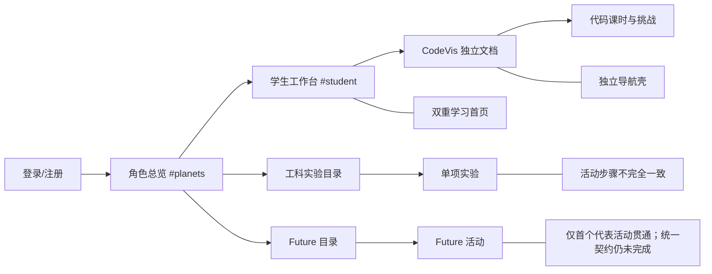
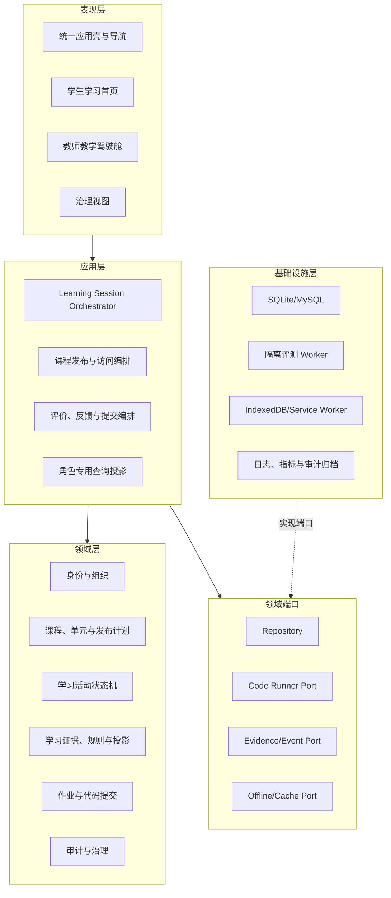
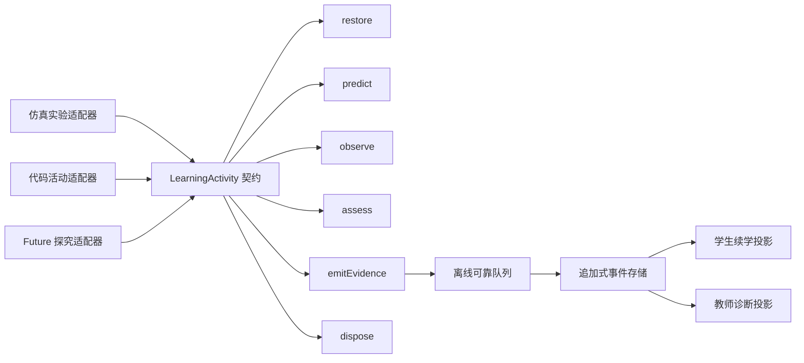
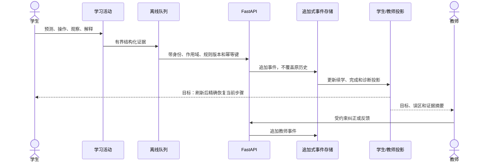
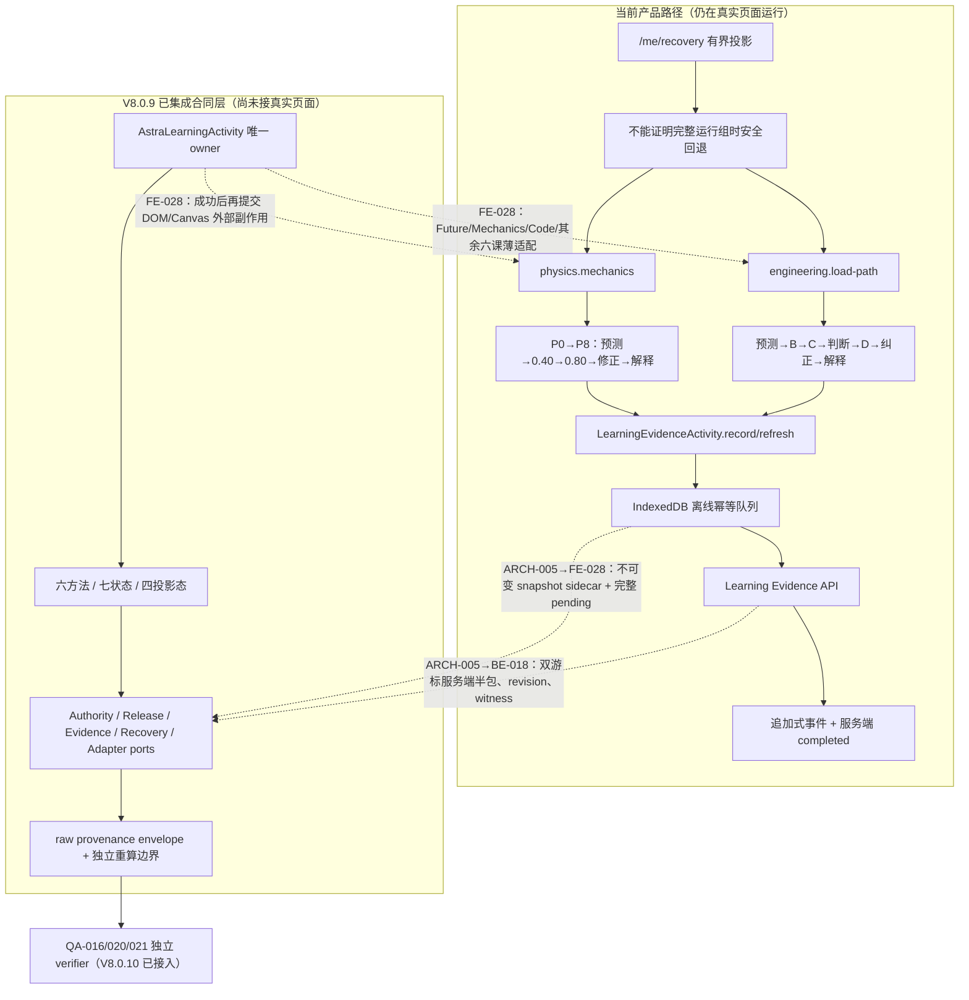
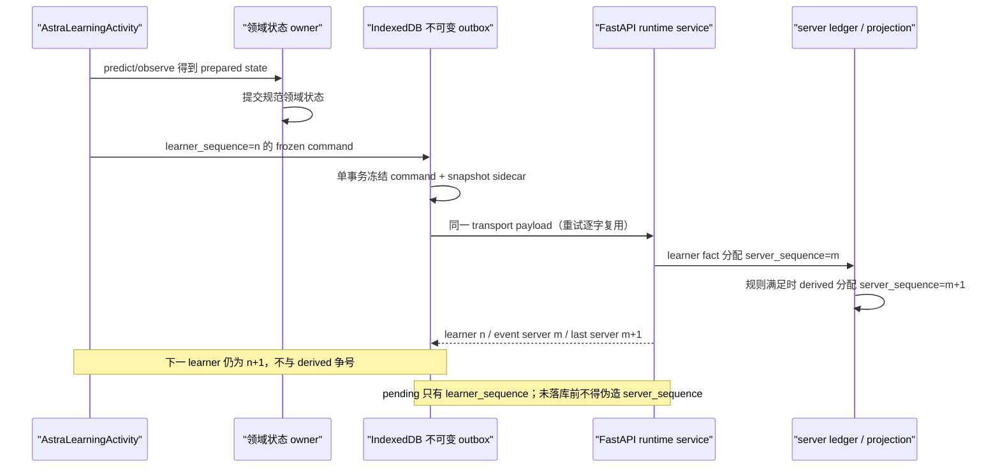
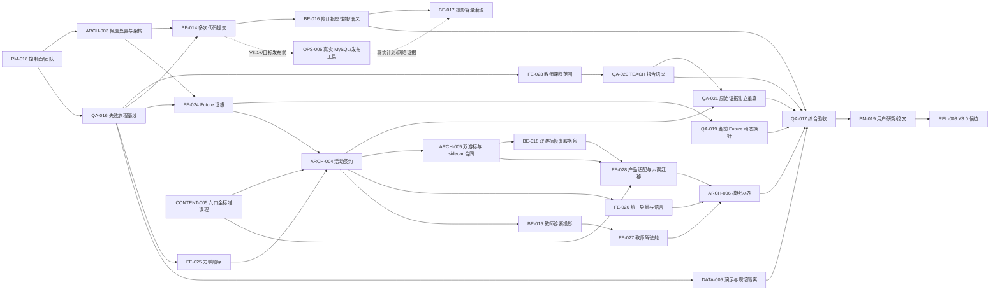

# 星序 Astra — 项目规划

> **文档梗概**：作为优秀本科毕业设计长期优化的唯一规划控制面，负责当前目标、产品与技术差距、目标架构、项目对接登记、任务原件、版本分配、依赖、验收和风险；稳定实现以 [`01-开发者文档.md`](01-开发者文档.md) 为准，已发生提交以 [`03-开发历史.md`](03-开发历史.md) 为准。
>
> **具体规划法则**：
>
> 1. 本文只维护当前和未来，不再堆叠已完成版本过程；完成事实通过任务编号和 Git 版本进入 [`03-开发历史.md`](03-开发历史.md)。
> 2. 所有代码、配置、课程内容、测试、文档和工作树动作必须先有唯一任务卡；一个任务只有一个主责组，一个提交只有一个任务编号和一个小版本。
> 3. 当前核心不是继续增加课程数量，而是把“预测—操作—观察—解释—反馈—教师诊断”做成跨三星系、可恢复、可审计、可实证的统一学习闭环。
> 4. 主开发独占 `主开发` 根工作区、共享 `02/03` 和版本分配；长期小组只在登记的隔离 worktree 内写入，QA 独立验证，禁止用实现组自测替代验收。
>
> **最后一次更新时间**：2026-08-10
>
> **更新者**：PM组

---

## 0. 全局控制规则

1. **当前稳定基线**：产品实现为 `V8.0.10 / b8691e4`，当前控制与调度治理更新为 `V7.9.95`。V8.0.9 已把 `AstraLearningActivity` 六方法运行时、不可变 manifest、七运行态/四服务端投影态、精确恢复消费合同、manual-intervention 锁存、迟到响应隔离、服务端完成边界和 raw-evidence provenance envelope 合入主线；V8.0.10 又把该 provenance 边界接入 QA-016 当前动态探针，由只接收 raw records 的独立 verifier 重算六项 canonical facts，再核对全部报告层和真实退出码。该门禁的 assurance 明确仅为 `consistency-only`，不证明外部来源真实或协调篡改不可能。现有课程页仍通过 `LearningEvidenceActivity.record/refresh/context/destroy` 运行，后端 `/me/recovery` 仍只提供有界投影，三类适配器仍只是合同夹具。BE-018 实施期只读预审进一步证明 V8.0.9 的 learner-only `run.sequence` 与候选中把 rule-derived 事件插入同一 `runtime_sequence` 的方案不兼容；冻结 command 也不含候选强制要求的 snapshot。V7.9.95 因此撤回 BE 的 V8.0.11 令牌，先由 ARCH-005 / V8.0.11 冻结双游标与不可变 outbox sidecar，再由 BE-018 / V8.0.12 重放实现。因而“内核、合同和报告重算已存在”不等于“六门课程已迁移”或“产品已经精确续学”。其余 17 项 Future 活动、六门金标准课、真实浏览器总验收、教师诊断和代码容量治理仍未完成。当前代码事实只能从 [`01-开发者文档.md`](01-开发者文档.md)、代码、配置、测试和可复核运行结果读取，专业组候选 SHA 不能替代主线集成 revision。
2. **长期目标**：把星序 Astra 从“工程能力强但教学闭环不均匀的大型原型”优化为可稳定竞争优秀本科毕业设计的中学探究式学习平台。
3. **论文主线**：统一学习活动协议、可信学习证据、课程发布控制和教师诊断投影；课程数量、页面数量、动画数量只证明工作量，不作为核心创新。
4. **产品边界**：工科试验室、代码空间和未来星系是三个学习空间；`#planets` 是登录后的角色任务总览，不是第四个星系。
5. **诚实能力声明**：Cookie 会话、角色隔离、作业和课程发布计划可用；权威学习证据、教师进度、内容创作与管理员治理仍是部分完成；正式 OJ、AI 助教和目标生产部署仍不可用。任何页面、论文和答辩不得越级宣传。
6. **当前交付边界**：优先完成本地可复现展示版和毕业论文证据。真实 MySQL、公网域名/TLS、隔离代码 Runner、AI、学期级压力测试和未成年人合规终审不是 V8.0 的前置条件。
7. **版本轨道**：`V7.9.x` 用于恢复控制面和消除已确认的关键语义缺陷；`V8.0.x` 用于优秀毕设候选的架构、课程、验收和实证收口；`V8.1+` 继续保留为条件路线，不在当前周期预支实现。
8. **旧候选保护**：遗留 worktree 中的未提交差异归既有项目资产，不得复制、覆盖、提交、清理或冒充稳定实现；先由 `ARCH-003` 形成处置矩阵，再决定逐项吸收、重做或保留。

## 目录

1. [当前周期与完成定义](#1-当前周期与完成定义)
2. [三视角审查与问题矩阵](#2-三视角审查与问题矩阵)
3. [目标产品与技术架构](#3-目标产品与技术架构)
4. [项目对接登记](#4-项目对接登记)
5. [正式任务原件](#5-正式任务原件)
6. [调度、依赖与版本门禁](#6-调度依赖与版本门禁)
7. [验收与论文实证](#7-验收与论文实证)
8. [风险、阻塞与停止规则](#8-风险阻塞与停止规则)
9. [遗留工作树与候选资产](#9-遗留工作树与候选资产)
10. [需要用户提供或确认](#10-需要用户提供或确认)

---

## 1. 当前周期与完成定义

### 1.1 长期目标与论文定位

建议毕业论文题目收束为：

> **面向中学探究式学习的多模态实验平台设计与实现——基于可追溯学习证据与课程发布控制**

长期目标包含三个层次：

1. **产品层**：学生能快速进入当前任务，教师能快速判断学习误区，管理员只处理受约束治理动作；三个角色不再直接面对内部错误码、数据库状态和技术术语。
2. **教学层**：仿真、代码和未来科学活动都必须形成可观察的预测、操作、观察、解释、纠正和完成证据，不允许只靠点击答案或浏览页面完成。
3. **技术层**：建立统一 `LearningActivity` 契约、可靠证据管线、可迭代代码提交模型和教师读模型，并用端到端旅程、真实浏览器和小规模用户研究证明结果。

### 1.2 当前稳定基线

| 范围 | 已核实的当前能力 | 仍然存在的边界 |
| --- | --- | --- |
| 身份与权限 | Cookie-only 会话、角色确认、角色资源裁剪、深链接保护和后端作用域校验 | 用户界面仍暴露部分内部状态和恢复代码 |
| 课程与班级 | 学校、班级、课程、单元、作业、挂接、开放/锁定/隐藏和先修计划可用；教师课程敏感列表已统一校验 `class + course + generation`；FE-023 已在真实 external Edge 的桌面与 390×844 视口补验 Physics→Control Flow 切课、迟到响应隔离和 SQLite 作用域 | 教师首页尚无目标/误区摘要；教师课程正确性已补证，不等于教师决策效率已达标 |
| 学习证据 | 版本化规则、幂等事件、离线队列、恢复、追加式历史、投影和教师纠正可用；`engineering.load-path` 已形成 `predicted + attempted×3 + corrected + explained`，`physics.mechanics` 已形成 `predicted + attempted×2 + corrected + explained`；V8.0.5 还证明 local-pending 使用同一 ID 自动重放且只落一条事实，`completed` 始终只由服务端规则派生；V8.0.9 已冻结完整身份、恢复失败关闭和因果见证的第一版消费合同 | 当前产品页未消费 V8.0.9 内核；候选前审查已证明单一 sequence 无法同时容纳 learner 离线 pending 与中途 rule-derived 事件，frozen command 也没有可直接发送给候选 DTO 的 snapshot。ARCH-005 必须先冻结 learner/server 双游标与不可变 outbox sidecar，BE-018/FE-028 才能分别实现服务器半包和页面恢复；刷新仍只能安全回到可重做起点 |
| 工科试验室 | 五学科、88 个实验；力学代表课已由 P0—P8 状态机强制预测→e=0.40→e=0.80→比较→修正→解释，越序、重复、自由探索、撤权和未确认回执均不推进课程事实 | 力学 owner 与共享 activity 文件继续膨胀；单课深度不能外推其余 87 个实验均已达到同一教学闭环 |
| 代码空间 | 多语言浏览器运行、预测、轨迹、预检和正式提交接口存在；0052 已允许同题多条源码修订，并以客户端键区分新修订与网络重放；V8.0.6 已按 page ID 恢复 `student + problem + class` scope，并批量投影 latest/status-best | `best` 是冻结状态优先级而非数值成绩；稳定实现以第 3 次往返替换逐列表行相关排序，但宽 ORM 行与完整历史候选 `O(H)` 仍是 P2，不能宣称普遍加速；正式隔离 OJ 不可用 |
| 未来星系 | 六方向/18 活动清单、可视化输入、模型边界和作答反馈存在；`engineering.load-path` 已强制预测→B→C→判断→D→纠正→解释，并进入权威证据链 | 只有 1/18 活动达到该运行深度；其余活动仍未统一适配，完整步骤恢复和教师课程事实摘要尚未完成 |
| 教师工作台 | 发布节奏、进度、提交、证据时间线、纠正和学生状态可见；V8.0.2 已关闭异课程列表进入状态/DOM 的实现缺陷，FE-023 的真实浏览器欠账已补齐；V8.0.8/10 又依次关闭 TEACH 人类文案漂移和 raw→fact→report 共因自证 | 页面仍更像控制台，缺少误区摘要和行动建议；报告可信度修复没有改善教师首页的决策效率 |
| 管理治理 | 组织、人员、课程状态、审计与受约束操作已有真实后端 | 旧管理资源候选仍有未完成运行验收，不作为当前稳定能力升级依据 |
| 自动化 | 主线 `npm test` 已通过 232 个受跟踪 JavaScript 文件语法和 54 组合同；QA-019 直接执行当前产品→FastAPI→全新 SQLite 六事件链并以 38 个变异、规则/教师 witness 对账门禁；QA-020 把 TEACH request/state/DOM 事实、历史组合与受控正控分栏；V8.0.9 新增 1,359 行独立运行时合同；V8.0.10 把 22 条正式 raw records 独立重算为六项 canonical facts，13 类 raw/fact/派生层变异均失败关闭 | QA-016 历史 evidence 保持不可改写，当前 baseline/gate 诚实退出 2/1；QA-019 Browser 与 QA-021 Browser 均为 `NOT-RUN`，503 不证明真实 socket/响应丢失；V8.0.10 只证明 `consistency-only`，协调修改 raw+facts+派生层仍可自洽通过，外部真实性需可信采集/签名/独立传输审计；DEMO-01 继续 xfail，真实 MySQL 与其并发/执行计划未运行 |
| 交付 | `astra-local.ps1 + SQLite + 127.0.0.1:9001` 可形成隔离本地演示 | 目标部署、真实 Runner、真实课堂和生产运维证据仍不可用 |

### 1.3 V8.0 完成定义

V8.0 只有同时满足以下条件才能结束：

1. 三个学习空间至少各有两门金标准代表课，共六门，全部遵守统一活动契约。
2. 学生从登录到“继续上次学习”只需要一个明确主动作；跨星系始终有统一返回、面包屑和进度语义。
3. Future 代表课必须记录参数变化、观察、判断、纠正和解释，并能在刷新后恢复、在教师端回读。
4. 力学代表课必须强制受控实验顺序，未完成前置操作时后续动作不可执行。
5. 学生可以对同一代码题提交至少两次不同源码；网络重放同一客户端请求不会创建重复提交。
6. 教师选择某课程后，待批改、进度、代码提交和学习证据不得混入其他课程；首页先给误区摘要和可执行动作，再允许展开原始证据。
7. 学生、教师页面不显示 `course_selection_required`、`manual_locked`、`submitted`、`partial` 等内部状态；日志仍保留机器代码用于诊断。
8. 新演示账号默认为未开始；演示初始化可重复、可重置且不把预置完成冒充现场学习。
9. 三条关键角色旅程具有自动化红绿证据、真实浏览器证据和数据库/事件账本对账。
10. 完成一次小规模可用性与学习效果试用，论文明确样本、任务、指标、限制和原始结果，不虚构有效性。
11. `npm test`、关键后端测试、文档验证、项目对接验证和 Git 检查全部通过；全量测试若超时必须如实记录。
12. 唯一展示候选、文档、Git revision、演示数据说明和答辩脚本指向同一版本。

### 1.4 版本路线

| 阶段 | 版本范围 | 交付重点 | 退出条件 |
| --- | --- | --- | --- |
| 控制面与测试治理恢复 | `V7.9.72—V7.9.75、V7.9.77—V7.9.80、V7.9.82—V7.9.95` | 重写 02、重启长期目标、建立新团队与 worktree 实态、集中分配版本，在产品集成后诚实同步外部验收阻塞，清除迁移测试对过期 current head 的硬编码，记录性能候选边界，拆分候选开发/Browser 终验，并在 FE-024/025、BE-016、QA-019/020、ARCH-004 与 QA-021 集成后登记恢复、容量、模块化、浏览器、报告、证据来源及产品适配责任；实施期发现单 owner 膨胀或上下游合同语义冲突时，先收紧边界、撤回令牌并插入架构修复；稳定文档能力声明改变时同步更新其静态合同 | 文档/任务/版本/团队/Git 一致；旧候选均有处置状态；历史 revision 测试与当前 head 账本职责分离；候选与主线能力分开；已通过、待补证和目标态不混写 |
| 课程分片冻结 | `V7.9.76、V7.9.81` | 依次冻结力学/工程、数学/循环四门代表课程的目标、误区、量规、证据、完成否定项与模型限制 | 四门合同可由前端和架构直接消费；稳定事实、目标状态机、future schema 与当前完成规则分栏，事实和来源可追溯 |
| 可信语义止血 | `V8.0.0—V8.0.5` | 候选资产审计、关键旅程红测、教师课程范围、代码多次提交、Future 证据、力学顺序 | FUTURE-01/02、TEACH-01、CODE-01、MECH-01 五个已复现 P0 语义缺陷全部由失败测试转为通过；DEMO-01 作为独立 P1 继续由 DATA-005 承接 |
| 投影与测试证据加固 | `V8.0.6—V8.0.8` | 收束代码修订投影语义、建立当前 Future 动态探针、修正 TEACH 机器/人类报告漂移 | 已列举语义可被负向夹具捕获，当前实现/报告/退出码一致；Browser、真实网络、真实 MySQL 和容量边界保持独立未完成项 |
| 统一活动内核与恢复合同 | `V8.0.9` | 建立唯一运行时 owner、六方法/七运行态、完整身份与恢复消费合同、并发授权围栏、manual 锁存和来源 envelope | 三类夹具与负向合同通过；只退出“架构可消费”门禁，不把未接页面、未接后端恢复包、未迁六课或未跑真实网络写成完成 |
| 报告原始证据重算 | `V8.0.10` | 让独立 verifier 从 QA-016 的 request/response/state/DOM records 重算六项事实，并把全部报告层与真实退出码绑定到重算结果 | facts 或派生层与 raw 不一致均 exit 3；只退出内部一致性门禁，不宣称外部来源真实性、防篡改或 Browser/网络已验证 |
| 统一学习体验 | 后续 `V8.0.x` | 学习活动契约、统一导航、六门金标准课程、学生反馈和教师诊断投影 | 六门课完成相同闭环；三角色不需要开发者解释 |
| 架构与质量收口 | 后续 `V8.0.x` | 前端模块边界、读模型、性能预算、完整旅程和故障恢复 | 新活动不再依赖遗漏式人工接线；关键门禁进入 CI/本地统一入口 |
| 实证与候选发布 | 后续 `V8.0.x` | 小规模用户研究、论文证据、答辩脚本和唯一候选 | V8.0 完成定义全部满足，QA 与 REL 给出可追溯结论 |

小版本只由主开发在任务进入提交就绪或需要并行预留时分配。除本文件已明确登记的版本外，任何小组不得猜测“下一个版本”。

## 2. 三视角审查与问题矩阵

### 2.1 结论

| 视角 | 当前直观结论 | 优秀档所需改变 |
| --- | --- | --- |
| 中学教师 | 愿意看演示，但当前不适合直接带整班常态使用 | 从管理控制台改为“今日课程—误区摘要—干预动作—原始证据” |
| 中学学生 | 视觉有吸引力，互动真实，但入口重、空间割裂、反馈不一致 | 一个继续学习主动作、统一活动步骤、必须观察后判断、允许修订重试 |
| 本科导师 | 工程深度明显，不是空壳，但主线被功能数量稀释 | 用统一活动契约、可信证据和实证评价回答一个明确研究问题 |

### 2.2 已确认问题矩阵

| 编号 | 优先级 | 问题与证据 | 影响 | 目标任务 |
| --- | --- | --- | --- | --- |
| `NAV-01` | P1 | `#planets`、`#student`、工科目录和 CodeVis 独立壳同时承担学习入口 | 学生先理解平台结构，后进入学习 | `FE-026` |
| `COPY-01` | P1 | 页面暴露内部错误码、英文状态和原始 JSON | 中学生和教师难以判断下一步，完成度观感下降 | `FE-026` |
| `TEACH-01` | P0（已修复） | V8.0.2 已让 pending/code 请求携带 `class_id + course_id`，异课程行、父级错配与不连续分页在 state/DOM 前整页拒绝；2026-08-09 又在当前主线用真实 external Edge 补跑桌面与 390×844，确认 Physics 班课作用域、切到 Control Flow 后旧 Physics 迟到响应不能污染 DOM，SQLite 范围一致且无 P0/P1 | 教师课程上下文的代码、合同、网络、DOM 与数据库证据现已闭环；误区摘要和行动建议仍是 TEACH-02，不与本缺陷混为一项 | `FE-023` |
| `TEACH-02` | P1 | 学习证据默认逐事件展开，缺少目标/误区/行动摘要 | 可审计但不可快速教学决策 | `BE-015`、`FE-027` |
| `FUTURE-01` | P0（代表活动已修复） | V8.0.4 已让 `engineering.load-path` 的预测、三次观察/判断、纠正和解释进入真实服务；当时 Browser+SQLite 对账为 `predicted + attempted×3 + corrected + explained` 且客户端零 `completed`，V8.0.7 又以当前产品 VM→FastAPI→全新 SQLite 固化同一六事件、规则 witness 和教师回读 | 代表活动的权威历史与当前动态门禁已成立；V8.0.7 Browser 仍为 `NOT-RUN`，V8.0.9 只提供尚未接页的统一内核，其余 17 项不能据此自动升级 | `FE-024`、`QA-019`、`ARCH-004`、`FE-028` |
| `FUTURE-02` | P0（代表活动已修复） | V8.0.4 以领域专用 B→C→D 门禁取代通用“猜答案”捷径；未挂载、manual intervention、身份/作用域失效时真实控件全部 fail closed；V8.0.7 以当前状态机和负向变异持续检查同一边界 | 工程代表活动已不能绕过观察；当前 Browser 接线仍由 QA-017 重跑，其他 Future 活动还需 `FE-028` 逐个适配和负向验收 | `FE-024`、`QA-019`、`CONTENT-005`、`ARCH-004`、`FE-028` |
| `FUTURE-03` | P1（合同已完成、产品未完成） | V8.0.9 已规定只有完整、同身份、同运行、顺序连续且 authority/release revision 一致的服务端历史与完整本地 pending 集才能原子恢复；但 `/me/recovery` 尚不能提供该包，现有页面也未调用新内核 | 架构不会再把离散事件拼成伪恢复，但真实学生刷新仍回到预测，尚未达到 V8 完成定义 | `ARCH-004`、`BE-018`、`FE-028` |
| `MECH-01` | P0（页内顺序已修复） | V8.0.5 用 P0—P8 状态机、一次性 permit/receipt、请求身份围栏和权威终态矩阵强制预测→e=0.40→e=0.80→修正→解释；桌面与 390×844、乱序/双击/伪回执、首次 POST 失败→同 ID 恢复及 SQLite 两组 `1/2/1/1` 事实均通过 | 受控实验不能再由提前点击、local-pending、自由探索或伪造 confirmed 回调越级；跨刷新运行组仍须由 `BE-018 + FE-028` 接入 V8.0.9 合同 | `FE-025`、`ARCH-004`、`BE-018`、`FE-028` |
| `CODE-01` | P0（已修复） | V8.0.3/0052 已用 `student + problem + class + client_submission_id` 区分源码修订与请求重放；同键同载荷返回原记录，同键异载荷 409，新键产生独立 submission/attempt | 学生“修改—再提交”主路径已恢复；投影性能和真实 MySQL 证据分别转入 `BE-016`、`OPS-005` | `BE-014` |
| `CODE-02` | P2（语义已收束、容量待治理） | V8.0.6 证明父版 2 次数据往返与新 3 次往返在两种 SQLite scope 形状下墙钟互有胜负；稳定 projection、网络和应用缓冲仍读取完整历史 `O(H)`，page 仍带回源码/stdin/快照宽行，page 与 projection 也不是单快照 | 不能把取消相关子查询等同于普遍加速；真实班级规模、MySQL 网络、驱动缓冲、并发可见性和无界修订仍可能重新放大读成本 | `BE-017`、`OPS-005` |
| `CONTENT-01` | P1 | 课程覆盖广，但精确教师事实主要集中在力学和浅层控制流；其他活动仍偏模板化；V8.0.9 的三类适配器只是测试夹具，不是六门课程成品 | 容易被评审认定为数量大于深度，或把架构图误当成教学成果 | `CONTENT-005`、`FE-028` |
| `DEMO-01` | P1 | 演示数据预置“已完成”证据 | 答辩现场尚未操作就显示完成，可信度下降 | `DATA-005` |
| `ARCH-01` | P1 | 主壳、Router、教师页和管理页文件巨大，依赖 `window.Astra*` 与重复资源版本声明；V8.0.5 后 `bridge-truss.js/frontier-learning.js/learning-evidence-client.js/learning-evidence-activity.js/physics.js` 已达 1114/729/1478/1708/1647 行，V805 缓存代际仍需跨多处人工同步 | 权威语义虽更强，但扩展仍依靠人工记忆，遗漏接线、旧 SW 升级和生命周期风险高；不能把“代码量大”当成架构优秀 | `ARCH-003`、`ARCH-004`、`ARCH-006` |
| `ARCH-02` | P1 | 新 `learning-activity.js` 已为单一职责收束到 979/980 行预算，且目前零产品页消费；若把课程差异、DOM/Canvas 副作用或后端 DTO 继续塞入内核，会立刻形成第二个巨型 owner | 评审可合理质疑“合同很厚、落地为零”；继续扩容也会使可维护性倒退 | `ARCH-005`、`FE-028`、`BE-018`、`ARCH-006` |
| `ARCH-03` | P1（候选前已拦截） | V8.0.9 内核只为 learner command 预留 `run.sequence`，BE-018 预备实现却让 rule-derived terminal 占用同一唯一序号；真实内核在 learner 2 触发 server 3 后仍会发送 learner 3，手写 learner 4 的后端测试绕开了冲突。与此同时 frozen command 不含 snapshot，临时从 DOM/Canvas 重采 snapshot 会使同 ID 网络重放发生 payload 冲突 | 在线下一笔会 409；多条离线 pending 更会与中途派生事件争号，无法靠 receipt 增加一个 cursor 修补。snapshot 若不先进入不可变 outbox，也不能诚实称为可重放领域快照 | `ARCH-005`、`BE-018`、`FE-028` |
| `QA-01` | P1（已修复） | QA-016 的六项失败基线保持不可变；V8.0.7 另建 `engineering.load-path` 当前态动态探针，直接运行产品状态机并对账服务端规则、教师回读和全新 SQLite | 历史失败证据与当前持续门禁已分责；QA-016 不需要被篡改为“现在通过” | `QA-019` |
| `QA-02` | P1（已修复） | 完整后端首次跑到 100% 后，0051 历史迁移测试仍断言仓库当前 head 必须是 0051；0052 合法落地后形成假失败 | 全量回归不能给出可信终态，历史迁移节点与当前迁移账本职责混淆 | `QA-018` |
| `QA-03` | P2（已修复） | V8.0.8 从真实 request 参数、进入 state 的课程 ID 和 DOM 结果派生 TEACH 事实；正式报告保留旧历史 AND，显式正控分栏，JSON→summary→overall→execution→human→exit 同源 | 当前构建不再用旧故障句解释 `defect_observed=false`；单层与多层派生篡改均失败关闭 | `QA-020` |
| `QA-04` | P2 | QA-019 的 Node/Python/合同文件为 1122/610/201 行，依赖源码 marker 暴露私有函数；38 个变异中只有 1 个 product-callback，其余是结构化报告/后端结果变异；新 Browser 旅程未运行 | 能证明列举缺陷和当前服务链可被门禁捕获，但不能替代 DOM 接线、真实 socket/响应丢失、通用产品正确性或桌面/移动总验收；测试自身也需要后续拆层 | `ARCH-006`、`QA-017` |
| `QA-05` | P2（已修复；真实性边界保留） | V8.0.10 的独立 verifier 精确只接受 `schema_version/envelope_id/raw_records`，正式 backend 链以 22 条 request/response/state/DOM records 重算六项 facts；fact-only、raw-only、单/全派生层及 facts+全部派生但 raw 不变共 13 类反例均使直接结果与子进程 exit 3，README 已分清原始 aec0587 exit 0 与当前 baseline exit 2 | QA-016/020 的“claimed facts 可与派生层共同自证”已关闭；但协调修改 raw+facts+派生层仍可自洽通过，故论文只能宣称 `consistency-only`，不能宣称防篡改、来源真实性或来源独立传输 | `ARCH-004`、`QA-021` |
| `RESEARCH-01` | P1 | 缺少学生/教师任务数据、前后测和可用性量表 | 论文只能证明“实现了”，不能证明“有效” | `PM-019` |

### 2.3 必须保留并强化的技术差异化

1. 追加式学习证据及不可变历史，而不是单个 `completed=true`。
2. 版本化完成规则、课程发布计划和教师纠正，而不是纯前端进度条。
3. IndexedDB 离线队列、幂等、恢复和身份围栏，而不是页面刷新即丢失。
4. 浏览器预检与正式评测语义分离，而不是把本地运行包装成 OJ。
5. 三角色读取同一教学事实的不同投影，而不是三套互不相干的演示页面。

### 2.4 当前导航与信息架构缺口



目标导航只保留一个学生首要动作：`继续上次学习`。课程地图负责发现，统一活动页负责完成学习，身份/安全说明进入个人设置或帮助，不占据学生首屏。

## 3. 目标产品与技术架构

### 3.1 目标分层架构

当前阶段采用模块化单体，不为答辩制造微服务复杂度。



架构约束：

- 页面不得直接拼接 ORM 或数据库概念；教师端优先消费专用读模型。
- 后端 service 不得反向导入 API endpoint；既有反向依赖只能减少。
- 不要求当前一次性迁移 React、微服务或 TypeScript；先在现有技术栈内建立可测试边界。
- `index.html`、`router.js`、教师/管理巨型页面和资源代际声明继续执行只减不增门禁。

### 3.2 统一学习活动契约



每个活动必须声明并可验证：

| 字段 | 必要内容 |
| --- | --- |
| 教学定位 | 年级、课标、课时、先修知识 |
| 学习目标 | 可观察、可评价，禁止只写“了解/熟悉” |
| 预测 | 学生操作前的判断和理由 |
| 操作与观察 | 必须改变的变量、必须记录的测量或轨迹 |
| 常见误区 | 至少一个与反馈分支直接相连的错误概念 |
| 评价 | 正确、部分正确、证据不足和模型外结论的边界 |
| 修正 | 允许再次尝试，并记录修订而不是覆盖历史 |
| 完成规则 | 由服务端版本化规则派生，客户端不得直接写完成 |
| 教师投影 | 目标达成、误区、证据缺口和建议动作 |
| 维护信息 | 来源、模型限制、安全、可访问性、恢复和释放策略 |

活动契约还必须持有跨刷新与跨设备恢复所需的完整身份：`class/course/unit/activity + learner subject + run/group + manifest/content/event schema/rule/cache generation`、事件顺序、服务端历史和离线队列的合并规则、可原子应用的恢复快照、与身份绑定的 manual-intervention 解除条件，以及具有因果顺序的服务端组合完成见证。V8.0.9 已实现身份、失败关闭和因果见证的第一版消费合同；BE-018 候选前审查证明其单 sequence 还不能同时表达 learner 离线预留和中途 server-derived 事实，因此 ARCH-005 必须在产品接入前升级为 learner/server 双游标。V8.0.4/5 的工程和力学产品页尚未迁移，不能仅凭若干离散事件反推最近一次完整运行组。

从毕业论文技术解析层面，V8.0.9 后必须把“架构完成度”分成五层，不能用底层合同替上层产品背书：

| 层次 | 当前已完成 | 仍不能证明 | 下一修改点 |
| --- | --- | --- | --- |
| L0 活动描述 | 规范化且不可变的 manifest、量规 ID/版本、精确 release scope 和 adapter/ports 创建门禁 | 六门课程内容均符合该 manifest | `CONTENT-005` 补齐后两课，`FE-028` 逐课装配 |
| L1 运行控制 | `restore/predict/observe/assess/emitEvidence/dispose`、七运行态、授权/发布并发 fail-fast、manual 锁存、abort/dispose/late-result 隔离 | 当前 DOM/Canvas 已受该状态机控制 | `FE-028` 建立薄适配器；运行时成功后页面才提交外部副作用 |
| L2 权威数据 | 完整身份、失败关闭、服务端完成 witness、幂等 receipt 和窄 ReleasePort 的第一版消费规则 | 单一 sequence 不能同时证明 learner pending 顺序与 server ledger 顺序；当前后端也不能证明客户端 snapshot 的领域正确性或完整 pending 集 | `ARCH-005` 冻结双游标/sidecar；`BE-018` 返回权威服务器半包；`FE-028` 汇合不可变 outbox 与完整 pending，缺一项即 manual |
| L3 教学应用 | 仿真、代码、Future 三类 conformance fixture 通过同一内核 | 任一 fixture 是真实课程、六课可精确续学或教师可诊断 | `FE-028` 迁移六课，`BE-015/FE-027` 建教师读模型和驾驶舱 |
| L4 论文证据 | V8.0.10 已把独立 verifier 接到真实 QA request/response/state/DOM records，六项 facts 和全部报告层可复算，13 类不一致反例 exit 3 | 外部真实性、协调篡改不可发生、真实浏览器和真实网络均未证明 | `QA-017` 做当前 revision 端到端/可信采集验收，`PM-019` 做用户实证；论文固定写 `consistency-only` |

更细的组件/端口图、生命周期状态图、原子恢复时序图、manual 锁存图和 provenance 信任边界图见 [`24-V7.6全栈模块边界契约.md`](02-子文档/24-V7.6全栈模块边界契约.md) 第 17 节；每张图均分别列明“能证明、不能证明、后续接入点”。

### 3.3 权威学习证据闭环



V8.0.9 后的双轨事实如下。上半部是学生当前实际走的旧产品链，下半部是已经进入主线但尚未接页的新内核；虚线代表明确的后续实施责任，而不是已经可用的功能。



`manual intervention`、未挂载、非 open、身份切换、generation/route/scope 失效均必须在每次真实写入前重新校验；UI 失败关闭必须同时禁用 DOM 控件和证据控制器，不能只用 Canvas 遮罩制造“看起来不可点”。V8.0.9 只承诺内核自身状态原子性；适配器触发的网络、DOM、Canvas 或仿真外部副作用不可被 JavaScript 自动回滚。ARCH-005/FE-028 的两阶段顺序必须明确：`predict/observe` 成功后先由同一领域 owner 提交可序列化的 prepared domain state，再调用 `emitEvidence`；EvidencePort 在一次 IndexedDB 事务中冻结 `command + snapshot` 后才发网。依赖权威回执的完成提示、导航和教师可见投影只能在 receipt 成功后提交；abort/dispose 后的迟到结果不得回写。snapshot 禁止从 DOM/Canvas 反向抓取，也禁止在同 ID 重试时重新采集。

#### 3.3.1 双游标与不可变快照 sidecar

单一整数不能同时承担“浏览器已经预留的 learner 顺序”和“服务器插入派生事实后的账本顺序”。目标合同把两种因果关系显式分开：

| 坐标 | 唯一 owner | 递增对象 | 恢复用途 |
| --- | --- | --- | --- |
| `learner_sequence` | `AstraLearningActivity` + IndexedDB outbox | 只对 learner command 递增；离线时也可连续预留 | 校验 pending 完整性、同 ID 重放和下一条学习者命令 |
| `server_sequence` | FastAPI + 0053 运行账本 | 每条已持久化 learner/rule/trusted 事实递增 | 校验服务器历史连续性和 completion witness 因果顺序 |
| snapshot learner cursor | 领域状态 owner + EvidencePort sidecar | 绑定产生该领域状态的 learner command | 证明服务器保存的是首次冻结的同一 snapshot 字节，不证明内容在教学上正确 |
| projection server cursor | 规则/投影 owner | 绑定已处理到的 server ledger 位置 | 证明完成/迁移结论只来自服务端派生事实与来源见证 |



该模型不让客户端发送 `completed/transferred`，也不把 server cursor 交给客户端自选。仅在 receipt 增加 `server_last_sequence` 而继续共用一个序号，只能修在线单笔；多条离线 pending 仍会被中途派生事实占号，故不进入候选。

### 3.4 代码提交目标模型

学生修订和执行器重试必须分离：

```text
CodeProblem（学生 + 班级 + 题目范围）
├── CodeSubmission #1（修订 v1；冻结 ProblemVersion #1）
│   ├── JudgeAttempt #1
│   └── JudgeAttempt #2（仅执行器重试）
└── CodeSubmission #2（修订 v2；可冻结后续 ProblemVersion）
    └── JudgeAttempt #1
```

外部客户端应显式提供稳定 `client_submission_id`。网络重放同一键和原始载荷返回原提交；同键异载荷固定冲突；新键创建新修订。列表逐条提供 `is_latest_revision` 与 `is_best_revision`，其中当前 best 只表示明确状态优先级下的“状态最佳”，不是数值最高分；无键兼容模式只能确定性重放同版本同内容，不能表达“相同内容也要新增修订”。

### 3.5 三角色目标流程

| 角色 | 首屏必须回答 | 核心流程 | 默认隐藏内容 |
| --- | --- | --- | --- |
| 学生 | 现在学什么、上次停在哪里 | 继续学习→预测→操作→观察→解释→反馈→修正 | Cookie、内部错误码、数据库状态、治理控件 |
| 教师 | 今天教什么、谁卡在哪里、下一步做什么 | 选班课→发布→看误区摘要→展开证据→反馈/退回/开放下一单元 | schema、租约、轮询、原始 JSON、跨课程队列 |
| 管理员 | 哪个治理动作待处理、影响谁、是否可回滚 | 组织/人员/课程治理→影响确认→提交→审计回读 | 任意 SQL、内部表、无约束批量写入 |

## 4. 项目对接登记

- **项目对接模式**：启用
- **主控任务标题**：星序 Astra｜主开发｜总控
- **版本分配者**：主开发
- **当前版本轨道**：`V7.9.x` 恢复桥接 → `V8.0.x` 优秀毕设收口
- **集成分支**：`主开发`
- **当前基线**：产品实现 `V8.0.10 / b8691e4`；本次控制面 `V7.9.95`（父控制提交 `e2a2906`，父产品/集成提交 `b8691e4`）；各长期任务只接受主开发派单中的精确 Git SHA
- **提交责任组字段**：启用
- **长期团队策略**：主开发与独立 QA 固定；ARCH、FE、BE、CONTENT 按真实责任域长期保留；五组已于 2026-08-09 创建、置顶、完成只读基线核对并由 PM 建立专属分支。

| 小组 | 代号 | 长期任务标题 | 责任边界 | Git 模式 | 分支/工作树 | 生命周期 |
| --- | --- | --- | --- | --- | --- | --- |
| 主开发 | PM | 星序 Astra｜主开发｜总控 | 用户接口、目标、任务、版本、共享文档、Git 集成和最终决策 | 集成工作区 | `主开发` / 根工作区 | 活跃 |
| 架构组 | ARCH | 星序 Astra｜架构组｜长期对接 | 目标架构、活动契约、遗留候选处置、模块边界和技术债门禁 | 长期 worktree | `codex/astra-v8-arch-v811` / `0725` | 活跃 |
| 前端组 | FE | 星序 Astra｜前端组｜长期对接 | 学生/教师路径、三个学习空间、活动适配器、导航、反馈和前端生命周期 | 长期 worktree | `codex/astra-v8-frontend-mechanics` / `10fa` | 活跃 |
| 后端组 | BE | 星序 Astra｜后端组｜长期对接 | 课程作用域、代码提交、证据服务、教师读模型、迁移和后端测试 | 长期 worktree | `codex/astra-v8-backend-v812` / `5779` | 活跃（合同 HOLD） |
| 内容组 | CONTENT | 星序 Astra｜内容组｜长期对接 | 六门金标准课程、课标/目标/误区/量规/来源与教师教学材料 | 长期 worktree | `codex/astra-v8-content-v2` / `bfa9` | 活跃 |
| QA组 | QA | 星序 Astra｜QA组｜长期对接 | 独立旅程测试、真实浏览器、数据库对账、性能与用户研究证据 | 只读/隔离 worktree | `codex/astra-v8-qa-v810` / `d746` | 活跃 |

当前派单状态：`ARCH-003 / V8.0.0`、`QA-016 / V8.0.1`、`CONTENT-005 / V7.9.76/V7.9.81`、`FE-023 / V8.0.2`、`BE-014 / V8.0.3`、`QA-018 / V7.9.78`、`FE-024 / V8.0.4`、`FE-025 / V8.0.5`、`BE-016 / V8.0.6`、`QA-019 / V8.0.7`、`QA-020 / V8.0.8`、`ARCH-004 / V8.0.9` 及 `QA-021 / V8.0.10` 已进入主线。QA-021 候选 `e47f84b26748` 经主开发与 ARCH 双重只读复审后重放为 `b8691e4b8069`，四文件 blob 与 stable patch-id `2a9dc306465d` 一致；QA 组回到只读。BE-018 的旧 `V8.0.11` 令牌和标题已在形成提交前撤回：预备树的模块拆分、先修发布修复和迁移工作保留，但 single-sequence/snapshot 方案被 ARCH 以 P1 退回，不得提交或变基。ARCH-005 现从 `b8691e4` 承接 `V8.0.11` 双游标与 outbox sidecar 合同；合同集成后，BE-018 在重命名的 `codex/astra-v8-backend-v812` 上以 `V8.0.12` 重放。QA-021 集成不等于 Browser、外部真实性、后端精确恢复或六课适配完成。

规则：

1. 本表不记录 Codex 内部任务 ID；只使用标准标题恢复映射。
2. 长期小组不得自行创建工作树、分配版本、合并主线或清理遗留资源。
3. 同一工作目录同一时间只有一个写入者；任务发生共享文件冲突时必须串行。
4. QA 首轮先建立独立失败基线，不在实现组候选上修改产品代码。
5. 工作树栏只登记 Codex 目录短标识，不在项目文档硬编码用户机器绝对路径；每次派单仍须携带精确 branch、HEAD 和允许路径。

## 5. 正式任务原件

### 5.1 控制面与第一波启动

- [ ] PM-018｜状态：进行中｜目标版本：V7.9.72—V7.9.75、V7.9.77、V7.9.79—V7.9.80、V7.9.82—V7.9.95｜模块：优秀毕设长期优化控制面｜主责：PM｜协作：ARCH、FE、BE、CONTENT、QA｜任务：全面重写 02，登记长期目标、三视角问题、目标架构、版本路线、任务与遗留候选处置；创建或恢复五个长期小组，回填实际 worktree、集中发出任务/版本令牌并在每次集成/验收后同步真实阻塞与候选适用边界；实施期只读预审若发现新逻辑继续扩张巨型 owner，或真实上下游合同存在语义冲突，先在本文收紧模块/数据边界并撤回不安全版本令牌再恢复写入｜前置：用户于 2026-08-09 明确恢复并授权长期推进；根工作区 clean｜关联文档：本文、[`03-开发历史.md`](03-开发历史.md)、[`22-V8最终完成路线与验收蓝图.md`](02-子文档/22-V8最终完成路线与验收蓝图.md)｜关联版本：V7.9.72（规划控制面）、V7.9.73（团队实态）、V7.9.74（首波执行状态）、V7.9.75（CONTENT 首片令牌）、V7.9.77（FE-023 浏览器补证阻塞同步）、V7.9.79（BE-016 候选风险与后续容量治理）、V7.9.80（CONTENT 第二片令牌与分支恢复）、V7.9.82（集成第二片并拆分外部终验/候选开发门禁）、V7.9.83（FE-024 集成证据与后续架构/QA责任收束）、V7.9.84（FE-023 补证、FE-025 集成和 QA 报告债收束）、V7.9.85（Browser PASS 文档与缓存静态合同一致性）、V7.9.86（BE-016 当前父线重放、双复审与集成）、V7.9.87（QA-019 当前态探针、假阳性复审与 Browser/真实网络边界收束）、V7.9.88（QA-020 精确父线、分支和报告层令牌）、V7.9.89（QA-020 双复审、父线重放、集成与来源债登记）、V7.9.90（ARCH-004 精确父线、新分支、唯一标题和受限 owner 令牌）、V7.9.91（拒绝挂起候选、复审修订候选、主线重放并拆分真实恢复/产品适配责任）、V7.9.92（从同一精确父线并行发放 QA-021 原始证据重算与 BE-018 恢复服务器半包令牌）、V7.9.93（BE 实施期触发巨型服务止损，放行专用活动运行服务 owner）、V7.9.94（QA-021 双复审、主线重放、稳定文档同步与 BE 最新产品父线）、V7.9.95（ARCH 退回单序号/snapshot 候选、撤回并重排 V8.0.11—12 令牌、冻结双游标路线）｜验证：文档与项目对接验证、Git/worktree/任务标题对账、任务写入范围互不冲突；正式启动、候选、Browser、架构和主线集成逐层记录；稳定能力声明改变时同提交更新对应静态合同，局部代表活动或合同 PASS 不自动等同全课程、精确恢复、真实网络或防篡改证明

- [x] ARCH-003｜状态：已完成｜目标版本：V8.0.0｜模块：目标架构与遗留候选处置｜主责：ARCH｜协作：PM、FE、BE、CONTENT、QA｜任务：只读比较当前根线与 `f017/fr89/ux64/u358` 等遗留候选，输出逐文件“直接吸收/重新实现/保留参考/不可用”矩阵；冻结统一活动契约、前后端边界和第一波不得触碰范围，不修改遗留工作树｜前置：PM-018 / V7.9.73 回填实际架构组 worktree｜关联文档：本文第 3、9 节、[`24-V7.6全栈模块边界契约.md`](02-子文档/24-V7.6全栈模块边界契约.md)｜关联版本：V8.0.0｜验证：实际态/目标态架构图、`LearningActivity v1` 六方法生命周期、七状态/四投影/七端口、逐候选处置矩阵和机器门禁一致；六组候选指纹保持原样；架构合同门禁通过

- [x] QA-016｜状态：已完成｜目标版本：V8.0.1｜模块：关键教学旅程失败基线｜主责：QA｜协作：PM、ARCH、FE、BE｜任务：独立固化三条当前失败旅程：Future 未操作即可判断且教师无证据、教师 Physics 队列混入其他课程、代码修改后第二次正式提交冲突；补充力学顺序和演示预完成检查，先形成失败证据再验收修复｜前置：PM-018；使用全新仓库外数据目录，不复用旧 QA TEMP｜关联文档：本文第 2、7 节、[`22-V8最终完成路线与验收蓝图.md`](02-子文档/22-V8最终完成路线与验收蓝图.md)、[`tools/qa/README-QA-016.md`](../tools/qa/README-QA-016.md)｜关联版本：V8.0.1｜验证：FUTURE-01/02、TEACH-01、CODE-01、MECH-01、DEMO-01 均有动态运行、API/数据库或状态证据和明确 owner；基线模式六项 PASS、目标 gate 诚实退出 1、默认合同保持可运行；完整后端 424 秒 TIMEOUT 明确保留

### 5.2 可信语义止血

- [x] FE-023｜状态：已完成｜目标版本：V8.0.2｜模块：教师课程作用域一致性｜主责：FE｜协作：BE、QA｜任务：教师选择课程后，pending submission、代码提交、进度和学习证据请求全部携带并验证同一 `class_id + course_id`；当前课程之外的行不得进入 DOM，课程切换须取消或隔离迟到响应｜前置：QA-016 记录 TEACH-01 失败基线；现有后端 pending endpoint 已支持 `course_id` 过滤｜关联文档：本文第 2.2、3.5 节、[`28-V7.8教师自然工作流与证据回读冻结契约.md`](02-子文档/28-V7.8教师自然工作流与证据回读冻结契约.md)｜关联版本：V8.0.2（实现）、V7.9.77/V7.9.82（诚实记录外部阻塞）、V7.9.84（补证关闭）、V8.0.8（QA 报告层对齐）｜验证：独立 VM 的 pending/code/attempt 九项异常分页、异课程整页拒绝、空课程、403、重试、切课迟到与 QA-016 TEACH probe 均通过。2026-08-09 又在主线 `0e57356393d6`、正式本地服务、仓库外全新 SQLite 和 trusted external Edge 上完成 1015×898 / 390×844：Physics 请求与 DOM 均保持当前 class/course，切到 Control Flow 后延迟 Physics 响应不能回写，账本范围一致，应用 console/pageerror 无产品阻断，P0/P1=0。V8.0.8 已关闭 QA-016 在 `defect_observed=false` 时仍复述旧故障的报告债；这只提升测试证据可信度，不改变 FE-023 产品结论

- [x] BE-014｜状态：已完成｜目标版本：V8.0.3｜模块：代码提交与学生修订｜主责：BE｜协作：ARCH、FE、DATA、QA｜任务：把学生源码修订与执行器重试分离；允许同一学生对同一题目/班级创建多条 submission，以 `client_submission_id` 保证网络幂等，并提供 latest/status-best 稳定读取；迁移保留既有提交和判题历史｜前置：QA-016 记录 CODE-01 失败基线；ARCH-003 冻结数据边界｜关联文档：本文第 3.4 节、[`24-V7.6全栈模块边界契约.md`](02-子文档/24-V7.6全栈模块边界契约.md)、[`07-后端优化与设计.md`](07-后端优化与设计.md) 第 3.6 节｜关联版本：V8.0.3｜验证：同键同原始载荷重放为一条 submission/attempt，同键异载荷含跨 active version 超策略输入仍为 409，不同键形成独立修订；NFD/CRLF 原始 UTF-8 往返、权限、并发、runner unavailable、latest/status-best、0052 升降级与 attempt 保全通过；CODE-01 转绿、DEMO-01 仍 xfail；SQLite QA 账本动态接受 0052、拒绝父 revision 和多 head；完整后端 484 秒 TIMEOUT，真实 MySQL NOT-RUN 并转入后续任务

- [x] FE-024｜状态：已完成｜目标版本：V8.0.4｜模块：Future 观察门禁与学习证据｜主责：FE｜协作：CONTENT、ARCH、BE、QA｜任务：以 `engineering.load-path` 为首个代表活动，强制有效预测和 B→C→D 观察序列后再判断/纠正/解释；通过统一证据客户端写入有界结构化事实，非 open、未登录、manual intervention、身份/代际/路由/作用域失效时保持零敏感写入｜前置：ARCH-003、QA-016、CONTENT-005 前两片、V7.9.82｜关联文档：本文第 3.2—3.3 节、[`25-V7.7未来星系18课程内容与路由冻结矩阵.md`](02-子文档/25-V7.7未来星系18课程内容与路由冻结矩阵.md)、[`27-V7.7三星系六门代表课程教学与证据冻结契约.md`](02-子文档/27-V7.7三星系六门代表课程教学与证据冻结契约.md)｜关联版本：V8.0.4 / `348a332e3685`｜精确标题：`V8.0.4 FE feat(future-evidence): 建立观察门禁与学习证据闭环（FE-024）`｜验证：QA/ARCH 对精确 SHA 复审均 PASS、P0/P1=0；主线 226 项语法、51 项前端合同和核心后端 94 passed / 2 skipped；桌面与 390×844 真机全流程、键盘提交、SQLite 六类事件对账、服务端完成投影、全新 SW 与旧 SW 普通 reload 升级均通过，应用来源 console/pageerror/network failure 为 0。刷新只在可证明的有界前缀内恢复，无法证明完整序列时安全回退到预测；V8.0.9 已完成恢复消费合同，真实跨源历史、后端恢复包和页面接入分别继续由 `BE-018/FE-028` 完成，不把诚实回退或未接内核写成完整恢复

- [x] FE-025｜状态：已完成｜目标版本：V8.0.5｜模块：力学受控实验状态机｜主责：FE｜协作：CONTENT、QA、ARCH｜任务：把“先 e=0.40、后 e=0.80、再比较和解释”从文案升级为真实状态机；后续按钮在前置证据确认前禁用，自由探索不得污染受控试验完成规则｜前置：QA-016 记录 MECH-01；FE-024 已集成并清理；不得改变服务端完成规则含义｜关联文档：本文第 1.3、3.2—3.3 节、[`27-V7.7三星系六门代表课程教学与证据冻结契约.md`](02-子文档/27-V7.7三星系六门代表课程教学与证据冻结契约.md)｜关联版本：V8.0.5 / `95571d7822dc`｜精确标题：`V8.0.5 FE fix(mechanics-sequence): 强制力学受控实验顺序（FE-025）`｜验证：QA/ARCH 对同一精确 SHA 独立 PASS，P0—P3 无候选阻断项；227 项语法、52 项前端合同、39 项教师 facts 与 QA-016 MECH 全绿。真实 Edge 桌面/390×844 完成 P0→P8，后续控件只在前置事实取得一致权威终态后开放；乱序、双击、错 ID/type、无 permit、伪 confirmed receipt、撤权、destroy、caller abort、manual、queue-loss 与自由探索均失败关闭。首次 evidence POST 失败时保持 P0/busy、IndexedDB local-pending、SQLite 0 行；恢复后自动重放同一 ID，SQLite 只落 1 行并只推进 P1。桌面与移动各精确形成 `predicted=1 / attempted=2 / corrected=1 / explained=1`，客户端新增 completed=0、既有 completed 全为 rule producer；Future/CodeVis 回归、全新 V805 和 V804→V805 普通 reload/旧缓存删除/新字节接管通过。刷新仍只安全回到 P0；V8.0.9 的完整运行组合同尚须由 `BE-018/FE-028` 接到真实力学页

- [ ] DATA-005｜状态：未认领｜目标版本：V8.0.x（第一波验收后分配）｜模块：演示种子与现场学习隔离｜主责：DATA｜协作：PM、BE、FE、QA｜任务：把用于教师诊断展示的预制学习样例与新演示学生的现场学习账本分离；默认现场账号的代表活动必须为 `not_started` 且零学习事件，完整样例只进入明确的 sample profile、独立样例主体或等价隔离范围；保留答辩可展示性并保证初始化幂等｜前置：QA-016 / DEMO-01；不得删除 DATA-003/004 已形成的双范围和教师事实资产｜关联文档：[`29-V7.9本地演示数据与初始化冻结契约.md`](02-子文档/29-V7.9本地演示数据与初始化冻结契约.md)、[`tools/qa/README-QA-016.md`](../tools/qa/README-QA-016.md)｜关联版本：待分配｜验证：全新仓库外 SQLite 初始化后现场学生 completed projection=0、learning event=0；样例教师仍可读取明确标识的代表事实；重跑不增殖；无凭据、绝对临时路径或真实用户数据进入仓库

### 5.3 统一学习体验与课程深度

- [x] ARCH-004｜状态：已完成｜目标版本：V8.0.9｜模块：统一学习活动内核与精确恢复契约｜主责：ARCH｜协作：FE、BE、CONTENT、QA｜任务：在现有原生 JavaScript 和 FastAPI 边界内建立 `shared/js/learning-activity.js` 作为 `AstraLearningActivity` 唯一 owner，用注入端口编排不可变 manifest、状态机、证据、评价、释放和恢复；冻结稳定 authority/scope、`run_id/group_id`、事件顺序、manifest/content/event schema/rule/cache generation，只有同身份、同运行、顺序连续且兼容 schema 的完整服务端历史/离线事实才能原子应用；学习者只可发五类事件，`completed/transferred` 保持服务端专属；dispose/abort/迟到响应和 manual 锁存均失败关闭；仿真/代码/Future 只提供合同夹具；冻结 QA-021 可独立重算的 provenance envelope｜前置：ARCH-003、FE-024、FE-025、V7.9.90｜关联文档：本文第 3.2—3.3 节、[`24-V7.6全栈模块边界契约.md`](02-子文档/24-V7.6全栈模块边界契约.md) 第 17 节｜关联版本：V8.0.9 / `3606df996204`｜候选：`de95eec40059`（父 `f925f6584423`）｜拒绝候选：`f539706ffa6f`（Authority/Release resolved-negative 与 pending peer 可挂起）｜精确分支：`codex/astra-v8-arch-v809`｜精确标题：`V8.0.9 ARCH feat(activity-runtime): 建立统一活动内核与恢复契约（ARCH-004）`｜实现范围：五文件 `+2988/-7`，运行时 979 行、独立合同 1,359 行，候选/主线 blob 零差异且 stable patch-id `9c9c8a536f4b`｜验证：同轮 Authority/Release 并发 fail-fast、21 类恢复否定项、身份锁存、因果 witness、幂等 evidence、三类 fixture、来源重算和外部副作用边界均通过；QA 终审 P0/P1/P2/P3=0；主线 231/231 语法、54/54 合同，文档兼容 0 error（既有 99 号 warning）、项目对接、`git diff --check` 全部通过。Browser 与真实网络 p95 为 `NOT-RUN` 且非本任务要求；真实课程页、后端恢复 DTO 和六课迁移明确未实现

- [ ] ARCH-005｜状态：进行中｜目标版本：V8.0.11｜模块：学习活动双游标与 snapshot outbox 合同｜主责：ARCH｜协作：BE、FE、QA｜任务：在不让客户端发送完成结论的前提下修订 V8.0.9 的恢复/回执合同：`run.sequence` 固定为 learner-only；服务器历史使用独立连续 `server_sequence`；confirmed/reconciled receipt 同时回显 learner sequence、该事件 server sequence 与 server last cursor；recovery 分别校验 server history 和 offline learner pending，completion witness 按 server sequence 比较因果；domain snapshot 绑定 learner cursor，projection/witness 绑定 server cursor。冻结 EvidencePort 首次调用把 frozen command 与 post-event 规范领域 snapshot 在一次 IndexedDB 事务中写为不可变 transport outbox、后续同 ID 重试逐字复用的 sidecar 责任，但本任务不实现具体页面/IndexedDB｜前置：ARCH-004、V7.9.95 的 P1 退回裁决；BE-018 保留 dirty 现场且不得提交｜关联文档：本文第 3.3.1 节、[`24-V7.6全栈模块边界契约.md`](02-子文档/24-V7.6全栈模块边界契约.md) 第 17 节｜关联版本：V8.0.11｜精确父线：`b8691e4b8069`｜精确分支：`codex/astra-v8-arch-v811`｜精确标题：`V8.0.11 ARCH fix(activity-runtime): 分离学习者序号与服务端顺序（ARCH-005）`｜允许写入：`shared/js/learning-activity.js`、新纯恢复 helper `shared/js/learning-activity-recovery.js`、`tools/architecture/v76-module-boundaries.json`、`tools/tests/architecture-boundary-contract.cjs`、`tools/tests/learning-activity-runtime-contract.cjs`、新 `tools/tests/learning-activity-recovery-contract.cjs`、[`24-V7.6全栈模块边界契约.md`](02-子文档/24-V7.6全栈模块边界契约.md)；不得写 backend、课程页、IndexedDB owner、缓存代际、共享 01/02/03 或遗留 worktree｜验证：恢复 envelope 明确升级版本且旧形状失败关闭；真实 runtime 不手写下一序号，learner 2 后插入 server-derived 3 时下一 learner 仍为 3；连续离线 learner 1/2/3 即使中间存在 derived 也不争号；receipt cursor 漂移、server history 缺口、offline learner 缺口、伪 server order、sidecar 缺失/漂移均失败关闭；`learning-activity.js` 的 980 行 ceiling 不放宽，恢复细节抽入纯 helper 后主 owner 必须实质缩小，新 helper 有独立预算/合同；主线 npm、文档、项目对接和 diff 门禁通过。Browser、真实 IndexedDB 与后端联调仍为 `NOT-RUN`

- [ ] BE-018｜状态：暂缓｜目标版本：V8.0.12｜模块：权威活动端口与精确恢复服务包｜主责：BE｜协作：ARCH、FE、QA｜任务：由专用 `learning_activity_runtime.py` owner 提供符合 ARCH-005 双游标消费合同的服务器半包，旧 `learning_evidence.py` 只保留既有证据业务与必要兼容入口：精确 class/course/unit/activity、learner subject、run/group、manifest/content/event schema/rule/generation、连续 server history、独立 learner sequence、authority/release revision、绑定 learner cursor 的快照状态和按 server sequence 证明先后的完成 witness；ReleasePort 必须返回该学生的权威 effective access 与随先修完成/纠正变化的 revision；后端不得声称知道客户端 IndexedDB 的完整 pending 集或证明 snapshot 的领域正确性；旧事件无完整身份时必须返回不可精确恢复，不得猜测归组｜前置：ARCH-005 集成、V7.9.93—V7.9.95；保持当前 `completed` 服务端 owner、课程规则与旧 `/me/recovery` 兼容行为｜关联文档：本文第 3.2—3.3.1 节、[`24-V7.6全栈模块边界契约.md`](02-子文档/24-V7.6全栈模块边界契约.md) 第 17 节、[`07-后端优化与设计.md`](07-后端优化与设计.md)｜关联版本：V8.0.12；原 V8.0.11 令牌/标题已撤回且不得提交｜保全父线：`f505353d1428`（8 modified + 2 untracked 预备现场）｜最终重放父线：待 ARCH-005 主线 SHA｜精确分支：`codex/astra-v8-backend-v812`｜精确标题：`V8.0.12 BE feat(activity-recovery): 提供双游标权威恢复服务包（BE-018）`｜允许写入：`backend/app/core/learning_evidence_contract.py`、`backend/app/models/__init__.py`、`backend/app/models/learning_evidence.py`、`backend/app/schemas/learning_evidence.py`、新 `backend/app/services/learning_activity_runtime.py`、`backend/app/services/learning_evidence.py`、`backend/app/services/learning_evidence_projection.py`、`backend/app/api/endpoints/learning_evidence.py`、重写尚未提交的 0053 单迁移、`backend/tests/test_learning_evidence.py` 或一个专用新测试、`backend/README.md`、`doc/07-后端优化与设计.md`；不得写前端、运行时、共享 01/02/03 或改写 0052 及更早迁移｜验证：新增 Authority/Release/runtime append/server recovery 及其私有 helper 归专用 owner，`learning_evidence.py` 不得以约千行净增长换取功能通过；新 owner 对旧 service 的依赖收束为明确最小公共边界；0053 同时唯一约束 server sequence 与非空 learner sequence，derived 只消耗 server sequence；真实 JS 合同产生 learner 1/2/3，服务端可在其间分配 derived server cursor 且三笔全部入账；snapshot transport payload 同 ID 异字节 409、逐字重试对账同一事实；前置未完成→完成→纠正回锁的 Release state/revision 动态合同通过；历史迁移测试不硬编码未来 current head；旧事件不伪升级；0052→0053 升降级/重升级、动态唯一 head、SQLite 快速套件通过，MySQL DDL 至少离线编译，真实 MySQL仍如实标记 NOT-RUN｜暂缓原因：ARCH-005 双游标与不可变 sidecar 合同尚未进入主线，原 single-sequence 预备现场只读保全｜暂缓开始：2026-08-10｜下次复查：2026-08-11

- [ ] FE-028｜状态：未认领｜目标版本：V8.0.x（ARCH-005 + BE-018 后分配）｜模块：统一活动内核产品适配与六课迁移｜主责：FE｜协作：ARCH、BE、CONTENT、QA｜任务：让真实页面加载 ARCH-005 修订后的内核，以薄适配器连接 Future、Mechanics、代码活动和六门金标准课；先迁 `engineering.load-path + physics.mechanics`，再按 CONTENT-005 合同迁数学、循环、最小反例和一手资料。EvidencePort 必须从同一领域状态 owner 只读取得 post-event 规范 snapshot，把 `frozen command + snapshot` 在一次 IndexedDB 事务中写为不可变 outbox 后才发网；网络未知、刷新和重启只重放该记录，不重新采集 DOM/Canvas。页面负责汇合双游标后端半包与完整 learner pending 集，任何缺项进入 manual，不建立第二个恢复算法；依赖权威 receipt 的完成 UI/导航只在成功后提交，abort/dispose 后迟到结果不得回写；迁移期必须有明确单 owner，禁止 legacy controller 与新内核双写｜前置：ARCH-005、BE-018、FE-024、FE-025、CONTENT-005 对应课程片｜关联文档：本文第 3.2—3.3.1 节、[`24-V7.6全栈模块边界契约.md`](02-子文档/24-V7.6全栈模块边界契约.md) 第 17 节、[`27-V7.7三星系六门代表课程教学与证据冻结契约.md`](02-子文档/27-V7.7三星系六门代表课程教学与证据冻结契约.md)｜关联版本：待分配｜验证：两门首片和最终六课均经真实页面执行预测→操作/轨迹→观察→判断→纠正→解释；普通刷新精确回同一运行步骤，缺失/冲突时 manual；同 ID snapshot 字节逐次一致，连续离线 learner pending 与 server-derived 事实不争号；DOM/Network/SQLite/教师回读同源，客户端零 completed/transferred；活动切换三轮无双写、重复监听、Canvas/owner 泄漏；桌面/390×844/键盘和旧 SW 升级通过

- [ ] CONTENT-005｜状态：进行中｜目标版本：V7.9.76（首片）、V7.9.81（第二片）→后续 V8.0.x｜模块：六门金标准代表课程（四门已冻结、两门待后续片）｜主责：CONTENT｜协作：UX、FE、BE、QA｜任务：从三星系各选两门代表课，补齐年级/课标、课时、先修、可测目标、预测、操作、观察、常见误区、分支反馈、修正、教师量规、来源、模型限制、安全和可访问性；不增加课程数量。首片已冻结 `physics.mechanics / engineering.load-path`，第二片已冻结 `mathematics.derivative-application / control-flow.loop-boundary`；后续只剩 `debugging-testing.minimal-case / humanities.primary-source` 的同深度合同｜前置：现有 27 号六课契约和 06 号信度审查；两片均已进入主线并服务 FE-024/025、ARCH-004 与后续代表课适配｜关联文档：[`27-V7.7三星系六门代表课程教学与证据冻结契约.md`](02-子文档/27-V7.7三星系六门代表课程教学与证据冻结契约.md)、[`06-实验体验与信度审查报告-20260606.md`](06-实验体验与信度审查报告-20260606.md)｜关联版本：V7.9.76（首片已集成）、V7.9.81 / `2ee4211`（第二片已集成，QA/ARCH PASS）｜验证：每片逐项满足课程卡、预测理由、最小有效操作、观察快照、误区分支、纠正、解释量规、有限教师事实、完成否定项、模型/来源/安全/可访问性；稳定事实、目标合同、既有 future schema 与当前 service-derived completion 分栏，禁止把浏览器 precheck、看过页面、通用 fallback 或 `reported_correct=false` 冒充课程完成

- [ ] FE-026｜状态：未认领｜目标版本：V8.0.x（第一波验收后分配）｜模块：统一导航与学生语言｜主责：FE｜协作：CONTENT、UX、QA｜任务：建立唯一“继续上次学习”首动作、跨三星系统一返回和面包屑、课程地图与活动页职责；把内部错误码/英文状态/原始 JSON 映射为面向中学生和教师的中文状态，技术代码只进入日志和诊断详情｜前置：ARCH-004、CONTENT-005｜关联文档：本文第 2.4、3.5 节、[`23-V7.6产品定位与星序主路径契约.md`](02-子文档/23-V7.6产品定位与星序主路径契约.md)｜关联版本：待分配｜验证：三角色五秒内找到首要动作；代码空间有稳定返回；UI 不出现登记的内部词；键盘和移动端通过

- [ ] BE-015｜状态：未认领｜目标版本：V8.0.x（第一波验收后分配）｜模块：教师诊断读模型｜主责：BE｜协作：CONTENT、FE、QA｜任务：基于权威事件和完成规则生成班课/目标/误区/证据缺口摘要，保留原始事件钻取和纠正语义；不得用自然语言猜测敏感事实或把访问量冒充掌握度｜前置：CONTENT-005、ARCH-004｜关联文档：本文第 3.3、3.5 节、[`28-V7.8教师自然工作流与证据回读冻结契约.md`](02-子文档/28-V7.8教师自然工作流与证据回读冻结契约.md)｜关联版本：待分配｜验证：作用域、分页、纠正、未知活动、无事实和六门代表课投影测试通过

- [x] BE-016｜状态：已完成｜目标版本：V8.0.6｜模块：代码修订投影性能与语义｜主责：BE｜协作：ARCH、QA｜任务：收束 `is_latest_revision/is_best_revision` 的查询与命名：以 page ID 恢复不同 `student + problem + class` scope，批量读取最小历史元数据并在服务层折叠 latest/status-best；明确 best 不是数值最高分，不以“消除相关子查询”冒充普遍加速｜前置：BE-014；V8.0.5 与 V7.9.85 控制点；与 FE 写入域隔离｜关联文档：本文第 3.4 节、[`07-后端优化与设计.md`](07-后端优化与设计.md) 第 3.7 节｜关联版本：V8.0.6 / `29446a6727bf`｜精确标题：`V8.0.6 BE perf(code-revisions): 收束修订投影查询（BE-016）`｜验证：最终提交以 `e7ecc135f49f` 为父且只有原 5 文件、+643/-58；与 `df1688fc/e223f183` stable patch-id 同为 `27e2a2e2a565`。2,500 条合法 SQLite、200 scope/1,000 candidate 与 40 scope/200 candidate、深 offset、空页 2 SQL/非空页 3 SQL、student/teacher/admin 权限、跨班 403、course/activity/status 过滤、稳定排序、OpenAPI、SQLite EXPLAIN 和 MySQL 8 离线编译通过；accepted score=1 胜过 runtime_error score=999，证明 best 不是数值最高分。QA/ARCH 对最终 SHA 均 PASS、P0/P1=0；主线 227/52、code-judge 10 passed / 1 skip。完整后端在等价补丁上 634 项退出 0。P2 的第 3 次往返、完整历史 `O(H)`、宽 ORM 行、非单快照和真实 MySQL NOT-RUN 明确保留给 BE-017/OPS-005

- [ ] BE-017｜状态：未认领｜目标版本：V8.1+（真实规模证据后）｜模块：代码修订投影容量治理与读模型决策｜主责：BE｜协作：ARCH、OPS、QA｜任务：量化教师/学生真实列表的 p95、单页候选回传字节、宽行传输、驱动缓冲内存和最大 revision/scope；再在窄列表 DTO/deferred source、数据库 window top-1、修订配额/归档和事务化 latest/status-best 物化投影之间做证据化选择，不预设必须新增表｜前置：BE-016；获得真实 MySQL 或等价可追溯执行环境与代表使用分布；与 OPS-005 共用 EXPLAIN/网络证据｜关联文档：[`07-后端优化与设计.md`](07-后端优化与设计.md) 第 3.7 节｜关联版本：待证据后分配｜验证：至少覆盖 200-scope 稀疏页、40-scope 稠密页、长历史单 scope、深 offset、并发新修订和 source 宽行；若采用物化投影，必须覆盖 create/status/retry/cancel/backfill/rebuild/concurrency，证明可恢复一致性而非只优化读路径

- [ ] FE-027｜状态：未认领｜目标版本：V8.0.x（BE-015 后分配）｜模块：教师教学驾驶舱｜主责：FE｜协作：BE、CONTENT、UX、QA｜任务：教师首页按“今日课程—目标达成—常见误区—需干预学生—下一动作”组织；摘要优先、原始事件按需展开，身份/安全/系统信息退出主任务首屏｜前置：BE-015、FE-023｜关联文档：本文第 3.5 节、[`28-V7.8教师自然工作流与证据回读冻结契约.md`](02-子文档/28-V7.8教师自然工作流与证据回读冻结契约.md)｜关联版本：待分配｜验证：教师在限定任务中无需理解 schema/状态码即可发布、诊断和反馈；桌面/390×844/键盘通过

### 5.4 架构、实证与发布收口

- [ ] OPS-005｜状态：暂缓｜目标版本：V8.1+ / 恢复目标发布前｜模块：0052 真实 MySQL 与发布工具补证｜主责：OPS｜协作：BE、DBA、QA、REL｜任务：在可销毁的真实 MySQL 8 环境执行 0051→0052 停写迁移、合法/拒绝降级、并发双击、唯一冲突、savepoint winner 重读、死锁/锁等待和 latest/status-best EXPLAIN；把 target-release preflight/smoke/evidence 从历史 0050 固定值升级为动态唯一 head，并覆盖 0051/0052 表、列和约束｜前置：BE-014；获得隔离 MySQL DSN、DBA/运维 owner 与变更窗口；当前 V8.0 本地展示边界明确排除真实 MySQL｜关联文档：[`04-部署指南.md`](04-部署指南.md)、[`07-后端优化与设计.md`](07-后端优化与设计.md) 第 3.6 节｜关联版本：待分配｜验证：真实 MySQL 原始命令、版本、revision、迁移时长、锁/回滚、并发和 EXPLAIN 证据可追溯；发布工具对当前动态 head 通过、对旧 head 和多 head 失败关闭｜暂缓原因：需要外部目标数据库与发布权限，不阻塞 V8.0 本地展示版｜暂缓开始：2026-08-09｜下次复查：恢复目标部署时或 2026-09-01

- [x] QA-018｜状态：已完成｜目标版本：V7.9.78｜模块：历史迁移测试与当前 head 职责分离｜主责：QA｜协作：PM、BE｜任务：把 0051 升降级测试从“仓库当前 head 必须等于 0051”改为验证 0051 revision 存在且父节点为 0050；当前唯一 head、连通性、多 head 和数据库 revision 对账继续由动态 SQLite 账本合同负责｜前置：BE-016 候选完整后端运行至 100% 并暴露唯一失败；0052 已是合法唯一 head｜关联文档：本文第 1.2、7.1 节、[`03-开发历史.md`](03-开发历史.md)｜关联版本：V7.9.78｜验证：0051 定向升降级/重升级与 MySQL DDL 编译 16.2 秒通过；动态账本 5.3 秒接受 0052、拒绝伪 0051，`alembic heads` 为唯一 0052；完整后端 582.5 秒退出 0，条件 skip 与 DEMO-01 xfail 保持可见

- [x] QA-019｜状态：已完成｜目标版本：V8.0.7｜模块：Future 当前代表活动动态探针与恢复回归｜主责：QA｜协作：FE、ARCH、BE｜任务：保留 QA-016 的 `qa016.future` 历史失败基线不改写，新增针对 `engineering.load-path` 的当前目标探针，覆盖未操作、B→C→D 顺序、错误→修正→解释、客户端零 completed、刷新安全回退、身份/作用域/manual-intervention 失败关闭、离线幂等与教师回读；探针不得依赖演示预完成种子｜前置：FE-024 已集成；精确恢复接入前必须把“安全回退”和“精确恢复”写成不同断言｜关联文档：本文第 2.2、3.3、7.2 节、[`tools/qa/README-QA-019.md`](../tools/qa/README-QA-019.md)｜关联版本：V8.0.7 / `76dc64f80ad9`｜精确标题：`V8.0.7 QA test(future-current): 建立当前代表活动动态探针（QA-019）`｜验证：当前 catalog/manifest/状态机/求解器/authority comparator 直接进入 VM→FastAPI→全新 SQLite 链，六事件、客户端零 completed、唯一规则 completed、witness/教师事件 ID、动态 Alembic head 和清理全部对账；503→同 ID 201→200 duplicate 且仅一行。首候选被 ARCH 以两项 P1 假阳性退回，修订后 38/38 变异、10 PASS / 0 FAIL / 1 Browser `NOT-RUN`、定向后端 3 passed、`npm test` 229/53，终审 P0/P1=0。任务关闭只表示核心当前态门禁成立；桌面/390×844 当前候选、真实 socket/offline 与 commit 后响应丢失未执行，明确转入 QA-017，不继承 V8.0.4 历史 Browser 结论；V8.0.9 已补合同但产品精确刷新仍由 `BE-018/FE-028` 完成

- [x] QA-020｜状态：已完成｜目标版本：V8.0.8｜模块：QA-016 TEACH 报告语义一致性｜主责：QA｜协作：FE、PM、ARCH｜任务：保留 QA-016 已发生的 TEACH 失败基线、输入夹具和正式历史组合布尔，修正报告生成层，使 `defect_observed=false` 时的 `actual` 不再硬编码复述“遗漏 course_id/混课”旧故障；机器 JSON、人类摘要和退出码必须描述同一观察事实，不修改教师产品代码或借改文案篡改历史基线｜前置：FE-023 已由真实浏览器补证关闭；QA-019 已完成并独占 V8.0.7｜关联文档：本文第 1.2、2.2、7.1 节、[`tools/qa/README-QA-016.md`](../tools/qa/README-QA-016.md)｜关联版本：V8.0.8 / `e3a4f8395d77`｜精确父线：`1c9b81457e60`｜精确分支：`codex/astra-v8-qa-v808`｜精确标题：`V8.0.8 QA fix(teach-report): 对齐教师探针观察语义（QA-020）`｜验证：已审候选 `57320fa6e48a` 无冲突重放到当前父线，old/new 三文件 blob 与 stable patch-id `5a8a064a004b` 相同；只改 runner/直接合同/README，+494/-47。正式 `run()` 固定 historical-combination，单缺参/单混入只在显式 controlled-positive 中为真并同时公开 historical=false，组合旧缺陷才 historical=true；当前混课页整页拒绝、零行进入 state、DOM 无 submission row。ARCH 终审 P0/P1=0，10/10 单层/多层派生篡改强制 exit 3；主线定向/self-test、229/53 通过，baseline/gate 诚实 exit 2/1、TEACH=false、stderr=human_summary、cleanup verified-removed。QA-016 evidence 与 QA-019 零变化；Browser 非本任务范围、`NOT-RUN`

- [x] QA-021｜状态：已完成｜目标版本：V8.0.10｜模块：QA 报告原始证据对账与历史措辞｜主责：QA｜协作：ARCH、PM｜任务：在不改写 QA-016 历史 evidence 的前提下，复用 V8.0.9 已冻结的 provenance 字段、来源类型和信任边界，让独立 verifier 只接收原始 request/response、state 与 DOM records 并重新派生 canonical facts，再校验 issue/summary/overall/execution/human/exit；加入“成套篡改 facts + 全部派生层但原始证据不变”的负向夹具；把 README 的“当前基线退出 0”改为“原始 aec0587 基线退出 0”，明确当前 baseline 因修复已诚实 exit 2｜前置：QA-020、ARCH-004、V7.9.92｜关联文档：本文第 2.2、3.2、7.1、8 节、[`tools/qa/README-QA-016.md`](../tools/qa/README-QA-016.md)、[`24-V7.6全栈模块边界契约.md`](02-子文档/24-V7.6全栈模块边界契约.md) 第 17 节｜关联版本：V8.0.10 / `b8691e4b8069`｜候选：`e47f84b26748`（父 `f505353d1428`）｜精确分支：`codex/astra-v8-qa-v810`｜精确标题：`V8.0.10 QA test(raw-provenance): 建立原始证据独立重算门禁（QA-021）`｜实现范围：四文件 `+1085/-85`，候选/主线 blob 零差异且 stable patch-id `2a9dc306465d`；历史 baseline/browser evidence blob 仍为 `65fe54c95f83` / `bc195e8cf0c7`｜验证：独立 verifier 输入只有三键，frontend 15 / 正式 backend 22 条 raw records 均重算六项 facts；13 类不一致反例的直接结果与真实子进程均 exit 3，协调 raw+facts+派生层则可自洽 PASS 并固定声明 `consistency-only`；主开发与 ARCH 双重 PASS，P0/P1=0，仅保留上述非阻断 P2；当前 baseline/gate=2/1，临时 SQLite verified-removed，主线 232/54 和 `git diff --check` 通过。Browser=`NOT-RUN`，不属于本片 PASS

- [ ] ARCH-006｜状态：未认领｜目标版本：V8.0.x（产品适配稳定后分配）｜模块：前端模块边界、缓存代际与加载性能｜主责：ARCH｜协作：FE、PERF、QA｜任务：逐步拆分主壳、Router、教师/管理巨型文件和重复资源版本声明；优先拆分 Future route/lifecycle、evidence adapter、solver/render/domain flow、Mechanics 状态机/物理仿真/视图绑定，并建立单一 cache generation owner、manifest 驱动加载、稳定生命周期和类型/DTO 门禁；`AstraLearningActivity` 只保留跨领域策略，课程与外部副作用继续留在适配器；不进行无收益的全量框架重写｜前置：ARCH-004、ARCH-005、FE-028 首片、FE-026、FE-027｜关联文档：[`24-V7.6全栈模块边界契约.md`](02-子文档/24-V7.6全栈模块边界契约.md)、[`08-前端页面实现索引.md`](08-前端页面实现索引.md)｜关联版本：待分配｜验证：V8.0.5 审查基线 `bridge-truss.js=1114`、`frontier-learning.js=729`、`learning-evidence-client.js=1478`、`learning-evidence-activity.js=1708`、`physics.js=1647` 只降不升或有逐 owner 预算和拆分路线；V8.0.9 `learning-activity.js=979/980` 不放宽，增长前先拆 owner；既有 ceiling `index 3745/3758、main 486/489、router 1116/1116、page-registry 221/221、sw 152/152` 不放宽；把已由人工终验通过的旧 SW→V805 旅程固化为动态夹具，真实模拟旧 SW install/control→新版本普通 reload→旧 cache 删除和新子资源接管；活动切换三轮无 owner/监听/Canvas 泄漏

- [ ] QA-017｜状态：未认领｜目标版本：V8.0.x（功能收口后分配）｜模块：优秀毕设综合验收｜主责：QA｜协作：PM、ARCH、FE、BE、CONTENT、REL｜任务：在唯一候选和全新数据目录执行三角色、六门课程、离线恢复、权限、响应式、键盘、账本、迁移、性能和故障降级矩阵；重新执行 QA-019 当前 `engineering.load-path` 的外部 Browser 旅程，不继承 V8.0.4 历史人工证据；在可控真实服务条件下补真实 socket/offline、请求未提交、提交后响应丢失和同 ID 重放矩阵，测试结果区分通过、失败、跳过、超时和未执行｜前置：FE-027、ARCH-006、六课完成｜关联文档：本文第 7 节、[`22-V8最终完成路线与验收蓝图.md`](02-子文档/22-V8最终完成路线与验收蓝图.md)、[`tools/qa/README-QA-019.md`](../tools/qa/README-QA-019.md)｜关联版本：待分配｜验证：当前 revision 的桌面与精确 390×844 完成预测→B→C→错误→D→纠正→解释，DOM、Network、console、API、SQLite 与教师回读同源；真实网络故障能区分“未提交”和“已提交但未收到响应”，同 ID 重放无重复；P0/P1 为 0，P2 有明确处置，证据路径、环境、revision 和重跑命令完整

- [ ] PM-019｜状态：未认领｜目标版本：V8.0.x（候选稳定后分配）｜模块：毕业论文实证与答辩叙事｜主责：PM｜协作：CONTENT、UX、QA｜任务：设计并执行小规模学生/教师试用，形成任务完成率、时间、错误、SUS、前后测、解释量规和教师诊断时间；同步论文问题、贡献、限制与答辩脚本，禁止虚构样本和显著性｜前置：QA-017 之前可完成方案，真实执行等待稳定候选和参与者｜关联文档：本文第 1、7 节、[`00-项目总纲.md`](00-项目总纲.md)｜关联版本：待分配｜验证：方案、知情说明、匿名原始数据、统计脚本/表格和论文结论可追溯

- [ ] REL-008｜状态：未认领｜目标版本：V8.0.x 最终候选｜模块：展示版最终收口｜主责：REL｜协作：PM、ARCH、FE、BE、CONTENT、QA｜任务：生成唯一展示候选，统一一键启动、演示数据/账号说明、能力边界、目录、论文图表和答辩脚本；不把本地候选宣称为 production｜前置：QA-017 PASS；PM-019 完成可用实证或明确记录尚未执行原因｜关联文档：[`01-开发者文档.md`](01-开发者文档.md)、[`03-开发历史.md`](03-开发历史.md)、[`22-V8最终完成路线与验收蓝图.md`](02-子文档/22-V8最终完成路线与验收蓝图.md)｜关联版本：待分配｜验证：代码、文档、演示数据、浏览器证据、Git revision 和交付包完全一致，工作区无临时产物

### 5.5 既有未完成任务处置

以下任务保留原编号和历史，不与新任务竞争写入。它们只有在 `ARCH-003` 给出处置并由主开发重新派单后才能恢复。

- [ ] PM-009｜状态：暂缓｜目标版本：原 V7.6—V8.0｜模块：旧星序角色主路径总控｜主责：PM｜协作：各旧组｜任务：保留旧四轮总控、版本和历史入口；新的优秀毕设控制面由 PM-018 承接，不继续向本任务追加宽泛实现｜前置：PM-018｜关联文档：[`03-开发历史.md`](03-开发历史.md) V7.6—V7.9 记录｜关联版本：既有版本保持｜验证：旧版本可追溯且不与新任务重复｜暂缓原因：原任务过宽并混合大量已完成过程｜暂缓开始：2026-08-09｜下次复查：2026-08-23
- [ ] FE-012｜状态：暂缓｜目标版本：原 V7.6—V7.7｜模块：旧三星系证据与 Physics QA｜主责：FE｜协作：QA、ARCH｜任务：只保留已集成实现和未完成 QA 边界；不恢复旧写入树，已冻结活动合同由 `FE-028` 接入产品，最终关键旅程由 `QA-017` 接续｜前置：ARCH-003｜关联文档：[`03-开发历史.md`](03-开发历史.md) 对应版本｜关联版本：既有版本保持｜验证：处置矩阵确认无未吸收稳定补丁｜暂缓原因：原实现已多次切片，剩余工作与新闭环任务重叠｜暂缓开始：2026-08-09｜下次复查：2026-08-16
- [ ] QA-014｜状态：暂缓｜目标版本：原 V7.6—V7.7｜模块：旧 A03 验收｜主责：QA｜协作：ARCH、FE｜任务：保留旧外部浏览器和 Zoom 证据，不重复同一不可执行取证；新的关键旅程由 QA-016 重新建立全新环境｜前置：QA-016｜关联文档：[`03-开发历史.md`](03-开发历史.md) 对应回执｜关联版本：既有版本保持｜验证：历史结论可追溯，不冒充当前候选 PASS｜暂缓原因：旧取证要求与当前浏览器能力/产品版本不一致｜暂缓开始：2026-08-09｜下次复查：2026-08-23
- [ ] FE-017｜状态：暂缓｜目标版本：原 V7.9.48 冻结｜模块：旧 Future 四层课程候选｜主责：FE｜协作：ARCH、CONTENT、QA｜任务：保全 `f017` 及三 lane 的未提交差异，不继续写入；ARCH-003 的既有处置结论保持，后续只允许 `FE-028/ARCH-006` 按文件重新实现已确认有价值的设计，不整体复制旧树｜前置：ARCH-003｜关联文档：[`25-V7.7未来星系18课程内容与路由冻结矩阵.md`](02-子文档/25-V7.7未来星系18课程内容与路由冻结矩阵.md)、[`26-V7.7未来星系页面视觉规格.md`](02-子文档/26-V7.7未来星系页面视觉规格.md)｜关联版本：原 V7.9.48 不重新发放｜验证：六个 worktree 指纹和差异数量保持，处置前零写入｜暂缓原因：候选未提交且与当前根线已发生后续演进｜暂缓开始：2026-08-09｜下次复查：2026-08-16
- [ ] QA-015｜状态：暂缓｜目标版本：原 V7.7｜模块：旧 Future 18 课验收｜主责：QA｜协作：FE、CONTENT、PM｜任务：保留原验收矩阵；FE-024/ARCH-004 的有效用例已被 QA-016/019 与运行时合同部分吸收，剩余真实六课和浏览器矩阵只在 `FE-028` 完成后由 `QA-017` 执行｜前置：ARCH-003、FE-024｜关联文档：[`22-V8最终完成路线与验收蓝图.md`](02-子文档/22-V8最终完成路线与验收蓝图.md)｜关联版本：待新候选后决定｜验证：无重复 QA 任务和冲突结论｜暂缓原因：被验 FE-017 尚非当前稳定候选，V8.0.9 又尚未接产品页｜暂缓开始：2026-08-09｜下次复查：2026-08-23
- [ ] FE-013｜状态：暂缓｜目标版本：原 V7.8.9｜模块：旧教师轮询返修候选｜主责：FE｜协作：ARCH、QA｜任务：保全 `fr89` 七个未提交文件；ARCH-003 判断是否逐项吸收，禁止整体复制到新 FE worktree｜前置：ARCH-003、FE-023｜关联文档：[`28-V7.8教师自然工作流与证据回读冻结契约.md`](02-子文档/28-V7.8教师自然工作流与证据回读冻结契约.md)｜关联版本：原 V7.8.9 保持｜验证：保全差异不变，当前教师课程范围修复不依赖旧脏树｜暂缓原因：候选未完成门禁且当前优先级转为课程作用域正确性｜暂缓开始：2026-08-09｜下次复查：2026-08-16
- [ ] UI-003｜状态：暂缓｜目标版本：原 V7.9.60｜模块：旧管理资源代际候选｜主责：UI｜协作：ARCH、QA｜任务：保全 `u358@3734a2f` clean 未集成提交，待 ARCH-003 评估与当前根线兼容性；当前 V8 第一波不写管理页面｜前置：ARCH-003｜关联文档：[`51-V7.9管理员治理工作流冻结契约.md`](05-子文档/51-V7.9管理员治理工作流冻结契约.md)｜关联版本：原 V7.9.60 不复用｜验证：普通 reload 旧缓存门禁在新候选上重新执行后才可集成｜暂缓原因：原运行验收未完成且不是当前最高优先级｜暂缓开始：2026-08-09｜下次复查：2026-08-23
- [ ] QA-013｜状态：暂缓｜目标版本：原 V7.8—V8.0｜模块：旧教师与最终候选验收｜主责：QA｜协作：PM、FE、BE｜任务：保留两轮教师请求风暴回执；当前关键旅程由 QA-016 承接，最终综合验收由 QA-017 承接｜前置：QA-016｜关联文档：[`03-开发历史.md`](03-开发历史.md) 对应回执｜关联版本：既有版本保持｜验证：旧失败项在新旅程矩阵有明确映射｜暂缓原因：原范围混合教师返修与最终候选，需拆分｜暂缓开始：2026-08-09｜下次复查：2026-08-23
- [ ] UX-001｜状态：暂缓｜目标版本：原 V7.9.65｜模块：旧范围选择焦点候选｜主责：UX｜协作：ARCH、FE、QA｜任务：保全 `ux64` 四个 modified 和一个 untracked 文件；由 ARCH-003 判断是否吸收进 FE-026/QA-017，禁止直接提交旧候选｜前置：ARCH-003｜关联文档：[`05-UI规范模板.md`](05-UI规范模板.md)｜关联版本：原 V7.9.65 保持｜验证：detached DOM、student、destroy/remount、重叠 generation 和 primary-action 用例均有处置｜暂缓原因：旧候选合同存在已确认盲区｜暂缓开始：2026-08-09｜下次复查：2026-08-16
- [ ] AI-001｜状态：暂缓｜目标版本：V8.1+ 条件项｜模块：学生 AI 助教｜主责：AI｜协作：CONTENT、BE、FE、QA｜任务：只在用户明确 provider、预算、可发送数据和未成年人边界后恢复；AI 不代答、不直接写掌握/完成｜前置：V8.0 候选稳定｜关联文档：[`22-V8最终完成路线与验收蓝图.md`](02-子文档/22-V8最终完成路线与验收蓝图.md)｜关联版本：待恢复后分配｜验证：来源、拒绝、降级和人工边界｜暂缓原因：当前收益低于基础教学闭环｜暂缓开始：2026-08-09｜下次复查：2026-09-30
- [ ] AI-002｜状态：暂缓｜目标版本：V8.1+ 条件项｜模块：教师 AI 助手｜主责：AI｜协作：CONTENT、BE、FE、QA｜任务：只生成有依据的草案，教师确认前不得发布、评分或反馈学生｜前置：FE-027 和用户明确 provider/数据边界｜关联文档：[`22-V8最终完成路线与验收蓝图.md`](02-子文档/22-V8最终完成路线与验收蓝图.md)｜关联版本：待恢复后分配｜验证：授权、人工确认、审计和失败降级｜暂缓原因：先稳定非 AI 教师工作流｜暂缓开始：2026-08-09｜下次复查：2026-09-30
- [ ] AI-003｜状态：暂缓｜目标版本：V8.1+ 条件项｜模块：AI 治理助手｜主责：AI｜协作：ARCH、BE、SEC、QA｜任务：默认只读，任何治理变更必须显示影响并经管理员确认后调用既有领域 API，禁止直连数据库或执行任意命令｜前置：V8.0 治理候选和用户明确工具边界｜关联文档：[`22-V8最终完成路线与验收蓝图.md`](02-子文档/22-V8最终完成路线与验收蓝图.md)｜关联版本：待恢复后分配｜验证：最小权限、取消、冲突、回读、审计和回滚｜暂缓原因：当前未批准模型、工具和责任边界｜暂缓开始：2026-08-09｜下次复查：2026-09-30

## 6. 调度、依赖与版本门禁

### 6.1 总依赖



### 6.2 第一波并行边界

| 小组 | 第一任务 | 允许写入 | 禁止范围 | 交付去向 |
| --- | --- | --- | --- | --- |
| ARCH | `ARCH-005 / V8.0.11`（进行中） | 仅修订学习活动恢复合同：双游标、不可变 sidecar、纯恢复 helper、边界配置/合同与 24；`learning-activity.js` ceiling 不放宽且必须实质缩小 | backend、课程页、IndexedDB/cache owner、主壳、共享 01/02/03、遗留 worktree | `BE-018`、`FE-028`、PM |
| FE | `FE-025 / V8.0.5`（已完成） | 当前只读等待；后续 `FE-026/FE-028` 必须分别限定导航 owner 和活动适配 owner，不得在同一提交混写 | backend/schema/数据库、遗留 worktree、共享 02/03、未经验证的浏览器结论 | ARCH、BE、QA、PM |
| BE | `BE-018 / V8.0.12`（HOLD） | 原 dirty 预备树只读保全，允许在主开发精确指令下重命名分支；ARCH-005 集成前不得继续写入、提交、变基或伪装为可审候选 | single-sequence DTO/迁移不得提交；教师/Future 前端、运行时、遗留 worktree、共享 01/02/03；不得把服务器半包外推为客户端 pending 完整性 | 等待 ARCH-005；恢复后交 QA、ARCH、FE、PM |
| CONTENT | `CONTENT-005` 后续片待分配 | 当前只读等待；后续只允许在新版本中深化最小反例与一手资料两课 | 未获版本前禁止写入；运行代码、接口、课程数量/路由、共享 01/02/03 | `FE-028`、`BE-015`、PM |
| QA | `QA-021 / V8.0.10`（已完成） | 当前回到只读；只解释/复核已集成 runner、独立 verifier、直接合同和 README，历史 evidence blob 保持不变 | 未获新令牌不得修改产品/后端/架构、旧 QA TEMP、共享 01/02/03 或改写历史 evidence | `BE-018` 独立复审、PM |

QA-021 已按 `V8.0.10 / b8691e4` 进入主线并回到只读；它只检验和接入 provenance，没有修改产品，也没有提供 Browser 或外部真实性证明。当前唯一写入令牌属于 `ARCH-005 / V8.0.11`；BE-018 的旧令牌已撤回，其 dirty 预备树必须原样保全并 HOLD，FE/CONTENT/QA 继续只读，禁止一个长期 worktree 同时承接两个写入任务。ARCH-005 先证明真实内核的 learner cursor 不会与 server-derived ledger cursor 争号，并冻结首次入队即原子持久化的不可变 snapshot sidecar；只有候选经双复审并进入主线后，BE-018 才以 `V8.0.12` 在新合同上重放。BE-018 只生成服务器可证明部分，不能替客户端声明 IndexedDB pending 集完整或直接宣称精确续学。V7.9.93 已因实施期出现旧 service 约 `1,924→2,924` 行的候选膨胀而收紧模块边界：新活动端口、运行组写入和恢复 helper 必须迁入专用 owner，旧 service 只保留既有公共职责/兼容复用；V7.9.94 进一步要求清理搬移残留和大量 `_private` 反向依赖，再验收净差异。`FE-028` 必须等待 ARCH-005 与 BE-018 依次集成，再汇合真实页面。`FE-026`、`BE-015` 此刻不并行启动，避免审查容量分散。QA-019 未运行的当前 Browser 与真实网络矩阵仍归 QA-017。OPS-005 只在恢复目标 MySQL/发布范围时启动；BE-017 必须等待真实规模/MySQL 或等价可追溯证据。CONTENT-005 前两片只提供课程合同，剩余两课另行分配版本。

### 6.3 提交和集成门禁

1. 每个小组先提交 `[READY-FOR-VERSION]`；已预留版本仍须由主开发发出一次性精确标题。
2. 提交格式为 `Vx.y.z GROUP type(scope): 中文说明（GROUP-NNN）`，`GROUP` 必须等于任务前缀。
3. 专业组提交必须包含实现、任务影响的 01/专业文档和可验证测试；共享 02/03 由主开发在集成时同步，不把两个任务压成一个提交。
4. QA 对原任务范围内失败直接退回原组；新暴露且越出原任务边界的问题才建立新任务。
5. 主开发只集成提交边界清楚、工作树 clean、验证通过且无越界文件的候选。

## 7. 验收与论文实证

### 7.1 四层证据

| 层级 | 证明内容 | 当前状态 | V8 要求 |
| --- | --- | --- | --- |
| L1 静态/契约 | 语法、资源、接口形状、角色和生命周期边界 | 当前主线 232 个受跟踪 JavaScript 文件语法和 54 组合同通过；V8.0.9 覆盖六方法/七态/四投影、同轮授权/发布 fail-fast、21 类恢复否定项、manual 锁存、因果 witness 和三类 fixture；V8.0.10 再覆盖 raw-only 重算与 13 类报告不一致反例 | 继续作为快速门禁；合同只证明列举断言可捕获，不冒充真实课程、浏览器、网络时延、外部真实性或用户价值验收 |
| L2 后端/集成 | 数据模型、权限、幂等、迁移、投影和报告联合语义 | QA-018 已分离历史 0051 与当前 head；QA-019 对账动态 head、六事件、规则/教师 witness 和同 ID 重放；V8.0.10 正式 baseline/gate 为 2/1、22 raw→6 facts、临时 SQLite verified-removed；V8.0.9 仅冻结后端端口和恢复 DTO 的消费形状 | `BE-018` 仍须提供权威服务器半包，`FE-028` 仍须证明本地 pending 完整；QA-019 的 ASGI 503 不外推真实 socket/响应丢失，V8.0.10 canonical facts 不外推外部来源真实性；迁移节点测试不得硬编码 current head |
| L3 浏览器旅程 | 跨页面、跨角色、刷新、响应式和真实交互 | FE-023 已补齐教师 Physics 作用域/迟到隔离，FE-024 已完成 Future 桌面/390×844、服务账本和旧 SW 升级，FE-025 已完成力学 P0→P8、同 ID 离线恢复、Future/CodeVis 回归及 V804→V805；QA-019 对当前候选明确为 Browser `NOT-RUN`；演示重置、六课统一旅程和三角色总验收仍未完成 | QA-017 必须在当前 revision 重跑桌面/390×844、DOM/Network/console/账本/教师回读，不继承历史人工 PASS；不用两门代表活动外推全平台 |
| L4 用户实证 | 中学生能否上手、教师能否诊断、是否改善概念理解 | 当前缺失 | PM-019 完成透明的小规模试用与论文限制说明 |

### 7.2 V8 必测旅程

1. **学生 Future**：登录→继续学习→预测→B/C/D 改变载荷与记录观察→错误判断→反馈→修正→解释→刷新；V8.0.7 已把当前产品状态机、六事件、服务端完成 owner、教师回读、同 ID 重放和安全回退做成动态门禁，但 Browser 为 `NOT-RUN`；V8.0.9 已完成精确恢复消费合同，只有 `BE-018 + FE-028` 接入真实服务器半包、本地 pending 和课程页后，QA-017 才能验证刷新回同一运行步骤。
2. **教师课程范围**：选班级/Physics→只出现 Physics 待批改与证据→切换课程→旧请求迟到不污染→反馈学生；FE-023 已完成作用域/迟到浏览器补证，FE-027 仍须证明教师摘要与反馈效率。
3. **代码迭代**：预测→运行错误→提交 v1→修改源码→提交 v2→重复发送 v2 请求→只产生两条 submission、正确 attempt 数和 latest/best。
4. **力学受控实验**：未运行 e=.40 时 e=.80 不可执行→标准两档→比较→修正→解释→完成；V8.0.5 已证明自由探索、乱序、重复和离线 pending 不改变受控规则计数；V8.0.9 只有合同，`BE-018/FE-028` 仍须把精确运行组恢复接到真实页面。
5. **演示重置**：全新演示账号初始未开始；完成一条活动后重置能恢复基线且不残留身份/证据。

### 7.3 自动化与运行命令

在项目根目录执行：

```powershell
npm test
node tools\tests\learning-activity-runtime-contract.cjs
node tools\tests\architecture-boundary-contract.cjs
node tools\tests\qa016-probe-selftest-contract.cjs
node tools\qa\qa016-critical-journeys.cjs --mode self-test
# 当前修复态的 baseline/gate 预期分别退出 2/1；非零是诚实总体结论，不是命令故障
node tools\qa\qa016-critical-journeys.cjs --mode baseline --python python
node tools\qa\qa016-critical-journeys.cjs --mode gate --python python
node tools\qa\qa019-future-probe.cjs --mode self-test --format summary
node tools\qa\qa019-future-probe.cjs --mode probe --python python --format summary
& .\.venv\Scripts\python.exe -m pytest backend\tests\test_course_learning_loop.py backend\tests\test_code_judge_contract.py backend\tests\test_learning_evidence.py backend\tests\test_teacher_evidence_facts.py -q
$docsValidator = Join-Path $env:USERPROFILE '.codex\skills\wen-dang-zheng-li\scripts\validate_project_docs.py'
$handoffValidator = Join-Path $env:USERPROFILE '.codex\skills\xiang-mu-dui-jie\scripts\validate_project_handoff.py'
& .\.venv\Scripts\python.exe $docsValidator --project-root . --compatibility-mode
& .\.venv\Scripts\python.exe $handoffValidator .
git diff --check
```

项目文档中不使用绝对路径作为长期说明；上方两条 Skill 脚本命令仅作为当前机器验证入口，迁移环境时先定位实际安装位置。

### 7.4 用户研究指标

| 评价方向 | 最低指标 |
| --- | --- |
| 易用性 | 任务完成率、完成时间、误点击、求助次数、SUS |
| 学习效果 | 概念前后测、解释题量规、错误概念修正率 |
| 教师价值 | 找到误区所需时间、干预建议准确性、教师主观负担 |
| 系统可靠性 | 证据丢失率、重复事件率、离线恢复成功率、作用域污染数 |
| 性能 | 首屏、活动切换、证据写入 p95、三轮进入/离开资源增殖 |

建议试点规模为约 12—20 名学生和 3—5 名教师；样本不足时只报告探索性结果，不宣称统计显著。

## 8. 风险、阻塞与停止规则

| 风险 | 控制方式 |
| --- | --- |
| 再次用课程数量掩盖深度 | 六门金标准课完成前不新增课程，不把目录数量列为核心成果 |
| 旧候选资产丢失或污染主线 | ARCH-003 只读处置；无矩阵不得复制、提交或清理 |
| 合同全绿但旅程失败 | QA-016 先建立真实失败基线，每个修复必须有跨角色验收 |
| 为显得先进重写框架/拆微服务 | 当前坚持模块化单体；重构以明确边界、测试和性能收益为前提 |
| 把浏览器预检包装成 OJ | UI、文档和论文明确区分预检、正式提交接口和不可用隔离 Runner |
| 教师读模型泄露敏感原文 | 只投影冻结事实和枚举；原始证据按权限钻取，不让模型猜测 |
| 演示数据影响现场可信度 | 新账号默认未开始；种子证据与现场账号分离；提供安全重置 |
| 后端全量测试过慢 | 建立快速关键套件；全量异步/夜间执行，超时不写成通过或失败 |
| QA 结构化结果和退出码出现假通过 | QA-019 统一 backend-success evaluator；QA-020 从同一观察事实派生 issue/summary/overall/execution/human/exit；V8.0.10 再从 raw records 独立重算事实，以 13 类变异证明 raw/fact/派生层不一致均让直接结果和子进程 exit 3 |
| QA canonical facts 与原始证据共因自证 | V8.0.10 已把独立 verifier 接入真实 QA raw request/response/state/DOM，并让 raw 不变时的 facts+全部派生层协同篡改 exit 3；协调修改 raw+facts+派生层仍可自洽通过，故 assurance 固定为 `consistency-only`，后续只能用可信采集/签名/独立传输审计提升来源真实性 |
| 把历史 Browser 证据继承给当前候选 | 每次候选按精确 revision 记录 PASS/FAIL/SKIP/TIMEOUT/NOT-RUN；QA-019 的 `NOT-RUN` 只由 QA-017 当前桌面/390×844 旅程关闭 |
| QA-019 探针集中且依赖源码 marker | ARCH-006 将产品加载、后端 evaluator、变异和 CLI 分层，减少私有 marker 耦合；拆分前不得用文件规模或 38 个变异宣称通用正确性 |
| Future 离散事件被误组为完整运行 | V8.0.9 已统一 run/group、事件顺序/schema、原子快照和失败关闭；`BE-018/FE-028` 未接产品前继续固定安全回退，不推导完整完成 |
| 统一内核成为新的巨型空壳 | `learning-activity.js` 当前 979/980 行且零真实页面消费；ARCH-005 必须把恢复细节抽入纯 helper 并让主 owner 实质缩小，禁止放宽 ceiling 或把课程/DOM/Canvas/后端细节塞回内核；产品接入后的跨 owner 容量治理归 ARCH-006 |
| 精确恢复继续膨胀旧后端巨型服务 | BE-018 实施期曾把 `learning_evidence.py` 从约 1,924 行推至约 2,924 行；V7.9.93 已放行专用 `learning_activity_runtime.py`，新 Authority/Release/runtime append/server recovery 与私有 helper 必须抽离，旧文件只保留既有证据职责与必要兼容，不以测试全绿豁免模块边界 |
| 把架构夹具冒充六课交付 | 三类 conformance fixture 只证明调用形状；验收必须点名真实 route/activity、DOM、网络、账本、教师回读和刷新步骤，未迁课程保持未完成 |
| 缓存代际由多文件人工同步 | ARCH-006 建立单一 generation owner 和真实旧 SW→新版本动态夹具；任何入口、loader、fallback 或 APP_SHELL 漏接都阻断集成 |
| 代码修订投影随列表规模放大 | V8.0.6 已把相关子查询改为显式 projection 并冻结 status-best 命名，但以第 3 次往返和 `O(H)` 候选回传换取 scope 去重；BE-017 在真实 p95、字节和 revision/scope 证据后决定窄 DTO、窗口、配额/归档或物化投影，不宣称固定成本或普遍加速 |
| 0052 只有 SQLite 证据 | V8.0 明确保持本地展示边界；恢复正式发布前由 OPS-005 完成真实 MySQL、非事务 DDL 和发布工具动态 head 演练 |
| 真实用户研究无法立即开展 | 先完成方案、任务和量规；没有参与者时明确阻塞，不伪造数据 |

停止规则：

1. P0 缺陷、权限、数据迁移或学习证据存在不确定结果时，停止集成并保留现场。
2. worktree 脏、存在未跟踪文件、独有提交或路径归属不明时，禁止清理。
3. 任何任务需要扩大到未登记路径、改变课程事实或提升能力声明时，返回主开发重新规划。
4. 到达日期或 token/时间预算不等于完成；只有任务可观察结果和验证同时满足才推进状态。

## 9. 遗留工作树与候选资产

本节只负责当前 Git 资源对账，不继承旧任务过程。2026-08-10 只读审计结果如下：

| 类别 | 标识 | 当前事实 | 本周期动作 |
| --- | --- | --- | --- |
| 集成工作区 | 根工作区 / `主开发`（产品点 `b8691e4`） | V7.9.91 收束 ARCH-004；V7.9.92 并行发放 QA-021/BE-018；V7.9.93 收紧 BE 服务 owner；V7.9.94 收束 QA-021；V7.9.95 退回 BE 单序号候选并把 ARCH-005 置于恢复链首位 | PM 独占共享 01/02/03 与后续集成 |
| Future 主候选 | `f017` | 36 modified + 22 untracked，0 staged | 只读保全，交 ARCH-003 处置 |
| Future 三 lane | `f017a`、`f017b`、`f017c` | 每树 4 modified + 6 untracked，0 staged | 只读保全，不再并行开发 |
| 教师轮询候选 | `fr89` | 7 modified，0 untracked/staged | 只读保全，交 ARCH-003 处置 |
| 焦点候选 | `ux64` | 4 modified + 1 untracked，0 staged | 只读保全，交 ARCH-003 处置 |
| 管理资源候选 | `u358@3734a2f` | clean、提交未集成、旧运行门禁未完成 | 只读保全，第一波不集成 |
| 失联登记 | `c003` | 物理目录不存在，Git 标记 prunable | 不重建同名树，不手工删元数据；后续单独安全清理任务 |
| clean 已集成/参考树 | `6f2a`、`be13`、`c04e`、`da03`、`f27a`、`fe13`、`ft87`、`fz30`、`u356` | clean，内容已集成或仅作历史参考 | 不复用写入；待完成补丁等价和安全清理门禁 |
| clean detached QA 树 | `b56e`、`c91f`、`q28a`、`qe13`、`qt88`、`qz31`、`qz32`、`qz33` | clean，只保存旧候选/验收上下文 | 不作为新 QA 环境；待独立清理任务 |

本周期不执行批量 worktree 清理。ARCH-003 必须先证明每个脏树的有效内容已被归档、吸收或明确放弃；clean 树仍须逐项检查是否有未集成独有提交。任何清理都不得使用 `--force`、递归删除或 `git branch -D`。

## 10. 需要用户提供或确认

当前控制面、第一波技术任务和团队恢复均已获得用户授权，不需要额外确认。仅在以下情况暂停并请求输入：

1. `PM-019` 进入真实试用时，需要可接触的学生/教师、知情与匿名数据边界；没有参与者时只完成研究方案，不伪造结果。
2. 用户要求恢复正式 OJ 时，需要明确隔离 Runner 环境、资源额度、语言范围和安全责任；否则继续诚实标记 `unavailable`。
3. 用户要求公网或生产发布时，需要目标环境、域名、MySQL、TLS、密钥、监控、备份和责任 owner；否则本地展示版不冒充生产系统。
4. 用户要求恢复 AI-001—AI-003 时，需要 provider、预算、可发送数据、未成年人边界、工具 allowlist 和人工确认责任。

除以上外，主开发按本文任务依赖持续推进；长期小组不会自行后台永久运行，每轮由主开发读取 02、核对 Git、唤醒任务并报告进度。

## 11. 历史链接兼容入口

以下标题仅用于保持既有子文档和开发历史的锚点可达；活动状态、版本分配和验收口径仍以本文件前述章节为准，不在这里建立第二套规划。

### 1.3 V8 展示版完成路线

现行路线见 [V8.0 完成定义](#13-v80-完成定义)、[版本路线](#14-版本路线)、[调度、依赖与版本门禁](#6-调度依赖与版本门禁) 和 [验收与论文实证](#7-验收与论文实证)。

### 1.4 已授权实施的未来星系重构契约

现行授权边界见 [统一学习活动契约](#32-统一学习活动契约)、`FE-025`、`CONTENT-005` 与 `QA-017`；未经任务原件和版本令牌授权，不得直接消费历史候选。

### 3.1 V7.6 产品与学习事实

现行事实见 [当前稳定基线](#12-当前稳定基线)、[三视角审查与问题矩阵](#2-三视角审查与问题矩阵) 与 [权威学习证据闭环](#33-权威学习证据闭环)。

### 3.2 V7.7 代表课程与教师协同

现行目标见 [三角色目标流程](#35-三角色目标流程) 和 [统一学习体验与课程深度](#53-统一学习体验与课程深度)。

### 3.3 V7.9 管理治理与展示收口

现行目标见 [V8.0 完成定义](#13-v80-完成定义)、[架构、实证与发布收口](#54-架构实证与发布收口) 和 [验收与论文实证](#7-验收与论文实证)。
