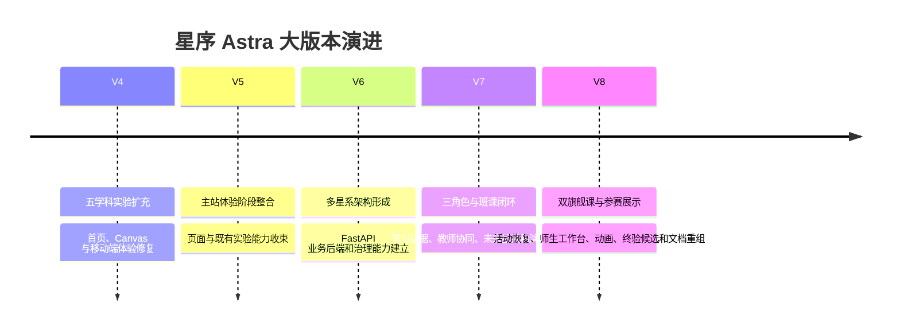

# 星序 Astra — 发布历史

> **文档梗概**：作为发布历史总入口，记录当前发布判断、大版本演进综述和 V4—V8 分卷索引。详细提交事实已按大版本迁入 31—35 号子文档；跨版本原文和重写前规划快照保存在 39 号附录。
>
> **权威边界**：已发生版本以本系列文档和 Git 为准；未来任务只认 [`02-更新规划.md`](02-更新规划.md)。历史记录不得反向覆盖当前任务优先级。
>
> **最近更新**：2026-08-24
>
> **更新者**：DOC 组（主开发单线兼任）

---

## 目录

1. [当前发布判断](#1-当前发布判断)
2. [大版本演进综述](#2-大版本演进综述)
3. [V4—V8 详细历史分卷](#3-v4v8-详细历史分卷)
4. [V8 当前阶段摘要](#4-v8-当前阶段摘要)
5. [记录和迁移规则](#5-记录和迁移规则)

---

## 1. 当前发布判断

| 项目 | 当前事实 |
| --- | --- |
| 文档控制版本 | `V8.2.0 / EXT-01`：新增实验采用未注册、可复制、可回退的独立模板 |
| 最新主线控制点 | `V8.2.0 / EXT-01`：冻结 124 项既有实验，增量扩展从独立模板开始 |
| 最新产品候选 | `V8.1.6 / RESTORE-01`：Physics Mechanics 与 Engineering Bridge 恢复直接实验 owner；V8.2.0 不新增生产入口 |
| 产品终验状态 | 还原快照通过自动化基线；竞赛终验与后续新增实验仍按 02 推进 |
| 当前协作方式 | 用户与主开发单线；无自动运行的专业工作组和额外 worktree |
| 当前发布定位 | 本机课程作业 / 毕业设计 / 多媒体竞赛展示候选，不等于生产发布 |

V8.1.6 是方向纠偏和恢复基线；V8.2.0 只建立新实验开发能力。两者都不把旧 V8.1.0—V8.1.5 工作区候选视为已发布能力，也不把工具模板冒充为新的可见实验。

---

## 2. 大版本演进综述

### 2.1 V4：从实验集合走向完整学科站点

V4 的主要贡献是扩充数学、物理、化学、算法和生物内容，系统修复 Canvas 字号、引导、测验、首页观感、全息星系和移动端触控。现存记录从 V4.0.x 开始，V4.0.0 之前的细节不完整，不根据想象补写。

### 2.2 V5：主站体验与页面能力整合

V5 现存记录明显少于后续大版本，主要反映主站体验、页面系统和既有实验能力的阶段性整合。记录缺口保持诚实，不用后续文档反推不存在的逐提交事实。

### 2.3 V6：建立多星系和全栈业务基础

V6 先完善未来星系等前端学习结构，随后建立 FastAPI、认证、学校、班级、课程、作业、提交、积分、内容治理、知识快照、审计、后台任务、部署和 MySQL 兼容等业务能力。该阶段代码量和回归能力快速增长，也留下了大型 owner 和工程能力强于可见呈现的问题。

### 2.4 V7：建立三角色、班级课程和学习证据闭环

V7 完成登录前置、学生/教师/管理员资源裁剪、班级与课程作用域、课程发布、三角色工作台、学习证据、教师有限事实、管理员治理、演示数据、代码空间、未来星系课程矩阵和多轮浏览器验收。项目从“有后端”进入“学生操作能被教师回读”的阶段。

### 2.5 V8：聚焦双旗舰课和竞赛展示

V8 建立活动运行身份、双游标恢复服务包，强化 `physics.mechanics` 和 `engineering.load-path`，打磨师生工作台、加载竞态、页面反馈和桌面/移动布局。V8.0.27 之后重新明确“效果表达、内容充实、竞赛展示优先”；V8.0.37 将文档从单体长卷重组为可阅读的主文档与分卷。

---

## 3. V4—V8 详细历史分卷

| 子文档 | 版本范围 | 记录块 | 内容摘要 |
| --- | --- | ---: | --- |
| [31-V4 版本发布历史](03-子文档/31-V4版本发布历史.md) | V4.0.0（可追溯部分）至 V5.0.0 之前 | 41 | 五学科内容、Canvas/UI、首页、星系视觉、移动端 |
| [32-V5 版本发布历史](03-子文档/32-V5版本发布历史.md) | V5.0.0 至 V6.0.0 之前 | 3 | 主站体验与阶段整合；现存记录较少 |
| [33-V6 版本发布历史](03-子文档/33-V6版本发布历史.md) | V6.0.0 至 V7.0.0 之前 | 196 | 多星系、后端、内容治理、审计、知识快照和部署 |
| [34-V7 版本发布历史](03-子文档/34-V7版本发布历史.md) | V7.0.0 至 V8.0.0 之前 | 205 | 三角色、班课、证据、工作台、未来星系和验收 |
| [35-V8 版本发布历史](03-子文档/35-V8版本发布历史.md) | V8.0.0 至 V9.0.0 之前 | 39 | 恢复内核、双旗舰、参赛展示、工作树收束、文档重组、实验纠偏和增量模板 |
| [39-跨版本综述与规划迁移附录](03-子文档/39-跨版本综述与规划迁移附录.md) | 跨版本 | 14 个原文片段 + 旧 02 完整快照 | 无法唯一归入单一大版本的综述、表格和历史控制面 |

说明：记录块数量是 V8.0.37 迁移时按 Markdown 版本标题机械识别并追加本次记录后的数量，不代表提交总数，也不用于评价各版本工作量。

---

## 4. V8 当前阶段摘要

### 4.1 V8.0.0—V8.0.12：活动契约与权威恢复

- 冻结活动契约和关键旅程失败基线。
- 隔离教师课程作用域，支持学生代码多次修订。
- 为 Engineering 建立观察门禁和学习证据闭环，为 Physics 强制受控试验顺序。
- 建立原始证据重算门禁、学习者/服务端双游标和 V8.0.12 权威恢复服务包。
- V8.0.12 后端曾完成 639 passed、8 skipped、1 known xfailed、0 failed；skip 为未提供显式真实 MySQL，不得外推为生产环境证明。

### 4.2 V8.0.13—V8.0.26：师生工作台、双旗舰和竞态修复

- 打磨学生/教师高频工作台和双旗舰教学动画。
- 修复 Physics 刷新、首次冷加载、publication 并发读取、同路由迟到事件和证据挂载顺序。
- 修复课程入口与工作台 busy 语义。
- V8.0.26 曾在对应 revision 完成 cold/reload 浏览器矩阵；该结论不自动覆盖后续改动。

### 4.3 V8.0.27—V8.0.34：展示叙事和可见布局

- 重新启动“效果表达与内容充实”阶段。
- 深化师生工作台教学叙事和双课内容表达。
- 终验发现移动端首屏回执不可见、Engineering 观察与数值不能同帧呈现。
- V8.0.32、V8.0.33 完成两项返修，V8.0.34 集成并重开终验。
- 收束发生前未完成 V8.0.34 的同版本最终浏览器矩阵，因此保持“候选、未终验”。

### 4.4 V8.0.35—V8.0.37：仓库和文档收束

- V8.0.35 归并原始文档并整理工作树。
- V8.0.36 安全退出遗留工作树、保留分支/stash，并冻结展示优先路线。
- V8.0.37 把 01 详细技术内容迁入 11—19，把 03 按 V4—V8 迁入 31—35，并把 02 重写为 V8.1—V8.6 的直观开发计划。

### 4.5 V8.1.6：撤销课程化包装并冻结既有实验

- 项目负责人否决把完成度较高的实验页重写为课程正文、预测表单和说明文本堆叠的方向。
- `physics.mechanics` 恢复参数、画布和直接操作；`#engineering` 恢复独立桥梁桁架 owner，不再由 Future course runtime 替换页面。
- 124 项既有实验默认冻结：除知识性错误外不改原交互、动画、布局和求解器；后续价值集中在新增实验、实验外师生平台体验和竞赛交付。
- 旧 V8.1.0—V8.1.5 仍为待裁决工作区候选，不因本次恢复提交自动进入发布历史。

### 4.6 V8.2.0：建立只增不改的新实验模板

- 建立 manifest、HTML、单 owner 运行时、私有 CSS 和模型说明五件套，只供新增实验复制。
- 模板自带首屏画布与控件、DPR、ResizeObserver、rAF、reduced-motion 和完整 destroy 骨架。
- 自动探针渲染真实占位符并执行初始化、参数变化和清理，同时断言模板没有进入生产注册表、目录或路由。
- 下一项是 `EXT-02` 新增实验注册检查；V8.2.0 本身不产生新的用户可见空壳页面。

详细标题、范围、验证和边界见 [35-V8 版本发布历史](03-子文档/35-V8版本发布历史.md)。

---

## 5. 记录和迁移规则

### 5.1 新发布记录写在哪里

1. 当前大版本的详细提交只追加到对应 31—38 分卷；V8 当前写入 35。
2. 根 03 只在大版本、发布判断或阶段摘要发生变化时更新。
3. 已完成任务从 02 移除或改为下一阶段状态后，完整事实必须进入 03 分卷。
4. 每条记录至少包含版本/任务、改动范围、验证结果、诚实边界和关联文档。
5. 主开发自验必须标明“主开发自验”，不能写成独立 QA。

### 5.2 V8.0.37 迁移对账

- 迁移前原 03 SHA-256：`cdee560a7144340e8d7ec762c394692d7323a84eb7d6a6dd11fa365070b980e4`。
- 原 03 共 9028 行；8378 行位于 481 个可归属 V4—V8 的版本记录块中，已迁入 31—35。
- 剩余 650 行为标题、目录、跨版本综述、混合版本表格和结构说明，已原文保存在 39 号附录。
- 重写前原 02 SHA-256：`56b3209e7ef4d8f11f9936cf1fad437fb7b79710777fdde169e380e001184271`；完整快照已追加到 39 号附录。
- 分卷仅调整 Markdown 标题层级和增加分卷导语，不改写原提交事实；后续发现归卷错误时只移动记录，不删内容。

### 5.3 历史缺口

V4.0.0 之前及 V5 部分逐提交记录并不完整。项目保留现有事实，不通过猜测补齐时间、版本或功能。若以后从 Git 标签、提交或旧备份找到可靠证据，再按对应大版本追加并注明来源。
