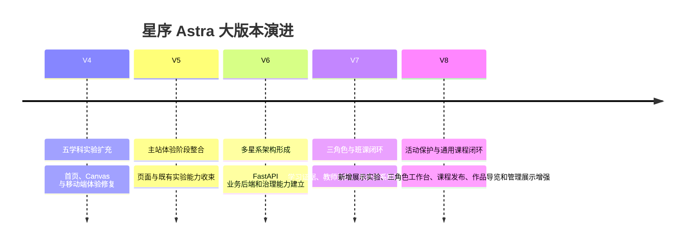

# 星序 Astra — 发布历史

> **文档梗概**：作为发布历史总入口，记录当前发布判断、大版本演进综述和 V4—V8 分卷索引。详细提交事实已按大版本迁入 31—35 号子文档；跨版本原文和重写前规划快照保存在 39 号附录。
>
> **权威边界**：已发生版本以本系列文档和 Git 为准；未来任务只认 [`02-更新规划.md`](02-更新规划.md)。历史记录不得反向覆盖当前任务优先级。
>
> **最近更新**：2026-08-28
>
> **更新者**：PM 组（主开发单线兼任）

---

## 目录

1. [当前发布判断](#1-当前发布判断)
2. [大版本演进综述](#2-大版本演进综述)
3. [V4—V8 详细历史分卷](#3-v4v8-详细历史分卷)
4. [V8 当前阶段摘要](#4-v8-当前阶段摘要)
5. [记录和迁移规则](#5-记录和迁移规则)

---

## 1. 当前发布判断

| 项目 | 当前事实 |
| --- | --- |
| 文档控制版本 | V8.6.1—V8.6.3 稳定实现已迁入 1 号文档，详细提交进入 35 号历史分卷；2 号文档当前从 `UI-017` 继续阶段性收口 |
| 最新产品代码控制点 | `V8.6.3 / FE-044`：管理员课程健康矩阵已经接通 V8.6.2 只读解释，并安全定位原课程治理；不改变领域真值或角色权限 |
| 最新已交付能力 | 管理员可以按星系和五类健康状态筛选近期课程，查看原因、数值事实和教师责任动作，并定位同一课程治理记录 |
| 产品验证状态 | 工作台后端 7 项、276 个 JavaScript 和 80 项前端合同通过；课程健康矩阵桌面与 `390×844` 的筛选、44px 动作、无横向溢出和课程选中通过，V8.6 全角色终验仍留给 `QA-034`；Alembic head 保持 `20260825_0058` |
| 当前协作方式 | 用户与主开发单线；无自动运行的专业工作组和额外 worktree |
| 当前发布定位 | 本机课程作业 / 毕业设计 / 多媒体竞赛展示候选，不等于生产发布 |

V8.1.6 是方向纠偏和恢复基线；V8.2.0—V8.2.7 建立新增实验模板与保护门禁。V8.3 先后交付双摆混沌、色谱分离和机械臂逆运动学，随后冻结其他实验扩充。V8.4 完成统一课程分类、教师申请、建课审核、学生选课、共享草稿、结构化编辑、不可变发布、三种完成结果、三角色工作台和可重复演示数据；`UI-015@bace1b4` 又补齐登录前作品导览。V8.5 不再增加实验或重构底层，而以 `DEV-003@e057550`、`DEV-004@5e76419`、`DEV-005@d9b302d` 和 `QA-033@3c28562` 把现有事实整理为驾驶舱、版本时光机、发布影响预演和学习证据链。旧 V8.1 内容平台候选只作为历史设计，冲突部分不再并行维护。

V8.5 周期结束后，2 号文档不再保存上述任务原件、工作量表和退出流水；当前实现继续由 1 号文档解释，本节与 35 号分卷永久保留版本事实。项目负责人已于 2026-08-28 启动 V8.6，尚未发生的功能不得提前写入本历史。

---

## 2. 大版本演进综述

### 2.1 V4：从实验集合走向完整学科站点

V4 的主要贡献是扩充数学、物理、化学、算法和生物内容，系统修复 Canvas 字号、引导、测验、首页观感、全息星系和移动端触控。现存记录从 V4.0.x 开始，V4.0.0 之前的细节不完整，不根据想象补写。

### 2.2 V5：主站体验与页面能力整合

V5 现存记录明显少于后续大版本，主要反映主站体验、页面系统和既有实验能力的阶段性整合。记录缺口保持诚实，不用后续文档反推不存在的逐提交事实。

### 2.3 V6：建立多星系和全栈业务基础

V6 先完善未来星系等前端学习结构，随后建立 FastAPI、认证、学校、班级、课程、作业、提交、积分、内容治理、知识快照、审计、后台任务、部署和 MySQL 兼容等业务能力。该阶段代码量和回归能力快速增长，也留下了大型 owner 和工程能力强于可见呈现的问题。

### 2.4 V7：建立三角色、班级课程和学习证据闭环

V7 完成登录前置、学生/教师/管理员资源裁剪、班级与课程作用域、课程发布、三角色工作台、学习证据、教师有限事实、管理员治理、演示数据、代码空间、未来星系课程矩阵和多轮浏览器验收。项目从“有后端”进入“学生操作能被教师回读”的阶段。

### 2.5 V8：从重点展示转向通用课程与可解释管理闭环

V8 前期建立活动运行身份、双游标恢复服务包，并集中打磨 `physics.mechanics`、`engineering.load-path`、师生工作台和桌面/移动布局。V8.1.6 起撤销对既有实验的课程化包装，V8.2—V8.3 建立实验保护门禁并只新增三项独立展示实验；V8.4 转向所有学科通用的教师申请、建课审核、学生选课、内容发布、学习结果和三角色工作台闭环。V8.5 继续复用这些真实领域事实，把管理态势、课程版本变化、发布影响和学习结果来源做成可直接演示的页面，不设课程等级，也不改变实验本体。

---

## 3. V4—V8 详细历史分卷

| 子文档 | 版本范围 | 记录块 | 内容摘要 |
| --- | --- | ---: | --- |
| [31-V4 版本发布历史](03-子文档/31-V4版本发布历史.md) | V4.0.0（可追溯部分）至 V5.0.0 之前 | 41 | 五学科内容、Canvas/UI、首页、星系视觉、移动端 |
| [32-V5 版本发布历史](03-子文档/32-V5版本发布历史.md) | V5.0.0 至 V6.0.0 之前 | 3 | 主站体验与阶段整合；现存记录较少 |
| [33-V6 版本发布历史](03-子文档/33-V6版本发布历史.md) | V6.0.0 至 V7.0.0 之前 | 196 | 多星系、后端、内容治理、审计、知识快照和部署 |
| [34-V7 版本发布历史](03-子文档/34-V7版本发布历史.md) | V7.0.0 至 V8.0.0 之前 | 205 | 三角色、班课、证据、工作台、未来星系和验收 |
| [35-V8 版本发布历史](03-子文档/35-V8版本发布历史.md) | V8.0.0 至 V9.0.0 之前 | 74 | 恢复内核、实验保护、三项新增实验、通用课程闭环、登录前作品导览，以及驾驶舱、版本时光机、发布预演和学习证据链 |
| [39-跨版本综述与规划迁移附录](03-子文档/39-跨版本综述与规划迁移附录.md) | 跨版本 | 14 个原文片段 + 旧 02 完整快照 | 无法唯一归入单一大版本的综述、表格和历史控制面 |

说明：记录块数量是 V8.0.37 迁移时按 Markdown 版本标题机械识别并追加本次记录后的数量，不代表提交总数，也不用于评价各版本工作量。

---

## 4. V8 当前阶段摘要

### 4.1 V8.0.0—V8.0.12：活动契约与权威恢复

- 冻结活动契约和关键旅程失败基线。
- 隔离教师课程作用域，支持学生代码多次修订。
- 为 Engineering 建立观察门禁和学习证据闭环，为 Physics 强制受控试验顺序。
- 建立原始证据重算门禁、学习者/服务端双游标和 V8.0.12 权威恢复服务包。
- V8.0.12 后端曾完成 639 passed、8 skipped、1 known xfailed、0 failed；skip 为未提供显式真实 MySQL，不得外推为生产环境证明。

### 4.2 V8.0.13—V8.0.26：师生工作台、双旗舰和竞态修复

- 打磨学生/教师高频工作台和双旗舰教学动画。
- 修复 Physics 刷新、首次冷加载、publication 并发读取、同路由迟到事件和证据挂载顺序。
- 修复课程入口与工作台 busy 语义。
- V8.0.26 曾在对应 revision 完成 cold/reload 浏览器矩阵；该结论不自动覆盖后续改动。

### 4.3 V8.0.27—V8.0.34：展示叙事和可见布局

- 重新启动“效果表达与内容充实”阶段。
- 深化师生工作台教学叙事和双课内容表达。
- 终验发现移动端首屏回执不可见、Engineering 观察与数值不能同帧呈现。
- V8.0.32、V8.0.33 完成两项返修，V8.0.34 集成并重开终验。
- 收束发生前未完成 V8.0.34 的同版本最终浏览器矩阵，因此保持“候选、未终验”。

### 4.4 V8.0.35—V8.0.37：仓库和文档收束

- V8.0.35 归并原始文档并整理工作树。
- V8.0.36 安全退出遗留工作树、保留分支/stash，并冻结展示优先路线。
- V8.0.37 把 01 详细技术内容迁入 11—19，把 03 按 V4—V8 迁入 31—35，并把 02 重写为 V8.1—V8.6 的直观开发计划。

### 4.5 V8.1.6：撤销课程化包装并冻结既有实验

- 项目负责人否决把完成度较高的实验页重写为课程正文、预测表单和说明文本堆叠的方向。
- `physics.mechanics` 恢复参数、画布和直接操作；`#engineering` 恢复独立桥梁桁架 owner，不再由 Future course runtime 替换页面。
- 124 项既有实验默认冻结：除知识性错误外不改原交互、动画、布局和求解器；后续价值集中在新增实验、实验外师生平台体验和竞赛交付。
- 旧 V8.1.0—V8.1.5 仍为待裁决工作区候选，不因本次恢复提交自动进入发布历史。

### 4.6 V8.2.0：建立只增不改的新实验模板

- 建立 manifest、HTML、单 owner 运行时、私有 CSS 和模型说明五件套，只供新增实验复制。
- 模板自带首屏画布与控件、DPR、ResizeObserver、rAF、reduced-motion 和完整 destroy 骨架。
- 自动探针渲染真实占位符并执行初始化、参数变化和清理，同时断言模板没有进入生产注册表、目录或路由。
- 下一项是 `EXT-02` 新增实验注册检查；V8.2.0 本身不产生新的用户可见空壳页面。

### 4.7 V8.2.1：建立新增工科实验注册检查

- 只读加载 `CONFIG.experiments` 与 `AstraExperimentRegistry`，形成 88 项工科实验的 key、route、title、owner 和 script 冲突基线。
- 新 manifest 必须具备合法 schema、现有学科、独立身份、版本化本地资源、可加载 owner、init hook 和可安全调用的 destroy。
- 正反样例覆盖重复身份、资源缺失/越界、owner 缺失和 cleanup 失败，并用哈希证明检查器不修改三份生产注册表面。
- 代码空间与未来星系的 36 项活动使用不同注册来源；跨三星系 124 项变更告警留给 `EXT-03`，不在本版本虚报全量覆盖。

### 4.8 V8.2.2：建立 124 项旧活动变更告警

- 不迁移现有三套运行架构，分别从工科配置/注册表、Code Space manifest、Future manifest/owner 配置生成统一保护投影，并与学习活动总目录核对。
- `88 + 18 + 18 = 124` 项基线冻结 key、路由、标题、owner、初始化/清理入口和实际消费的脚本、样式、manifest、catalog、challenge 或 DOM 片段哈希。
- 普通新增活动只计数并忽略；旧活动缺失或变化会输出学习空间、activity key、精确文件和一次性 issue signature。
- 精确批准例外必须绑定任务、批准人、日期、理由和完全相同的 before/after 指纹；默认例外为空，不能用更新基线掩盖未批准改动。
- 本版本只新增质量工具、确定性 JSON 基线和合同，没有增加生产入口、运行时依赖或用户可见实验。

### 4.9 V8.2.3：建立新实验视觉基础件

- 在只供复制的新实验模板中建立状态、读数、图例、主参数、播放/暂停/重置、短提示和移动控制抽屉，不给既有实验套用统一课程外壳。
- `running`、`paused`、`reduced-motion` 使用同一 owner 状态；减少动态效果停止连续帧，但参数变化仍可产生静态结果。
- page、module、namespace 三重样式作用域继续生效；44px 触达区和 1440×900、834×1112、390×844 布局由机器合同记录。
- 真实 Edge 验收发现并修复 Canvas/ResizeObserver 高度递增：舞台改为有界高度，Canvas 改读父级内容盒，复测尺寸稳定且无横向溢出或 console warning/error。
- 本版本没有生产注册、可见新实验或旧活动改动；下一项为 `EXT-05` 模型说明模板。

### 4.10 V8.2.4：建立模型说明与科学复核门禁

- 模型记录从提示性清单升级为 11 节/7 表结构，覆盖结论边界、变量与 SI 单位、核心关系、条件/假设/限制、数值方法、画面映射、典型/边界样例、误差、实现对应、引用与发布复核。
- manifest 与文档统一使用 `model-<experiment-id>` 显式锚点；完整匀速运动样例给出可直接对照的填写粒度。
- 独立验证器拒绝待填写项、身份错配、草稿、缺单位/公式/限制/样例/误差/引用、未勾选复核和课程化章节；注册门禁调用同一结果。
- 纯暂存快照通过 247 个脚本、65/65 前端合同和 124 项保护；临时仓库第一次因无 `HEAD` 停在 QA-016，补临时快照提交后完整重跑通过。
- 本版本只增加开发/论文资料模板和工具，不向实验首屏、生产注册或既有活动写入说明文本。

### 4.11 V8.2.5：建立新增实验预览素材流程

- 新 manifest 和来源记录统一绑定新实验自己的静态 WebP、替代文本、可选短循环和 poster 降级。
- poster 固定 1600×900、1—120 KiB、非动画；记录保存实际宽高、字节、SHA-256、来源、权利、代码文件和内容边界。
- 检查器可 inspect RIFF WebP，也可从 manifest 验证三方一致性；注册门禁拒绝缺失、越界、超预算、通用 alt、旧活动素材复用和静态文件冒充动图。
- 纯暂存快照通过 249 个脚本、66/66 前端合同和 124 项保护。
- 本版本没有实际生产封面或短循环，测试中的现有 WebP 只在系统临时目录作为二进制解析夹具，不进入新实验目录或产品声明。

### 4.12 V8.2.6：建立新增实验隔离浏览器旅程

- 新 manifest 显式登记版本化 module；静态注册门禁会把 module、脚本和样式一并限制在候选自己的目录。
- 浏览器运行器从候选 manifest 读取 module/CSS/JS，在 loopback 临时页完成桌面、390×844 与减少动态效果三套旅程，不先修改生产注册表面。
- 三组均验证首次绘制、参数操作、暂停/继续或静态停帧、重置、无横向溢出、离开释放、再次进入和 console/pageerror；手机另验抽屉和 44px。
- 真实系统 Edge 151 报告三组通过，并产生 JSON 与三张本机截图；纯暂存快照通过 251 个脚本、67/67 前端合同和 124 项保护。
- 本版本没有新增生产路由、目录卡片或可见实验，也没有挂载 124 项旧活动；`test-screenshots/` 仍是 Git 忽略的本机证据。

### 4.13 V8.2.7：建立新增实验开发态调试面板

- 模板 owner 增加无轮询、无 DOM 的只读 `debugSnapshot()`，按需给出状态、模型、最近步长和资源数量；开发面板脚本保持独立，不进入候选必需文件或生产资源链。
- 隔离运行器只在显式 `--debug` 时提供并请求专用脚本；默认三视口均为 0 请求、0 导出、0 节点、0 面板定时器。
- 开启后以 250ms 采样显示六个分区；桌面、390×844 与 reduced-motion 均验证参数、步长/fps、资源、Canvas、手机内部滚动和 44px 关闭动作，离开/重入/最终离开均释放面板与定时器。
- Playwright 1.60 + 系统 Edge 151 的开/关双态专项通过；纯暂存快照通过 253 个脚本、68/68 前端合同和 124 项保护。
- 本版本没有新增生产实验、路由、目录、缓存或竞赛浮层，也没有挂载或修改 124 项既有活动；V8.2 至此达到退出条件，V8.3 等待负责人选题。

### 4.14 V8.3.0：确定首批三项新增展示实验

- 项目负责人恢复目标并继续上一轮推荐方案，V8.3 T0 固定为“双摆混沌、色谱分离、机械臂逆运动学”三项，PN 结只保留为未启动 T1。
- 三项分别锁定身份、主要变量、核心画面、模型边界和不做事项；交付顺序按视觉记忆点、跨学科差异和实现风险排列。
- 原候选中五项与现有活动直接或高度重复，已移出首批；四个替代 ID/route 的只读审查未发现与 124 项基线直接冲突。
- 本版本只形成规划与模型/画面草案，不创建实验目录、生产路由、目录卡片、缓存资源或旧实验改动；首项生产实现从 `SHOW-02` 开始。

### 4.15 V8.3.1：交付双摆混沌展示实验

- 新增 `physics.double-pendulum-chaos`，同屏展示两组近初值双摆、青/洋红尾迹、相空间、末端分离、模型时间和能量相对漂移；可调初始角差、阻尼与时间倍率，并支持姿态切换、暂停、重置和末端拖拽释放。
- 使用 240Hz 固定步长 RK4 和等长等质量平面双摆教学模型；11 节模型记录给出变量、公式、限制、误差预算、两组数值样例和两条来源。页面不复制这些长说明，也不增加课程目标、预测表单或章节包装。
- 新目录、配置条目、runtime、可读 module、生产壳镜像、私有 CSS、1600×900 原创 poster 与来源记录完成接线；新条目以 `guide: false` 单项避开旧物理课程指南，其他实验行为不变。
- 主开发生产浏览器验收覆盖 hash 直达、参数操作、暂停/继续、实验 A→B 销毁、导航复开、刷新、390×844 和错误日志；退出后 rAF、ResizeObserver、控制作用域均为 0，移动端无根级横向溢出且主要按钮达到 44—46px。
- 124 项旧活动保护基线保持原样，当前总投影为 125 项并只报告 1 个合法 addition；候选 manifest 在生产注册后退役。V8.3 尚未完成，下一项为色谱分离。

### 4.16 V8.3.2：交付色谱分离展示实验

- 新增 `chemistry.chromatography-separation` 与 `#chemistry/chromatography-separation`。左侧透明柱同步显示溶剂前沿和 A/B/C 三色带，右侧显示完整预测峰、实时已检测曲线与可拖动扫描线；用户可调保留因子差和流量，切换峰重叠/均衡/高分离，暂停或重新进样。
- 模型使用 `t_M=V_M/F`、`t_R=t_M(1+k)`、`v_i/u=1/(1+k_i)`、固定 `N=900` 的对称高斯峰和 IUPAC 峰分离度定义。默认最小分离度为 `1.847291`，重叠预设为 `0.949367`；11 节开发记录给出变量、单位、限制、误差预算、两组复算样例及 7 条 IUPAC/NIST 依据，长说明没有进入实验首屏。
- 配置、注册表、Chemistry DOM、私有 CSS、正式懒加载和 `20260824v832Show03P0` 代际完成接线；可读 `module.html` 与一行生产镜像并存，`index.html` 为 3,756 行，仍低于 3,758 行上限。原创 poster 为 1600×900、35,790 字节，来源与 SHA-256 写入同目录 `preview.json`；生产注册后候选 manifest 退役。
- 候选普通/调试模式均在桌面、390×844 和 reduced-motion 三视口通过。主开发生产自验使用授权教师会话完成 hash 直达、参数 72、流量 2.0、重叠预设、暂停/恢复、扫描线拖动、重置、色谱→双摆→色谱、刷新与手机抽屉；离页资源为 `0/0/0`，重入为 `1/1/1`，手机无根级溢出且触达区不小于 44px，console/pageerror/request failure/HTTP error 均为 0。
- 学生无班级数据时，当前未提交的目录候选会按既有守卫返回星球页；本版本没有修改该候选，生产模块自验因此使用教师身份，候选隔离旅程仍不依赖登录。124 项旧活动保护基线保持原样，当前总投影为 126 项并报告 2 个合法 addition；V8.3 尚未完成，下一项为机械臂逆运动学。

### 4.17 V8.3.3：课程闭环规划与目标 UML 通过验收

- 2 号文档把当前周期固定为 `V8.3.4—V8.4.6`：先收尾机械臂并冻结其他新实验，再逐版完成通用课程、教师申请、课程审核、学生选课、内容发布、三角色工作台和完整演示数据。
- P-01—P-13 共 13 幅 Mermaid 目标图均写明版本、缺口、复用、新增和迁移门禁；目标态不提前进入 1 号当前实现文档。
- 星系和学科只承担分类，授课课程是学习容器，行政班只承担组织与准入；课程信息审核和内容发布明确分离，不建立精品/普通等级。
- 项目负责人已明确“验收通过”，后续任务按文档顺序由主开发单线推进；本版本没有修改业务代码、数据库或实验页面。

### 4.18 V8.3.4：交付机械臂逆运动学并冻结实验扩充

- 新增 `engineering.robot-arm-ik` 与正式路由 `#engineering/robot-arm-ik`，同屏展示三连杆机械臂、目标点、工作空间、关节状态和末端残差；支持目标拖动、预设、关节限制、暂停与重置。
- 工程页由独立 owner 统一管理桥梁和机械臂的按路由挂载、可见性和销毁，原 `bridge-truss.js` 未改动；桌面与 390×844 均完成操作、切换、刷新直达、无横向溢出和资源释放验收。
- 总活动数更新为 127（工科 90、Code Space 18、Future 19）；提交快照通过 258 个受跟踪 JavaScript 文件语法检查和 69 项前端合同，保护检查为 124 个既有活动通过、3 个规划内新增项忽略。
- 实现提交为 `0699940`。本版本不修改既有实验、不新增课程包装、不接入待审课程候选；V8.3 至此收口，下一任务为 `V8.4.0 / ARCH-010`。

### 4.19 V8.4.0：统一课程身份并完成教师申请审核

- `ARCH-010@87d9f60` 新增课程 `subject_key` 和班级 `kind`，把星系、学科、授课课程与稳定活动引用分开；行政班接口只读取 `homeroom`，目录不再输出精品/普通等级。
- `BE-023@eb47948` 新增 `TeacherApplication`、申请/本人状态/管理员列表/审核接口及待审服务端只读门；批准提升为教师，拒绝保留学生角色并允许重新申请。
- `FE-037@8a22773` 完成注册用途选择、申请状态、待审横幅与正式目录预览、管理员待审总数/列表/二次确认和批准后身份刷新。
- 隔离提交快照通过 6 项后端专项、259 个受控 JavaScript 文件语法检查和 70 项前端契约；桌面与 390×844 主开发自验无新增 console 错误或横向溢出。
- P-02 和 P-05 已依据真实实现迁入 [01 子文档 19](01-子文档/19-当前功能业务闭环与展示边界.md#v840-身份组织与教师申请当前稳定实现)。V8.4.0 没有实现建课、课程审核或学生选课，下一任务严格为 `V8.4.1 / DATA-009`。

### 4.20 V8.4.1：建立课程关系与成员数据底座

- `DATA-009@5596112` 新增 Alembic `20260825_0056`，为课程补充课程码、学年、时间、课时、准入方式和当前批准信息修订，并建立信息修订、准入班级、加入申请和课程成员四组模型。
- 有活动挂班的旧课程回填为指定班级准入，无挂班旧课程回填为公开申请；课程码、信息修订和内部课程群组不被迁移伪造，旧课程与旧挂班可升级、回滚并再次升级。
- `BE-024@4fa147c` 新增教师创作选项、课程草稿创建/列表/详情和信息修订提交接口；一名教师可创建多课，一课可有多名同校共同教师，分类不限制跨学科活动引用。
- `FE-038@b27b886` 把教师建课整理成基本信息、共同教师、分类与准入、预览提交四步向导；创建者和共同教师回读同一待审记录，页面不暴露内部课程键、课程码或直接发布状态。
- 创建与提交只形成 `draft / submitted` 信息，不生成课程码、批准信息、内部课程群组或初始发布版本；教师不能自行发布课程。
- 隔离暂存快照通过 261 个受跟踪 JavaScript 文件语法检查、71 项前端契约和 4 项后端课程专项；P-03/P-08 仍在 2 号文档保持部分实现状态，下一任务为 `V8.4.2 / BE-025`。

### 4.21 V8.4.2：完成课程信息审核后端（BE-025）

- `BE-025@3fde9af` 新增管理员课程信息修订分页队列、一次性批准/退回接口，以及教师在退回或运行中创建下一修订的接口；重复审核返回 `409`，旧结论不被覆盖。
- 首次批准在一个事务内应用课程信息、共同教师和准入班级，生成 8 位不可预测短课程码，创建隐藏 `course_cohort` 和唯一 `CourseClass`，再更新当前批准修订并写入审计。
- 项目负责人选择的 Q-002 方案 B 已落地：审批不导入候选发布服务，不创建占位章节、完成规则、`CourseRelease` 或 binding；课程读取明确返回“暂无已发布内容”。
- 运行中修订待审或被拒时，正在生效的信息、教师、准入范围、课程码和内部群组保持不变；模拟内部群组创建失败时整个批准事务回滚。
- 隔离暂存快照通过 17 项课程审核、建课、关系、分类、教师申请和课程状态回归及架构边界契约。P-06 已按真实实现迁入 [01 子文档 19](01-子文档/19-当前功能业务闭环与展示边界.md#当前课程信息审核状态图原-p-06)。
- 本任务没有新增数据库迁移、管理员页面、学生选课、课程内容编辑器或发布版本，也没有修改 127 项活动。FE-039 在后续独立提交中完成。

### 4.22 V8.4.2：完成管理员课程信息审核页面（FE-039）

- `FE-039@67a597f` 在现有课程治理页中新增“信息审核 / 状态治理”视图，默认显示待审修订；管理员可查看当前/拟议值、差异字段、教师名单和准入班级。
- 批准与退回都需要二次点击；审核说明变更会使原确认失效，写入期间禁止重复请求和视图切换，结果不明时不自动重投。
- 首次批准回执显示课程码、内部课程群组和“暂无已发布内容”；页面明确提示首个真实版本仍由教师显式发布。
- 隔离 Git 暂存快照的全量 `npm test` 通过 262 个受跟踪 JavaScript 语法检查和 72 项前端契约；后端课程信息审核/创建专项 6 项通过。
- 真实浏览器已覆盖桌面首次批准、运行中退回、队列更新和 `390×844` 全屏审核对话框；浏览器无横向溢出、无新增 console warning/error。实测数据库中 release、release unit 和 binding 仍为 0。
- P-08 已按真实页面与事务边界迁入 [01 子文档 19](01-子文档/19-当前功能业务闭环与展示边界.md#当前课程创建与信息审核时序图原-p-08)；2 号文档只保留完成结论和链接。
- 本任务没有实现学生加入、课程名单、结构化编辑器或发布版本，也没有修改 127 项活动。下一任务严格为 `V8.4.3 / BE-026`。

### 4.23 V8.4.3：完成课程准入与成员后端（BE-026）

- `BE-026@19e4e5c` 新增学生按课程码发现、公开/限班申请、课程教师或管理员审批、分页申请/名单、行政班批量加入和退出/移除接口。
- 限班课程在申请与批准时各检查一次学生行政班资格；公开课程允许无行政班学生申请，名单中明确显示“未关联班级”。
- 批准或批量加入在同一事务中创建/激活 `CourseEnrollment` 和隐藏 `course_cohort` 学生成员；退出不删除申请、作业、提交或学习历史。
- 批量加入对新增、已加入、已退出和状态异常学生返回逐项结果，不自动恢复曾退出或被移除者。
- 纯暂存树排除其他工作区候选后，架构边界契约通过，14 项课程准入/信息审核/建课/关系/分类后端回归全部通过，Ruff 通过。
- P-03 和 P-07 仍留在 2 号文档；BE-026 没有实现学生加入页、教师审批/名单页、课程编辑器或发布版本，也没有修改 127 项活动。下一任务严格为 `FE-040`。

### 4.24 V8.4.3：完成学生选课与教师课程名单（FE-040）

- `FE-040@81763a3` 在学生工作台新增课程码查找、准入资格、申请轮次、待审/退回/已加入回执和二次确认退出。
- 教师工作台新增课程成员中心，可二次确认批准、退回或移除，查看来源行政班，并按行政班批量加入后读取新增、已在课、曾退出和不符合资格的独立数量。
- 真实浏览器走通“学生申请 → 教师批准 → 来源行政班名单 → 第二名学生批量加入 → 学生回读已加入”；批量回执为新增 1、已在课 1。
- `390×844` 下师生模块无横向溢出，全部可见输入、筛选与操作控件至少 44px；首轮发现的 38px 教师控件已修正并复验。
- 隔离暂存快照通过 265 个受跟踪 JavaScript 文件语法检查和 73 项前端契约；P-03、P-07 已按真实实现迁入 [01 子文档 19](01-子文档/19-当前功能业务闭环与展示边界.md#v843-学生选课与教师课程名单fe-040-当前稳定实现)。
- 本任务没有实现课程编辑器、共享草稿、不可变发布版本或完成规则，也没有修改 127 项活动。V8.4.3 至此完成，下一任务严格为 `V8.4.4 / BE-027`。

### 4.25 V8.4.4：完成多教师共享草稿与不可变发布后端（BE-027）

- `BE-027@5a2d5f1` 新增稳定迁移 `20260825_0057`：课程增加共享草稿 revision，`ContentDraft` 增加课程/单元作用域与 revision，并建立 append-only `CourseRelease`、`CourseReleaseUnit`、`CourseClassReleaseBinding`。
- 新增课程草稿读取/原子替换及发布列表、显式发布、当前版本、指定历史版本接口；创建者、有效共同教师和管理员共享同一草稿，旧 `expected_revision` 返回 `409`，两单元重排不会触发位置唯一约束残留。
- 发布在一个事务中冻结精确 `ContentPageVersion`、单元顺序、活动 key、媒体摘要和完成规则快照，为隐藏 `course_cohort` 追加 binding，并把草稿滚动到下一 revision；相同内容拒绝重复发布，失败不保留半个 release。
- active 课程学生在下次读取时自动取得最新 binding，也可按权限回读旧 release；服务端移除检查点标准选项、数值答案、容差和可接受答案。旧 release、binding、页面版本和学习历史继续保留。
- BE-028 尚未配置时，release 诚实冻结 `not_configured` 快照，不提前生成完成结果。课程列表的“未发布/已发布第 N 版”状态现在来自真实 release，不再硬编码。
- 后端全量测试通过；内容 schema、API、存储与发布专项 25 项通过，课程创建/审核/成员/发布组合回归 34 项通过；纯暂存隔离快照通过 265 个 JavaScript 语法检查和 73 项前端契约，迁移升级/回滚/再升级及单一 head 通过。
- P-04 与 P-09 已按真实模型和事务时序迁入 [01 子文档 19](01-子文档/19-当前功能业务闭环与展示边界.md#v844-多教师共享草稿与不可变发布be-027-当前稳定实现)。旧 V8.1 冲突迁移候选、旧服务和旧契约已删除，不再形成第二套权威实现。
- 本任务没有实现 FE-041 教师编辑器、BE-028 三种完成预设、自由拖拽、管理员逐内容审核、小程序、部署或竞赛材料，也没有修改 127 项活动。下一任务严格为 `V8.4.4 / FE-041`。

### 4.26 V8.4.4：完成结构化课程编辑器（FE-041）

- `FE-041@54fe180` 在教师工作台新增按需加载的课程内容中心，只开放本人参与且已经批准的课程；页面直接消费 BE-027 的共享草稿与 release 接口，没有建立前端私有真值。
- 教师可建立章节/单元，组合封面、学习任务、富文本、媒体、正式实验引用、检查点和来源七类内容块；正式活动后端 allowlist 与前端目录精确统一为 127 项，未知或重复活动引用会被拒绝。
- 页面支持保存、顺序调整、安全预览、两步显式发布和不可变历史；危险 Markdown、任意 HTML、iframe、脚本和无替代文字媒体不进入发布链。
- 旧 revision 写入返回 `409` 后，本地与服务器草稿同时保留，教师必须显式选择导出本地、采用远端，或以最新 revision 保留本地内容；系统不会静默覆盖或自动重投。
- 真实浏览器覆盖桌面、`390×844`、刷新直达、七类内容预览、发布第 1 版、历史回读和 revision 2→3 冲突；无横向溢出，主要触控区不低于 44px，console warning/error 为 0。
- 隔离暂存快照通过 267 个受跟踪 JavaScript 文件语法检查和 74 项前端契约；33 项课程内容/创建/审核/成员定向回归通过，后端全量无失败。
- 本任务没有修改 127 项活动，没有实现 BE-028 完成规则、自由拖拽、管理员逐内容审核、小程序、部署或竞赛材料。下一任务严格为 `V8.4.4 / BE-028`。

### 4.27 V8.4.4：完成三种课程完成预设（BE-028）

- `BE-028@c9fb4dc` 新增 `CourseUnitCompletionV1`、append-only `CheckpointAttempt` 和迁移 `20260825_0058`；教师在原结构化编辑器中为每个课程单元选择实验操作、指定 inline 检查点或指定作业批改。
- 新发布必须逐单元通过完成配置校验；发布事务生成或复用规范化 `LearningCompletionRule`，同步 activation 与隐藏课程群组 rule binding，再原子写入内容版本、release 和 release binding。配置相同复用规则，变化时追加版本。
- 正式 `LearningActivityRuntime` 的 learner `attempted`、当前不可变 release 的服务端检查点判分、课程教师对指定作业的有效批改分别产生规则派生或 `trusted_assessment` 完成事实，并统一重建 `LearningActivityProjection`。
- 检查点接口支持稳定 attempt id 幂等重放，拒绝旧 release、不同请求复用同一 id、错误目标和超限尝试；学生响应不包含标准答案。共同教师可批改内部课程群组提交，批改失败时完成事实一并回滚。
- 后端全量测试到 100% 且无失败；267 个受跟踪 JavaScript 文件语法通过，BE-028 相关前端契约通过。真实浏览器完成三种配置、检查点草稿保存、首发和历史回读，`390×844` 无横向溢出，console warning/error 为 0。
- P-10 已按真实类名、接口、规则绑定、三类受信事实和统一投影迁入 [01 子文档 19](01-子文档/19-当前功能业务闭环与展示边界.md#当前学习完成流程图原-p-10)。本任务没有修改 127 项活动，也没有增加第四种预设、question-set 判分、小程序、部署或竞赛材料。V8.4.4 至此完成，下一任务严格为 `V8.4.5 / BE-029`。

### 4.28 V8.4.5：完成三角色工作台聚合读取（BE-029）

- `BE-029@3dc21bb` 新增单一 `GET /api/v1/workbench`，按服务端当前用户角色返回 `StudentWorkbenchDTO`、`TeacherWorkbenchDTO` 或 `AdminWorkbenchDTO`；客户端不能传角色切换工作台。
- 学生响应聚合课程、最近作业、续学位置、提交/反馈数量和行政班身份；教师响应聚合授课课程、待审批学生、未发布草稿和待批改提交；管理员响应聚合教师申请、课程信息修订、组织提醒和基础查询总数。
- 三种 DTO 都返回结构化唯一下一动作。分页预览统一限制为 1—20；单一区块读取失败时只标记对应 `section_errors`，其他健康区块继续返回。详情分页和全部写入继续调用原领域接口，不建立工作台状态真值。
- 5 项专项覆盖三角色、空状态、分页边界、两页数据、课程/作业/反馈对账、教师 active 学校作用域、管理员审核队列/组织提醒和单区块故障；课程创建、审核和成员定向回归通过，后端全量到 100% 无失败。
- 本任务没有迁移、写接口、缓存表、后台任务、页面改动或实验改动。P-11 仍是“BE 已完成、FE 尚未完成”的规划图；下一任务严格为 `V8.4.5 / FE-042`。

### 4.29 V8.4.5：完成三角色可见首屏与主要跳转（FE-042）

- `FE-042@506f4ea` 新增共享 `AstraRoleWorkbenchOverview`、`AstraRoleWorkbenchBridge` 和响应式样式，在学生、教师、管理员原页面中各挂一个只读首屏摘要，不复制课程、审核、草稿、作业或学习状态。
- 三角色分别按规划顺序展示课程/任务/续学/反馈、授课课程/学生申请/草稿/批改，以及教师申请/课程审核/组织提醒；每个首屏只突出一个下一动作，并可进入原课程、成员、内容、批改或治理页面。
- 首屏完成角色响应校验、在途请求中止、刷新前清空、离开销毁、分区错误和重试；相同课程不重复派发范围变更，旧教师课程有原工作台回退路径。页面注册继续按角色裁剪并去重共享资源。
- 专项和定向合同、JavaScript 语法、`git diff --check` 通过；真实浏览器覆盖三角色首次进入、主要动作、桌面与 `390×844`，无可见横向溢出，console warning/error 为 0。教师旧课程跳转后的学情读取保持既有 4 秒轮询，没有新增请求循环。
- P-11 已按真实共享 owner、路由桥和领域写入边界迁入 [01 子文档 19](01-子文档/19-当前功能业务闭环与展示边界.md#当前三角色工作台数据流原-p-11)。本任务没有数据库迁移、写接口、新实验、实验页面修改、小程序、部署或竞赛材料；下一任务严格为 `V8.4.6 / DATA-010`。

### 4.30 V8.4.6：建立完整课程闭环演示数据（DATA-010）

- `DATA-010@abfc9be` 扩展原初始化脚本，只通过正式 ASGI HTTP API 建立普通学生、无行政班学生、待审教师、共同教师、管理员、行政班、公开/限班课程、退回重提、两个不可变 release、三种完成结果及待批改/已批改作业。
- 全新数据库首次初始化和连续两次重放得到一致报告；自然键、课程码、审核次数、成员、发布版本、完成规则、作业和提交结果均失败关闭，不复制第二套 seed 或数据库直写路径。
- 12 项初始化测试、secret-free 合同和 QA-016 定向回归通过。详细正式接口、幂等边界和长期限制见 [35-V8 版本发布历史](03-子文档/35-V8版本发布历史.md#10217-v846-data-featdemo-建立完整课程闭环演示数据data-010)。

### 4.31 V8.4.6：完成全链路验收与架构迁移（QA-032、DOC-004）

- QA-032 先对齐角色资源与工作台验收收据，再在真实浏览器中发现并修正无行政班学生被行政班门禁遮挡、教师课程直属名单无法批改、课程教师无法读取作业/策略/证据/进度，以及机械臂独立路由被全局选择器样式隐藏等问题。
- 最终教师首屏可以直接进入课程直属提交队列、评分、班级概况和逐单元进度；课程策略、提交、学习证据和进度请求均返回 200。学生可在没有行政班时读取当前 release、继续实验、提交并回读 92 分和反馈；管理员可处理教师申请并刷新直达。
- 外部 Edge/Chrome 覆盖桌面、`390×844`、刷新恢复、机械能旧实验和机械臂暂停/重置/预设/离开重进；没有重写现有实验。704 项后端测试收集并全量运行至 100% 无失败，干净提交态 272 个 JavaScript 文件和 76 项前端合同通过。
- `DOC-004@16d8923` 按真实 Web 层、前端 owner、FastAPI、领域服务、统一数据库与活动目录校正 P-01，并迁入 [01-开发者手册 2.2](01-开发者手册.md#22-分层结构)；2 号文档删除重复 Mermaid，只保留唯一权威链接。
- 本周期没有实现微信小程序、公网服务器、竞赛材料、新实验扩充、生产级安全加固或真实课堂实证；这些仍是 2 号文档第 14 节长期方向。

### 4.32 V8.4.6 补充整合：登录前作品导览（历史任务号 V8.1.5 / UI-015）

- `UI-015@bace1b4` 把早期登录前导览候选整理后接入当前会话外壳；历史任务号保留用于追溯，不把当前产品版本从 V8.4.6 回退到 V8.1.5。
- 未登录用户可依次查看作品定位、教学闭环、三星系目录、两种代表性互动和真实账号入口；目录统计直接读取权威活动目录，当前为 `90 / 18 / 19 = 127`。
- 导览不创建新的业务真值、不绕过 Cookie Session、不改变学生/教师/管理员权限，也不把任何课程划分为精品、重点或普通等级。
- 变更只涉及公开导览、会话外壳样式、脚本装配和缓存代际；127 项活动页面、课程领域模型、接口、数据库迁移和登录后三角色流程均未修改。
- 当前整合态 274 个受跟踪 JavaScript 文件语法检查和 77 项前端合同全部通过；候选阶段已有同源桌面与 `390×844` 浏览器证据。详细记录见 [35-V8 版本发布历史](03-子文档/35-V8版本发布历史.md#10219-v846-补充-ui-uipublic-guide-整合登录前作品导览历史-ui-015)。

### 4.33 V8.5.0：建立教学管理驾驶舱（DEV-003）

- `DEV-003@e057550` 在管理员工作台增加只读 `teaching_snapshot`，汇总在课学生、发布版本、完成信号、待批改、星系分布和近期课程脉搏。
- 页面从驾驶舱跳回原审核与治理入口，不新增数据库迁移、写接口或第二套管理状态。

### 4.34 V8.5.1—V8.5.2：建立版本时光机与发布影响预演（FE-043、DEV-004）

- `DEV-004@5e76419` 把不可变 release 呈现为可选择的版本时间线，并显示相对上一版的单元增删改。
- 发布前显示受影响学生、下一版本号和内容变化；只比较学生可见课程语义，内容一致时禁用重复发布。

### 4.35 V8.5.3：建立师生学习证据链（DEV-005）

- `DEV-005@d9b302d` 在学生投影和教师事件页面中统一显示“操作—规则—结果—来源”。
- 教师可按活动来源定位完整事件链；普通浏览仍不被写成学习完成，来源继续回到原实验、检查点或作业。

### 4.36 V8.5.4：完成展示验收和资源收束（QA-033）

- `QA-033@3c28562` 统一前端代际为 `20260828v854ManagementShowcaseP0`；后端全量运行至 100% 无失败，275 个 JavaScript 与 78 项前端合同通过。
- 管理员、教师、学生真实页面覆盖桌面和 `390×844`，四个新增模块无根级横向溢出；本周期没有新增迁移、修改 127 项活动或启动小程序、部署与安全专项。

### 4.37 V8.6.0：收束历史规划并激活阶段收口（DOC-005）

- Git 提交标题为 `V8.6.0 DOC docs(planning): 收束历史规划并激活阶段收口（DOC-005）`。
- 2 号文档从约 98 KB、1184 行收束为约 26 KB、374 行；V8.3—V8.5 稳定实现与历史分别归位到 1 号和 3/35 号文档，旧子规划引用同步改向当前权威位置。
- 项目负责人确认 `V8.6 / 20h` 阶段收口，执行顺序固定为 `UI-016 → BE-030 → FE-044 → UI-017 → QA-034`，全部由主开发单线负责。
- 本提交只调整 Markdown 文档和任务控制面，不修改业务代码、数据库、接口、权限或 127 项活动。

### 4.38 V8.6.1：清理管理平台演示技术残留（UI-016）

- 三角色账号、空态和错误提示不再显示内部状态码、英文占位、原始 JSON 或“用户 #数字”式技术身份。
- 演示初始化继续走正式 API，中文任务、结构化作答、批改反馈和代码题版本可以幂等升级既有本地演示库。
- 教师发布预演把正文内容变化与完成规则变化分开计数和解释；只改规则时不再伪装成正文调整。
- 12 项演示初始化后端测试、275 个 JavaScript 语法检查和 79 项前端合同通过；学生、教师真实页面专项复验通过。
- 本版本没有新增数据库迁移、改变权限或修改 127 项活动；V8.6 下一任务为 `BE-030`。

### 4.39 V8.6.2：生成可解释课程健康提示（BE-030）

- 管理员工作台的近期课程新增 `health` 只读 DTO，包含当前状态、中文原因、至少两项数值事实和原业务下一动作。
- 判定只读取现有课程、在读学生、不可变发布、共享草稿、完成投影和待批改提交；不新增数据库表、健康分或预测结果。
- 五种状态按“待首发 → 待批改 → 待发布 → 尚未形成结果 → 运行正常”确定当前最直接动作。
- 工作台 7 项测试通过；隔离演示数据库真实读取返回待批改、待首发及对应事实和动作。
- 本版本不修改前端、写接口、权限或 127 项活动；V8.6 下一任务为 `FE-044`。

### 4.40 V8.6.3：展示课程健康矩阵（FE-044）

- 管理员教学运行驾驶舱新增星系和五类状态筛选，课程卡直接显示后端原因、数值事实、完成信号和教师责任动作。
- 前端删除完成率阈值推断；健康 DTO 缺少状态、原因、两项事实或合法动作时拒绝错误渲染。
- “定位处理”统一进入原课程治理状态视图并选中对应课程；管理员不越权进入教师写入页，窄屏复用原治理检查器。
- 276 个 JavaScript 与 80 项前端合同通过；真实管理员桌面和 `390×844` 筛选、课程定位、44px 动作和无横向溢出通过。
- 本版本不新增接口、迁移、健康表或角色权限，不修改 127 项活动；V8.6 下一任务为 `UI-017`。

详细标题、范围、验证和边界见 [35-V8 版本发布历史](03-子文档/35-V8版本发布历史.md)。

---

## 5. 记录和迁移规则

### 5.1 新发布记录写在哪里

1. 当前大版本的详细提交只追加到对应 31—38 分卷；V8 当前写入 35。
2. 根 03 只在大版本、发布判断或阶段摘要发生变化时更新。
3. 已完成任务从 02 移除或改为下一阶段状态后，完整事实必须进入 03 分卷。
4. 每条记录至少包含版本/任务、改动范围、验证结果、诚实边界和关联文档。
5. 主开发自验必须标明“主开发自验”，不能写成独立 QA。

### 5.2 V8.0.37 迁移对账

- 迁移前原 03 SHA-256：`cdee560a7144340e8d7ec762c394692d7323a84eb7d6a6dd11fa365070b980e4`。
- 原 03 共 9028 行；8378 行位于 481 个可归属 V4—V8 的版本记录块中，已迁入 31—35。
- 剩余 650 行为标题、目录、跨版本综述、混合版本表格和结构说明，已原文保存在 39 号附录。
- 重写前原 02 SHA-256：`56b3209e7ef4d8f11f9936cf1fad437fb7b79710777fdde169e380e001184271`；完整快照已追加到 39 号附录。
- 分卷仅调整 Markdown 标题层级和增加分卷导语，不改写原提交事实；后续发现归卷错误时只移动记录，不删内容。

### 5.3 历史缺口

V4.0.0 之前及 V5 部分逐提交记录并不完整。项目保留现有事实，不通过猜测补齐时间、版本或功能。若以后从 Git 标签、提交或旧备份找到可靠证据，再按对应大版本追加并注明来源。
