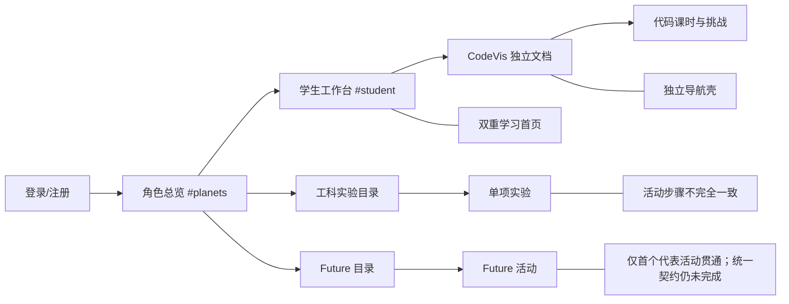
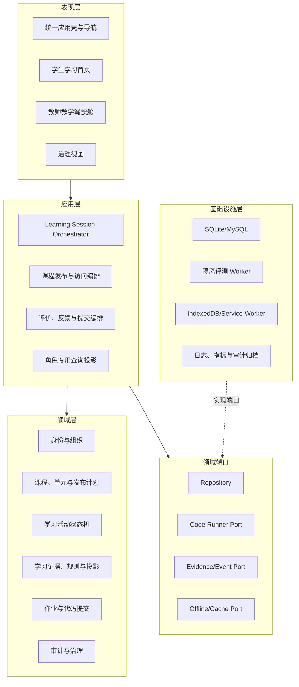
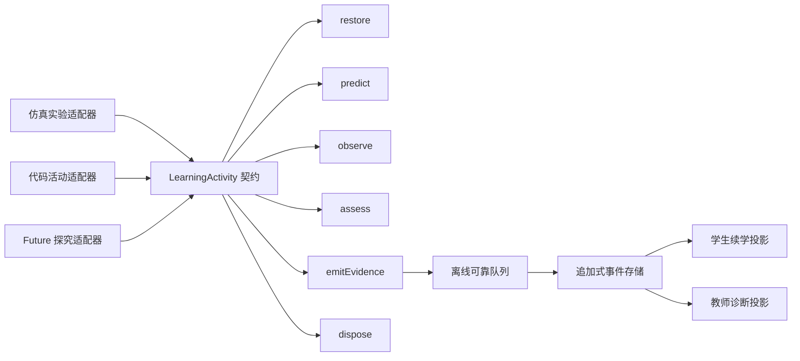
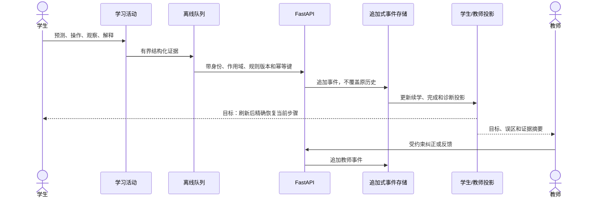
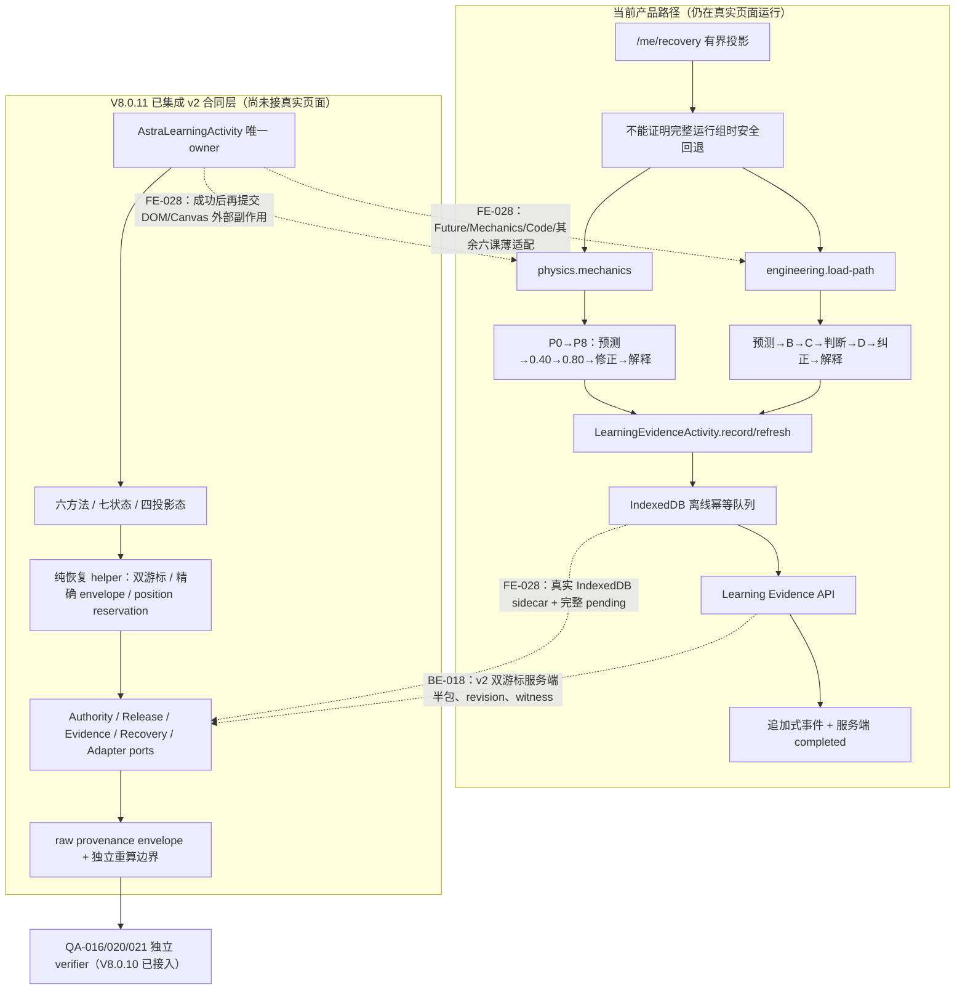
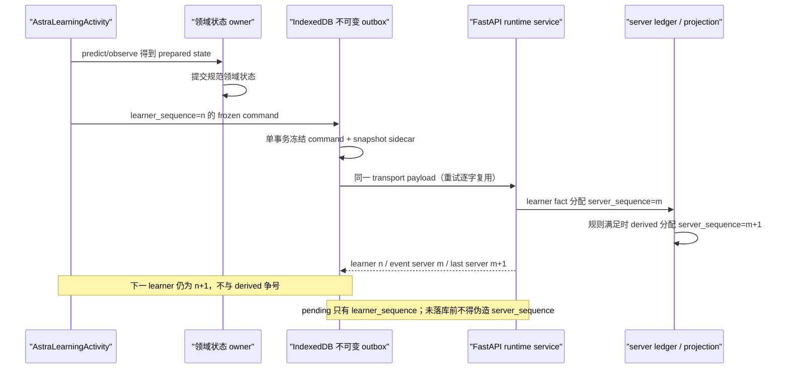

# 星序 Astra — 跨版本综述与规划迁移附录

> 子文档编号：39
> 该文档隶属于[03-发布历史](../03-发布历史.md#6-规划替换与工作区交付归档)，保存历史综述、已撤换规划和独立标识的工作区记录。
> 文档状态：已从原始主文档迁移，保留原有技术事实
> 最近更新：2026-09-06
> 更新者：主开发组

保留无法唯一归入 V4—V8 单一大版本的原 03 跨版本说明和原 02 控制面快照。A/B 为既有历史，C 为本轮规划替换与未提交工作区记录；均不承担当前执行计划职责。

---

## A. 原 03 跨版本说明

## A1. 原 03 第 1—10 行

> 以下为迁移时未归属单一大版本的原文片段，仅作历史追溯；不再承担当前计划控制职责。

# 星序 Astra — 发布历史

> 本文件统一保留全部版本、review 修复、阶段结果和验证证据；既有历史不重排、不改号、不以摘要替代原文。
>
> 此前独立维护的 V7.4.12 以后开发记录已经完整归并到本原始文档；当前任务和状态见 [`02-更新规划.md`](../02-更新规划.md)。
>
> 🪐 v6.0.0 起项目顶层称为“星序 Astra”；旧称谓继续作为历史事实保留。

---
## A2. 原 03 第 15—20 行

> 以下为迁移时未归属单一大版本的原文片段，仅作历史追溯；不再承担当前计划控制职责。

## 1. 当前周期提交

### 1.0 V7.6—V7.9 活动周期

本节按实际提交 / 集成顺序追加；不同版本轨道可以交错，但新提交只在本节末尾增加一项，不重排或改写已经发生的历史。当前任务状态仍只在 [`02-更新规划.md`](../02-更新规划.md) 维护。
## A3. 原 03 第 1793—1801 行

> 以下为迁移时未归属单一大版本的原文片段，仅作历史追溯；不再承担当前计划控制职责。

#### 1.0.162 V7.9.101 PM docs(gate): 记录V8.0.12独立验收与集成（PM-021）

- **提交日期**：2026-08-12
- **任务编号**：`PM-021`
- **提交标题**：`V7.9.101 PM docs(gate): 记录V8.0.12独立验收与集成（PM-021）`
- **控制面更新**：稳定产品点更新为 `V8.0.12 / f831b03`，BE-018 标为完成，QA-022 第一阶段标为 PASS 并等待 UI/FE 后进入第二阶段。新增 PM-021 串行集成任务，唯一负责 UI-004、FE-029 来源复审、主线移植、角色/Future/Physics/Service Worker 资源代际、必要静态合同和共享文档接线。
- **开发者说明**：01 登记四个 activity-runtime 端口、0053 双游标与服务器恢复半包，同时继续明确“服务器完整历史 ≠ 客户端完整 pending ≠ 产品精确续学”。02 同步任务、团队、基线、工作树和验收层级，避免把后端完成冒充最终参赛体验完成。
- **并行边界**：UI-004 与 FE-029 继续在 `86c2477` 控制基线上实施，因 V8.0.12 只修改后端域而无需中断或变基；两组仍禁止触碰共享缓存代际。候选交付后由 PM-021 逐个复审和移植，再把同一 V8.0.15 revision 交 QA-022，未验浏览器前不宣告当前 Goal 完成。
## A4. 原 03 第 2067—2225 行

> 以下为迁移时未归属单一大版本的原文片段，仅作历史追溯；不再承担当前计划控制职责。

### 1.4 re18：清理工作区临时产物与存储

- **提交日期**：2026-07-27
- **任务编号**：`REL-006`
- **提交标题**：`re18：清理工作区临时产物与存储`
- **清理范围**：删除忽略且可重建的 `.venv/`、`node_modules/`、`server/build/`、测试截图、临时 SQLite、pytest 运行目录及 Python 字节码；依赖来源仍由 `package-lock.json`、`backend/requirements.lock` 和现有一键入口固定。
- **保护边界**：`.codex/worktrees/qianduan` 含 9 个修改文件和 8 个未跟踪文件，未暂存、重置、移动或删除；`.claude/`、`.vscode/` 用户配置继续保留。Git 归档标签保持旧分支提交可达，再执行 `git gc --prune=now`，不删除任何活动分支或归档引用。
- **运行状态**：旧 9001 启动链占用 `.venv` 时先停止并释放，再以已具备依赖的全局 `D:\Python\python.exe`、相同本机数据目录和安全开关恢复服务；设置 `PYTHONDONTWRITEBYTECODE=1`，不在仓库重新生成字节码。该操作不改变 `astra-local.ps1` 或正式部署契约。
- **结果与验证**：工作区核算约释放 183 MiB；`.git` 从约 47.66 MiB 降至 17 MiB，loose/garbage 均为 0；根 `review` clean。9001 监听进程为全局 Python，`/api/health` 返回 `ok`，根路径返回 200、`X-Astra-Local-Preview=1` 与原数据目录实例标识。

### 1.5 re17：收束历史分支与归档引用

- **提交日期**：2026-07-27
- **任务编号**：`REL-005`
- **提交标题**：`re17：收束历史分支与归档引用`
- **分支审计**：逐一核对 9 条非目标本地分支及远端 `feature/v6.1`。`feature/v6.1`、`legacy/review-v6.6` 已进入现行历史；三个 review 小组分支与 `review` 补丁等价；三个 V7.5 小组分支由后续聚合提交替代；`legacy/review-v6.5` 保留 25 个未进入四条主用分支的历史提交。
- **安全收束**：以 `review/re17` 的树建立本地只读归档提交并把所有停用分支头作为父引用，标签固定为 `archive/branches-before-20260727`；随后从该归档点使用非强制 `git branch -d` 删除全部停用本地分支，并删除远端 `feature/v6.1`。标签只保存历史可达性，不作为开发、集成或派生入口。
- **最终状态**：活动分支只保留 `main`、`qianduan`、`houduan`、`review`；worktree 只保留根 `review` 与原有脏 `qianduan`，后者未被暂存、重置、移动或清理。`codevis/README.md` 和 00/01/02 的现行分支说明同步修正。
- **验证**：分支/远端/worktree 清单与归档标签父引用通过；文档兼容检查 errors=0（保留既有 `99-历史审视报告归档.md` 编号警告）、项目对接检查与 `git diff --check` 通过；`git fsck --full` 退出 0，仓库既有 dangling 对象未做破坏性清理。

### 1.6 re16：记录全仓终验与团队收束

- **提交日期**：2026-07-19
- **任务编号**：`QA-011`、`PM-007`
- **提交标题**：`re16：记录全仓终验与团队收束`
- **独立终验**：QA 长期组冻结 `review / e8768949f7787fa7cba43d0e92c7b8804c12f631`，使用真实外部 Edge extension 150.0.4078.65 独立复验并最终 PASS，P0/P1/P2/P3 均为 0。学生、教师、管理员角色隔离，代码空间 6×3 学习链与诚实 `runner_unavailable`，未来星系 6×3/Canvas/发布裁剪，教师课程节奏、代码审阅、键盘 tablist 和精确 390×844 均通过；浏览器应用 console/pageerror 为 0。
- **独立门禁**：`npm test` exit 0，197 个受跟踪 JavaScript 与 35/35 前端合同通过；后端使用独立 `--basetemp` 复跑为 519 passed、7 个真实 MySQL 条件跳过、0 failed，耗时 412.70s，只保留既有 Starlette/httpx 弃用警告。只读账本为 Alembic `20260719_0050`，HTTP no-store/MIME/私有路径 404、迁移与 9001 单入口均通过；三张移动截图和账本只保存在仓库外 TEMP。
- **团队与工作树收束**：代码空间、未来星系、课程平台和 QA 四个长期任务已取消置顶并归档。三个组工作树在干净性与 `git cherry review <branch>` 补丁等价确认后完成 Git worktree 注销；`8c4f/8118` 目录已移除，`56ca` 只剩仓库外空目录且不再登记为 worktree，三个组分支仅保留为审计引用。`git worktree list` 只保留根 `review` 与未触碰的遗留脏 `qianduan`。
- **状态边界**：`re16` 只同步 QA-011、任务完成和清理事实，不修改受验运行时代码；9001 继续运行供用户验收。默认 `DisabledCodeRunnerAdapter`、真实 MySQL 条件跳过、隔离 runner、staging 与公网 R6 未补证，不得由本机 PASS 外推。

### 1.7 re15：同步审查迁移与验收基线

- **提交日期**：2026-07-19
- **任务编号**：`DEV-001`
- **提交标题**：`re15：同步审查迁移与验收基线`
- **问题与实现**：`re10` 已把 Alembic head 推进到 0050，但只读 SQLite QA 账本仍冻结 0049，正确的新候选会被误报迁移漂移；同时 01/02/03/04/07/08/09 与 README 尚未集中吸收 `re3`—`re14`。本提交把账本及合同同步到 0050，补齐 0050 部署/回滚边界，并按文档职责更新稳定实现、任务候选、逐提交历史、前后端索引和阶段门禁。
- **候选边界**：DEV-001 实现切片进入待验收；`teacher.js` 与根 `index.html` 未因行数机械拆分，只有三层 CSS 在证明级联等价后完成分层。QA-011 尚未执行，真实 MySQL、隔离 runner、staging 与公网 R6 仍不宣称完成。
- **验证**：`npm test` 为 197 个受跟踪 JavaScript 及 35/35 合同通过；后端收集 526 项，全量为 519 通过、7 项真实 MySQL 条件跳过、0 失败，仅保留既有 Starlette/httpx 弃用警告。空 SQLite 已完成全量升级、0050→0049→0050 往返并回读单一 head 0050，QA 账本 `emptyBaselineOk=true`，compileall 通过；文档兼容、项目对接与 `git diff --check` 在提交前复核。

### 1.8 re14：拆分教师工作台样式层级

- **提交日期**：2026-07-19
- **任务编号**：`DEV-001`
- **提交标题**：`re14：拆分教师工作台样式层级`
- **实现**：原 3,016 行 `teacher.css` 按原级联字节顺序拆为 `teacher-foundation.css`、`teacher-workbench.css`、`teacher-curriculum.css`；注册表按该顺序按角色加载，旧单体不再发布。标准化拼接 SHA-256 固定为 `e0e38848a702fd66f906f57eb29c7d32ae0a977734c11abd03e42264ee397028`。
- **资源边界**：主壳、注册表、Router、main、SW 与教师资源统一为 `20260719v75ReviewTeacherLayersP0`；Service Worker 对 student/teacher/admin 顶层 JS/CSS 统一 network-only，浏览器证明固定三层响应和加载顺序。
- **验证**：196 个受跟踪 JavaScript、35/35 合同、样式层级合同和真实外部 Edge 通过；桌面及精确 390×844 无根溢出，三层资源 200/正确 MIME，旧单体 404。未机械拆分 `teacher.js` 或 `index.html`。

### 1.9 re13：限制兼容列表的无界读取

- **提交日期**：2026-07-19
- **任务编号**：`DEV-001`
- **提交标题**：`re13：限制兼容列表的无界读取`
- **实现**：新增共享 pagination 兼容服务；成员、作业提交、学习事件和判题尝试的 deprecated 数组端点以 201 项探针保持最多 200 项兼容，超限返回 `409 legacy_list_limit_exceeded` 与保留过滤条件的分页 URL。
- **兼容边界**：学生分页学习事件默认只读当前有效资源；显式 `include_inactive_locked=true` 与旧数组接口保留归档组织下锁定历史的旧语义。权限、scope 和过滤都在数据库阶段执行。
- **验证**：新增真实 HTTP 上限/分页/授权/过滤测试；完整后端套件 100% 通过，只有既有真实 MySQL 条件跳过。

### 1.10 re12：迁移教师端高基数分页消费

- **提交日期**：2026-07-19
- **任务编号**：`DEV-001`
- **提交标题**：`re12：迁移教师端高基数分页消费`
- **实现**：教师组织、提交和判题视图改为消费成员、作业提交、学习事件及判题尝试分页端点；分别维护 offset/next_offset，scope、刷新或翻页时清除陈旧源码和判题详情，指标明确使用本页口径。
- **验证**：教师分页合同、课程编排合同、页面注册与角色资源合同通过；移动分页按钮保持 44px 触达。

### 1.11 re11：补齐高基数接口兼容分页

- **提交日期**：2026-07-19
- **任务编号**：`DEV-001`
- **提交标题**：`re11：补齐高基数接口兼容分页`
- **实现**：为班级成员、作业提交、学习事件和判题尝试增加统一 `items/total/limit/offset/next_offset` 响应与数据库分页查询，保留旧数组路由为 deprecated 兼容入口；授权、班级、角色、状态与课程过滤不在内存后处理。
- **验证**：四领域分页、越权、过滤和 next_offset 测试通过，既有调用契约保持兼容。

### 1.12 re10：限制判题租约恢复批次

- **提交日期**：2026-07-19
- **任务编号**：`DEV-001`
- **提交标题**：`re10：限制判题租约恢复批次`
- **实现**：过期 running 判题租约按 `lease_expires_at/id` 每批最多恢复 100 项，并以条件更新避免陈旧 worker 覆盖；Alembic 0050 和模型增加 `status + lease_expires_at + id` 复合索引，目标发布期望迁移同步到 0050。
- **验证**：分批恢复、并发状态保护、0050 升降级与单一迁移头测试通过；默认 runner 与 `runner_unavailable` 语义未改变。

### 1.13 re9：显式约束多班级作业历史

- **提交日期**：2026-07-19
- **任务编号**：`DEV-001`
- **提交标题**：`re9：显式约束多班级作业历史`
- **实现**：同一学生对同一作业存在多个 eligible class 时，提交历史必须携带 `class_id`；省略返回 422，不再静默选取任一班级。教师与管理员仍按授权班级读取。
- **验证**：单班级兼容、多班级显式范围与歧义拒绝测试通过。

### 1.14 re8：关闭课程发布与学生写入竞态

- **提交日期**：2026-07-19
- **任务编号**：`DEV-001`
- **提交标题**：`re8：关闭课程发布与学生写入竞态`
- **实现**：`course_release_plans` 提供共享锁定写门禁；学习事件、普通提交和代码提交在同一事务内锁定并复核组织、课程、单元及分块状态，教师把 open 改为 locked/hidden 后，尚未提交的学生写入不能穿透旧检查结果。
- **验证**：三类并发写入口、发布版本更新、归档组织与越权反向测试通过。

### 1.15 re7：对齐未来课程声明与互动证据

- **提交日期**：2026-07-19
- **任务编号**：`DEV-001`
- **提交标题**：`re7：对齐未来课程声明与互动证据`
- **实现**：校准六方向 manifest 的控件、观察和反馈声明；Earth/Sun、桥梁桁架、网络分层、材料、人文等 owner 补齐真实调参和可观察结果，声明不再超出课程实际互动。
- **验证**：未来课程生命周期合同覆盖 manifest—owner 映射、可操作控件、观察证据、清理和降级路径。

### 1.16 re6：关闭未来课程发布初始化竞态

- **提交日期**：2026-07-19
- **任务编号**：`DEV-001`
- **提交标题**：`re6：关闭未来课程发布初始化竞态`
- **实现**：学生班级/课程请求发出前同步进入新的 unavailable generation；认证、班级或会话变化会使旧请求失效，避免迟到响应把新上下文错误恢复为 open。
- **验证**：未来发布上下文合同覆盖初始化同步状态、迟到响应、会话丢失和直达路由失败关闭。

### 1.17 re5：移除代码空间孤儿页面资源

- **提交日期**：2026-07-19
- **任务编号**：`DEV-001`
- **提交标题**：`re5：移除代码空间孤儿页面资源`
- **实现**：删除未被 HTML、路由或注册表引用的旧 `codevis/pages/home/home.css` 与 `home.js`，保留课程目录为唯一默认入口；合同禁止孤儿路径回流。
- **验证**：代码空间 review 合同和全量前端合同通过，课程目录/子课/挑战路由未受影响。

### 1.18 re4：补齐代码提交终态轮询

- **提交日期**：2026-07-19
- **任务编号**：`DEV-001`
- **提交标题**：`re4：补齐代码提交终态轮询`
- **实现**：正式提交 adapter 对 `queued/running` 状态执行有界轮询，离页、新提交和终态会取消旧 timer；UI 始终显示服务器终态，runner 未启用仍回读 `runner_unavailable`，不把浏览器预检冒充 accepted。
- **验证**：提交适配器的 pending、终态、取消、超时与错误合同通过，学生上下文和挑战合同同步更新。

### 1.19 re3：修复代码挑战结果焦点丢失

- **提交日期**：2026-07-19
- **任务编号**：`DEV-001`
- **提交标题**：`re3：修复代码挑战结果焦点丢失`
- **实现**：挑战完成结果更新不再重绘并替换整个交互区；保留当前操作节点和焦点，学习者可继续修改、运行或提交而不被跳回页面起点。
- **验证**：代码空间 review 合同新增完成后焦点与结果持续性断言并通过。

### 1.20 re2：移除前端运行时外链依赖

- **提交日期**：2026-07-19
- **任务编号**：`DEV-001`
- **提交标题**：`re2：移除前端运行时外链依赖`
- **可复现问题**：部署 origin 打开主站后仍会动态注入 Google Fonts；协议页打开时从 jsDelivr 拉取 `marked@12.0.0`。两者使已封装的 9001 一键站点在无互联网、CDN 故障或网络策略拦截时出现额外请求、字体重排或协议页加载失败，且 Markdown 运行字节不受仓库锁与哈希直接约束。
- **实现**：主壳移除远程字体脚本并使用明确的本机中西文/等宽字体回退栈；协议页改为同源按需加载 `shared/vendor/marked-v12/marked.min.js`。`package.json/package-lock.json` 精确锁定 `marked@12.0.0`，vendor 目录保存上游字节、MIT 许可、npm integrity、SHA-256、LF 属性和来源清单；协议页资源使用独立 `20260719re2OfflineP0` 代际。
- **合同边界**：`offline-runtime-assets-contract.cjs` 拒绝恢复 Google Fonts 或 Markdown CDN，核对本地路径、精确依赖与两个 vendor SHA-256。外部教材/论文地址仍是用户主动打开的参考链接，不算应用启动依赖；本切片不改变认证、课程、OJ、数据库或目标发布语义。
- **验证**：独立离线资产合同、页面注册合同通过；`npm test` 为 193 个受跟踪 JavaScript 语法和 32/32 前端合同通过，`git diff --check` 与文档/对接门禁在提交前复核。

### 1.21 re1：建立全仓审查基线与状态快照

- **提交日期**：2026-07-19
- **任务编号**：`REL-004`
- **提交标题**：`re1：建立全仓审查基线与状态快照`
- **分支与冻结点**：QA-010 PASS 且 `houduan` 工作区干净后，从 V7.5.10 文档提交 `8723dde196e70ea7ca5b1db8251dfbfa3a7736a0` 创建用户指定的 `review`。该冻结点包含精确受验代码 `9b0ea63cc7257a8eaaaca0f615de6af35248e17f` 和其后的纯文档终验留痕，不混入新运行时代码。
- **历史分支保护**：仓库原有同名 `review` 是 V6.6 阶段分支，停在 `21e7b0248ea32dcd946d633ab4539d4947f42861`，没有 `houduan` 之外的独有提交，也未被工作树占用；旧引用已保留为 `legacy/review-v6.6`，本轮没有强制覆盖或丢弃历史。
- **审查范围**：DEV-001 从 `re2` 起依次核查主壳与教师超大文件、三星系资源/生命周期、后端认证/课程/OJ 分层与查询、依赖/构建复现、9001 配置、目录分级、低效或重复代码；只修复有证据的问题，每个主题保持可回滚，并在候选冻结后交由 QA-011 独立终验。
- **状态边界**：`re1` 只建立控制面和状态快照，不提前声明代码重构、真实 MySQL、隔离 runner、staging 或公网 R6 完成；长期代码空间、未来星系、课程平台和 QA 组继续保留至 QA-011/PM-007 收束。
- **验证**：分支起点、旧分支引用、Git/worktree、01/02/03/09 当前状态完成对账；文档兼容、项目对接与 `git diff --check` 通过后提交。
- **关联说明**：[`02-更新规划.md`](../02-更新规划.md) 的 `REL-004/DEV-001`、[`01-开发者手册.md`](../01-开发者手册.md) 与 [`09-后端阶段收束小版本开发安排.md`](../09-后端阶段收束小版本开发安排.md)。
## A5. 原 03 第 2692—2707 行

> 以下为迁移时未归属单一大版本的原文片段，仅作历史追溯；不再承担当前计划控制职责。

## 2. 阶段结果汇总

| 周期 | 核心结果 | 完成证据入口 |
| --- | --- | --- |
| V7.4.12—V7.4.30 | 建立统一文档/任务/版本控制面；收束页面与实验生命周期；完成 Cookie/Session 认证、组织治理、课程发布基础以及目标发布仓库门禁 | 本文 1.38—1.56；后端阶段边界见 [`09-后端阶段收束小版本开发安排.md`](../09-后端阶段收束小版本开发安排.md) |
| V7.4.31—V7.4.37 | 把角色工作台迁回星序身份层，完成登录先行、9001 单端口本机交付、教师/管理界面重排和三角色集中验收 | 本文 1.31—1.37 |
| V7.5.0—V7.5.11 与 re1—re18 | 完成代码空间/未来星系课程重绘、教师三星系编排、OJ 权威契约与诚实降级、移动无障碍修复、全仓 review、独立终验、团队/分支/临时产物收束 | 本文 1.1—1.30；产品契约见 [`02-子文档/21-V7.5课程体验与教师编排设计.md`](../02-子文档/21-V7.5课程体验与教师编排设计.md) |

阶段汇总只帮助定位，不替代上方逐提交事实；精确任务、候选提交、测试数量和保留边界仍以对应条目为准。

## 3. 历史归档入口

V7.4.11 及以前的版本、review 修复、测试证据和长期演进记录继续保存在本文件后续章节。旧历史不重排、不改号；需要修正事实时使用新任务和新提交留痕。

---
## A6. 原 03 第 3056—3068 行

> 以下为迁移时未归属单一大版本的原文片段，仅作历史追溯；不再承担当前计划控制职责。

## 〇-195、全局 review 与文档体系收束（2026-07-11）

- **审查分支**：从 `houduan@26c581d` 建立新 `review`，旧 review 历史保留为 `legacy/review-v6.5`；修复按 `re1` 至 `re6` 独立提交，便于逐项审查和回滚。
- **运行态修复**：首页粒子网络在离页后会终止 worker，但已 transfer 的 canvas 不可再次 transfer 或取得 2D context；现销毁/回退时替换为新 canvas，并以 Node 生命周期契约和“首页 → 物理 → 首页”浏览器回归锁定。
- **公开页面修复**：静态白名单补入唯一根级文件 `LICENSE.md`，恢复页脚“开源协议”；`README.md`、`doc/`、`backend/`、`.git/` 和编码/穿越变体继续返回 404。
- **全局组件修复**：`ExperimentExport`、`GlobalSearch`、`KeyboardShortcuts` 初始化改为幂等，消除重复 DOM ID/监听器；导出按钮/菜单和各类 FAB 均保持单实例，`Ctrl+K` 与学科快捷键恢复单次触发。
- **后端兼容性**：Alembic 0041 使用类型化 insert，迁移 fixture 显式序列化 SQLite 时间，关闭 Python 3.14 默认 datetime adapter 弃用告警；原告警来源测试已在 `DeprecationWarning=error` 下通过。
- **工程门禁**：新增统一 `tools/tests/run-contracts.cjs` 与 GitHub Actions，覆盖后端 SQLite、隔离 MySQL 发布证据、全部跟踪 JavaScript 语法、前端契约和 C++ Release 构建。
- **文档归档**：README 恢复为项目入口；`02` 只保留未来计划；开发者手册/后端设计移除版本流水；原 `09` 号已完成路线删除，其事实保留在本发布历史；AI 协作指引同步当前全栈边界。
- **验证**：全量后端收集 380 项，375 passed、5 个显式隔离 MySQL 专项 skipped、0 warning；10/10 前端契约和 150 个受跟踪 JS/MJS/CJS 语法通过。桌面/390×844 代表性页面、12 个顶层路由、权限未登录态、sandbox 交互、DOM 重复 ID/断图和控制台均完成复核，Markdown 本地链接 0 缺失。当前机器只有 GCC 6.3，仍按 CMake 约束拒绝本地 C++ 构建；合格 C++17 Release 构建由新增 CI 与既有 MSVC 实机证据共同覆盖。

---
## A7. 原 03 第 7343—7481 行

> 以下为迁移时未归属单一大版本的原文片段，仅作历史追溯；不再承担当前计划控制职责。

## 一、内容规划完成总结（对齐人教版 2019 新课标）

### 规划原则

1. **覆盖度**：优先覆盖必修教材核心知识点，选择性必修渐进补充
2. **交互深度**：每个实验包含**原理层**（展示底层机制）+ **操作层**（用户可调控参数）+ **总结层**（关键公式/结论）
3. **教育意义**：拒绝蜻蜓点水式动画，必须让用户理解"为什么"

---

### 已完成实验汇总（63 个实验）

#### 1. 数学模块 — 13 个实验 ✅

| 实验                | 对应教材                | 质量       | 状态                                |
| ------------------- | ----------------------- | ---------- | ----------------------------------- |
| 算筹演示 + 函数图像 | 文化拓展 / 必修一 第3章 | ★★★★   | ✅ 完成                             |
| 微积分              | 选必二 第4章            | ★★★★★ | ✅ 重写（三模式：导数/积分/Taylor） |
| 几何变换            | 必修二 第6章            | ★★★★★ | ✅ 重写（仿射变换 + 三角形几何）    |
| 复数运算            | 必修二 第5章            | ★★★★★ | ✅ 重写（运算 + 单位根 + 域着色）   |
| 三角函数            | 必修一 第5章            | ★★★★   | ✅ 新增                             |
| 集合运算            | 必修一 第1章            | ★★★★   | ✅ 新增                             |
| 概率统计            | 必修二 第9-10章         | ★★★★   | ✅ 新增                             |
| 向量运算            | 必修二 第6章            | ★★★★   | ✅ 新增                             |
| 不等式              | 必修一 第2章            | ★★★★   | ✅ 新增                             |
| 圆锥曲线            | 选必一 第3章            | ★★★★   | ✅ 新增                             |
| 立体几何            | 选必一 第1章            | ★★★★★ | ✅ 重写（5形体+截面+光照）          |
| 排列组合            | 选必二 第5章            | ★★★★★ | ✅ 重写（树状图+杨辉三角）          |
| 数列                | 选必二 第3章            | ★★★★★ | ✅ 重写（面积填充+教育面板）        |

#### 2. 物理模块 — 17 个实验 ✅

| 实验           | 对应教材       | 质量       | 状态                          |
| -------------- | -------------- | ---------- | ----------------------------- |
| 力学模拟       | 必修一 第3-4章 | ★★★★   | ✅ 完成                       |
| 匀变速运动     | 必修一 第1-2章 | ★★★★   | ✅ 新增                       |
| 抛体运动       | 必修二 第1章   | ★★★★   | ✅ 新增                       |
| 圆周运动       | 必修二 第2章   | ★★★★   | ✅ 新增                       |
| 万有引力       | 必修二 第3章   | ★★★★   | ✅ 新增                       |
| 机械能守恒     | 必修二 第4章   | ★★★★   | ✅ 新增                       |
| 力的合成与分解 | 必修一 第3章   | ★★★★   | ✅ 新增（三模式：合成/正交分解/斜面） |
| 动量守恒       | 选必一 第1章   | ★★★★   | ✅ 新增（弹性/非弹性/完全非弹性+柱状图） |
| 带电粒子运动   | 必修三/选必二   | ★★★★   | ✅ 新增（洛伦兹力偏转/质谱仪/速度选择器） |
| 电磁场         | 必修三 第1-3章 | ★★★★★ | ✅ 重写（三模式+探针+预设）   |
| 电路分析       | 必修三 第2章   | ★★★★   | ✅ 新增                       |
| 电磁感应       | 选必二 第1章   | ★★★★   | ✅ 新增                       |
| 交变电流       | 选必二 第2章   | ★★★★★ | ✅ 重写（波形+相量图+变压器） |
| 波动演示       | 选必一 第2-3章 | ★★★★★ | ✅ 重写（叠加+驻波+多普勒）   |
| 光学           | 选必一 第4章   | ★★★★   | ✅ 新增                       |
| 流体力学       | 课外拓展       | ★★★★   | ✅ 完成                       |
| 相对论         | 课外拓展       | ★★★     | ✅ 完成                       |

#### 3. 化学模块 — 11 个实验 ✅

| 实验       | 对应教材     | 质量       | 状态                                  |
| ---------- | ------------ | ---------- | ------------------------------------- |
| 元素周期表 | 必修一 第4章 | ★★★★   | ✅ 完成                               |
| 分子结构   | 选必二 第2章 | ★★★★★ | ✅ 完成                               |
| 化学反应   | 必修二 第1章 | ★★★★★ | ✅ 重写（化学键可视化+能量曲线）      |
| 化学键     | 必修一 第4章 | ★★★★   | ✅ 新增                               |
| 离子反应   | 必修一 第2章 | ★★★★   | ✅ 新增                               |
| 氧化还原   | 必修一 第2章 | ★★★★★ | ✅ 重写（5反应+3D原子+电子trail）     |
| 化学平衡   | 选必一 第2章 | ★★★★   | ✅ 新增                               |
| 电化学     | 选必一 第4章 | ★★★★   | ✅ 新增                               |
| 有机化学   | 必修二 第2章 | ★★★★★ | ✅ 重写（3D旋转+官能团高亮）          |
| 反应速率   | 选必一 第2章 | ★★★★★ | ✅ 重写（Maxwell-Boltzmann+碰撞理论） |
| 溶液与电离 | 选必一 第3章 | ★★★★★ | ✅ 重写（6种物质+精确pH）             |

#### 4. 算法模块 — 8 个实验 ✅

| 实验                    | 质量     | 状态    |
| ----------------------- | -------- | ------- |
| 桶排序                  | ★★★   | ✅ 完成 |
| 搜索算法 (二分+BFS/DFS) | ★★★★ | ✅ 完成 |
| 图算法 (Dijkstra/Prim)  | ★★★★ | ✅ 完成 |
| 数据结构 (栈/队列/树)   | ★★★   | ✅ 完成 |
| 排序对比 (5种排序)      | ★★★★ | ✅ 新增 |
| 递归可视化              | ★★★★ | ✅ 新增 |
| 动态规划                | ★★★★ | ✅ 新增 |
| 字符串匹配 (KMP)        | ★★★★ | ✅ 新增 |

#### 5. 生物模块 — 13 个实验 ✅

| 实验     | 对应教材     | 质量       | 状态                                 |
| -------- | ------------ | ---------- | ------------------------------------ |
| 细胞结构 | 必修一 第3章 | ★★★★   | ✅ 完成                              |
| DNA 结构 | 必修二 第3章 | ★★★★   | ✅ 完成                              |
| 光合作用 | 必修一 第5章 | ★★★★★ | ✅ 重写（光反应+暗反应 Calvin 循环） |
| 遗传学   | 必修二 第1章 | ★★★★★ | ✅ 重写（双基因+种群遗传+系谱图）    |
| 有丝分裂 | 必修一 第6章 | ★★★★   | ✅ 新增                              |
| 减数分裂 | 必修二 第2章 | ★★★★   | ✅ 新增                              |
| 基因表达 | 必修二 第4章 | ★★★★   | ✅ 新增                              |
| 细胞呼吸 | 必修一 第5章 | ★★★★   | ✅ 新增                              |
| 物质运输 | 必修一 第4章 | ★★★★   | ✅ 新增                              |
| 基因突变 | 必修二 第5章 | ★★★★★ | ✅ 重写（64密码子表+移码突变）       |
| 神经调节 | 选必一 第2章 | ★★★★★ | ✅ 重写（突触传递+动作电位）         |
| 免疫系统 | 选必一 第4章 | ★★★★★ | ✅ 重写（固有+适应性免疫）           |
| 生态系统 | 选必二 第3章 | ★★★★★ | ✅ 重写（能量流动+种群动态）         |

---

## 五、Bug 审查清单

### v4.0 全面测试结果（2026-04-15）

#### ✅ 已修复问题

| 编号  | 问题                                           | 修复方式                                   |
| ----- | ---------------------------------------------- | ------------------------------------------ |
| BF-01 | `fluid-dynamics.js` 语法错误                 | 补充缺失方法声明                           |
| BF-02 | 24 个 `content-section` 缺少 `data-module` | 批量添加属性                               |
| BF-03 | Router destroy 对象名不匹配（4 个物理模块）    | 修正对象引用                               |
| BF-04 | `SearchAlgorithms.destroy()` 不存在          | 拆分为 3 个独立 destroy                    |
| BF-05 | 遗传学缺少控制面板                             | 添加 3 个控制面板及子控件                  |
| BF-06 | 4 个生物模块 `<script>` 标签缺失             | 添加 script 引用                           |
| BF-07 | 3 个物理实验缺少 CONFIG 条目                   | 补充 config 条目                           |
| BF-08 | 圆锥曲线错字 "圆锜"                            | 修正文字                                   |
| BF-09 | `openExperiment` 快速点击重复触发            | 添加防抖锁                                 |
| BF-10 | 10 个 Canvas 缺少 DPR 适配                     | 添加 devicePixelRatio 处理                 |
| BF-11 | 缺少 ARIA 无障碍属性                           | skip-nav + 地标 + 键盘事件 + focus-visible |

#### ✅ 模块优化记录 (OPT-01 ~ OPT-12)

12 个模块完成深度 v2 重写，质量评分从 7-9/12 提升至 11-12/12。详见 doc/01-开发者手册.md §16 更新日志。

#### ✅ 验证通过项

- [X] 全部 JS 文件语法检查通过（`node -c`）
- [X] 72 个 `<script>` 引用全部指向存在的文件
- [X] CONFIG.experiments 条目与 HTML `data-module` 属性一致
- [X] Router init/destroy 调用与 JS 导出函数匹配
- [X] 浏览器测试：首页 + 5 个学科页均 0 错误加载
- [X] 首屏加载优化：加载屏即时显示 + defer 脚本不阻塞首屏

#### 已知问题（低优先级）

- [ ] 化学反应：原子数量不严格遵循化学计量比
- [ ] router.js：快速连续点击导航（已有 isTransitioning 保护，风险低）
## A8. 原 03 第 7491—7603 行

> 以下为迁移时未归属单一大版本的原文片段，仅作历史追溯；不再承担当前计划控制职责。

### 排查流程

1. 启动本地服务器
2. 逐学科进入每个实验
3. 测试所有交互控件
4. 测试窗口缩放响应
5. 测试移动端触控
6. 检查浏览器控制台错误

---

## 七、人教版课标覆盖度分析

### 数学（A 版）

| 模块   | 覆盖章节                                          | 覆盖率 | 缺口                         |
| ------ | ------------------------------------------------- | ------ | ---------------------------- |
| 必修一 | 第1-5章（集合/不等式/函数/指对数/三角函数）       | ~80%   | 指数与对数函数、函数性质深化 |
| 必修二 | 第5-6章（复数/向量）、第9-10章（概率统计）        | ~90%   | 统计回归分析                 |
| 选必一 | 第1章（立体几何）、第3章（圆锥曲线）              | 100%   | —                           |
| 选必二 | 第3章（数列）、第4章（微积分）、第5章（排列组合） | ~85%   | 二项式定理、导数应用深化     |

### 物理

| 模块   | 覆盖章节                             | 覆盖率 | 缺口                         |
| ------ | ------------------------------------ | ------ | ---------------------------- |
| 必修一 | 第1-4章（运动学/力学）               | ~85%   | 力的合成与分解（独立实验）   |
| 必修二 | 第1-4章（抛体/圆周/万有引力/机械能） | 100%   | —                           |
| 必修三 | 第1-3章（电磁场/电路）               | ~90%   | 洛伦兹力轨迹（独立实验）     |
| 选必一 | 第1-4章（动量/波动/光学）            | ~70%   | 动量守恒碰撞                 |
| 选必二 | 第1-2章（电磁感应/交变电流）         | 100%   | —                           |
| 选必三 | 第1-4章（热学/原子物理）             | 0%     | 气体定律、原子物理（待开发） |

### 化学

| 模块   | 覆盖章节                                   | 覆盖率 | 缺口                      |
| ------ | ------------------------------------------ | ------ | ------------------------- |
| 必修一 | 第1-4章（离子反应/氧化还原/周期表/化学键） | ~85%   | 元素化合物（Na/Fe/Al 等） |
| 必修二 | 第1-2章（化学反应/有机化学）               | 100%   | —                        |
| 选必一 | 第2-4章（反应速率/溶液/电化学）            | 100%   | —                        |
| 选必二 | 第1-3章（原子结构/分子结构/晶体）          | ~60%   | 原子结构、杂化轨道、晶体  |

### 生物

| 模块   | 覆盖章节                              | 覆盖率 | 缺口                 |
| ------ | ------------------------------------- | ------ | -------------------- |
| 必修一 | 第3-6章（细胞结构/运输/代谢/分裂）    | ~85%   | 酶的特性             |
| 必修二 | 第1-5章（遗传定律/DNA/基因表达/突变） | 100%   | —                   |
| 选必一 | 第1-4章（内环境/神经/体液/免疫）      | ~70%   | 内环境稳态、体液调节 |
| 选必二 | 第1-3章（种群/群落/生态系统）         | ~60%   | 种群与群落、物质循环 |
| 选必三 | 第1章（基因工程）                     | 0%     | 基因工程（待开发）   |

---

## 八、2026-04-14 维护优化增量（本轮）

### 已完成（共性修复）

1. 数学模块清理：移除算筹/计数相关遗留内容，仅保留函数图像主线。
2. 物理力学修复：`physics.js` 中画布高度改为“按宽度推导 + 上下限夹取”，修复隐藏容器触发的尺寸循环膨胀问题。
3. 导航重构收敛：侧边栏模式下修复实验页布局（打开实验时隐藏 Hero，移除旧 `experiments-section` 干扰，并做内容左移适配）。
4. 物理重复控件修复（幂等注入）：
   - `pages/physics/fluid-dynamics.js`：`_injectPotentialPanel` / `_injectCylinderPanel` / `_injectBernoulliPanel`
   - `pages/physics/optics.js`：6 个 `_inject*Panel` 全部添加防重复检查。
5. 生物文本可读性与比例一致性修复：
   - 取消多处“按画布尺寸动态缩放字体”的做法，改为固定字号；
   - 将多处 7px/8px 标签上调到 9px/10px，涉及 `gene-mutation.js`、`neural-regulation.js`、`cellular-respiration.js`、`dna-helix.js`、`gene-expression.js`、`immune-system.js`、`substance-transport.js`、`photosynthesis.js`。

### 浏览器验证结论

1. 物理模块：力学模拟与抛体运动可正常打开并交互，画布不再无穷下坠。
2. 侧边栏导航：实验切换可用，且打开实验后页面自动定位到顶部。
3. 重复按钮问题：对 `fluid-dynamics` 与 `optics` 执行多次“关闭-打开”后，注入面板 ID 计数保持为 1。
4. 生物模块抽检：免疫系统页面文本可读性明显提升，未再出现明显歪斜/过小。

### 待继续跟进（下一轮建议）

1. 扩展“防重复注入”审查范围到化学与算法模块的全部 `_inject*` 方法（本轮已优先修复物理高频问题）。
2. 对生物其余实验做一次“移动端小屏 + 高 DPR”专项抽检，进一步统一最小字号策略。
3. 如线上出现旧脚本缓存，可补充版本号或缓存策略（避免局部用户继续加载旧 JS/CSS）。

---

## 九、2026-04-15 物理模块专项优化（第二轮）

### 本轮完成

1. 侧边栏交互改造（全局）

   - 侧边栏调整为“默认关闭 + 覆盖式”行为；
   - 打开实验后不再自动展开侧边栏，避免实验窗口因侧栏宽度发生挤压；
   - 移除桌面端内容左移规则，保持实验区尺寸稳定。
2. 物理实验“无限下坠/尺寸反馈循环”修复

   - `electromagnetic.js`：画布高度改为由宽度推导并夹取范围（340~560）；
   - `relativity.js`：画布高度改为由宽度推导并夹取范围（340~560）；
   - `waves.js`：统一为宽度推导高度（320~520）；
   - `gravitation.js`：统一为宽度推导高度（360~560），并扩大默认可视区域。
3. 物理实验暂停/重置能力补齐（“继续”语义）

   - 已补齐模块：电路分析、电磁感应、交变电流（新增重置）、万有引力、电磁场、流体力学、光学；
   - 力学模块“清空”升级为完整“重置到初始参数”；
   - 暂停逻辑均为“再次点击继续”，非重播。
4. 统一放大机制（不与滚轮冲突）

   - 新增 `pages/physics/physics-zoom.js`，为物理实验注入“放大”按钮；
   - 放大后使用统一模态层承载画布，关闭后恢复原位；
   - 避免默认鼠标滚轮缩放与现有实验交互冲突。
5. 验证

   - 关键改动文件 `get_errors` 全部 0 报错；
   - 代码级扫描确认已去除高风险 `rect.height` 直接驱动画布高度模式（目标模块）。
## A9. 原 03 第 7672—7695 行

> 以下为迁移时未归属单一大版本的原文片段，仅作历史追溯；不再承担当前计划控制职责。

## 历史版本里程碑（完整表）

| 版本             | 目标                                                | 状态                           |
| ---------------- | --------------------------------------------------- | ------------------------------ |
| v2.0             | SPA 架构 + hash 路由 + 初始实验                     | ✅ 已完成                      |
| v2.2             | 生物卫星 + 化学反应重写 + 文档                      | ✅ 已完成                      |
| v2.7             | 6 个核心模块深度重写                                | ✅ 已完成                      |
| v3.0             | 全部 P0/P1/P2 实验完成（60 个）                     | ✅ 已完成                      |
| v3.0.1           | 全面功能测试 + Bug 修复                             | ✅ 已完成                      |
| v3.0.2           | 一致性审计 + DPR 适配 + ARIA 无障碍                 | ✅ 已完成                      |
| **v4.0.0** | **12 模块 v2 重写 + 加载优化 + 部署准备**     | ✅**已完成**             |
| **v4.0.1** | **生物语法修复 + 回访缓存优化 + SW 离线缓存** | ✅**已完成** |
| **v4.0.2** | **Canvas 字体标准化 + 冻结 Bug 修复 + UI 模板文档** | ✅**已完成** |
| **v4.0.3** | **首页主星球 starPulse "开灯"呼吸效果移除 — 静态柔光** | ✅**已完成** |
| **v4.0.4** | **UPDATE_PLAN 拆分 → 新增 `03-发布历史.md` 历史归档** | ✅**已完成（当前版本）** |

> 未完成的未来版本（v4.1 / v4.5 / v5.0 / v5.5）见 [`02-更新规划.md`](../02-更新规划.md)。

---

## 十一、详细变更日志归档（v4.0.3 ~ v5.1，自 `02-更新规划.md` 迁入）

> 本章为 2026-06-04 文档整顿时，从 `02-更新规划.md` 迁入的逐微版本历史变更日志（v5.1 / v5.0 / v4.6 / v4.5 / v4.4 主线增量，以及 v4.0.3 ~ v4.2.x 的逐版本记录与版本里程碑表）。更细的提交级历史保留在各 `legacy/v*-detail` 分支。规划性内容仍在 `02-更新规划.md`。
## A10. 原 03 第 7862—7913 行

> 以下为迁移时未归属单一大版本的原文片段，仅作历史追溯；不再承担当前计划控制职责。

## 五、版本里程碑（精简）

> 完整历史里程碑（v2.0 - v4.0.1）见 [`03-发布历史.md`](../03-发布历史.md#历史版本里程碑完整表)。

| 版本 | 目标 | 状态 |
| ---- | ---- | ---- |
| v4.0.2 | Canvas 字体标准化 + 冻结 Bug 修复 + UI 模板文档 | ✅ 已完成 |
| v4.0.3 | 首页主星球 starPulse "开灯"呼吸效果移除 — 静态柔光 | ✅ 已完成 |
| **v4.0.4** | **UPDATE_PLAN 拆分 → 新增 `03-发布历史.md` 历史归档** | ✅**已完成** |
| **v4.0.5** | **首页移除 home-progress-widget（保留卫星 chips + 学科 hero 进度条）** | ✅**已完成** |
| **v4.0.6** | **UI 排版审视 — 输出 [`99-历史审视报告归档.md#a-ui-排版审视报告v405-基线`](../99-历史审视报告归档.md#a-ui-排版审视报告v405-基线) Bug 清单（29 项）** | ✅**已完成** |
| **v4.0.7** | **Batch 1 修复：`momentum-conservation.js` Canvas 字号 8/9/10/11px → 12px + CF.sans（10 处）** | ✅**已完成** |
| **v4.0.8** | **Batch 2 修复：3 个物理文件 24 处硬编码字体 → `CF.sans` / `var(--font-mono)`** | ✅**已完成** |
| **v4.0.9** | **顺手补充：`force-composition.js` 残留 2 处 11px 字号 → 12px** | ✅**已完成** |
| **v4.0.10** | **Batch 3 物理化学批复核：4 个 `_injectEduPanel` 被鉴定为幂等误报（表项关闭）** | ✅**已完成** |
| **v4.1.0** | **Batch 3 生物批复核：9 个 `_injectInfoPanel` 同样为幂等误报，§二B 整张表 13 项全部关闭** | ✅**已完成** |
| **v4.1.1** | **任务 6 移动端适配审视：viewport / 断点体系 / 触控事件配套检查，产出 99-历史审视报告归档.md#b--移动端适配审视报告v411-基线** | ✅**已完成** |
| **v4.1.2** | **任务 3 引导/测验定制化：dna + cellular-respiration 各加 5 步定制引导，dna 测验 3→5 题，新增 cellular-respiration 5 题** | ✅**已完成** |
| **v4.1.3** | **任务 3 续：photosynthesis + mitosis + electromagnetism 各加 5 步定制引导，三者测验全部扩到 5 题** | ✅**已完成** |
| **v4.1.4** | **任务 3 续：reaction-rate + chemical-equilibrium + electrochemistry 各加 5 步定制引导，三者测验全部扩到 5 题** | ✅**已完成** |
| **v4.1.5** | **任务 3 续：chemical-bond + ionic-reaction + organic-chemistry 各加 5 步定制引导，三者测验全部新增/扩到 5 题** | ✅**已完成** |
| **v4.1.6** | **任务 3 收尾化学：atomic-structure + molecular-structure + chemical-reactions + solution-ionization 各加 5 步定制引导 + 测验题全部新增 5 题，化学领域 11/11 全部覆盖** | ✅**已完成** |
| **v4.1.7** | **任务 3 转数学：trigonometry + probability + vector-ops 各加 5 步定制引导与测验题其他扯到 5 题/新增 5 题（嵌入诱导公式、大数定律、向量垂直判定等高考考点）** | ✅**已完成** |
| **v4.1.8** | **任务 3 数学续推：sequences + inequality + conic-sections 各加 5 步定制引导 + 测验题扩/新增到 5 题（提及等差等比通项、线性规划顶点原理、离心率统一定义）** | ✅**已完成** |
| **v4.1.9** | **任务 3 数学推进：function-properties + set-operations + permutation-combination 各加 5 步定制引导 + 测验题全部新增各 5 题（嵌入奇偶函数判定、德摩根律、二项式定理等）** | ✅**已完成** |
| **v4.1.10** | **任务 3 数学冲刺完结：exp-log + geometry + complex-numbers 各加 5 步定制引导 + 测验题全部新增各 5 题（提及指对互为反函数、仿射变换不可交换、欧拉公式 e^(iπ)+1=0 等）** | ✅**已完成** |
| **v4.1.11** | **任务 3 数学完结 + 起步物理：solid-geometry + circuit-analysis + waves 各加 5 步定制引导 + 5 题测验（冸台体欧拉 V-E+F=2、串联/并联分压分流、波速 v=fλ与多普勒），数学 15/15 ✅** | ✅**已完成** |
| **v4.1.12** | **任务 3 物理运动学三件套：kinematics + projectile + circular-motion 各加 5 步定制引导 + 5 题测验（匀变速 v²−v₀²=2as、斜抛 45° 最远、圆周 v=ωr/F=mv²/r），物理 6/17** | ✅**已完成** |
| **v4.1.13** | **任务 3 物理电磁学三件套：optics + electromagnetic-induction + alternating-current 各加 5 步定制引导 + 5 题测验（透镜公式 1/u+1/v=1/f、法拉第 ε=-dΦ/dt、变压器匝数比），物理 9/17** | ✅**已完成** |
| **v4.1.14** | **任务 3 物理力学三件套：force-composition + momentum-conservation + gravitation 各加 5 步定制引导 + 5 题测验（平行四边形定则、3 种碰撞型式、万有引力 F=GMm/r²），物理 12/17** | ✅**已完成** |
| **v4.1.15** | **任务 3 物理高阶三件套：electromagnetic + charged-particle + relativity 各加 5 步定制引导 + 5 题测验（库仑 E=kQ/r²、洛伦兹力 r=mv/(qB)、相对论 γ=1/√(1−β²)），物理 15/17** | ✅**已完成** |
| **v4.1.16** | **任务 3 物理收尾 + 算法起步：energy-conservation + fluid-dynamics + sorting-compare 各加 5 步定制引导 + 5 题测验（机械能守恒、伯努利、排序复杂度），物理 17/17 ✅ 、算法 1/8 起步** | ✅已完成 |
| **v4.1.17** | **任务 3 算法三件套：search-algorithms + dynamic-programming + string-matching 各加 5 步定制引导 + 5 题测验（二分查找、背包 DP、KMP），算法 4/8 、引导 52/63 、测验 61/63** | ✅已完成 |
| **v4.1.18** | **任务 3 算法收尾三件套：data-structures + recursion-vis + graph-algo 各加 5 步定制引导 + 5 题测验（栈队列 BST、递归三要素、Dijkstra），算法 7/8 、引导 55/63 、测验 63/63 ✅ 满分** | ✅已完成 |
| **v4.1.19** | **任务 3 算法岁月 ✅ + 生物启动：sorting + immune-system + ecosystem 各加 5 步定制引导 + 5 题测验（桶排序、人体免疫 3 道防线、能量流动 10％），算法 8/8 ✅ 、生物 8/13 、引导 58/63** | ✅已完成 |
| **v4.1.20** | **任务 3 生物 A 套：neural-regulation + cellular-respiration + substance-transport 各加 5 步定制引导 + 5 题测验（突触/动作电位/Na⁺/K⁺、有氧呼吸三阶段38ATP、跨膜运输四方式），生物 11/13 、引导 61/63** | ✅已完成 |
| **v4.1.21** | **🏆 全项收尾满分 🏆：meiosis + gene-expression + gene-mutation 各加 5 步定制引导 + 5 题测验（减分裂 8 期/中心法则/3 类可遗传变异），**生物 13/13 ✅ 、全 5 学科 100%、引导 64/63 ✅✅✅接2 满分冲顶**！** | ✅**已完成** |
| **v4.2.0-α1** | **任务 5 镜空/镂空科技风星球（独立分支 `feature/holographic-planets`）：首页 `#main-star` 重塑为深空青绿 Tron 风全息 HUD —— 经纬球面网格 + 准星十字 + 双层扫描环 + 青绿外圈/眼睛/标题/Tagline** | ✅**已完成（当前分支）** |
| **v4.2.0-α2** | **任务 5 续：5 个学科卫星球 `.satellite-1~5` 同步 HUD 化 —— 透明深空底 + 青绿外圈 + 内部经纬网格/准星十字（继承主星样式）+ 学科色辅助辉光保留识别度（数学蓝/物理紫/化学绿/算法橙/生物teal）** | ✅**已完成（当前分支）** |
| **v4.2.0-α3** | **任务 5 续：首页背景全息化 —— 粒子网络 worker 颜色 蓝→青绿、3 层 nebula 紫/绿/橙 → 三色青绿、hex-grid overlay 蓝→青绿（透明度 3%→4.5%）、新增 `.home-container::after` 全屏 HUD 垂直扫描线（9s 循环）** | ✅**已完成（当前分支）** |
| **v4.2.0** | **任务 5 镜空科技风首页 main 合并：α1 主星 + α2 5 卫星 + α3 全屏背景三件套合并到 main 并 push（feature/holographic-planets 保留）** | ✅**已上线** |
| **v4.2.1** | **任务 6 移动端深度优化：P-02 cell-structure long-press（350ms）替代 hover 预览、P-03 DEVELOPER_GUIDE §12.5 移动端开发规范、P-04 弹窗小屏 safe-area-inset 与 guide-card 滚动修复（quiz/guide/rating 三组件）** | ✅**已完成** |
| **v4.2.0-α4** | **任务 5 续：新增 `#planets` 独立路由 — 沉浸式 3D 镂空星系导航大屏（Vanilla Canvas 2D yaw/pitch 透视 + 5 学科行星轨道环绕 + 拖拽旋转 + 4s 自动慢转 + hover 信息卡 + 点击跳学科 + 4 角 HUD + 中央青色核心 + 220 颗背景星）** | ✅**已完成（feature/holographic-planets）** |
| **v4.2.2-audit** | **任务 7 启动：生物 13 实验文字排版只读审视（172 处 ctx.font + 41 处 fs 全统计、Top10 待修问题汇总、4 阶段修复工作量估算）→ `doc/99-历史审视报告归档.md#d--生物模块文字排版审视报告v42x`** | ✅**已完成（main）** |
| **v4.2.2-phase1** | **任务 7 Phase 1：cellular-respiration / ecosystem / immune-system 三件套 P0 修复（fs 公式 `Math.max(13, W*0.012)` → `Math.max(14, Math.min(22, W*0.018))` 提升 W=900 字号 13→16.27px、immune-system HUD 透明度 0.25/0.4/0.5 → 0.7/0.85/0.95 满足 WCAG AA）** | ✅**已完成（main）** |
| v4.1 | 交互增强（步骤引导 + 触控 + 键盘） | 🔜 规划中 |
| v4.5 | 性能优化 + 学习进度 + PWA + 数据导出 | 🔜 规划中 |
| v5.0 | Phase 2 内容扩展（人教版深化知识点 20+ 实验） | 🔜 规划中 |
| v5.5 | 小测验定制化 + 主题切换 + 分享 | 🔜 规划中 |

---
## A11. 原 03 第 7966—7987 行

> 以下为迁移时未归属单一大版本的原文片段，仅作历史追溯；不再承担当前计划控制职责。

## 八、2026-04-22 v4.0.6 UI 排版审视

### 产出

- **新增 [`doc/99-历史审视报告归档.md#a-ui-排版审视报告v405-基线`](../99-历史审视报告归档.md#a-ui-排版审视报告v405-基线)** —— 60 个实验文件全量审视报告
- **0 行代码修改**（纯审视轮，修复留待后续 patch 按 Batch 推进）

### 关键发现（详见审视报告）

| 维度 | 高 | 中 | 低 | 合计 |
|------|----|----|----|------|
| Canvas 字号过小 | 10 | — | — | 10 |
| `_inject*` 幂等性缺失 | 13 | — | — | 13 |
| 硬编码字体名残留 | — | 3 文件 / 24 处 | — | 24 |
| Canvas 高度复制 Bug | — | — | 0 | 0 |

### 重灾区

- `pages/physics/momentum-conservation.js` — Canvas 字号 7 处过小（含 8px 严重不可读）
- `pages/physics/charged-particle.js` + `force-composition.js` + `relativity.js` — 24 处硬编码字体（v4.0.2 FONT-03 遗漏）
- 生物 9 个 `_injectInfoPanel` + 物理化学 4 个 `_injectEduPanel` — 重复打开累积 DOM 风险
## A12. 原 03 第 8133—8183 行

> 以下为迁移时未归属单一大版本的原文片段，仅作历史追溯；不再承担当前计划控制职责。

## 十三、2026-04-22 v4.1.0 Batch 3 生物批复核（本轮）

### 任务

按 UI_AUDIT_v4.0.5 §二B 表格，对 9 个生物 `_injectInfoPanel` 实施"幂等防护"补丁。

### 复核方法

并行 read_file 9 个文件的 `_injectInfoPanel` 实现 18~30 行片段。

### 复核结论 — 9 项全部为误报

| 文件 | 行号 | 实现核心语句 | 判定 |
|------|------|-------------|------|
| `pages/biology/cell-structure.js` | L913 | `el.innerHTML = '...'` | ✅ 天然幂等 |
| `pages/biology/dna-helix.js` | L855 | `el.innerHTML = '...'` | ✅ 天然幂等 |
| `pages/biology/cellular-respiration.js` | L399 | `el.innerHTML = '...'` | ✅ 天然幂等 |
| `pages/biology/gene-expression.js` | L384 | `el.innerHTML = '...'` | ✅ 天然幂等 |
| `pages/biology/meiosis.js` | L373 | `el.innerHTML = '...'` | ✅ 天然幂等 |
| `pages/biology/mitosis.js` | L521 | `el.innerHTML = '...'` | ✅ 天然幂等 |
| `pages/biology/genetics.js` | L644 | `el.innerHTML = '...'` | ✅ 天然幂等 |
| `pages/biology/photosynthesis.js` | L873 | `box.innerHTML = '...'` | ✅ 天然幂等 |
| `pages/biology/substance-transport.js` | L302 | `el.innerHTML = '...'` | ✅ 天然幂等 |

### 总体结论

- v4.0.10 + v4.1.0 累计核实 **13 项**，**全部为审计误报**
- UI_AUDIT_v4.0.5 §二B 整张表清单关闭
- 项目实际不存在 `_inject*` 累积式 DOM 泄漏问题（`appendChild` 模式仅出现在 `optics.js` / `fluid-dynamics.js` 且已正确去重）

### 审计方法论修订

> 后续若再启动 UI 审视，扫描 `_inject*` 幂等问题需用以下两段式正则：
>
> ```regex
> _inject\w+Panel\s*\(\)\s*\{[\s\S]{0,500}(appendChild|insertAdjacentHTML)
> ```
>
> 仅命中**追加式 DOM 操作**才属真问题；纯 `innerHTML = ` 赋值不计入。

### UI_AUDIT_v4.0.5 整体收官

| 维度 | 真问题 | 已修复 | 误报 |
|------|--------|--------|------|
| Canvas 字号过小 | 12 | 12 (v4.0.7 + v4.0.9) | 0 |
| 硬编码字体 | 24 | 24 (v4.0.8) | 0 |
| _inject 幂等缺失 | 0 | 0 | **13** |
| Canvas 高度复制 | 0 | — | 0 |

至此 v4.0.5 基线审视报告**全部关闭**，实际修复 36 处真问题，关闭 13 项误报。
## A13. 原 03 第 8788—8815 行

> 以下为迁移时未归属单一大版本的原文片段，仅作历史追溯；不再承担当前计划控制职责。

## 三十八、2026-04-22 v4.2.1 任务 6 移动端深度优化

### 改动
- **P-02** [pages/biology/cell-structure.js](../../pages/biology/cell-structure.js) 触控交互升级：
  - 将原"tap 即放大"改为 long-press 350ms 预览 + 短按放大双模
  - touchstart 设定 350ms 计时器命中器官 → 触发预览（hoveredOrganelle 高亮 + info 文本 + `navigator.vibrate(20)`）
  - touchmove > 10px 取消计时与预览
  - touchend 短按 → 直接 zoomTo（保留原行为），长按后 → 清除预览
  - 解决 v4.1.1 报告 ⚠️ "移动端无 hover 预览必须先 tap 才放大"
- **P-03** [doc/01-开发者手册.md](../01-开发者手册.md) 新增 §12.5「移动端开发规范」7 个子节：
  - 12.5.1 Canvas 交互必须配套触控事件
  - 12.5.2 Canvas DPR 适配模板
  - 12.5.3 断点必覆盖项（1024/768/640/480 四档清单）
  - 12.5.4 固定定位元素的 safe-area-inset（FAB / 通知条）
  - 12.5.5 弹窗模态必须可滚动（max-height + overflow-y + -webkit-overflow-scrolling）
  - 12.5.6 触控设备专属样式（hover:none + pointer:coarse）
  - 12.5.7 真机验证局限（VS Code 集成 Playwright setViewportSize 不可靠记录）
- **P-04** 三组件弹窗 480px 优化：
  - [shared/css/experiment-guide.css](../../shared/css/experiment-guide.css) `.guide-card` 加 `max-height: 90vh; overflow-y: auto; -webkit-overflow-scrolling: touch`，`.experiment-guide-help-btn` bottom 加 `env(safe-area-inset-bottom)`，新增 480px 媒体查询（padding 1.25rem 1rem / width 96vw / 字号缩 1 级）
  - [shared/css/experiment-rating.css](../../shared/css/experiment-rating.css) 768px 内 `.rating-card` bottom 改为 `max(16px, env(safe-area-inset-bottom, 16px))`
  - [shared/css/experiment-quiz.css](../../shared/css/experiment-quiz.css) 640px 内 `.quiz-fab` bottom 改为 `calc(80px + env(safe-area-inset-bottom, 0px))`
- **Cache bump**：sw.js CACHE_NAME `y` → `z`、`experiment-rating.css` `?v=20260418g` → `?v=20260422z`；index.html 三个 css + cell-structure.js 全部 `?v=20260422z`

### 浏览器验证
- 清除 SW + caches 后访问 `#biology` → 点击 cell-structure 卡片：实验加载成功、canvas 初始化（W=904）、0 console 错误
- P-02 长按行为属移动端触控事件，桌面 Playwright 无法直接触发，已通过代码层 + 加载验证（无语法错误、对象正常初始化）确认
- 引导/测验/评分三组件弹窗在 480px 视口下的实际滚动行为需真机验证
## A14. 原 03 第 8822—8829 行

> 以下为迁移时未归属单一大版本的原文片段，仅作历史追溯；不再承担当前计划控制职责。

### 后续候选
- 任务 5 α4 — 新增独立 #planets 路由（沉浸式 3D 镂空星系导航大屏，重型） — ✅ 已完成（v4.2.0-α4）
- 任务 7 — 实验页文字排版逐项审视
- 任务 8 — Phase 2 新实验扩展
- v4.2.1 + α4 上 main 后 push（待用户明示）

---

---

## B. 重写前 02 更新规划完整快照

> 迁移日期：2026-08-22。以下内容是重写前的计划、调度、门禁与历史兼容快照。它只用于追溯，不再代表当前任务优先级；当前计划只以 `02-更新规划.md` 为准。

# 星序 Astra — 更新规划

> **文档梗概**：作为 Astra 参赛展示版的唯一规划控制面，负责可观测师生交互、两门旗舰课程动画、内容充实、竞赛包装、最小后端真实性、浏览器验收、任务、版本和风险；稳定实现以 [`01-开发者手册.md`](../01-开发者手册.md) 为准，已发生提交以 [`03-发布历史.md`](../03-发布历史.md) 为准。
>
> **具体规划法则**：
>
> 1. 本文只维护当前和未来，不再堆叠已完成版本过程；完成事实通过任务编号和 Git 版本进入 [`03-发布历史.md`](../03-发布历史.md)。
> 2. 所有代码、配置、课程内容、测试、文档和工作树动作必须先有唯一任务卡；一个任务只有一个主责组，一个提交只有一个任务编号和一个小版本。
> 3. 当前核心不是继续增加课程数量或深挖低可见技术细节，而是在保护 V8.0.26 稳定链路的前提下，把师生高频页面、`engineering.load-path`、`physics.mechanics` 的展示层次、教学内容和过程反馈充实为评委可直接观察、操作和录制的作品级体验。
> 4. 2026-08-22 起项目进入单线暂停态：侧栏中的后端组、架构组、前端组、内容组、QA 组五个长期对接任务已归档，协作代理树仅剩 `/root`；全部非主工作树也已通过可恢复归档后退出，当前只允许用户与主开发直接对接。恢复开发时默认仍由主开发单线写入，不自动创建对接任务、工作组或工作树；只有用户明确要求并行时才另行登记。
>
> **最后一次更新时间**：2026-08-22
>
> **更新者**：PM组

---

## 0. 全局控制规则

1. **当前稳定基线**：主线已包含 `V8.0.12 / f831b03` 最小后端、`V8.0.13—V8.0.14` 工作台/旗舰课、`V8.0.17 / 8726c84` Engineering/busy 返修、`V8.0.21 / 1b49757` publication 单飞、`V8.0.23 / 23c30de` 同路由事件窄修和 `V8.0.25 / 4624f5d` 初始化后挂载修复；V8.0.12 已由 QA 独立跑完 639 passed、8 skipped、1 known xfailed、0 failed。`V8.0.26 / 2a34976` 已由 QA 在同 revision 完成 20/20 cold、10/10 reload、0 次 ready→false 与关键展示矩阵，P0/P1/P2=0/0/0；Browser 后端为 Playwright 1.60 + system Edge 151 headless，external extension 不可用，不把展示版 PASS 扩写为生产发布或 external Edge 证明。
2. **当前长期目标**：把 Astra 打磨为可直接参加多媒体及教学设计类赛事的高完成度互动教学作品，恢复后优先提升可观察、可操作、可录制的成果面，并补足课程目标、操作提示、观察线索、结果解释与角色叙事。
3. **作品主线**：师生高频交互体验、两门旗舰课程的教学动画与内容表达、真实保存/恢复/回读，以及桌面和 390×844 的稳定演示；动画必须解释操作、过程或反馈，新增内容必须帮助理解课程目标或结果，不以装饰数量和无关文案冒充教学价值。
4. **产品边界**：工科试验室、代码空间和未来星系是三个学习空间；`#planets` 是登录后的角色任务总览，不是第四个星系。
5. **诚实能力声明**：Cookie 会话、角色隔离、作业和课程发布计划可用；两门旗舰课已有权威学习事件、服务端完成投影与教师回读，其余课程、内容创作和管理员治理仍是部分完成；正式 OJ、页面步骤级精确续学、AI 助教和目标生产部署仍不可用。任何页面、论文和答辩不得越级宣传。
6. **当前交付边界**：只重点优化师生平台展示、两门旗舰课程的内容层次与过程表达、统一视觉反馈、最小演示种子/脚本、竞赛图文视频素材和关键浏览器验收；V8.0.26 的权限、作用域、证据、完成投影和教师回读作为保护基线。原则上不改既有课程事实、API、数据库、状态机、求解器、物理积分器或共享运行时，不做大规模重构。复杂教师分析、通用演示数据平台、全量六课统一内核、实证研究、真实 MySQL、公网部署、极限性能、额外加密与 AI 均暂缓。
7. **版本轨道**：`V7.9.x` 用于恢复控制面和消除已确认的关键语义缺陷；`V8.0.x` 用于优秀毕设候选的架构、课程、验收和实证收口；`V8.1+` 继续保留为条件路线，不在当前周期预支实现。
8. **旧候选保护**：旧组全部停用；所有非主 worktree 已退出。七个脏现场以具名 stash 保存，`u358@3734a2f` 的唯一提交由原分支保存，其余来源分支继续作为冻结或可追溯资产；它们不再视为活跃工作组，也不得强删、覆盖或冒充未复验能力。

## 目录

1. [当前周期与完成定义](#1-当前周期与完成定义)
2. [三视角审查与问题矩阵](#2-三视角审查与问题矩阵)
3. [目标产品与技术架构](#3-目标产品与技术架构)
4. [项目对接登记](#4-项目对接登记)
5. [正式任务原件](#5-正式任务原件)
6. [调度、依赖与版本门禁](#6-调度依赖与版本门禁)
7. [参赛展示版验收](#7-参赛展示版验收)
8. [风险、阻塞与停止规则](#8-风险阻塞与停止规则)
9. [遗留工作树与候选资产](#9-遗留工作树与候选资产)
10. [需要用户提供或确认](#10-需要用户提供或确认)
11. [历史链接兼容入口](#11-历史链接兼容入口)

---

## 1. 当前周期与完成定义

### 1.1 参赛展示版目标与定位

建议毕业论文题目收束为：

> **面向中学探究式学习的多模态实验平台设计与实现——基于可追溯学习证据与课程发布控制**

当前目标包含三个层次：

1. **产品层**：学生和教师从高频入口进入任务时，不需要开发者解释结构；页面主动作、状态、返回和移动端布局一致。
2. **教学层**：`engineering.load-path` 与 `physics.mechanics` 形成可观察的预测、操作、过程动画、观察、反馈、纠正和解释，不允许用无教学含义的装饰动效替代学习交互。
3. **技术层**：复用既有 `AstraLearningActivity`、证据和权限底座，只补可见闭环所需的保存、恢复、完成确认和教师回读；用真实浏览器而非继续扩张底层合同证明作品稳定。

### 1.2 当前稳定基线

| 范围 | 已核实的当前能力 | 仍然存在的边界 |
| --- | --- | --- |
| 身份与权限 | Cookie-only 会话、角色确认、角色资源裁剪、深链接保护和后端作用域校验 | 用户界面仍暴露部分内部状态和恢复代码 |
| 课程与班级 | 学校、班级、课程、单元、作业、挂接、开放/锁定/隐藏和先修计划可用；教师课程敏感列表已统一校验 `class + course + generation`；FE-023 已在真实 external Edge 的桌面与 390×844 视口补验 Physics→Control Flow 切课、迟到响应隔离和 SQLite 作用域 | 教师首页尚无目标/误区摘要；教师课程正确性已补证，不等于教师决策效率已达标 |
| 学习证据 | 版本化规则、幂等事件、离线队列、恢复、追加式历史、投影和教师纠正可用；`engineering.load-path` 已形成 `predicted + attempted×3 + corrected + explained`，`physics.mechanics` 已形成 `predicted + attempted×2 + corrected + explained`；V8.0.5 还证明 local-pending 使用同一 ID 自动重放且只落一条事实，`completed` 始终只由服务端规则派生；V8.0.11 已冻结 learner/server 双游标、不可变 snapshot sidecar、恢复输入安全策略、精确 v2 envelope/identity 和 server position reservation，V8.0.12/0053 已实现对应服务器半包 | 现有产品页与 IndexedDB owner 尚未消费统一活动内核和 v2 精确恢复半包；Node/后端合同不能代替页面端完整 pending 与真实 HTTP 乱序证明。多条 local-pending 若只有 aggregate server cursor 而无每条事件位置只能 manual；`FE-028` 仍属暂缓，当前旗舰页刷新只能恢复既有可证明前缀或安全回到可重做起点 |
| 工科试验室 | 五学科、88 个实验；力学代表课已由 P0—P8 状态机强制预测→e=0.40→e=0.80→比较→修正→解释，越序、重复、自由探索、撤权和未确认回执均不推进课程事实 | 力学 owner 与共享 activity 文件继续膨胀；单课深度不能外推其余 87 个实验均已达到同一教学闭环 |
| 代码空间 | 多语言浏览器运行、预测、轨迹、预检和正式提交接口存在；0052 已允许同题多条源码修订，并以客户端键区分新修订与网络重放；V8.0.6 已按 page ID 恢复 `student + problem + class` scope，并批量投影 latest/status-best | `best` 是冻结状态优先级而非数值成绩；稳定实现以第 3 次往返替换逐列表行相关排序，但宽 ORM 行与完整历史候选 `O(H)` 仍是 P2，不能宣称普遍加速；正式隔离 OJ 不可用 |
| 未来星系 | 六方向/18 活动清单、可视化输入、模型边界和作答反馈存在；`engineering.load-path` 已强制预测→B→C→判断→D→纠正→解释，并进入权威证据链 | 只有 1/18 活动达到该运行深度；其余活动仍未统一适配，完整步骤恢复和教师课程事实摘要尚未完成 |
| 教师工作台 | 发布节奏、进度、提交、证据时间线、纠正和学生状态可见；V8.0.2 已关闭异课程列表进入状态/DOM 的实现缺陷，FE-023 的真实浏览器欠账已补齐；V8.0.8/10 又依次关闭 TEACH 人类文案漂移和 raw→fact→report 共因自证 | 页面仍更像控制台，缺少误区摘要和行动建议；报告可信度修复没有改善教师首页的决策效率 |
| 管理治理 | 组织、人员、课程状态、审计与受约束操作已有真实后端 | 旧管理资源候选仍有未完成运行验收，不作为当前稳定能力升级依据 |
| 自动化 | V8.0.26 主线 `npm test` 已通过 235 个受跟踪 JavaScript 文件语法和 56 组合同；QA-019 直接执行当前产品→FastAPI→全新 SQLite 六事件链并以 38 个变异、规则/教师 witness 对账门禁；QA-020 把 TEACH request/state/DOM 事实、历史组合与受控正控分栏；V8.0.10 把 22 条正式 raw records 独立重算为六项 canonical facts，13 类 raw/fact/派生层变异均失败关闭；V8.0.11 的运行时/恢复合同覆盖 21 组精确 identity 变体、敏感恢复输入、server position 锁定和 aggregate-cursor manual 边界 | QA-016 历史 evidence 保持不可改写，当前 baseline/gate 诚实退出 2/1；QA-019/021 Browser 与 V8.0.11 Browser、IndexedDB、BE、DB 均为 `NOT-RUN`，503 不证明真实 socket/响应丢失；V8.0.10 只证明 `consistency-only`，V8.0.11 只证明列举的纯 JS 合同，外部真实性、真实网络顺序和数据库约束仍须另证；DEMO-01 继续 xfail，真实 MySQL 与其并发/执行计划未运行 |
| 交付 | `astra-local.ps1 + SQLite + 127.0.0.1:9001` 可形成隔离本地演示 | 目标部署、真实 Runner、真实课堂和生产运维证据仍不可用 |

### 1.3 参赛展示版完成定义

当前 Goal 只有同时满足以下条件才能结束：

1. 学生与教师高频工作台在桌面和 390×844 上具有统一视觉、明确主动作、清晰返回、面向真实用户的中文状态，以及可直接讲述“当前班课—本节目标—下一动作—完成回执”的内容层次。
2. `engineering.load-path` 与 `physics.mechanics` 均达到作品级交互表现：课程目标、固定量/变量、操作提示、观察线索、动画、数值结果、模型边界和结课解释相互对应，键盘与 reduced-motion 有可用降级。
3. 两门课继续遵守预测→操作→观察→反馈→纠正→解释的既有教学门禁；美化不得绕过权限、证据、服务端完成和课程作用域。
4. V8.0.12 已在独立全量复验后作为最小后端底座进入主线；后续只保护现有行为，不新增低可见后端范围。
5. 主要师生路径可在同一 revision 上重复完成，刷新恢复、教师结果回读、console、pageerror、关键 Network 和移动端布局通过 QA-023；V8.0.26 已验证的账本、作用域和事件序列不得漂移。
6. 代码变更保持展示层小步边界，不以效果优化为名重写 API、后端、数据库、共享运行时、课程状态机、求解器或物理积分器；`npm test`、必要后端定向、文档验证、项目对接验证和 Git 检查通过，暂缓项不被包装成已完成。

### 1.4 版本路线

| 阶段 | 版本范围 | 交付重点 | 退出条件 |
| --- | --- | --- | --- |
| 控制面与测试治理恢复 | `V7.9.72—V7.9.75、V7.9.77—V7.9.80、V7.9.82—V7.9.97` | 重写 02、重启长期目标、建立新团队与 worktree 实态、集中分配版本，在产品集成后诚实同步外部验收阻塞，清除迁移测试对过期 current head 的硬编码，记录性能候选边界，拆分候选开发/Browser 终验，并在 FE-024/025、BE-016、QA-019/020、ARCH-004/005 与 QA-021 集成后登记恢复、容量、模块化、浏览器、报告、证据来源及产品适配责任；实施期发现单 owner 膨胀、上下游合同语义冲突或全量门禁暴露跨任务的窄回归债时，先在唯一控制面精确扩围再恢复写入；稳定文档能力声明改变时同步更新其静态合同 | 文档/任务/版本/团队/Git 一致；旧候选均有处置状态；历史 revision 测试与当前 head 账本职责分离；候选与主线能力分开；已通过、待补证和目标态不混写 |
| 课程分片冻结 | `V7.9.76、V7.9.81` | 依次冻结力学/工程、数学/循环四门代表课程的目标、误区、量规、证据、完成否定项与模型限制 | 四门合同可由前端和架构直接消费；稳定事实、目标状态机、future schema 与当前完成规则分栏，事实和来源可追溯 |
| 可信语义止血 | `V8.0.0—V8.0.5` | 候选资产审计、关键旅程红测、教师课程范围、代码多次提交、Future 证据、力学顺序 | FUTURE-01/02、TEACH-01、CODE-01、MECH-01 五个已复现 P0 语义缺陷全部由失败测试转为通过；DEMO-01 作为独立 P1 继续由 DATA-005 承接 |
| 投影与测试证据加固 | `V8.0.6—V8.0.8` | 收束代码修订投影语义、建立当前 Future 动态探针、修正 TEACH 机器/人类报告漂移 | 已列举语义可被负向夹具捕获，当前实现/报告/退出码一致；Browser、真实网络、真实 MySQL 和容量边界保持独立未完成项 |
| 统一活动内核与恢复合同 | `V8.0.9` | 建立唯一运行时 owner、六方法/七运行态、完整身份与恢复消费合同、并发授权围栏、manual 锁存和来源 envelope | 三类夹具与负向合同通过；只退出“架构可消费”门禁，不把未接页面、未接后端恢复包、未迁六课或未跑真实网络写成完成 |
| 报告原始证据重算 | `V8.0.10` | 让独立 verifier 从 QA-016 的 request/response/state/DOM records 重算六项事实，并把全部报告层与真实退出码绑定到重算结果 | facts 或派生层与 raw 不一致均 exit 3；只退出内部一致性门禁，不宣称外部来源真实性、防篡改或 Browser/网络已验证 |
| 双游标恢复合同修复 | `V8.0.11` | 分离 learner/server 序号，冻结不可变 snapshot sidecar、恢复输入安全策略、精确 v2 envelope/identity 和 server position reservation，并把恢复算法抽入独立 helper | 纯 JS 合同与容量门禁通过；只退出“可供后端/前端实现”门禁，不宣称 IndexedDB、后端、数据库、网络乱序、课程页或 Browser 已验证 |
| 参赛展示版团队重组 | `V7.9.98` | 停用旧组、安全清理可退出 worktree、登记新 Goal、重排任务并创建新 UI/FE/QA 隔离树 | 新旧职责不混用；脏树、独有提交和候选均有保护状态 |
| 最小后端恢复底座 | `V8.0.12` | 独立复验并集成现有干净候选，不继续扩张低可见后端能力 | 全量后端与迁移门禁通过，候选进入主线且文档能力声明准确 |
| 师生平台与旗舰课程呈现 | `V8.0.13—V8.0.14` | 师生高频工作台、继续学习、状态反馈、工程/力学动画和响应式 | 两个写入域分别验收，主要画面达到统一作品级视觉和交互标准 |
| 关键浏览器验收与返修 | `V8.0.15—V8.0.26` | V815 建立三缺陷失败基线；V817 关闭 Engineering/busy；V818/V820/V822/V824 Physics 首载递进 RETURN；V824 跑满 20× cold 与 10× reload 后把剩余 P1 锁定为 owner init 与 evidence mount 反序，V825 只修 current-generation 初始化完成顺序，V826 统一资源代际后以同规模复验并抽查桌面/390×844、键盘、reduced-motion、教师回读、console/pageerror/Network | QA-022 已对精确 V826 给出 P0/P1/P2=0/0/0 的 PASS；20/20 cold、10/10 reload、0 回落、关键矩阵和独立自动化均通过，不扩张为全量六课/生产验收 |
| 效果表达、内容充实与单线收束 | `V8.0.27—V8.0.36` | V827 重开控制面；V828/V829 深化角色与双课叙事；V830 首个统一候选；V831 登记 QA-023 展示退回；V832/V833 分别修复移动首屏回执与工程同帧观察构图；V834 再集成候选，V835 原始文档/Git 闭环，V836 完成全部非主工作树可恢复归档并冻结展示优先路线 | V834 产品候选仍须完成同 revision 浏览器终验；V835—V836 不改变产品字节。恢复后按第 1.5 节推进，不改变既有 API、课程事实、证据 owner、状态机、求解器或物理积分器 |

小版本只由主开发在任务进入提交就绪或需要并行预留时分配。除本文件已明确登记的版本外，任何小组不得猜测“下一个版本”。

### 1.5 2026-08-22 展示优先调整与剩余工作量

#### 当前完成度判断

以下比例是基于现有页面、业务代码、历史浏览器证据和当前未验项做出的项目管理估算，不是自动测试计算出的精确数学值：

| 维度 | 当前估算 | 判断依据 |
| --- | ---: | --- |
| 功能广度与业务底座 | 90% | 三角色、三星系、课程/班级/作业/证据/治理、9001 与 SQLite 均已有真实实现；后端不是主要缺口 |
| 关键演示业务闭环 | 86% | 学生→旗舰课→证据→服务端完成→教师回读已经成立；最新移动回执和 Engineering C/D 同帧仍缺同版本终验 |
| 师生前端可见完成度 | 78% | 当前班课、目标、产出、下一动作和回执已经接入，但入口层级、表单感、空错状态和教师决策摘要仍不够作品化 |
| 课程内容与动画表达 | 72% | 两门旗舰课较深，代码空间有一条可讲路径；其余 122 个实验/活动主要体现广度，教学叙事和视觉层次不均 |
| 竞赛交付包装 | 55% | 尚缺统一演示种子、三至五分钟脚本、截图/短视频、答辩图表、作品说明与快速复位流程 |
| **优秀毕设 / 多媒体竞赛候选综合** | **80%—82%** | 已经“能运行、能讲技术”，但距离“无需开发者解释、评委一眼看懂并稳定录制”仍有约 18%—20% 的高价值尾差 |

若按原始长期产品蓝图衡量（全量六课统一内核、完整精确续学、生产 OJ、真实课堂、MySQL、公网部署、复杂分析），全局完成度仍约 65%—70%。当前不再用这条低可见长线压低竞赛进度，也不把它列入本轮退出条件。

#### 未来单线开发顺序

| 阶段 | 可观察交付 | 预计工作量 | 难度与约束 |
| --- | --- | ---: | --- |
| S0 候选冻结与终验基线 | 对 V8.0.34 产品字节或新统一 revision 重跑移动回执、Engineering C/D 同帧及保护线；固定演示浏览器、分辨率和账号 | 1—2 人日 | 中；不改产品时优先取得真实结论，失败才窄修 |
| S1 演示主线与导航 | 建立“登录/角色→本节任务→旗舰课→教师回读”的唯一演示入口与返回语义；弱化评委无需理解的层级 | 2—4 人日 | 中；不重写 Router，只做入口、面包屑、主动作和导览层 |
| S2 师生平台作品化 | 学生继续学习、成果回执、作业反馈；教师今日课程、待处理事项、证据依据和下一动作；完善桌面/390 空错忙成功态 | 4—6 人日 | 中高；摘要只能消费真实数据，禁止伪造误区和统计 |
| S3 双旗舰课深化 | Engineering 受力路径、B/C/D 对比、动画与数值聚焦；Physics 轨迹、首峰、h/H、e² 对照、阶段解释和结课收束 | 6—9 人日 | 中高；只改展示/内容层，保护 solver、状态机、真实 loop 与 evidence owner |
| S4 内容体系补面 | 为三个学习空间统一“问题—目标—变量—操作—观察—解释—边界”结构；精选 4—6 个次级活动补视觉提示，代码空间形成 60—90 秒辅助演示 | 3—5 人日 | 中；不把 122 个普通活动全部升级为旗舰课，也不扩建课程数量 |
| S5 竞赛交付包装 | 本地演示种子/账号说明、快速复位、三至五分钟演示脚本、关键截图、架构/业务图、作品说明、答辩页与录屏素材 | 3—5 人日 | 中；演示数据与现场账号隔离，包装不夸大未实现能力 |
| S6 最终浏览器与交付检查 | 1440×1000、1920×1080、390×844、键盘、reduced-motion、三轮连续演示、console/pageerror/Network、账本与文档对账 | 3—5 人日 | 中高；这是最后质量放大器，不能被旧版本 PASS 替代 |
| **合计** | **优秀候选完整收口** | **22—36 个专注人日** | 单开发者约 4—7 周；若只取可参赛最小包，可压缩到 10—15 个专注人日，但会牺牲次级内容和包装精度 |

#### 工作量比例与心理预期

| 工作域 | 预计占比 |
| --- | ---: |
| 双旗舰课内容、动画与解释 | 35% |
| 学生/教师平台、导航与状态反馈 | 30% |
| 演示数据、脚本、截图、视频与答辩包装 | 15% |
| 浏览器 QA、回归与现场稳定性 | 15% |
| 必要文档与极少量后端接线 | 5% |

总体难度为**中等偏上**，但风险已经从“底层系统能否做出来”转为“可见效果能否统一、内容能否讲清、现场是否稳定”。后续不把安全加密、审计扩张、极限性能、生产 MySQL、微服务化、框架重写或全量统一内核作为优先事项；只有它们直接阻断演示主线时才做最小修复。

## 2. 三视角审查与问题矩阵

### 2.1 结论

| 视角 | 当前直观结论 | 优秀档所需改变 |
| --- | --- | --- |
| 中学教师 | 愿意看演示，但当前不适合直接带整班常态使用 | 从管理控制台改为“今日课程—误区摘要—干预动作—原始证据” |
| 中学学生 | 视觉有吸引力，互动真实，但入口重、空间割裂、反馈不一致 | 一个继续学习主动作、统一活动步骤、必须观察后判断、允许修订重试 |
| 本科导师 | 工程深度明显，不是空壳，但主线被功能数量稀释 | 用统一活动契约、可信证据和实证评价回答一个明确研究问题 |

### 2.2 已确认问题矩阵

| 编号 | 优先级 | 问题与证据 | 影响 | 目标任务 |
| --- | --- | --- | --- | --- |
| `NAV-01` | P1 | `#planets`、`#student`、工科目录和 CodeVis 独立壳同时承担学习入口 | 学生先理解平台结构，后进入学习 | `FE-026` |
| `COPY-01` | P1 | 页面暴露内部错误码、英文状态和原始 JSON | 中学生和教师难以判断下一步，完成度观感下降 | `FE-026` |
| `TEACH-01` | P0（已修复） | V8.0.2 已让 pending/code 请求携带 `class_id + course_id`，异课程行、父级错配与不连续分页在 state/DOM 前整页拒绝；2026-08-09 又在当前主线用真实 external Edge 补跑桌面与 390×844，确认 Physics 班课作用域、切到 Control Flow 后旧 Physics 迟到响应不能污染 DOM，SQLite 范围一致且无 P0/P1 | 教师课程上下文的代码、合同、网络、DOM 与数据库证据现已闭环；误区摘要和行动建议仍是 TEACH-02，不与本缺陷混为一项 | `FE-023` |
| `TEACH-02` | P1 | 学习证据默认逐事件展开，缺少目标/误区/行动摘要 | 可审计但不可快速教学决策 | `BE-015`、`FE-027` |
| `FUTURE-01` | P0（代表活动已修复） | V8.0.4 已让 `engineering.load-path` 的预测、三次观察/判断、纠正和解释进入真实服务；当时 Browser+SQLite 对账为 `predicted + attempted×3 + corrected + explained` 且客户端零 `completed`，V8.0.7 又以当前产品 VM→FastAPI→全新 SQLite 固化同一六事件、规则 witness 和教师回读 | 代表活动的权威历史与当前动态门禁已成立；V8.0.7 Browser 仍为 `NOT-RUN`，V8.0.9 只提供尚未接页的统一内核，其余 17 项不能据此自动升级 | `FE-024`、`QA-019`、`ARCH-004`、`FE-028` |
| `FUTURE-02` | P0（代表活动已修复） | V8.0.4 以领域专用 B→C→D 门禁取代通用“猜答案”捷径；未挂载、manual intervention、身份/作用域失效时真实控件全部 fail closed；V8.0.7 以当前状态机和负向变异持续检查同一边界 | 工程代表活动已不能绕过观察；当前 Browser 接线仍由 QA-017 重跑，其他 Future 活动还需 `FE-028` 逐个适配和负向验收 | `FE-024`、`QA-019`、`CONTENT-005`、`ARCH-004`、`FE-028` |
| `FUTURE-03` | P1（合同与服务器半包已完成、产品页未完成） | V8.0.11 已规定 learner/server 双游标、不可变 snapshot sidecar、精确 recovery envelope/identity 和 server position reservation；V8.0.12/0053 已提供符合该合同的服务器历史、投影与 witness 半包。只有完整、同身份、同运行、分别连续且 authority/release revision 一致的服务端历史与完整本地 pending 集才能原子恢复，多条 pending 只有 aggregate cursor 时直接 manual | 架构和后端不会再把离散事件或模糊 cursor 拼成伪恢复；但现有页面/IndexedDB 尚未调用新内核，服务器也不能证明客户端完整 pending，真实学生刷新仍只恢复既有可证明前缀或回到安全重做点 | `ARCH-004`、`ARCH-005`、`BE-018`、`FE-028` |
| `MECH-01` | P0（页内顺序已修复） | V8.0.5 用 P0—P8 状态机、一次性 permit/receipt、请求身份围栏和权威终态矩阵强制预测→e=0.40→e=0.80→修正→解释；桌面与 390×844、乱序/双击/伪回执、首次 POST 失败→同 ID 恢复及 SQLite 两组 `1/2/1/1` 事实均通过 | 受控实验不能再由提前点击、local-pending、自由探索或伪造 confirmed 回调越级；后端恢复半包已由 BE-018 完成，跨刷新完整运行组仍须由 `FE-028` 接到真实页面/IndexedDB | `FE-025`、`ARCH-004`、`BE-018`、`FE-028` |
| `CODE-01` | P0（已修复） | V8.0.3/0052 已用 `student + problem + class + client_submission_id` 区分源码修订与请求重放；同键同载荷返回原记录，同键异载荷 409，新键产生独立 submission/attempt | 学生“修改—再提交”主路径已恢复；投影性能和真实 MySQL 证据分别转入 `BE-016`、`OPS-005` | `BE-014` |
| `CODE-02` | P2（语义已收束、容量待治理） | V8.0.6 证明父版 2 次数据往返与新 3 次往返在两种 SQLite scope 形状下墙钟互有胜负；稳定 projection、网络和应用缓冲仍读取完整历史 `O(H)`，page 仍带回源码/stdin/快照宽行，page 与 projection 也不是单快照 | 不能把取消相关子查询等同于普遍加速；真实班级规模、MySQL 网络、驱动缓冲、并发可见性和无界修订仍可能重新放大读成本 | `BE-017`、`OPS-005` |
| `CONTENT-01` | P1 | 课程覆盖广，但精确教师事实主要集中在力学和浅层控制流；其他活动仍偏模板化；V8.0.9 的三类适配器只是测试夹具，不是六门课程成品 | 容易被评审认定为数量大于深度，或把架构图误当成教学成果 | `CONTENT-005`、`FE-028` |
| `DEMO-01` | P1 | 演示数据预置“已完成”证据 | 答辩现场尚未操作就显示完成，可信度下降 | `DATA-005` |
| `ARCH-01` | P1 | 主壳、Router、教师页和管理页文件巨大，依赖 `window.Astra*` 与重复资源版本声明；V8.0.5 后 `bridge-truss.js/frontier-learning.js/learning-evidence-client.js/learning-evidence-activity.js/physics.js` 已达 1114/729/1478/1708/1647 行，V805 缓存代际仍需跨多处人工同步 | 权威语义虽更强，但扩展仍依靠人工记忆，遗漏接线、旧 SW 升级和生命周期风险高；不能把“代码量大”当成架构优秀 | `ARCH-003`、`ARCH-004`、`ARCH-006` |
| `ARCH-02` | P1（内核容量已修复、产品落地未完成） | V8.0.11 把 `learning-activity.js` 从 979 行降到 849/900，并将 473/480 行纯恢复算法迁入独立 helper；两者均有独立合同和 ceiling，但目前仍为零产品页消费 | 巨型 owner 风险已降低，评审仍可合理质疑“合同很厚、落地为零”；后续若把课程差异、DOM/Canvas 副作用或后端 DTO 塞回内核会使维护性倒退 | `FE-028`、`BE-018`、`ARCH-006` |
| `ARCH-03` | P1（合同与服务器层已修复、页面链待证明） | V8.0.11 已把 learner-only `run.sequence` 与 server ledger `server_sequence` 分开，并将 frozen command 与 post-event canonical snapshot 固定为不可变 sidecar；V8.0.12/0053 已让后端拒绝 learner 乱序、独立分配 server cursor 并返回连续服务器半包 | 纯 JS 与服务器层的争号、payload 漂移和恢复污染反例已关闭；前端仍须以真实 IndexedDB 单事务冻结 sidecar。真实页面、多 pending、socket/响应丢失和真实 MySQL 并发未证明 | `ARCH-005`、`BE-018`、`FE-028` |
| `QA-01` | P1（已修复） | QA-016 的六项失败基线保持不可变；V8.0.7 另建 `engineering.load-path` 当前态动态探针，直接运行产品状态机并对账服务端规则、教师回读和全新 SQLite | 历史失败证据与当前持续门禁已分责；QA-016 不需要被篡改为“现在通过” | `QA-019` |
| `QA-02` | P1（已修复） | 完整后端首次跑到 100% 后，0051 历史迁移测试仍断言仓库当前 head 必须是 0051；0052 合法落地后形成假失败 | 全量回归不能给出可信终态，历史迁移节点与当前迁移账本职责混淆 | `QA-018` |
| `QA-03` | P2（已修复） | V8.0.8 从真实 request 参数、进入 state 的课程 ID 和 DOM 结果派生 TEACH 事实；正式报告保留旧历史 AND，显式正控分栏，JSON→summary→overall→execution→human→exit 同源 | 当前构建不再用旧故障句解释 `defect_observed=false`；单层与多层派生篡改均失败关闭 | `QA-020` |
| `QA-04` | P2 | QA-019 的 Node/Python/合同文件为 1122/610/201 行，依赖源码 marker 暴露私有函数；38 个变异中只有 1 个 product-callback，其余是结构化报告/后端结果变异；新 Browser 旅程未运行 | 能证明列举缺陷和当前服务链可被门禁捕获，但不能替代 DOM 接线、真实 socket/响应丢失、通用产品正确性或桌面/移动总验收；测试自身也需要后续拆层 | `ARCH-006`、`QA-017` |
| `QA-05` | P2（已修复；真实性边界保留） | V8.0.10 的独立 verifier 精确只接受 `schema_version/envelope_id/raw_records`，正式 backend 链以 22 条 request/response/state/DOM records 重算六项 facts；fact-only、raw-only、单/全派生层及 facts+全部派生但 raw 不变共 13 类反例均使直接结果与子进程 exit 3，README 已分清原始 aec0587 exit 0 与当前 baseline exit 2 | QA-016/020 的“claimed facts 可与派生层共同自证”已关闭；但协调修改 raw+facts+派生层仍可自洽通过，故论文只能宣称 `consistency-only`，不能宣称防篡改、来源真实性或来源独立传输 | `ARCH-004`、`QA-021` |
| `RESEARCH-01` | P1 | 缺少学生/教师任务数据、前后测和可用性量表 | 论文只能证明“实现了”，不能证明“有效” | `PM-019` |

### 2.3 必须保留并强化的技术差异化

1. 追加式学习证据及不可变历史，而不是单个 `completed=true`。
2. 版本化完成规则、课程发布计划和教师纠正，而不是纯前端进度条。
3. IndexedDB 离线队列、幂等、恢复和身份围栏，而不是页面刷新即丢失。
4. 浏览器预检与正式评测语义分离，而不是把本地运行包装成 OJ。
5. 三角色读取同一教学事实的不同投影，而不是三套互不相干的演示页面。

### 2.4 当前导航与信息架构缺口



目标导航只保留一个学生首要动作：`继续上次学习`。课程地图负责发现，统一活动页负责完成学习，身份/安全说明进入个人设置或帮助，不占据学生首屏。

## 3. 目标产品与技术架构

### 3.1 目标分层架构

当前阶段采用模块化单体，不为答辩制造微服务复杂度。



架构约束：

- 页面不得直接拼接 ORM 或数据库概念；教师端优先消费专用读模型。
- 后端 service 不得反向导入 API endpoint；既有反向依赖只能减少。
- 不要求当前一次性迁移 React、微服务或 TypeScript；先在现有技术栈内建立可测试边界。
- `index.html`、`router.js`、教师/管理巨型页面和资源代际声明继续执行只减不增门禁。

### 3.2 统一学习活动契约



每个活动必须声明并可验证：

| 字段 | 必要内容 |
| --- | --- |
| 教学定位 | 年级、课标、课时、先修知识 |
| 学习目标 | 可观察、可评价，禁止只写“了解/熟悉” |
| 预测 | 学生操作前的判断和理由 |
| 操作与观察 | 必须改变的变量、必须记录的测量或轨迹 |
| 常见误区 | 至少一个与反馈分支直接相连的错误概念 |
| 评价 | 正确、部分正确、证据不足和模型外结论的边界 |
| 修正 | 允许再次尝试，并记录修订而不是覆盖历史 |
| 完成规则 | 由服务端版本化规则派生，客户端不得直接写完成 |
| 教师投影 | 目标达成、误区、证据缺口和建议动作 |
| 维护信息 | 来源、模型限制、安全、可访问性、恢复和释放策略 |

活动契约还必须持有跨刷新与跨设备恢复所需的完整身份：`class/course/unit/activity + learner subject + run/group + manifest/content/event schema/rule/cache generation`、事件顺序、服务端历史和离线队列的合并规则、可原子应用的恢复快照、与身份绑定的 manual-intervention 解除条件，以及具有因果顺序的服务端组合完成见证。V8.0.11 已把 learner 离线预留与中途 server-derived 事实升级为两个独立连续坐标，并冻结不可变 snapshot sidecar、恢复输入安全过滤和精确 v2 identity/envelope；多条本地 pending 若无法取得每条事件的权威 server position，不再由 aggregate cursor 猜测顺序，而是失败关闭为 manual。V8.0.4/5 的工程和力学产品页、真实 IndexedDB 与后端尚未迁移，不能仅凭合同或若干离散事件反推最近一次完整运行组。

从毕业论文技术解析层面，V8.0.11 后必须把“架构完成度”分成五层，不能用底层合同替上层产品背书：

| 层次 | 当前已完成 | 仍不能证明 | 下一修改点 |
| --- | --- | --- | --- |
| L0 活动描述 | 规范化且不可变的 manifest、量规 ID/版本、精确 release scope 和 adapter/ports 创建门禁 | 六门课程内容均符合该 manifest | `CONTENT-005` 补齐后两课，`FE-028` 逐课装配 |
| L1 运行控制 | `restore/predict/observe/assess/emitEvidence/dispose`、七运行态、授权/发布并发 fail-fast、manual 锁存、abort/dispose/late-result 隔离 | 当前 DOM/Canvas 已受该状态机控制 | `FE-028` 建立薄适配器；运行时成功后页面才提交外部副作用 |
| L2 权威数据 | V8.0.11 已冻结完整身份、恢复输入安全策略、learner/server 双游标、不可变 sidecar、服务端完成 witness、幂等 receipt 和 server position reservation | 当前后端尚未实现/证明 learner 写入顺序、独立 server cursor 与 v2 半包；客户端尚未以真实 IndexedDB 冻结 snapshot 或证明完整 pending 集；aggregate cursor 不能替每条 pending 定位 | `BE-018` 返回权威服务器半包并拒绝乱序 learner 写入；`FE-028` 汇合不可变 outbox 与完整 pending，缺一项即 manual |
| L3 教学应用 | 仿真、代码、Future 三类 conformance fixture 通过同一内核 | 任一 fixture 是真实课程、六课可精确续学或教师可诊断 | `FE-028` 迁移六课，`BE-015/FE-027` 建教师读模型和驾驶舱 |
| L4 论文证据 | V8.0.10 已把独立 verifier 接到真实 QA request/response/state/DOM records，六项 facts 和全部报告层可复算，13 类不一致反例 exit 3 | 外部真实性、协调篡改不可发生、真实浏览器和真实网络均未证明 | `QA-017` 做当前 revision 端到端/可信采集验收，`PM-019` 做用户实证；论文固定写 `consistency-only` |

更细的组件/端口图、生命周期状态图、原子恢复时序图、manual 锁存图和 provenance 信任边界图见 [`24-V7.6全栈模块边界契约.md`](../02-子文档/24-V7.6全栈模块边界契约.md) 第 17 节；每张图均分别列明“能证明、不能证明、后续接入点”。

### 3.3 权威学习证据闭环



V8.0.11 后的双轨事实如下。上半部是学生当前实际走的旧产品链，下半部是已经进入主线但尚未接页的 v2 合同层；虚线代表明确的后续实施责任，而不是已经可用的功能。



`manual intervention`、未挂载、非 open、身份切换、generation/route/scope 失效均必须在每次真实写入前重新校验；UI 失败关闭必须同时禁用 DOM 控件和证据控制器，不能只用 Canvas 遮罩制造“看起来不可点”。V8.0.11 只承诺内核自身状态原子性和纯合同 exactness；适配器触发的网络、DOM、Canvas 或仿真外部副作用不可被 JavaScript 自动回滚。FE-028 的两阶段顺序必须明确：`predict/observe` 成功后先由同一领域 owner 提交可序列化的 prepared domain state，再调用 `emitEvidence`；EvidencePort 在一次 IndexedDB 事务中冻结 `command + snapshot` 后才发网。依赖权威回执的完成提示、导航和教师可见投影只能在 receipt 成功后提交；abort/dispose 后的迟到结果不得回写。snapshot 禁止从 DOM/Canvas 反向抓取，也禁止在同 ID 重试时重新采集。BE-018 必须同时证明 learner 写入保持连续，不能依赖 JS 层或客户端提交顺序来掩盖服务端乱序。

#### 3.3.1 双游标与不可变快照 sidecar

单一整数不能同时承担“浏览器已经预留的 learner 顺序”和“服务器插入派生事实后的账本顺序”。V8.0.11 已把两种因果关系显式分开：

| 坐标 | 唯一 owner | 递增对象 | 恢复用途 |
| --- | --- | --- | --- |
| `learner_sequence` | `AstraLearningActivity` + IndexedDB outbox | 只对 learner command 递增；离线时也可连续预留 | 校验 pending 完整性、同 ID 重放和下一条学习者命令 |
| `server_sequence` | FastAPI + 0053 运行账本 | 每条已持久化 learner/rule/trusted 事实递增 | 校验服务器历史连续性和 completion witness 因果顺序 |
| snapshot learner cursor | 领域状态 owner + EvidencePort sidecar | 绑定产生该领域状态的 learner command | 证明服务器保存的是首次冻结的同一 snapshot 字节，不证明内容在教学上正确 |
| projection server cursor | 规则/投影 owner | 绑定已处理到的 server ledger 位置 | 证明完成/迁移结论只来自服务端派生事实与来源见证 |



该模型不让客户端发送 `completed/transferred`，也不把 server cursor 交给客户端自选。新事件的首个权威 receipt 必须追加在调用前已知的 server last 之后；confirmed/reconciled 同 ID 重放必须匹配已经锁定的 server position。v2 的外层 envelope、identity、嵌套 subject identity 都按原始规范值精确比较，未知字段、额外字段、trim 后才匹配或敏感 authority/token/projection 字段均在 adapter 前失败关闭。仅有 aggregate `server_last_sequence` 不能给多条 local-pending 分配逐事件位置，因此运行时安全进入 manual；这不是恢复失败，而是拒绝伪造无法证明的顺序。

### 3.4 代码提交目标模型

学生修订和执行器重试必须分离：

```text
CodeProblem（学生 + 班级 + 题目范围）
├── CodeSubmission #1（修订 v1；冻结 ProblemVersion #1）
│   ├── JudgeAttempt #1
│   └── JudgeAttempt #2（仅执行器重试）
└── CodeSubmission #2（修订 v2；可冻结后续 ProblemVersion）
    └── JudgeAttempt #1
```

外部客户端应显式提供稳定 `client_submission_id`。网络重放同一键和原始载荷返回原提交；同键异载荷固定冲突；新键创建新修订。列表逐条提供 `is_latest_revision` 与 `is_best_revision`，其中当前 best 只表示明确状态优先级下的“状态最佳”，不是数值最高分；无键兼容模式只能确定性重放同版本同内容，不能表达“相同内容也要新增修订”。

### 3.5 三角色目标流程

| 角色 | 首屏必须回答 | 核心流程 | 默认隐藏内容 |
| --- | --- | --- | --- |
| 学生 | 现在学什么、上次停在哪里 | 继续学习→预测→操作→观察→解释→反馈→修正 | Cookie、内部错误码、数据库状态、治理控件 |
| 教师 | 今天教什么、谁卡在哪里、下一步做什么 | 选班课→发布→看误区摘要→展开证据→反馈/退回/开放下一单元 | schema、租约、轮询、原始 JSON、跨课程队列 |
| 管理员 | 哪个治理动作待处理、影响谁、是否可回滚 | 组织/人员/课程治理→影响确认→提交→审计回读 | 任意 SQL、内部表、无约束批量写入 |

## 4. 项目对接登记

- **项目对接模式**：单线暂停（仅用户 ↔ 主开发；工作组与非主工作树均已解散）
- **主控任务标题**：星序 Astra｜主开发｜总控
- **版本分配者**：主开发
- **当前版本轨道**：`V8.0.34` 产品候选暂停 → `V8.0.35` 原始文档归并 → `V8.0.36` 单线工作树收束与展示优先路线冻结；恢复后的产品版本重新由用户和主开发确认
- **集成分支**：`主开发`
- **当前基线**：`V8.0.35 / a86bd71` 的产品字节仍等于 V8.0.34：已集成 V832 移动回执、V833 Engineering 同帧布局和 V834 统一资源代际；已知主线门禁为 239 个 JavaScript 与 60/60 前端合同、BE-018 14/14。V8.0.34 尚未执行原计划 QA-023 同 revision 浏览器终验，因此最终展示结论仍停在“V830 两项 P1 已代码返修、待 V834 或新统一 revision 真实复验”，不能声明最终 PASS。
- **提交责任组字段**：启用
- **长期团队策略**：当前不保留任何活跃工作组、子工作组、后台任务或非主 worktree。UI、FE、QA 的已交付结果已进入主线；旧脏现场只以 stash 保存，独有提交只以分支保存。恢复时默认由主开发单线推进，不批量复活旧组。

| 小组 | 代号 | 长期任务标题 | 责任边界 | Git 模式 | 分支/工作树 | 生命周期 |
| --- | --- | --- | --- | --- | --- | --- |
| 主开发 | PM | 星序 Astra｜主开发｜总控 | 用户接口、收束记录、版本、共享文档与 Git 对账 | 唯一集成工作区 | `主开发` / 根工作区 | 单线暂停 |
| 原架构组 | ARCH | 星序 Astra｜架构组｜长期对接 | 已完成活动契约与候选处置；本周期不继续深层重构 | 仅保留分支历史 | `codex/astra-v8-arch-v811`；无 worktree | 停用 |
| 原后端组 | BE | 星序 Astra｜后端组｜长期对接 | V8.0.12 已独立验收并集成；旧 dirty 现场已归档为 stash，来源分支保留 | 分支 + stash 归档 | `codex/astra-v8-backend-v812`、replay 分支；无 worktree | 停用 |
| 原内容组 | CONTENT | 星序 Astra｜内容组｜长期对接 | 四门课程合同已进入主线；剩余两门合同和全量扩课暂缓 | 仅保留分支历史 | `codex/astra-v8-content-v2`；无 worktree | 停用 |
| UI体验组 | UI | 星序 Astra｜UI体验组｜长期对接 | UI-007 已交付并等价集成；无后续派单 | 分支保留、工作树已移除 | `codex/ui/ui-007-mobile-receipt`；原 `ui06` 已清理 | 停用 |
| 旗舰课程组 | FE | 星序 Astra｜旗舰课程组｜长期对接 | FE-036 已交付并等价集成；无后续派单 | 分支保留、工作树已移除 | `codex/fe/fe-036-engineering-same-frame`；原 `fe35` 已清理 | 停用 |
| QA组 | QA | 星序 Astra｜QA组｜长期对接 | V830 证据已保全；V834 终验未启动即按用户要求中断 | 分支保留、工作树已移除 | `codex/qa/qa-022-showcase`；原 `qa22` 已清理 | 停用 |

当前派单状态：无。UI-007/V832、FE-036/V833 与 V834 统一代际均已进入主线；QA-023 的 V834 定向终验在真正启动前被中断。所有工作组已解散，后续不会自行后台推进。六课统一内核、深度分析、通用演示数据平台、用户研究、生产发布和底层重构继续暂缓；最小竞赛演示种子、脚本与素材已进入恢复后的优先路线。

规则：

1. 本表不记录 Codex 内部任务 ID；只使用标准标题恢复映射。
2. 长期小组不得自行创建工作树、分配版本、合并主线或清理遗留资源。
3. 同一工作目录同一时间只有一个写入者；任务发生共享文件冲突时必须串行。
4. QA 首轮先建立独立失败基线，不在实现组候选上修改产品代码。
5. 工作树栏只登记 Codex 目录短标识，不在项目文档硬编码用户机器绝对路径；每次派单仍须携带精确 branch、HEAD 和允许路径。

## 5. 正式任务原件

### 5.1 控制面与第一波启动

- [ ] DOC-002｜状态：进行中｜目标版本：V8.0.37｜模块：核心文档分层与未来路线重写｜主责：DOC（主开发单线兼任）｜协作：无｜任务：在保留原始技术与版本事实的前提下，把 01 详细实现迁入 11—19 子文档，把 02 重写为按中版本、小版本和 T0/T1/T2 组织的直观开发计划，并把 03 按 V4—V8 大版本拆入 31—35 子文档｜前置：用户于 2026-08-22 明确要求执行全局 review 与三份主文档重组｜关联文档：`01-开发者手册.md`、本文、`03-发布历史.md` 及其子文档｜关联版本：V8.0.37（待提交）｜验证：原 01/02/03 内容迁移账本可对账；主文档与子文档链接、标题、围栏和结构校验通过；Git 差异仅包含文档与项目指引，不修改运行代码

- [x] PM-020｜状态：已完成｜目标版本：V7.9.98—V7.9.100｜模块：参赛展示版目标与团队重组｜主责：PM｜协作：UI、FE、QA｜任务：登记新 Goal；停用旧 ARCH/BE/CONTENT 组；安全退出已集成或补丁等价的旧 worktree；保全脏树、独有提交和 V8.0.12 候选；将当前范围收束为师生平台、两门旗舰课、视觉动画、最小后端和关键浏览器验收；建立并派发新 UI/FE/QA 隔离任务；用已检查的双角色与旗舰力学概念图冻结可实现的视觉层级、状态语言和响应式方向｜前置：用户于 2026-08-12 明确清除旧 Goal、解散旧组并启动新方向；根工作区 clean｜关联文档：本文、[`03-发布历史.md`](../03-发布历史.md)、[`astra-role-workspaces-desktop-concept.png`](../image/astra-role-workspaces-desktop-concept.png)、[`astra-flagship-mechanics-concept.png`](../image/astra-flagship-mechanics-concept.png)｜关联版本：V7.9.98（目标/旧组收束）、V7.9.99（新树实态与激活）、V7.9.100（概念资产与派单边界）｜验证：Goal active；旧组生命周期、全部 worktree 和候选可解释；新任务写入范围不重叠；两图已原图检查并分别下发 UI/FE；文档/项目对接验证和 `git diff --check` 通过

- [x] PM-021｜状态：已完成｜目标版本：V7.9.101、V8.0.15｜模块：参赛展示版串行集成与首个统一资源代际｜主责：PM｜协作：UI、FE、QA｜任务：把 BE-018、UI-004、FE-029 以字节等价补丁集成主线，完成 V813 角色、V814 旗舰课、V815 主壳与共享学生语言接线，并把精确 `3b01ab2` 交 QA-022｜前置：PM-020、BE-018、UI-004、FE-029｜关联文档：[`01-开发者手册.md`](../01-开发者手册.md)、[`03-发布历史.md`](../03-发布历史.md)、[`08-前端页面实现索引.md`](../08-前端页面实现索引.md)｜关联版本：V7.9.101、V8.0.15 / `3b01ab2`｜验证：234 JS/55 contracts、BE-018 定向 14 项、文档/项目对接/Git 门禁通过；QA-022 在后续真实旅程给出 P0=0、P1=1、P2=2 的 RETURN，证明 PM-021 完成了候选交付但没有完成当前 Goal，返修由 FE-030/UI-005/PM-022 承接

- [x] PM-022｜状态：已完成｜目标版本：V8.0.18、V8.0.20、V8.0.22、V8.0.24、V8.0.26｜模块：展示返修统一资源代际与终验接线｜主责：PM｜协作：UI、FE、QA｜任务：V818/V820/V822/V824 四轮原位复验诚实 RETURN；V824 20× cold 为 7/20 PASS、13/20 FAIL，前 10× reload 为 9/10 PASS、1/10 ready→false，据此定位异步 owner init 与 evidence mount 反序。集成 FE-034，以 `20260812v825PhysicsBindOrderP0` 加载 ModuleSelector，用 `20260812v826PhysicsBindOrderP0` 统一 app-session/registries/Router/main/Service Worker，并把精确 V826 交 QA-022 终验｜前置：V8.0.24 QA P0=0/P1=1；FE-034 来源 `622e373` 已集成为 `4624f5d`｜关联文档：本文、[`01-开发者手册.md`](../01-开发者手册.md)、[`03-发布历史.md`](../03-发布历史.md)、[`08-前端页面实现索引.md`](../08-前端页面实现索引.md)｜关联版本：V8.0.18、V8.0.20、V8.0.22、V8.0.24 RETURN；V8.0.26=`2a34976` PASS；V825/V817/V813/V814/V826 分层资源代际｜允许写入：根工作区 Git、入口/registry/Router/main/SW、资源代际精确合同和共享 01/02/03/08；不得改 UI/FE 业务字节、API、后端或课程事实｜验证：FE-034 来源/集成 blob 精确；主线完整 `npm test` 235 JS/56 contracts、BE-018 14 passed、文档/项目对接/Git 门禁通过；QA-022 对精确 V826 完成 20/20 cold、10/10 reload、0 次 ready→false、0 重复 started/POST 与 Engineering/busy/scope/390/键盘/reduced-motion/教师回读关键矩阵，P0/P1/P2=0/0/0

- [ ] PM-023｜状态：暂缓｜目标版本：V8.0.27、V8.0.30—V8.0.34｜模块：效果表达与内容充实阶段控制｜主责：PM｜协作：UI、FE、QA｜任务：保留 V827—V834 的效果表达、两项 P1 返修和统一代际成果；V834 同 revision QA 尚未完成，恢复时不得继承最终 PASS｜前置：V8.0.26=`2a34976` QA PASS；V830=`39b58d6` P0=0/P1=2；V832—V834 已集成｜关联文档：本文、[`01-开发者手册.md`](../01-开发者手册.md)、[`03-发布历史.md`](../03-发布历史.md)、[`08-前端页面实现索引.md`](../08-前端页面实现索引.md)｜关联版本：V827、V830、V831、V832=`b730a62`、V833=`fc49324`、V834=`d1c4d24`；原预留 V835 因用户要求文档归并与工作树收束，明确转交 PM-024｜验证：恢复后以 V834 或新统一 revision 重跑移动回执、Engineering C/D 同帧及稳定保护线｜暂缓原因：用户于 2026-08-22 要求解散全部工作组并先完成仓库、工作树和文档收束｜暂缓开始：2026-08-22｜下次复查：由用户明确恢复时

- [x] PM-024｜状态：已完成｜目标版本：V8.0.35｜模块：工作组解散、工作树收束与原始文档归并｜主责：PM｜协作：无｜任务：停止全部工作组；对账 24 棵非主工作树，非强制移除 16 棵 clean 且已集成/补丁等价的工作树并保留全部分支；冻结 7 棵脏树和 1 棵独有提交树；把重复的 01/02/03 内容完整迁入 `01-开发者手册.md`、`02-更新规划.md`、`03-发布历史.md`，删除重复文件并修正全仓入口；同步当前功能、架构图、暂停边界和后续路线｜前置：用户于 2026-08-22 明确要求解散工作树/工作组、保留历史分支并以三份原始文档为核心｜关联文档：本文第 4、9 节、[`01-开发者手册.md`](../01-开发者手册.md)、[`03-发布历史.md`](../03-发布历史.md)｜关联版本：V8.0.35｜允许写入：Git worktree 元数据、三份主文档、受影响入口/引用与文档合同；不改产品运行逻辑、API、后端、数据库或历史分支｜验证：根工作区与移除目标 clean；分支数保持 66；`git worktree remove` 全程无 `--force`，重复 01/02/03 文件不存在，旧文件名引用为 0，文档/前端合同与 `git diff --check` 通过

  - **门禁补充**：239 个跟踪 JavaScript 语法、FE-024 文档/缓存合同、其余 59/59 前端合同、20 份改动 Markdown 的相对链接与锚点、规划任务结构均通过。完整 `npm test` 只在未改动的 `local-preview-python-selection-contract` 外置 venv 断言处停止；`astra-local.ps1` 与该合同的工作区 blob 均和 V834/HEAD 完全一致，因此将其登记为独立基线异常，不把它写成 PM-024 文档回归。通用文档/对接校验器仍硬编码三份已删除的重复文件名；按用户优先级保留为 3 warning / 2 expected error，不为追求工具全绿重建副本。

- [x] PM-025｜状态：已完成｜目标版本：V8.0.36｜模块：单线对接收束、遗留现场归档与展示优先路线冻结｜主责：PM｜协作：无｜任务：归档侧栏中的后端组、架构组、前端组、内容组、QA 组五个长期对接任务，只保留“星序 Astra｜主开发｜总控”；确认协作代理树仅剩 `/root`；为 7 棵含 tracked/untracked 差异的遗留工作树分别创建可恢复具名 stash，核对清洁后以普通 `git worktree remove` 退出；移除 `u358` clean 工作树但保留其独有提交分支；保留全部 66 条本地分支；从实际代码盘点三角色、三星系、课程/作业/证据/治理和本地交付业务，冻结“前端呈现、内容动画、竞赛包装优先，深后端后置”的未来路线与 22—36 人日估算｜前置：用户明确要求解散全部工作树/工作组，只与主开发对接，并以设计竞赛可观察成果为优先｜关联文档：本文第 1.5、4、9 节、[`01-开发者手册.md`](../01-开发者手册.md) 第 20 节、[`03-发布历史.md`](../03-发布历史.md)｜关联版本：V8.0.36｜允许写入：Codex 对接任务归档状态、Git stash/worktree 元数据、项目控制说明、README 与三份主文档；不改产品运行逻辑、API、后端、数据库、历史分支或 stash 内容｜验证：侧栏仅保留主开发总控任务；协作代理树仅 `/root`；Git 仅剩根工作树；七个 stash SHA 均可解析；`u358@3734a2f` 分支可解析；66 条本地分支保持；文档链接/围栏/任务、前端文档合同与 `git diff --check` 通过

- [ ] PM-018｜状态：暂缓｜目标版本：V7.9.72—V7.9.75、V7.9.77、V7.9.79—V7.9.80、V7.9.82—V7.9.97｜模块：优秀毕设长期优化控制面｜主责：PM｜协作：ARCH、FE、BE、CONTENT、QA｜任务：全面重写 02，登记长期目标、三视角问题、目标架构、版本路线、任务与遗留候选处置；创建或恢复五个长期小组，回填实际 worktree、集中发出任务/版本令牌并在每次集成/验收后同步真实阻塞与候选适用边界；实施期只读预审若发现新逻辑继续扩张巨型 owner、真实上下游合同存在语义冲突或全量门禁暴露跨任务窄回归债，先在本文收紧模块/数据/测试边界并发出精确范围修订再恢复写入｜前置：用户于 2026-08-09 明确恢复并授权长期推进；根工作区 clean｜关联文档：本文、[`03-发布历史.md`](../03-发布历史.md)、[`22-V8最终完成路线与验收蓝图.md`](../02-子文档/22-V8最终完成路线与验收蓝图.md)｜关联版本：V7.9.72（规划控制面）、V7.9.73（团队实态）、V7.9.74（首波执行状态）、V7.9.75（CONTENT 首片令牌）、V7.9.77（FE-023 浏览器补证阻塞同步）、V7.9.79（BE-016 候选风险与后续容量治理）、V7.9.80（CONTENT 第二片令牌与分支恢复）、V7.9.82（集成第二片并拆分外部终验/候选开发门禁）、V7.9.83（FE-024 集成证据与后续架构/QA责任收束）、V7.9.84（FE-023 补证、FE-025 集成和 QA 报告债收束）、V7.9.85（Browser PASS 文档与缓存静态合同一致性）、V7.9.86（BE-016 当前父线重放、双复审与集成）、V7.9.87（QA-019 当前态探针、假阳性复审与 Browser/真实网络边界收束）、V7.9.88（QA-020 精确父线、分支和报告层令牌）、V7.9.89（QA-020 双复审、父线重放、集成与来源债登记）、V7.9.90（ARCH-004 精确父线、新分支、唯一标题和受限 owner 令牌）、V7.9.91（拒绝挂起候选、复审修订候选、主线重放并拆分真实恢复/产品适配责任）、V7.9.92（从同一精确父线并行发放 QA-021 原始证据重算与 BE-018 恢复服务器半包令牌）、V7.9.93（BE 实施期触发巨型服务止损，放行专用活动运行服务 owner）、V7.9.94（QA-021 双复审、主线重放、稳定文档同步与 BE 最新产品父线）、V7.9.95（ARCH 退回单序号/snapshot 候选、撤回并重排 V8.0.11—12 令牌、冻结双游标路线）、V7.9.96（ARCH-005 三轮严格复审、主线集成、证据边界收束并恢复 BE-018）、V7.9.97（全量后端暴露旧 current-head 硬编码后，只扩展单一动态迁移头回归范围并移动候选实际父线）｜验证：文档与项目对接验证、Git/worktree/任务标题对账、任务写入范围互不冲突；正式启动、候选、Browser、架构和主线集成逐层记录；稳定能力声明改变时同提交更新对应静态合同，局部代表活动或合同 PASS 不自动等同全课程、精确恢复、真实网络或防篡改证明｜暂缓原因：用户将首要目标改为参赛展示版五板块，后续控制由 PM-020 承接｜暂缓开始：2026-08-12｜下次复查：2026-09-30


- [x] ARCH-003｜状态：已完成｜目标版本：V8.0.0｜模块：目标架构与遗留候选处置｜主责：ARCH｜协作：PM、FE、BE、CONTENT、QA｜任务：只读比较当前根线与 `f017/fr89/ux64/u358` 等遗留候选，输出逐文件“直接吸收/重新实现/保留参考/不可用”矩阵；冻结统一活动契约、前后端边界和第一波不得触碰范围，不修改遗留工作树｜前置：PM-018 / V7.9.73 回填实际架构组 worktree｜关联文档：本文第 3、9 节、[`24-V7.6全栈模块边界契约.md`](../02-子文档/24-V7.6全栈模块边界契约.md)｜关联版本：V8.0.0｜验证：实际态/目标态架构图、`LearningActivity v1` 六方法生命周期、七状态/四投影/七端口、逐候选处置矩阵和机器门禁一致；六组候选指纹保持原样；架构合同门禁通过

- [x] QA-016｜状态：已完成｜目标版本：V8.0.1｜模块：关键教学旅程失败基线｜主责：QA｜协作：PM、ARCH、FE、BE｜任务：独立固化三条当前失败旅程：Future 未操作即可判断且教师无证据、教师 Physics 队列混入其他课程、代码修改后第二次正式提交冲突；补充力学顺序和演示预完成检查，先形成失败证据再验收修复｜前置：PM-018；使用全新仓库外数据目录，不复用旧 QA TEMP｜关联文档：本文第 2、7 节、[`22-V8最终完成路线与验收蓝图.md`](../02-子文档/22-V8最终完成路线与验收蓝图.md)、[`tools/qa/README-QA-016.md`](../../tools/qa/README-QA-016.md)｜关联版本：V8.0.1｜验证：FUTURE-01/02、TEACH-01、CODE-01、MECH-01、DEMO-01 均有动态运行、API/数据库或状态证据和明确 owner；基线模式六项 PASS、目标 gate 诚实退出 1、默认合同保持可运行；完整后端 424 秒 TIMEOUT 明确保留

### 5.2 可信语义止血

- [x] FE-023｜状态：已完成｜目标版本：V8.0.2｜模块：教师课程作用域一致性｜主责：FE｜协作：BE、QA｜任务：教师选择课程后，pending submission、代码提交、进度和学习证据请求全部携带并验证同一 `class_id + course_id`；当前课程之外的行不得进入 DOM，课程切换须取消或隔离迟到响应｜前置：QA-016 记录 TEACH-01 失败基线；现有后端 pending endpoint 已支持 `course_id` 过滤｜关联文档：本文第 2.2、3.5 节、[`28-V7.8教师自然工作流与证据回读冻结契约.md`](../02-子文档/28-V7.8教师自然工作流与证据回读冻结契约.md)｜关联版本：V8.0.2（实现）、V7.9.77/V7.9.82（诚实记录外部阻塞）、V7.9.84（补证关闭）、V8.0.8（QA 报告层对齐）｜验证：独立 VM 的 pending/code/attempt 九项异常分页、异课程整页拒绝、空课程、403、重试、切课迟到与 QA-016 TEACH probe 均通过。2026-08-09 又在主线 `0e57356393d6`、正式本地服务、仓库外全新 SQLite 和 trusted external Edge 上完成 1015×898 / 390×844：Physics 请求与 DOM 均保持当前 class/course，切到 Control Flow 后延迟 Physics 响应不能回写，账本范围一致，应用 console/pageerror 无产品阻断，P0/P1=0。V8.0.8 已关闭 QA-016 在 `defect_observed=false` 时仍复述旧故障的报告债；这只提升测试证据可信度，不改变 FE-023 产品结论

- [x] BE-014｜状态：已完成｜目标版本：V8.0.3｜模块：代码提交与学生修订｜主责：BE｜协作：ARCH、FE、DATA、QA｜任务：把学生源码修订与执行器重试分离；允许同一学生对同一题目/班级创建多条 submission，以 `client_submission_id` 保证网络幂等，并提供 latest/status-best 稳定读取；迁移保留既有提交和判题历史｜前置：QA-016 记录 CODE-01 失败基线；ARCH-003 冻结数据边界｜关联文档：本文第 3.4 节、[`24-V7.6全栈模块边界契约.md`](../02-子文档/24-V7.6全栈模块边界契约.md)、[`07-后端优化与设计.md`](../07-后端优化与设计.md) 第 3.6 节｜关联版本：V8.0.3｜验证：同键同原始载荷重放为一条 submission/attempt，同键异载荷含跨 active version 超策略输入仍为 409，不同键形成独立修订；NFD/CRLF 原始 UTF-8 往返、权限、并发、runner unavailable、latest/status-best、0052 升降级与 attempt 保全通过；CODE-01 转绿、DEMO-01 仍 xfail；SQLite QA 账本动态接受 0052、拒绝父 revision 和多 head；完整后端 484 秒 TIMEOUT，真实 MySQL NOT-RUN 并转入后续任务

- [x] FE-024｜状态：已完成｜目标版本：V8.0.4｜模块：Future 观察门禁与学习证据｜主责：FE｜协作：CONTENT、ARCH、BE、QA｜任务：以 `engineering.load-path` 为首个代表活动，强制有效预测和 B→C→D 观察序列后再判断/纠正/解释；通过统一证据客户端写入有界结构化事实，非 open、未登录、manual intervention、身份/代际/路由/作用域失效时保持零敏感写入｜前置：ARCH-003、QA-016、CONTENT-005 前两片、V7.9.82｜关联文档：本文第 3.2—3.3 节、[`25-V7.7未来星系18课程内容与路由冻结矩阵.md`](../02-子文档/25-V7.7未来星系18课程内容与路由冻结矩阵.md)、[`27-V7.7三星系六门代表课程教学与证据冻结契约.md`](../02-子文档/27-V7.7三星系六门代表课程教学与证据冻结契约.md)｜关联版本：V8.0.4 / `348a332e3685`｜精确标题：`V8.0.4 FE feat(future-evidence): 建立观察门禁与学习证据闭环（FE-024）`｜验证：QA/ARCH 对精确 SHA 复审均 PASS、P0/P1=0；主线 226 项语法、51 项前端合同和核心后端 94 passed / 2 skipped；桌面与 390×844 真机全流程、键盘提交、SQLite 六类事件对账、服务端完成投影、全新 SW 与旧 SW 普通 reload 升级均通过，应用来源 console/pageerror/network failure 为 0。刷新只在可证明的有界前缀内恢复，无法证明完整序列时安全回退到预测；V8.0.9 已完成恢复消费合同，真实跨源历史、后端恢复包和页面接入分别继续由 `BE-018/FE-028` 完成，不把诚实回退或未接内核写成完整恢复

- [x] FE-025｜状态：已完成｜目标版本：V8.0.5｜模块：力学受控实验状态机｜主责：FE｜协作：CONTENT、QA、ARCH｜任务：把“先 e=0.40、后 e=0.80、再比较和解释”从文案升级为真实状态机；后续按钮在前置证据确认前禁用，自由探索不得污染受控试验完成规则｜前置：QA-016 记录 MECH-01；FE-024 已集成并清理；不得改变服务端完成规则含义｜关联文档：本文第 1.3、3.2—3.3 节、[`27-V7.7三星系六门代表课程教学与证据冻结契约.md`](../02-子文档/27-V7.7三星系六门代表课程教学与证据冻结契约.md)｜关联版本：V8.0.5 / `95571d7822dc`｜精确标题：`V8.0.5 FE fix(mechanics-sequence): 强制力学受控实验顺序（FE-025）`｜验证：QA/ARCH 对同一精确 SHA 独立 PASS，P0—P3 无候选阻断项；227 项语法、52 项前端合同、39 项教师 facts 与 QA-016 MECH 全绿。真实 Edge 桌面/390×844 完成 P0→P8，后续控件只在前置事实取得一致权威终态后开放；乱序、双击、错 ID/type、无 permit、伪 confirmed receipt、撤权、destroy、caller abort、manual、queue-loss 与自由探索均失败关闭。首次 evidence POST 失败时保持 P0/busy、IndexedDB local-pending、SQLite 0 行；恢复后自动重放同一 ID，SQLite 只落 1 行并只推进 P1。桌面与移动各精确形成 `predicted=1 / attempted=2 / corrected=1 / explained=1`，客户端新增 completed=0、既有 completed 全为 rule producer；Future/CodeVis 回归、全新 V805 和 V804→V805 普通 reload/旧缓存删除/新字节接管通过。刷新仍只安全回到 P0；V8.0.9 的完整运行组合同尚须由 `BE-018/FE-028` 接到真实力学页

- [ ] DATA-005｜状态：未认领｜目标版本：V8.0.x（第一波验收后分配）｜模块：演示种子与现场学习隔离｜主责：DATA｜协作：PM、BE、FE、QA｜任务：把用于教师诊断展示的预制学习样例与新演示学生的现场学习账本分离；默认现场账号的代表活动必须为 `not_started` 且零学习事件，完整样例只进入明确的 sample profile、独立样例主体或等价隔离范围；保留答辩可展示性并保证初始化幂等｜前置：QA-016 / DEMO-01；不得删除 DATA-003/004 已形成的双范围和教师事实资产｜关联文档：[`29-V7.9本地演示数据与初始化冻结契约.md`](../02-子文档/29-V7.9本地演示数据与初始化冻结契约.md)、[`tools/qa/README-QA-016.md`](../../tools/qa/README-QA-016.md)｜关联版本：待分配｜验证：全新仓库外 SQLite 初始化后现场学生 completed projection=0、learning event=0；样例教师仍可读取明确标识的代表事实；重跑不增殖；无凭据、绝对临时路径或真实用户数据进入仓库

### 5.3 统一学习体验与课程深度

- [x] ARCH-004｜状态：已完成｜目标版本：V8.0.9｜模块：统一学习活动内核与精确恢复契约｜主责：ARCH｜协作：FE、BE、CONTENT、QA｜任务：在现有原生 JavaScript 和 FastAPI 边界内建立 `shared/js/learning-activity.js` 作为 `AstraLearningActivity` 唯一 owner，用注入端口编排不可变 manifest、状态机、证据、评价、释放和恢复；冻结稳定 authority/scope、`run_id/group_id`、事件顺序、manifest/content/event schema/rule/cache generation，只有同身份、同运行、顺序连续且兼容 schema 的完整服务端历史/离线事实才能原子应用；学习者只可发五类事件，`completed/transferred` 保持服务端专属；dispose/abort/迟到响应和 manual 锁存均失败关闭；仿真/代码/Future 只提供合同夹具；冻结 QA-021 可独立重算的 provenance envelope｜前置：ARCH-003、FE-024、FE-025、V7.9.90｜关联文档：本文第 3.2—3.3 节、[`24-V7.6全栈模块边界契约.md`](../02-子文档/24-V7.6全栈模块边界契约.md) 第 17 节｜关联版本：V8.0.9 / `3606df996204`｜候选：`de95eec40059`（父 `f925f6584423`）｜拒绝候选：`f539706ffa6f`（Authority/Release resolved-negative 与 pending peer 可挂起）｜精确分支：`codex/astra-v8-arch-v809`｜精确标题：`V8.0.9 ARCH feat(activity-runtime): 建立统一活动内核与恢复契约（ARCH-004）`｜实现范围：五文件 `+2988/-7`，运行时 979 行、独立合同 1,359 行，候选/主线 blob 零差异且 stable patch-id `9c9c8a536f4b`｜验证：同轮 Authority/Release 并发 fail-fast、21 类恢复否定项、身份锁存、因果 witness、幂等 evidence、三类 fixture、来源重算和外部副作用边界均通过；QA 终审 P0/P1/P2/P3=0；主线 231/231 语法、54/54 合同，文档兼容 0 error（既有 99 号 warning）、项目对接、`git diff --check` 全部通过。Browser 与真实网络 p95 为 `NOT-RUN` 且非本任务要求；真实课程页、后端恢复 DTO 和六课迁移明确未实现

- [x] ARCH-005｜状态：已完成｜目标版本：V8.0.11｜模块：学习活动双游标与 snapshot outbox 合同｜主责：ARCH｜协作：BE、FE、QA｜任务：在不让客户端发送完成结论的前提下修订 V8.0.9 的恢复/回执合同：`run.sequence` 固定为 learner-only，服务器历史使用独立连续 `server_sequence`；confirmed/reconciled receipt 同时回显 learner、事件 server 与 server last cursor；recovery 分别校验 server history 和 offline learner pending；domain snapshot 绑定 learner cursor，projection/witness 绑定 server cursor；首次 EvidencePort 调用冻结 command 与 post-event canonical snapshot 为不可变 sidecar｜前置：ARCH-004、V7.9.95 的 P1 退回裁决｜关联文档：本文第 3.3.1 节、[`24-V7.6全栈模块边界契约.md`](../02-子文档/24-V7.6全栈模块边界契约.md) 第 17 节｜关联版本：V8.0.11 / `080028afb88f`｜候选：`690688f9082b`（父 `b8691e4b8069`）；退回候选：`04a8cd4`（敏感恢复侧信道和旧位置复用 P1）、`499bd0c`（嵌套 identity exactness P2）｜精确分支：`codex/astra-v8-arch-v811`｜精确标题：`V8.0.11 ARCH fix(activity-runtime): 分离学习者序号与服务端顺序（ARCH-005）`｜实现范围：精确 7 个授权文件、`+1855/-496`；`learning-activity.js=849/900`、`learning-activity-recovery.js=473/480`、运行时合同 `1276/1300`、恢复合同 `619/620`｜验证：v2 envelope/identity 各冻结层精确比较，21 组 identity 变体、敏感 recovery 输入、confirmed position 锁定、新事件旧位置拒绝、server/local gap、sidecar 缺失/漂移与 aggregate-cursor 多 pending manual 边界均失败关闭；真实 runtime 保持 learner-only cursor。主开发与 QA 独立 PASS，P0/P1/P2=0；三项定向合同及主线 `npm test` 234/55 通过。Browser、真实 IndexedDB、BE、DB 和产品页面均为 `NOT-RUN`，本任务不宣称精确续学已交付

- [x] BE-018｜状态：已完成｜目标版本：V8.0.12｜模块：权威活动端口与精确恢复服务包｜主责：BE｜协作：ARCH、FE、QA｜任务：由专用 `learning_activity_runtime.py` owner 提供符合 V8.0.11 双游标消费合同的服务器半包，旧 `learning_evidence.py` 只保留既有证据业务与必要兼容入口：精确 class/course/unit/activity、learner subject、run/group、manifest/content/event schema/rule/generation、连续 server history、独立 learner sequence、authority/release revision、绑定 learner cursor 的快照状态和按 server sequence 证明先后的完成 witness；ReleasePort 必须返回该学生的权威 effective access 与随先修完成/纠正变化的 revision；后端不得声称知道客户端 IndexedDB 的完整 pending 集或证明 snapshot 的领域正确性；旧事件无完整身份时必须返回不可精确恢复，不得猜测归组｜前置：ARCH-005 已于 `080028afb88f` 集成、V7.9.93—V7.9.97；保持当前 `completed` 服务端 owner、课程规则与旧 `/me/recovery` 兼容行为｜关联文档：本文第 3.2—3.3.1 节、[`24-V7.6全栈模块边界契约.md`](../02-子文档/24-V7.6全栈模块边界契约.md) 第 17 节、[`07-后端优化与设计.md`](../07-后端优化与设计.md)｜关联版本：候选 `40bf80a7900c`（父 `83742ac2c806`），主线无冲突重放 `f831b03f3a1b`；13/13 文件 blob 与 stable patch-id `13e9046fda63` 完全一致｜保全父线：`f505353d1428` 的 dirty 预备现场继续冻结，禁止 reset/clean/rebase｜来源分支：`codex/astra-v8-backend-v812-replay`；clean `b812` 工作树在集成后以非强制方式退出，来源分支/提交保留｜精确标题：`V8.0.12 BE feat(activity-recovery): 提供双游标权威恢复服务包（BE-018）`｜验证：QA-022 独立 PASS，候选特定 P0/P1/P2=0/0/0；BE-018 定向 14 passed，learning evidence 53 passed/1 MySQL skip，0053 往返约束/唯一 head/MySQL offline DDL PASS，`npm test` 234/55 PASS，完整后端 639 passed/8 skipped/1 known xfailed/0 failed；真实 MySQL 仍为显式 skip，产品页面精确续学仍未接入

- [ ] FE-028｜状态：暂缓｜目标版本：原 V8.0.x｜模块：统一活动内核产品适配与六课迁移｜主责：FE｜协作：ARCH、BE、CONTENT、QA｜任务：保留六课迁移、完整 IndexedDB outbox 和全量活动适配设计；两门旗舰课的可观测体验由 FE-029 承接，不在当前周期继续扩张全量迁移｜前置：当前参赛展示版完成后重新评估｜关联文档：[`24-V7.6全栈模块边界契约.md`](../02-子文档/24-V7.6全栈模块边界契约.md)、[`27-V7.7三星系六门代表课程教学与证据冻结契约.md`](../02-子文档/27-V7.7三星系六门代表课程教学与证据冻结契约.md)｜关联版本：待恢复后分配｜验证：恢复时重新拆分首片与全量迁移，禁止把 FE-029 的视觉增强冒充六课统一内核接入｜暂缓原因：全量迁移开发难度高且当前展示收益低于两门旗舰课作品化｜暂缓开始：2026-08-12｜下次复查：2026-09-30

- [ ] CONTENT-005｜状态：暂缓｜目标版本：V7.9.76、V7.9.81→后续 V8.0.x｜模块：六门金标准代表课程｜主责：CONTENT｜协作：UX、FE、BE、QA｜任务：已冻结 `physics.mechanics / engineering.load-path` 与数学/循环四门合同；剩余两门暂不继续，当前只允许 FE-029 消费前两门既有合同进行作品化表达｜前置：当前参赛展示版完成后重新评估｜关联文档：[`27-V7.7三星系六门代表课程教学与证据冻结契约.md`](../02-子文档/27-V7.7三星系六门代表课程教学与证据冻结契约.md)｜关联版本：V7.9.76、V7.9.81 / `2ee4211` 已集成；后续待恢复｜验证：既有四门合同保持可追溯，未完成两门不宣传为完成｜暂缓原因：全量课程合同不是当前可观测成果的最高收益项｜暂缓开始：2026-08-12｜下次复查：2026-09-30

- [ ] FE-026｜状态：未认领｜目标版本：V8.0.x（第一波验收后分配）｜模块：统一导航与学生语言｜主责：FE｜协作：CONTENT、UX、QA｜任务：建立唯一“继续上次学习”首动作、跨三星系统一返回和面包屑、课程地图与活动页职责；把内部错误码/英文状态/原始 JSON 映射为面向中学生和教师的中文状态，技术代码只进入日志和诊断详情｜前置：ARCH-004、CONTENT-005｜关联文档：本文第 2.4、3.5 节、[`23-V7.6产品定位与星序主路径契约.md`](../02-子文档/23-V7.6产品定位与星序主路径契约.md)｜关联版本：待分配｜验证：三角色五秒内找到首要动作；代码空间有稳定返回；UI 不出现登记的内部词；键盘和移动端通过

- [x] UI-004｜状态：已完成｜目标版本：V8.0.13｜模块：师生高频工作台作品化｜主责：UI｜协作：UX、FE、QA｜任务：在不新建深度教师分析能力的前提下，将学生与教师工作台统一为“当前班课→唯一主动作→状态回执”；学生突出继续课程/当前作业，教师突出当前班课与下一教学动作；加载、空、错、成功、disabled、焦点、移动和 reduced-motion 均由原 owner 呈现｜前置：PM-020 与已检查的[`师生双角色工作台概念`](../image/astra-role-workspaces-desktop-concept.png)｜关联文档：本文第 1.3、2.4、3.5 节、[`05-UI规范模板.md`](../05-UI规范模板.md)、[`26-V7.7未来星系页面视觉规格.md`](../02-子文档/26-V7.7未来星系页面视觉规格.md)｜关联版本：来源 `38b502ad8137`（父 `86c2477757be`），主线集成 `8cc6b9d`；5/5 文件 blob 一致，stable patch-id 同为 `95910464fa1c`｜边界：API/fetch 字面量集合零变化，既有 `data-*` owner 无删除，只新增学生/教师 focus stage 展示容器；教师三层 CSS 合同仅更新精确哈希 `02048f69…34b9` 与版本标签，未弱化注册顺序、44px、响应式或 reduced-motion 断言｜验证：QA 独立 PASS，P0/P1/P2=0/0/0；10 项定向与 `npm test` 234 JS/55 contracts 通过。实现组 Edge 桌面/390×844/reduced-motion 自测通过，但最终同 revision Browser 结论继续由 QA-022 给出

- [x] FE-029｜状态：已完成｜目标版本：V8.0.14｜模块：两门旗舰课程交互动画与多媒体表达｜主责：FE｜协作：CONTENT、UI、QA｜任务：`engineering.load-path` 已形成中性预测、B→C 载荷/反力/杆力插值、B/C/D 精确表格与差值摘要、判断—纠正步骤轨；`physics.mechanics` 已形成只改变 `e=0.40→0.80` 的真实下降/碰撞/回弹/首峰仪表、双峰对照与解释交接。动画只消费 exact solve 或真实 loop，不进入 evidence｜前置：PM-020、FE-024、FE-025、CONTENT-005 与已检查的[`旗舰力学主舞台概念`](../image/astra-flagship-mechanics-concept.png)｜关联文档：本文第 1.3、3.2—3.3 节、[`27-V7.7三星系六门代表课程教学与证据冻结契约.md`](../02-子文档/27-V7.7三星系六门代表课程教学与证据冻结契约.md)、[`26-V7.7未来星系页面视觉规格.md`](../02-子文档/26-V7.7未来星系页面视觉规格.md)｜关联版本：最终来源 `4fb963a69e6d`（父 `86c2477757be`；旧 `8a0b663` 因离开 trial 后 Canvas 标签陈旧作废），主线集成 `d284b9e`；5/5 文件 blob 一致，stable patch-id 同为 `1426c84e7290`｜边界：工程单 Canvas writer/唯一 RAF、力学真实 first rebound、固定 H/g/r/vx/damping、authority/permit/receipt/P0—P8、离线与服务端 `completed` owner 均未改变；reduced-motion 提供精确终帧或真实阶段关键帧等价表达｜验证：旧候选独立复审 P0/P1=0，唯一 P2 已由最终候选 4 行窄修关闭并通过逐态探针、Physics 冻结合同和主开发差异复核；最终候选 `npm test` 234 JS/55 contracts，通过无新增渐变/无新增 completed/精确 5 文件门禁。完整应用同 revision Browser 仍由 QA-022 终验

- [x] FE-030｜状态：已完成｜目标版本：V8.0.16｜模块：Physics canonical 冷加载发布上下文竞态｜主责：FE｜协作：QA、PM｜任务：只对 `publication_context_unavailable` 暂态复用同一 evidence controller 做至多一次恢复；catalogue snapshot 防丢 ready 事件，loading 监听 ready，120ms 退避/2.5s 上限；identity、精确 hash、transition generation、独立 AbortSignal 与 route/release/reset 共同围栏；manual/identity/hidden/locked/cancelled 不重试，永久失败第二次后 block｜前置：QA-022 在 `3b01ab2` canonical `#physics/mechanics` 冷加载稳定复现 P1｜关联文档：[`01-开发者手册.md`](../01-开发者手册.md)、[`03-发布历史.md`](../03-发布历史.md)、[`27-V7.7三星系六门代表课程教学与证据冻结契约.md`](../02-子文档/27-V7.7三星系六门代表课程教学与证据冻结契约.md)｜关联版本：来源 `2e621737b1d5`（父 `3b01ab2e27ee`），主线集成 `104e526`；精确 2 文件｜边界：不改 Physics owner、publication authority、API、证据事件或服务端 completed；恢复 `mount=1/retry=1/evidence POST=0`｜验证：真实 publication-context VM 合同触发首个 classes AbortError→暂态 unavailable→hash 不变→evidenceReady；A03A/frontier/module lifecycle/Physics evidence 定向和 `npm test` 234 JS/55 contracts 通过；真实 9001 留 QA-022 复验

- [x] FE-031｜状态：已完成｜目标版本：V8.0.19｜模块：Physics 首次 canonical 冷加载权威稳定等待｜主责：FE｜协作：QA、PM｜任务：修正 FE-030 把 catalogue-ready 误当 publication authority ready 的 owner 错配；只读轮询 publication provider 的 `class_id/classes/identity_id/authority_generation`，同身份/班级/代际连续稳定 120ms 后才消费唯一一次 `controller.ready()`；40ms 采样、2.5s 上限，等待期间不调用 `prepare/resolve/controller.ready`｜前置：QA-022 在 `aa24fbf` 两个新 context 均复现首次 load 10.1 秒锁死、第二次 reload 恢复，P1 RETURN｜关联文档：[`01-开发者手册.md`](../01-开发者手册.md)、[`03-发布历史.md`](../03-发布历史.md)、[`08-前端页面实现索引.md`](../08-前端页面实现索引.md)｜关联版本：来源 `aef50c1eb623`（父 `aa24fbf91d68`），主线集成 `18b5e05af77e`；精确 2 文件｜边界：identity/hash/transition generation/Abort/route/reset 任一变化取消；永久 warming、换身份、离页均 fail-closed；不重复 mount/bind/started，不新增 evidence POST｜验证：红灯合同证明 provider 320ms 后稳定而旧逻辑 120ms 已过早消耗 retry；修复后丢失 catalogue-ready、晚稳定、永久 warming、route/identity 取消均通过，三项定向与 `npm test` 235 JS/56 contracts、150.9s、exit 0；真实 9001 由 QA-022 在 V820 统一 revision 复验

- [x] FE-032｜状态：已完成｜目标版本：V8.0.21｜模块：工科 publication provider 同权威并发单飞｜主责：FE｜协作：QA、PM｜任务：拆除 `prepare`、发布门 `resolve` 与 evidence `resolveContext` 共用的 cancel-last controller；`prepareFlight` 按 identity 单飞，`resolveFlight` 按 identity/class/activity/exact hash/authority generation 单飞；每 caller 独立 waiter/Abort，最后 waiter 才 abort 底层；identity/class/hash/close/switch 变化整体失效旧 flight｜前置：QA-022 在 `582a636` 5 个新 context 得到 cold 2/5 PASS、3/5 FAIL，失败均在 provider 已稳定后无 recovery GET；确定性 seed 复现同权威 resolve 两次互相取消、`readyCalls=2/bound=0`｜关联文档：[`01-开发者手册.md`](../01-开发者手册.md)、[`03-发布历史.md`](../03-发布历史.md)、[`08-前端页面实现索引.md`](../08-前端页面实现索引.md)｜关联版本：来源 `cda35711e674`（父 `582a63698953`），主线集成 `1b497577223c`；精确 3 文件｜边界：同 identity prepare 不取消有效 resolve；单 waiter cancel 只 detach，全 waiter cancel 才 abort；不同 key 不共享，旧结果不得落 state；ModuleSelector V819、UI、Physics、API、后端、evidence owner 不变｜验证：seed 3/11/29/47/83 均从 `ready=2/bind=0` 转为 `ready=1/bind=1/mount=1/POST=0`；prepare↔resolve、单/全 waiter、identity/class/hash 失效合同及 A03a 通过，完整 `npm test` 235 JS/56 contracts、101.1s、exit 0；真实 9001 由 QA-022 在 V822 统一 revision 复验

- [x] FE-033｜状态：已完成｜目标版本：V8.0.23｜模块：publication resolve 同路由迟到 hashchange 边界｜主责：FE｜协作：QA、PM｜任务：resolve flight 在发出任何请求前保存 exact route；hashchange 仅在当前 `location.hash` 真与 flight route 不同或 route 缺失时 abort，同路由迟到 old/new 事件不再误杀；真实换实验、离页及 identity/class/close/caller 取消保持｜前置：QA-022 在 `156324d` 10 个新 context 得到 cold 5/10 PASS、5/10 FAIL；失败 snapshot 的 catalogue/provider/active/hash 均正确，确定性红灯证明当前已为 mechanics 时迟到 `#physics→#physics/mechanics` 事件仍把 in-flight signal abort｜关联文档：[`01-开发者手册.md`](../01-开发者手册.md)、[`03-发布历史.md`](../03-发布历史.md)、[`08-前端页面实现索引.md`](../08-前端页面实现索引.md)｜关联版本：来源 `812e119e9f84`（父 `156324d6d1ab`），主线集成 `23c30de9363b`；精确 2 文件｜边界：不改 ModuleSelector/catalogue/UI/Physics/API/后端/evidence；同路由迟到事件只按当前 exact route 判断，不能信任事件 old/new 代替当前地址｜验证：基线迟到事件稳定令 signal aborted，候选保持并完成；真实 gas-laws/planets 离开仍 abort；Physics/A03a/frontier 定向和最终完整 `npm test` 235 JS/56 contracts、100.8s、exit 0；真实 9001 由 QA-022 在 V824 统一 revision 复验

- [x] FE-034｜状态：已完成｜目标版本：V8.0.25｜模块：Physics owner 初始化与学习证据挂载顺序｜主责：FE｜协作：QA、PM｜任务：让 ModuleSelector 只在 current-generation module owner 已初始化或 registry init 成功后挂载 evidence；保持 `openModule()` 同步布尔契约、单次挂载和 transition cancellation，dirty/stale/assets/init failure 不得挂载｜前置：QA-022 在 `3622981` 跑满 20× cold/10× reload，cold 7/20、reload 9/10；失败 reload 明确先 ready 后被 `PhysicsSim.init()→destroy()→bindCourse()→_resetCourseOwnerState()` 清回 false，确定性 cold 合同证明基线 owner 尚未出现便 mount｜关联文档：[`01-开发者手册.md`](../01-开发者手册.md)、[`03-发布历史.md`](../03-发布历史.md)、[`08-前端页面实现索引.md`](../08-前端页面实现索引.md)｜关联版本：来源 `622e3739d610`（父 `362298107c41`），主线集成 `4624f5d`；精确 3 文件，其中 A03a 仅更新 fixture completion callback｜边界：不改 Physics 数值/owner、publication provider、UI、API、后端或 evidence 事件；不得用固定延时冒充顺序｜验证：delayed-assets cold 在 loading 期 mount=0、init 后 mount=1；cached-owner reload 的 init/reset 严格先于 bind 且最终 ready=true；initialized 同步完成、dirty/stale completion=0；相关定向与完整 `npm test` 235 JS/56 contracts、102.5s、exit 0；真实 9001 由 QA-022 在 V826 统一 revision 复验

- [x] UI-005｜状态：已完成｜目标版本：V8.0.17｜模块：课程入口一致性与工作台 busy 反馈｜主责：UI｜协作：QA、PM｜任务：Future 单元只有在后端 exact-open、当前学生/班级/课程、LearningActivityCatalog `resolve/recoveryHref`、student catalogue ready 的当前 class record 与 `allowsActivity` 全部一致时才形成工作台入口；师生刷新时稳定根设置 `aria-busy=true`，settled/failed 后移除；学生解析期显示明确 loading 并抑制旧 scope target/link｜前置：QA-022 在 `3b01ab2` 发现 Engineering open Load Path 在工作台显示“待绑定”，两端 busy 无 aria，学生 busy 误呈空态｜关联文档：[`01-开发者手册.md`](../01-开发者手册.md)、[`03-发布历史.md`](../03-发布历史.md)、[`08-前端页面实现索引.md`](../08-前端页面实现索引.md)｜关联版本：来源 `25519b3244ad`（父 `3b01ab2e27ee`），主线集成 `8726c84`；精确 3 文件｜边界：不改 API/shared/CSS/publication authority，不硬编码比赛入口；Physics 原 content_slug/data owner 保持｜验证：跨班、锁定、跨课程和目录拒绝均 fail-closed，其他 Future 精确映射与 Physics 不回归；12 项定向、主开发独立 8 项及 `npm test` 234 JS/56 contracts 通过；真实 9001/390/键盘留 QA-022 复验

- [x] QA-022｜状态：已完成｜目标版本：V8.0.12 验收门禁、V815/V818/V820/V822/V824 失败基线、V8.0.26 展示终验｜模块：参赛展示版独立质量门禁｜主责：QA｜协作：PM、UI、FE｜任务：V8.0.12 后端 PASS；V815、V818、V820、V822、V824 形成可追溯递进失败链；V824 20× cold 仅 7/20、reload 9/10 且出现 ready→false。对精确 V826 复用同一 fresh data、无重新初始化，核对 HTTP 字节并从头跑 20× cold、10× reload、ledger/started/POST、scope、console/pageerror/Network 与关键矩阵｜前置：PM-022 V826 clean revision `2a34976`、V825 ModuleSelector/V826 shell HTTP 字节一致｜关联文档：本文第 1.3、7 节、[`22-V8最终完成路线与验收蓝图.md`](../02-子文档/22-V8最终完成路线与验收蓝图.md)｜关联版本：V815=`3b01ab2`、V818=`aa24fbf`、V820=`582a636`、V822=`156324d`、V824=`3622981` RETURN；V826=`2a34976` PASS｜允许写入：产品/后端/共享文档只读，证据只写仓库外目录｜验证：V826 cold 20/20、reload 10/10、10ms 采样回落 0；warning/error/requestfailed/pageerror/HTTP≥400/evidence POST 全 0；Physics 6/started1、Engineering 7/started1 不漂移；Engineering 入口、师生 busy、390、键盘、reduced-motion、教师回读通过；独立 npm 235/56、FE034 5/5、BE018 14/14；P0/P1/P2=0/0/0。External extension 不可用，证据后端明确为 Playwright 1.60 + system Edge 151 headless

- [x] UI-006｜状态：已完成｜目标版本：V8.0.28｜模块：师生工作台展示叙事与内容层次｜主责：UI｜协作：FE、QA、PM｜任务：在现有学生/教师工作台真实 scope、主动作、busy/error/empty/success/disabled 和 API owner 上，补足“当前班课—本节目标—预计产出—下一动作—完成回执”的可读层次；强化桌面与 390×844 的首屏焦点、短时状态反馈、中文微文案和低干扰动效，使评委与师生无需理解内部 schema 即可判断当前任务与下一步｜前置：PM-023 / V8.0.27 clean 基线；UI-004/UI-005 已集成且 QA-022 PASS｜关联文档：本文第 1.1—1.3、2.2、7.2 节、[`05-UI规范模板.md`](../05-UI规范模板.md)、[`08-前端页面实现索引.md`](../08-前端页面实现索引.md)｜关联版本：来源 `57a78dfac476`（父 `d549a2226b33`），主线集成 `968fc6972729`；精确标题 `V8.0.28 UI ui(role-story): 深化师生工作台教学叙事（UI-006）`｜允许写入：`pages/student/student-workbench.js`、`pages/student/student.css`、`pages/teacher/teacher.js`、`pages/teacher/teacher-foundation.css`、`pages/teacher/teacher-workbench.css`、`pages/teacher/teacher-curriculum.css` 及本任务新增/更新的精确前端合同；共享 01/02/03、入口/cache、课程页、API、后端、`shared/` 禁止｜边界：只消费现有班课、课程、作业、发布计划、进度和证据投影，不新增统计结论、不伪造目标达成/误区、不改变 data owner、scope gate、写锁、键盘与权限语义；禁止大规模 DOM/框架重写｜验证：API/fetch/data-* 集合不变、教师 2883 行上限保持；定向合同、完整 `npm test` 235 JS/57 contracts 通过。Playwright 1.60 + system Edge headless 的真实本地页面覆盖学生/教师 1440×1000、390×844、键盘和 reduced-motion；学生 390 的唯一 CTA 为 46px，目标与 CTA 均位于固定 dock 上方、无横溢出。External Browser 入口不可用，未冒充 external PASS

- [x] FE-035｜状态：已完成｜目标版本：V8.0.29｜模块：双旗舰课教学内容与过程表达深化｜主责：FE｜协作：UI、QA、PM｜任务：在 `engineering.load-path` 的 B/C/判断/D 与 `physics.mechanics` 的预测/.40/.80/比较/纠正/解释既有路径上，增加一眼可读的课程目标、固定变量/唯一变量、操作提示、观察清单、阶段解释、结果差异、模型边界和结课收束；让动画、表格与教学语言同步，支持现场讲解和录屏，不增加新课程或新证据类型｜前置：PM-023 / V8.0.27 clean 基线；FE-029/024/025 与 FE-034 已集成且 QA-022 PASS｜关联文档：本文第 1.1—1.3、2.2、3.2—3.3、7.2 节、[`27-V7.7三星系六门代表课程教学与证据冻结契约.md`](../02-子文档/27-V7.7三星系六门代表课程教学与证据冻结契约.md)、[`26-V7.7未来星系页面视觉规格.md`](../02-子文档/26-V7.7未来星系页面视觉规格.md)｜关联版本：来源 `4acc6792e966`（父 `d549a2226b33`），主线集成 `db1b8acd6d2b`；精确标题 `V8.0.29 FE feat(flagship-story): 深化双课教学内容表达（FE-035）`｜允许写入：`pages/engineering/bridge-truss.js`、`pages/engineering/engineering.css`、`pages/frontier/frontier.css`、`pages/physics/physics.js`、`pages/physics/physics.css` 及本任务新增/更新的精确前端合同；共享 01/02/03、入口/cache、师生工作台、API、后端、`shared/` 禁止｜边界：不得改桁架 exact solver、Canvas 单 writer、受控状态顺序、Physics 真实 loop/首峰、固定 H/g/r/vx/damping、authority/permit/receipt、离线语义或服务端 `completed` owner；新增展示计算只能消费既有 exact solve/真实 measurement，不进入 evidence｜验证：新增七个稳定 storytelling selector；工程结论只在 exact B/C/D 齐全后开放，力学比较只在真实 `.40/.80` measurement 齐全后开放，理想 `.16/.64` 不覆盖实测。定向合同、完整 `npm test` 235 JS/57 contracts、diff-check 通过；独立 Edge 服务覆盖两课 1440×1000、390×844、键盘和 reduced-motion。合成学生的 publication authority 对结果阶段失败关闭，因此没有把隔离布局验证冒充真实结果 E2E，统一结果旅程留 QA-023

- [ ] QA-023｜状态：暂缓｜目标版本：V8.0.34 或恢复后的统一候选验收｜模块：展示可读性与稳定基线回归｜主责：待恢复 QA｜协作：PM、UI、FE｜任务：V830 已形成完整 RETURN 证据并停止扩张；恢复后只定向复验真实学生 success、教师 empty/双课 success 的 390×844 回执可见性，Engineering prediction/C/D 的 1440×1000 同帧和 390 同 context 结果，并保护 Physics、busy/reload、双课账本与教师回读不回归｜前置：UI-007/V832、FE-036/V833 已集成且 PM-023 形成 V834；恢复时重新核对 HTTP 静态资源与本地 blob/代际一致｜关联文档：本文第 1.3、7 节、[`03-发布历史.md`](../03-发布历史.md)｜关联版本：V830 RETURN；V834 未验；原 `qa22` 工作树已安全移除，分支与仓库外证据保留｜允许写入：默认只读，产品、后端和共享文档禁止；证据只写仓库外新目录｜验证：修复项按冻结 bbox/同帧门禁通过；console/pageerror/关键 Network/HTTP≥400 为 0；Physics/Engineering 事件类型与 started 数不增殖、客户端 completed=0、刷新后服务端投影与教师回读一致；完整前端和 BE-018 定向通过；Browser 后端必须诚实记录｜暂缓原因：用户于 2026-08-22 要求解散全部工作组并收束暂停，V834 终验在实际启动前中断｜暂缓开始：2026-08-22｜下次复查：由用户明确恢复时

- [x] UI-007｜状态：已完成｜目标版本：V8.0.32｜模块：390 首屏教学叙事闭合｜主责：UI｜协作：QA、PM｜任务：只用既有 student/teacher focus stage 移动 CSS，把 action 与 receipt 放入同一紧凑状态行，使五段叙事落在可见 dock 上方；不删语义、不隐藏回执、不用 fixed overlay｜前置：V830 QA P1｜关联文档：本文第 4、6—7、9 节、[`03-发布历史.md`](../03-发布历史.md)、[`08-前端页面实现索引.md`](../08-前端页面实现索引.md)｜关联版本：来源 `fde573f`（父 `10eb17d`），主线等价集成 `b730a62`；精确标题 `V8.0.32 UI fix(role-mobile): 让师生首屏回执进入可视范围（UI-007）`｜允许写入：精确 2 CSS + 3 合同；JS/DOM/API/shared/backend/cache/docs 零改｜验证：Edge 151 等价生产 DOM 的学生/教师 empty+success 中 action/receipt bottom 均小于 dock top 778，primary=1、CTA≥46、overflow=false；完整 `npm test` 237 JS/59 contracts、diff-check 通过；真实统一页留 QA-023/V834

- [x] FE-036｜状态：已完成｜目标版本：V8.0.33｜模块：Engineering 桌面同帧观察构图｜主责：FE｜协作：QA、PM｜任务：仅用 desktop Future CSS 让真实 `.fg-stage` sticky，并把同一 load-path 教学流改为紧凑双列/全宽证据行；移动端保持原单列，不用缩放、fixed 假层或复制数值｜前置：V830 QA P1｜关联文档：本文第 4、6—7、9 节、[`03-发布历史.md`](../03-发布历史.md)、[`08-前端页面实现索引.md`](../08-前端页面实现索引.md)｜关联版本：来源 `476cdf6`（父 `10eb17d`），主线等价集成 `fc49324`；精确标题 `V8.0.33 FE fix(load-path-layout): 让工程观察与数值在桌面同帧呈现（FE-036）`｜允许写入：`pages/frontier/frontier.css` 与 1 个精确合同；JS/solver/state/evidence/API/shared/backend/cache/docs 零改｜验证：prediction 1440×1000 实测 Canvas/table/status/coach 同帧且 overflow=false；正文/表格/步骤保持 10—11px、动作≥44；完整 `npm test` 237 JS/59 contracts、diff-check 通过。C/D 候选侧未冒充 PASS，明确交 QA-023/V834 真实同 revision 复验

本轮明确不派单：`DATA-005`、`BE-015`、`BE-017`、`FE-027`、`FE-028`、`ARCH-006`、`QA-017`、`PM-019`、`REL-008`、`CONTENT-005` 后续片以及其余全量课程/生产/实证任务。它们保留原件和历史，但不占用当前团队与版本；“充实内容”仅指完善现有双旗舰课和师生工作台的教学表达，不恢复六课迁移、深度分析或新后端。

- [ ] BE-015｜状态：未认领｜目标版本：V8.0.x（第一波验收后分配）｜模块：教师诊断读模型｜主责：BE｜协作：CONTENT、FE、QA｜任务：基于权威事件和完成规则生成班课/目标/误区/证据缺口摘要，保留原始事件钻取和纠正语义；不得用自然语言猜测敏感事实或把访问量冒充掌握度｜前置：CONTENT-005、ARCH-004｜关联文档：本文第 3.3、3.5 节、[`28-V7.8教师自然工作流与证据回读冻结契约.md`](../02-子文档/28-V7.8教师自然工作流与证据回读冻结契约.md)｜关联版本：待分配｜验证：作用域、分页、纠正、未知活动、无事实和六门代表课投影测试通过

- [x] BE-016｜状态：已完成｜目标版本：V8.0.6｜模块：代码修订投影性能与语义｜主责：BE｜协作：ARCH、QA｜任务：收束 `is_latest_revision/is_best_revision` 的查询与命名：以 page ID 恢复不同 `student + problem + class` scope，批量读取最小历史元数据并在服务层折叠 latest/status-best；明确 best 不是数值最高分，不以“消除相关子查询”冒充普遍加速｜前置：BE-014；V8.0.5 与 V7.9.85 控制点；与 FE 写入域隔离｜关联文档：本文第 3.4 节、[`07-后端优化与设计.md`](../07-后端优化与设计.md) 第 3.7 节｜关联版本：V8.0.6 / `29446a6727bf`｜精确标题：`V8.0.6 BE perf(code-revisions): 收束修订投影查询（BE-016）`｜验证：最终提交以 `e7ecc135f49f` 为父且只有原 5 文件、+643/-58；与 `df1688fc/e223f183` stable patch-id 同为 `27e2a2e2a565`。2,500 条合法 SQLite、200 scope/1,000 candidate 与 40 scope/200 candidate、深 offset、空页 2 SQL/非空页 3 SQL、student/teacher/admin 权限、跨班 403、course/activity/status 过滤、稳定排序、OpenAPI、SQLite EXPLAIN 和 MySQL 8 离线编译通过；accepted score=1 胜过 runtime_error score=999，证明 best 不是数值最高分。QA/ARCH 对最终 SHA 均 PASS、P0/P1=0；主线 227/52、code-judge 10 passed / 1 skip。完整后端在等价补丁上 634 项退出 0。P2 的第 3 次往返、完整历史 `O(H)`、宽 ORM 行、非单快照和真实 MySQL NOT-RUN 明确保留给 BE-017/OPS-005

- [ ] BE-017｜状态：未认领｜目标版本：V8.1+（真实规模证据后）｜模块：代码修订投影容量治理与读模型决策｜主责：BE｜协作：ARCH、OPS、QA｜任务：量化教师/学生真实列表的 p95、单页候选回传字节、宽行传输、驱动缓冲内存和最大 revision/scope；再在窄列表 DTO/deferred source、数据库 window top-1、修订配额/归档和事务化 latest/status-best 物化投影之间做证据化选择，不预设必须新增表｜前置：BE-016；获得真实 MySQL 或等价可追溯执行环境与代表使用分布；与 OPS-005 共用 EXPLAIN/网络证据｜关联文档：[`07-后端优化与设计.md`](../07-后端优化与设计.md) 第 3.7 节｜关联版本：待证据后分配｜验证：至少覆盖 200-scope 稀疏页、40-scope 稠密页、长历史单 scope、深 offset、并发新修订和 source 宽行；若采用物化投影，必须覆盖 create/status/retry/cancel/backfill/rebuild/concurrency，证明可恢复一致性而非只优化读路径

- [ ] FE-027｜状态：未认领｜目标版本：V8.0.x（BE-015 后分配）｜模块：教师教学驾驶舱｜主责：FE｜协作：BE、CONTENT、UX、QA｜任务：教师首页按“今日课程—目标达成—常见误区—需干预学生—下一动作”组织；摘要优先、原始事件按需展开，身份/安全/系统信息退出主任务首屏｜前置：BE-015、FE-023｜关联文档：本文第 3.5 节、[`28-V7.8教师自然工作流与证据回读冻结契约.md`](../02-子文档/28-V7.8教师自然工作流与证据回读冻结契约.md)｜关联版本：待分配｜验证：教师在限定任务中无需理解 schema/状态码即可发布、诊断和反馈；桌面/390×844/键盘通过

### 5.4 架构、实证与发布收口

- [ ] OPS-005｜状态：暂缓｜目标版本：V8.1+ / 恢复目标发布前｜模块：0052 真实 MySQL 与发布工具补证｜主责：OPS｜协作：BE、DBA、QA、REL｜任务：在可销毁的真实 MySQL 8 环境执行 0051→0052 停写迁移、合法/拒绝降级、并发双击、唯一冲突、savepoint winner 重读、死锁/锁等待和 latest/status-best EXPLAIN；把 target-release preflight/smoke/evidence 从历史 0050 固定值升级为动态唯一 head，并覆盖 0051/0052 表、列和约束｜前置：BE-014；获得隔离 MySQL DSN、DBA/运维 owner 与变更窗口；当前 V8.0 本地展示边界明确排除真实 MySQL｜关联文档：[`04-部署指南.md`](../04-部署指南.md)、[`07-后端优化与设计.md`](../07-后端优化与设计.md) 第 3.6 节｜关联版本：待分配｜验证：真实 MySQL 原始命令、版本、revision、迁移时长、锁/回滚、并发和 EXPLAIN 证据可追溯；发布工具对当前动态 head 通过、对旧 head 和多 head 失败关闭｜暂缓原因：需要外部目标数据库与发布权限，不阻塞 V8.0 本地展示版｜暂缓开始：2026-08-09｜下次复查：恢复目标部署时或 2026-09-01

- [x] QA-018｜状态：已完成｜目标版本：V7.9.78｜模块：历史迁移测试与当前 head 职责分离｜主责：QA｜协作：PM、BE｜任务：把 0051 升降级测试从“仓库当前 head 必须等于 0051”改为验证 0051 revision 存在且父节点为 0050；当前唯一 head、连通性、多 head 和数据库 revision 对账继续由动态 SQLite 账本合同负责｜前置：BE-016 候选完整后端运行至 100% 并暴露唯一失败；0052 已是合法唯一 head｜关联文档：本文第 1.2、7.1 节、[`03-发布历史.md`](../03-发布历史.md)｜关联版本：V7.9.78｜验证：0051 定向升降级/重升级与 MySQL DDL 编译 16.2 秒通过；动态账本 5.3 秒接受 0052、拒绝伪 0051，`alembic heads` 为唯一 0052；完整后端 582.5 秒退出 0，条件 skip 与 DEMO-01 xfail 保持可见

- [x] QA-019｜状态：已完成｜目标版本：V8.0.7｜模块：Future 当前代表活动动态探针与恢复回归｜主责：QA｜协作：FE、ARCH、BE｜任务：保留 QA-016 的 `qa016.future` 历史失败基线不改写，新增针对 `engineering.load-path` 的当前目标探针，覆盖未操作、B→C→D 顺序、错误→修正→解释、客户端零 completed、刷新安全回退、身份/作用域/manual-intervention 失败关闭、离线幂等与教师回读；探针不得依赖演示预完成种子｜前置：FE-024 已集成；精确恢复接入前必须把“安全回退”和“精确恢复”写成不同断言｜关联文档：本文第 2.2、3.3、7.2 节、[`tools/qa/README-QA-019.md`](../../tools/qa/README-QA-019.md)｜关联版本：V8.0.7 / `76dc64f80ad9`｜精确标题：`V8.0.7 QA test(future-current): 建立当前代表活动动态探针（QA-019）`｜验证：当前 catalog/manifest/状态机/求解器/authority comparator 直接进入 VM→FastAPI→全新 SQLite 链，六事件、客户端零 completed、唯一规则 completed、witness/教师事件 ID、动态 Alembic head 和清理全部对账；503→同 ID 201→200 duplicate 且仅一行。首候选被 ARCH 以两项 P1 假阳性退回，修订后 38/38 变异、10 PASS / 0 FAIL / 1 Browser `NOT-RUN`、定向后端 3 passed、`npm test` 229/53，终审 P0/P1=0。任务关闭只表示核心当前态门禁成立；桌面/390×844 当前候选、真实 socket/offline 与 commit 后响应丢失未执行，明确转入 QA-017，不继承 V8.0.4 历史 Browser 结论；V8.0.9 已补合同但产品精确刷新仍由 `BE-018/FE-028` 完成

- [x] QA-020｜状态：已完成｜目标版本：V8.0.8｜模块：QA-016 TEACH 报告语义一致性｜主责：QA｜协作：FE、PM、ARCH｜任务：保留 QA-016 已发生的 TEACH 失败基线、输入夹具和正式历史组合布尔，修正报告生成层，使 `defect_observed=false` 时的 `actual` 不再硬编码复述“遗漏 course_id/混课”旧故障；机器 JSON、人类摘要和退出码必须描述同一观察事实，不修改教师产品代码或借改文案篡改历史基线｜前置：FE-023 已由真实浏览器补证关闭；QA-019 已完成并独占 V8.0.7｜关联文档：本文第 1.2、2.2、7.1 节、[`tools/qa/README-QA-016.md`](../../tools/qa/README-QA-016.md)｜关联版本：V8.0.8 / `e3a4f8395d77`｜精确父线：`1c9b81457e60`｜精确分支：`codex/astra-v8-qa-v808`｜精确标题：`V8.0.8 QA fix(teach-report): 对齐教师探针观察语义（QA-020）`｜验证：已审候选 `57320fa6e48a` 无冲突重放到当前父线，old/new 三文件 blob 与 stable patch-id `5a8a064a004b` 相同；只改 runner/直接合同/README，+494/-47。正式 `run()` 固定 historical-combination，单缺参/单混入只在显式 controlled-positive 中为真并同时公开 historical=false，组合旧缺陷才 historical=true；当前混课页整页拒绝、零行进入 state、DOM 无 submission row。ARCH 终审 P0/P1=0，10/10 单层/多层派生篡改强制 exit 3；主线定向/self-test、229/53 通过，baseline/gate 诚实 exit 2/1、TEACH=false、stderr=human_summary、cleanup verified-removed。QA-016 evidence 与 QA-019 零变化；Browser 非本任务范围、`NOT-RUN`

- [x] QA-021｜状态：已完成｜目标版本：V8.0.10｜模块：QA 报告原始证据对账与历史措辞｜主责：QA｜协作：ARCH、PM｜任务：在不改写 QA-016 历史 evidence 的前提下，复用 V8.0.9 已冻结的 provenance 字段、来源类型和信任边界，让独立 verifier 只接收原始 request/response、state 与 DOM records 并重新派生 canonical facts，再校验 issue/summary/overall/execution/human/exit；加入“成套篡改 facts + 全部派生层但原始证据不变”的负向夹具；把 README 的“当前基线退出 0”改为“原始 aec0587 基线退出 0”，明确当前 baseline 因修复已诚实 exit 2｜前置：QA-020、ARCH-004、V7.9.92｜关联文档：本文第 2.2、3.2、7.1、8 节、[`tools/qa/README-QA-016.md`](../../tools/qa/README-QA-016.md)、[`24-V7.6全栈模块边界契约.md`](../02-子文档/24-V7.6全栈模块边界契约.md) 第 17 节｜关联版本：V8.0.10 / `b8691e4b8069`｜候选：`e47f84b26748`（父 `f505353d1428`）｜精确分支：`codex/astra-v8-qa-v810`｜精确标题：`V8.0.10 QA test(raw-provenance): 建立原始证据独立重算门禁（QA-021）`｜实现范围：四文件 `+1085/-85`，候选/主线 blob 零差异且 stable patch-id `2a9dc306465d`；历史 baseline/browser evidence blob 仍为 `65fe54c95f83` / `bc195e8cf0c7`｜验证：独立 verifier 输入只有三键，frontend 15 / 正式 backend 22 条 raw records 均重算六项 facts；13 类不一致反例的直接结果与真实子进程均 exit 3，协调 raw+facts+派生层则可自洽 PASS 并固定声明 `consistency-only`；主开发与 ARCH 双重 PASS，P0/P1=0，仅保留上述非阻断 P2；当前 baseline/gate=2/1，临时 SQLite verified-removed，主线 232/54 和 `git diff --check` 通过。Browser=`NOT-RUN`，不属于本片 PASS

- [ ] ARCH-006｜状态：未认领｜目标版本：V8.0.x（产品适配稳定后分配）｜模块：前端模块边界、缓存代际与加载性能｜主责：ARCH｜协作：FE、PERF、QA｜任务：逐步拆分主壳、Router、教师/管理巨型文件和重复资源版本声明；优先拆分 Future route/lifecycle、evidence adapter、solver/render/domain flow、Mechanics 状态机/物理仿真/视图绑定，并建立单一 cache generation owner、manifest 驱动加载、稳定生命周期和类型/DTO 门禁；`AstraLearningActivity` 只保留跨领域策略，课程与外部副作用继续留在适配器；不进行无收益的全量框架重写｜前置：ARCH-004、ARCH-005、FE-028 首片、FE-026、FE-027｜关联文档：[`24-V7.6全栈模块边界契约.md`](../02-子文档/24-V7.6全栈模块边界契约.md)、[`08-前端页面实现索引.md`](../08-前端页面实现索引.md)｜关联版本：待分配｜验证：V8.0.5 审查基线 `bridge-truss.js=1114`、`frontier-learning.js=729`、`learning-evidence-client.js=1478`、`learning-evidence-activity.js=1708`、`physics.js=1647` 只降不升或有逐 owner 预算和拆分路线；V8.0.11 `learning-activity.js=849/900` 与 `learning-activity-recovery.js=473/480` 不放宽，增长前先拆 owner；既有 ceiling `index 3745/3758、main 486/489、router 1116/1116、page-registry 221/221、sw 152/152` 不放宽；把已由人工终验通过的旧 SW→V805 旅程固化为动态夹具，真实模拟旧 SW install/control→新版本普通 reload→旧 cache 删除和新子资源接管；活动切换三轮无 owner/监听/Canvas 泄漏

- [ ] QA-017｜状态：未认领｜目标版本：V8.0.x（功能收口后分配）｜模块：优秀毕设综合验收｜主责：QA｜协作：PM、ARCH、FE、BE、CONTENT、REL｜任务：在唯一候选和全新数据目录执行三角色、六门课程、离线恢复、权限、响应式、键盘、账本、迁移、性能和故障降级矩阵；重新执行 QA-019 当前 `engineering.load-path` 的外部 Browser 旅程，不继承 V8.0.4 历史人工证据；在可控真实服务条件下补真实 socket/offline、请求未提交、提交后响应丢失和同 ID 重放矩阵，测试结果区分通过、失败、跳过、超时和未执行｜前置：FE-027、ARCH-006、六课完成｜关联文档：本文第 7 节、[`22-V8最终完成路线与验收蓝图.md`](../02-子文档/22-V8最终完成路线与验收蓝图.md)、[`tools/qa/README-QA-019.md`](../../tools/qa/README-QA-019.md)｜关联版本：待分配｜验证：当前 revision 的桌面与精确 390×844 完成预测→B→C→错误→D→纠正→解释，DOM、Network、console、API、SQLite 与教师回读同源；真实网络故障能区分“未提交”和“已提交但未收到响应”，同 ID 重放无重复；P0/P1 为 0，P2 有明确处置，证据路径、环境、revision 和重跑命令完整

- [ ] PM-019｜状态：未认领｜目标版本：V8.0.x（候选稳定后分配）｜模块：毕业论文实证与答辩叙事｜主责：PM｜协作：CONTENT、UX、QA｜任务：设计并执行小规模学生/教师试用，形成任务完成率、时间、错误、SUS、前后测、解释量规和教师诊断时间；同步论文问题、贡献、限制与答辩脚本，禁止虚构样本和显著性｜前置：QA-017 之前可完成方案，真实执行等待稳定候选和参与者｜关联文档：本文第 1、7 节、[`00-项目总纲.md`](../00-项目总纲.md)｜关联版本：待分配｜验证：方案、知情说明、匿名原始数据、统计脚本/表格和论文结论可追溯

- [ ] REL-008｜状态：未认领｜目标版本：V8.0.x 最终候选｜模块：展示版最终收口｜主责：REL｜协作：PM、ARCH、FE、BE、CONTENT、QA｜任务：生成唯一展示候选，统一一键启动、演示数据/账号说明、能力边界、目录、论文图表和答辩脚本；不把本地候选宣称为 production｜前置：QA-017 PASS；PM-019 完成可用实证或明确记录尚未执行原因｜关联文档：[`01-开发者手册.md`](../01-开发者手册.md)、[`03-发布历史.md`](../03-发布历史.md)、[`22-V8最终完成路线与验收蓝图.md`](../02-子文档/22-V8最终完成路线与验收蓝图.md)｜关联版本：待分配｜验证：代码、文档、演示数据、浏览器证据、Git revision 和交付包完全一致，工作区无临时产物

### 5.5 既有未完成任务处置

以下任务保留原编号和历史，不与新任务竞争写入。它们只有在 `ARCH-003` 给出处置并由主开发重新派单后才能恢复。

- [ ] PM-009｜状态：暂缓｜目标版本：原 V7.6—V8.0｜模块：旧星序角色主路径总控｜主责：PM｜协作：各旧组｜任务：保留旧四轮总控、版本和历史入口；新的优秀毕设控制面由 PM-018 承接，不继续向本任务追加宽泛实现｜前置：PM-018｜关联文档：[`03-发布历史.md`](../03-发布历史.md) V7.6—V7.9 记录｜关联版本：既有版本保持｜验证：旧版本可追溯且不与新任务重复｜暂缓原因：原任务过宽并混合大量已完成过程｜暂缓开始：2026-08-09｜下次复查：2026-08-23
- [ ] FE-012｜状态：暂缓｜目标版本：原 V7.6—V7.7｜模块：旧三星系证据与 Physics QA｜主责：FE｜协作：QA、ARCH｜任务：只保留已集成实现和未完成 QA 边界；不恢复旧写入树，已冻结活动合同由 `FE-028` 接入产品，最终关键旅程由 `QA-017` 接续｜前置：ARCH-003｜关联文档：[`03-发布历史.md`](../03-发布历史.md) 对应版本｜关联版本：既有版本保持｜验证：处置矩阵确认无未吸收稳定补丁｜暂缓原因：原实现已多次切片，剩余工作与新闭环任务重叠｜暂缓开始：2026-08-09｜下次复查：2026-08-16
- [ ] QA-014｜状态：暂缓｜目标版本：原 V7.6—V7.7｜模块：旧 A03 验收｜主责：QA｜协作：ARCH、FE｜任务：保留旧外部浏览器和 Zoom 证据，不重复同一不可执行取证；新的关键旅程由 QA-016 重新建立全新环境｜前置：QA-016｜关联文档：[`03-发布历史.md`](../03-发布历史.md) 对应回执｜关联版本：既有版本保持｜验证：历史结论可追溯，不冒充当前候选 PASS｜暂缓原因：旧取证要求与当前浏览器能力/产品版本不一致｜暂缓开始：2026-08-09｜下次复查：2026-08-23
- [ ] FE-017｜状态：暂缓｜目标版本：原 V7.9.48 冻结｜模块：旧 Future 四层课程候选｜主责：FE｜协作：ARCH、CONTENT、QA｜任务：保全 `f017` 及三 lane 的未提交差异，不继续写入；ARCH-003 的既有处置结论保持，后续只允许 `FE-028/ARCH-006` 按文件重新实现已确认有价值的设计，不整体复制旧树｜前置：ARCH-003｜关联文档：[`25-V7.7未来星系18课程内容与路由冻结矩阵.md`](../02-子文档/25-V7.7未来星系18课程内容与路由冻结矩阵.md)、[`26-V7.7未来星系页面视觉规格.md`](../02-子文档/26-V7.7未来星系页面视觉规格.md)｜关联版本：原 V7.9.48 不重新发放｜验证：六个 worktree 指纹和差异数量保持，处置前零写入｜暂缓原因：候选未提交且与当前根线已发生后续演进｜暂缓开始：2026-08-09｜下次复查：2026-08-16
- [ ] QA-015｜状态：暂缓｜目标版本：原 V7.7｜模块：旧 Future 18 课验收｜主责：QA｜协作：FE、CONTENT、PM｜任务：保留原验收矩阵；FE-024/ARCH-004 的有效用例已被 QA-016/019 与运行时合同部分吸收，剩余真实六课和浏览器矩阵只在 `FE-028` 完成后由 `QA-017` 执行｜前置：ARCH-003、FE-024｜关联文档：[`22-V8最终完成路线与验收蓝图.md`](../02-子文档/22-V8最终完成路线与验收蓝图.md)｜关联版本：待新候选后决定｜验证：无重复 QA 任务和冲突结论｜暂缓原因：被验 FE-017 尚非当前稳定候选，V8.0.9 又尚未接产品页｜暂缓开始：2026-08-09｜下次复查：2026-08-23
- [ ] FE-013｜状态：暂缓｜目标版本：原 V7.8.9｜模块：旧教师轮询返修候选｜主责：FE｜协作：ARCH、QA｜任务：保全 `fr89` 七个未提交文件；ARCH-003 判断是否逐项吸收，禁止整体复制到新 FE worktree｜前置：ARCH-003、FE-023｜关联文档：[`28-V7.8教师自然工作流与证据回读冻结契约.md`](../02-子文档/28-V7.8教师自然工作流与证据回读冻结契约.md)｜关联版本：原 V7.8.9 保持｜验证：保全差异不变，当前教师课程范围修复不依赖旧脏树｜暂缓原因：候选未完成门禁且当前优先级转为课程作用域正确性｜暂缓开始：2026-08-09｜下次复查：2026-08-16
- [ ] UI-003｜状态：暂缓｜目标版本：原 V7.9.60｜模块：旧管理资源代际候选｜主责：UI｜协作：ARCH、QA｜任务：保全 `u358@3734a2f` clean 未集成提交，待 ARCH-003 评估与当前根线兼容性；当前 V8 第一波不写管理页面｜前置：ARCH-003｜关联文档：[`51-V7.9管理员治理工作流冻结契约.md`](../05-子文档/51-V7.9管理员治理工作流冻结契约.md)｜关联版本：原 V7.9.60 不复用｜验证：普通 reload 旧缓存门禁在新候选上重新执行后才可集成｜暂缓原因：原运行验收未完成且不是当前最高优先级｜暂缓开始：2026-08-09｜下次复查：2026-08-23
- [ ] QA-013｜状态：暂缓｜目标版本：原 V7.8—V8.0｜模块：旧教师与最终候选验收｜主责：QA｜协作：PM、FE、BE｜任务：保留两轮教师请求风暴回执；当前关键旅程由 QA-016 承接，最终综合验收由 QA-017 承接｜前置：QA-016｜关联文档：[`03-发布历史.md`](../03-发布历史.md) 对应回执｜关联版本：既有版本保持｜验证：旧失败项在新旅程矩阵有明确映射｜暂缓原因：原范围混合教师返修与最终候选，需拆分｜暂缓开始：2026-08-09｜下次复查：2026-08-23
- [ ] UX-001｜状态：暂缓｜目标版本：原 V7.9.65｜模块：旧范围选择焦点候选｜主责：UX｜协作：ARCH、FE、QA｜任务：保全 `ux64` 四个 modified 和一个 untracked 文件；由 ARCH-003 判断是否吸收进 FE-026/QA-017，禁止直接提交旧候选｜前置：ARCH-003｜关联文档：[`05-UI规范模板.md`](../05-UI规范模板.md)｜关联版本：原 V7.9.65 保持｜验证：detached DOM、student、destroy/remount、重叠 generation 和 primary-action 用例均有处置｜暂缓原因：旧候选合同存在已确认盲区｜暂缓开始：2026-08-09｜下次复查：2026-08-16
- [ ] AI-001｜状态：暂缓｜目标版本：V8.1+ 条件项｜模块：学生 AI 助教｜主责：AI｜协作：CONTENT、BE、FE、QA｜任务：只在用户明确 provider、预算、可发送数据和未成年人边界后恢复；AI 不代答、不直接写掌握/完成｜前置：V8.0 候选稳定｜关联文档：[`22-V8最终完成路线与验收蓝图.md`](../02-子文档/22-V8最终完成路线与验收蓝图.md)｜关联版本：待恢复后分配｜验证：来源、拒绝、降级和人工边界｜暂缓原因：当前收益低于基础教学闭环｜暂缓开始：2026-08-09｜下次复查：2026-09-30
- [ ] AI-002｜状态：暂缓｜目标版本：V8.1+ 条件项｜模块：教师 AI 助手｜主责：AI｜协作：CONTENT、BE、FE、QA｜任务：只生成有依据的草案，教师确认前不得发布、评分或反馈学生｜前置：FE-027 和用户明确 provider/数据边界｜关联文档：[`22-V8最终完成路线与验收蓝图.md`](../02-子文档/22-V8最终完成路线与验收蓝图.md)｜关联版本：待恢复后分配｜验证：授权、人工确认、审计和失败降级｜暂缓原因：先稳定非 AI 教师工作流｜暂缓开始：2026-08-09｜下次复查：2026-09-30
- [ ] AI-003｜状态：暂缓｜目标版本：V8.1+ 条件项｜模块：AI 治理助手｜主责：AI｜协作：ARCH、BE、SEC、QA｜任务：默认只读，任何治理变更必须显示影响并经管理员确认后调用既有领域 API，禁止直连数据库或执行任意命令｜前置：V8.0 治理候选和用户明确工具边界｜关联文档：[`22-V8最终完成路线与验收蓝图.md`](../02-子文档/22-V8最终完成路线与验收蓝图.md)｜关联版本：待恢复后分配｜验证：最小权限、取消、冲突、回读、审计和回滚｜暂缓原因：当前未批准模型、工具和责任边界｜暂缓开始：2026-08-09｜下次复查：2026-09-30

## 6. 调度、依赖与版本门禁

### 6.1 总依赖

```mermaid
flowchart LR
    PM20["PM-020 目标/团队重组"] --> QA22A["QA-022 V8.0.12 独立复验"]
    PM20 --> UI4["UI-004 师生工作台"]
    PM20 --> FE29["FE-029 旗舰课程动画"]
    BE18["BE-018 干净候选"] --> QA22A
    QA22A --> INT12["主开发集成 V8.0.12"]
    UI4 --> INT15["PM-021 V8.0.15 统一接线"]
    FE29 --> INT15
    INT12 --> INT15
    INT15 --> QA22B["QA-022 V8.0.15 RETURN"]
    QA22B --> FE30["FE-030 Physics 冷加载"]
    QA22B --> UI5["UI-005 入口与 busy 反馈"]
    FE30 --> INT18["PM-022 V8.0.18 统一接线"]
    UI5 --> INT18
    INT18 --> QA22C["QA-022 V8.0.18 RETURN"]
    QA22C --> FE31["FE-031 publication authority 稳定等待"]
    FE31 --> INT20["PM-022 V8.0.20 统一接线"]
    INT20 --> QA22D["QA-022 V8.0.20 RETURN"]
    QA22D --> FE32["FE-032 publication 单飞"]
    FE32 --> INT22["PM-022 V8.0.22 统一接线"]
    INT22 --> QA22E["QA-022 V8.0.22 RETURN"]
    QA22E --> FE33["FE-033 同路由事件边界"]
    FE33 --> INT24["PM-022 V8.0.24 统一接线"]
    INT24 --> QA22F["QA-022 V8.0.24 RETURN"]
    QA22F --> FE34["FE-034 初始化后挂载 evidence"]
    FE34 --> INT26["PM-022 V8.0.26 统一接线"]
    INT26 --> QA22G["QA-022 20/20 cold + 10/10 reload PASS"]
    QA22G --> PM23["PM-023 V8.0.27 重开展示深化"]
    PM23 --> UI6["UI-006 师生展示叙事"]
    PM23 --> FE35["FE-035 双课内容表达"]
    PM23 --> QA23A["QA-023 V826 可读性基线"]
    UI6 --> INT30["PM-023 V8.0.30 统一候选"]
    FE35 --> INT30
    QA23A --> QA23B["QA-023 同 revision 终验"]
    INT30 --> QA23B
    QA23B --> RET31["V8.0.31 登记两项展示退回"]
    RET31 --> UI7["UI-007 移动首屏回执"]
    RET31 --> FE36["FE-036 工程同帧构图"]
    UI7 --> INT34["PM-023 V8.0.34 再集成"]
    FE36 --> INT34
    INT34 --> QA23C["QA-023 定向复验"]
    QA23C --> DOC35["V8.0.35 文档/Git闭环"]
    DOC35 --> PM25["V8.0.36 单线归档与路线冻结"]
    PM25 --> FINAL["用户确认后：展示优先单线候选"]
    DEFER["六课/深层架构/实证/生产"] -. "当前 Goal 暂缓" .-> FINAL
```



### 6.2 历史第一波并行边界（已停用）

下表只解释 V8.0.27—V8.0.35 已发生提交的来源与当时边界，不构成当前派工。PM-025 后五个专业长期对接任务已归档，协作代理树仅剩 `/root`，Git 仅剩根工作树；恢复开发默认由主开发单线推进。

| 小组 | 第一任务 | 允许写入 | 禁止范围 | 交付去向 |
| --- | --- | --- | --- | --- |
| UI | `UI-007 / V8.0.32` | 在长期 `ui06` 只收束师生移动首屏布局与回执可见性 | JS/DOM、入口/SW/cache、`shared/`、课程页、API、后端、共享 01/02/03 | QA-023、PM |
| FE | `FE-036 / V8.0.33` | 在长期 `fe35` 只收束 Engineering 真实舞台/证据同帧布局 | solver/state/evidence、入口/SW/cache、师生工作台、API、后端、共享 01/02/03 | QA-023、PM |
| QA | `QA-023` | 在长期 `qa22` 保全 V830 证据并独立验收 V834 修复项和必要保护回归 | 不得修改产品、后端、共享文档或历史 evidence | PM；失败退回原 UI/FE 组 |
| PM | `PM-023 / V8.0.27、V8.0.30—V8.0.35` | 根工作区、共享文档、Goal、版本、Git、资源代际和串行集成 | 不在专业组 worktree 内代写候选；不另建重复临时开发组 | 用户、全部小组 |

V8.0.26 是本轮不可回退的稳定底座；UI-006 与 FE-035 当时从同一 V8.0.27 clean 控制提交建立互不重叠的工作树，只增强用户可见表达和既有内容组织，相关工作树现均已退出。后续单线候选若需要修改 API、后端、数据库、共享证据/发布 owner、课程状态机、solver 或 physics loop，必须先判断是否直接阻断展示，不得以“更好看”为由扩围。六课统一内核、教师深度驾驶舱、通用演示数据平台、用户研究、生产部署和性能重构继续暂缓；竞赛所需最小演示种子与包装不再属于暂缓项。

### 6.3 提交和集成门禁

1. 每个小组先提交 `[READY-FOR-VERSION]`；已预留版本仍须由主开发发出一次性精确标题。
2. 提交格式为 `Vx.y.z GROUP type(scope): 中文说明（GROUP-NNN）`，`GROUP` 必须等于任务前缀。
3. 专业组提交必须包含实现、任务影响的 01/专业文档和可验证测试；共享 02/03 由主开发在集成时同步，不把两个任务压成一个提交。
4. QA 对原任务范围内失败直接退回原组；新暴露且越出原任务边界的问题才建立新任务。
5. 主开发只集成提交边界清楚、工作树 clean、验证通过且无越界文件的候选。

## 7. 参赛展示版验收

### 7.1 四层证据

| 层级 | 证明内容 | 当前状态 | V8 要求 |
| --- | --- | --- | --- |
| L1 静态/契约 | 语法、资源、接口形状、角色和生命周期边界 | V8.0.32 与 V8.0.33 的组内全量均为 237 个受跟踪 JavaScript、59/59 组合同；V8.0.34 串行接入两个新合同后实测为 239 个受跟踪 JavaScript、60/60 组合同，并继续保留 V8.0.26 的稳定基线、V8.0.9 六方法/七态/四投影、V8.0.10 raw-only 重算和 V8.0.11 双游标恢复边界 | 继续作为快速门禁；合同只证明列举断言可捕获，不冒充真实课程、IndexedDB、后端/数据库顺序、浏览器、网络时延、外部真实性或用户价值验收 |
| L2 后端/集成 | 数据模型、权限、幂等、迁移、投影和报告联合语义 | `BE-018 / 40bf80a` 已形成干净候选，作者侧 639 passed、8 skipped、1 xfailed | QA-022 独立重跑完整后端、迁移/DDL、恢复定向合同和 patch 边界；本周期不继续扩张后端范围，也不把服务器半包冒充完整客户端恢复 |
| L3 浏览器旅程 | 跨页面、跨角色、刷新、响应式和真实交互 | FE-023/024/025 已留下教师作用域、Future 与力学历次 Browser 证据，但当前参赛候选仍需按精确 revision 重跑 | QA-022 验收师生首屏、工程/力学两课、桌面/390×844、键盘、reduced-motion、console/pageerror/Network、刷新恢复和教师回读；不继承旧 PASS |
| L4 用户实证 | 中学生能否上手、教师能否诊断、是否改善概念理解 | 当前缺失 | 当前 Goal 明确暂缓，不阻塞参赛展示版；恢复 PM-019 时再建立真实样本，禁止虚构 |

### 7.2 当前 Goal 必测旅程

1. **学生工作台**：登录→进入学生工作台→五秒内识别当前班课、本节目标、预计产出和唯一“继续学习”动作→操作后获得明确回执→移动端无溢出→错误/空状态可恢复。
2. **教师工作台**：登录→进入教师工作台→识别当前班课、教学目标、当前状态与下一操作→只出现当前课程已有事实→完成一次反馈→学生侧可见；不新增未经后端证明的误区统计或复杂诊断驾驶舱。
3. **工程旗舰课**：先理解 60kN 固定工况、目标与观察项→预测→B/C/D 改变载荷→动画、反力、杆力、差值与阶段解释同步→记录观察→错误反馈→修正→模型边界→结课解释→刷新；既有 solver、事件与服务端完成 owner 不变。
4. **力学旗舰课**：先理解 H/g/r/vx/damping 固定且 e 为唯一变量→未运行 e=.40 时 e=.80 不可执行→两档真实实验动画、阶段、首峰与数值同步→比较并解释 e 与 h/H 的关系→修正→模型边界→结课收束→完成→刷新；自由探索、乱序和重复不得推进受控事实。
5. **展示稳定性**：以上旅程在 1440×1000 和 390×844 运行，关键触点≥44px，键盘与 reduced-motion 可用；动画、数值、文案和可访问名称保持同一阶段，console/pageerror/关键 Network 无产品级错误，教师回读与页面状态、服务端账本一致。

### 7.3 自动化与运行命令

在项目根目录执行：

```powershell
npm test
node tools\tests\learning-activity-recovery-contract.cjs
node tools\tests\learning-activity-runtime-contract.cjs
node tools\tests\architecture-boundary-contract.cjs
node tools\tests\qa016-probe-selftest-contract.cjs
node tools\qa\qa016-critical-journeys.cjs --mode self-test
# 当前修复态的 baseline/gate 预期分别退出 2/1；非零是诚实总体结论，不是命令故障
node tools\qa\qa016-critical-journeys.cjs --mode baseline --python python
node tools\qa\qa016-critical-journeys.cjs --mode gate --python python
node tools\qa\qa019-future-probe.cjs --mode self-test --format summary
node tools\qa\qa019-future-probe.cjs --mode probe --python python --format summary
& .\.venv\Scripts\python.exe -m pytest backend\tests\test_course_learning_loop.py backend\tests\test_code_judge_contract.py backend\tests\test_learning_evidence.py backend\tests\test_teacher_evidence_facts.py -q
$docsValidator = Join-Path $env:USERPROFILE '.codex\skills\wen-dang-zheng-li\scripts\validate_project_docs.py'
$handoffValidator = Join-Path $env:USERPROFILE '.codex\skills\xiang-mu-dui-jie\scripts\validate_project_handoff.py'
& .\.venv\Scripts\python.exe $docsValidator --project-root . --compatibility-mode
& .\.venv\Scripts\python.exe $handoffValidator .
git diff --check
```

项目文档中不使用绝对路径作为长期说明；上方两条 Skill 脚本命令仅作为当前机器验证入口，迁移环境时先定位实际安装位置。

### 7.4 暂缓的用户研究指标

| 评价方向 | 最低指标 |
| --- | --- |
| 易用性 | 任务完成率、完成时间、误点击、求助次数、SUS |
| 学习效果 | 概念前后测、解释题量规、错误概念修正率 |
| 教师价值 | 找到误区所需时间、干预建议准确性、教师主观负担 |
| 系统可靠性 | 证据丢失率、重复事件率、离线恢复成功率、作用域污染数 |
| 性能 | 首屏、活动切换、证据写入 p95、三轮进入/离开资源增殖 |

本节仅保留未来恢复 PM-019 时的量规，不属于当前 Goal 退出条件。样本不足时只报告探索性结果，不宣称统计显著。

## 8. 风险、阻塞与停止规则

| 风险 | 控制方式 |
| --- | --- |
| 再次用课程数量掩盖深度 | 六门金标准课完成前不新增课程，不把目录数量列为核心成果 |
| 旧候选资产丢失或污染主线 | ARCH-003 只读处置；无矩阵不得复制、提交或清理 |
| 合同全绿但旅程失败 | QA-016 先建立真实失败基线，每个修复必须有跨角色验收 |
| 为显得先进重写框架/拆微服务 | 当前坚持模块化单体；重构以明确边界、测试和性能收益为前提 |
| 把浏览器预检包装成 OJ | UI、文档和论文明确区分预检、正式提交接口和不可用隔离 Runner |
| 教师读模型泄露敏感原文 | 只投影冻结事实和枚举；原始证据按权限钻取，不让模型猜测 |
| 演示数据影响现场可信度 | 新账号默认未开始；种子证据与现场账号分离；提供安全重置 |
| 后端全量测试过慢 | 建立快速关键套件；全量异步/夜间执行，超时不写成通过或失败 |
| QA 结构化结果和退出码出现假通过 | QA-019 统一 backend-success evaluator；QA-020 从同一观察事实派生 issue/summary/overall/execution/human/exit；V8.0.10 再从 raw records 独立重算事实，以 13 类变异证明 raw/fact/派生层不一致均让直接结果和子进程 exit 3 |
| QA canonical facts 与原始证据共因自证 | V8.0.10 已把独立 verifier 接入真实 QA raw request/response/state/DOM，并让 raw 不变时的 facts+全部派生层协同篡改 exit 3；协调修改 raw+facts+派生层仍可自洽通过，故 assurance 固定为 `consistency-only`，后续只能用可信采集/签名/独立传输审计提升来源真实性 |
| 把历史 Browser 证据继承给当前候选 | 每次候选按精确 revision 记录 PASS/FAIL/SKIP/TIMEOUT/NOT-RUN；QA-019 的 `NOT-RUN` 只由 QA-017 当前桌面/390×844 旅程关闭 |
| QA-019 探针集中且依赖源码 marker | ARCH-006 将产品加载、后端 evaluator、变异和 CLI 分层，减少私有 marker 耦合；拆分前不得用文件规模或 38 个变异宣称通用正确性 |
| Future 离散事件被误组为完整运行 | V8.0.11 已统一双游标、精确 identity/envelope、不可变 sidecar、server position reservation 和失败关闭；aggregate cursor 无法定位多 pending 时固定 manual；`BE-018/FE-028` 未接产品前继续安全回退，不推导完整完成 |
| 统一内核成为新的巨型空壳 | V8.0.11 已把 `learning-activity.js` 收缩到 849/900，并将恢复细节移入 473/480 行纯 helper；两者仍为零真实页面消费。禁止放宽 ceiling 或把课程/DOM/Canvas/后端细节塞回内核；产品接入后的跨 owner 容量治理归 ARCH-006 |
| 精确恢复继续膨胀旧后端巨型服务 | BE-018 实施期曾把 `learning_evidence.py` 从约 1,924 行推至约 2,924 行；V7.9.93 已放行专用 `learning_activity_runtime.py`，新 Authority/Release/runtime append/server recovery 与私有 helper 必须抽离，旧文件只保留既有证据职责与必要兼容，不以测试全绿豁免模块边界 |
| 把架构夹具冒充六课交付 | 三类 conformance fixture 只证明调用形状；验收必须点名真实 route/activity、DOM、网络、账本、教师回读和刷新步骤，未迁课程保持未完成 |
| 缓存代际由多文件人工同步 | ARCH-006 建立单一 generation owner 和真实旧 SW→新版本动态夹具；任何入口、loader、fallback 或 APP_SHELL 漏接都阻断集成 |
| 代码修订投影随列表规模放大 | V8.0.6 已把相关子查询改为显式 projection 并冻结 status-best 命名，但以第 3 次往返和 `O(H)` 候选回传换取 scope 去重；BE-017 在真实 p95、字节和 revision/scope 证据后决定窄 DTO、窗口、配额/归档或物化投影，不宣称固定成本或普遍加速 |
| 0052 只有 SQLite 证据 | V8.0 明确保持本地展示边界；恢复正式发布前由 OPS-005 完成真实 MySQL、非事务 DDL 和发布工具动态 head 演练 |
| 真实用户研究无法立即开展 | 先完成方案、任务和量规；没有参与者时明确阻塞，不伪造数据 |

停止规则：

1. P0 缺陷、权限、数据迁移或学习证据存在不确定结果时，停止集成并保留现场。
2. worktree 脏、存在未跟踪文件、独有提交或路径归属不明时，禁止清理。
3. 任何任务需要扩大到未登记路径、改变课程事实或提升能力声明时，返回主开发重新规划。
4. 到达日期或 token/时间预算不等于完成；只有任务可观察结果和验证同时满足才推进状态。

## 9. 遗留工作树与候选资产

本节只负责当前 Git 资源对账，不继承旧任务过程。PM-024 先退出 16 棵 clean 且已集成/补丁等价的工作树；PM-025 再把剩余 7 棵脏现场建立可恢复 stash，并在状态清洁后与 `u358` 一起使用普通 `git worktree remove` 退出。当前 Git 只登记根工作树，全部 66 条本地分支保持原样，未使用 `--force`、`reset`、`clean`、`rebase`、`branch -D` 或递归文件删除。

| 类别 | 原标识 / 分支 | 当前恢复锚点 | PM-025 处置 |
| --- | --- | --- | --- |
| 唯一工作区 | 根工作区 / `主开发@a86bd71` | V8.0.35；产品字节仍以 V8.0.34 为当前未验候选 | 作为唯一写入工作区保留；V8.0.36 只同步控制面与文档 |
| BE 脏现场 | `5779` / `codex/astra-v8-backend-v812@f505353` | stash `637637791b3f77eab741fa47c48a0faa50eff71c` | 归档 13 个状态条目后普通退出；分支不删 |
| Future 总候选 | `f017` / `codex/fe-v7.9-future-galaxy@4ea1643` | stash `e0781961adbcb8738b8e3bd010d5f2d06c715553` | 归档 41 个状态条目后普通退出；分支不删 |
| Future lane A | `f017a` / `codex/fe-v7.9-future-lane-cosmos-engineering@948b692` | stash `0c30b32b003aefe2ddbad8063f5702f87c780522` | 归档 5 个状态条目后普通退出；分支不删 |
| Future lane B | `f017b` / `codex/fe-v7.9-future-lane-data-info@948b692` | stash `c8af9a71183dd55eba5772549fdf457d5a8933d9` | 归档 5 个状态条目后普通退出；分支不删 |
| Future lane C | `f017c` / `codex/fe-v7.9-future-lane-materials-humanities@948b692` | stash `53f62a9a2f4294615acbdc77577aa2379d84dffb` | 归档 5 个状态条目后普通退出；分支不删 |
| 教师候选 | `fr89` / `codex/fe-v7.8-teacher-request-coalesce@197bada` | stash `5adf446e37cb17755cc41e0e8a45d9ed5ff3b7f7` | 归档 7 个状态条目后普通退出；分支不删 |
| UX 候选 | `ux64` / `codex/ux-v7.9-shared-accessibility@12aeef9` | stash `ff0c24dcf5f7a8b7c40debc8cde4145fda5dd4fc` | 归档 5 个状态条目后普通退出；分支不删 |
| 管理入口独有提交 | `u358` / `codex/ui-v7.9-admin-resource-generation@3734a2f` | 分支提交 `3734a2fade97e68c9783bf40575a3c149962505a` | 工作区原本 clean，普通退出；唯一提交继续由分支保存，未集成 |
| PM-024 已退出 | `6f2a`、`be13`、`c04e`、`da03`、`f27a`、`fe13`、`fe29`、`fe30`、`fe35`、`ft87`、`fz30`、`qa22`、`u356`、`ui04`、`ui05`、`ui06` | 对应历史分支和已集成提交 | 保持 V8.0.35 记录，不重复清理 |
| 分支与工作组 | 66 条本地分支；协作树仅 `/root` | Git 分支、stash 与本文恢复索引 | 工作组、子工作组和后台任务全部解散；分支不等于活跃工作组 |

七个 stash 的消息格式为 `worktree-archive:<标识>:2026-08-22:before-dissolve`。将来确需恢复时，先从相应原分支创建一个新的隔离工作树，使用 `git show <stash-sha> --stat` 审查，再由用户与主开发决定是否 `git stash apply <stash-sha>`；不得直接在主工作区批量应用，也不得因 worktree 已退出就删除 stash 或历史分支。

## 10. 需要用户提供或确认

当前产品开发与 QA 已按用户指令暂停，主开发不会自动恢复工作组。只有以下情况需要用户进一步提供条件或确认：

1. `PM-019` 进入真实试用时，需要可接触的学生/教师、知情与匿名数据边界；没有参与者时只完成研究方案，不伪造结果。
2. 用户要求恢复正式 OJ 时，需要明确隔离 Runner 环境、资源额度、语言范围和安全责任；否则继续诚实标记 `unavailable`。
3. 用户要求公网或生产发布时，需要目标环境、域名、MySQL、TLS、密钥、监控、备份和责任 owner；否则本地展示版不冒充生产系统。
4. 用户要求恢复 AI-001—AI-003 时，需要 provider、预算、可发送数据、未成年人边界、工具 allowlist 和人工确认责任。

当前没有活动产品派单或 Goal。用户明确恢复后，主开发先核对 V834 未完成的 QA-023、最新 Git 基线和本文件第 9 节的分支/stash 恢复锚点，再按第 1.5 节由可见成果向内推进；默认不建立工作组，不自动唤醒旧任务。

## 11. 历史链接兼容入口

以下标题仅用于保持既有子文档和开发历史的锚点可达；活动状态、版本分配和验收口径仍以本文件前述章节为准，不在这里建立第二套规划。

### 1.3 V8 展示版完成路线

现行路线见 [参赛展示版完成定义](#13-参赛展示版完成定义)、[版本路线](#14-版本路线)、[调度、依赖与版本门禁](#6-调度依赖与版本门禁) 和 [参赛展示版验收](#7-参赛展示版验收)。

### 1.4 已授权实施的未来星系重构契约

现行授权边界见 [统一学习活动契约](#32-统一学习活动契约)、`FE-025`、`CONTENT-005` 与 `QA-017`；未经任务原件和版本令牌授权，不得直接消费历史候选。

### 3.1 V7.6 产品与学习事实

现行事实见 [当前稳定基线](#12-当前稳定基线)、[三视角审查与问题矩阵](#2-三视角审查与问题矩阵) 与 [权威学习证据闭环](#33-权威学习证据闭环)。

### 3.2 V7.7 代表课程与教师协同

现行目标见 [三角色目标流程](#35-三角色目标流程) 和 [统一学习体验与课程深度](#53-统一学习体验与课程深度)。

### 3.3 V7.9 管理治理与展示收口

现行目标见 [参赛展示版完成定义](#13-参赛展示版完成定义)、[架构、实证与发布收口](#54-架构实证与发布收口) 和 [参赛展示版验收](#7-参赛展示版验收)。


---

## C. 2026-09-05 规划替换与工作区记录

本节属于历史归档，不是当前计划原件。当前方案见[02-更新规划](../02-更新规划.md)，目标架构图见[01 第 13 章](../01-开发者手册.md#13-目标架构与设计待实现)。本节把已撤换设想、未提交交付与原文快照分开，均不新增产品发布版本。

### C.1 已撤换规划及原因

| 被替换的内容 | 当时性质与来源 | 撤换后的方向 |
| --- | --- | --- |
| 用一门机械臂探究课或少数样板深入打通前端体验 | 首轮对话与 71 号审查中的提议，未作为本轮实施主线；原独立机械臂实验早已存在，不能据此否认其 V8.3.4 实现 | 前端扩大覆盖、建立递进关系并保持共同质量，本轮先写扩课与统一改进计划 |
| 把 3D 代表实验放在下一条主要实施路径 | 原 02 第 7 节和 71 号路线中的候选优先级 | 3D 作为后续可复用表现能力评估，不先集中制作少数精品课程 |
| 以首轮 71 号报告直接承担后续执行方案 | 当时架构审查与初步路线，不含本轮充分讨论后的全部产品规则 | 02 保存完整实施与任务原件，01 第 13 章保存目标图，71 保留背景 |
| 原 02 的旧周期摘要、上一轮任务与测试流水 | 已结束周期或未提交工作区交付，不属于新的后台研发进度 | 发布历史按原记录保留；本次工作区事实见 C.2，原 02 完整快照见 C.3 |

新的明确规则包括：单校使用；系统预设资源可自由探索；校本教师课程加入后才可读取正文；本人名下同源内容可一次同步提交；学校可批量或逐门批复；只发布已通过快照；旧记录保留且补做由教师决定。它们是已确认设计，尚不表示对应新 API、模型和流程已实现。

### C.2 未提交工作区交付记录

记录日期：2026-09-05。提交基线为 `主开发@b886829 / V8.6.6`。以下事实来自 DOC-006 重写前的 02 正文与本会话工具结果，属于上一轮主开发自验；没有形成新 Git 提交或发布号。

| 任务 | 已发生的工作区结果 | 实现或说明入口 | 提交状态 |
| --- | --- | --- | --- |
| ARCH-011 | 审查 Web 与后端，交付首轮报告、重写协作入口，安全删除 17 个已合并分支；未合并分支、7 条 stash 及五个缓存目录的删除被自动审批审查拒绝而保留 | [71 号首轮审查](../07-子文档/71-Web与后端架构审查与重构路线.md) | 未提交 |
| BE-031 | 抽取共享的当前课程完成查询，排除退课、旧规则、旧单元与其他教学范围投影，统一学生和管理员口径 | [19 号课程学习统计](../01-子文档/19-当前功能业务闭环与展示边界.md#1-当前课程学习统计) | 未提交 |
| BE-032 | 修复新单元默认发布计划复用旧排序位置导致的草稿保存 500，保留历史计划并分配可用位置 | [19 号课程学习统计](../01-子文档/19-当前功能业务闭环与展示边界.md#1-当前课程学习统计) | 未提交 |

| 当时的验证 | 结果 | 范围 |
| --- | --- | --- |
| 后端全量 | 702 passed、8 skipped、1 xfailed、0 failed，3 条依赖弃用警告 | 含前述工作区修正；不是新分叉系统的验收 |
| 课程内容、发布计划与工作台定向回归 | 42 passed | 真实 API 与隔离数据库 |
| 前端检查 | 281 个跟踪 JavaScript 语法通过，82 项合同通过 | 含既有实验保护与架构合同 |
| 新共享查询的 MySQL 方言编译 | 通过 | 仅 SQL 编译，不是真实 MySQL 运行 |
| 当时的文档检查 | 四份核心文档与新 71 文档 0 个问题；12 个修改的 Markdown 文件中 205 处链接有效 | 历史全仓仍有格式兼容差异 |
| 当时的差异检查 | `git diff --check` 通过 | 无新增空白问题 |

DOC-006 不重跑这些业务测试，不把本表作为本轮文档校验或未来 `/api/v2` 的通过证明。当前任务原件只在 [02 第 3 节](../02-更新规划.md#3-当前任务状态)。

### C.3 重写前02完整快照

- 来源：DOC-006 登记之前的 `doc/02-更新规划.md` 工作区正文，保留当时状态，不是从 HEAD 推测补齐。
- 原文件字节 SHA-256：`9b6bce805d32325c9dbfac464cd99ac10a9833d17664454b3e18160ad34f68d4`。
- 下方归档正文按 UTF-8/LF、结尾单换行规范化后的 SHA-256：`9b6bce805d32325c9dbfac464cd99ac10a9833d17664454b3e18160ad34f68d4`。
- 正文置于文本围栏中，避免历史勾选项、标题与链接继续充当活动任务和当前导航。

```text
# 星序 Astra — 更新规划

> **文档梗概**：当前任务、实施边界与后续顺序的唯一原件。已实现行为见 [01-开发者手册](01-开发者手册.md)，已发生提交见 [03-发布历史](03-发布历史.md)。
>
> **具体规划法则**：
>
> 1. Web 交互实验与教学管理后端同等重要；当前先打磨 Web 与后端，微信小程序暂不设计。
> 2. 用户于 2026-09-05 授权批判既有设计、实施必要重构并清理过时材料，改动完成后说明；V8.6 的实验绝对冻结、仅管理展示与 20 小时上限不继续约束本轮。
> 3. 保留真实产品能力、用户数据和历史证据；重构以业务行为、领域边界和可验证收益为依据。
> 4. 当前只使用已明确安排的版本号。尚未分配的新发布号不阻止工作区开发，也不能据此虚构发布记录。
>
> **当前提交基线**：`主开发@b886829 / V8.6.6`。本轮改进尚未提交、未发布。
>
> **当前规划周期**：2026-09-05 项目设计审查、协作整理与首项后端修正。
>
> **最后一次更新时间**：2026-09-05
>
> **更新者**：ARCH组 / BE组

---

## 0. 全局总览与硬规则

当前授权支持独立作出合理重构决定并向用户说明，不把旧模型的工作树锁定、阶段冻结或历史审批记录当成当前产品要求。默认单线推进；本轮不创建额外工作树或代理。

实验资源、课程内活动、课程成员、发布版本和评价结果必须区分。服务器继续决定权限、发布与权威完成；前端保持直接操作和准确反馈。大规模改动先通过一条完整业务链证明收益。

## 目录

0. [全局总览与硬规则](#0-全局总览与硬规则)
1. [当前基线与集中验收状态](#1-当前基线与集中验收状态)
2. [V8.6 阶段收口结果](#2-v86-阶段收口结果)
3. [当前任务状态](#3-当前任务状态)
4. [目标结构与数据边界](#4-目标结构与数据边界)
5. [工作量、验收与停止规则](#5-工作量验收与停止规则)
6. [已确认启动边界](#6-已确认启动边界)
7. [长期方向与暂缓任务](#7-长期方向与暂缓任务)
8. [已完成内容迁移账本](#8-已完成内容迁移账本)

---

## 1. 当前基线与集中验收状态

已提交基线具备 127 个活动身份、三角色、教师申请、建课审核、选课、多教师共享草稿、不可变发布、三种完成预设、版本比较、发布影响预演和学习证据回读。实际能力与边界见 [19 号业务说明](01-子文档/19-当前功能业务闭环与展示边界.md)。

2026-09-05 已进入新的审查与改进工作，不再只等待 V8.6 的集中验收。设计依据见 [71-Web 与后端架构审查与重构路线](07-子文档/71-Web与后端架构审查与重构路线.md)。不沿用历史主观分数作为当前质量结论。

## 2. V8.6 阶段收口结果

V8.6.0—V8.6.6 的 `DOC-005 / UI-016 / BE-030 / FE-044 / UI-017 / QA-034 / FE-045` 均属于已结束周期，原实现与提交继续在 [03 发布历史](03-发布历史.md#4-v8-当前阶段摘要) 和 [35 号分卷](03-子文档/35-V8版本发布历史.md) 查询。本节不再保存其任务原件、旧工作量表或审批门禁。

## 3. 当前任务状态

- [x] `ARCH-011`｜状态：已完成｜目标版本：未定版（工作区交付）｜模块：Web、后端架构与协作入口｜任务：核对设计与关键代码，交付有证据的审查和重构路线，重写旧模型指引，审查清理过时 Git 及临时残留｜主责：ARCH组（主开发单线）｜协作：无｜前置：V8.6.6 与 2026-09-05 用户授权｜关联文档：[总纲](00-项目总纲.md)、[71 号架构审查](07-子文档/71-Web与后端架构审查与重构路线.md)、[发布历史](03-发布历史.md)｜关联版本：无（尚未提交）｜验证：实现交叉核验、文档职责与链接、Git 差异及清理结果检查

- [x] `BE-031`｜状态：已完成｜目标版本：未定版（工作区交付）｜模块：课程学习统计｜任务：抽取共享只读查询，统一学生与管理员当前课程完成口径，排除退课、旧规则、旧单元及其他教学范围历史投影｜主责：BE组（主开发单线）｜协作：无｜前置：ARCH-011 发现与用户重构授权｜关联文档：[19 号统计说明](01-子文档/19-当前功能业务闭环与展示边界.md#1-当前课程学习统计)｜关联版本：无（尚未提交）｜验证：旧实现三个隔离回归失败；本轮补充 API 业务回归、后端全量与既有前端合同

- [x] `BE-032`｜状态：已完成｜目标版本：未定版（工作区交付）｜模块：课程草稿与班级发布计划｜任务：修复替换课程单元时旧计划排序占位引起的保存 500，保留历史计划并为新计划分配空闲位置｜主责：BE组（主开发单线）｜协作：无｜前置：BE-031 真实替换单元回归暴露 IntegrityError｜关联文档：[19 号业务说明](01-子文档/19-当前功能业务闭环与展示边界.md)｜关联版本：无（尚未提交）｜验证：替换单元的草稿保存、未发布状态、正式发布、旧历史保留与发布计划回归

本轮三个任务按工作区交付完成，尚未创建 Git 提交。ARCH-011 的清理结果为：删除 17 个已合并分支；未合并分支、7 条 stash 及五个测试缓存目录的删除被自动审批审查拒绝，保持原状。未将这部分操作记录为删除成功。

| 验证 | 最终结果 | 适用范围 |
| --- | --- | --- |
| 后端全量 `python -m pytest backend` | 702 passed、8 skipped、1 xfailed，0 failed | 当前工作区；跳过与预期失败不算通过，存在 3 条依赖弃用警告 |
| 课程内容、发布计划与工作台定向回归 | 42 passed | 覆盖真实 API、隔离数据库与本轮两项修正 |
| `npm test` | 281 个 JavaScript 语法通过、82 项前端合同通过 | 按现有 lock 安装工具；包含既有实验保护与架构门禁 |
| 新共享统计查询 MySQL 方言编译 | 通过 | 仅 SQL 编译，不冒充真实 MySQL 运行 |
| 四份核心文档与新 71 文档检查 | 0 个问题 | 按现有兼容文件名检查头部、章节与链接 |
| 本轮 12 个 Markdown 的链接核对 | 205 处链接，0 个路径或锚点错误 | 历史全仓格式兼容检查仍有旧规范差异，见 71 号文档 |
| `git diff --check` | 通过 | 没有新增空白错误 |

下一批设计方向见第 7 节与 71 号文档；不把本轮修正描述为整体架构已经重构完成。

## 4. 目标结构与数据边界

后续总体结构和取舍以 [71 号架构审查](07-子文档/71-Web与后端架构审查与重构路线.md#4-产品与对象边界) 为准：

1. 交互实验可独立探索，课程通过明确引用组织它。
2. 课程内活动与实验资源身份分离，支持同一实验在不同教学意图下复用。
3. 草稿、不可变发布、学习尝试、事实与评价各有明确边界。
4. 前端按功能拆分状态与视图，模型计算与 2D/3D 渲染分离。
5. 后端采用模块化单体，共用权限、事务和指标口径。

当前 API、迁移与产品数据尚未完成上述整体演进。不得把设计图当成已上线的数据模型。

## 5. 工作量、验收与停止规则

### 5.1 当前执行方式

不沿用已结束周期的 20 小时预算。按小批次交付，每批次写清实际改动、收益、回归和剩余问题；不为节省对话步骤把全站框架迁移、数据库重写与资产重绘捆在一起。

### 5.2 验收原则

- 业务改变：验证真实 API、权限、当前/历史版本、空态、冲突与重复请求。
- 实验改变：验证模型条件、典型与边界参数、数值稳定、输入反馈与资源生命周期。
- 可见交互改变：覆盖桌面和移动 Web、键盘与触控、错误回执及离页重入。
- 文档改变：检查事实来源、权威职责、相对链接、章节导航和 `git diff --check`。
- 重构已有门禁时，保留其能发现的真实回归，不以降低标准换取通过。

### 5.3 异常处理

用户修改发生不可安全合并的重叠，或真实工具/自动审批拒绝某项操作时，只停止受影响动作并说明实际情况。用户已授权的常规架构判断和可回退重构不重复请求许可。不得根据旧日志虚构当前环境限制。

## 6. 已确认启动边界

| 日期 | 已确认方向或授权 | 当前处理 |
| --- | --- | --- |
| 2026-09-05 | 充分阅读当前设计，以批判视角指出不足和改进 | ARCH-011 |
| 2026-09-05 | Web 交互实验与后端管理同样重要，先不进入小程序 | 覆盖旧的仅管理展示优先级 |
| 2026-09-05 | 可审查后直接清理过时工作树与记录 | 已安全删除 17 个合并分支；其他结果见 71 号文档 |
| 2026-09-05 | 可大胆重构不合理的旧前端或后端设计，事后说明 | 已落地 BE-031；更大设计按完整切片逐步推进 |

## 7. 长期方向与暂缓任务

下表是方向分类，不是已创建的正式任务或已承诺版本。

| 顺序 | 方向 | 进入条件 |
| --- | --- | --- |
| 下一批 | 核心活动身份、评价与版本语义 | 以本轮问题和真实课程场景形成可验证契约 |
| 随后 | 一门课程的完整教学切片 | 教师编排、独立实验、提交评价和结果回读统一 |
| 同一切片内择机 | 3D 代表实验与 Web 模块拆分 | 先验证求解/渲染边界、资产规范与用户操作收益 |
| 后续 | 其他内容推广与教学研究 | 试点结果成立，再扩大范围 |
| 暂不进入 | 微信小程序 | 用户明确恢复该阶段后再设计 |
| 当前范围外 | 公网部署、生产数据库、通用 OJ 集群、外部 AI、赛事材料 | 出现具体交付需求时独立处理 |

## 8. 已完成内容迁移账本

V8.3—V8.6 的稳定行为保留于 01 和 11—19；实际提交保留于 03 和 35；旧规划快照还可从 Git 与 39 号附录追溯。21—29 的历史契约、06 的实验审查、09 的后端阶段材料和 99 的审视归档保留原位，不承担新任务状态。

本轮完成后同步当前实现和任务结果；没有形成新 Git 提交前，不在发布历史伪造版本或提交标题。
```

### C.4 DOC-006 文档落地记录（未提交）

2026-09-05，按已确认方案重写 02 完整计划与待实施任务，在 01 第 13 章补充七组目标图，向 03/39 迁移旧规划及上述未提交交付；同步必要的历史入口引用。用户已明确要求 01 展开目标架构，因此其头部区分当前实现与待实现设计，正式任务仍只在 02。

本次只修改 Markdown 文档，既有业务代码、数据库模型、配置、依赖锁和数据不在写入范围内；没有新发布或 Git 提交。

文档验证结果：

- 01/02/03 三份主文档的头部、章节与引用检查为 0 问题；18 项任务原件无重复或缺项，其中 DOC-006 完成、17 项产品任务待实施。
- 本次六份修改文档及新增归档段共检查 191 处链接，路径与锚点错误为 0；历史 A/B 的旧格式另按兼容范围保留。
- Mermaid 11.12.0 实际解析并渲染 01 中全部 13 张图，结果均成功；其中本次新增七组图完成图形预览检查。图示验证依赖与产物仅置于临时目录，没有改动项目依赖锁。
- C.3 的完整旧 02 正文与记录的 SHA-256 一致；39 中原 A/B 历史正文及 03 原有版本历史通过保全检查。
- 执行前后文件哈希对照证明本次仅改动六个 Markdown 文件；业务代码、配置、数据库模型和依赖锁未被本次修改。`git diff --check` 通过。
- 通用全仓规范检查仍报告既有文件名、标题编号和历史归档风格的不兼容项；39 延续 A/B/C 归档结构，未为消除机械报错重排原历史，不宣称全仓规范已经通过。

### C.5 后续提交与清理续记

C.2、C.3、C.4 保存归档当时的工作区事实，其中“未提交”是当时状态，完整快照不回写。后续 ARCH-011、BE-031、BE-032、DOC-006 已分别形成普通开发提交，REL-009 完成工作区归档与 main 收尾；真实标题、提交和恢复位置见 [03 第 7 节](../03-发布历史.md#7-2026-09-05-开发提交与工作区收尾)。这些提交没有新增产品发布号。

### C.6 FE-050 独立前端原型工作区记录

2026-09-06，用户暂停 Figma 路线，要求在 `qianduan/` 独立设计新前端，并明确开屏、登录、星序总览、三块内容区与可旋转课程星盘的关系；随后提供封面构图参考，并要求不继续精细打磨手机适配。本轮已交付可运行的桌面原型，保留基础响应式支持。实现范围与启动方式见 [01 第 5.4 节](../01-开发者手册.md#54-qianduan-独立前端原型)，规则和任务只在 02。

这是基于 `main@909b90f` 的未提交工作区成果，没有创建新 Git 提交或产品版本。旧主站、实验与后端没有被替换。三张概念图使用内置图像工具生成；实际界面是原生 DOM，星空与星盘是实时程序化 Three.js 场景。

| 验证 | 实际结果与边界 |
| --- | --- |
| TypeScript 与 Vite 构建 | 通过；应用逻辑、Three.js 核心与 WebGL 模块独立分包，无超过 500 kB 的构建块 |
| 日期边界测试 | 4 项通过：闰年、跨世纪、六行月份、跨年周界与本地日期往返 |
| 桌面主流程 | Edge / CUA 验证开屏、未登录进入登录页、访客进入和刷新恢复；总览三块区域、最多三项任务与完成回执；日历换月与所选日程一致 |
| 课程与侧栏 | 按钮、拖拽吸附、方向键切换，教师/时间/进度联动；课程预览开关；侧栏由 320px 收缩到 82px，重新分配内容空间 |
| 基础移动布局 | 390×844 下根页面、工作区、顶栏导航无横向溢出；菜单可展开并选页；选日期前后滚动位置均为 708px |
| 资源与静态动效 | 单画布；课程页 32 次绘制、21 个已上传几何；两次离页均回到 2 次绘制、2 个几何，重新进入未累积；减少动态效果后仍可选课 |
| 前台性能短采样 | 1505×1045、DPR 1 的一次前台拖拽采样约 104 FPS，中位帧率对应窗口的 P95 帧间隔 23.7ms；不作为跨设备或长期压测承诺。焦点未受控的早期采样不用于结论 |
| 未单独浏览器验证 | 普通演示账号表单提交、强制静态图形降级、班级及笔记的辅助动作；这些已有实现，不纳入上述通过场景 |

视觉对照检查了封面左右构图、指定文案、默认侧栏比例、倒“品”字结构、课程信息卡与星盘关系、字体/配色。用户指引优先于概念图中的占位日期和栏宽；程序化星云、星体和课程概念图不追求与静态概念图逐像素相同。用户要求本轮停止精细打磨，后端接入后的布局与交互调整另按新任务处理。

### C.7 FE-051 实时三维星云与导航重构

2026-09-06，按用户三条页面批注和封面修改要求，在 FE-050 未提交成果上重构 `qianduan/`。本轮仍基于 `main@909b90f`，未创建 Git 提交或产品发布。运行时职责和启动入口见 [01 第 5.4 节](../01-开发者手册.md#54-qianduan-独立前端原型)，任务原件见 [02](../02-更新规划.md#3-当前任务状态)。

最初尝试了星云图片与视差。用户随后明确要求参照图片进行真实三维绘制，该尝试被撤换：两张运行时 PNG、图片加载器和球体相关代码已移除。最终通过数值噪声场、体积积分和三维恒星几何生成画面，概念图片仅作设计参考；不把中间贴图方案的截图或测试当成最终三维版本证据。

| 交付与验证 | 实际结果与范围 |
| --- | --- |
| 星云实现 | 64³ 数值噪声格点由种子生成，沿相机视线穿过三维场，最多 64 步积分，包含遮挡/透射、近似光照、流动和形态混合；运行目录没有星云或星系图片 |
| 空间与入场 | Edge / CUA、1277×898 下，拖拽相机由 `(0,0,32)` 改为约 `(18.08,2.47,26.40)`，保持入口地址；手动选琥珀场景后状态为 2；入场从 intro / 场景 0 完成到 welcome / 场景 1；登录页共用同一体积星云 |
| 课程星系 | 单个桌面星系 112,000 个星点与三维尘埃；对数旋臂、主次臂、中央隆起和六套视觉参数；右下角约四分之一构图，按钮、拖拽和方向键改变课程，信息同步，课程预览可开关 |
| 导航与表单 | 品牌/当前页、搜索/邀请码顶栏，主要空间收进品牌菜单；透明直线侧栏可收缩；搜索“概率”定位一门课程；错误邀请码有提示，ASTRA26 仅预览演示班级；普通演示登录和访客入口均操作验证 |
| 生命周期 | 先进入星云再进入课程的同一会话中，稳定课程页 4 draws / 5 geo / 3 textures，离页恢复 1 draw / 3 geo / 2 textures；减少动态效果后仍可切换课程，课程资源释放回同一基线。共用数值噪声和封面缓冲由画布持有，纹理计数不代表加载了图片 |
| 性能边界 | 体积通道限制分辨率，恒星独立清晰绘制；短时读数曾记录星云约 79 FPS、星系约 233 FPS，但存在后台节流和切换窗口混合样本，不据此声明跨设备或持续 60 FPS 达标 |
| 构建与回归 | TypeScript / Vite 构建通过；已有日期边界测试 4 项通过；最终三维页面控制台无新增应用错误。实现过程中旧模块热更新曾短暂出现缺失导出错误，完整重载后消失，不归入最终运行错误 |
| 范围 | 演示数据、演示邀请、原生 DOM 控件；无真实学校入班、后端联调、WebGPU 或通用体素引擎；本轮不做手机精调或移动设备性能验收 |

视觉核对涵盖右下角构图、星系与行星的区分、透明导航、顶栏位置、课程信息联动及指定封面文案。后续“真实三维绘制”的用户指令优先于静态概念的纹理细节；不声称逐像素复制参考照片，也不把视觉旋臂解释成引力求解结果。截图在工作区外用于对照，临时文件已收尾清理。受影响章节的 50 处本地链接与锚点有效，`git diff --check` 通过。

### C.8 UI-019 课程局部循环拨盘示意选型

2026-09-06，用户要求先提供示意图选择效果：一次仅呈现 2—3 门课程，循环补位以便扩展，背景星云与拨盘轨迹对齐。会话中已生成三张独立的完整页面示意：A「同轨弧带」同时展示三门，B「纵深旋臂」强调三门课程的远近层次，C「双课程交接」只显示当前和下一门课程。

首轮输出仅为视觉选型，未修改 `qianduan/` 页面或渲染代码，当时尚未选择方案，未产生 Git 提交或产品发布。预览图保留在本次会话及图像生成默认目录，尚未作为运行时素材纳入项目。真实三维渲染的要求继续有效。唯一任务状态见 [02 的 UI-019](../02-更新规划.md#3-当前任务状态)。

随后用户初选 A 为基底融合 C，并提供手绘轨道关系：圆弧反向朝左，多条星系轨迹并排；向内浏览时外轨消失、内轨逐层显露，向外浏览则反向覆盖并露出外轨。已交付合并效果图及“当前课程 → 外轨淡出、内轨前移 → 下一门成为当前”的三阶段示意，补充反向退回关系。示意暂按一条轨道一门课程、两门主要课程和第三条边缘预告绘制；整条星云轨道、定位线和课程标记同步换层，左侧信息区固定并在课程就位后更新。轨道深浅仅表示浏览位置，没有新增难度或学科分组规则。本次仍未修改页面实现，等待用户对合并示意反馈。

后续用户补充近处轨道间距大、远处间距小的透视，并明确要求按当前方案实施，UI-019 完成选型。已将[合并构图](../image/ui019-multi-orbit-approved.png)和[切换过程](../image/ui019-orbit-sequence.png)纳入设计参考；实际实现及验证归 FE-052。

### C.9 FE-052 透视多轨课程轮盘实现

2026-09-06，根据用户确认的 A+C 合并、左向多轨、局部循环与倾斜透视要求，在 `qianduan/` 实现新的课程轮盘。仍为 `main@909b90f` 上的未提交工作区成果，不新增产品发布号。原型当前说明见 [01 第 5.4 节](../01-开发者手册.md#54-qianduan-独立前端原型)，任务状态见 [02](../02-更新规划.md#3-当前任务状态)。

实现把循环状态、交互适配和 Three.js 场景分开。`CourseWheel` 维护连续位置与落位提交，`CourseOrbitView` 处理输入和少量可见标签，场景使用共同轨道坐标生成星点、局部星系、气尘与标记投影。每条桌面轨道为 23,000 个星点和 6,500 个局部星系点，最多三个活动轨道实例，离开窗口的实例及时释放；没有为整份课程列表生成同等数量的场景或标签。旧 `galaxy-scene.ts` 已被替换，开屏和登录继续使用原有实时体积星云。

| 验证项 | 实际结果与边界 |
| --- | --- |
| 构建与回归 | TypeScript / Vite 构建通过；日期 4 项、轮盘状态 7 项，共 11 项测试通过。包含落位提交、首尾循环、固定窗口、拖拽取消、空/单/双课程、静态动效和低绘制频率计时 |
| 内外切换与循环 | Edge / CUA，1277×898；从第一门逐次浏览全部六门后回到“函数与变化”，连续位置为 6.000，每次落位均只有两门可见课程；向外可回到“化学反应” |
| 落位前后 | 向内切换位置 0.207 时仍显示“函数与变化”，位置 1.000 时更新为“力与运动”；拖拽位置 5.523 时仍显示“化学反应”，释放并落位 6.000 后回到“函数与变化” |
| 输入与定位 | 按钮、方向键、拖拽和轨道标签直接点选有效；搜索“函数”可定位到新的局部轮盘。减少动态效果时立即落位，课程内容可正常切换 |
| 统一透视 | 静态降级与 WebGL 使用同一个场景投影；从降级 SVG 的同角度轨道点量测，近处间距约 225px，远处约 184px。标记位置来自同一三维坐标，不另手工摆放 |
| 静态降级 | `?graphics=basic` 下保留共同投影的轨道和两门标签，仍可向内切到“力与运动”，无需 GPU 即可完成课程选择 |
| 资源释放 | 同一调试会话中，多次换层后稳定为 10 draws / 9 个已上传几何 / 2 个纹理；离页恢复 1 draw / 1 个几何 / 1 个共用数值噪声纹理；重入恢复原基线，未随课程切换累计 |
| 短时性能 | 一次完成换层后的读数约 80 FPS、P95 16.7ms；初次编译和后台节流窗口另有较低读数，不作为稳定帧率或跨设备承诺 |
| 本轮修正 | 浏览器后台降低绘制频率后，原先截断的帧间隔会拖慢选课落位；现将导航计时与图形模拟步长分开，新增一秒帧间隔的落位回归，并复测标签点选 |
| 验证边界 | 桌面原型与演示数据；不纳入真实后端、移动端精调、多设备性能或主动 GPU 故障注入验证。图片仅为设计参考，运行时未加入星空图片素材 |

视觉对照以用户确认的多轨构图和新补充的透视为依据：主要两门课程、边缘补位、左向弧线、远近间距、轨道与星云贴合，以及固定课程说明区。程序化气尘与星系细节不按静态图片逐像素描摹；课程轨迹仍是导航结构，不是天体引力模拟。

最终普通预览地址为 `http://127.0.0.1:5173/#/courses`。侧栏收至 70px 后仍有两门可见课程且无横向溢出，展开后投影更新正常；最终页面无新增控制台错误。受影响章节 63 处本地链接与锚点有效，`git diff --check` 通过。对照截图在工作区外临时生成并于收尾清理，正式设计参考保留在 `doc/image/`。


## C.10 2026-09-08 分支审查与历史收束

本节记录 REL-011 对旧分支的审查。47 条 codex 任务分支均只有一项尚未按原哈希进入 main 的旧提交；其中 42 条在排除文档后与 main 中对应提交的代码补丁等价，其余 5 条已核对具体差异：说明/测试上下文差异、后续更完整探针，或已经过期的资源代际。另有本地“主开发”和两个远端历史分支已处于 main 祖先中。没有额外工作树，也不恢复旧失败现场或 stash。

清理策略是将已审阅的旧提交保留在 main 的历史父关系中，保持当前文件树不变，再使用 `git branch -d` 删除已可追溯的旧分支。历史收束不代表重新启用旧功能，也不把被撤回的课程壳、故事层或过时代际回灌到当前代码。实际执行状态、提交与前后树校验见 [03 本阶段记录](../03-发布历史.md#8-2026-09-07-正式门户接入与前后端封装)。

| 原分支 | 旧指针 | main 对应提交 | 审查结论 |
| --- | --- | --- | --- |
| `codex/astra-v8-arch` | `f753bbe` | `5ddbdc5` | 去除文档后代码补丁等价 |
| `codex/astra-v8-arch-v807-review` | `61c5e79` | `76dc64f` | 后续 main 探针覆盖更完整，保留现行实现 |
| `codex/astra-v8-arch-v809` | `de95eec` | `3606df9` | 去除文档后代码补丁等价 |
| `codex/astra-v8-arch-v811` | `690688f` | `080028a` | 去除文档后代码补丁等价 |
| `codex/astra-v8-backend` | `78aede0` | `8a3bbc4` | 运行时代码已承接；差异为后端说明 |
| `codex/astra-v8-backend-v812-replay` | `40bf80a` | `f831b03` | 去除文档后代码补丁等价 |
| `codex/astra-v8-content` | `c365e17` | `3ed9d87` | 去除文档后代码补丁等价 |
| `codex/astra-v8-frontend` | `493de2c` | `d288280` | 去除文档后代码补丁等价 |
| `codex/astra-v8-qa` | `541896d` | `21bb2f5` | 去除文档后代码补丁等价 |
| `codex/astra-v8-qa-v810` | `e47f84b` | `b8691e4` | 去除文档后代码补丁等价 |
| `codex/be-v7.8-teacher-evidence-facts` | `47ac53a` | `3becc55` | 服务实现已承接，冲突上下文另有整理 |
| `codex/be-v7.8-three-role-min-api` | `d1fefcd` | `5a82bc2` | 去除文档后代码补丁等价 |
| `codex/be-v7.8-unit-access` | `35fa219` | `069c51f` | 去除文档后代码补丁等价 |
| `codex/content-v7.8-teacher-evidence-contract` | `100a619` | `c307927` | 去除文档后代码补丁等价 |
| `codex/content-v7.9-frontier-source-calibration` | `0ce127a` | `b65dace` | 去除文档后代码补丁等价 |
| `codex/data-v7.9-local-preview-demo` | `93d9205` | `f86e277` | 去除文档后代码补丁等价 |
| `codex/data-v7.9-teacher-demo-sample` | `a920642` | `05f9cc7` | 去除文档后代码补丁等价 |
| `codex/data-v7.9-teacher-evidence-producers` | `31722c8` | `3c3844f` | 去除文档后代码补丁等价 |
| `codex/fe-v7.7-a03a-four-fixes` | `b450e33` | `2d6a065` | 去除文档后代码补丁等价 |
| `codex/fe-v7.7-evidence` | `ac200c8` | `49bc1ea` | 运行时代码一致，测试上下文不同 |
| `codex/fe-v7.7-evidence-a03a` | `4af3ba4` | `c6dc2cb` | 去除文档后代码补丁等价 |
| `codex/fe-v7.7-evidence-a03a-console` | `e27987d` | `46b27a1` | 去除文档后代码补丁等价 |
| `codex/fe-v7.7-evidence-a03a-escape` | `b66c321` | `fdf5daf` | 去除文档后代码补丁等价 |
| `codex/fe-v7.7-evidence-a03a-final` | `ba180ef` | `7c83c34` | 去除文档后代码补丁等价 |
| `codex/fe-v7.7-evidence-a03a-mobile-width` | `e0d2412` | `2e934e5` | 去除文档后代码补丁等价 |
| `codex/fe-v7.7-evidence-a03a-touch` | `572da35` | `1bc5af0` | 去除文档后代码补丁等价 |
| `codex/fe-v7.7-evidence-a03a-unit-access` | `5db1112` | `9d4081b` | 去除文档后代码补丁等价 |
| `codex/fe-v7.7-zoom-resize` | `30f7f18` | `30f4dbd` | 去除文档后代码补丁等价 |
| `codex/fe-v7.8-teacher-attachment-race` | `15c0e83` | `848c1ed` | 去除文档后代码补丁等价 |
| `codex/fe-v7.8-teacher-workflow` | `b34f007` | `f47155d` | 去除文档后代码补丁等价 |
| `codex/fe/fe-029-flagship-motion` | `4fb963a` | `d284b9e` | 去除文档后代码补丁等价 |
| `codex/fe/fe-030-physics-reload` | `2e62173` | `104e526` | 去除文档后代码补丁等价 |
| `codex/fe/fe-031-physics-first-load` | `aef50c1` | `18b5e05` | 去除文档后代码补丁等价 |
| `codex/fe/fe-032-physics-cold-owner` | `cda3571` | `1b49757` | 去除文档后代码补丁等价 |
| `codex/fe/fe-033-physics-binding-readiness` | `812e119` | `23c30de` | 去除文档后代码补丁等价 |
| `codex/fe/fe-034-physics-bind-order` | `622e373` | `4624f5d` | 去除文档后代码补丁等价 |
| `codex/fe/fe-035-flagship-story` | `4acc679` | `db1b8ac` | 去除文档后代码补丁等价 |
| `codex/fe/fe-036-engineering-same-frame` | `476cdf6` | `fc49324` | 去除文档后代码补丁等价 |
| `codex/team-be` | `ffc33ad` | `e329e27` | 去除文档后代码补丁等价 |
| `codex/tools-v7.7-readonly-local-start` | `ba3d02c` | `de3afdb` | 去除文档后代码补丁等价 |
| `codex/ui-v7.9-admin-governance` | `70c6380` | `ac8268c` | 去除文档后代码补丁等价 |
| `codex/ui-v7.9-admin-resource-generation` | `3734a2f` | `后续替代` | 旧资源代际补丁，已由后续资源与新门户替代 |
| `codex/ui-v7.9-admin-touch-target` | `10250bb` | `ec641e6` | 去除文档后代码补丁等价 |
| `codex/ui/ui-004-role-workspaces` | `38b502a` | `8cc6b9d` | 去除文档后代码补丁等价 |
| `codex/ui/ui-005-engineering-entry` | `25519b3` | `8726c84` | 去除文档后代码补丁等价 |
| `codex/ui/ui-006-showcase-story` | `57a78df` | `968fc69` | 去除文档后代码补丁等价 |
| `codex/ui/ui-007-mobile-receipt` | `fde573f` | `b730a62` | 去除文档后代码补丁等价 |
| `主开发` | `909b90f` | `909b90f` | 已在 main 祖先中 |
