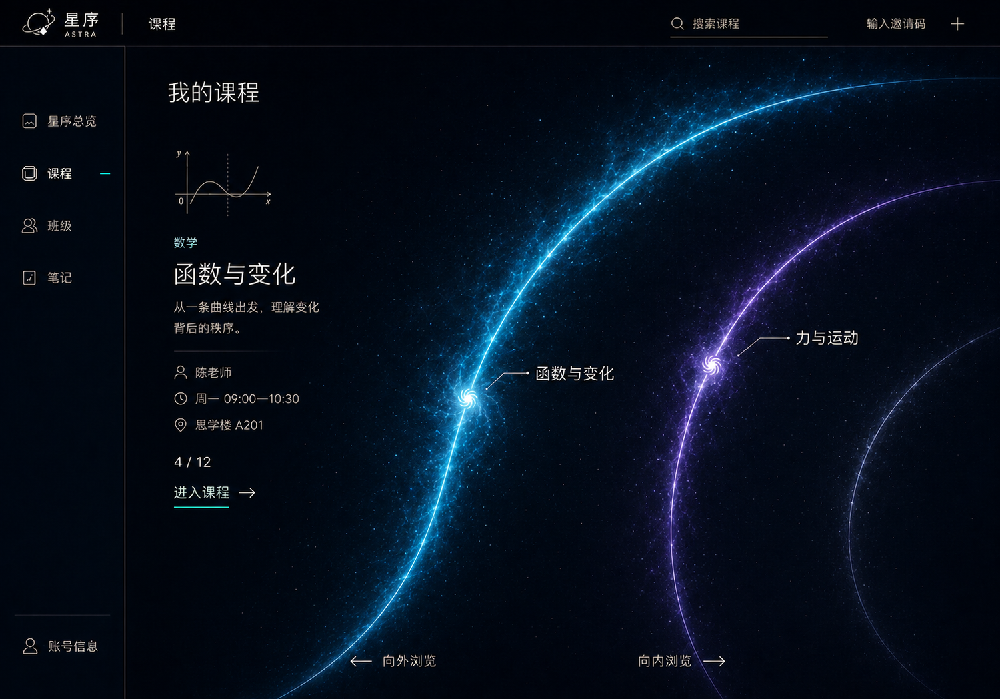
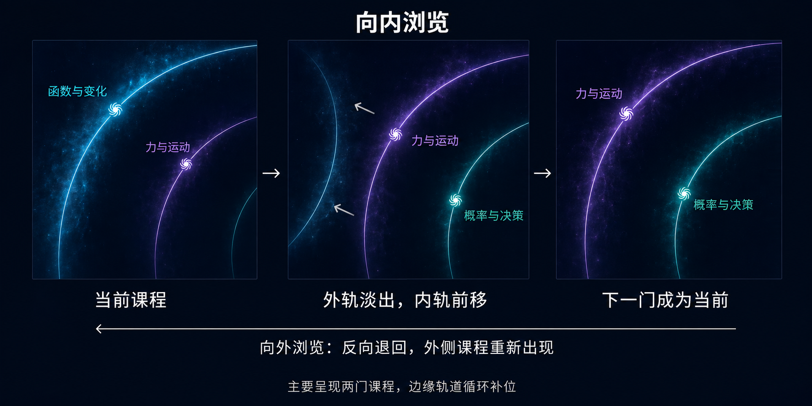

# 星序 Astra — UI 规范与实验视觉约定

> **文档梗概**：学术门户、职教页面与保留实验的视觉、交互和可访问性约定。
>
> **具体规划法则**：样式数值以代码为准；本文件解释设计意图和跨页面规则。旧概念图、旧签收流水和被替换的页面壳不作为当前规范。
>
> **最后一次更新时间**：2026-09-18
>
> **更新者**：主开发组

## 目录

1. [正式门户](#1-正式门户)
2. [星云与课程轮盘](#2-星云与课程轮盘)
3. [教学页面交互](#3-教学页面交互)
4. [实验视觉与生命周期](#4-实验视觉与生命周期)
5. [验证与边界](#5-验证与边界)

## 1. 正式门户

未登录时，主站在开场后提供学术教育与职业教育两个方向。学术教育进入 `qianduan/` 的登录与三角色页面；职业教育跳转到独立的 `zhijiao/` 站点，目标由 `VITE_VOCATIONAL_APP_URL` 配置。当前默认地址是本机 4173，部署到其他环境时需对应可访问的职教入口，不能把跨站跳转描述为统一登录。接线见 [main.ts](../qianduan/src/main.ts) 与 [environment.ts](../qianduan/src/services/environment.ts)。

学术门户的样式来源是 [styles.css](../qianduan/src/styles.css)、[navigation.css](../qianduan/src/styles/navigation.css)、[workspace.css](../qianduan/src/styles/workspace.css) 和 [portal/styles.css](../qianduan/src/portal/styles.css)。

保留深色空间、冷青色交互点与少量暖色品牌表达；导航透明简洁，减少重复圆角矩形。内容层级优先依靠对齐、间距、字体、细线和留白，不能以增加装饰容器代替结构。

学术门户顶栏为品牌及空间切换、当前页面名称、搜索和必要操作。侧栏随角色提供入口并可收起。学生、教师、管理页面共用视觉语言；后台状态文字要能帮助决策，不向普通用户堆积内部字段。

职教页面围绕课程档案、采访现场、作品和教师复核组织。档案页保留清楚的课程信息与进入动作，现场页面优先呈现当前地点、任务、人物和学习工具；不把星云轮盘复制为职教现场布局。独立样式见 [v2.css](../zhijiao/apps/web/src/v2/v2.css)、[experience-shell.css](../zhijiao/apps/web/src/v2/experience-shell.css)、[student-theme.css](../zhijiao/apps/web/src/v2/student-theme.css) 与 [teacher-theme.css](../zhijiao/apps/web/src/v2/teacher-theme.css)。

## 2. 星云与课程轮盘

学术门户运行时使用程序化三维场景，不使用固定星空图片冒充空间动画。课程轮盘采用局部、多轨、倾斜透视构图：近处间距较大，远处收紧，两门为主、过渡时最多三门。星云和可选课程应与轨迹一致，固定信息区保持可读。

当前构图与换层参考：

它们是设计参考，实际几何、鼠标跟随、动画和释放由 [render](../qianduan/src/render/) 与 [domain](../qianduan/src/domain/) 维护。导航轨迹不作为真实天体动力学结论。

减少动态效果时保留选择和阅读能力；页面隐藏时降低无效绘制，离页释放独占 GPU 资源。图形层不得改变课程身份或学习结果。

## 3. 教学页面交互

- 列表、详情与编辑状态有明确层次；同一操作中只呈现必要信息。
- 加载、空数据、失败、无权限、冲突和只读状态均有清楚文字，不能用空白代替。
- 保存、送审和发布是不同动作；教师明确看到修改的对象和影响。
- 未保存编辑离页前提示；重复点击、网络结果不明或修订冲突不导致静默覆盖和重复写入。
- 学生看到任务、反馈与下一动作；完成、分数和准入以服务端返回为准。
- 键盘焦点清楚，按钮有文字或可访问名称，不能只用颜色区分状态。

学术课程编辑已支持讲解、函数与图表配置、原实验引用、图片/音视频/PDF、单选/多选/数值/简答检查点及作业完成条件。已有题组引用继续保留，当前表单不编辑题组原件。送审页面展示同步差异、冲突选择和旧结果处理方式，学校审核候选快照，教师发布已通过内容。实现见 [course-studio.ts](../qianduan/src/portal/course-studio.ts)、[submission-workspace.ts](../qianduan/src/portal/submission-workspace.ts) 与 [candidate-workspace.ts](../qianduan/src/portal/candidate-workspace.ts)；准确页面范围见 [01 第 5 章](01-开发者手册.md#5-前端页面路由与可见交互)。

学习页面显示所见发布版本和学习记录入口，继续旧版时说明认定边界；不把“回答正确”“获得评阅”“单元完成”合成一个状态。作业页显示本次任务快照、当前稿及可展开的历次记录；重交后同步列表状态。教师选择具体稿件批改，历史复核必须明确选择，原评分与积分差额可回读。未保存状态的验收要求是：子模块只管理自己的输入，保存成功后父页面也不能留下错误离页提示；须通过嵌套表单的真实操作核对。

职教现场的任务、地图、资料、人物交流、采访本和作品入口保持可辨识，工具面板不长期遮住主要观察区域。预设访谈、实时生成、等待教师复核和已确认结果分别标明；请求失败不能显示为已完成交流或交付。

| 体验方式 | 页面必须说明的状态 |
| --- | --- |
| 学术真实服务 | 账号与业务记录由服务端保存；保存失败、冲突和未知结果可辨识 |
| 学术静态演示 | 明确标识内存演示；切换身份用于体验流程，刷新重置业务数据 |
| 职教动态服务 | 区分人物生成结果、学生决定、作品提交和教师评价，不把建议当作既成事实 |
| 职教公开导览 | 明确标识预设访谈片段；笔记与草稿保存于当前浏览器，导出不等于提交或评分 |

公开导览的现有说明见 [public-demo/main.tsx](../zhijiao/apps/web/src/public-demo/main.tsx)。这些模式分别说明，不把动态服务能力写成公开导览已具备的能力。

## 4. 实验视觉与生命周期

原实验的 [tokens.css](../shared/css/tokens.css) 与代码空间私有样式继续保留，不把正式门户全局样式注入各个实验。每个新实验明确 page/module/namespace，避免 CSS 和全局对象冲突。

公共学习空间与原活动资源预览保留 iframe；课程中的原实验通过“进入完整实验”整页打开，函数与图表模板在课程正文中呈现。页面导航与课程记录分别验收：当前原力学实验整页入口尚未接回发布绑定的参数记录，具体范围与源码见 [15 第 2.4 节](01-子文档/15-学科实验与内容开发指南.md#24-课程资源与操作记录接线)。

Canvas 依据实际容器尺寸与像素密度绘制，不能把边框高度反复写回父容器造成 ResizeObserver 递增。标签、单位、图例和对比读数应足够清晰；科学计算与渲染表现分开，结果变化必须可解释。

实验进入后能操作、暂停或重置；退出取消 rAF、监听、观察器、定时器和专有图形资源。模型公式、适用范围、数值误差和复核说明统一放在 [15 号指南](01-子文档/15-学科实验与内容开发指南.md)，不把长篇开发说明塞进学生首屏。

新实验模板仍提供基本响应式、触控和 reduced-motion 检查；这些行为回归不因门户当前桌面优先而删除。

## 5. 验证与边界

学术门户与职教页面以桌面为主要设计和验收环境，手机端精调尚未作为本轮交付。键盘操作、焦点、基础触控和减少动态效果仍需可用。修改导航、编辑或实验操作时验证真实浏览器路径、关键尺寸、错误状态与离页重入；截图只能证明当时画面，不能代替权限或业务验证。当前已知问题与后续验收见 [02 第 3 节](02-更新规划.md#3-当前任务状态)。

既有实验保护规则和科学模型门禁继续运行。历史的固定行数、旧签收日期、旧代表课路线不构成新的设计目标；改动范围由当前任务与用户授权决定。
