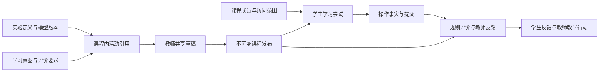
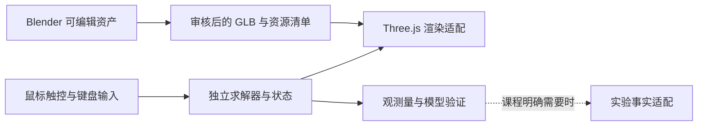

# 星序 Astra — Web 与后端架构审查与重构路线

> 该文档隶属于[07-后端优化与设计](../07-后端优化与设计.md)，保存本轮跨前后端设计判断；任务和实施状态只在 [02-更新规划](../02-更新规划.md#3-当前任务状态) 维护。
>
> **审查日期**：2026-09-05　**更新者**：ARCH组（主开发单线）
>
> **事实起点**：`主开发@b886829 / V8.6.6`。本文明确区分已有实现、本轮工作区修正和后续设计；没有宣布新产品版本。

## 目录

1. [核心判断](#1-核心判断)
2. [阅读范围与实现证据](#2-阅读范围与实现证据)
3. [需要优先解决的问题](#3-需要优先解决的问题)
4. [产品与对象边界](#4-产品与对象边界)
5. [Web 架构演进](#5-web-架构演进)
6. [后端架构演进](#6-后端架构演进)
7. [3D 与实验体验路线](#7-3d-与实验体验路线)
8. [毕业设计的创新与验证](#8-毕业设计的创新与验证)
9. [实施顺序与退出条件](#9-实施顺序与退出条件)
10. [本轮整理与验证边界](#10-本轮整理与验证边界)

## 1. 核心判断

星序应该围绕一个问题构建：**如何让学生通过可操作的模型探索知识，并让教师组织、理解和评价这一过程？**

交互实验与教学管理是同一产品的两项核心能力。实验提供现象、变量、工具和反馈；课程说明为什么做、如何比较、如何提交和如何评价。两者通过清晰的活动契约连接，能够分别演进。不能为了管理流程把实验变成连续填表，也不能只有丰富动画而无法解释学习结果。

现有基础值得继续投入：单一业务后端、稳定活动身份、课程准入、共享草稿、不可变发布、幂等证据、三角色工作台和大量自动化已经存在。主要瓶颈是领域语义与旧实现之间的缠绕，以及内容深度、统计口径和维护方式的不一致。继续叠加功能数量或治理工具不会自动解决这些问题。

本轮采用的方向是：**模块化单体后端、按业务功能组织的 Web 客户端、独立实验运行时、可追溯的课程发布与评价**。允许重构，先从能验证收益的完整切片开始。微信小程序暂不设计。

## 2. 阅读范围与实现证据

审查以 00—03 主文档、07 后端设计为入口，沿课程创建、成员、内容发布、学习结果和工作台主链核对 11—19 实现说明；追溯 21、23、24、27 等历史契约中的相关设计与后续覆盖关系，并参考 06 号实验审查、UI 规范和当前实验源码。历史发布分卷用于定位版本，不逐条重复旧审批流水。未进行 127 项实验逐页视觉或科学模型复审。

| 事实 | 核验来源 | 判断 |
| --- | --- | --- |
| 90 / 18 / 19，共 127 个活动身份 | `shared/js/config.js`、`experiment-registry.js`、`learning-activity-catalog.js`、Code Space / Future manifest，活动保护合同 | 数量是目录口径；不能等同于 127 个同等深度、彼此独立的实验或完整课程 |
| 主站为 Vanilla JS SPA，代码空间是独立子站 | `index.html`、`shared/js/router.js`、`page-registry.js`、`codevis/` | 需要统一应用服务与领域协议，不必先把所有页面迁入同一框架 |
| 课程、成员、内容发布与完成规则已落地 | `backend/app/services/course_authoring.py`、`course_enrollments.py`、`content_platform.py`、`course_completion.py` | 后端具备真实业务闭环，不需要推倒重建基础 CRUD |
| 59 个 ORM 表声明、58 个迁移脚本，唯一 head 为 `20260825_0058` | `backend/app/models/`、`backend/alembic/versions/` | 工程范围已经较大；数量本身不说明架构优秀或过度设计 |
| 壳 HTML 为 268,042 字节、3,758 行；最长单行 4,323 字符 | 审查起点的 `index.html`；双摆、色谱、机械臂压缩片段 | 行数门禁已经影响源代码表达方式，应替换为职责与行为约束 |
| 大型文件仍集中承担多种职责 | `teacher.js` 2,883 行；`admin.js` 2,485 行；`student-workbench.js` 2,378 行；`services/learning_evidence.py` 2,083 行 | 应按变更原因拆分，不能只增加外围文件而继续由巨型入口统管所有状态 |
| 不可变发布已冻结正文、单元、规则与媒体摘要 | `content_platform.py::create_course_release`、`models/content_platform.py` | 是可深化的特色；但媒体摘要并不等同于渲染资产与求解器字节均已冻结 |

以上行数和体积是本次静态测量，不是性能跑分。当前运行能力与维护说明仍以 [01-开发者手册](../01-开发者手册.md) 为准。

## 3. 需要优先解决的问题

### 3.1 课程完成统计混用了不同人群与版本

审查起点的 `workbench.py::_admin_teaching_snapshot` 用所有课程完成投影作分子，却用当前在读人数乘最新发布单元数作分母；学生工作台也未按当前发布规则和单元集合过滤历史完成。`min(100, ...)` 只能限制显示范围，不能修正语义。

三个隔离回归已在旧实现上失败：

- 两名在读学生，一人完成一个单元，进度为 50%；完成者退课后，剩下一名尚未完成的学生，旧统计仍计入那条完成。
- 教师更换完成规则并发布后，旧规则的完成继续显示为新版本完成。
- 同一活动在另一班级范围保留历史投影时，管理员完成数重复计算。

**本轮已修正工作区实现**：新增 `services/course_learning_metrics.py`，学生和管理员共用“当前在读成员 × 最新 release 单元 × 当前发布及班级绑定规则 × 课程内部教学范围”的去重完成集合。`completed` 与 `transferred` 采用一致口径；历史事实保持原样。只改正文且复用原规则的发布保留既有完成；修改规则后不自动授予新规则完成。详细实现和验证入口见 [19 号业务说明](../01-子文档/19-当前功能业务闭环与展示边界.md#1-当前课程学习统计)。

### 3.2 实验身份与课程内活动身份仍然耦合

`models/course.py::CourseUnit` 对 `(course_id, activity_key)` 设置唯一约束；`course_completion.py::_completion_activity_definition` 的实验操作预设要求 `simulationKey == unit.activity_key`。这限制了同一课程对同一实验的多次教学使用，例如先做“碰撞观察”，之后再次用同一模拟做“参数设计与论证”。

需要逐步区分课程内单元身份与被引用的实验资源身份。保留旧 `activity_key` 作为兼容标识，未来新增明确的课程内活动键和实验引用，提供迁移映射。迁移前先验证重复引用、旧事件回读和历史版本；不能直接重命名已有活动键。

### 3.3 完成、正确与掌握需要分开

当前 `experiment_operation` 以受理的 `attempted` 满足操作要求；检查点由服务端判分；指定作业经 `graded` 或 `returned` 及分数/反馈形成完成事实。它们可以描述不同教学流程，但不能统一解释成“学会了”。

建议在展示与评价模型中区分：流程完成、答案正确性、教师评价与证据充分程度。被退回的作业应同时明确“教师已反馈，仍需修改”；任何掌握判断都要说明适用规则和依据。课程健康的 `healthy` 目前表示没有列出的待处理事项，不是教学效果良好。

### 3.4 课程范围仍依赖旧班级模型的兼容层

本轮替换单元回归还复现了这一兼容问题的具体后果：旧单元的班级计划保留排序位置，新单元再次使用该位置，草稿保存返回 500。已由 BE-032 修正默认计划的空闲位置分配，保留历史计划与原事务；这也说明后续应明确区分草稿顺序和教学计划顺序。

`CourseEnrollment` 已成为课程成员真值，但发布、作业与学习证据仍通过隐藏 `course_cohort` 接到旧 `class_id` 体系。这个过渡方案可运行，也避免了大规模一次性迁移；问题是它容易让新代码把行政班、选课关系与教学范围混在一起。

短期把内部范围解析集中到服务边界；新业务使用明确的课程上下文，前端不自行拼装隐式群组。中期再评估是否需要独立授课批次/教学实例，只有确实需要同一课程跨学期、跨班级独立发布时才增加模型。不要先照着大型 LMS 建全套概念。

### 3.5 壳、状态、协议与内容存在多处映射

活动目录和页面注册已有单一所有者的设计，但为了兼容历史又出现目录映射、能力注册、缓存代际及多个运行时适配。`learning-activity.js` 的抽象内核已存在，也已有完整恢复设计，不能再造一个同名内核；应先确认产品页实际消费哪些能力，再做统一接入或收缩。

新增领域数据优先从正式 schema 与清单派生，减少手工复制字符串。编译检查应帮助保证 DTO 与资源身份一致，避免让测试长期依赖某段中文说明或精确实现拼写。

### 3.6 行数冻结与绝对冻结妨碍了正确重构

独立生命周期、越权、幂等、数值边界和旧活动保护都是有价值的门禁；“某文件永远不能增加一行”“某实验永远不能改”则属于阶段约束。现有壳已出现为守住行数而压缩 HTML 的证据。

应保留可读源文件，按单一职责、依赖方向、公共接口、资源释放和用户行为做验收。调整门禁时保留它原来防止的回归，不通过改基线、删断言或降低期望值掩盖问题。本轮只改协作规则，尚未改动活动保护器或架构检查器。

### 3.7 后端治理深度与教学特色投入不均衡

项目已实现脚本扫描、出站投递、审计锚定、后台任务租约和目标部署证明等较完整能力。它们有工程价值，但当前产品最需要进一步证明的是实验与课程如何协作、结果怎样解释，以及教师怎样低成本组织一次学习。

这些基础能力继续维护；下一阶段主要开发量用于教学主链和交互品质。不能用治理模块数量、数据库表数量或测试条数代替毕业设计创新论证。

### 3.8 发布可追溯还应覆盖实验与媒体版本

`content_platform.py::_media_snapshot` 当前保存 `asset_key`、媒体类型、替代文本和说明；这不是完整的资产内容寻址。实验页面也主要通过稳定键进入当前部署的运行时代码。

后续要做到“可复现实验结果”，发布包还应关联实验模型版本、参数契约、必要资源摘要和评价规则版本。历史课程可以引用旧版本，或明确说明已更新到兼容运行时；不能只冻结 JSON 就宣称当年的画面与计算一定可以完全复现。

## 4. 产品与对象边界

以下为后续演进的概念模型，不表示本轮已经增加了这些表或接口。

| 概念 | 负责什么 | 与当前实现的关系 |
| --- | --- | --- |
| 实验定义 | 模型、变量、单位、可观察量、渲染资源、适用条件 | 收敛现有实验注册、模型记录和资源清单 |
| 课程内活动 | 学习意图、实验引用、初始参数、观察任务、评价要求 | 从现有 `CourseUnit` 和内容块演进；同一实验可被多次引用 |
| 课程 | 教师协作、内容组织、成员准入 | 保留现有 Course 与 Enrollment 体系 |
| 发布版本 | 冻结教学内容、规则及必要运行版本 | 深化现有 CourseRelease；草稿和历史仍分离 |
| 学习尝试 | 某位学生在确定课程、单元和版本下的一次操作或提交 | 优先复用现有 activity runtime 与 checkpoint/submission 标识 |
| 证据与评价 | 参数、观测、解释、教师反馈和规则派生结果 | 保留事实；评价规则变更不覆盖原事实 |



产品同时提供自由探索与课程学习两种入口。自由探索保留快速进入、直接操作与清晰反馈；课程任务通过轻量侧栏或独立任务页提供背景、记录和提交，不强制占据实验首屏。跨页时课程上下文、运行状态和评价状态各自有明确所有者。

## 5. Web 架构演进

### 5.1 三个区域使用不同的信息密度

- 探索入口：星系与学科导航、搜索、可理解的内容介绍，帮助找到实验。
- 实验工作区：画面、工具、参数和观察结果优先；支持撤销或重置、暂停、测量与对比。
- 教学工作区：课程、任务、反馈、审核和异常处理优先。教师先看到待办，管理员先看到可行动事项。

保留星序的视觉身份，但不要求管理表格、实验舞台和首页星图使用同一种空间结构。移动 Web 是当前体验的一部分，不等于提前开发小程序。

### 5.2 逐步拆分，不建立第二套状态

先从课程内容中心或工作台选择一个可独立验收的区域，把当前大型 owner 拆成请求服务、课程上下文、纯状态派生、视图及交互绑定。页面 owner 只负责装配与销毁；旧入口通过适配层接入。

`index.html` 中已有独立 `module.html` 原件，应建立可重复的装配步骤并避免同时手工维护两份 DOM。若引入构建工具，先做一个页面的入口、依赖、资源路径和缓存迁移，运行旧路由与同源静态服务回归。是否使用组件框架由这一切片的维护收益决定，不先宣布全站迁移。

实验运行时应具有清晰的模型、输入、渲染、资源生命周期和可选证据适配边界。先审查复用现有 `AstraLearningActivity` / ExperimentRegistry 能力；单纯自由模拟无需承担完整教学事件协议。模型在固定步长或明确的数值条件下执行，渲染仅消费状态，帧率变化不得偷偷改变实验结论。

## 6. 后端架构演进

### 6.1 模块化单体是当前合适的形态

继续使用 FastAPI、SQLAlchemy 和 Alembic，把复杂度放在清晰的领域边界与事务语义中。按路由模块组织大型应用是 FastAPI 支持的常规方式；是否拆成独立服务是业务和部署决定，不能由文件变多自动推出。[FastAPI 多文件应用文档](https://fastapi.tiangolo.com/tutorial/bigger-applications/)

| 领域 | 保留或收敛的现有入口 | 下一步边界 |
| --- | --- | --- |
| 身份与组织 | `auth_sessions.py`、`access_control.py`、教师申请和组织治理 | 身份、角色与资源范围分别判断 |
| 课程协作与准入 | `course_authoring.py`、`course_information_reviews.py`、`course_enrollments.py` | 课程用例统一处理内部群组兼容，不向客户端扩散 |
| 内容与发布 | `content_platform.py`、内容 schema 与 release 模型 | 保持不可变发布，补齐实验/资源版本语义 |
| 学习与评价 | `course_completion.py`、evidence/runtime/projection | 明确事实、流程完成、正确性与教师评价 |
| 查询与工作台 | `workbench.py`、本轮 `course_learning_metrics.py` | 共用统计人群与版本口径，查询不产生第二份真值 |
| 支撑能力 | 后台任务、审计、外部适配器 | 按需使用，不反向主导教学领域设计 |

发布、成员变更和批改继续以完整业务事务执行。抽离服务时，必须写清谁开启、提交或回滚事务，避免下层函数提前提交破坏原子性。SQLAlchemy 的 Session 提供明确事务作用域；实际边界应由用例定义。[SQLAlchemy 事务文档](https://docs.sqlalchemy.org/en/20/orm/session_transaction.html)

### 6.2 统计要能回答四个问题

每个指标都要说明“谁、哪个版本、统计什么、在哪个范围/时间内”。本轮修正的当前课程进度定义为：

```text
E = 当前 active 课程成员
U = 最新发布版本的单元集合
C = 在 E × U 中满足当前发布规则和有效教学范围的去重完成对
课程进度 = |C| / (|E| × |U|)
```

分母为空时显示无可统计进度；它不是能力评分，也不是按开放时间加权的教学效果指标。历史完成总量若需要展示，应单列历史口径，不与当前课程百分比共享一个含糊名称。当前健康矩阵仅列最近更新的六门课程，若要成为全量运营入口，应另做分页、筛选和排序，不把这六门误称全校课程。

后续再对管理员聚合的逐课程查询做批量读取优化，并以查询次数和响应测量验证收益；本轮未声称解决所有聚合性能问题。

## 7. 3D 与实验体验路线

### 7.1 先选择空间表达有收益的实验

| 对象 | 3D 的可能收益 | 取舍 |
| --- | --- | --- |
| 机械臂 | 连杆层级、关节、目标与可达范围直观，适合验证资产与运行时协作 | 第一阶段可保留平面求解器，明确运动限制；真正空间运动学另做模型设计 |
| 分子结构、空间向量 | 旋转观察能帮助理解空间构型、夹角和遮挡 | 适合作为教学价值验证，须保留准确示意与测量 |
| 桥梁受力 | 工程场景可增强代入感 | 杆力与反力主分析继续优先平面图，3D 装饰不能遮挡信息 |
| 二维函数与算法追踪 | 空间变化未必增加理解 | 优先改进操作、标注和反馈，不默认升级 3D |

机械臂是成本相对可控的工程原型，分子或空间向量更适合验证真实空间教学收益。它们是试点选择，不建立新的实验等级体系。

### 7.2 Blender 与浏览器的分工

Blender 用于模型、材质、层级、枢轴、烘焙纹理和必要动作资产；通过 glTF/GLB 交给浏览器。glTF 面向高效传递三维场景，支持网格、材质和动画等内容，但不能据此假定 Blender 中每个约束、着色器或模拟都会原样变成 Web 交互。[Blender 官方 glTF 导入导出说明](https://developer.blender.org/docs/release_notes/2.80/import_export/)



美术模型的关节命名、局部坐标、长度单位、枢轴和绑定方式应进入资源契约。物理量、碰撞或约束仍由明确的运行模型计算。禁止把一段播放动画当成学生参数驱动的科学模拟。

进入实验再加载重资源；离开时释放几何、材质、纹理和渲染器等资源。Three.js 的 GPU 资源需要显式清理，移除场景对象本身并不足够。[Three.js 资源清理文档](https://threejs.org/manual/en/cleanup.html)

试点验收测量真实资源大小、首次可交互时间、持续操作帧时间和反复进出后的资源增长；在指定普通笔记本与移动 Web 视口建立基线后确定预算。当前不虚构已达到 60 fps 或某个设备覆盖率。

### 7.3 像游戏一样灵动的具体含义

让操作立即产生可读反馈；允许拿起、拖动、连接、测量和比较；给出少量清楚目标；允许试错并能回到先前状态。摄像机服务观察，失败帮助理解模型边界。是否加积分、成就或叙事由学习任务决定，不把奖励系统当成互动品质的替代品。

## 8. 毕业设计的创新与验证

建议把论文/答辩主线集中为“面向交互实验的可追溯教学平台设计与实现”。可以形成三项有实物支撑的特色：

1. **实验与课程解耦的教学活动组织**：同一模型服务不同学习意图与评价方式。用重复引用同一实验、不同参数和不同课程规则验证。
2. **可解释且可重算的学习结果**：说明学生做过什么、按哪版规则产生何种结果；纠错和规则更新保留历史。用重复请求、退课、换版、纠错与投影重建验证。
3. **发布前影响分析与版本追溯**：教师能够理解改动影响哪些单元和学习者，明确哪些完成保留、哪些需要重新满足规则。现有版本时光机和影响预演是基础，需要核验范围与规则语义。

这些是本项目的工程特色候选，不宣称学术首创，也不以“AI”或“区块链”包装现有确定性规则。算法指标和教学实证应分开：权限与并发正确、结果可复现、交互可用性可以通过工程测试论证；学习效果提升需要另行设计观察或对照研究，不能由演示数据证明。

早期可让少量学生和教师完成预定操作，记录入口发现、任务完成、误操作、概念误解和反馈理解问题；这是形成性可用性研究。若要写显著学习提升结论，需另行定义样本、前后测、对照和分析方法。

## 9. 实施顺序与退出条件

以下为建议批次，不是新建的正式版本号，也不是全站重构已经完成。

| 批次 | 交付 | 退出条件 |
| --- | --- | --- |
| A：清晰基线 | 指引与文档纠偏、课程统计修正 | 当前行为与历史分开；真实回归暴露旧错误并通过修正 |
| B：核心契约 | 实验引用与课程内活动身份分离方案、评价语义、版本保留策略 | 同一实验可服务两个不同活动；旧课程与事件有可验证迁移路径；不引入第二套完成真值 |
| C：完整切片 | 一门课程的教师编排、学生独立实验、观测提交、教师评价与结果回读 | 三角色使用同一真实数据；自由探索不被任务控件阻断；换版和失败状态可理解 |
| D：体验升级 | 机械臂或空间模型的渲染/求解分离、3D 资产试点与 Web 模块拆分 | 数值验证、桌面/移动 Web、键盘与触控、资源释放和性能预算通过 |

下一步最值得推进的是 B 与 C：把“同一实验、不同教学任务、可解释结果”真正做通，再推广到其他内容。3D 试点可服务同一切片，但不要与全站框架迁移、全库模型迁移和新增十余实验捆在一次改动中。

## 10. 本轮整理与验证边界

### 10.1 文档职责映射

| 原件 | 本轮处理 | 当前职责 |
| --- | --- | --- |
| `.codex/AGENTS.md`、Copilot 指引 | 重写为兼容入口 | 根 `AGENTS.md` 是协作规则唯一原件 |
| README、00、01 | 修正基线与当前方向，增加审查入口 | 概览、定位、真实实现 |
| 02 | 移除已结束周期的执行限制与重复流水，登记本轮任务 | 当前工作与后续顺序 |
| 03 与历史分卷 | 保留既有版本，不虚构本轮发布 | Git 与发布证据 |
| 07 与本 71 子文档 | 给历史设计标明适用期，建立新方案入口 | 设计依据与架构取舍 |
| 21—29、06、09、99 | 原位保留历史契约和审查材料 | 按需追溯，不能自动恢复旧任务 |

Git 初始工作区干净，只有一个根工作树。本轮用 `git branch -d` 删除了 17 个已能从当前 HEAD 到达的旧分支，保留 `main` 与当前 `主开发`。未合并分支与 7 条 stash 保留；它们并不因为旧流程失效就自动成为当前代码。35、39 历史分卷中关于当时分支和现场的记录仍是历史事实。

未合并分支/stash 的删除命令，以及五个测试缓存目录的递归删除命令，均在执行前被自动审批审查以 `blocked by policy` 拒绝，没有更具体的理由。未进行替代工具删除。已补充 `.ruff_cache/` 忽略规则。现有实验截图包含验收记录，未按临时垃圾删除；现有虚拟环境与本机应用数据保留。

### 10.2 验证口径

已核验活动身份、迁移 head、核心模型与调用关系，并以真实课程 API 和隔离 SQLite 测试统计变化。前端工具依赖最初未安装，按现有 lock 执行 `npm ci --ignore-scripts` 后，281 个 JavaScript 语法检查与 82 项前端合同通过；这不等于本轮逐页重新验收了整个产品。

首轮后端修复属于工作区后续独立提交，进度与验证见 [02 当前任务](../02-更新规划.md#3-当前任务状态)。本轮未执行真实 MySQL、公网部署、Blender 建模、完整三角色真实浏览器旅程或真实课堂实验。代码和文档以工作区交付，尚未分配新发布号或创建 Git 提交。

文档规范工具已按兼容模式运行，旧文档的编号、标题和固定回链形式仍有大量规范不兼容项，不能标记为全仓结构校验通过。本轮保留原文件名与发布档案；对实际修改的 Markdown 文件单独检查相对路径、章节锚点与代码围栏，并修正遇到的失效任务锚点。新 71 文档采用编号章节与父文档回链，后续可按主题逐步整理历史长文，不为机械统一打散历史记录。
